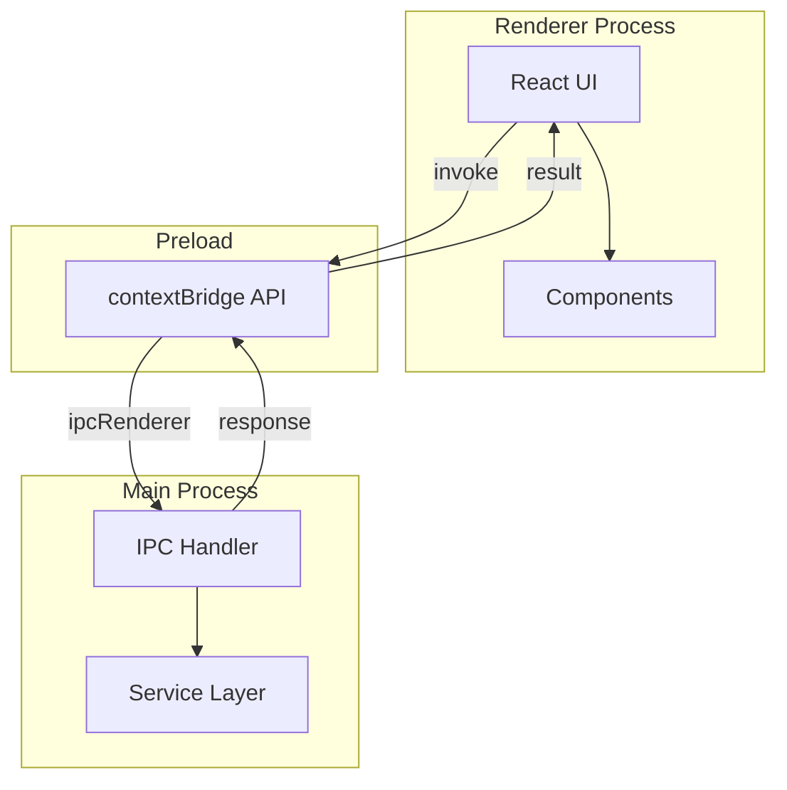

# {機能名} `<MUST>`

**関連 Spec:** [{feature-name}_spec.md](./specification/{feature-name}_spec.md)
**関連 PRD:** [{feature-name}.md](./requirement/{feature-name}.md)

---

# 1. 実装ステータス `<MUST>`

**ステータス:** 🔴 未実装

## 1.1. 実装進捗 `<OPTIONAL>`

| モジュール/機能 | ステータス | 備考 |
|--------------|----------|------|
| [モジュール] | 🟢/🟡/🔴 | [備考] |

---

# 2. 設計目標 `<MUST>`

本設計が達成すべき主要な技術目標を記述します。

---

# 3. 技術スタック `<MUST>`

**なぜその技術を選んだのか** という判断の根拠を明確に残します。

> 以下はプロジェクト共通の技術スタックです。機能固有の追加技術のみ記載してください。

| 領域 | 採用技術 | 選定理由 |
|------|----------|----------|
| [領域] | [技術] | [理由] |

<details>
<summary>プロジェクト共通スタック（参考）</summary>

| 領域 | 採用技術 |
|------|----------|
| フレームワーク | Electron 41 + Electron Forge 7 |
| バンドラー | Vite 5 |
| UI | React 19 + TypeScript |
| スタイリング | Tailwind CSS v4 (`@tailwindcss/postcss`) |
| UIコンポーネント | Shadcn/ui |
| Git操作 | simple-git（予定） |
| エディタ | Monaco Editor（予定） |

</details>

---

# 4. アーキテクチャ `<MUST>`

## 4.1. システム構成図

Electron のマルチプロセスアーキテクチャに基づいて記述します。



## 4.2. モジュール分割

| モジュール名 | プロセス | 責務 | 配置場所 |
|------------|---------|------|---------|
| [名前] | main / preload / renderer | [責務] | `src/...` |

---

# 5. データモデル `<OPTIONAL>`

```typescript
interface SomeEntity {
  id: string;
  name: string;
}
```

---

# 6. インターフェース定義 `<OPTIONAL>`

## 6.1. IPC ハンドラー（メインプロセス側）

```typescript
// src/main.ts または src/main/handlers/
ipcMain.handle('channel-name', async (_event, args: ArgType): Promise<ReturnType> => {
  // ...
});
```

## 6.2. Preload API（contextBridge 経由）

```typescript
// src/preload.ts
contextBridge.exposeInMainWorld('electronAPI', {
  methodName: (args: ArgType) => ipcRenderer.invoke('channel-name', args),
});
```

## 6.3. レンダラー側の型定義

```typescript
// src/types/electron.d.ts
interface ElectronAPI {
  methodName(args: ArgType): Promise<ReturnType>;
}

declare global {
  interface Window {
    electronAPI: ElectronAPI;
  }
}
```

---

# 7. 非機能要件実現方針 `<OPTIONAL>`

| 要件 | 実現方針 |
|------|----------|
| [要件] | [方針] |

---

# 8. テスト戦略 `<OPTIONAL>`

| テストレベル | 対象 | カバレッジ目標 |
|------------|------|------------|
| [レベル] | [対象] | [目標] |

---

# 9. 設計判断 `<MUST>`

## 9.1. 決定事項

| 決定事項 | 選択肢 | 決定内容 | 理由 |
|----------|--------|----------|------|
| [事項] | [肢] | [決定] | [理由] |

## 9.2. 未解決の課題 `<OPTIONAL>`

| 課題 | 影響度 | 対応方針 |
|------|--------|----------|
| [課題] | [度] | [方針] |

---

# 10. 変更履歴 `<OPTIONAL>`

## vX.X

**変更内容:**

- 変更1

**移行ガイド:**

```typescript
// ❌ 旧コード
oldFunction();

// ✅ 新コード
newFunction();
```

---

# セクション必須度の凡例

| マーク | 意味 | 説明 |
|------|------|------|
| `<MUST>` | 必須 | すべての技術設計書で必ず記載してください |
| `<RECOMMENDED>` | 推奨 | 可能な限り記載することを推奨します |
| `<OPTIONAL>` | 任意 | 必要に応じて記載してください |

---

# ガイドライン

## 含めるべき内容

- 実装ステータス・進捗
- 機能固有の技術スタック選定理由
- Electron プロセス間アーキテクチャ（main / preload / renderer）
- IPC ハンドラー / Preload API / 型定義
- モジュール分割とファイル配置
- 設計判断の記録

## 含めないべき内容（→ Spec へ）

- 機能の目的と背景
- ユーザーストーリー・ユースケース
- 公開 API の論理定義（IPC チャネルの抽象定義は Spec）
- データモデルの論理構造
- 機能要件・非機能要件の定義

---

**この Design Doc は、AIエージェントが実装（Implement）フェーズで参照する、具体的なコード生成のための指針となります。**
