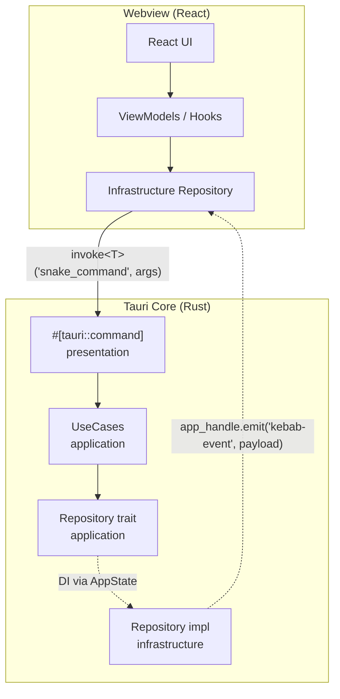

# {機能名} `<MUST>`

**関連 Spec:** [{feature-name}_spec.md](./specification/{feature-name}_spec.md)
**関連 PRD:** [{feature-name}.md](./requirement/{feature-name}.md)

---

# 1. 実装ステータス `<MUST>`

**ステータス:** 🔴 未実装

## 1.1. 実装進捗 `<OPTIONAL>`

| モジュール/機能 | ステータス | 備考 |
|--------------|----------|------|
| [モジュール] | 🟢/🟡/🔴 | [備考] |

---

# 2. 設計目標 `<MUST>`

本設計が達成すべき主要な技術目標を記述します。

---

# 3. 技術スタック `<MUST>`

**なぜその技術を選んだのか** という判断の根拠を明確に残します。

> 以下はプロジェクト共通の技術スタックです。機能固有の追加技術のみ記載してください。

| 領域 | 採用技術 | 選定理由 |
|------|----------|----------|
| [領域] | [技術] | [理由] |

<details>
<summary>プロジェクト共通スタック（参考）</summary>

| 領域 | 採用技術 |
|------|----------|
| フレームワーク | Tauri 2.x |
| バックエンド言語 | Rust (edition 2021+) |
| バンドラー | Vite 6 |
| UI | React 19 + TypeScript 5.x |
| スタイリング | Tailwind CSS v4 (`@tailwindcss/postcss`) |
| UIコンポーネント | Shadcn/ui |
| Git 操作 | `tokio::process::Command` 経由の `git` CLI |
| ファイル監視 | `notify` + `notify-debouncer-full` crate |
| 永続化 | `tauri-plugin-store` |
| ダイアログ | `tauri-plugin-dialog` |
| エディタ | Monaco Editor |
| Rust 非同期 | `tokio` |
| Rust エラー | `thiserror` + `AppError` enum |
| Rust テスト | `cargo test` + `mockall` |
| TS テスト | Vitest + Testing Library |
| DI (Webview) | VContainer |
| DI (Rust) | `tauri::State<T>` + `Arc<dyn Trait>` |

</details>

---

# 4. アーキテクチャ `<MUST>`

## 4.1. システム構成図

Tauri の Webview ↔ Core アーキテクチャに基づいて記述します。



## 4.2. モジュール分割

| モジュール名 | 境界 | 責務 | 配置場所 |
|------------|------|------|---------|
| [Rust モジュール名] | Rust (Tauri Core) | [責務] | `src-tauri/src/features/{feature}/...` |
| [TS クラス名] | TypeScript (Webview) | [責務] | `src/features/{feature}/...` |

---

# 5. データモデル `<OPTIONAL>`

```typescript
interface SomeEntity {
  id: string;
  name: string;
}
```

---

# 6. インターフェース定義 `<OPTIONAL>`

## 6.1. Tauri Command（Rust presentation 層）

```rust
// src-tauri/src/features/{feature}/presentation/commands.rs
use tauri::State;
use crate::state::AppState;
use crate::error::AppResult;
use super::super::domain::{ArgType, ReturnType};

#[tauri::command]
pub async fn some_command(
    state: State<'_, AppState>,
    args: ArgType,
) -> AppResult<ReturnType> {
    state.some_usecase.invoke(args).await
}
```

`src-tauri/src/lib.rs` の `invoke_handler!` に登録します。

```rust
.invoke_handler(tauri::generate_handler![
    features::{feature}::presentation::commands::some_command,
])
```

## 6.2. Invoke クライアント（TypeScript infrastructure 層）

```typescript
// src/features/{feature}/infrastructure/repositories/some-default-repository.ts
import { invokeCommand } from '@/shared/lib/invoke'
import type { ArgType, ReturnType } from '@/shared/domain'
import type { SomeRepository } from '../../application/repositories'

export class SomeDefaultRepository implements SomeRepository {
  async doSomething(args: ArgType): Promise<ReturnType> {
    const result = await invokeCommand<ReturnType>('some_command', { args })
    if (!result.success) {
      throw new Error(result.error.message)
    }
    return result.data
  }
}
```

## 6.3. イベント購読（Core → Webview）

```rust
// Rust 側: event を emit
use tauri::{AppHandle, Emitter};

app_handle.emit("some-event", payload)
    .map_err(|e| AppError::Internal(e.to_string()))?;
```

```typescript
// TypeScript 側: listen で購読
import { listenEvent } from '@/shared/lib/invoke'

const unlisten = await listenEvent<EventPayload>('some-event', (payload) => {
  // handle event
})

// クリーンアップ
unlisten()
```

---

# 7. 非機能要件実現方針 `<OPTIONAL>`

| 要件 | 実現方針 |
|------|----------|
| [要件] | [方針] |

---

# 8. テスト戦略 `<OPTIONAL>`

| テストレベル | 対象 | カバレッジ目標 |
|------------|------|------------|
| [レベル] | [対象] | [目標] |

---

# 9. 設計判断 `<MUST>`

## 9.1. 決定事項

| 決定事項 | 選択肢 | 決定内容 | 理由 |
|----------|--------|----------|------|
| [事項] | [肢] | [決定] | [理由] |

## 9.2. 未解決の課題 `<OPTIONAL>`

| 課題 | 影響度 | 対応方針 |
|------|--------|----------|
| [課題] | [度] | [方針] |

---

# セクション必須度の凡例

| マーク | 意味 | 説明 |
|------|------|------|
| `<MUST>` | 必須 | すべての技術設計書で必ず記載してください |
| `<RECOMMENDED>` | 推奨 | 可能な限り記載することを推奨します |
| `<OPTIONAL>` | 任意 | 必要に応じて記載してください |

---

# ガイドライン

## 含めるべき内容

- 実装ステータス・進捗
- 機能固有の技術スタック選定理由
- Tauri Webview ↔ Core アーキテクチャ
- `#[tauri::command]` 定義 / invoke クライアント / listen 購読 / 型定義
- Rust 側 4 層構成 (domain / application / infrastructure / presentation) のモジュール分割
- TypeScript 側 4 層構成のモジュール分割
- 設計判断の記録

## 含めないべき内容（→ Spec へ）

- 機能の目的と背景
- ユーザーストーリー・ユースケース
- 公開 API の論理定義（Tauri command / event の抽象定義は Spec）
- データモデルの論理構造
- 機能要件・非機能要件の定義

---

**この Design Doc は、AIエージェントが実装（Implement）フェーズで参照する、具体的なコード生成のための指針となります。**
