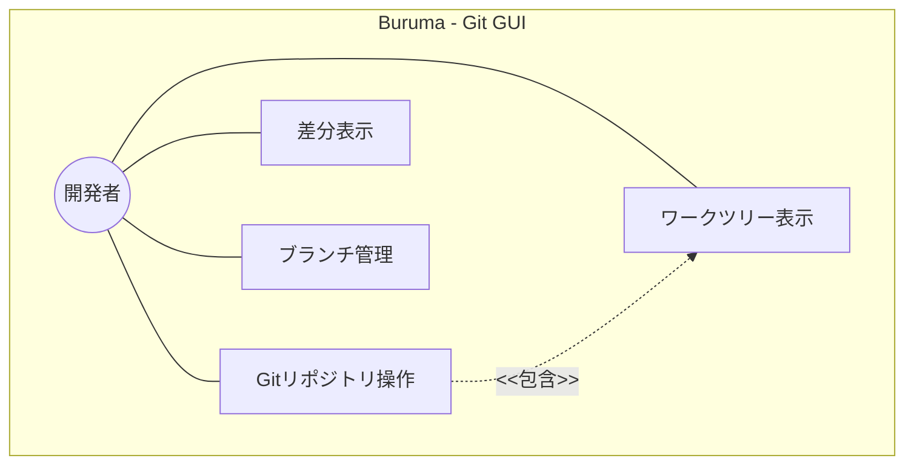
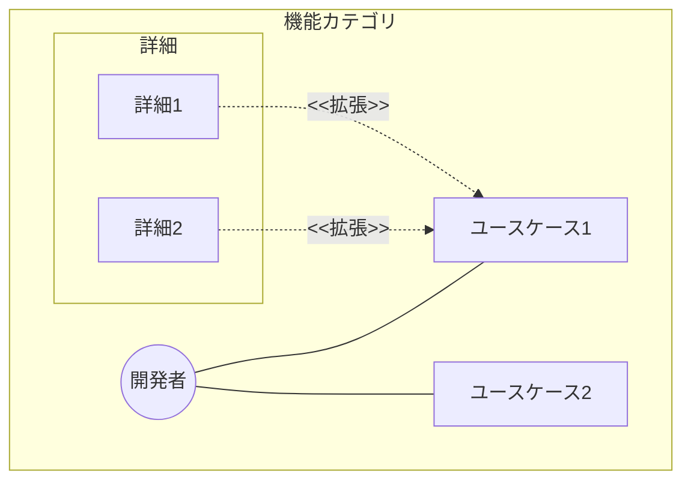
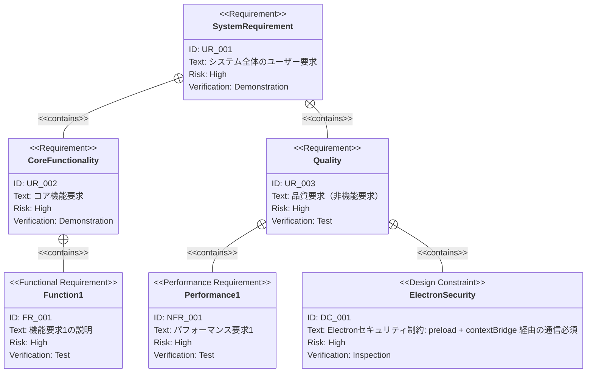
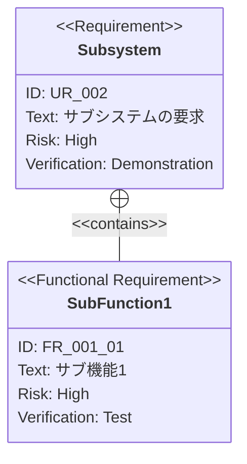

# {機能名} 要求仕様書 `<MUST>`

## 概要 `<MUST>`

このドキュメントの目的と対象範囲を簡潔に説明します。

---

# 1. 要求図の読み方 `<RECOMMENDED>`

## 1.1. 要求タイプ

- **requirement**: 一般的な要求（ユーザー要求）
- **functionalRequirement**: 機能要求（Git操作、UI操作、IPC通信など）
- **performanceRequirement**: パフォーマンス要求（応答時間、メモリ使用量など）
- **interfaceRequirement**: インターフェース要求（IPC API、UI仕様など）
- **designConstraint**: 設計制約（Electronセキュリティ、プロセス分離など）

## 1.2. リスクレベル

- **High**: 高リスク（データ損失の可能性、Git操作の不可逆性）
- **Medium**: 中リスク（UX劣化、パフォーマンス低下）
- **Low**: 低リスク（表示の改善、Nice to have）

## 1.3. 検証方法

- **Analysis**: 分析による検証
- **Test**: テストによる検証（E2Eテスト、ユニットテスト）
- **Demonstration**: デモンストレーションによる検証（UIの動作確認）
- **Inspection**: インスペクション（コードレビュー、セキュリティ監査）

## 1.4. 関係タイプ

- **contains**: 包含関係（親要求が子要求を含む）
- **derives**: 派生関係（要求から別の要求が導出される）
- **satisfies**: 満足関係（要素が要求を満たす）
- **verifies**: 検証関係（テストケースが要求を検証する）
- **refines**: 詳細化関係（要求をより詳細に定義する）
- **traces**: トレース関係（要求間の追跡可能性）

---

# 2. 要求一覧 `<MUST>`

## 2.1. ユースケース図（概要） `<RECOMMENDED>`

## 2.2. ユースケース図（詳細） `<OPTIONAL>`

### {機能カテゴリ}

## 2.3. 機能一覧（テキスト形式） `<MUST>`

- 機能カテゴリ1
    - サブ機能1-1
    - サブ機能1-2
- 機能カテゴリ2
    - サブ機能2-1

---

# 3. 要求図（SysML Requirements Diagram） `<MUST>`

## 3.1. 全体要求図

## 3.2. 主要サブシステム詳細図 `<OPTIONAL>`

### {サブシステム名}

---

# 4. 要求の詳細説明 `<MUST>`

## 4.1. ユーザー要求

### UR_001: {ユーザー要求名}

{ユーザー要求の詳細な説明}

## 4.2. 機能要求

### FR_001: {機能要求名}

{機能の詳細な説明}

**含まれる機能:**

- FR_001_01: {サブ機能1}
- FR_001_02: {サブ機能2}

**検証方法:** テストによる検証

## 4.3. 非機能要求 `<OPTIONAL>`

### NFR_001: {非機能要求名}

{非機能要求の詳細な説明と目標値}

**検証方法:** テストによる検証

## 4.4. 設計制約 `<OPTIONAL>`

### DC_001: Electronセキュリティ制約

メインプロセスとレンダラープロセスの通信は preload + contextBridge を経由すること。レンダラーから Node.js API を直接使用しない。

**検証方法:** インスペクションによる検証

---

# 5. 制約事項 `<OPTIONAL>`

## 5.1. 技術的制約

- Electron 41 + Electron Forge + Vite 5 のビルドチェーンに依存
- `@tailwindcss/vite` は ESM only のため `@tailwindcss/postcss` を使用
- Shadcn/ui は `rsc: false`（Server Components 無効）で使用

## 5.2. ビジネス的制約

- ビジネス的な制約（スケジュール、予算など）

---

# 6. 前提条件 `<OPTIONAL>`

- Git がユーザーの環境にインストール済みであること
- 対象リポジトリへのファイルシステムアクセスが可能であること

---

# 7. スコープ外 `<OPTIONAL>`

以下は本PRDのスコープ外とします：

- この機能に含まれないこと

---

# 8. 用語集 `<RECOMMENDED>`

> **注意**: 用語集が大きくなる場合は、別ファイル（`glossary.md`）として管理することを推奨します。

| 用語 | 定義 |
|------|------|
| ワークツリー | Git worktree。同一リポジトリの複数チェックアウトを管理する仕組み |
| メインプロセス | Electron の Node.js 実行環境。Git 操作等のバックエンド処理を担当 |
| レンダラープロセス | Electron のブラウザ環境。React による UI 表示を担当 |
| IPC | Inter-Process Communication。メインプロセスとレンダラー間の通信 |

---

# セクション必須度の凡例

| マーク | 意味 | 説明 |
|------|------|------|
| `<MUST>` | 必須 | すべてのPRDで必ず記載してください |
| `<RECOMMENDED>` | 推奨 | 可能な限り記載することを推奨します |
| `<OPTIONAL>` | 任意 | 必要に応じて記載してください |

---

# ガイドライン

## 含めるべき内容

- ユースケース図（概要・詳細）
- SysML要求図（requirementDiagram構文）
- 要求の詳細説明（UR/FR/NFR/DC）
- 要求間の関係（contains, derives, satisfies, verifies, refines, traces）
- 制約事項・前提条件
- スコープ外の明示
- 用語集

## 含めないべき内容（→ Spec / Design Doc へ）

- 技術的な実装詳細
- アーキテクチャ・モジュール構成
- 技術スタックの選定
- API定義・型定義
- IPC チャネルの設計

---

**このPRDは、AIエージェントが仕様化（Specify）フェーズで参照する、ビジネス要求の真実の源となります。**
