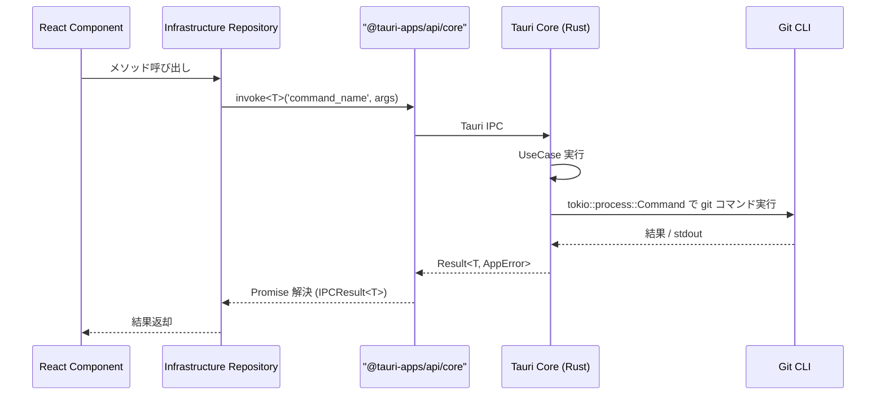

# {機能名} `<MUST>`

**関連 Design Doc:** [{feature-name}_design.md](./specification/{feature-name}_design.md)
**関連 PRD:** [{feature-name}.md](./requirement/{feature-name}.md)

---

# 1. 背景 `<MUST>`

なぜこの機能が必要なのかを説明します。

# 2. 概要 `<MUST>`

機能の目的と主要な設計原則を説明します。
**技術的な実装詳細は含めず、「何を実現するか」に焦点を当てます。**

# 3. 要求定義 `<RECOMMENDED>`

## 3.1. 機能要件 (Functional Requirements)

| ID | 要件 | 優先度 | 根拠 |
|--------|------|------|------|
| FR-001 | [要件] | 必須 | [理由] |

## 3.2. 非機能要件 (Non-Functional Requirements) `<OPTIONAL>`

| ID | カテゴリ | 要件 | 目標値 |
|---------|------|------|------|
| NFR-001 | 性能 | [要件] | [目標] |

# 4. API `<MUST>`

## 4.1. IPC API（Tauri Core ↔ Webview）

Tauri の invoke（Webview → Core）と emit（Core → Webview）で公開する API を定義します。

### 4.1.1. Commands（Webview → Core, `invoke`）

Command 名は **snake_case**（Rust 関数命名規約）で定義します。

| Command 名 | 概要 | 引数（TypeScript） | 戻り値（TypeScript） |
|-----------|------|------------------|-------------------|
| `{command_name}` | [概要] | `{ field: string }` | `Promise<ReturnType>` |

### 4.1.2. Events（Core → Webview, `emit` / `listen`）

Event 名は **kebab-case**（Tauri の慣例）で定義します。

| Event 名 | 概要 | ペイロード（TypeScript） |
|---------|------|---------------------|
| `{event-name}` | [概要] | `EventPayloadType` |

## 4.2. React コンポーネント API

| コンポーネント | Props | 概要 |
|--------------|-------|------|
| `{Component}` | [Props型] | [概要] |

## 4.3. 型定義 `<OPTIONAL>`

```typescript
// Command の引数・戻り値型
interface {Feature}Args {
  field: string;
}

interface {Feature}Result {
  data: string;
}

// データモデル
interface {Model} {
  id: string;
  // ...
}
```

# 5. 用語集 `<OPTIONAL>`

| 用語 | 説明 |
|------|------|
| [用語] | [説明] |

# 6. 使用例 `<RECOMMENDED>`

```typescript
import { invoke } from '@tauri-apps/api/core'
import { listen, type UnlistenFn } from '@tauri-apps/api/event'

// Command 呼び出し
const result = await invoke<ReturnType>('some_command', { field: value })

// Event 購読
const unlisten: UnlistenFn = await listen<EventPayload>('some-event', (e) => {
  console.log(e.payload)
})

// React コンポーネントの使用例
<SomeComponent prop={value} />
```

# 7. 振る舞い図 `<OPTIONAL>`

Tauri の IPC 通信（invoke / emit）を含む振る舞いを記述します。



# 8. 制約事項 `<OPTIONAL>`

- Webview から OS API（fs / process / shell / child_process）に直接アクセスしない
- Git 操作は必ず Rust 側で実行する
- Tauri command / event は型安全なラッパー（`src/shared/lib/invoke/`）を経由する

---

# セクション必須度の凡例

| マーク | 意味 | 説明 |
|------|------|------|
| `<MUST>` | 必須 | すべての仕様書で必ず記載してください |
| `<RECOMMENDED>` | 推奨 | 可能な限り記載することを推奨します |
| `<OPTIONAL>` | 任意 | 必要に応じて記載してください |

---

# ガイドライン

## 含めるべき内容

- 機能の目的と背景
- Tauri command / event の API 定義（command 名、引数、戻り値、ペイロード）
- React コンポーネントの公開インターフェース
- データモデルの論理構造
- Webview ↔ Tauri Core 間通信を含む振る舞い図
- 機能要件・非機能要件

## 含めないべき内容（→ Design Doc へ）

- 実装ステータス・進捗
- 技術スタックの選定理由
- モジュール構成・ファイル配置
- 実装パターン・デザインパターンの適用
- テスト戦略・カバレッジ目標
- 設計判断の記録

---

**この仕様書は、AIエージェントが仕様化（Specify）フェーズで参照する、システム構造と振る舞いの真実の源となります。**
