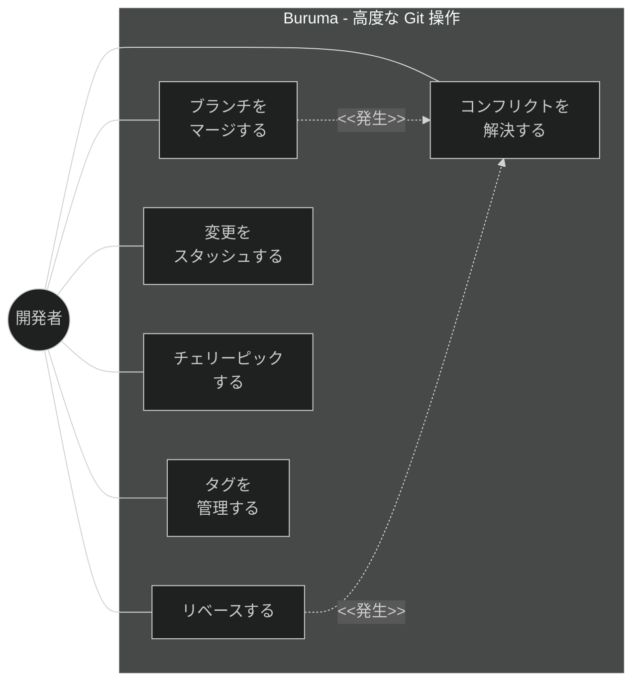
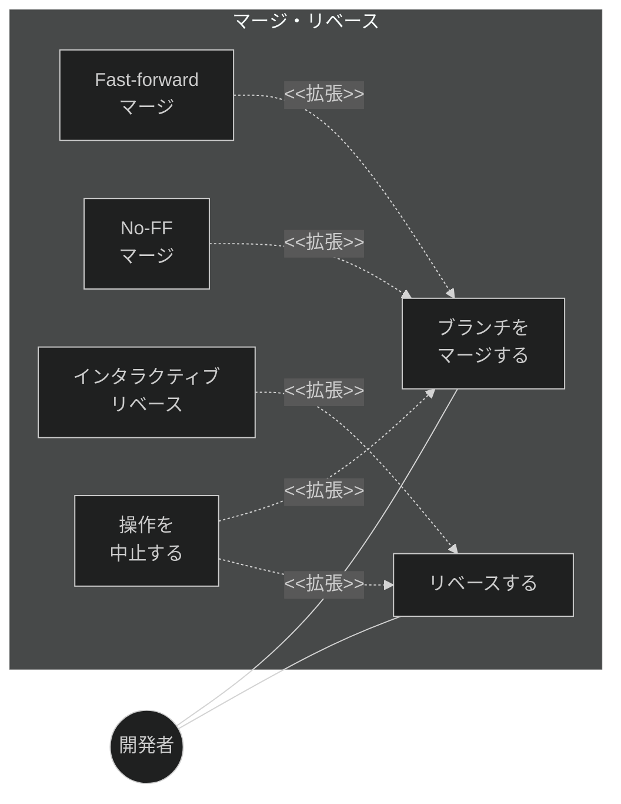
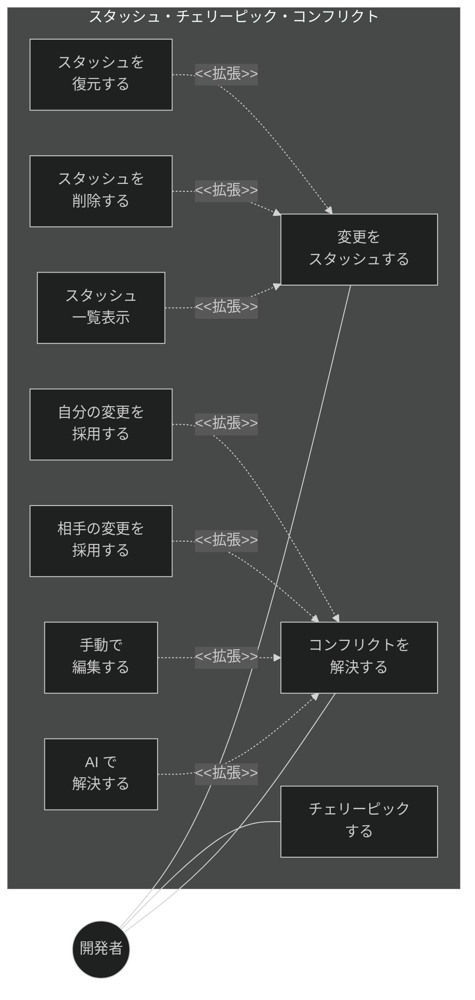

# 高度な Git 操作 要求仕様書

## 概要

本ドキュメントは、マージ、リベース、スタッシュ、チェリーピック、コンフリクト解決、タグ管理などの上級 Git 操作に関する要求仕様を定義する。これらは Git 中級者〜上級者が日常的に使用する操作であり、CLI と同等以上の操作性を GUI で提供する。

---

# 1. 要求図の読み方

## 1.1. 要求タイプ

- **requirement**: 一般的な要求（ユーザー要求）
- **functionalRequirement**: 機能要求（Git操作、UI操作、IPC通信など）
- **performanceRequirement**: パフォーマンス要求（応答時間、メモリ使用量など）
- **interfaceRequirement**: インターフェース要求（IPC API、UI仕様など）
- **designConstraint**: 設計制約（IPC セキュリティ、プロセス分離、データ永続化など）

## 1.2. リスクレベル

- **high**: 高リスク（データ損失の可能性、Git操作の不可逆性）
- **medium**: 中リスク（UX劣化、パフォーマンス低下）
- **low**: 低リスク（表示の改善、Nice to have）

## 1.3. 検証方法

- **analysis**: 分析による検証
- **test**: テストによる検証（E2Eテスト、ユニットテスト）
- **demonstration**: デモンストレーションによる検証（UIの動作確認）
- **inspection**: インスペクション（コードレビュー、セキュリティ監査）

## 1.4. 関係タイプ

- **contains**: 包含関係（親要求が子要求を含む）
- **derives**: 派生関係（要求から別の要求が導出される）
- **satisfies**: 満足関係（要素が要求を満たす）
- **verifies**: 検証関係（テストケースが要求を検証する）
- **refines**: 詳細化関係（要求をより詳細に定義する）
- **traces**: トレース関係（要求間の追跡可能性）

---

# 2. 要求一覧

## 2.1. ユースケース図（概要）

## 2.2. ユースケース図（詳細）

### マージ・リベース

### スタッシュ・チェリーピック・コンフリクト解決

## 2.3. 機能一覧（テキスト形式）

- マージ
    - ブランチのマージ実行（fast-forward / no-ff 選択）
    - マージの中止（abort）
- リベース
    - 通常リベース
    - インタラクティブリベース（コミット編集・並べ替え・squash）
    - リベースの中止（abort）
- スタッシュ
    - 変更の一時退避（stash save）
    - スタッシュの復元（stash pop/apply）
    - スタッシュの削除（stash drop）
    - スタッシュ一覧表示
- チェリーピック
    - 特定コミットの適用
    - 複数コミットの一括チェリーピック
- コンフリクト解決
    - コンフリクトファイルの一覧表示
    - 3ウェイマージ表示（ours / theirs / merged）
    - ours/theirs 一括採用
    - 手動編集による解決
    - AI による自動解決（Claude Code 連携）
    - 解決済みマーク
- タグ管理
    - タグの作成（lightweight / annotated）
    - タグの削除
    - タグ一覧表示

---

# 3. 要求図（SysML Requirements Diagram）

## 3.1. 全体要求図

```mermaid
requirementDiagram

    requirement AdvancedGitOperations {
        id: UR_401
        text: "高度な Git 操作を GUI から安全かつ効率的に実行できる"
        risk: high
        verifymethod: demonstration
    }

    requirement MergeRebase {
        id: UR_402
        text: "ブランチのマージ・リベースを視覚的に確認しながら実行できる"
        risk: high
        verifymethod: test
    }

    requirement StashManagement {
        id: UR_403
        text: "変更の一時退避と復元をスムーズに行える"
        risk: medium
        verifymethod: demonstration
    }

    requirement ConflictResolution {
        id: UR_404
        text: "マージ/リベース時のコンフリクトを視覚的に解決できる"
        risk: high
        verifymethod: demonstration
    }

    functionalRequirement MergeExecution {
        id: FR_401
        text: "ブランチのマージを実行する（fast-forward/no-ff 選択、中止対応）"
        risk: high
        verifymethod: test
    }

    functionalRequirement RebaseExecution {
        id: FR_402
        text: "インタラクティブリベースを提供する（コミット編集・並べ替え・squash・中止）"
        risk: high
        verifymethod: test
    }

    functionalRequirement StashOperations {
        id: FR_403
        text: "変更の一時退避・復元・削除・一覧表示を提供する"
        risk: medium
        verifymethod: test
    }

    functionalRequirement CherryPickExecution {
        id: FR_404
        text: "特定コミットを選択して現在のブランチに適用する"
        risk: medium
        verifymethod: test
    }

    functionalRequirement ConflictResolutionUI {
        id: FR_405
        text: "コンフリクトファイルの3ウェイマージ表示と解決UI（AI 解決含む）を提供する"
        risk: high
        verifymethod: test
    }

    functionalRequirement TagOperations {
        id: FR_406
        text: "タグの作成（lightweight/annotated）・削除・一覧表示を提供する"
        risk: low
        verifymethod: test
    }

    designConstraint ReversibleOperations {
        id: DC_401
        text: "マージ・リベース中は中止（abort）オプションを常に表示し、操作前の状態に戻れることを保証する"
        risk: high
        verifymethod: inspection
    }

    AdvancedGitOperations - contains -> MergeRebase
    AdvancedGitOperations - contains -> StashManagement
    AdvancedGitOperations - contains -> ConflictResolution
    MergeRebase - contains -> MergeExecution
    MergeRebase - contains -> RebaseExecution
    StashManagement - contains -> StashOperations
    ConflictResolution - contains -> ConflictResolutionUI
    AdvancedGitOperations - contains -> CherryPickExecution
    AdvancedGitOperations - contains -> TagOperations
    performanceRequirement MergeRebasePerformance {
        id: NFR_401
        text: "マージ・リベース操作の進行状況を500ms以内にフィードバックし、操作完了を30秒以内に通知する"
        risk: medium
        verifymethod: test
    }

    MergeRebase - derives -> ReversibleOperations
    MergeRebase - traces -> MergeRebasePerformance
```

---

# 4. 要求の詳細説明

## 4.1. ユーザー要求

### UR_401: 高度な Git 操作

マージ、リベース、スタッシュ、チェリーピック、コンフリクト解決、タグ管理を GUI から安全かつ効率的に実行できるようにする。操作の途中経過を視覚的にフィードバックし、中止オプションを常に提供する。

### UR_402: マージ・リベース

ブランチのマージとリベースを視覚的に確認しながら実行できるようにする。Fast-forward と no-ff の選択、インタラクティブリベースでのコミット操作を提供する。

### UR_403: スタッシュ管理

変更の一時退避（stash）と復元を直感的に行える。スタッシュの一覧表示、個別の復元・削除をサポートする。

### UR_404: コンフリクト解決

マージやリベース時に発生するコンフリクトを、3ウェイマージ表示で視覚的に解決できるようにする。ours/theirs の一括採用や手動編集を提供する。

## 4.2. 機能要求

### FR_401: マージ実行

ブランチのマージを実行する。

**含まれる機能:**

- FR_401_01: マージ対象ブランチの選択
- FR_401_02: マージ方式の選択（fast-forward / no-ff）
- FR_401_03: マージ実行と結果表示
- FR_401_04: マージの中止（`git merge --abort`）
- FR_401_05: コンフリクト発生時のコンフリクト解決UIへの遷移

**検証方法:** テストによる検証

### FR_402: リベース実行

インタラクティブリベースを含むリベース機能を提供する。

**含まれる機能:**

- FR_402_01: リベース先ブランチ（onto / newbase）の選択
- FR_402_02: インタラクティブリベースのコミット一覧表示
- FR_402_03: コミットの並べ替え・squash・edit・drop 操作
- FR_402_04: リベースの実行と進行状況表示
- FR_402_05: リベースの中止（`git rebase --abort`）
- FR_402_06: 詳細モードで upstream を別途指定し `git rebase --onto <onto> <upstream>` による分岐元付け替えを実行できる

**検証方法:** テストによる検証

### FR_403: スタッシュ操作

変更の一時退避と管理を提供する。

**含まれる機能:**

- FR_403_01: 現在の変更をスタッシュに退避（メッセージ付き）
- FR_403_02: スタッシュ一覧の表示（メッセージ、日時、変更内容プレビュー）
- FR_403_03: スタッシュの復元（pop: 復元後削除 / apply: 復元のみ）
- FR_403_04: スタッシュの個別削除（drop）
- FR_403_05: スタッシュの全削除（clear、確認ダイアログ付き）

**検証方法:** テストによる検証

### FR_404: チェリーピック実行

特定のコミットを選択して現在のブランチに適用する。

**含まれる機能:**

- FR_404_01: コミットログからのコミット選択
- FR_404_02: 単一コミットのチェリーピック（実行前確認ダイアログ付き）
- FR_404_03: 複数コミットの一括チェリーピック
- FR_404_04: コンフリクト発生時のコンフリクト解決UIへの遷移
- FR_404_05: チェリーピックの中止（abort）オプション

**検証方法:** テストによる検証

### FR_405: コンフリクト解決UI

マージ・リベース時のコンフリクトを視覚的に解決するUIを提供する。

**含まれる機能:**

- FR_405_01: コンフリクトファイルの一覧表示
- FR_405_02: 3ウェイマージ表示（ours / theirs / merged result）
- FR_405_03: ours（自分の変更）の一括採用
- FR_405_04: theirs（相手の変更）の一括採用
- FR_405_05: 手動編集による解決
- FR_405_06: 解決済みファイルのマーク（`git add`）
- FR_405_07: 全コンフリクト解決後のマージ/リベース続行
- FR_405_08: AI によるコンフリクト解決（Claude Code 連携、詳細は [claude-code-integration.md](./claude-code-integration.md) FR_506 を参照）

**検証方法:** テストによる検証

### FR_406: タグ管理

タグの作成・削除・一覧表示を提供する。

**含まれる機能:**

- FR_406_01: lightweight タグの作成
- FR_406_02: annotated タグの作成（メッセージ付き）
- FR_406_03: タグの削除（確認ダイアログ付き）
- FR_406_04: タグ一覧の表示（名前、対象コミット、日時）

**検証方法:** テストによる検証

## 4.3. 非機能要求

### NFR_401: マージ・リベースパフォーマンス

マージ・リベース操作の進行状況を500ms以内にフィードバックし、操作完了を30秒以内に通知する。長時間操作の場合は進捗インジケーターを表示する。

**検証方法:** テストによる検証

## 4.4. 設計制約

### DC_401: 操作中止保証制約

マージ・リベース中は中止（abort）オプションを常にUIに表示する。操作前の状態に戻れることを保証し、ユーザーが安全に操作を取り消せるようにする。

**検証方法:** インスペクションによる検証

---

# 5. 制約事項

## 5.1. 技術的制約

- インタラクティブリベースは Git の `GIT_SEQUENCE_EDITOR` 環境変数を利用して実装する必要がある
- 3ウェイマージ表示には Monaco Editor またはカスタムdiff UIが必要

---

# 6. 前提条件

- [basic-git-operations.md](./basic-git-operations.md) の基本 Git 操作機能が実装済みであること
- [repository-viewer.md](./repository-viewer.md) の差分表示機能（FR_203）が利用可能であること

---

# 7. スコープ外

以下は本PRDのスコープ外とする：

- `git bisect` （バグ原因コミットの二分探索）
- `git reflog` の表示
- サブモジュール操作
- `git worktree` 操作（→ FG-1: ワークツリー管理）
- force push（基本 Git 操作のスコープ）

---

# 8. 用語集

| 用語 | 定義 |
|------|------|
| マージ | 2つのブランチの変更を統合すること |
| Fast-forward マージ | 分岐がない場合にポインタを進めるだけのマージ。マージコミットは作成されない |
| No-FF マージ | 常にマージコミットを作成するマージ方式 |
| リベース | コミットを別のベースの上に再適用すること |
| インタラクティブリベース | コミットの順序変更・統合・編集を対話的に行うリベース |
| squash | 複数のコミットを1つにまとめること |
| スタッシュ | 作業中の変更を一時的に退避する仕組み |
| チェリーピック | 特定のコミットを別のブランチに適用すること |
| コンフリクト | マージ/リベース時に同じ箇所に異なる変更があり、自動統合できない状態 |
| 3ウェイマージ | 共通祖先(base)、自分の変更(ours)、相手の変更(theirs)の3つを比較するマージ方式 |
| タグ | 特定のコミットに名前を付けるマーカー |

---

# 要求サマリー

| カテゴリ | 件数 |
|----------|------|
| ユーザー要求 (UR) | 4 |
| 機能要求 (FR) | 6 |
| 非機能要求 (NFR) | 1 |
| 設計制約 (DC) | 1 |
| **合計** | **12** |

| 優先度 | 件数 |
|--------|------|
| 必須 (Must) | 5（UR_401, UR_404, FR_401, FR_405, DC_401） |
| 推奨 (Should) | 5（UR_402, UR_403, FR_402, FR_403, NFR_401） |
| 任意 (Could) | 2（FR_404, FR_406） |

> **採番規則:** 本PRDの要求IDは400番台を使用する（FG-4: 高度な Git 操作）。
