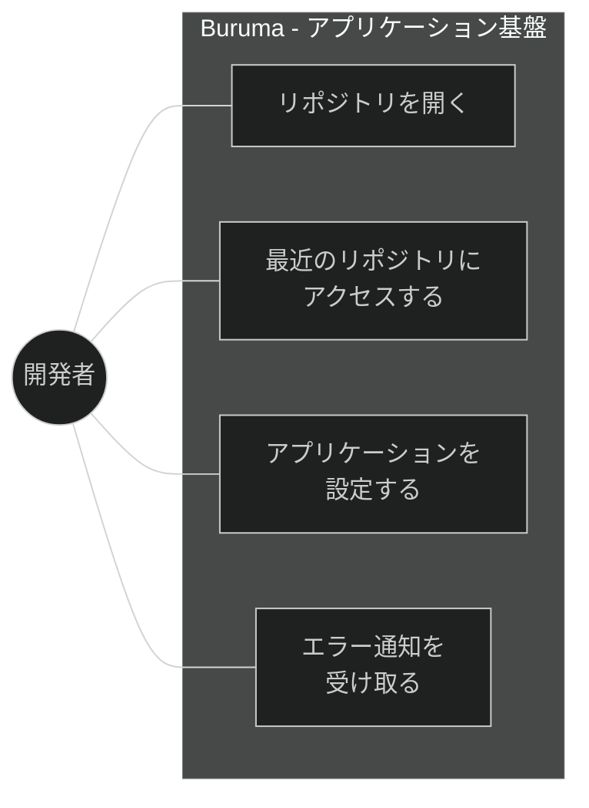
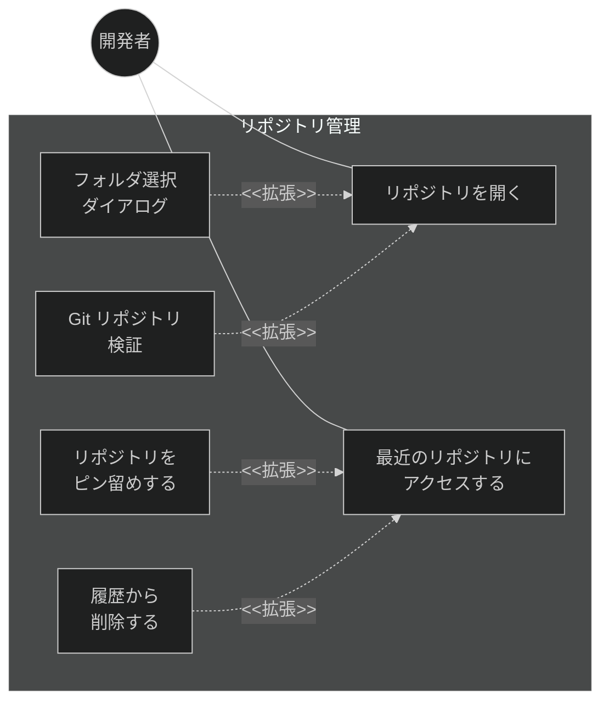
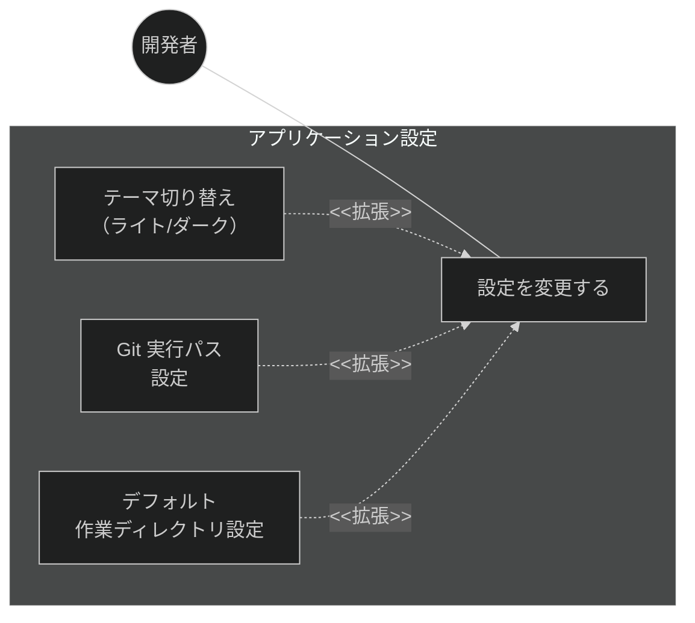
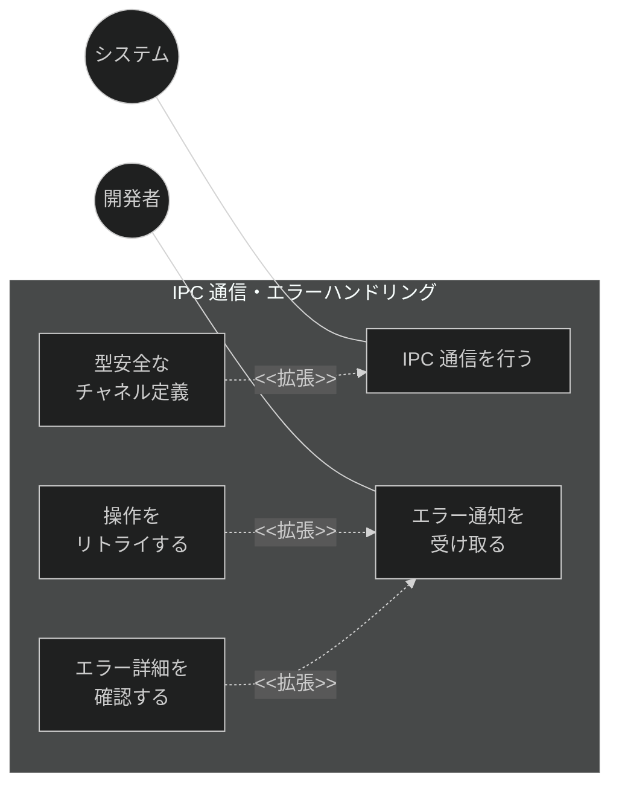

# アプリケーション基盤 要求仕様書

## 概要

本ドキュメントは、Buruma（Branch-United Real-time Understanding & Multi-worktree Analyzer）のアプリケーション基盤に関する要求仕様を定義する。リポジトリ選択・オープン、最近開いたリポジトリ履歴、アプリケーション設定、IPC 通信基盤、エラーハンドリングなど、全機能の土台となる横断的な機能群を対象とする。

---

# 1. 要求図の読み方

## 1.1. 要求タイプ

- **requirement**: 一般的な要求（ユーザー要求）
- **functionalRequirement**: 機能要求（Git操作、UI操作、IPC通信など）
- **performanceRequirement**: パフォーマンス要求（応答時間、メモリ使用量など）
- **interfaceRequirement**: インターフェース要求（IPC API、UI仕様など）
- **designConstraint**: 設計制約（IPC セキュリティ、プロセス分離、データ永続化など）

## 1.2. リスクレベル

- **High**: 高リスク（データ損失の可能性、Git操作の不可逆性）
- **Medium**: 中リスク（UX劣化、パフォーマンス低下）
- **Low**: 低リスク（表示の改善、Nice to have）

## 1.3. 検証方法

- **Analysis**: 分析による検証
- **Test**: テストによる検証（E2Eテスト、ユニットテスト）
- **Demonstration**: デモンストレーションによる検証（UIの動作確認）
- **Inspection**: インスペクション（コードレビュー、セキュリティ監査）

## 1.4. 関係タイプ

- **contains**: 包含関係（親要求が子要求を含む）
- **derives**: 派生関係（要求から別の要求が導出される）
- **satisfies**: 満足関係（要素が要求を満たす）
- **verifies**: 検証関係（テストケースが要求を検証する）
- **refines**: 詳細化関係（要求をより詳細に定義する）
- **traces**: トレース関係（要求間の追跡可能性）

---

# 2. 要求一覧

## 2.1. ユースケース図（概要）

## 2.2. ユースケース図（詳細）

### リポジトリ管理

### アプリケーション設定

### IPC 通信・エラーハンドリング

## 2.3. 機能一覧（テキスト形式）

- リポジトリ管理
    - リポジトリ選択・オープン（フォルダ選択ダイアログ、Git リポジトリ検証）
    - 最近開いたリポジトリ（履歴管理、ピン留め、履歴削除）
- アプリケーション設定
    - テーマ切り替え（ライト/ダーク）
    - Git 実行パス設定
    - デフォルト作業ディレクトリ設定
- IPC 通信基盤
    - 型安全な IPC コマンド定義
    - フロントエンド（Webview）とバックエンド（Tauri Core）間の通信レイヤー
- エラーハンドリング
    - Git 操作エラーのユーザー通知
    - リトライ機能
    - エラー詳細表示

---

# 3. 要求図（SysML Requirements Diagram）

## 3.1. 全体要求図

```mermaid
requirementDiagram

    requirement ApplicationFoundation {
        id: UR_001
        text: "Buruma のアプリケーション基盤として、リポジトリ管理・設定・IPC通信・エラーハンドリングを提供する"
        risk: high
        verifymethod: demonstration
    }

    requirement RepositoryManagement {
        id: UR_002
        text: "ローカル Git リポジトリを選択・オープンし、履歴を管理できる"
        risk: medium
        verifymethod: demonstration
    }

    requirement AppConfiguration {
        id: UR_003
        text: "アプリケーションの外観や動作をカスタマイズできる"
        risk: low
        verifymethod: demonstration
    }

    requirement IPCFoundation {
        id: UR_004
        text: "フロントエンドとバックエンド間の安全で型安全な通信基盤を提供する"
        risk: high
        verifymethod: test
    }

    requirement ErrorHandling {
        id: UR_005
        text: "Git 操作エラーを適切にユーザーに通知し、リカバリ手段を提供する"
        risk: high
        verifymethod: test
    }

    functionalRequirement OpenRepository {
        id: FR_601
        text: "フォルダ選択ダイアログでローカルリポジトリを開き、Git リポジトリとして検証する"
        risk: medium
        verifymethod: test
    }

    functionalRequirement RecentRepositories {
        id: FR_602
        text: "最近開いたリポジトリの履歴を保持し、クイックアクセスを提供する"
        risk: low
        verifymethod: test
    }

    functionalRequirement AppSettings {
        id: FR_603
        text: "テーマ（ライト/ダーク/システム連動）、Git 実行パス等のアプリケーション設定を管理する"
        risk: low
        verifymethod: demonstration
    }

    functionalRequirement IPCLayer {
        id: FR_604
        text: "フロントエンド（Webview）とバックエンド間の型安全な IPC 通信レイヤーを提供する"
        risk: high
        verifymethod: inspection
    }

    functionalRequirement ErrorNotification {
        id: FR_605
        text: "Git 操作エラーをトースト通知で表示し、リトライ・詳細確認の手段を提供する"
        risk: medium
        verifymethod: test
    }

    performanceRequirement StartupPerformance {
        id: NFR_001
        text: "アプリケーション起動からUI表示まで3秒以内"
        risk: medium
        verifymethod: test
    }

    performanceRequirement IPCLatency {
        id: NFR_002
        text: "IPC 通信のラウンドトリップレイテンシが50ms以内"
        risk: medium
        verifymethod: test
    }

    designConstraint IpcSecurity {
        id: DC_001
        text: "IPC セキュリティ制約: フロントエンドからバックエンドへは型安全な IPC コマンド層経由で通信し、OS API（fs / process / shell）を直接使用しない"
        risk: high
        verifymethod: inspection
    }

    designConstraint DataPersistence {
        id: DC_002
        text: "設定・履歴データはローカルファイルシステムに永続化する（Key-Value ストア型プラグイン）"
        risk: low
        verifymethod: inspection
    }

    ApplicationFoundation - contains -> RepositoryManagement
    ApplicationFoundation - contains -> AppConfiguration
    ApplicationFoundation - contains -> IPCFoundation
    ApplicationFoundation - contains -> ErrorHandling
    RepositoryManagement - contains -> OpenRepository
    RepositoryManagement - contains -> RecentRepositories
    AppConfiguration - contains -> AppSettings
    IPCFoundation - contains -> IPCLayer
    ErrorHandling - contains -> ErrorNotification
    IPCFoundation - derives -> IpcSecurity
    AppConfiguration - derives -> DataPersistence
```

---

# 4. 要求の詳細説明

## 4.1. ユーザー要求

### UR_001: アプリケーション基盤

Buruma の全機能が依存する基盤レイヤーとして、リポジトリの選択・管理、アプリケーション設定、プロセス間通信、エラーハンドリングの各機能を提供する。他の機能グループ（ワークツリー管理、リポジトリ閲覧、Git操作、Claude Code連携）はすべて本基盤の上に構築される。

### UR_002: リポジトリ管理

ユーザーがローカルの Git リポジトリをフォルダ選択ダイアログから開き、過去に開いたリポジトリに素早くアクセスできるようにする。

### UR_003: アプリケーション設定

ユーザーがアプリケーションの外観（テーマ）や動作（Git 実行パス等）をカスタマイズできるようにする。

### UR_004: IPC 通信基盤

セキュリティベストプラクティスに準拠し、フロントエンド（Webview）とバックエンド間の型安全な通信レイヤーを提供する。全機能の IPC 通信がこの基盤を利用する。

### UR_005: エラーハンドリング

Git 操作やシステムエラーが発生した場合、ユーザーに適切な通知を行い、リカバリ手段（リトライ、詳細確認）を提供する。

## 4.2. 機能要求

### FR_601: リポジトリ選択・オープン

ネイティブのフォルダ選択ダイアログを表示し、ユーザーが選択したフォルダが有効な Git リポジトリかを検証する。有効な場合はリポジトリを開き、ワークツリー一覧を表示する。無効な場合はエラーメッセージを表示する。

**含まれる機能:**

- FR_601_01: ネイティブフォルダ選択ダイアログの表示
- FR_601_02: Git リポジトリの検証（`.git` ディレクトリの存在確認）
- FR_601_03: リポジトリオープン後の初期画面遷移

**検証方法:** テストによる検証

### FR_602: 最近開いたリポジトリ

最近開いたリポジトリの履歴を永続的に保持し、アプリ起動時やリポジトリ選択時にクイックアクセスリストとして表示する。

**含まれる機能:**

- FR_602_01: 履歴の自動記録（最大20件）
- FR_602_02: 履歴リストの表示（パス、最終アクセス日時）
- FR_602_03: 履歴からのクイックオープン
- FR_602_04: 個別履歴の削除
- FR_602_05: リポジトリのピン留め（常に上位表示）

**検証方法:** テストによる検証

### FR_603: アプリケーション設定

アプリケーションの各種設定を管理する画面を提供する。

**含まれる機能:**

- FR_603_01: テーマ切り替え（ライト/ダーク/システム連動）
- FR_603_02: Git 実行パスの設定（カスタムパス指定）
- FR_603_03: デフォルト作業ディレクトリの設定
- FR_603_04: 設定の永続化とリストア

**検証方法:** デモンストレーションによる検証

### FR_604: IPC 通信基盤

フロントエンド（Webview）とバックエンド間の通信を、型安全な IPC コマンド層で実装する。全 IPC コマンド・イベントに対して型定義を提供し、型安全性を保証する。

**含まれる機能:**

- FR_604_01: 型安全な IPC コマンドの公開パターン
- FR_604_02: IPC コマンド・イベントの型定義（TypeScript）
- FR_604_03: リクエスト/レスポンス型の IPC ハンドラーパターン
- FR_604_04: イベントベースの IPC 通知パターン（バックエンド → フロントエンド）

**検証方法:** インスペクションによる検証

### FR_605: エラーハンドリング

Git 操作やシステムエラーを統一的にハンドリングし、ユーザーに通知する。

**含まれる機能:**

- FR_605_01: エラー通知（トースト形式）の表示
- FR_605_02: エラーの重大度分類（info/warning/error）
- FR_605_03: リトライ可能な操作のリトライボタン表示
- FR_605_04: エラー詳細の展開表示（スタックトレース等）
- FR_605_05: IPC 通信エラーのレンダラー側での統一ハンドリング

**検証方法:** テストによる検証

## 4.3. 非機能要求

### NFR_001: 起動パフォーマンス

アプリケーション起動からUI表示完了まで3秒以内とする。大規模リポジトリを開いている状態でも初期UI表示はこの制約を満たすこと。

**検証方法:** テストによる検証

### NFR_002: IPC レイテンシ

IPC 通信のラウンドトリップレイテンシを50ms以内に抑える。これにより、UIからのGit操作要求に対する応答性を確保する。

**検証方法:** テストによる検証

## 4.4. 設計制約

### DC_001: IPC セキュリティ制約

フロントエンド（Webview）とバックエンドの通信は、型安全な IPC コマンド層を経由すること。フロントエンドから OS API（fs / process / shell）を直接使用せず、すべての外部リソースアクセスはバックエンドの IPC コマンド経由で行う。IPC コマンド引数はバックエンド側でバリデーションする。

**検証方法:** インスペクションによる検証

### DC_002: データ永続化制約

設定・履歴データはローカルファイルシステムに永続化する。外部サーバーやクラウドストレージには依存しない。

**検証方法:** インスペクションによる検証

---

# 5. 制約事項

## 5.1. 技術的制約

- Tauri 2 + Vite 6 のビルドチェーンに依存
- `@tailwindcss/vite` は ESM only のため `@tailwindcss/postcss` を使用
- Shadcn/ui は `rsc: false`（Server Components 無効）で使用

## 5.2. ビジネス的制約

- 個人開発プロジェクトのため、スケジュール制約は柔軟

---

# 6. 前提条件

- Git がユーザーの環境にインストール済みであること
- 対象リポジトリへのファイルシステムアクセスが可能であること
- macOS / Windows / Linux のいずれかの環境で動作すること

---

# 7. スコープ外

以下は本PRDのスコープ外とする：

- ワークツリーの一覧表示・作成・削除（→ FG-1: ワークツリー管理）
- Git ステータス・ログ・差分の表示（→ FG-2: リポジトリ閲覧）
- コミット・プッシュ等の Git 操作（→ FG-3/FG-4: Git 操作）
- Claude Code CLI 連携（→ FG-5: Claude Code 連携）
- リモートリポジトリのクローン機能

---

# 8. 用語集

| 用語 | 定義 |
|------|------|
| ワークツリー | Git worktree。同一リポジトリの複数チェックアウトを管理する仕組み |
| Tauri バックエンド | Rust で記述されたネイティブ処理層（Tauri Core）。Git 操作・永続化等のバックエンド処理を担当 |
| Webview フロントエンド | React で構成される UI 層。WKWebView / WebView2 等のネイティブ WebView 上で動作 |
| IPC | Inter-Process Communication。Tauri の invoke（Webview → Core）と emit（Core → Webview）による通信 |
| トースト | 画面の端に一時的に表示される通知メッセージ |

---

# 要求サマリー

| カテゴリ | 件数 |
|----------|------|
| ユーザー要求 (UR) | 5 |
| 機能要求 (FR) | 5 |
| 非機能要求 (NFR) | 2 |
| 設計制約 (DC) | 2 |
| **合計** | **14** |

| 優先度 | 件数 |
|--------|------|
| 必須 (Must) | 8（UR_001, UR_002, UR_004, UR_005, FR_601, FR_604, FR_605, DC_001） |
| 推奨 (Should) | 4（UR_003, FR_602, FR_603, DC_002） |
| 任意 (Could) | 2（NFR_001, NFR_002） |
