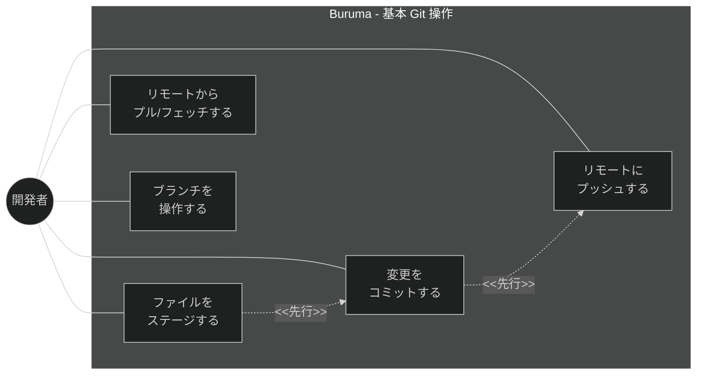
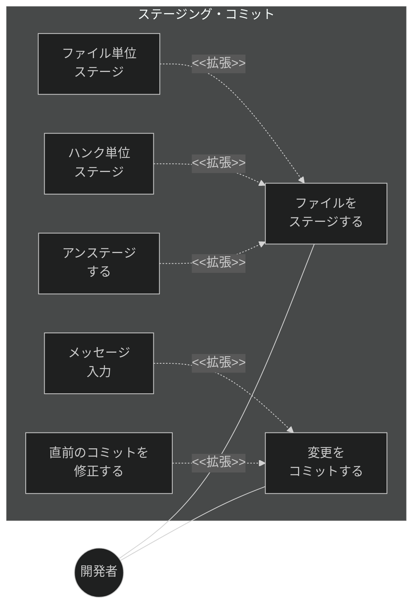
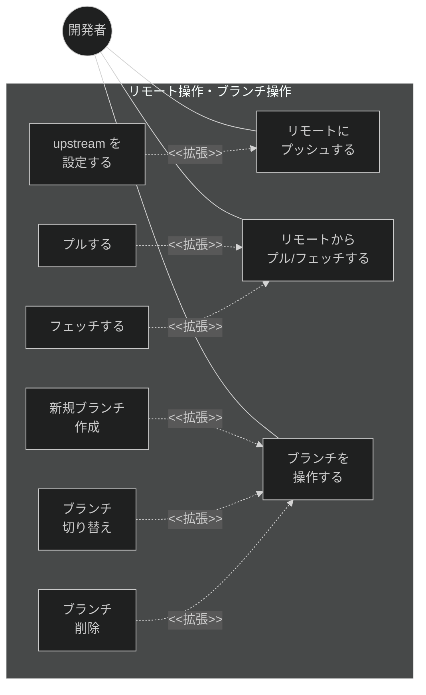

# 基本 Git 操作 要求仕様書

## 概要

本ドキュメントは、日常的な Git 操作を GUI から実行する機能群に関する要求仕様を定義する。ステージング、コミット、プッシュ、プル/フェッチ、ブランチ作成・切り替え・削除を対象とする。

---

# 1. 要求図の読み方

## 1.1. 要求タイプ

- **requirement**: 一般的な要求（ユーザー要求）
- **functionalRequirement**: 機能要求（Git操作、UI操作、IPC通信など）
- **performanceRequirement**: パフォーマンス要求（応答時間、メモリ使用量など）
- **interfaceRequirement**: インターフェース要求（IPC API、UI仕様など）
- **designConstraint**: 設計制約（Electronセキュリティ、プロセス分離など）

## 1.2. リスクレベル

- **High**: 高リスク（データ損失の可能性、Git操作の不可逆性）
- **Medium**: 中リスク（UX劣化、パフォーマンス低下）
- **Low**: 低リスク（表示の改善、Nice to have）

## 1.3. 検証方法

- **Analysis**: 分析による検証
- **Test**: テストによる検証（E2Eテスト、ユニットテスト）
- **Demonstration**: デモンストレーションによる検証（UIの動作確認）
- **Inspection**: インスペクション（コードレビュー、セキュリティ監査）

## 1.4. 関係タイプ

- **contains**: 包含関係（親要求が子要求を含む）
- **derives**: 派生関係（要求から別の要求が導出される）
- **satisfies**: 満足関係（要素が要求を満たす）
- **verifies**: 検証関係（テストケースが要求を検証する）
- **refines**: 詳細化関係（要求をより詳細に定義する）
- **traces**: トレース関係（要求間の追跡可能性）

---

# 2. 要求一覧

## 2.1. ユースケース図（概要）

## 2.2. ユースケース図（詳細）

### ステージング・コミット

### リモート操作・ブランチ操作

## 2.3. 機能一覧（テキスト形式）

- ステージング
    - ファイル単位のステージング/アンステージング
    - ハンク単位のステージング/アンステージング
    - 全ファイル一括ステージング
- コミット
    - コミットメッセージの入力・編集
    - コミット実行
    - 直前のコミットの修正（amend）
- プッシュ
    - リモートへのプッシュ
    - upstream の設定（初回プッシュ時）
- プル/フェッチ
    - リモートからのプル
    - リモートからのフェッチ
- ブランチ操作
    - 新規ブランチ作成
    - 既存ブランチへのチェックアウト
    - ローカル/リモートブランチの削除

---

# 3. 要求図（SysML Requirements Diagram）

## 3.1. 全体要求図

```mermaid
requirementDiagram

    requirement BasicGitOperations {
        id: UR_301
        text: "日常的な Git 操作を GUI から効率的に実行できる"
        risk: high
        verifymethod: demonstration
    }

    requirement StagingCommit {
        id: UR_302
        text: "変更のステージングとコミットを直感的に行える"
        risk: high
        verifymethod: demonstration
    }

    requirement RemoteSync {
        id: UR_303
        text: "リモートリポジトリとの同期をスムーズに行える"
        risk: medium
        verifymethod: test
    }

    requirement BranchManagement {
        id: UR_304
        text: "ブランチの作成・切り替え・削除を安全に行える"
        risk: high
        verifymethod: test
    }

    functionalRequirement Staging {
        id: FR_301
        text: "ファイル単位/ハンク単位のステージング・アンステージングを提供する"
        risk: medium
        verifymethod: test
    }

    functionalRequirement CommitChanges {
        id: FR_302
        text: "コミットメッセージを入力してコミットを実行する（amend 対応含む）"
        risk: high
        verifymethod: test
    }

    functionalRequirement PushToRemote {
        id: FR_303
        text: "リモートへのプッシュを実行する（upstream 設定含む）"
        risk: high
        verifymethod: test
    }

    functionalRequirement PullFetch {
        id: FR_304
        text: "リモートからのプル・フェッチを実行する"
        risk: medium
        verifymethod: test
    }

    functionalRequirement BranchCreateSwitch {
        id: FR_305
        text: "新規ブランチ作成と既存ブランチへのチェックアウトを提供する"
        risk: medium
        verifymethod: test
    }

    functionalRequirement BranchDelete {
        id: FR_306
        text: "ローカル/リモートブランチの削除を確認ダイアログ付きで提供する"
        risk: high
        verifymethod: test
    }

    designConstraint GitOperationSafety {
        id: DC_301
        text: "不可逆な Git 操作（force push, ブランチ削除等）には必ず確認ダイアログを表示する"
        risk: high
        verifymethod: inspection
    }

    designConstraint GitOperationMainProcess {
        id: DC_302
        text: "Git 操作は必ずメインプロセスで実行し、レンダラーから直接実行しない"
        risk: high
        verifymethod: inspection
    }

    BasicGitOperations - contains -> StagingCommit
    BasicGitOperations - contains -> RemoteSync
    BasicGitOperations - contains -> BranchManagement
    StagingCommit - contains -> Staging
    StagingCommit - contains -> CommitChanges
    RemoteSync - contains -> PushToRemote
    RemoteSync - contains -> PullFetch
    BranchManagement - contains -> BranchCreateSwitch
    BranchManagement - contains -> BranchDelete
    performanceRequirement GitOperationResponse {
        id: NFR_301
        text: "Git 操作（ステージング・コミット等）のUIへの応答を3秒以内に完了する"
        risk: medium
        verifymethod: test
    }

    performanceRequirement RemoteOperationFeedback {
        id: NFR_302
        text: "リモート操作（プッシュ・プル）は進捗インジケーターを表示し、操作状況をフィードバックする"
        risk: medium
        verifymethod: demonstration
    }

    BasicGitOperations - derives -> GitOperationSafety
    BasicGitOperations - derives -> GitOperationMainProcess
    StagingCommit - traces -> GitOperationResponse
    RemoteSync - traces -> RemoteOperationFeedback
```

---

# 4. 要求の詳細説明

## 4.1. ユーザー要求

### UR_301: 基本 Git 操作

日常的な Git 操作（ステージング、コミット、プッシュ、プル、ブランチ操作）を GUI から効率的に実行できるようにする。CLI と同等の操作性を提供しつつ、視覚的なフィードバックで操作の安全性を高める。

### UR_302: ステージング・コミット

変更ファイルのステージングとコミットを直感的に行える。ファイル単位だけでなくハンク単位のステージングもサポートし、きめ細かなコミットを可能にする。

### UR_303: リモート同期

リモートリポジトリとの同期（プッシュ・プル・フェッチ）をスムーズに行える。初回プッシュ時の upstream 設定も自動的に案内する。

### UR_304: ブランチ管理

ブランチの作成・切り替え・削除を安全に行える。削除操作には確認ダイアログを表示し、マージされていないブランチの場合は警告する。

## 4.2. 機能要求

### FR_301: ステージング

ファイル単位およびハンク単位でのステージング・アンステージングを提供する。

**含まれる機能:**

- FR_301_01: ファイル単位のステージング（個別選択）
- FR_301_02: ファイル単位のアンステージング
- FR_301_03: ハンク単位のステージング（差分表示上での選択）
- FR_301_04: ハンク単位のアンステージング
- FR_301_05: 全ファイル一括ステージング/アンステージング

**検証方法:** テストによる検証

### FR_302: コミット

コミットメッセージを入力してコミットを実行する。

**含まれる機能:**

- FR_302_01: コミットメッセージ入力エリア（複数行対応）
- FR_302_02: コミット実行ボタン
- FR_302_03: 直前のコミットの修正（amend）
- FR_302_04: 空コミットの防止（ステージ済みファイルなしの場合）
- FR_302_05: コミット後のステータス自動リフレッシュ

**検証方法:** テストによる検証

### FR_303: プッシュ

リモートへのプッシュを実行する。

**含まれる機能:**

- FR_303_01: デフォルトリモートへのプッシュ
- FR_303_02: upstream 未設定時の設定案内（`--set-upstream` 相当）
- FR_303_03: プッシュ先リモート・ブランチの選択
- FR_303_04: プッシュ結果の通知（成功/失敗/リジェクト）

**検証方法:** テストによる検証

### FR_304: プル/フェッチ

リモートからのプル・フェッチを実行する。

**含まれる機能:**

- FR_304_01: デフォルトリモートからのプル
- FR_304_02: 全リモートからのフェッチ
- FR_304_03: プル時のコンフリクト発生通知
- FR_304_04: プル/フェッチ後のステータス・ログ自動リフレッシュ

**検証方法:** テストによる検証

### FR_305: ブランチ作成・切り替え

新規ブランチの作成と既存ブランチへのチェックアウトを提供する。

**含まれる機能:**

- FR_305_01: 新規ブランチ作成ダイアログ（ブランチ名入力、起点指定）
- FR_305_02: 既存ブランチへのチェックアウト
- FR_305_03: 未コミット変更がある場合の警告
- FR_305_04: チェックアウト後のステータス・ログ自動リフレッシュ

**検証方法:** テストによる検証

### FR_306: ブランチ削除

ローカルおよびリモートブランチの削除を提供する。

**含まれる機能:**

- FR_306_01: ローカルブランチの削除（確認ダイアログ付き）
- FR_306_02: リモートブランチの削除（確認ダイアログ付き）
- FR_306_03: マージされていないブランチの削除警告
- FR_306_04: 現在チェックアウト中のブランチの削除防止

**検証方法:** テストによる検証

## 4.3. 非機能要求

### NFR_301: Git 操作応答パフォーマンス

Git 操作（ステージング・コミット等）のUIへの応答を3秒以内に完了する。操作の進行中はローディングインジケーターを表示する。

**検証方法:** テストによる検証

### NFR_302: リモート操作フィードバック

リモート操作（プッシュ・プル・フェッチ）は進捗インジケーターを表示し、操作状況をリアルタイムでフィードバックする。

**検証方法:** デモンストレーションによる検証

## 4.4. 設計制約

### DC_301: Git 操作の安全性制約

不可逆な Git 操作（force push、ブランチ削除、amend 等）には必ず確認ダイアログを表示する。ユーザーが意図しない操作を防止する。

**検証方法:** インスペクションによる検証

### DC_302: メインプロセス実行制約

Git 操作は必ずメインプロセスで実行し、レンダラープロセスから直接 Git コマンドを実行しない。IPC 通信基盤（FR_604）を経由する。

**検証方法:** インスペクションによる検証

---

# 5. 制約事項

## 5.1. 技術的制約

- Git 操作は simple-git ライブラリ経由での実行を予定
- リモート操作には SSH キーまたは HTTPS 認証が設定済みであることが前提

---

# 6. 前提条件

- [repository-viewer.md](./repository-viewer.md) のリポジトリ閲覧機能が実装済みであること
- [application-foundation.md](./application-foundation.md) の IPC 通信基盤（FR_604）が利用可能であること
- リモート操作にはネットワーク接続が必要
- Git の認証情報（SSH キーまたは HTTPS credential）が設定済みであること

---

# 7. スコープ外

以下は本PRDのスコープ外とする：

- マージ、リベース（→ FG-4: 高度な Git 操作）
- スタッシュ（→ FG-4: 高度な Git 操作）
- チェリーピック（→ FG-4: 高度な Git 操作）
- コンフリクト解決UI（→ FG-4: 高度な Git 操作）
- タグ管理（→ FG-4: 高度な Git 操作）
- Git の認証設定・SSH キー管理

---

# 8. 用語集

| 用語 | 定義 |
|------|------|
| ステージング (staging) | 変更をインデックスに追加し、次のコミットに含める準備をすること |
| アンステージング (unstaging) | インデックスから変更を取り除き、ステージ前の状態に戻すこと |
| ハンク (hunk) | 差分の中の連続した変更ブロック。ハンク単位でのステージングが可能 |
| upstream | ローカルブランチが追跡するリモートブランチ |
| amend | 直前のコミットのメッセージや内容を修正すること |
| force push | リモートの履歴を強制的に上書きするプッシュ。不可逆な操作 |

---

# 要求サマリー

| カテゴリ | 件数 |
|----------|------|
| ユーザー要求 (UR) | 4 |
| 機能要求 (FR) | 6 |
| 非機能要求 (NFR) | 2 |
| 設計制約 (DC) | 2 |
| **合計** | **14** |

| 優先度 | 件数 |
|--------|------|
| 必須 (Must) | 8（UR_301, UR_302, UR_304, FR_301, FR_302, FR_303, DC_301, DC_302） |
| 推奨 (Should) | 5（UR_303, FR_304, FR_305, NFR_301, NFR_302） |
| 任意 (Could) | 1（FR_306） |

> **採番規則:** 本PRDの要求IDは300番台を使用する（FG-3: 基本 Git 操作）。
