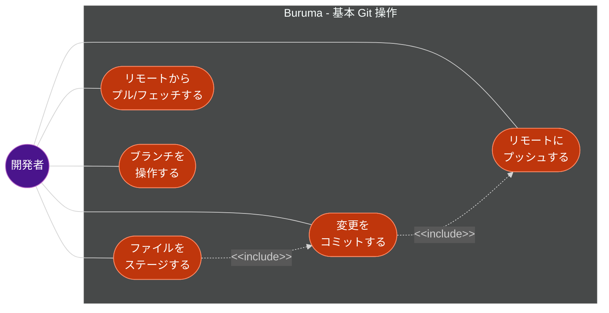
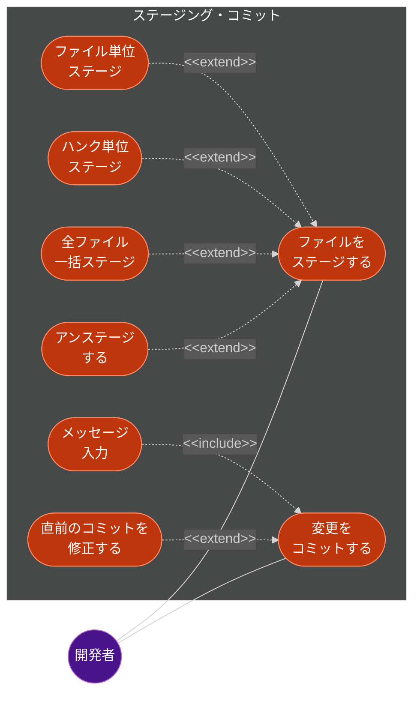
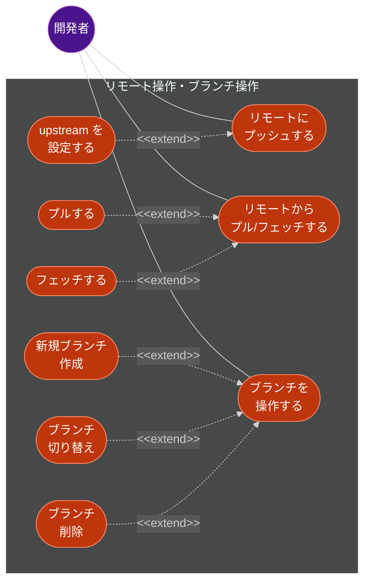

# 基本 Git 操作 要求仕様書

## 概要

本ドキュメントは、日常的な Git 操作を GUI から実行する機能群に関する要求仕様を定義する。ステージング、コミット、プッシュ、プル/フェッチ、ブランチ作成・切り替え・削除を対象とする。

---

# 1. 要求図の読み方

## 1.1. 要求タイプ

- **requirement**: 一般的な要求（ユーザー要求）
- **functionalRequirement**: 機能要求（Git操作、UI操作、IPC通信など）
- **performanceRequirement**: パフォーマンス要求（応答時間、メモリ使用量など）
- **interfaceRequirement**: インターフェース要求（IPC API、UI仕様など）
- **designConstraint**: 設計制約（IPC セキュリティ、プロセス分離、データ永続化など）

## 1.2. リスクレベル

- **high**: 高リスク（データ損失の可能性、Git操作の不可逆性）
- **medium**: 中リスク（UX劣化、パフォーマンス低下）
- **low**: 低リスク（表示の改善、Nice to have）

## 1.3. 検証方法

- **analysis**: 分析による検証
- **test**: テストによる検証（E2Eテスト、ユニットテスト）
- **demonstration**: デモンストレーションによる検証（UIの動作確認）
- **inspection**: インスペクション（コードレビュー、セキュリティ監査）

## 1.4. 関係タイプ

- **contains**: 包含関係（親要求が子要求を含む）
- **derives**: 派生関係（要求から別の要求が導出される）
- **satisfies**: 満足関係（要素が要求を満たす）
- **verifies**: 検証関係（テストケースが要求を検証する）
- **refines**: 詳細化関係（要求をより詳細に定義する）
- **traces**: トレース関係（要求間の追跡可能性）

---

# 2. 要求一覧

## 2.1. ユースケース図（概要）

### アクター一覧

| アクター | 種類 | 説明 |
|:---------|:-----|:-----|
| 開発者 (Developer) | 人間 | Git リポジトリに対して日常的な操作を行うユーザー |

### ユースケース一覧

| ID | ユースケース | 説明 |
|:---|:-------------|:-----|
| UC-301 | ファイルをステージする | 変更ファイルをインデックスに追加・除去する |
| UC-302 | 変更をコミットする | ステージ済みの変更をコミットとして記録する |
| UC-303 | リモートにプッシュする | ローカルのコミットをリモートリポジトリに送信する |
| UC-304 | リモートからプル/フェッチする | リモートの変更をローカルに取り込む |
| UC-305 | ブランチを操作する | ブランチの作成・切り替え・削除を行う |

## 2.2. ユースケース図（詳細）

### ステージング・コミット

### リモート操作・ブランチ操作

## 2.3. 機能一覧（テキスト形式）

- ステージング
    - ファイル単位のステージング/アンステージング
    - ハンク単位のステージング/アンステージング
    - 全ファイル一括ステージング
- コミット
    - コミットメッセージの入力・編集
    - コミット実行
    - 直前のコミットの修正（amend）
- プッシュ
    - リモートへのプッシュ
    - upstream の設定（初回プッシュ時）
- プル/フェッチ
    - リモートからのプル
    - リモートからのフェッチ
- ブランチ操作
    - 新規ブランチ作成
    - 既存ブランチへのチェックアウト
    - ローカル/リモートブランチの削除

---

# 3. 要求図（SysML Requirements Diagram）

## 3.1. 全体要求図

```mermaid
%%{init: {'theme': 'dark'}}%%
requirementDiagram

    requirement BasicGitOperations {
        id: UR_301
        text: "日常的な Git 操作を GUI から効率的に実行できる"
        risk: high
        verifymethod: demonstration
    }

    requirement StagingCommit {
        id: UR_302
        text: "変更のステージングとコミットをマウス操作のみで完結できる"
        risk: high
        verifymethod: demonstration
    }

    requirement RemoteSync {
        id: UR_303
        text: "リモートリポジトリとの同期（プッシュ・プル・フェッチ）をGUIから実行できる"
        risk: medium
        verifymethod: test
    }

    requirement BranchManagement {
        id: UR_304
        text: "ブランチの作成・切り替え・削除を安全に行える"
        risk: high
        verifymethod: test
    }

    functionalRequirement Staging {
        id: FR_301
        text: "ファイル単位/ハンク単位のステージング・アンステージングを提供する"
        risk: medium
        verifymethod: test
    }

    functionalRequirement CommitChanges {
        id: FR_302
        text: "コミットメッセージを入力してコミットを実行する（amend 対応含む）"
        risk: high
        verifymethod: test
    }

    functionalRequirement PushToRemote {
        id: FR_303
        text: "リモートへのプッシュを実行する（upstream 設定含む）"
        risk: high
        verifymethod: test
    }

    functionalRequirement PullFetch {
        id: FR_304
        text: "リモートからのプル・フェッチを実行する"
        risk: medium
        verifymethod: test
    }

    functionalRequirement BranchCreateSwitch {
        id: FR_305
        text: "新規ブランチ作成と既存ブランチへのチェックアウトを提供する"
        risk: medium
        verifymethod: test
    }

    functionalRequirement BranchDelete {
        id: FR_306
        text: "ローカル/リモートブランチの削除を確認ダイアログ付きで提供する"
        risk: high
        verifymethod: test
    }

    performanceRequirement GitOperationResponse {
        id: NFR_301
        text: "Git 操作のUIへの応答を3秒以内に完了する"
        risk: medium
        verifymethod: test
    }

    performanceRequirement RemoteOperationFeedback {
        id: NFR_302
        text: "リモート操作は進捗インジケーターを表示し操作状況をフィードバックする"
        risk: medium
        verifymethod: demonstration
    }

    designConstraint GitOperationSafety {
        id: DC_301
        text: "不可逆な Git 操作には必ず確認ダイアログを表示する"
        risk: high
        verifymethod: inspection
    }

    designConstraint GitOperationBackend {
        id: DC_302
        text: "Git 操作は必ずバックエンド（Tauri Core / Rust）で実行し、フロントエンド（Webview）から直接実行しない"
        risk: high
        verifymethod: inspection
    }

    BasicGitOperations - contains -> StagingCommit
    BasicGitOperations - contains -> RemoteSync
    BasicGitOperations - contains -> BranchManagement
    StagingCommit - contains -> Staging
    StagingCommit - contains -> CommitChanges
    RemoteSync - contains -> PushToRemote
    RemoteSync - contains -> PullFetch
    BranchManagement - contains -> BranchCreateSwitch
    BranchManagement - contains -> BranchDelete
    BasicGitOperations - traces -> GitOperationSafety
    BasicGitOperations - traces -> GitOperationBackend
    StagingCommit - traces -> GitOperationResponse
    RemoteSync - traces -> RemoteOperationFeedback
```

## 3.2. 主要サブシステム詳細図

### ステージング・コミット詳細

```mermaid
%%{init: {'theme': 'dark'}}%%
requirementDiagram

    functionalRequirement Staging {
        id: FR_301
        text: "ファイル単位/ハンク単位のステージング・アンステージングを提供する"
        risk: medium
        verifymethod: test
    }

    functionalRequirement StageByFile {
        id: FR_301_01
        text: "ファイル単位のステージング（個別選択）"
        risk: low
        verifymethod: test
    }

    functionalRequirement UnstageByFile {
        id: FR_301_02
        text: "ファイル単位のアンステージング"
        risk: low
        verifymethod: test
    }

    functionalRequirement StageByHunk {
        id: FR_301_03
        text: "ハンク単位のステージング（差分表示上での選択）"
        risk: medium
        verifymethod: test
    }

    functionalRequirement UnstageByHunk {
        id: FR_301_04
        text: "ハンク単位のアンステージング"
        risk: medium
        verifymethod: test
    }

    functionalRequirement StageAll {
        id: FR_301_05
        text: "全ファイル一括ステージング/アンステージング"
        risk: low
        verifymethod: test
    }

    functionalRequirement CommitChanges {
        id: FR_302
        text: "コミットメッセージを入力してコミットを実行する（amend 対応含む）"
        risk: high
        verifymethod: test
    }

    functionalRequirement CommitMessage {
        id: FR_302_01
        text: "コミットメッセージ入力エリア（複数行対応）"
        risk: low
        verifymethod: test
    }

    functionalRequirement CommitExecute {
        id: FR_302_02
        text: "コミット実行ボタン"
        risk: low
        verifymethod: test
    }

    functionalRequirement CommitAmend {
        id: FR_302_03
        text: "直前のコミットの修正（amend）"
        risk: high
        verifymethod: test
    }

    functionalRequirement CommitGuard {
        id: FR_302_04
        text: "空コミットの防止（ステージ済みファイルなしの場合）"
        risk: low
        verifymethod: test
    }

    functionalRequirement CommitRefresh {
        id: FR_302_05
        text: "コミット後のステータス自動リフレッシュ"
        risk: low
        verifymethod: test
    }

    Staging - contains -> StageByFile
    Staging - contains -> UnstageByFile
    Staging - contains -> StageByHunk
    Staging - contains -> UnstageByHunk
    Staging - contains -> StageAll
    CommitChanges - contains -> CommitMessage
    CommitChanges - contains -> CommitExecute
    CommitChanges - contains -> CommitAmend
    CommitChanges - contains -> CommitGuard
    CommitChanges - contains -> CommitRefresh
```

### リモート操作・ブランチ操作詳細

```mermaid
%%{init: {'theme': 'dark'}}%%
requirementDiagram

    functionalRequirement PushToRemote {
        id: FR_303
        text: "リモートへのプッシュを実行する（upstream 設定含む）"
        risk: high
        verifymethod: test
    }

    functionalRequirement PushDefault {
        id: FR_303_01
        text: "デフォルトリモートへのプッシュ"
        risk: medium
        verifymethod: test
    }

    functionalRequirement PushUpstream {
        id: FR_303_02
        text: "upstream 未設定時の設定案内"
        risk: medium
        verifymethod: test
    }

    functionalRequirement PushSelectRemote {
        id: FR_303_03
        text: "プッシュ先リモート・ブランチの選択"
        risk: low
        verifymethod: test
    }

    functionalRequirement PushNotify {
        id: FR_303_04
        text: "プッシュ結果の通知（成功/失敗/リジェクト）"
        risk: medium
        verifymethod: test
    }

    functionalRequirement PullFetch {
        id: FR_304
        text: "リモートからのプル・フェッチを実行する"
        risk: medium
        verifymethod: test
    }

    functionalRequirement PullDefault {
        id: FR_304_01
        text: "デフォルトリモートからのプル"
        risk: medium
        verifymethod: test
    }

    functionalRequirement FetchAll {
        id: FR_304_02
        text: "全リモートからのフェッチ"
        risk: low
        verifymethod: test
    }

    functionalRequirement PullConflictNotify {
        id: FR_304_03
        text: "プル時のコンフリクト発生を通知する（解決UIはスコープ外）"
        risk: high
        verifymethod: test
    }

    functionalRequirement PullFetchRefresh {
        id: FR_304_04
        text: "プル/フェッチ後のステータス・ログ自動リフレッシュ"
        risk: low
        verifymethod: test
    }

    functionalRequirement BranchCreateSwitch {
        id: FR_305
        text: "新規ブランチ作成と既存ブランチへのチェックアウトを提供する"
        risk: medium
        verifymethod: test
    }

    functionalRequirement BranchCreateDialog {
        id: FR_305_01
        text: "新規ブランチ作成ダイアログ（ブランチ名入力、起点指定）"
        risk: low
        verifymethod: test
    }

    functionalRequirement BranchCheckout {
        id: FR_305_02
        text: "既存ブランチへのチェックアウト"
        risk: medium
        verifymethod: test
    }

    functionalRequirement BranchCheckoutWarn {
        id: FR_305_03
        text: "未コミット変更がある場合の警告"
        risk: high
        verifymethod: test
    }

    functionalRequirement BranchCheckoutRefresh {
        id: FR_305_04
        text: "チェックアウト後のステータス・ログ自動リフレッシュ"
        risk: low
        verifymethod: test
    }

    functionalRequirement BranchDelete {
        id: FR_306
        text: "ローカル/リモートブランチの削除を確認ダイアログ付きで提供する"
        risk: high
        verifymethod: test
    }

    functionalRequirement BranchDeleteLocal {
        id: FR_306_01
        text: "ローカルブランチの削除（確認ダイアログ付き）"
        risk: high
        verifymethod: test
    }

    functionalRequirement BranchDeleteRemote {
        id: FR_306_02
        text: "リモートブランチの削除（確認ダイアログ付き）"
        risk: high
        verifymethod: test
    }

    functionalRequirement BranchDeleteUnmergedWarn {
        id: FR_306_03
        text: "マージされていないブランチの削除警告"
        risk: high
        verifymethod: test
    }

    functionalRequirement BranchDeleteCurrentGuard {
        id: FR_306_04
        text: "現在チェックアウト中のブランチの削除防止"
        risk: high
        verifymethod: test
    }

    PushToRemote - contains -> PushDefault
    PushToRemote - contains -> PushUpstream
    PushToRemote - contains -> PushSelectRemote
    PushToRemote - contains -> PushNotify
    PullFetch - contains -> PullDefault
    PullFetch - contains -> FetchAll
    PullFetch - contains -> PullConflictNotify
    PullFetch - contains -> PullFetchRefresh
    BranchCreateSwitch - contains -> BranchCreateDialog
    BranchCreateSwitch - contains -> BranchCheckout
    BranchCreateSwitch - contains -> BranchCheckoutWarn
    BranchCreateSwitch - contains -> BranchCheckoutRefresh
    BranchDelete - contains -> BranchDeleteLocal
    BranchDelete - contains -> BranchDeleteRemote
    BranchDelete - contains -> BranchDeleteUnmergedWarn
    BranchDelete - contains -> BranchDeleteCurrentGuard
```

---

# 4. 要求の詳細説明

## 4.1. ユーザー要求

### UR_301: 基本 Git 操作

日常的な Git 操作（ステージング、コミット、プッシュ、プル、ブランチ操作）をワークツリー選択を起点として GUI から効率的に実行できるようにする。すべての操作は「どのワークツリーに対して行うか」が明確な状態で開始される（B-001: Worktree-First UX）。CLI と同等の操作性を提供しつつ、視覚的なフィードバックで操作の安全性を高める。

| 属性 | 値 |
|:-----|:---|
| 優先度 | must |
| リスク | high |
| 検証方法 | demonstration |

### UR_302: ステージング・コミット

変更ファイルのステージングとコミットをマウス操作のみで完結できる。ファイル単位だけでなくハンク単位のステージングもサポートし、きめ細かなコミットを可能にする。

| 属性 | 値 |
|:-----|:---|
| 優先度 | must |
| リスク | high |
| 検証方法 | demonstration |

### UR_303: リモート同期

リモートリポジトリとの同期（プッシュ・プル・フェッチ）をGUIから実行できる。初回プッシュ時の upstream 設定も自動的に案内する。

| 属性 | 値 |
|:-----|:---|
| 優先度 | should |
| リスク | medium |
| 検証方法 | test |

### UR_304: ブランチ管理

ブランチの作成・切り替え・削除を安全に行える。削除操作には確認ダイアログを表示し、マージされていないブランチの場合は警告する。

| 属性 | 値 |
|:-----|:---|
| 優先度 | must |
| リスク | high |
| 検証方法 | test |

## 4.2. 機能要求

### FR_301: ステージング

ファイル単位およびハンク単位でのステージング・アンステージングを提供する。

**含まれる機能:**

- FR_301_01: ファイル単位のステージング（個別選択）
- FR_301_02: ファイル単位のアンステージング
- FR_301_03: ハンク単位のステージング（差分表示上での選択）
- FR_301_04: ハンク単位のアンステージング
- FR_301_05: 全ファイル一括ステージング/アンステージング

| 属性 | 値 |
|:-----|:---|
| 優先度 | must |
| リスク | medium |
| 検証方法 | test |
| 派生元 | UR_302 |

### FR_302: コミット

コミットメッセージを入力してコミットを実行する。

**含まれる機能:**

- FR_302_01: コミットメッセージ入力エリア（複数行対応）
- FR_302_02: コミット実行ボタン
- FR_302_03: 直前のコミットの修正（amend）
- FR_302_04: 空コミットの防止（ステージ済みファイルなしの場合）
- FR_302_05: コミット後のステータス自動リフレッシュ

| 属性 | 値 |
|:-----|:---|
| 優先度 | must |
| リスク | high |
| 検証方法 | test |
| 派生元 | UR_302 |

### FR_303: プッシュ

リモートへのプッシュを実行する。

**含まれる機能:**

- FR_303_01: デフォルトリモートへのプッシュ
- FR_303_02: upstream 未設定時の設定案内（`--set-upstream` 相当）
- FR_303_03: プッシュ先リモート・ブランチの選択
- FR_303_04: プッシュ結果の通知（成功/失敗/リジェクト）

| 属性 | 値 |
|:-----|:---|
| 優先度 | must |
| リスク | high |
| 検証方法 | test |
| 派生元 | UR_303 |

### FR_304: プル/フェッチ

リモートからのプル・フェッチを実行する。

**含まれる機能:**

- FR_304_01: デフォルトリモートからのプル
- FR_304_02: 全リモートからのフェッチ
- FR_304_03: プル時のコンフリクト発生を通知する（コンフリクト解決UIはスコープ外、通知のみ）
- FR_304_04: プル/フェッチ後のステータス・ログ自動リフレッシュ

| 属性 | 値 |
|:-----|:---|
| 優先度 | should |
| リスク | medium |
| 検証方法 | test |
| 派生元 | UR_303 |

### FR_305: ブランチ作成・切り替え

新規ブランチの作成と既存ブランチへのチェックアウトを提供する。

**含まれる機能:**

- FR_305_01: 新規ブランチ作成ダイアログ（ブランチ名入力、起点指定）
- FR_305_02: 既存ブランチへのチェックアウト
- FR_305_03: 未コミット変更がある場合の警告
- FR_305_04: チェックアウト後のステータス・ログ自動リフレッシュ

| 属性 | 値 |
|:-----|:---|
| 優先度 | should |
| リスク | medium |
| 検証方法 | test |
| 派生元 | UR_304 |

### FR_306: ブランチ削除

ローカルおよびリモートブランチの削除を提供する。

**含まれる機能:**

- FR_306_01: ローカルブランチの削除（確認ダイアログ付き）
- FR_306_02: リモートブランチの削除（確認ダイアログ付き）
- FR_306_03: マージされていないブランチの削除警告
- FR_306_04: 現在チェックアウト中のブランチの削除防止

| 属性 | 値 |
|:-----|:---|
| 優先度 | could |
| リスク | high |
| 検証方法 | test |
| 派生元 | UR_304 |

## 4.3. 非機能要求

### NFR_301: Git 操作応答パフォーマンス

Git 操作（ステージング・コミット等）のUIへの応答を3秒以内に完了する。操作の進行中はローディングインジケーターを表示する。

| 属性 | 値 |
|:-----|:---|
| 優先度 | should |
| リスク | medium |
| カテゴリ | パフォーマンス |
| 検証方法 | test |

### NFR_302: リモート操作フィードバック

リモート操作（プッシュ・プル・フェッチ）は進捗インジケーターを表示し、操作状況をリアルタイムでフィードバックする。

| 属性 | 値 |
|:-----|:---|
| 優先度 | should |
| リスク | medium |
| カテゴリ | ユーザビリティ |
| 検証方法 | demonstration |

## 4.4. 設計制約

### DC_301: Git 操作の安全性制約

不可逆な Git 操作（force push、ブランチ削除、amend 等）には必ず確認ダイアログを表示する。ユーザーが意図しない操作を防止する。

| 属性 | 値 |
|:-----|:---|
| 優先度 | must |
| リスク | high |
| 検証方法 | inspection |
| 準拠原則 | B-002（Git 操作の安全性） |

### DC_302: バックエンド実行制約

Git 操作は必ずバックエンド（Tauri Core / Rust）で実行し、フロントエンド（Webview）から直接 Git コマンドを実行しない。IPC 通信基盤（FR_604）を経由する。

| 属性 | 値 |
|:-----|:---|
| 優先度 | must |
| リスク | high |
| 検証方法 | inspection |
| 準拠原則 | A-001（Tauri プロセス分離 / Rust-TypeScript 境界） |

---

# 5. 制約事項

## 5.1. 技術的制約

- Git 操作は外部 Git ライブラリ経由でのラップ実行を前提とする（具体的なライブラリ選定は設計書を参照）
- リモート操作には SSH キーまたは HTTPS 認証が設定済みであることが前提
- Tauri 2 + Vite 6 のビルドチェーンに依存

## 5.2. ビジネス的制約

- ワークツリー選択を起点とする操作フロー（B-001: Worktree-First UX）に準拠する

---

# 6. 前提条件

- [repository-viewer.md](./repository-viewer.md) のリポジトリ閲覧機能が実装済みであること
- [application-foundation.md](./application-foundation.md) の IPC 通信基盤（FR_604）が利用可能であること
- リモート操作にはネットワーク接続が必要
- Git の認証情報（SSH キーまたは HTTPS credential）が設定済みであること

---

# 7. スコープ外

以下は本PRDのスコープ外とする：

- マージ、リベース（→ [advanced-git-operations.md](./advanced-git-operations.md)）
- スタッシュ（→ [advanced-git-operations.md](./advanced-git-operations.md)）
- チェリーピック（→ [advanced-git-operations.md](./advanced-git-operations.md)）
- コンフリクト解決UI（→ [advanced-git-operations.md](./advanced-git-operations.md)）
- タグ管理（→ [advanced-git-operations.md](./advanced-git-operations.md)）
- Git の認証設定・SSH キー管理

---

# 8. 用語集

| 用語 | 定義 |
|------|------|
| ステージング (staging) | 変更をインデックスに追加し、次のコミットに含める準備をすること |
| アンステージング (unstaging) | インデックスから変更を取り除き、ステージ前の状態に戻すこと |
| ハンク (hunk) | 差分の中の連続した変更ブロック。ハンク単位でのステージングが可能 |
| upstream | ローカルブランチが追跡するリモートブランチ |
| amend | 直前のコミットのメッセージや内容を修正すること |
| force push | リモートの履歴を強制的に上書きするプッシュ。不可逆な操作 |
| ワークツリー | Git worktree。同一リポジトリの複数チェックアウトを管理する仕組み |
| Tauri バックエンド | Rust で記述されたネイティブ処理層。Git 操作等のバックエンド処理を担当 |
| Webview フロントエンド | React で構成される UI 層。Tauri の WebView 上で動作 |
| IPC | Inter-Process Communication。Tauri の invoke（Webview → Core）と emit（Core → Webview）による通信 |

---

# 要求サマリー

## 要求件数

| カテゴリ | 件数 |
|----------|------|
| ユーザー要求 (UR) | 4 |
| 機能要求 (FR) トップレベル | 6 |
| 機能要求 (FR) サブ要求 | 22 |
| 非機能要求 (NFR) | 2 |
| 設計制約 (DC) | 2 |
| **合計（トップレベル）** | **14** |
| **合計（全要求）** | **36** |

## 優先度別件数

| 優先度 | 件数 | 対象 |
|--------|------|------|
| Must | 8 | UR_301, UR_302, UR_304, FR_301, FR_302, FR_303, DC_301, DC_302 |
| Should | 5 | UR_303, FR_304, FR_305, NFR_301, NFR_302 |
| Could | 1 | FR_306 |

> **採番規則:** 本PRDの要求IDは300番台を使用する（FG-3: 基本 Git 操作）。
