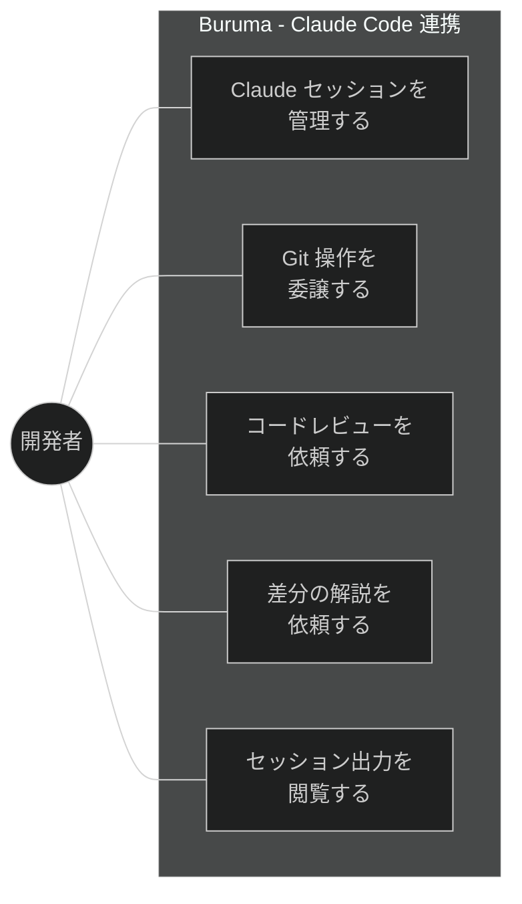
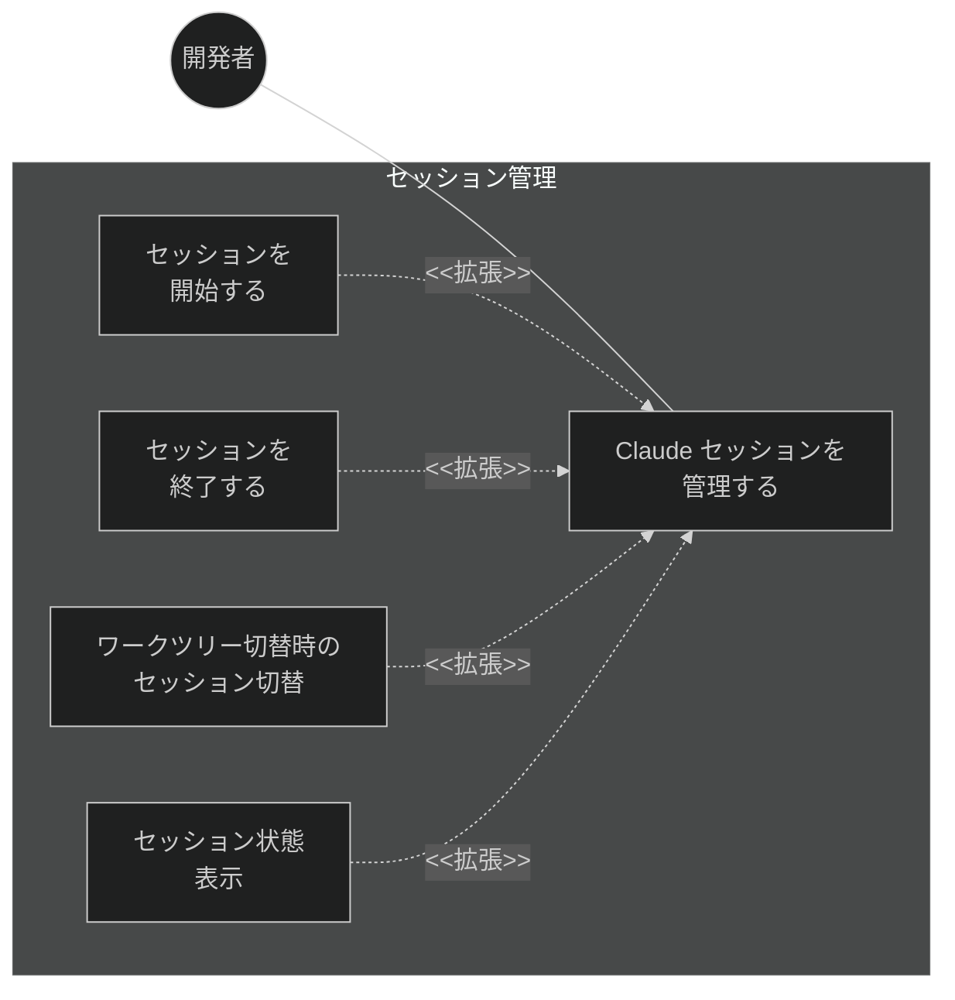
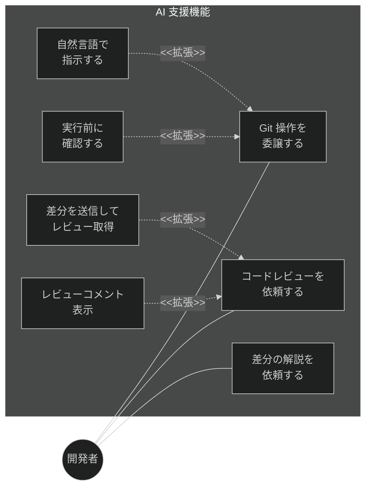

# Claude Code 連携 要求仕様書

## 概要

本ドキュメントは、Claude Code CLI を子プロセスとして実行し、AI 支援機能を提供する機能群に関する要求仕様を定義する。ワークツリーごとの Claude Code セッション管理、自然言語による Git 操作委譲、コードレビュー、差分解説を対象とする。

---

# 1. 要求図の読み方

## 1.1. 要求タイプ

- **requirement**: 一般的な要求（ユーザー要求）
- **functionalRequirement**: 機能要求（Git操作、UI操作、IPC通信など）
- **performanceRequirement**: パフォーマンス要求（応答時間、メモリ使用量など）
- **interfaceRequirement**: インターフェース要求（IPC API、UI仕様など）
- **designConstraint**: 設計制約（Electronセキュリティ、プロセス分離など）

## 1.2. リスクレベル

- **High**: 高リスク（データ損失の可能性、Git操作の不可逆性）
- **Medium**: 中リスク（UX劣化、パフォーマンス低下）
- **Low**: 低リスク（表示の改善、Nice to have）

## 1.3. 検証方法

- **Analysis**: 分析による検証
- **Test**: テストによる検証（E2Eテスト、ユニットテスト）
- **Demonstration**: デモンストレーションによる検証（UIの動作確認）
- **Inspection**: インスペクション（コードレビュー、セキュリティ監査）

## 1.4. 関係タイプ

- **contains**: 包含関係（親要求が子要求を含む）
- **derives**: 派生関係（要求から別の要求が導出される）
- **satisfies**: 満足関係（要素が要求を満たす）
- **verifies**: 検証関係（テストケースが要求を検証する）
- **refines**: 詳細化関係（要求をより詳細に定義する）
- **traces**: トレース関係（要求間の追跡可能性）

---

# 2. 要求一覧

## 2.1. ユースケース図（概要）

## 2.2. ユースケース図（詳細）

### セッション管理

### AI 支援機能

## 2.3. 機能一覧（テキスト形式）

- Claude セッション管理
    - ワークツリーごとのセッション起動・終了
    - セッション状態の表示（接続中/切断/エラー）
    - ワークツリー切り替え時のセッション自動切り替え
- Git 操作委譲
    - 自然言語指示による Git 操作の実行
    - 実行前の操作内容確認ダイアログ
    - 操作結果のフィードバック
- コードレビュー
    - 差分を Claude Code に送信しレビューコメントを取得
    - レビューコメントの差分上への表示
- 差分解説
    - コミット間/ブランチ間の差分を Claude Code に解説させる
    - 解説結果の表示
- セッション出力表示
    - Claude Code の出力をリアルタイムでUI上に表示
    - 出力のスクロール・検索

---

# 3. 要求図（SysML Requirements Diagram）

## 3.1. 全体要求図

```mermaid
requirementDiagram

    requirement ClaudeCodeIntegration {
        id: UR_501
        text: "Claude Code CLI と連携し、ワークツリーごとに AI 支援機能を提供する"
        risk: high
        verifymethod: demonstration
    }

    requirement SessionManagement {
        id: UR_502
        text: "ワークツリーごとに独立した Claude Code セッションを管理できる"
        risk: high
        verifymethod: test
    }

    requirement AIAssistedGit {
        id: UR_503
        text: "自然言語指示で Claude Code に Git 操作を委譲できる"
        risk: high
        verifymethod: demonstration
    }

    requirement AICodeReview {
        id: UR_504
        text: "差分を Claude Code にレビュー・解説させ、結果をUI上で確認できる"
        risk: medium
        verifymethod: demonstration
    }

    functionalRequirement SessionLifecycle {
        id: FR_501
        text: "ワークツリーごとに Claude Code CLI セッションを起動・管理・終了する"
        risk: high
        verifymethod: test
    }

    functionalRequirement GitDelegation {
        id: FR_502
        text: "自然言語指示で Claude Code に Git 操作を実行させる（実行前確認付き）"
        risk: high
        verifymethod: test
    }

    functionalRequirement CodeReview {
        id: FR_503
        text: "差分を Claude Code に送り、レビューコメントを取得・表示する"
        risk: medium
        verifymethod: test
    }

    functionalRequirement DiffExplanation {
        id: FR_504
        text: "コミット/ブランチ間の差分内容を Claude Code に解説させる"
        risk: low
        verifymethod: demonstration
    }

    functionalRequirement SessionOutputDisplay {
        id: FR_505
        text: "Claude Code の出力をリアルタイムでUI上にストリーミング表示する"
        risk: medium
        verifymethod: demonstration
    }

    designConstraint CLISubprocess {
        id: DC_501
        text: "Claude Code は CLI 子プロセスとして実行する。直接 API 呼び出しは行わない"
        risk: medium
        verifymethod: inspection
    }

    designConstraint SessionIsolation {
        id: DC_502
        text: "各ワークツリーのセッションは独立しており、セッション間でコンテキストを共有しない"
        risk: medium
        verifymethod: inspection
    }

    ClaudeCodeIntegration - contains -> SessionManagement
    ClaudeCodeIntegration - contains -> AIAssistedGit
    ClaudeCodeIntegration - contains -> AICodeReview
    SessionManagement - contains -> SessionLifecycle
    SessionManagement - contains -> SessionOutputDisplay
    AIAssistedGit - contains -> GitDelegation
    AICodeReview - contains -> CodeReview
    AICodeReview - contains -> DiffExplanation
    ClaudeCodeIntegration - derives -> CLISubprocess
    SessionManagement - derives -> SessionIsolation
```

---

# 4. 要求の詳細説明

## 4.1. ユーザー要求

### UR_501: Claude Code 連携

Claude Code CLI と連携し、ワークツリーごとに AI 支援機能を提供する。Git 操作の委譲とコードレビュー・解説の2軸で AI を活用する。

### UR_502: セッション管理

ワークツリーごとに独立した Claude Code セッションを管理できる。ワークツリーの切り替えに連動してセッションも切り替わり、各ワークツリーの作業コンテキストが保持される。

### UR_503: AI 支援 Git 操作

自然言語の指示で Claude Code に Git 操作を委譲できる。「main ブランチにマージして」「直前のコミットメッセージを修正して」のような指示に対し、Claude Code が適切な Git コマンドを実行する。実行前に内容を確認できる。

### UR_504: AI コードレビュー・解説

差分を Claude Code に送信してレビューコメントや解説を取得し、UI上で確認できる。プルリクエスト前のセルフレビューや、他者のコミット内容の理解に活用する。

## 4.2. 機能要求

### FR_501: セッションライフサイクル管理

ワークツリーごとに Claude Code CLI セッションを管理する。

**含まれる機能:**

- FR_501_01: ワークツリー選択時の Claude Code セッション起動
- FR_501_02: セッションの明示的な終了
- FR_501_03: ワークツリー切り替え時のセッション自動切り替え
- FR_501_04: セッション状態のUIインジケーター表示（接続中/切断/エラー）
- FR_501_05: セッションの自動再接続（エラー時）

**検証方法:** テストによる検証

### FR_502: Git 操作委譲

自然言語指示で Claude Code に Git 操作を実行させる。

**含まれる機能:**

- FR_502_01: 自然言語入力フィールドの提供
- FR_502_02: Claude Code への指示送信
- FR_502_03: 実行予定の Git コマンドの表示と確認ダイアログ
- FR_502_04: Git 操作の実行と結果表示
- FR_502_05: 操作結果のステータス・ログへの自動反映

**検証方法:** テストによる検証

### FR_503: コードレビュー

差分を Claude Code に送信し、レビューコメントを取得する。

**含まれる機能:**

- FR_503_01: 現在の差分（staged / unstaged）を Claude Code に送信
- FR_503_02: 特定コミット間の差分を Claude Code に送信
- FR_503_03: レビューコメントの取得と表示
- FR_503_04: レビューコメントの差分上へのインライン表示
- FR_503_05: レビュー結果のサマリー表示

**検証方法:** テストによる検証

### FR_504: 差分解説

コミットやブランチ間の差分内容を Claude Code に解説させる。

**含まれる機能:**

- FR_504_01: コミット選択による差分解説リクエスト
- FR_504_02: ブランチ間差分の解説リクエスト
- FR_504_03: 解説結果のマークダウン表示
- FR_504_04: 解説のコピー・エクスポート

**検証方法:** デモンストレーションによる検証

### FR_505: セッション出力表示

Claude Code の出力をリアルタイムでUIに表示する。

**含まれる機能:**

- FR_505_01: stdout/stderr のリアルタイムストリーミング表示
- FR_505_02: ANSI カラーコードの解釈・レンダリング
- FR_505_03: 出力のスクロール制御（自動スクロール ON/OFF）
- FR_505_04: 出力テキストの検索

**検証方法:** デモンストレーションによる検証

## 4.3. 設計制約

### DC_501: CLI 子プロセス実行制約

Claude Code は `claude` コマンドを子プロセスとして実行する。Claude API を直接呼び出すのではなく、CLI のインターフェースを利用する。これにより認証管理を Claude Code CLI に委譲する。

**検証方法:** インスペクションによる検証

### DC_502: セッション分離制約

各ワークツリーの Claude Code セッションは独立しており、セッション間でコンテキスト（会話履歴、作業状態）を共有しない。ワークツリーの作業ディレクトリをセッションの CWD として設定する。

**検証方法:** インスペクションによる検証

---

# 5. 制約事項

## 5.1. 技術的制約

- Claude Code CLI がユーザーの環境にインストール・認証済みであることが前提
- Claude Code の CLI インターフェースに依存するため、CLI のバージョンアップに追従が必要
- ストリーミング出力は Node.js の child_process の stdout/stderr パイプ経由で取得

## 5.2. ビジネス的制約

- Claude Code の利用にはユーザー自身の Anthropic アカウントと API 利用枠が必要

---

# 6. 前提条件

- Claude Code CLI (`claude` コマンド) がインストール・認証済みであること
- [worktree-management.md](./worktree-management.md) のワークツリー管理機能が実装済みであること
- [application-foundation.md](./application-foundation.md) の IPC 通信基盤（FR_604）が利用可能であること

---

# 7. スコープ外

以下は本PRDのスコープ外とする：

- Claude Code CLI のインストール支援
- Anthropic アカウントの認証設定UI
- Claude API の直接呼び出し
- Claude Code 以外の AI ツール（GitHub Copilot 等）との連携
- Claude Code のプラグイン/MCP サーバー管理

---

# 8. 用語集

| 用語 | 定義 |
|------|------|
| Claude Code | Anthropic が提供する CLI ベースの AI コーディングアシスタント |
| セッション | Claude Code との1つの対話コンテキスト。ワークツリーに1対1で紐づく |
| Git 操作委譲 | ユーザーの自然言語指示を Claude Code が解釈し、適切な Git コマンドを実行すること |
| ストリーミング表示 | 子プロセスの出力をリアルタイムでUIに逐次表示すること |
| CWD | Current Working Directory。子プロセスの作業ディレクトリ |

---

# 要求サマリー

| カテゴリ | 件数 |
|----------|------|
| ユーザー要求 (UR) | 4 |
| 機能要求 (FR) | 5 |
| 非機能要求 (NFR) | 0 |
| 設計制約 (DC) | 2 |
| **合計** | **11** |

| 優先度 | 件数 |
|--------|------|
| 必須 (Must) | 5（UR_501, UR_502, FR_501, FR_505, DC_501） |
| 推奨 (Should) | 4（UR_503, UR_504, FR_502, DC_502） |
| 任意 (Could) | 2（FR_503, FR_504） |

> **採番規則:** 本PRDの要求IDは500番台を使用する（FG-5: Claude Code 連携）。
