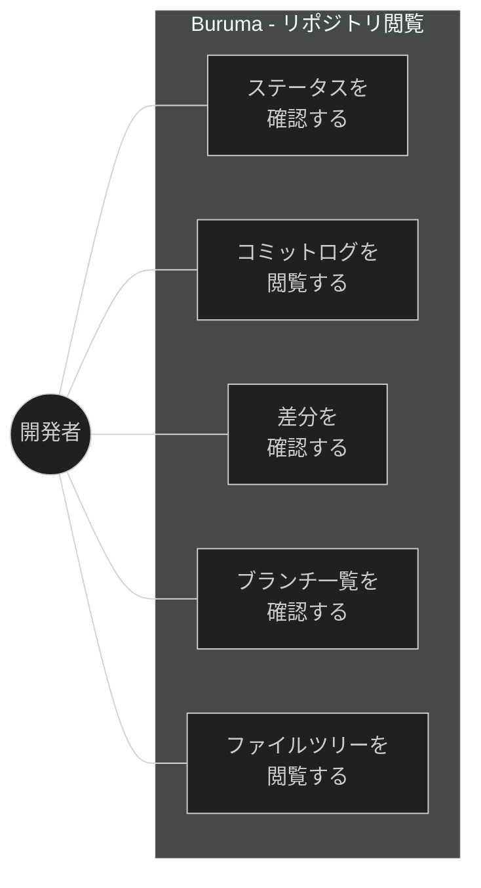
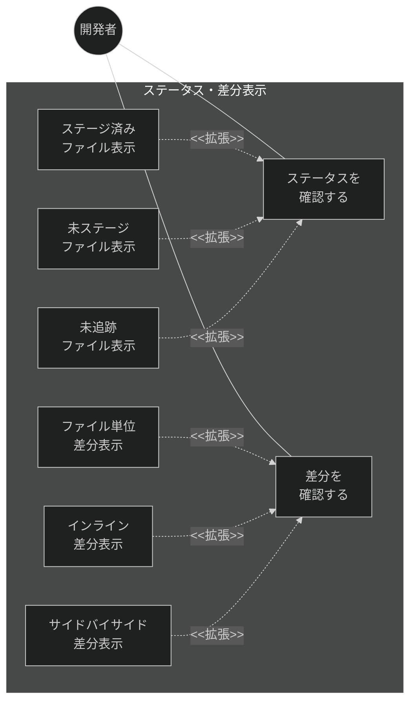
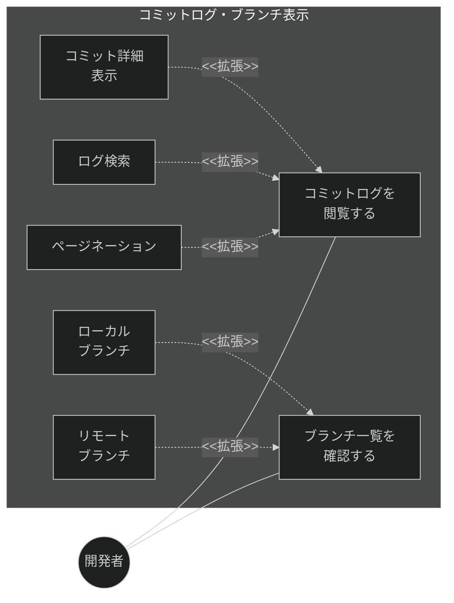

# リポジトリ閲覧 要求仕様書

## 概要

本ドキュメントは、選択したワークツリーの Git 情報を閲覧する機能群に関する要求仕様を定義する。ステータス表示、コミットログ表示、差分表示、ブランチ一覧表示、ファイルツリー表示を対象とする。これらは右パネル（詳細パネル）に表示される。

---

# 1. 要求図の読み方

## 1.1. 要求タイプ

- **requirement**: 一般的な要求（ユーザー要求）
- **functionalRequirement**: 機能要求（Git操作、UI操作、IPC通信など）
- **performanceRequirement**: パフォーマンス要求（応答時間、メモリ使用量など）
- **interfaceRequirement**: インターフェース要求（IPC API、UI仕様など）
- **designConstraint**: 設計制約（Electronセキュリティ、プロセス分離など）

## 1.2. リスクレベル

- **High**: 高リスク（データ損失の可能性、Git操作の不可逆性）
- **Medium**: 中リスク（UX劣化、パフォーマンス低下）
- **Low**: 低リスク（表示の改善、Nice to have）

## 1.3. 検証方法

- **Analysis**: 分析による検証
- **Test**: テストによる検証（E2Eテスト、ユニットテスト）
- **Demonstration**: デモンストレーションによる検証（UIの動作確認）
- **Inspection**: インスペクション（コードレビュー、セキュリティ監査）

## 1.4. 関係タイプ

- **contains**: 包含関係（親要求が子要求を含む）
- **derives**: 派生関係（要求から別の要求が導出される）
- **satisfies**: 満足関係（要素が要求を満たす）
- **verifies**: 検証関係（テストケースが要求を検証する）
- **refines**: 詳細化関係（要求をより詳細に定義する）
- **traces**: トレース関係（要求間の追跡可能性）

---

# 2. 要求一覧

## 2.1. ユースケース図（概要）

## 2.2. ユースケース図（詳細）

### ステータス・差分表示

### コミットログ・ブランチ表示

## 2.3. 機能一覧（テキスト形式）

- ステータス表示
    - ステージ済み/未ステージ/未追跡ファイルの分類表示
    - ファイルごとの変更種別（追加/変更/削除/リネーム）表示
- コミットログ表示
    - コミット履歴のリスト表示（ハッシュ、メッセージ、著者、日時）
    - コミット詳細表示（変更ファイル一覧、差分）
    - ログ検索・フィルタリング
    - ページネーションによる段階的読み込み
- 差分表示
    - ファイル単位の差分表示
    - インライン差分表示モード
    - サイドバイサイド差分表示モード
    - シンタックスハイライト付き差分
- ブランチ一覧表示
    - ローカルブランチの一覧
    - リモートブランチの一覧
    - 現在のブランチのハイライト
- ファイルツリー表示
    - ワークツリー内のファイル構造をツリー表示

---

# 3. 要求図（SysML Requirements Diagram）

## 3.1. 全体要求図

```mermaid
requirementDiagram

    requirement RepositoryViewer {
        id: UR_201
        text: "選択したワークツリーの Git 情報を詳細パネルで閲覧できる"
        risk: medium
        verifymethod: demonstration
    }

    requirement StatusViewing {
        id: UR_202
        text: "ワークツリーの変更状態を一目で把握できる"
        risk: medium
        verifymethod: demonstration
    }

    requirement HistoryViewing {
        id: UR_203
        text: "コミット履歴を効率的に閲覧・検索できる"
        risk: medium
        verifymethod: demonstration
    }

    requirement DiffViewing {
        id: UR_204
        text: "ファイルの変更内容を視覚的に確認できる"
        risk: medium
        verifymethod: demonstration
    }

    functionalRequirement StatusDisplay {
        id: FR_201
        text: "git status 相当の情報を分類表示する（staged/unstaged/untracked）"
        risk: medium
        verifymethod: test
    }

    functionalRequirement CommitLogDisplay {
        id: FR_202
        text: "コミット履歴をリスト表示し、詳細表示・検索・ページネーションを提供する"
        risk: medium
        verifymethod: test
    }

    functionalRequirement DiffDisplay {
        id: FR_203
        text: "ファイル単位の差分をインラインまたはサイドバイサイドで表示する"
        risk: medium
        verifymethod: test
    }

    functionalRequirement BranchListDisplay {
        id: FR_204
        text: "ローカル・リモートブランチの一覧を表示する"
        risk: low
        verifymethod: test
    }

    functionalRequirement FileTreeDisplay {
        id: FR_205
        text: "ワークツリー内のファイル構造をツリー形式で表示する"
        risk: low
        verifymethod: demonstration
    }

    performanceRequirement StatusPerformance {
        id: NFR_201
        text: "ステータス表示を2秒以内に完了する（変更ファイル数1000以下）"
        risk: medium
        verifymethod: test
    }

    performanceRequirement LogPerformance {
        id: NFR_202
        text: "コミットログの初期表示を1秒以内に完了する（最新50件のバッチ読み込み）"
        risk: medium
        verifymethod: test
    }

    performanceRequirement DiffPerformance {
        id: NFR_203
        text: "差分表示を1秒以内に完了する（単一ファイル、10000行以下）"
        risk: medium
        verifymethod: test
    }

    RepositoryViewer - contains -> StatusViewing
    RepositoryViewer - contains -> HistoryViewing
    RepositoryViewer - contains -> DiffViewing
    StatusViewing - contains -> StatusDisplay
    HistoryViewing - contains -> CommitLogDisplay
    HistoryViewing - contains -> BranchListDisplay
    DiffViewing - contains -> DiffDisplay
    DiffViewing - contains -> FileTreeDisplay
    StatusViewing - traces -> StatusPerformance
    HistoryViewing - traces -> LogPerformance
    DiffViewing - traces -> DiffPerformance
```

---

# 4. 要求の詳細説明

## 4.1. ユーザー要求

### UR_201: リポジトリ閲覧

選択したワークツリーの Git 情報（ステータス、コミットログ、差分、ブランチ、ファイルツリー）を詳細パネルで閲覧できるようにする。

### UR_202: ステータス閲覧

ワークツリーの変更状態（ステージ済み、未ステージ、未追跡ファイル）を一目で把握できるようにする。

### UR_203: 履歴閲覧

コミット履歴を効率的に閲覧・検索できるようにする。大規模リポジトリでもページネーションによりスムーズに操作できること。

### UR_204: 差分閲覧

ファイルの変更内容をインラインまたはサイドバイサイドの表示モードで視覚的に確認できるようにする。

## 4.2. 機能要求

### FR_201: ステータス表示

`git status` 相当の情報を取得し、変更ファイルを分類表示する。

**含まれる機能:**

- FR_201_01: ステージ済みファイルの一覧表示
- FR_201_02: 未ステージファイルの一覧表示
- FR_201_03: 未追跡ファイルの一覧表示
- FR_201_04: 各ファイルの変更種別アイコン表示（追加/変更/削除/リネーム）
- FR_201_05: ファイル選択による差分表示への連携

**検証方法:** テストによる検証

### FR_202: コミットログ表示

`git log` 相当のコミット履歴を表示する。

**含まれる機能:**

- FR_202_01: コミット一覧の表示（ハッシュ短縮形、メッセージ、著者、日時）
- FR_202_02: コミット選択による詳細表示（変更ファイル一覧、差分）
- FR_202_03: コミットメッセージやファイル名での検索・フィルタリング
- FR_202_04: ページネーションによる段階的読み込み（50件ずつ）
- FR_202_05: ブランチグラフの簡易表示

**検証方法:** テストによる検証

### FR_203: 差分表示

ファイル単位の差分を視覚的に表示する。

**含まれる機能:**

- FR_203_01: インライン差分表示モード（追加行/削除行をハイライト）
- FR_203_02: サイドバイサイド差分表示モード（左右並列表示）
- FR_203_03: シンタックスハイライト付き差分表示
- FR_203_04: 差分表示モードの切り替え
- FR_203_05: ハンク単位での折りたたみ/展開

**検証方法:** テストによる検証

### FR_204: ブランチ一覧表示

ローカルおよびリモートブランチの一覧を表示する。

**含まれる機能:**

- FR_204_01: ローカルブランチの一覧表示
- FR_204_02: リモートブランチの一覧表示
- FR_204_03: 現在のブランチのハイライト表示
- FR_204_04: ブランチ名での検索・フィルタリング

**検証方法:** テストによる検証

### FR_205: ファイルツリー表示

ワークツリー内のファイル構造をツリー形式で表示する。

**含まれる機能:**

- FR_205_01: ディレクトリ/ファイルのツリー構造表示
- FR_205_02: ファイル選択による差分/内容表示への連携
- FR_205_03: 変更ファイルの視覚的マーキング

**検証方法:** デモンストレーションによる検証

## 4.3. 非機能要求

### NFR_201: ステータス表示パフォーマンス

ステータス表示を2秒以内に完了する。変更ファイル数1000以下を前提条件とする。

**検証方法:** テストによる検証

### NFR_202: コミットログ表示パフォーマンス

コミットログの初期表示（最新50件）を1秒以内に完了する。10万コミット以上の大規模リポジトリでもこの制約を満たすこと。

**検証方法:** テストによる検証

### NFR_203: 差分表示パフォーマンス

単一ファイル（10000行以下）の差分表示を1秒以内に完了する。

**検証方法:** テストによる検証

---

# 5. 制約事項

## 5.1. 技術的制約

- 差分表示には Monaco Editor の使用を予定（将来的な拡張）
- 大規模リポジトリ対応のためページネーション・仮想スクロールが必要

---

# 6. 前提条件

- [worktree-management.md](./worktree-management.md) のワークツリー管理機能が実装済みであること
- [application-foundation.md](./application-foundation.md) の IPC 通信基盤（FR_604）が利用可能であること

---

# 7. スコープ外

以下は本PRDのスコープ外とする：

- ファイルの編集機能
- ステージング・コミット等の Git 操作（→ FG-3: 基本 Git 操作）
- blame 表示
- サブモジュールの表示

---

# 8. 用語集

| 用語 | 定義 |
|------|------|
| ステージ済み (staged) | `git add` でインデックスに追加された変更 |
| 未ステージ (unstaged) | 作業ツリーで変更されているがインデックスに追加されていない変更 |
| 未追跡 (untracked) | Git の管理下にないファイル |
| ハンク (hunk) | 差分の中の連続した変更ブロック |
| インライン差分 | 変更前後を同一カラムに表示する差分表示モード |
| サイドバイサイド差分 | 変更前と変更後を左右に並べて表示する差分表示モード |

---

# 要求サマリー

| カテゴリ | 件数 |
|----------|------|
| ユーザー要求 (UR) | 4 |
| 機能要求 (FR) | 5 |
| 非機能要求 (NFR) | 3 |
| 設計制約 (DC) | 0 |
| **合計** | **12** |

| 優先度 | 件数 |
|--------|------|
| 必須 (Must) | 6（UR_201, UR_202, UR_204, FR_201, FR_203, NFR_202） |
| 推奨 (Should) | 4（UR_203, FR_202, FR_204, NFR_201） |
| 任意 (Could) | 2（FR_205, NFR_203） |

> **採番規則:** 本PRDの要求IDは200番台を使用する（FG-2: リポジトリ閲覧）。
