# Tauri v2 + Rust への全面移行 要求仕様書

## 概要

本ドキュメントは、Buruma のバックエンドを Electron 41 + Node.js から **Tauri 2 + Rust** へ全面移行するための要求仕様を定義する。フロントエンド（React 19 + Vite）は維持しつつ、メインプロセスで行っていた Git 操作・ファイル監視・永続化・サブプロセス管理を Rust 側に移す横断的な「非機能要求（実装技術変更）」である。

本 PRD は既存の機能 PRD（`application-foundation.md` 等）とは独立した「メタ PRD」として位置付けられ、既存の requirement ID（UR/FR/NFR/DC）を変更せずに移行自体の目的・受け入れ基準・制約を定義する。

---

# 1. 要求図の読み方

## 1.1. 要求タイプ

- **requirement**: ユーザー要求（移行の目的）
- **functionalRequirement**: 機能要求（移行中に保証すべき振る舞い）
- **performanceRequirement**: 非機能要求（性能・互換性）
- **designConstraint**: 設計制約（移行方針・範囲）

## 1.2. リスクレベル

- **High**: 移行失敗時のデータ損失・機能喪失リスク
- **Medium**: 一時的な UX 劣化・性能低下
- **Low**: 表示の変更・Nice to have

## 1.3. 検証方法

- **Analysis**: 分析・設計レビュー
- **Test**: テスト（既存 Vitest + 新規 cargo test）
- **Demonstration**: デモンストレーション（UI 動作確認）
- **Inspection**: インスペクション（コードレビュー）

---

# 2. 要求一覧

## 2.1. 機能一覧（テキスト形式）

- 移行の目的
    - バンドルサイズ削減・メモリ効率向上
    - Rust エコシステム活用（git 操作、ファイル監視）
    - セキュリティモデル刷新（Tauri capabilities）
    - 既存機能の維持
- 移行の機能要求
    - 既存 83 IPC チャネルを Tauri command / event に 1:1 マッピング
    - 既存 `IPCResult<T>` パターンの互換維持
    - CONSTITUTION.md の原則更新と各 feature ドキュメントへの反映
- 移行の非機能要求
    - 既存テストの維持（80% 以上 pass）
    - 起動時間 3 秒以内（NFR_001 相当）の維持
    - IPC レイテンシ 50ms 以内（NFR_002 相当）の維持
- 設計制約
    - 既存の requirement ID（UR/FR/NFR/DC）を変更しない
    - 既存の UI/UX を維持（画面遷移・操作フローは変更なし）
    - Tauri 2.x の LTS バージョンを採用
    - `git` CLI shell out 方式を採用し、`git2` crate 移行は Phase 2 以降に延期

---

# 3. 要求図（SysML Requirements Diagram）

## 3.1. 全体要求図

```mermaid
requirementDiagram
    requirement TauriMigration {
        id: UR_M01
        text: "Electron から Tauri 2 + Rust へバックエンドを全面移行する"
        risk: high
        verifymethod: demonstration
    }

    requirement BundleSize {
        id: UR_M02
        text: "バンドルサイズとメモリ使用量を削減する"
        risk: medium
        verifymethod: test
    }

    requirement SecurityModel {
        id: UR_M03
        text: "Tauri の CSP + capabilities セキュリティモデルを採用する"
        risk: high
        verifymethod: inspection
    }

    requirement FeatureParity {
        id: UR_M04
        text: "既存の全機能を維持したまま移行を完了する"
        risk: high
        verifymethod: test
    }

    functionalRequirement IpcMapping {
        id: FR_M01
        text: "既存 83 個の IPC チャネル（repository / settings / worktree / git / claude）と 8 個のイベントを Tauri command / event に 1:1 マッピングする"
        risk: high
        verifymethod: inspection
    }

    functionalRequirement IpcResultCompat {
        id: FR_M02
        text: "既存の IPCResult<T> パターン（{success, data, error}）を維持し、Rust の Result<T, AppError> を TypeScript 側ラッパーで互換変換する"
        risk: medium
        verifymethod: test
    }

    functionalRequirement ConstitutionUpdate {
        id: FR_M03
        text: "CONSTITUTION.md を v2.0.0 に更新し、全 7 feature の PRD/Spec/Design を Tauri 版に刷新する"
        risk: medium
        verifymethod: inspection
    }

    functionalRequirement TypeSync {
        id: FR_M04
        text: "Rust 側 struct と TypeScript 側 interface を serde(rename_all = camelCase) + 手動同期で整合させる"
        risk: medium
        verifymethod: inspection
    }

    performanceRequirement TestCoverage {
        id: NFR_M01
        text: "移行完了時点で既存テスト (Vitest) の 80% 以上が pass し、新規 Rust ユニットテスト (cargo test) の主要 UseCase カバレッジが 80% 以上となる"
        risk: high
        verifymethod: test
    }

    performanceRequirement StartupTime {
        id: NFR_M02
        text: "アプリケーション起動からUI表示までの時間が移行前後で 3 秒以内を維持する"
        risk: medium
        verifymethod: test
    }

    performanceRequirement IpcLatency {
        id: NFR_M03
        text: "Tauri invoke ラウンドトリップレイテンシが 50ms 以内"
        risk: medium
        verifymethod: test
    }

    designConstraint RequirementIdStable {
        id: DC_M01
        text: "既存の requirement ID（UR/FR/NFR/DC）を変更しない。本文のみ技術中立に書き換える"
        risk: low
        verifymethod: inspection
    }

    designConstraint UiUnchanged {
        id: DC_M02
        text: "既存の UI/UX（画面遷移・操作フロー・コンポーネント構成）を移行中に変更しない"
        risk: medium
        verifymethod: demonstration
    }

    designConstraint GitCliShellOut {
        id: DC_M03
        text: "Phase 1 では git CLI shell out 方式（tokio::process::Command）を採用する。git2 crate 移行は Phase 2 以降の別マイルストーンに先送りする"
        risk: medium
        verifymethod: inspection
    }

    designConstraint DirectoryRestructure {
        id: DC_M04
        text: "ディレクトリ構造を Tauri 標準 (src/features/, src/shared/, src-tauri/) に再配置する（Option B）"
        risk: medium
        verifymethod: inspection
    }

    TauriMigration - contains -> BundleSize
    TauriMigration - contains -> SecurityModel
    TauriMigration - contains -> FeatureParity
    FeatureParity - contains -> IpcMapping
    FeatureParity - contains -> IpcResultCompat
    FeatureParity - contains -> ConstitutionUpdate
    IpcMapping - derives -> TypeSync
    FeatureParity - derives -> TestCoverage
    TauriMigration - derives -> StartupTime
    TauriMigration - derives -> IpcLatency
    FeatureParity - derives -> RequirementIdStable
    FeatureParity - derives -> UiUnchanged
    TauriMigration - derives -> GitCliShellOut
    TauriMigration - derives -> DirectoryRestructure
```

---

# 4. 要求の詳細説明

## 4.1. ユーザー要求

### UR_M01: Tauri 2 + Rust への全面移行

Buruma のバックエンドを Electron 41 + Node.js から Tauri 2 + Rust へ全面移行する。フロントエンド（React 19 + Vite + Tailwind + Shadcn/ui + Monaco Editor）は維持する。

### UR_M02: バンドルサイズとメモリ使用量の削減

Tauri の Rust バックエンドを採用することで、Electron+Chromium 同梱の大きなバイナリサイズと高メモリ使用量を削減する。

### UR_M03: セキュリティモデル刷新

Electron の Fuses + contextIsolation から、Tauri の CSP + capabilities allowlist ベースのセキュリティモデルに移行する。

### UR_M04: 既存機能の維持

移行中・移行完了後も既存の全機能（リポジトリ管理、ワークツリー操作、Git 基本操作、Git 高度操作、リポジトリ閲覧、Claude Code 連携）を維持する。

## 4.2. 機能要求

### FR_M01: IPC チャネルの 1:1 マッピング

既存の 83 個の IPC チャネル（`repository:*` 6 + `settings:*` 4 + `worktree:*` 8 + `git:*` 50 + `claude:*` 14）と 8 個のイベント（`error:notify`, `worktree:changed`, `git:progress`, `claude:output`, `claude:session-changed`, `claude:command-completed`, `claude:review-result`, `claude:explain-result`）を Tauri command / event に 1:1 でマッピングする。

**命名変換ルール**:

- Command (invoke): `xxx:yyy-zzz` → `xxx_yyy_zzz`（snake_case、Rust 関数命名規約）
- Event (emit / listen): `xxx:yyy-zzz` → `xxx-yyy-zzz`（kebab-case、Tauri の慣例）

**含まれる機能:**

- FR_M01_01: Command 名のマッピング表作成（`.sdd/specification/tauri-migration_spec.md`）
- FR_M01_02: 各 feature の Spec ファイルに新しい Commands / Events テーブルを追加
- FR_M01_03: `src/shared/lib/invoke/commands.ts` に全 command の TypeScript ラッパー関数を配置

**検証方法:** インスペクションによる検証

### FR_M02: IPCResult<T> パターンの互換維持

既存 TypeScript 側の `IPCResult<T>` パターン（`{success: true, data} | {success: false, error: IPCError}`）を維持する。Rust 側の `Result<T, AppError>` を TypeScript 側のラッパー関数 `invokeCommand<T>` で `try/catch` し、`IPCResult<T>` 互換の形式に変換する。

**含まれる機能:**

- FR_M02_01: `src/shared/lib/invoke/commands.ts` に `invokeCommand<T>(cmd, args)` 関数を実装
- FR_M02_02: Rust 側 `AppError` enum に `Serialize` を実装し、JSON 経由で TypeScript の `IPCError` と整合させる
- FR_M02_03: 既存 Repository 実装の `if (result.success === false) throw` パターンをそのまま活用可能にする

**検証方法:** テスト（既存 Vitest）による検証

### FR_M03: CONSTITUTION.md と feature ドキュメントの刷新

CONSTITUTION.md を v2.0.0 に Major bump し、Electron 前提の原則（A-001, T-003 等）を Tauri 版に書き換える。A-007（Pure Rust ドメイン/アプリ層）、T-004（Rust Strict Compilation）、T-005（IPC 型同期）を新規追加する。全 7 feature の PRD / Spec / Design を Tauri 版に刷新する。

**含まれる機能:**

- FR_M03_01: `.sdd/CONSTITUTION.md` を v2.0.0 に更新
- FR_M03_02: `.sdd/{PRD, SPECIFICATION, DESIGN_DOC}_TEMPLATE.md` を Tauri 版に更新
- FR_M03_03: `.sdd/requirement/*.md` 7 ファイルを技術中立化
- FR_M03_04: `.sdd/specification/*_spec.md` 7 ファイルの IPC API テーブルを Commands / Events 2 表に分離
- FR_M03_05: `.sdd/specification/*_design.md` 7 ファイルの技術スタック表・構成図・コード例を Tauri 版に置換

**検証方法:** インスペクションによる検証（`prd-reviewer`, `spec-reviewer`, `front-matter-reviewer`, `doc-consistency-checker`）

### FR_M04: 型同期

Rust 側 struct と TypeScript 側 interface を `#[serde(rename_all = "camelCase")]` + 手動同期で整合させる。`src/shared/domain/` を真実の源とし、Rust 側 `src-tauri/src/domain/` または feature 別 `domain.rs` で対応する struct を定義する。Phase 1 では手動同期、Phase 2 以降で `specta` + `tauri-specta` 導入を検討する。

**検証方法:** インスペクション（Code review で両側の型を確認）

## 4.3. 非機能要求

### NFR_M01: テストカバレッジ維持

移行完了時点で既存 Vitest テストの 80% 以上が pass し、新規 Rust ユニットテスト（`cargo test`）の主要 UseCase / Repository / パーサーのカバレッジが 80% 以上となる。

**検証方法:** テスト + カバレッジレポート

### NFR_M02: 起動時間の維持

アプリケーション起動から UI 表示完了までの時間が、移行前（Electron 版）と移行後（Tauri 版）の両方で 3 秒以内を維持する。

**検証方法:** 実環境計測による検証

### NFR_M03: IPC レイテンシの維持

Tauri `invoke` のラウンドトリップレイテンシが 50ms 以内。既存 NFR_002（IPC レイテンシ）の水準を維持する。

**検証方法:** マイクロベンチマーク

## 4.4. 設計制約

### DC_M01: 既存 requirement ID の不変性

既存の requirement ID（UR_001, FR_601, NFR_101, DC_501 等、既存 PRD で定義された全 ID）を変更しない。本文（text フィールド）のみ技術中立な表現に書き換える。これにより既存のトレーサビリティ（PRD → Spec → Design → 実装）を維持する。

**検証方法:** インスペクション（`.sdd/requirement/` 配下の git diff で ID の一致を確認）

### DC_M02: UI/UX の維持

移行中・移行完了後も、既存の画面遷移・操作フロー・コンポーネント構成を変更しない。React コンポーネントの名称・Props・振る舞いを維持する。

**検証方法:** デモンストレーション（手動 E2E）

### DC_M03: git CLI shell out 方式の採用

Phase 1 では Rust 側の Git 操作に `tokio::process::Command` 経由の `git` CLI shell out 方式を採用する。既存 TypeScript 実装がほぼ全て `simple-git.raw([...])` 経由で git CLI に shell out している実態に合わせ、既存の `parseDiffOutput` / `parsePorcelainOutput` / `parseLogOutput` 等のパーサーを Rust に 1:1 移植する。`git2` crate への移行は Phase 2 以降の別マイルストーンで再検討する（理由: `git worktree add` が git2 に存在しない、diff 出力フォーマットの互換性、SSH 認証の再実装負荷）。

**検証方法:** インスペクション（`src-tauri/src/git/command.rs` の実装レビュー）

### DC_M04: ディレクトリ構造の再配置（Option B）

ディレクトリ構造を Tauri 標準に合わせて再配置する。

- `src/processes/renderer/*` → `src/*`
- `src/domain/*` → `src/shared/domain/*`
- `src/lib/*` → `src/shared/lib/*`
- 新規: `src-tauri/src/*`（Rust）

`@main/*` `@preload/*` `@renderer/*` エイリアスを廃止し、`@domain/*` `@lib/*` を `./src/shared/...` に再マッピング、`@/*` を `./src/*` に追加する。

**検証方法:** インスペクション（`tsconfig.json` / `vite.config.ts` / 再配置後のディレクトリツリー）

---

# 5. 制約事項

## 5.1. 技術的制約

- Tauri 2.x の LTS バージョンを採用
- Rust toolchain (edition 2021+, stable channel) が必須
- macOS / Windows / Linux の 3 プラットフォームで動作確認
- フロントエンドは React 19 + Vite 6 + Tailwind CSS v4 (`@tailwindcss/postcss`) + Shadcn/ui を維持

## 5.2. ビジネス的制約

- 個人開発プロジェクトのため、移行期間中のバグ修正は最小限（main ブランチの Electron 実装は凍結）
- 移行作業は長期ブランチ `feat/migrate-to-tauri` で進行

---

# 6. 前提条件

- CONSTITUTION.md v2.0.0 への更新が完了していること（P1 完了）
- 既存 7 feature の PRD / Spec / Design の Tauri 版刷新が完了していること（P3 / P4 / P5 完了）
- ローカル環境に Rust toolchain (`rustup stable`) がインストール済みであること
- macOS の場合、Xcode Command Line Tools がインストール済みであること
- Tauri 2 のドキュメント・エコシステムが安定していること

---

# 7. スコープ外

以下は本 PRD のスコープ外とする：

- 新機能の追加（移行と同時の機能追加は禁止、既存機能の維持のみ）
- UI 刷新（DC_M02）
- Tauri updater プラグインの導入（Phase H 以降で別途検討）
- `git2` crate への移行（Phase 2 以降で別途検討）
- `specta` + `tauri-specta` による型自動生成（Phase 2 以降で別途検討）
- E2E テストフレームワーク（`tauri-driver` + WebDriverIO）の導入（Phase H 以降で別途検討）

---

# 8. 用語集

| 用語 | 定義 |
|------|------|
| Tauri | Rust でデスクトップアプリを構築するためのフレームワーク（v2 系） |
| Tauri Core | Rust で記述されたバックエンド層（`src-tauri/` 配下） |
| Webview | フロントエンド層。WKWebView / WebView2 等のネイティブ WebView 上で動作 |
| invoke | Webview → Core 方向の RPC 呼び出し（`@tauri-apps/api/core`） |
| emit / listen | Core → Webview 方向のイベント配信と購読（`@tauri-apps/api/event`） |
| capabilities | Tauri の API allowlist 定義（`src-tauri/capabilities/*.json`） |
| IPCResult<T> | 既存の Result 型パターン `{success, data, error}`。Tauri 版でも互換ラッパーで維持 |
| git CLI shell out | `tokio::process::Command` 経由で `git` コマンドを子プロセスとして実行する方式 |

---

# 要求サマリー

| カテゴリ | 件数 |
|----------|------|
| ユーザー要求 (UR) | 4 |
| 機能要求 (FR) | 4 |
| 非機能要求 (NFR) | 3 |
| 設計制約 (DC) | 4 |
| **合計** | **15** |

| 優先度 | 件数 |
|--------|------|
| 必須 (Must) | UR_M01, UR_M04, FR_M01, FR_M02, FR_M03, NFR_M01, DC_M01, DC_M02, DC_M03, DC_M04 |
| 推奨 (Should) | UR_M02, UR_M03, FR_M04, NFR_M02, NFR_M03 |

---

**本 PRD は移行メタ要求を定義する横断的ドキュメントです。既存機能 PRD の修正（技術中立化）は P3 で並行実施され、既存の requirement ID は本 PRD の DC_M01 により不変が保証されます。**
