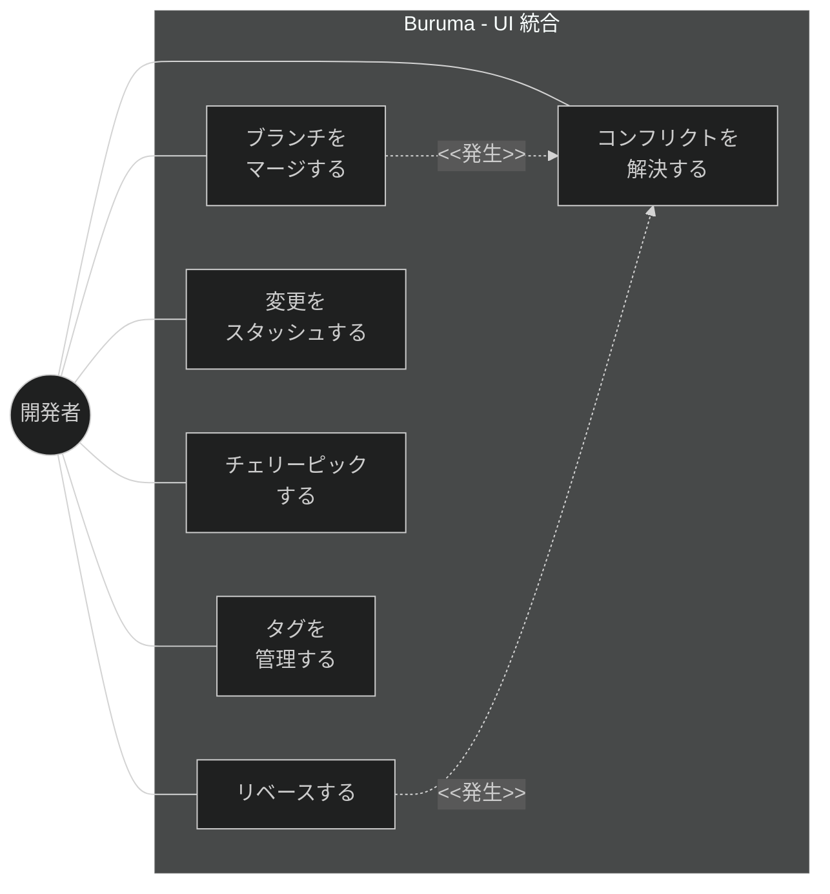

# 高度な Git 操作 UI 統合 要求仕様書

## 概要

Advanced Git Operations で実装済みの 7 UI コンポーネント（MergeDialog, ConflictResolver, ThreeWayMergeView, StashManager,
RebaseEditor, CherryPickDialog, TagManager）を、既存の RepositoryDetailPanel に統合し、ユーザーがアプリの画面から操作できるようにする。

---

# 1. 要求図の読み方

## 1.1. 要求タイプ

- **requirement**: ユーザー要求
- **functionalRequirement**: 機能要求（UI 配置、導線、状態管理）
- **interfaceRequirement**: インターフェース要求（コンポーネント Props、タブ構成）

## 1.2. 優先度

- **Must**: アプリとして動作確認に必須
- **Should**: UX 改善
- **Could**: あると便利

---

# 2. 要求一覧

## 2.1. ユースケース図（概要）

## 2.2. 既存 UI 構成

RepositoryDetailPanel の現在のタブ構成:

| タブ             | 内容                                                    | 統合対象                             |
|----------------|-------------------------------------------------------|----------------------------------|
| Info           | ワークツリー情報                                              | -                                |
| Status         | StagingArea + CommitForm + PushPullButtons + DiffView | MergeDialog ボタン追加                |
| Commits        | CommitLog + CommitDetailView + DiffView               | CherryPickDialog ボタン追加           |
| Branches       | BranchOperations                                      | MergeDialog / RebaseEditor ボタン追加 |
| Files          | FileTree + DiffView                                   | -                                |
| **(新規) Stash** | -                                                     | **StashManager**                 |
| **(新規) Tags**  | -                                                     | **TagManager**                   |

## 2.3. 統合方針

| コンポーネント           | 統合方式                      | 配置先                                  |
|-------------------|---------------------------|--------------------------------------|
| MergeDialog       | ダイアログ（ボタンから起動）            | Branches タブ内にボタン追加                   |
| RebaseEditor      | ダイアログ（ボタンから起動）            | Branches タブ内にボタン追加                   |
| CherryPickDialog  | ダイアログ（ボタンから起動）            | Commits タブ内にボタン追加                    |
| ConflictResolver  | フルパネル表示（コンフリクト発生時に自動遷移）   | RepositoryDetailPanel 全体を置き換え        |
| StashManager      | 新規タブ                      | RepositoryDetailPanel に "Stash" タブ追加 |
| TagManager        | 新規タブ                      | RepositoryDetailPanel に "Tags" タブ追加  |
| ThreeWayMergeView | ConflictResolver 内に組み込み済み | -                                    |

---

# 3. 要求図（SysML Requirements Diagram）

```mermaid
requirementDiagram
    requirement UIIntegration {
        id: UR_501
        text: "高度な Git 操作を既存 UI から操作できる"
        risk: low
        verifymethod: demonstration
    }

    functionalRequirement MergeAccess {
        id: FR_501
        text: "Branches タブからマージダイアログを起動できる"
        risk: low
        verifymethod: test
    }

    functionalRequirement RebaseAccess {
        id: FR_502
        text: "Branches タブからリベースエディタを起動できる"
        risk: low
        verifymethod: test
    }

    functionalRequirement StashTab {
        id: FR_503
        text: "Stash タブでスタッシュ管理ができる"
        risk: low
        verifymethod: test
    }

    functionalRequirement CherryPickAccess {
        id: FR_504
        text: "Commits タブからチェリーピックダイアログを起動できる"
        risk: low
        verifymethod: test
    }

    functionalRequirement ConflictPanel {
        id: FR_505
        text: "コンフリクト発生時にコンフリクト解決パネルに自動遷移する"
        risk: medium
        verifymethod: test
    }

    functionalRequirement TagTab {
        id: FR_506
        text: "Tags タブでタグ管理ができる"
        risk: low
        verifymethod: test
    }

    functionalRequirement RefreshAfterOp {
        id: FR_507
        text: "操作完了後にステータス・ブランチ・コミットログがリフレッシュされる"
        risk: medium
        verifymethod: test
    }

    functionalRequirement CollapsibleBranchSidebar {
        id: FR_508
        text: "Commits タブのブランチパネルを折り畳み可能にする"
        risk: low
        verifymethod: test
    }

    functionalRequirement BranchContextMenu {
        id: FR_509
        text: "ブランチ右クリックでチェックアウト・マージ・リベース等のコンテキストメニューを表示する"
        risk: low
        verifymethod: test
    }

    functionalRequirement CompactIconToolbar {
        id: FR_510
        text: "ブランチ操作ボタンをアイコンのみ表示+ツールチップに変更し表示領域を節約する"
        risk: low
        verifymethod: demonstration
    }

    UIIntegration - contains -> MergeAccess
    UIIntegration - contains -> RebaseAccess
    UIIntegration - contains -> StashTab
    UIIntegration - contains -> CherryPickAccess
    UIIntegration - contains -> ConflictPanel
    UIIntegration - contains -> TagTab
    UIIntegration - contains -> RefreshAfterOp
    UIIntegration - contains -> CollapsibleBranchSidebar
    UIIntegration - contains -> BranchContextMenu
    functionalRequirement ResetToCommit {
        id: FR_511
        text: "コミット右クリックから指定コミットまでリセット（soft/mixed/hard）を実行できる"
        risk: medium
        verifymethod: test
    }

    UIIntegration - contains -> CompactIconToolbar
    UIIntegration - contains -> ResetToCommit
```

---

# 4. 要求の詳細説明

## 4.1. 機能要求

### FR_501: マージダイアログアクセス

Branches タブの BranchOperations コンポーネント内に「マージ」ボタンを追加。クリックで MergeDialog
を開く。worktreePath、currentBranch、branches を ViewModel から取得して Props に渡す。マージ完了後に onConflict
でコンフリクト解決パネルに遷移する。

### FR_502: リベースエディタアクセス

Branches タブに「リベース」ボタンを追加。クリックで RebaseEditor をダイアログとして開く。コンフリクト発生時は
ConflictResolver に遷移。

### FR_503: Stash タブ

RepositoryDetailPanel に新規 "Stash" タブを追加。タブ内容として StashManager コンポーネントを配置。worktreePath を Props
で渡す。

### FR_504: チェリーピックダイアログアクセス

Commits タブに「チェリーピック」ボタンを追加。コミットログで選択中のコミットハッシュをデフォルト入力として CherryPickDialog
を開く。

### FR_505: コンフリクト解決パネル

マージ・リベース・チェリーピックでコンフリクトが発生した場合、RepositoryDetailPanel の通常タブ表示を非表示にし、ConflictResolver
をフルパネルで表示する。解決完了または中止で通常のタブ表示に戻る。

### FR_506: Tags タブ

RepositoryDetailPanel に新規 "Tags" タブを追加。タブ内容として TagManager コンポーネントを配置。

### FR_507: 操作完了後のリフレッシュ

マージ・リベース・チェリーピック・スタッシュ pop/apply の操作完了後に、repository-viewer の `git:status`、`git:branches`、
`git:log` を呼び出してステータスをリフレッシュする。

### FR_508: ブランチパネル折りたたみ

Commits タブのブランチパネル（BranchOperations）を折り畳み可能にする。ドラッグまたはトグルボタンで折りたたみ/展開を切り替えられること。折りたたみ時にコミット履歴の表示領域が拡大されること。

### FR_509: ブランチコンテキストメニュー

ブランチ一覧の各項目を右クリックした際にコンテキストメニューを表示する。メニュー項目はブランチの種別（ローカル HEAD /
ローカル非 HEAD / リモート）に応じて異なる:

- **ローカル（非 HEAD）**: チェックアウト、現在のブランチにマージ、このブランチへリベース、削除
- **ローカル（HEAD）**: マージ...、リベース...、新規ブランチ...
- **リモート**: リモートブランチを削除

なお、削除操作（ローカルブランチ削除・リモートブランチ削除）は不可逆であるため、実行前に確認ダイアログを表示する（CONSTITUTION.md
B-002 準拠）。

### FR_510: アイコンのみツールバー

ブランチ操作ヘッダーのボタン（マージ/リベース/新規作成）をアイコンのみの表示に変更し、ホバー時にツールチップで操作名を表示する。テキストラベルを削除することで表示領域を節約する。

### FR_511: コミットリセット

コミット一覧の各コミットを右クリックした際に「このコミットまでリセット」サブメニューを表示する。リセットモードとして soft（変更をステージに保持）、mixed��変更をワーキングツリーに保持）、hard（変更を破棄）の3種類を選択できること。

hard リセットは不可逆操作であるため、メニュー項目を視覚的に警告表示する（CONSTITUTION.md B-002 準拠）。バックエンドとして `git:reset` IPC チャネルをフル実装する（Domain 型定義 → IPC → Main UseCase/Repository → Preload → Renderer UseCase/ViewModel）。

---

# 5. スコープ外

- 新しいコンポーネントの作成（既存コンポーネントの統合のみ）
- advanced-git-operations のバックエンドロジックの変更
- RepositoryDetailPanel のレイアウト大規模リデザイン

---

# 6. 前提条件

- [advanced-git-operations.md](./advanced-git-operations.md) の機能が実装済みであること
- RepositoryDetailPanel が Tabs コンポーネントで構成されていること

---

# 要求サマリー

| カテゴリ        | 件数     |
|-------------|--------|
| ユーザー要求 (UR) | 1      |
| 機能要求 (FR)   | 11     |
| **合計**      | **12** |

| 優先度         | 件数                                        |
|-------------|-------------------------------------------|
| 必須 (Must)   | 5（FR_501, FR_503, FR_505, FR_506, FR_507） |
| 推奨 (Should) | 5（FR_502, FR_504, FR_508, FR_509, FR_511） |
| 任意 (Could)  | 1（FR_510）                                 |

> **採番規則:** 本PRDの要求IDは500番台を使用する。
