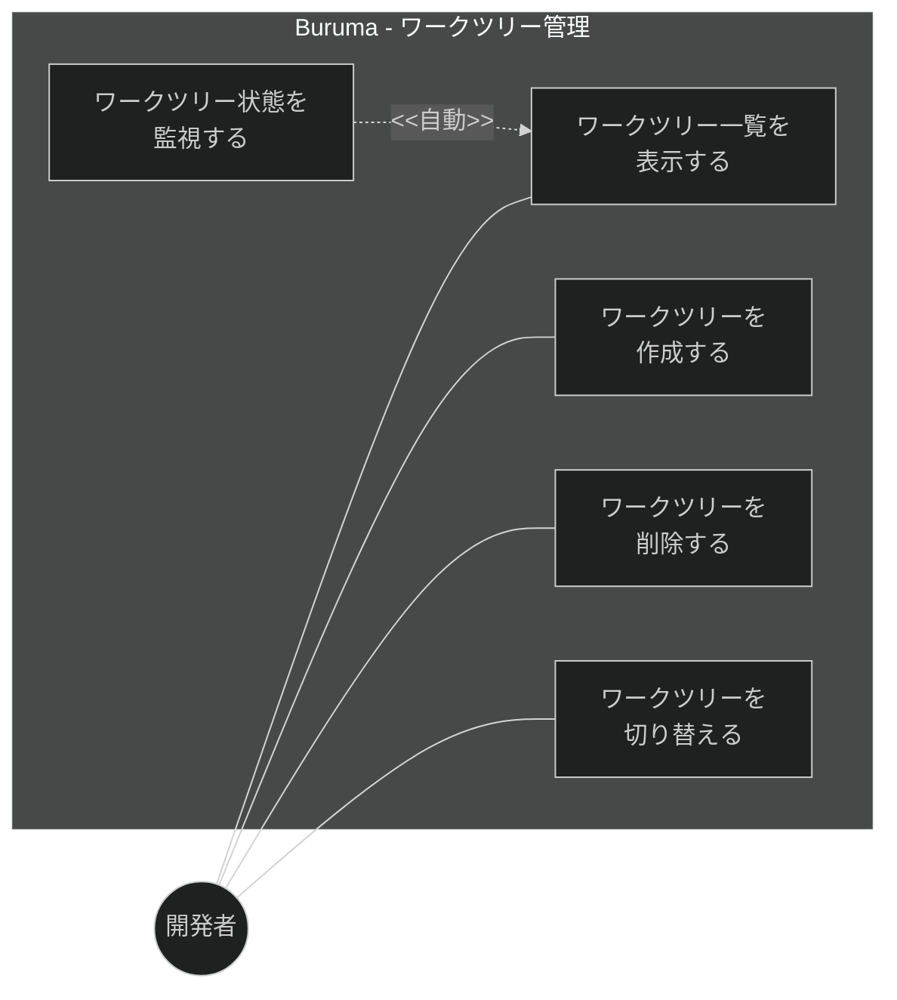
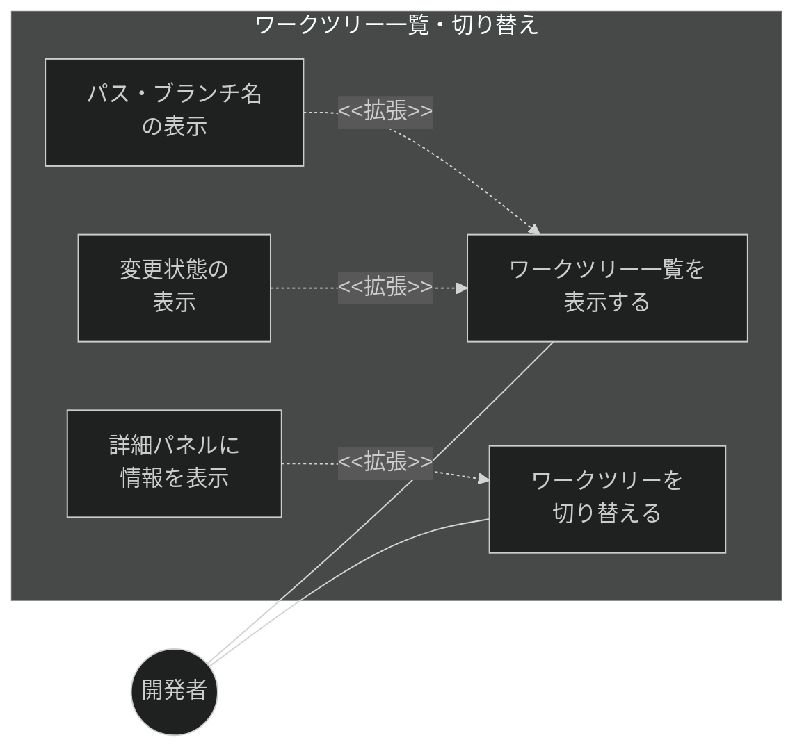
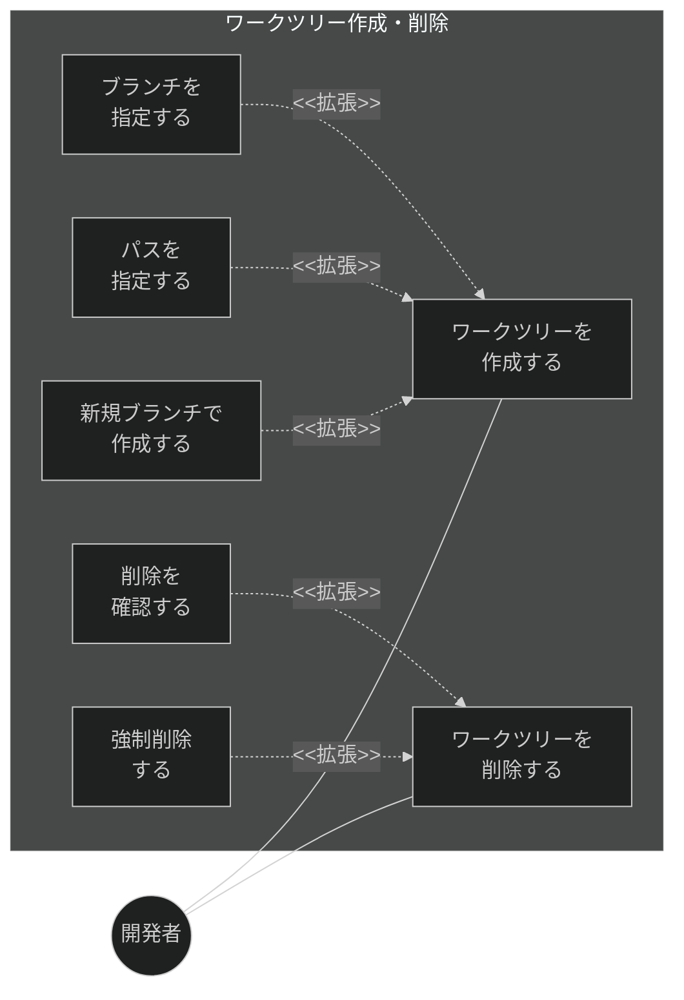
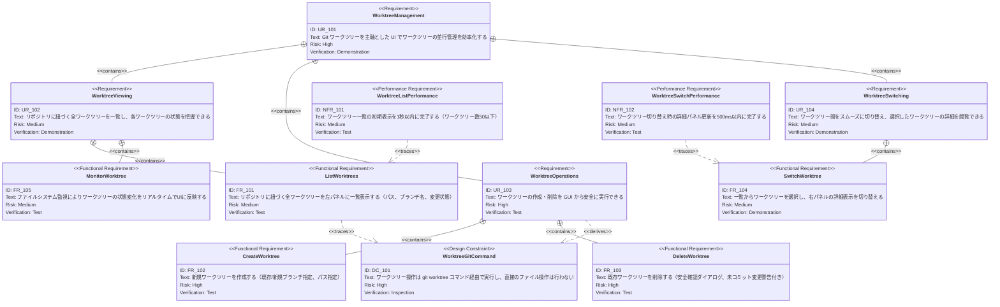

# ワークツリー管理 要求仕様書

## 概要

本ドキュメントは、Buruma のコア機能であるワークツリー管理に関する要求仕様を定義する。ワークツリーの一覧表示・作成・削除・切り替え・状態監視を対象とし、Buruma の UI 主軸となる左パネルのワークツリー一覧と、右パネルへの詳細表示切り替えを実現する。

---

# 1. 要求図の読み方

## 1.1. 要求タイプ

- **requirement**: 一般的な要求（ユーザー要求）
- **functionalRequirement**: 機能要求（Git操作、UI操作、IPC通信など）
- **performanceRequirement**: パフォーマンス要求（応答時間、メモリ使用量など）
- **interfaceRequirement**: インターフェース要求（IPC API、UI仕様など）
- **designConstraint**: 設計制約（Electronセキュリティ、プロセス分離など）

## 1.2. リスクレベル

- **High**: 高リスク（データ損失の可能性、Git操作の不可逆性）
- **Medium**: 中リスク（UX劣化、パフォーマンス低下）
- **Low**: 低リスク（表示の改善、Nice to have）

## 1.3. 検証方法

- **Analysis**: 分析による検証
- **Test**: テストによる検証（E2Eテスト、ユニットテスト）
- **Demonstration**: デモンストレーションによる検証（UIの動作確認）
- **Inspection**: インスペクション（コードレビュー、セキュリティ監査）

## 1.4. 関係タイプ

- **contains**: 包含関係（親要求が子要求を含む）
- **derives**: 派生関係（要求から別の要求が導出される）
- **satisfies**: 満足関係（要素が要求を満たす）
- **verifies**: 検証関係（テストケースが要求を検証する）
- **refines**: 詳細化関係（要求をより詳細に定義する）
- **traces**: トレース関係（要求間の追跡可能性）

---

# 2. 要求一覧

## 2.1. ユースケース図（概要）

## 2.2. ユースケース図（詳細）

### ワークツリー一覧・切り替え

### ワークツリー作成・削除

## 2.3. 機能一覧（テキスト形式）

- ワークツリー一覧表示
    - リポジトリに紐づく全ワークツリーの一覧（左パネル）
    - パス、ブランチ名、変更状態の表示
    - ワークツリーの並び替え・フィルタリング
- ワークツリー作成
    - 既存ブランチを指定した作成
    - 新規ブランチを指定した作成
    - 作成先パスの指定
- ワークツリー削除
    - 安全確認ダイアログ付き削除
    - 未コミット変更がある場合の警告
    - 強制削除オプション
- ワークツリー切り替え
    - 一覧からの選択による詳細パネル切り替え
    - 詳細パネル表示内容（ブランチ、ステータス、ログ、差分、変更ファイル）
- ワークツリー状態監視
    - ファイルシステム監視によるリアルタイム更新
    - 変更検出時の一覧自動リフレッシュ

---

# 3. 要求図（SysML Requirements Diagram）

## 3.1. 全体要求図

---

# 4. 要求の詳細説明

## 4.1. ユーザー要求

### UR_101: ワークツリー管理

Buruma の主軸機能として、Git ワークツリーを中心とした UI を提供する。開発者が複数のワークツリーを並行して管理し、効率的にブランチ間を行き来できるようにする。左パネルにワークツリー一覧、右パネルに選択ワークツリーの詳細を表示する2カラムレイアウトを採用する。

### UR_102: ワークツリー閲覧

リポジトリに紐づく全ワークツリーを一覧し、各ワークツリーのパス・ブランチ名・変更状態を一目で把握できるようにする。

### UR_103: ワークツリー操作

ワークツリーの作成・削除を GUI から安全に実行できるようにする。不可逆な操作（削除）には確認ダイアログを表示し、未コミット変更がある場合は警告する。

### UR_104: ワークツリー切り替え

ワークツリー一覧から選択することで、右パネルの詳細表示（ブランチ情報、ステータス、ログ、差分、変更ファイル）をスムーズに切り替えられるようにする。

## 4.2. 機能要求

### FR_101: ワークツリー一覧表示

リポジトリに紐づく全ワークツリーを左パネルに一覧表示する。

**含まれる機能:**

- FR_101_01: `git worktree list` 相当の情報を取得し一覧表示
- FR_101_02: 各ワークツリーのパス、ブランチ名、HEAD コミットを表示
- FR_101_03: 変更状態（dirty/clean）のインジケーター表示
- FR_101_04: ワークツリーの並び替え（名前順、最終更新順）
- FR_101_05: メインワークツリーと追加ワークツリーの視覚的な区別

**検証方法:** テストによる検証

### FR_102: ワークツリー作成

新規ワークツリーを作成するダイアログを提供する。

**含まれる機能:**

- FR_102_01: 既存ブランチを指定したワークツリー作成
- FR_102_02: 新規ブランチを指定したワークツリー作成（`-b` オプション相当）
- FR_102_03: 作成先パスの指定（デフォルトパスの自動提案付き）
- FR_102_04: 作成完了後の自動切り替え

**検証方法:** テストによる検証

### FR_103: ワークツリー削除

既存ワークツリーを安全に削除する。

**含まれる機能:**

- FR_103_01: 削除前の確認ダイアログ表示
- FR_103_02: 未コミット変更がある場合の警告メッセージ
- FR_103_03: 強制削除オプション（`--force` 相当）
- FR_103_04: メインワークツリーの削除防止

**検証方法:** テストによる検証

### FR_104: ワークツリー切り替え

一覧からワークツリーを選択し、詳細パネルの表示内容を切り替える。

**含まれる機能:**

- FR_104_01: 一覧項目のクリック/キーボード選択による切り替え
- FR_104_02: 詳細パネルへのブランチ情報・ステータス・ログ・差分・変更ファイルの表示
- FR_104_03: 選択中のワークツリーの視覚的ハイライト

**検証方法:** デモンストレーションによる検証

### FR_105: ワークツリー状態監視

ファイルシステム監視により、ワークツリーの状態変化をリアルタイムで検出しUIに反映する。

**含まれる機能:**

- FR_105_01: ファイルシステムウォッチャーによる変更検出
- FR_105_02: 変更検出時のワークツリー一覧の自動リフレッシュ
- FR_105_03: 外部で作成/削除されたワークツリーの検出

**検証方法:** テストによる検証

## 4.3. 非機能要求

### NFR_101: ワークツリー一覧表示パフォーマンス

ワークツリー一覧の初期表示を1秒以内に完了する。ワークツリー数が50以下の場合のベンチマーク値。

**検証方法:** テストによる検証

### NFR_102: ワークツリー切り替えパフォーマンス

ワークツリー切り替え時の詳細パネル更新を500ms以内に完了する。ユーザーが操作の遅延を感じないレベル。

**検証方法:** テストによる検証

## 4.4. 設計制約

### DC_101: Git コマンド経由の操作制約

ワークツリーの作成・削除・一覧取得は `git worktree` コマンド経由で実行する。`.git` ディレクトリへの直接ファイル操作は行わない。

**検証方法:** インスペクションによる検証

---

# 5. 制約事項

## 5.1. 技術的制約

- ワークツリー操作は `git worktree` コマンドに依存するため、Git 2.5 以上が必要
- ファイルシステム監視は OS ネイティブの監視API（macOS: FSEvents, Windows: ReadDirectoryChangesW, Linux: inotify）に依存

## 5.2. ビジネス的制約

- ワークツリーは Buruma の主軸機能であり、最優先で実装する

---

# 6. 前提条件

- Git 2.5 以上がインストール済みであること
- リポジトリがベアリポジトリでないこと（通常のワーキングコピー）
- ファイルシステムへの書き込み権限があること

---

# 7. スコープ外

以下は本PRDのスコープ外とする：

- ワークツリー内の Git ステータス・ログ・差分の詳細表示（→ FG-2: リポジトリ閲覧）
- ワークツリー内でのコミット・プッシュ等の Git 操作（→ FG-3/FG-4: Git 操作）
- リモートリポジトリとの同期
- ワークツリーのリネーム（Git がネイティブにサポートしていない）

---

# 8. 用語集

| 用語 | 定義 |
|------|------|
| ワークツリー | Git worktree。同一リポジトリの複数チェックアウトを管理する仕組み |
| メインワークツリー | リポジトリのクローン時に作成される最初のワークツリー。削除不可 |
| 追加ワークツリー | `git worktree add` で作成されたワークツリー。削除可能 |
| dirty | 未コミットの変更がある状態 |
| clean | 未コミットの変更がない状態 |
| 左パネル | Buruma の UI で常時表示されるワークツリー一覧エリア |
| 右パネル（詳細パネル） | 選択したワークツリーの詳細情報を表示するエリア |

---

# 要求サマリー

| カテゴリ | 件数 |
|----------|------|
| ユーザー要求 (UR) | 4 |
| 機能要求 (FR) | 5 |
| 非機能要求 (NFR) | 2 |
| 設計制約 (DC) | 1 |
| **合計** | **12** |

| 優先度 | 件数 |
|--------|------|
| 必須 (Must) | 8（UR_101, UR_102, UR_103, FR_101, FR_102, FR_103, FR_104, DC_101） |
| 推奨 (Should) | 4（UR_104, FR_105, NFR_101, NFR_102） |
| 任意 (Could) | 0 |

> **採番規則:** 本PRDの要求IDは100番台を使用する（FG-1: ワークツリー管理）。他機能グループとの区別のため、FG-6は600番台、FG-2は200番台を使用する。
