# 高度な Git 操作

**関連 Spec:** [advanced-git-operations_spec.md](./advanced-git-operations_spec.md)
**関連 PRD:** [advanced-git-operations.md](../requirement/advanced-git-operations.md)

---

# 1. 実装ステータス

**ステータス:** 🔴 未実装

## 1.1. 実装進捗

| モジュール/機能          | ステータス | 備考                        |
|-------------------|-------|---------------------------|
| MergeService      | 🔴    | マージ実行・中止                  |
| RebaseService     | 🔴    | 通常/インタラクティブリベース           |
| StashService      | 🔴    | スタッシュ CRUD                |
| CherryPickService | 🔴    | チェリーピック実行                 |
| ConflictService   | 🔴    | コンフリクト解決                  |
| TagService        | 🔴    | タグ CRUD                   |
| MergeDialog       | 🔴    | マージ UI                    |
| RebaseEditor      | 🔴    | インタラクティブリベース UI           |
| StashManager      | 🔴    | スタッシュ管理 UI                |
| ConflictResolver  | 🔴    | 3ウェイマージ UI（Monaco Editor） |
| TagManager        | 🔴    | タグ管理 UI                   |

---

# 2. 設計目標

1. **安全な操作実行** — すべての不可逆操作に確認ステップを設け、操作中は常に abort オプションを提供する（原則 B-002,
   DC_401）
2. **視覚的なコンフリクト解決** — Monaco Editor を用いた3ウェイマージ表示で、CLI より直感的なコンフリクト解決を提供する
3. **simple-git による統一的な Git 操作** — Git 操作をすべて simple-git ライブラリ経由で実行し、コマンドパーサーの独自実装を避ける（原則
   A-002）
4. **型安全な IPC 通信** — `IPCResult<T>` パターンで統一し、エラーハンドリングを一貫させる（原則 T-001, T-002）
5. **操作進捗のリアルタイムフィードバック** — 500ms 以内の進捗表示と30秒以内の完了通知（NFR_401）

---

# 3. 技術スタック

| 領域           | 採用技術                                 | 選定理由                                                                 |
|--------------|--------------------------------------|----------------------------------------------------------------------|
| Git 操作       | simple-git                           | Git コマンドの TypeScript ラッパー。マージ・リベース・スタッシュ等の高度な操作を API として提供（原則 A-002） |
| コンフリクト解決エディタ | Monaco Editor (@monaco-editor/react) | 3ウェイ差分表示、シンタックスハイライト、VS Code との親和性（原則 A-002、CONSTITUTION 推奨）         |
| ドラッグ&ドロップ    | @dnd-kit/core                        | リベースエディタでのコミット並べ替え。React 向け軽量 DnD ライブラリ                              |

<details>
<summary>プロジェクト共通スタック（参考）</summary>

| 領域        | 採用技術                                     |
|-----------|------------------------------------------|
| フレームワーク   | Electron 41 + Electron Forge 7           |
| バンドラー     | Vite 5                                   |
| UI        | React 19 + TypeScript                    |
| スタイリング    | Tailwind CSS v4 (`@tailwindcss/postcss`) |
| UIコンポーネント | Shadcn/ui                                |
| Git操作     | simple-git（予定）                           |
| エディタ      | Monaco Editor（予定）                        |

</details>

---

# 4. アーキテクチャ

## 4.1. システム構成図

```mermaid
graph TD
    subgraph "Renderer Process"
        React[React UI]
        MergeDialog[MergeDialog]
        RebaseEditor[RebaseEditor]
        StashManager[StashManager]
        CherryPickDialog[CherryPickDialog]
        ConflictResolver[ConflictResolver]
        TagManager[TagManager]
        ProgressBar[OperationProgressBar]
        ConfirmDialog[DestructiveActionConfirmDialog]
        MonacoEditor[Monaco Editor]
        React --> MergeDialog
        React --> RebaseEditor
        React --> StashManager
        React --> CherryPickDialog
        React --> ConflictResolver
        React --> TagManager
        React --> ProgressBar
        React --> ConfirmDialog
        ConflictResolver --> MonacoEditor
    end

    subgraph "Preload"
        Bridge[contextBridge API]
        GitAPI[git.* API]
        Bridge --> GitAPI
    end

    subgraph "Main Process"
        IPCRouter[IPC Router]
        MergeService[MergeService]
        RebaseService[RebaseService]
        StashService[StashService]
        CherryPickService[CherryPickService]
        ConflictService[ConflictService]
        TagService[TagService]
        SafetyGuard[SafetyGuard]
        SimpleGit[simple-git]
        IPCRouter --> MergeService
        IPCRouter --> RebaseService
        IPCRouter --> StashService
        IPCRouter --> CherryPickService
        IPCRouter --> ConflictService
        IPCRouter --> TagService
        MergeService --> SafetyGuard
        RebaseService --> SafetyGuard
        MergeService --> SimpleGit
        RebaseService --> SimpleGit
        StashService --> SimpleGit
        CherryPickService --> SimpleGit
        ConflictService --> SimpleGit
        TagService --> SimpleGit
    end

    React -->|" invoke "| Bridge
    Bridge -->|" ipcRenderer "| IPCRouter
    IPCRouter -->|" response "| Bridge
    Bridge -->|" result "| React
    IPCRouter -->|" webContents.send "| Bridge
    Bridge -->|" onProgress "| ProgressBar
```



## 4.2. モジュール分割

| モジュール名                         | プロセス     | 責務                            | 配置場所                                                    |
|--------------------------------|----------|-------------------------------|---------------------------------------------------------|
| MergeService                   | main     | マージ実行・中止・状態取得                 | `src/main/services/git/merge.ts`                        |
| RebaseService                  | main     | リベース実行・中止・続行・コミット一覧取得         | `src/main/services/git/rebase.ts`                       |
| StashService                   | main     | スタッシュの退避・復元・削除・一覧取得           | `src/main/services/git/stash.ts`                        |
| CherryPickService              | main     | チェリーピック実行・中止                  | `src/main/services/git/cherry-pick.ts`                  |
| ConflictService                | main     | コンフリクトファイル一覧・3ウェイ内容取得・解決処理    | `src/main/services/git/conflict.ts`                     |
| TagService                     | main     | タグの作成・削除・一覧取得                 | `src/main/services/git/tag.ts`                          |
| SafetyGuard                    | main     | 不可逆操作の安全性チェック（未コミット変更検出等）     | `src/main/services/git/safety-guard.ts`                 |
| Git IPC ハンドラー                  | main     | 高度な Git 操作の IPC ルーティング        | `src/main/ipc/git-advanced.ts`                          |
| Git 型定義                        | shared   | 高度な Git 操作の型定義                | `src/types/git-advanced.ts`                             |
| preload Git API                | preload  | contextBridge 経由の Git 操作 API  | `src/preload.ts`（既存ファイルに追加）                             |
| MergeDialog                    | renderer | マージ設定 UI                      | `src/components/git/MergeDialog.tsx`                    |
| RebaseEditor                   | renderer | インタラクティブリベース UI               | `src/components/git/RebaseEditor.tsx`                   |
| StashManager                   | renderer | スタッシュ管理 UI                    | `src/components/git/StashManager.tsx`                   |
| CherryPickDialog               | renderer | チェリーピック UI                    | `src/components/git/CherryPickDialog.tsx`               |
| ConflictResolver               | renderer | コンフリクト解決 UI（Monaco Editor 統合） | `src/components/git/ConflictResolver.tsx`               |
| ThreeWayMergeView              | renderer | 3ウェイマージ差分表示（Monaco Editor）    | `src/components/git/ThreeWayMergeView.tsx`              |
| TagManager                     | renderer | タグ管理 UI                       | `src/components/git/TagManager.tsx`                     |
| OperationProgressBar           | renderer | 操作進捗表示                        | `src/components/git/OperationProgressBar.tsx`           |
| DestructiveActionConfirmDialog | renderer | 不可逆操作確認ダイアログ                  | `src/components/git/DestructiveActionConfirmDialog.tsx` |

---

# 5. データモデル

```typescript
// simple-git のインスタンス管理
// ワークツリーパスごとに simple-git インスタンスを生成
import simpleGit, {SimpleGit} from 'simple-git';

function createGitInstance(worktreePath: string): SimpleGit {
    return simpleGit(worktreePath);
}
```

---

# 6. インターフェース定義

## 6.1. IPC ハンドラー（メインプロセス側）

```typescript
// src/main/ipc/git-advanced.ts
import {ipcMain, BrowserWindow} from 'electron';
import type {IPCResult} from '../../types/ipc';
import type {
    MergeOptions,
    MergeResult,
    MergeStatus,
    RebaseOptions,
    InteractiveRebaseOptions,
    RebaseResult,
    RebaseStep,
    StashSaveOptions,
    StashEntry,
    CherryPickOptions,
    CherryPickResult,
    ConflictFile,
    ThreeWayContent,
    ConflictResolveOptions,
    ConflictResolveAllOptions,
    TagInfo,
    TagCreateOptions,
    OperationProgress,
} from '../../types/git-advanced';

export function registerAdvancedGitHandlers(
    mergeService: MergeService,
    rebaseService: RebaseService,
    stashService: StashService,
    cherryPickService: CherryPickService,
    conflictService: ConflictService,
    tagService: TagService,
    mainWindow: BrowserWindow,
): void {
    // --- マージ ---
    ipcMain.handle('git:merge', async (_event, options: MergeOptions): Promise<IPCResult<MergeResult>> => {
        return mergeService.merge(options);
    });

    ipcMain.handle('git:merge-abort', async (_event, args: { worktreePath: string }): Promise<IPCResult<void>> => {
        return mergeService.abort(args.worktreePath);
    });

    ipcMain.handle('git:merge-status', async (_event, args: {
        worktreePath: string
    }): Promise<IPCResult<MergeStatus>> => {
        return mergeService.getStatus(args.worktreePath);
    });

    // --- リベース ---
    ipcMain.handle('git:rebase', async (_event, options: RebaseOptions): Promise<IPCResult<RebaseResult>> => {
        return rebaseService.rebase(options);
    });

    ipcMain.handle('git:rebase-interactive', async (_event, options: InteractiveRebaseOptions): Promise<IPCResult<RebaseResult>> => {
        return rebaseService.interactiveRebase(options);
    });

    ipcMain.handle('git:rebase-abort', async (_event, args: { worktreePath: string }): Promise<IPCResult<void>> => {
        return rebaseService.abort(args.worktreePath);
    });

    ipcMain.handle('git:rebase-continue', async (_event, args: {
        worktreePath: string
    }): Promise<IPCResult<RebaseResult>> => {
        return rebaseService.continue(args.worktreePath);
    });

    ipcMain.handle('git:rebase-get-commits', async (_event, args: {
        worktreePath: string;
        onto: string
    }): Promise<IPCResult<RebaseStep[]>> => {
        return rebaseService.getCommits(args.worktreePath, args.onto);
    });

    // --- スタッシュ ---
    ipcMain.handle('git:stash-save', async (_event, options: StashSaveOptions): Promise<IPCResult<void>> => {
        return stashService.save(options);
    });

    ipcMain.handle('git:stash-list', async (_event, args: {
        worktreePath: string
    }): Promise<IPCResult<StashEntry[]>> => {
        return stashService.list(args.worktreePath);
    });

    ipcMain.handle('git:stash-pop', async (_event, args: {
        worktreePath: string;
        index: number
    }): Promise<IPCResult<void>> => {
        return stashService.pop(args.worktreePath, args.index);
    });

    ipcMain.handle('git:stash-apply', async (_event, args: {
        worktreePath: string;
        index: number
    }): Promise<IPCResult<void>> => {
        return stashService.apply(args.worktreePath, args.index);
    });

    ipcMain.handle('git:stash-drop', async (_event, args: {
        worktreePath: string;
        index: number
    }): Promise<IPCResult<void>> => {
        return stashService.drop(args.worktreePath, args.index);
    });

    ipcMain.handle('git:stash-clear', async (_event, args: { worktreePath: string }): Promise<IPCResult<void>> => {
        return stashService.clear(args.worktreePath);
    });

    // --- チェリーピック ---
    ipcMain.handle('git:cherry-pick', async (_event, options: CherryPickOptions): Promise<IPCResult<CherryPickResult>> => {
        return cherryPickService.cherryPick(options);
    });

    ipcMain.handle('git:cherry-pick-abort', async (_event, args: {
        worktreePath: string
    }): Promise<IPCResult<void>> => {
        return cherryPickService.abort(args.worktreePath);
    });

    // --- コンフリクト解決 ---
    ipcMain.handle('git:conflict-list', async (_event, args: {
        worktreePath: string
    }): Promise<IPCResult<ConflictFile[]>> => {
        return conflictService.listConflicts(args.worktreePath);
    });

    ipcMain.handle('git:conflict-file-content', async (_event, args: {
        worktreePath: string;
        filePath: string
    }): Promise<IPCResult<ThreeWayContent>> => {
        return conflictService.getThreeWayContent(args.worktreePath, args.filePath);
    });

    ipcMain.handle('git:conflict-resolve', async (_event, options: ConflictResolveOptions): Promise<IPCResult<void>> => {
        return conflictService.resolve(options);
    });

    ipcMain.handle('git:conflict-resolve-all', async (_event, options: ConflictResolveAllOptions): Promise<IPCResult<void>> => {
        return conflictService.resolveAll(options);
    });

    ipcMain.handle('git:conflict-mark-resolved', async (_event, args: {
        worktreePath: string;
        filePath: string
    }): Promise<IPCResult<void>> => {
        return conflictService.markResolved(args.worktreePath, args.filePath);
    });

    // --- タグ ---
    ipcMain.handle('git:tag-list', async (_event, args: { worktreePath: string }): Promise<IPCResult<TagInfo[]>> => {
        return tagService.list(args.worktreePath);
    });

    ipcMain.handle('git:tag-create', async (_event, options: TagCreateOptions): Promise<IPCResult<void>> => {
        return tagService.create(options);
    });

    ipcMain.handle('git:tag-delete', async (_event, args: {
        worktreePath: string;
        tagName: string
    }): Promise<IPCResult<void>> => {
        return tagService.delete(args.worktreePath, args.tagName);
    });

    // --- 進捗通知ヘルパー ---
    function sendProgress(progress: OperationProgress): void {
        mainWindow.webContents.send('git:operation-progress', progress);
    }

    // 各サービスに進捗通知コールバックを注入
    mergeService.onProgress = sendProgress;
    rebaseService.onProgress = sendProgress;
    cherryPickService.onProgress = sendProgress;
}
```

## 6.2. Preload API（contextBridge 経由）

``` typescript
// src/preload.ts に追加
// 既存の electronAPI.repository, electronAPI.settings に加えて git を追加

git: {
  // マージ
  merge: (options: MergeOptions): Promise<IPCResult<MergeResult>> =>
    ipcRenderer.invoke('git:merge', options),
  mergeAbort: (worktreePath: string): Promise<IPCResult<void>> =>
    ipcRenderer.invoke('git:merge-abort', { worktreePath }),
  mergeStatus: (worktreePath: string): Promise<IPCResult<MergeStatus>> =>
    ipcRenderer.invoke('git:merge-status', { worktreePath }),

  // リベース
  rebase: (options: RebaseOptions): Promise<IPCResult<RebaseResult>> =>
    ipcRenderer.invoke('git:rebase', options),
  rebaseInteractive: (options: InteractiveRebaseOptions): Promise<IPCResult<RebaseResult>> =>
    ipcRenderer.invoke('git:rebase-interactive', options),
  rebaseAbort: (worktreePath: string): Promise<IPCResult<void>> =>
    ipcRenderer.invoke('git:rebase-abort', { worktreePath }),
  rebaseContinue: (worktreePath: string): Promise<IPCResult<RebaseResult>> =>
    ipcRenderer.invoke('git:rebase-continue', { worktreePath }),
  rebaseGetCommits: (worktreePath: string, onto: string): Promise<IPCResult<RebaseStep[]>> =>
    ipcRenderer.invoke('git:rebase-get-commits', { worktreePath, onto }),

  // スタッシュ
  stashSave: (options: StashSaveOptions): Promise<IPCResult<void>> =>
    ipcRenderer.invoke('git:stash-save', options),
  stashList: (worktreePath: string): Promise<IPCResult<StashEntry[]>> =>
    ipcRenderer.invoke('git:stash-list', { worktreePath }),
  stashPop: (worktreePath: string, index: number): Promise<IPCResult<void>> =>
    ipcRenderer.invoke('git:stash-pop', { worktreePath, index }),
  stashApply: (worktreePath: string, index: number): Promise<IPCResult<void>> =>
    ipcRenderer.invoke('git:stash-apply', { worktreePath, index }),
  stashDrop: (worktreePath: string, index: number): Promise<IPCResult<void>> =>
    ipcRenderer.invoke('git:stash-drop', { worktreePath, index }),
  stashClear: (worktreePath: string): Promise<IPCResult<void>> =>
    ipcRenderer.invoke('git:stash-clear', { worktreePath }),

  // チェリーピック
  cherryPick: (options: CherryPickOptions): Promise<IPCResult<CherryPickResult>> =>
    ipcRenderer.invoke('git:cherry-pick', options),
  cherryPickAbort: (worktreePath: string): Promise<IPCResult<void>> =>
    ipcRenderer.invoke('git:cherry-pick-abort', { worktreePath }),

  // コンフリクト解決
  conflictList: (worktreePath: string): Promise<IPCResult<ConflictFile[]>> =>
    ipcRenderer.invoke('git:conflict-list', { worktreePath }),
  conflictFileContent: (worktreePath: string, filePath: string): Promise<IPCResult<ThreeWayContent>> =>
    ipcRenderer.invoke('git:conflict-file-content', { worktreePath, filePath }),
  conflictResolve: (options: ConflictResolveOptions): Promise<IPCResult<void>> =>
    ipcRenderer.invoke('git:conflict-resolve', options),
  conflictResolveAll: (options: ConflictResolveAllOptions): Promise<IPCResult<void>> =>
    ipcRenderer.invoke('git:conflict-resolve-all', options),
  conflictMarkResolved: (worktreePath: string, filePath: string): Promise<IPCResult<void>> =>
    ipcRenderer.invoke('git:conflict-mark-resolved', { worktreePath, filePath }),

  // タグ
  tagList: (worktreePath: string): Promise<IPCResult<TagInfo[]>> =>
    ipcRenderer.invoke('git:tag-list', { worktreePath }),
  tagCreate: (options: TagCreateOptions): Promise<IPCResult<void>> =>
    ipcRenderer.invoke('git:tag-create', options),
  tagDelete: (worktreePath: string, tagName: string): Promise<IPCResult<void>> =>
    ipcRenderer.invoke('git:tag-delete', { worktreePath, tagName }),

  // 進捗通知
  onOperationProgress: (callback: (progress: OperationProgress) => void): void => {
    ipcRenderer.on('git:operation-progress', (_event, progress) => {
      callback(progress);
    });
  },
},
```

## 6.3. レンダラー側の型定義

```typescript
// src/types/electron.d.ts に追加
import type {
    MergeOptions,
    MergeResult,
    MergeStatus,
    RebaseOptions,
    InteractiveRebaseOptions,
    RebaseResult,
    RebaseStep,
    StashSaveOptions,
    StashEntry,
    CherryPickOptions,
    CherryPickResult,
    ConflictFile,
    ThreeWayContent,
    ConflictResolveOptions,
    ConflictResolveAllOptions,
    TagInfo,
    TagCreateOptions,
    OperationProgress,
    IPCResult,
} from './git-advanced';

interface ElectronAPI {
    // ... 既存の repository, settings ...
    git: {
        merge(options: MergeOptions): Promise<IPCResult<MergeResult>>;
        mergeAbort(worktreePath: string): Promise<IPCResult<void>>;
        mergeStatus(worktreePath: string): Promise<IPCResult<MergeStatus>>;
        rebase(options: RebaseOptions): Promise<IPCResult<RebaseResult>>;
        rebaseInteractive(options: InteractiveRebaseOptions): Promise<IPCResult<RebaseResult>>;
        rebaseAbort(worktreePath: string): Promise<IPCResult<void>>;
        rebaseContinue(worktreePath: string): Promise<IPCResult<RebaseResult>>;
        rebaseGetCommits(worktreePath: string, onto: string): Promise<IPCResult<RebaseStep[]>>;
        stashSave(options: StashSaveOptions): Promise<IPCResult<void>>;
        stashList(worktreePath: string): Promise<IPCResult<StashEntry[]>>;
        stashPop(worktreePath: string, index: number): Promise<IPCResult<void>>;
        stashApply(worktreePath: string, index: number): Promise<IPCResult<void>>;
        stashDrop(worktreePath: string, index: number): Promise<IPCResult<void>>;
        stashClear(worktreePath: string): Promise<IPCResult<void>>;
        cherryPick(options: CherryPickOptions): Promise<IPCResult<CherryPickResult>>;
        cherryPickAbort(worktreePath: string): Promise<IPCResult<void>>;
        conflictList(worktreePath: string): Promise<IPCResult<ConflictFile[]>>;
        conflictFileContent(worktreePath: string, filePath: string): Promise<IPCResult<ThreeWayContent>>;
        conflictResolve(options: ConflictResolveOptions): Promise<IPCResult<void>>;
        conflictResolveAll(options: ConflictResolveAllOptions): Promise<IPCResult<void>>;
        conflictMarkResolved(worktreePath: string, filePath: string): Promise<IPCResult<void>>;
        tagList(worktreePath: string): Promise<IPCResult<TagInfo[]>>;
        tagCreate(options: TagCreateOptions): Promise<IPCResult<void>>;
        tagDelete(worktreePath: string, tagName: string): Promise<IPCResult<void>>;
        onOperationProgress(callback: (progress: OperationProgress) => void): void;
    };
}
```

---

# 7. 非機能要件実現方針

| 要件                           | 実現方針                                                                               |
|------------------------------|------------------------------------------------------------------------------------|
| 進捗フィードバック 500ms 以内 (NFR_401) | simple-git の progress イベントを監視し、`webContents.send` でレンダラーに即座に送信                     |
| 操作完了通知 30 秒以内 (NFR_401)      | 長時間操作にはタイムアウト設定。進捗バーでリアルタイム表示                                                      |
| 不可逆操作の確認 (DC_401, B-002)     | SafetyGuard モジュールで操作前に未コミット変更・進行中の操作を検出。レンダラー側で DestructiveActionConfirmDialog を表示 |
| abort の常時提供 (DC_401)         | マージ・リベース中は OperationProgressBar に abort ボタンを常時表示                                   |

---

# 8. テスト戦略

| テストレベル     | 対象                                                                                        | カバレッジ目標  |
|------------|-------------------------------------------------------------------------------------------|----------|
| ユニットテスト    | MergeService, RebaseService, StashService, CherryPickService, ConflictService, TagService | ≥ 80%    |
| ユニットテスト    | SafetyGuard（安全性チェックロジック）                                                                  | ≥ 90%    |
| ユニットテスト    | 型定義の整合性（git-advanced.ts）                                                                  | 型チェックで保証 |
| コンポーネントテスト | MergeDialog, RebaseEditor, StashManager, ConflictResolver, TagManager                     | ≥ 60%    |
| 結合テスト      | IPC ハンドラー（main ↔ preload 連携）                                                              | 主要フロー    |
| E2Eテスト     | マージ→コンフリクト解決→続行フロー                                                                        | 主要ユースケース |
| E2Eテスト     | インタラクティブリベース（squash, reorder）                                                             | 主要ユースケース |
| E2Eテスト     | スタッシュ save→list→pop フロー                                                                   | 主要ユースケース |

---

# 9. 設計判断

## 9.1. 決定事項

| 決定事項              | 選択肢                                                                      | 決定内容                      | 理由                                                                                           |
|-------------------|--------------------------------------------------------------------------|---------------------------|----------------------------------------------------------------------------------------------|
| インタラクティブリベースの実装方式 | (A) GIT_SEQUENCE_EDITOR 環境変数 / (B) git rebase --exec / (C) コミットを手動で pick | (A) GIT_SEQUENCE_EDITOR   | Git 公式の仕組み。simple-git と組み合わせてエディタスクリプトを一時ファイルとして生成し、リベースコマンドに渡す。PRD の技術制約にも明記                |
| コンフリクト解決エディタ      | (A) Monaco Editor / (B) CodeMirror / (C) カスタム差分 UI                       | (A) Monaco Editor         | VS Code との親和性が高く、3ウェイ差分表示をネイティブサポート。CONSTITUTION で推奨技術として明記（原則 A-002）                        |
| 3ウェイマージの表示レイアウト   | (A) 横並び3カラム / (B) 2カラム（diff + result） / (C) タブ切り替え                       | (A) 横並び3カラム               | base / ours / theirs を同時に参照でき、マージ結果を別パネルで編集。画面幅が狭い場合はタブ切り替えにフォールバック                          |
| スタッシュ管理の UI 配置    | (A) 専用パネル / (B) サイドバー内 / (C) ダイアログ                                       | (A) 専用パネル                 | スタッシュ一覧とプレビューを同時に表示する必要があり、ダイアログでは狭い。サイドバーの StashManager パネルとして配置                            |
| 破壊的操作の確認方式        | (A) 確認ダイアログ / (B) 入力確認（タイプして確認） / (C) 2段階ボタン                             | (A) 確認ダイアログ               | シンプルで一貫性のある UX。スタッシュ全削除、タグ削除、リベース abort 等に適用。特に危険な操作（stash clear）には操作内容の再確認テキストを表示（原則 B-002） |
| コミット並べ替え UI       | (A) ドラッグ&ドロップ / (B) 上下ボタン / (C) 番号入力                                     | (A) ドラッグ&ドロップ + (B) 上下ボタン | ドラッグ&ドロップが直感的だが、アクセシビリティのためキーボード操作（上下ボタン）も併用。@dnd-kit/core を使用                               |
| Git サービスのインスタンス管理 | (A) ワークツリーごとにインスタンス生成 / (B) シングルトン                                       | (A) ワークツリーごと              | B-001（Worktree-First）に準拠。各ワークツリーが独立した Git 操作コンテキストを持つ                                        |

## 9.2. 未解決の課題

| 課題                             | 影響度 | 対応方針                                                                                                                    |
|--------------------------------|-----|-------------------------------------------------------------------------------------------------------------------------|
| simple-git のインタラクティブリベースサポート範囲 | 高   | simple-git の raw コマンド実行機能で GIT_SEQUENCE_EDITOR を設定する。実装時に検証し、不足があれば child_process.exec にフォールバック                         |
| Monaco Editor の3ウェイ差分表示のカスタマイズ | 中   | monaco-editor の DiffEditor は2ファイル比較。3ウェイ表示は DiffEditor 2つ + 結果エディタの3パネル構成で実現。サードパーティの monaco-merge-editor-component も検討 |
| 大量コンフリクト時のパフォーマンス              | 中   | コンフリクトファイルの内容は遅延ロード（ファイル選択時に取得）。一覧取得はファイルパスのみ                                                                           |
| リベース中のコンフリクト解決の状態管理            | 中   | リベースの各ステップでコンフリクトが発生する可能性がある。currentStep / totalSteps をトラッキングし、ステップごとに解決→続行のフローを提供                                      |

---

# 10. 変更履歴

## v1.0

**変更内容:**

- 初版作成
- マージ、リベース、スタッシュ、チェリーピック、コンフリクト解決、タグ管理の設計を定義
- SafetyGuard モジュールによる安全性チェックの設計を追加
- Monaco Editor を用いた3ウェイマージ UI の設計を定義
