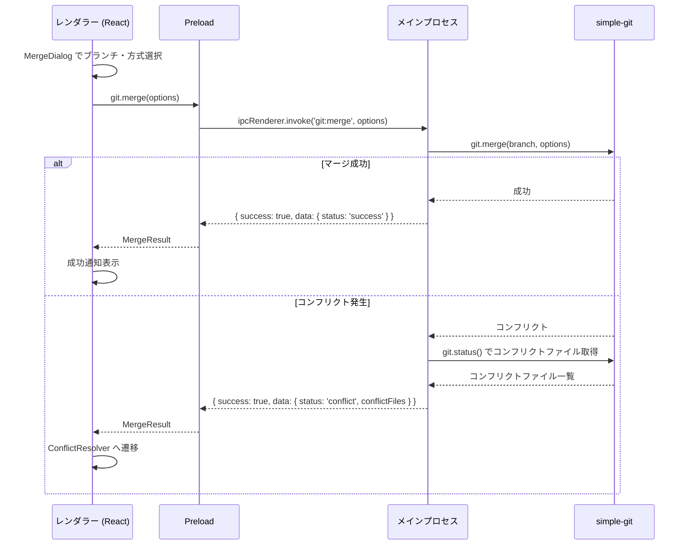
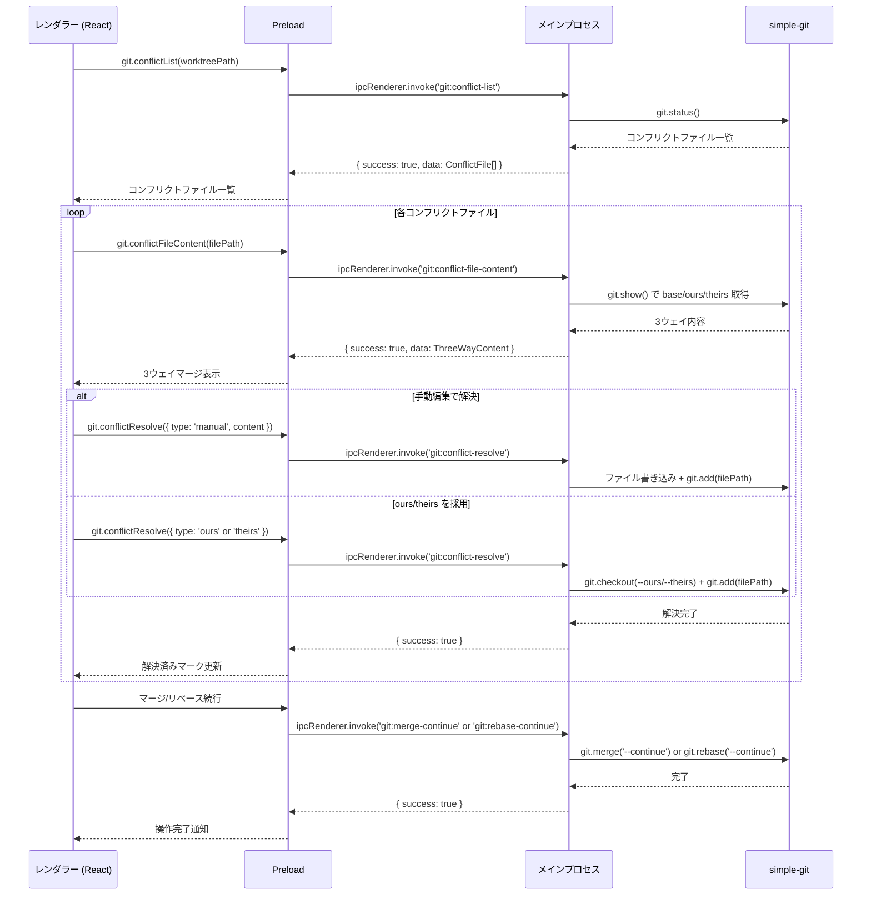
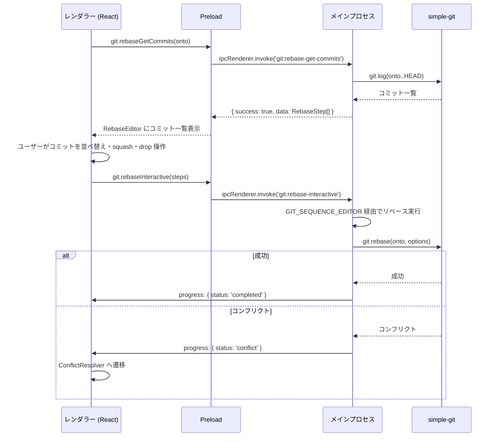

# 高度な Git 操作

**関連 Design Doc:** [advanced-git-operations_design.md](./advanced-git-operations_design.md)
**関連 PRD:** [advanced-git-operations.md](../requirement/advanced-git-operations.md)

---

# 1. 背景

Buruma はワークツリーを主軸とした Git GUI アプリケーションであり、基本的な Git 操作（コミット、プッシュ、プル等）に加えて、マージ、リベース、スタッシュ、チェリーピック、コンフリクト解決、タグ管理といった上級 Git 操作を GUI で安全かつ効率的に提供する必要がある。

これらの操作は Git 中級者〜上級者が日常的に使用するものであり、CLI と同等以上の操作性を視覚的なフィードバックと安全性確認を伴って提供する。特にマージ・リベース時のコンフリクト解決は、3ウェイマージ表示による視覚的な解決 UI が求められる。

本仕様は PRD [advanced-git-operations.md](../requirement/advanced-git-operations.md) の要求（UR_401〜UR_404, FR_401〜FR_406, NFR_401, DC_401）を実現するための論理設計を定義する。

# 2. 概要

高度な Git 操作は以下の6つのサブシステムで構成される：

1. **マージ** — ブランチのマージ実行（fast-forward / no-ff 選択）、中止対応（FR_401）
2. **リベース** — 通常リベースおよびインタラクティブリベース（コミット編集・並べ替え・squash）、中止対応（FR_402）
3. **スタッシュ** — 変更の一時退避・復元・削除・一覧表示（FR_403）
4. **チェリーピック** — 特定コミットの選択適用、複数コミットの一括適用（FR_404）
5. **コンフリクト解決** — 3ウェイマージ表示、ours/theirs 一括採用、手動編集、解決済みマーク（FR_405）
6. **タグ管理** — タグの作成（lightweight / annotated）・削除・一覧表示（FR_406）

すべての操作は原則 B-002（Git 操作の安全性）に準拠し、不可逆な操作には確認ステップを設ける。操作中は常に中止（abort）オプションを提供する（DC_401）。

# 3. 要求定義

## 3.1. 機能要件 (Functional Requirements)

| ID | 要件 | 優先度 | 根拠 (PRD) |
|--------|------|------|------|
| FR-001 | マージ対象ブランチの選択 UI を提供する | 必須 | FR_401_01 |
| FR-002 | マージ方式（fast-forward / no-ff）の選択を提供する | 必須 | FR_401_02 |
| FR-003 | マージ実行と結果（成功/コンフリクト発生）の表示を行う | 必須 | FR_401_03 |
| FR-004 | マージの中止（`git merge --abort`）を提供する | 必須 | FR_401_04 |
| FR-005 | コンフリクト発生時にコンフリクト解決 UI へ遷移する | 必須 | FR_401_05 |
| FR-006 | リベース対象ブランチの選択 UI を提供する | 推奨 | FR_402_01 |
| FR-007 | インタラクティブリベースのコミット一覧表示を提供する | 推奨 | FR_402_02 |
| FR-008 | コミットの並べ替え・squash・edit・drop 操作を提供する | 推奨 | FR_402_03 |
| FR-009 | リベースの実行と進行状況表示を行う | 推奨 | FR_402_04 |
| FR-010 | リベースの中止（`git rebase --abort`）を提供する | 推奨 | FR_402_05 |
| FR-011 | 現在の変更をスタッシュに退避する（メッセージ付き） | 推奨 | FR_403_01 |
| FR-012 | スタッシュ一覧の表示（メッセージ、日時、変更内容プレビュー）を提供する | 推奨 | FR_403_02 |
| FR-013 | スタッシュの復元（pop / apply）を提供する | 推奨 | FR_403_03 |
| FR-014 | スタッシュの個別削除（drop）を提供する | 推奨 | FR_403_04 |
| FR-015 | スタッシュの全削除（clear）を確認ダイアログ付きで提供する | 推奨 | FR_403_05 |
| FR-016 | コミットログからのコミット選択を提供する | 任意 | FR_404_01 |
| FR-017 | 単一コミットのチェリーピックを提供する | 任意 | FR_404_02 |
| FR-018 | 複数コミットの一括チェリーピックを提供する | 任意 | FR_404_03 |
| FR-019 | チェリーピック時のコンフリクト解決 UI への遷移を提供する | 任意 | FR_404_04 |
| FR-020 | コンフリクトファイルの一覧表示を提供する | 必須 | FR_405_01 |
| FR-021 | 3ウェイマージ表示（ours / theirs / merged result）を提供する | 必須 | FR_405_02 |
| FR-022 | ours（自分の変更）の一括採用を提供する | 必須 | FR_405_03 |
| FR-023 | theirs（相手の変更）の一括採用を提供する | 必須 | FR_405_04 |
| FR-024 | 手動編集による解決を提供する | 必須 | FR_405_05 |
| FR-025 | 解決済みファイルのマーク（`git add`）を提供する | 必須 | FR_405_06 |
| FR-026 | 全コンフリクト解決後のマージ/リベース続行を提供する | 必須 | FR_405_07 |
| FR-027 | lightweight タグの作成を提供する | 任意 | FR_406_01 |
| FR-028 | annotated タグの作成（メッセージ付き）を提供する | 任意 | FR_406_02 |
| FR-029 | タグの削除を確認ダイアログ付きで提供する | 任意 | FR_406_03 |
| FR-030 | タグ一覧の表示（名前、対象コミット、日時）を提供する | 任意 | FR_406_04 |

## 3.2. 非機能要件 (Non-Functional Requirements)

| ID | カテゴリ | 要件 | 目標値 | 根拠 (PRD) |
|---------|------|------|------|------|
| NFR-001 | 性能 | マージ・リベース操作の進行状況フィードバック | 500ms以内 | NFR_401 |
| NFR-002 | 性能 | 操作完了の通知 | 30秒以内 | NFR_401 |
| NFR-003 | 安全性 | 不可逆操作には確認ダイアログを表示する | 必須 | DC_401, B-002 |
| NFR-004 | 安全性 | マージ・リベース中は abort オプションを常時表示する | 必須 | DC_401 |

# 4. API

## 4.1. IPC API（メインプロセス ↔ レンダラー）

### マージ操作

| チャネル名 | 方向 | 概要 | 引数 | 戻り値 |
|-----------|------|------|------|--------|
| `git:merge` | renderer → main | ブランチのマージを実行する | `MergeOptions` | `IPCResult<MergeResult>` |
| `git:merge-abort` | renderer → main | マージを中止する | `{ worktreePath: string }` | `IPCResult<void>` |
| `git:merge-status` | renderer → main | 現在のマージ状態を取得する | `{ worktreePath: string }` | `IPCResult<MergeStatus>` |

### リベース操作

| チャネル名 | 方向 | 概要 | 引数 | 戻り値 |
|-----------|------|------|------|--------|
| `git:rebase` | renderer → main | リベースを実行する | `RebaseOptions` | `IPCResult<RebaseResult>` |
| `git:rebase-interactive` | renderer → main | インタラクティブリベースを実行する | `InteractiveRebaseOptions` | `IPCResult<RebaseResult>` |
| `git:rebase-abort` | renderer → main | リベースを中止する | `{ worktreePath: string }` | `IPCResult<void>` |
| `git:rebase-continue` | renderer → main | リベースを続行する | `{ worktreePath: string }` | `IPCResult<RebaseResult>` |
| `git:rebase-get-commits` | renderer → main | リベース対象コミット一覧を取得する | `{ worktreePath: string; onto: string }` | `IPCResult<RebaseStep[]>` |

### スタッシュ操作

| チャネル名 | 方向 | 概要 | 引数 | 戻り値 |
|-----------|------|------|------|--------|
| `git:stash-save` | renderer → main | 変更をスタッシュに退避する | `StashSaveOptions` | `IPCResult<void>` |
| `git:stash-list` | renderer → main | スタッシュ一覧を取得する | `{ worktreePath: string }` | `IPCResult<StashEntry[]>` |
| `git:stash-pop` | renderer → main | スタッシュを復元して削除する | `{ worktreePath: string; index: number }` | `IPCResult<void>` |
| `git:stash-apply` | renderer → main | スタッシュを復元する（削除しない） | `{ worktreePath: string; index: number }` | `IPCResult<void>` |
| `git:stash-drop` | renderer → main | スタッシュを個別削除する | `{ worktreePath: string; index: number }` | `IPCResult<void>` |
| `git:stash-clear` | renderer → main | スタッシュを全削除する | `{ worktreePath: string }` | `IPCResult<void>` |

### チェリーピック操作

| チャネル名 | 方向 | 概要 | 引数 | 戻り値 |
|-----------|------|------|------|--------|
| `git:cherry-pick` | renderer → main | コミットをチェリーピックする | `CherryPickOptions` | `IPCResult<CherryPickResult>` |
| `git:cherry-pick-abort` | renderer → main | チェリーピックを中止する | `{ worktreePath: string }` | `IPCResult<void>` |

### コンフリクト解決操作

| チャネル名 | 方向 | 概要 | 引数 | 戻り値 |
|-----------|------|------|------|--------|
| `git:conflict-list` | renderer → main | コンフリクトファイル一覧を取得する | `{ worktreePath: string }` | `IPCResult<ConflictFile[]>` |
| `git:conflict-file-content` | renderer → main | コンフリクトファイルの3ウェイ内容を取得する | `{ worktreePath: string; filePath: string }` | `IPCResult<ThreeWayContent>` |
| `git:conflict-resolve` | renderer → main | コンフリクトを解決する（ファイル単位） | `ConflictResolveOptions` | `IPCResult<void>` |
| `git:conflict-resolve-all` | renderer → main | 全コンフリクトを一括解決する（ours/theirs） | `ConflictResolveAllOptions` | `IPCResult<void>` |
| `git:conflict-mark-resolved` | renderer → main | 解決済みファイルをマークする（git add） | `{ worktreePath: string; filePath: string }` | `IPCResult<void>` |

### タグ操作

| チャネル名 | 方向 | 概要 | 引数 | 戻り値 |
|-----------|------|------|------|--------|
| `git:tag-list` | renderer → main | タグ一覧を取得する | `{ worktreePath: string }` | `IPCResult<TagInfo[]>` |
| `git:tag-create` | renderer → main | タグを作成する | `TagCreateOptions` | `IPCResult<void>` |
| `git:tag-delete` | renderer → main | タグを削除する | `{ worktreePath: string; tagName: string }` | `IPCResult<void>` |

### 進捗通知（メインプロセス → レンダラー）

| チャネル名 | 方向 | 概要 | 引数 | 戻り値 |
|-----------|------|------|------|--------|
| `git:operation-progress` | main → renderer | 操作の進行状況を通知する | `OperationProgress` | - |

## 4.2. React コンポーネント API

| コンポーネント | Props | 概要 |
|--------------|-------|------|
| `MergeDialog` | `MergeDialogProps` | マージ対象ブランチの選択とマージ方式の設定ダイアログ |
| `RebaseEditor` | `RebaseEditorProps` | インタラクティブリベースのコミット操作エディタ |
| `StashManager` | `StashManagerProps` | スタッシュ一覧の表示と操作（退避・復元・削除）パネル |
| `CherryPickDialog` | `CherryPickDialogProps` | チェリーピック対象コミットの選択ダイアログ |
| `ConflictResolver` | `ConflictResolverProps` | コンフリクト解決 UI（3ウェイマージ表示 + 手動編集） |
| `TagManager` | `TagManagerProps` | タグ一覧表示と作成・削除パネル |
| `OperationProgressBar` | `OperationProgressBarProps` | Git 操作の進捗バー |
| `DestructiveActionConfirmDialog` | `DestructiveActionConfirmDialogProps` | 不可逆操作の確認ダイアログ |

### コンポーネント Props 定義

```typescript
// マージダイアログ
interface MergeDialogProps {
  worktreePath: string;
  currentBranch: string;
  branches: string[];
  open: boolean;
  onOpenChange: (open: boolean) => void;
  onMergeComplete: (result: MergeResult) => void;
}

// リベースエディタ
interface RebaseEditorProps {
  worktreePath: string;
  currentBranch: string;
  steps: RebaseStep[];
  onExecute: (steps: RebaseStep[]) => void;
  onAbort: () => void;
}

// スタッシュマネージャー
interface StashManagerProps {
  worktreePath: string;
  stashes: StashEntry[];
  onSave: (message?: string) => void;
  onPop: (index: number) => void;
  onApply: (index: number) => void;
  onDrop: (index: number) => void;
  onClear: () => void;
}

// チェリーピックダイアログ
interface CherryPickDialogProps {
  worktreePath: string;
  open: boolean;
  onOpenChange: (open: boolean) => void;
  onCherryPickComplete: (result: CherryPickResult) => void;
}

// コンフリクト解決
interface ConflictResolverProps {
  worktreePath: string;
  conflictFiles: ConflictFile[];
  operationType: 'merge' | 'rebase' | 'cherry-pick';
  onResolve: (filePath: string, resolution: ConflictResolution) => void;
  onResolveAll: (strategy: 'ours' | 'theirs') => void;
  onMarkResolved: (filePath: string) => void;
  onContinue: () => void;
  onAbort: () => void;
}

// タグマネージャー
interface TagManagerProps {
  worktreePath: string;
  tags: TagInfo[];
  onCreateTag: (options: TagCreateOptions) => void;
  onDeleteTag: (tagName: string) => void;
}

// 進捗バー
interface OperationProgressBarProps {
  progress: OperationProgress;
  onAbort?: () => void;
}

// 破壊的操作確認ダイアログ
interface DestructiveActionConfirmDialogProps {
  open: boolean;
  title: string;
  description: string;
  confirmLabel: string;
  onConfirm: () => void;
  onCancel: () => void;
}
```

## 4.3. 型定義

```typescript
// === マージ関連 ===

interface MergeOptions {
  worktreePath: string;
  branch: string;
  strategy: 'fast-forward' | 'no-ff';
}

interface MergeResult {
  status: 'success' | 'conflict' | 'already-up-to-date';
  conflictFiles?: string[];
  mergeCommit?: string;
}

interface MergeStatus {
  isMerging: boolean;
  branch?: string;
  conflictFiles?: string[];
}

// === リベース関連 ===

interface RebaseOptions {
  worktreePath: string;
  onto: string;
}

interface InteractiveRebaseOptions {
  worktreePath: string;
  onto: string;
  steps: RebaseStep[];
}

interface RebaseStep {
  hash: string;
  message: string;
  action: RebaseAction;
  order: number;
}

type RebaseAction = 'pick' | 'reword' | 'edit' | 'squash' | 'fixup' | 'drop';

interface RebaseResult {
  status: 'success' | 'conflict' | 'aborted';
  conflictFiles?: string[];
  currentStep?: number;
  totalSteps?: number;
}

// === スタッシュ関連 ===

interface StashSaveOptions {
  worktreePath: string;
  message?: string;
  includeUntracked?: boolean;
}

interface StashEntry {
  index: number;
  message: string;
  date: string; // ISO 8601
  branch: string;
  hash: string;
}

// === チェリーピック関連 ===

interface CherryPickOptions {
  worktreePath: string;
  commits: string[]; // コミットハッシュの配列
}

interface CherryPickResult {
  status: 'success' | 'conflict';
  conflictFiles?: string[];
  appliedCommits: string[];
}

// === コンフリクト解決関連 ===

interface ConflictFile {
  filePath: string;
  status: 'conflicted' | 'resolved';
  conflictType: 'content' | 'rename' | 'delete';
}

interface ThreeWayContent {
  base: string;   // 共通祖先
  ours: string;   // 自分の変更
  theirs: string;  // 相手の変更
  merged: string;  // 現在のマージ結果（コンフリクトマーカー付き）
}

interface ConflictResolveOptions {
  worktreePath: string;
  filePath: string;
  resolution: ConflictResolution;
}

type ConflictResolution =
  | { type: 'ours' }
  | { type: 'theirs' }
  | { type: 'manual'; content: string };

interface ConflictResolveAllOptions {
  worktreePath: string;
  strategy: 'ours' | 'theirs';
}

// === タグ関連 ===

interface TagInfo {
  name: string;
  hash: string;
  message?: string; // annotated タグの場合のみ
  date: string; // ISO 8601
  type: 'lightweight' | 'annotated';
  tagger?: string;
}

interface TagCreateOptions {
  worktreePath: string;
  tagName: string;
  commitHash?: string; // 省略時は HEAD
  type: 'lightweight' | 'annotated';
  message?: string; // annotated タグの場合に必須
}

// === 進捗通知 ===

interface OperationProgress {
  operationType: 'merge' | 'rebase' | 'cherry-pick';
  status: 'in-progress' | 'completed' | 'failed' | 'conflict';
  message: string;
  currentStep?: number;
  totalSteps?: number;
}

// === IPCResult（application-foundation から再エクスポート） ===

type IPCResult<T> =
  | { success: true; data: T }
  | { success: false; error: IPCError };

interface IPCError {
  code: string;
  message: string;
  detail?: string;
}
```

# 5. 用語集

| 用語 | 説明 |
|------|------|
| マージ | 2つのブランチの変更を統合すること |
| Fast-forward マージ | 分岐がない場合にポインタを進めるだけのマージ。マージコミットは作成されない |
| No-FF マージ | 常にマージコミットを作成するマージ方式 |
| リベース | コミットを別のベースの上に再適用すること |
| インタラクティブリベース | コミットの順序変更・統合・編集を対話的に行うリベース |
| squash | 複数のコミットを1つにまとめること |
| スタッシュ | 作業中の変更を一時的に退避する仕組み |
| チェリーピック | 特定のコミットを別のブランチに適用すること |
| コンフリクト | マージ/リベース時に同じ箇所に異なる変更があり、自動統合できない状態 |
| 3ウェイマージ | 共通祖先(base)、自分の変更(ours)、相手の変更(theirs)の3つを比較するマージ方式 |
| タグ | 特定のコミットに名前を付けるマーカー |

# 6. 使用例

```tsx
// レンダラー側：マージの実行
const mergeResult = await window.electronAPI.git.merge({
  worktreePath: '/path/to/worktree',
  branch: 'feature/new-feature',
  strategy: 'no-ff',
});
if (mergeResult.success && mergeResult.data.status === 'conflict') {
  // コンフリクト解決 UI へ遷移
  navigateToConflictResolver(mergeResult.data.conflictFiles);
}

// レンダラー側：スタッシュの一覧取得
const stashList = await window.electronAPI.git.stashList({
  worktreePath: '/path/to/worktree',
});

// レンダラー側：コンフリクトファイルの3ウェイ内容取得
const content = await window.electronAPI.git.conflictFileContent({
  worktreePath: '/path/to/worktree',
  filePath: 'src/main.ts',
});

// レンダラー側：手動編集でコンフリクト解決
await window.electronAPI.git.conflictResolve({
  worktreePath: '/path/to/worktree',
  filePath: 'src/main.ts',
  resolution: { type: 'manual', content: editedContent },
});

// レンダラー側：進捗通知の購読
window.electronAPI.git.onOperationProgress((progress: OperationProgress) => {
  updateProgressBar(progress);
});

// React コンポーネントの使用例
<MergeDialog
  worktreePath={worktreePath}
  currentBranch="main"
  branches={branches}
  open={isMergeDialogOpen}
  onOpenChange={setIsMergeDialogOpen}
  onMergeComplete={handleMergeComplete}
/>

<ConflictResolver
  worktreePath={worktreePath}
  conflictFiles={conflictFiles}
  operationType="merge"
  onResolve={handleResolve}
  onResolveAll={handleResolveAll}
  onMarkResolved={handleMarkResolved}
  onContinue={handleContinue}
  onAbort={handleAbort}
/>
```

# 7. 振る舞い図

## 7.1. マージ実行フロー



## 7.2. コンフリクト解決フロー



## 7.3. インタラクティブリベースフロー



# 8. 制約事項

- レンダラーから Node.js API に直接アクセスしない（原則 A-001）
- Git 操作は必ずメインプロセスで実行する（原則 A-001）
- IPC 通信は型安全なインターフェースを経由する（原則 A-001, T-001）
- 不可逆な操作（stash clear、tag delete）には確認ダイアログを表示する（原則 B-002）
- マージ・リベース中は abort オプションを常に表示する（DC_401）
- インタラクティブリベースは `GIT_SEQUENCE_EDITOR` 環境変数を利用する
- 3ウェイマージ表示には Monaco Editor を使用する（原則 A-002）
- 基本 Git 操作（[basic-git-operations.md](../requirement/basic-git-operations.md)）の実装が前提条件
- force push は本仕様のスコープ外

---

# PRD 整合性確認

| PRD 要求 ID | 本仕様での対応 | ステータス |
|-------------|--------------|----------|
| UR_401 | 仕様全体（6つのサブシステム） | 対応済み |
| UR_402 | FR-001〜FR-010 + git:merge / git:rebase API | 対応済み |
| UR_403 | FR-011〜FR-015 + git:stash-* API | 対応済み |
| UR_404 | FR-020〜FR-026 + git:conflict-* API | 対応済み |
| FR_401 | FR-001〜FR-005 + MergeDialog + git:merge API | 対応済み |
| FR_401_01 | FR-001（マージ対象ブランチ選択） | 対応済み |
| FR_401_02 | FR-002（マージ方式選択） | 対応済み |
| FR_401_03 | FR-003（マージ実行と結果表示） | 対応済み |
| FR_401_04 | FR-004（マージ中止） | 対応済み |
| FR_401_05 | FR-005（コンフリクト解決 UI 遷移） | 対応済み |
| FR_402 | FR-006〜FR-010 + RebaseEditor + git:rebase API | 対応済み |
| FR_402_01 | FR-006（リベース対象ブランチ選択） | 対応済み |
| FR_402_02 | FR-007（コミット一覧表示） | 対応済み |
| FR_402_03 | FR-008（コミット操作） | 対応済み |
| FR_402_04 | FR-009（リベース実行・進行状況表示） | 対応済み |
| FR_402_05 | FR-010（リベース中止） | 対応済み |
| FR_403 | FR-011〜FR-015 + StashManager + git:stash-* API | 対応済み |
| FR_403_01 | FR-011（スタッシュ退避） | 対応済み |
| FR_403_02 | FR-012（スタッシュ一覧） | 対応済み |
| FR_403_03 | FR-013（スタッシュ復元） | 対応済み |
| FR_403_04 | FR-014（スタッシュ個別削除） | 対応済み |
| FR_403_05 | FR-015（スタッシュ全削除） | 対応済み |
| FR_404 | FR-016〜FR-019 + CherryPickDialog + git:cherry-pick API | 対応済み |
| FR_404_01 | FR-016（コミット選択） | 対応済み |
| FR_404_02 | FR-017（単一チェリーピック） | 対応済み |
| FR_404_03 | FR-018（複数チェリーピック） | 対応済み |
| FR_404_04 | FR-019（コンフリクト解決 UI 遷移） | 対応済み |
| FR_405 | FR-020〜FR-026 + ConflictResolver + git:conflict-* API | 対応済み |
| FR_405_01 | FR-020（コンフリクトファイル一覧） | 対応済み |
| FR_405_02 | FR-021（3ウェイマージ表示） | 対応済み |
| FR_405_03 | FR-022（ours 一括採用） | 対応済み |
| FR_405_04 | FR-023（theirs 一括採用） | 対応済み |
| FR_405_05 | FR-024（手動編集） | 対応済み |
| FR_405_06 | FR-025（解決済みマーク） | 対応済み |
| FR_405_07 | FR-026（マージ/リベース続行） | 対応済み |
| FR_406 | FR-027〜FR-030 + TagManager + git:tag-* API | 対応済み |
| FR_406_01 | FR-027（lightweight タグ作成） | 対応済み |
| FR_406_02 | FR-028（annotated タグ作成） | 対応済み |
| FR_406_03 | FR-029（タグ削除） | 対応済み |
| FR_406_04 | FR-030（タグ一覧） | 対応済み |
| NFR_401 | NFR-001, NFR-002 + OperationProgressBar + git:operation-progress | 対応済み |
| DC_401 | NFR-003, NFR-004 + DestructiveActionConfirmDialog | 対応済み |
