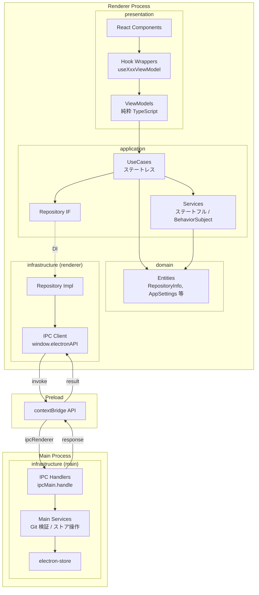

# アプリケーション基盤

**関連 Spec:** [application-foundation_spec.md](./application-foundation_spec.md)
**関連 PRD:** [application-foundation.md](../requirement/application-foundation.md)

---

# 1. 実装ステータス

**ステータス:** 🟢 実装完了

## 1.1. 実装進捗

| モジュール/機能 | ステータス | 備考 |
|--------------|----------|------|
| DI コンテナ登録 | 🟢 | VContainerConfig 定義済み |
| domain 層（エンティティ） | 🟢 | RepositoryInfo, AppSettings 等 |
| application 層（UseCase / Service） | 🟢 | ステートレス UseCase + ステートフル Service |
| infrastructure 層（レンダラー側） | 🟢 | リポジトリ実装（IPC 経由） |
| infrastructure 層（メインプロセス側） | 🟢 | IPC ハンドラー + データアクセス |
| presentation 層（ViewModel） | 🟢 | 純粋 TypeScript クラス |
| presentation 層（Hook ラッパー） | 🟢 | useXxxViewModel |
| presentation 層（React コンポーネント） | 🟢 | RepositorySelectorDialog, RecentRepositoriesList, SettingsDialog, ErrorNotificationToast, AppLayout, MainHeader, ThemeProvider |

---

# 2. 設計目標

1. **型安全な IPC 通信基盤** — すべての IPC チャネルに TypeScript 型定義を提供し、コンパイル時にエラーを検出する
2. **Electron セキュリティ準拠** — preload + contextBridge パターンを徹底し、レンダラーから Node.js API に直接アクセスしない（原則 A-001, T-003）
3. **Clean Architecture による関心の分離** — 4層構成で依存方向を一方向に制約し、テスタビリティと保守性を確保する（原則 A-004）
4. **DI コンテナによる依存関係管理** — VContainer で UseCase / Service / Repository の依存を注入し、疎結合を実現する（原則 A-003）
5. **RxJS による非同期データフロー** — Observable パターンでリアクティブな状態管理を行う（原則 A-006）
6. **MVVM パターン** — ViewModel（純粋 TypeScript）+ Hook ラッパーで React と分離し、ViewModel の単体テストを容易にする
7. **永続化の統一** — 設定・履歴データを electron-store で一元管理し、アプリ再起動後も状態を保持する
8. **エラーの統一ハンドリング** — IPC 通信エラーを `IPCResult<T>` 型で統一し、レンダラー側で一貫したエラー表示を行う

---

# 3. 技術スタック

> 以下はプロジェクト共通の技術スタックです。機能固有の追加技術のみ記載してください。

| 領域 | 採用技術 | 選定理由 |
|------|----------|----------|
| データ永続化 | electron-store | Electron 向け JSON ベースの KV ストア。型安全な API、暗号化オプション、スキーマバリデーション付き |
| トースト通知 | Sonner | Shadcn/ui 推奨のトーストライブラリ。Tailwind CSS との親和性が高い |
| リアクティブ | RxJS 7.8 | A-006 準拠。Observable ベースの非同期データフロー |
| DI | VContainer (`src/lib/di`) | A-003 準拠。プロジェクト内製の軽量 DI コンテナ |

<details>
<summary>プロジェクト共通スタック（参考）</summary>

| 領域 | 採用技術 |
|------|----------|
| フレームワーク | Electron 41 + Electron Forge 7 |
| バンドラー | Vite 5 |
| UI | React 19 + TypeScript |
| スタイリング | Tailwind CSS v4 (`@tailwindcss/postcss`) |
| UIコンポーネント | Shadcn/ui |
| Git操作 | simple-git（予定） |
| エディタ | Monaco Editor（予定） |

</details>

---

# 4. アーキテクチャ

## 4.1. システム構成図



## 4.2. モジュール分割

### レンダラー側（Clean Architecture 4層）

| モジュール名 | 層 | 責務 | 配置場所 |
|---|---|---|---|
| RepositoryInfo, RecentRepository, AppSettings | domain | エンティティ・型定義 | `features/application-foundation/domain/` |
| RepositoryRepository (IF) | application | リポジトリアクセス IF | `features/application-foundation/application/` |
| SettingsRepository (IF) | application | 設定アクセス IF | `features/application-foundation/application/` |
| RepositoryService | application | リポジトリ状態管理（ステートフル） | `features/application-foundation/application/` |
| SettingsService | application | 設定状態管理（ステートフル） | `features/application-foundation/application/` |
| ErrorNotificationService | application | エラー通知状態管理（ステートフル） | `features/application-foundation/application/` |
| OpenRepositoryUseCase | application | リポジトリオープン（ステートレス） | `features/application-foundation/application/` |
| GetRecentRepositoriesUseCase | application | 最近のリポジトリ取得（ステートレス） | `features/application-foundation/application/` |
| GetSettingsUseCase | application | 設定取得（ステートレス） | `features/application-foundation/application/` |
| UpdateSettingsUseCase | application | 設定更新（ステートレス） | `features/application-foundation/application/` |
| GetErrorNotificationsUseCase | application | エラー通知取得（ステートレス） | `features/application-foundation/application/` |
| RepositoryRepositoryImpl | infrastructure | IPC 経由のリポジトリ実装 | `features/application-foundation/infrastructure/` |
| SettingsRepositoryImpl | infrastructure | IPC 経由の設定実装 | `features/application-foundation/infrastructure/` |
| RepositorySelectorViewModel | presentation | リポジトリ選択 ViewModel | `features/application-foundation/presentation/` |
| SettingsViewModel | presentation | 設定 ViewModel | `features/application-foundation/presentation/` |
| ErrorNotificationViewModel | presentation | エラー通知 ViewModel | `features/application-foundation/presentation/` |
| useRepositorySelectorViewModel | presentation | Hook ラッパー | `features/application-foundation/presentation/` |
| useSettingsViewModel | presentation | Hook ラッパー | `features/application-foundation/presentation/` |
| useErrorNotificationViewModel | presentation | Hook ラッパー | `features/application-foundation/presentation/` |

### メインプロセス側（infrastructure 層のみ）

| モジュール名 | 責務 | 配置場所 |
|---|---|---|
| IPC Handlers | IPC チャネルの登録・ルーティング | `features/application-foundation/infrastructure/main/` |
| RepositoryMainService | Git リポジトリ検証・履歴管理 | `features/application-foundation/infrastructure/main/` |
| SettingsMainService | 設定の読み書き（electron-store） | `features/application-foundation/infrastructure/main/` |
| IPC 型定義 | IPC チャネルの型定義（共有） | `src/types/ipc.ts` |
| Preload API | contextBridge による API 公開 | `src/preload.ts` |

---

# 5. データモデル

```typescript
// electron-store スキーマ
interface StoreSchema {
  recentRepositories: RecentRepository[];
  settings: AppSettings;
}

// デフォルト値
const storeDefaults: StoreSchema = {
  recentRepositories: [],
  settings: {
    theme: 'system',
    gitPath: null,
    defaultWorkDir: null,
  },
};
```

---

# 6. インターフェース定義

## 6.1. DI コンテナ登録

```typescript
// src/features/application-foundation/di.ts
import type { VContainerConfig } from '@/lib/di'

export const applicationFoundationConfig: VContainerConfig = {
  register: (container) => {
    // Service（ステートフル）
    container.registerSingleton(RepositoryServiceToken, RepositoryService)
    container.registerSingleton(SettingsServiceToken, SettingsService)
    container.registerSingleton(ErrorNotificationServiceToken, ErrorNotificationService)

    // Repository 実装（infrastructure → application IF を DI）
    container.registerSingleton(RepositoryRepositoryToken, RepositoryRepositoryImpl)
    container.registerSingleton(SettingsRepositoryToken, SettingsRepositoryImpl)

    // UseCase（ステートレス）
    container.registerSingleton(
      OpenRepositoryUseCaseToken,
      OpenRepositoryUseCaseImpl,
      [RepositoryRepositoryToken, RepositoryServiceToken],
    )
    container.registerSingleton(
      GetRecentRepositoriesUseCaseToken,
      GetRecentRepositoriesUseCaseImpl,
      [RepositoryServiceToken],
    )
    container.registerSingleton(
      GetSettingsUseCaseToken,
      GetSettingsUseCaseImpl,
      [SettingsServiceToken],
    )
    container.registerSingleton(
      UpdateSettingsUseCaseToken,
      UpdateSettingsUseCaseImpl,
      [SettingsRepositoryToken, SettingsServiceToken],
    )

    // ViewModel（transient: コンポーネント単位でライフサイクル管理）
    container.registerTransient(
      RepositorySelectorViewModelToken,
      RepositorySelectorViewModelImpl,
      [OpenRepositoryUseCaseToken, GetRecentRepositoriesUseCaseToken],
    )
    container.registerTransient(
      SettingsViewModelToken,
      SettingsViewModelImpl,
      [GetSettingsUseCaseToken, UpdateSettingsUseCaseToken],
    )
  },
  setUp: async (container) => {
    // 初期データのロード（設定・履歴を IPC 経由で取得してサービスに反映）
    const settingsRepo = container.resolve(SettingsRepositoryToken)
    const settingsService = container.resolve(SettingsServiceToken)
    const settings = await settingsRepo.get()
    settingsService.updateSettings(settings)

    const repoRepo = container.resolve(RepositoryRepositoryToken)
    const repoService = container.resolve(RepositoryServiceToken)
    const recent = await repoRepo.getRecent()
    repoService.updateRecentRepositories(recent)

    return () => {
      // tearDown: BehaviorSubject の complete 等
    }
  },
}
```

## 6.2. UseCase / Service 実装パターン

```typescript
// Service（ステートフル）— application 層
class RepositoryService {
  private readonly _currentRepository$ = new BehaviorSubject<RepositoryInfo | null>(null)
  private readonly _recentRepositories$ = new BehaviorSubject<RecentRepository[]>([])

  get currentRepository$(): Observable<RepositoryInfo | null> {
    return this._currentRepository$.asObservable()
  }
  get recentRepositories$(): Observable<RecentRepository[]> {
    return this._recentRepositories$.asObservable()
  }

  setCurrentRepository(repo: RepositoryInfo | null): void {
    this._currentRepository$.next(repo)
  }
  updateRecentRepositories(repos: RecentRepository[]): void {
    this._recentRepositories$.next(repos)
  }
}

// UseCase（ステートレス）— application 層
class OpenRepositoryUseCaseImpl implements RunnableUseCase {
  constructor(
    private readonly repo: RepositoryRepository,
    private readonly service: RepositoryService,
  ) {}

  invoke(): void {
    this.repo.open().then((result) => {
      if (result) {
        this.service.setCurrentRepository(result)
        // 履歴更新
        this.repo.getRecent().then((recent) => {
          this.service.updateRecentRepositories(recent)
        })
      }
    })
  }
}

// UseCase（ステートレス、Observable 公開）— application 層
class GetRecentRepositoriesUseCaseImpl implements ObservableStoreUseCase<RecentRepository[]> {
  constructor(private readonly service: RepositoryService) {}

  get store(): Observable<RecentRepository[]> {
    return this.service.recentRepositories$
  }
}
```

## 6.3. ViewModel + Hook パターン

```typescript
// ViewModel（純粋 TypeScript、React 非依存）— presentation 層
class RepositorySelectorViewModelImpl implements RepositorySelectorViewModel {
  constructor(
    private readonly openRepoUseCase: OpenRepositoryUseCase,
    private readonly getRecentUseCase: GetRecentRepositoriesUseCase,
  ) {}

  get recentRepositories$(): Observable<RecentRepository[]> {
    return this.getRecentUseCase.store
  }

  openWithDialog(): void {
    this.openRepoUseCase.invoke()
  }
}

// Hook ラッパー（Observable → React state）— presentation 層
function useRepositorySelectorViewModel() {
  const vm = useResolve(RepositorySelectorViewModelToken)
  const recentRepositories = useObservable(vm.recentRepositories$, [])

  return {
    recentRepositories,
    openWithDialog: vm.openWithDialog.bind(vm),
  }
}
```

## 6.4. Infrastructure 層（IPC 通信）

```typescript
// Repository 実装（infrastructure 層、レンダラー側）
class RepositoryRepositoryImpl implements RepositoryRepository {
  async open(): Promise<RepositoryInfo | null> {
    const result = await window.electronAPI.repository.open()
    if (!result.success) throw new Error(result.error.message)
    return result.data
  }

  async getRecent(): Promise<RecentRepository[]> {
    const result = await window.electronAPI.repository.getRecent()
    if (!result.success) throw new Error(result.error.message)
    return result.data
  }

  // ... 他のメソッド
}
```

```typescript
// IPC ハンドラー（infrastructure 層、メインプロセス側）
export function registerIPCHandlers(
  repoService: RepositoryMainService,
  settingsService: SettingsMainService,
): void {
  ipcMain.handle('repository:open', async (): Promise<IPCResult<RepositoryInfo>> => {
    return repoService.openWithDialog()
  })

  ipcMain.handle('settings:get', async (): Promise<IPCResult<AppSettings>> => {
    return settingsService.getAll()
  })

  // ... 他のハンドラー
}
```

---

# 7. 非機能要件実現方針

| 要件 | 実現方針 |
|------|----------|
| 起動3秒以内 (NFR_001) | VContainerProvider の setUp で非同期初期化。UI は setUp 完了前に fallback 表示 |
| IPC 50ms以内 (NFR_002) | 軽量な JSON シリアライズ、バッチ処理は行わず単一リクエスト/レスポンス |
| Electron セキュリティ (DC_001) | nodeIntegration: false, contextIsolation: true, FusesPlugin 設定 |
| データ永続化 (DC_002) | electron-store でローカルファイルに JSON 保存 |

---

# 8. テスト戦略

| テストレベル | 対象 | 層 | カバレッジ目標 |
|------------|------|---|------------|
| ユニットテスト | UseCase, Service | application | ≥ 80% |
| ユニットテスト | ViewModel（Observable テスト） | presentation | ≥ 80% |
| ユニットテスト | Repository Impl（モック IPC） | infrastructure | ≥ 80% |
| 結合テスト | ViewModel + UseCase + モック Repository | application + presentation | 主要フロー |
| E2Eテスト | 画面操作フロー | 全層 | 主要ユースケース |

**テスト方針**:

- domain / application 層のテストは React / Electron 環境不要（純粋 TypeScript テスト）
- ViewModel のテストは Observable の emit 値を検証（React 不要）
- Hook ラッパーのテストは `@testing-library/react` の `renderHook` を使用
- infrastructure 層のテストは preload API をモック化

---

# 9. 設計判断

## 9.1. 決定事項

| 決定事項 | 選択肢 | 決定内容 | 理由 |
|----------|--------|----------|------|
| データ永続化ライブラリ | electron-store / lowdb / SQLite | electron-store | Electron 向けに最適化。型安全な API、暗号化オプション付き。KV ストアで十分な要件 |
| IPC レスポンス型 | 生の値返却 / Result 型 | `IPCResult<T>` 型（Result パターン） | エラーハンドリングの統一。レンダラー側で一貫したエラー処理が可能（原則 T-002） |
| トースト通知ライブラリ | react-hot-toast / react-toastify / Sonner | Sonner | Shadcn/ui 推奨。Tailwind CSS との親和性が高い（原則 A-002） |
| テーマ管理 | CSS 変数 / Tailwind dark mode / next-themes | Tailwind CSS dark mode + CSS 変数 | Shadcn/ui のテーマ機構と統合。system テーマは `prefers-color-scheme` メディアクエリ |
| IPC チャネル命名 | フラット / 名前空間 | 名前空間方式 (`domain:action`) | チャネル数増加時の管理性。ドメインごとのグルーピング |
| メインプロセスの層構成 | 4層 / infrastructure のみ | infrastructure のみ | メインプロセス側はビジネスロジックを持たず、IPC ハンドラー + データアクセスのみ。4層にする必要がない |
| ViewModel の DI ライフタイム | singleton / transient | transient | コンポーネント単位でライフサイクルを管理。画面遷移時に自動的に新しいインスタンスが作成される |

## 9.2. 未解決の課題

| 課題 | 影響度 | 対応方針 |
|------|--------|----------|
| electron-store の Vite 5 との ESM 互換性 | 中 | 実装時に検証。問題がある場合は conf ライブラリを代替案とする |
| 大量の IPC チャネル定義の管理方法 | 低 | 初期は手動定義。チャネル数が増えた段階でコード生成を検討 |
| RxJS Subscription のメモリリーク防止 | 中 | VContainerProvider の tearDown + DisposableStack で一括管理 |
| RepositorySelectorViewModel の Service 直接参照 | 低 | currentRepository$ を公開する専用 UseCase が未定義のため、ViewModel が IRepositoryService を直接参照。di-tokens.ts の IF 定義経由で疎結合は維持。必要に応じて GetCurrentRepositoryUseCase を追加 |
| IPC ハンドラーの入力バリデーション | 低 | 現状は preload 経由の型付き API のみ（内部通信）のため未実装。将来的にバリデーションミドルウェアの追加を検討 |

---

# 10. 変更履歴

## v2.0

**変更内容:**

- Clean Architecture 4層構成に全面改定（A-004）
- DI コンテナ（VContainer）による依存関係管理を追加（A-003）
- UseCase（ステートレス）/ Service（ステートフル）パターンを導入
- ViewModel + Hook ラッパーによる MVVM パターンを導入
- RxJS Observable による非同期データフローを追加（A-006）
- モジュール分割を `src/features/application-foundation/` 配下の4層構成に変更
- テスト戦略を層ごとに再定義
- メインプロセス側は infrastructure 層のみとする設計判断を追加

## v1.0

**変更内容:**

- 初版作成
- IPC 通信基盤、リポジトリ管理、設定管理、エラーハンドリングの設計を定義
