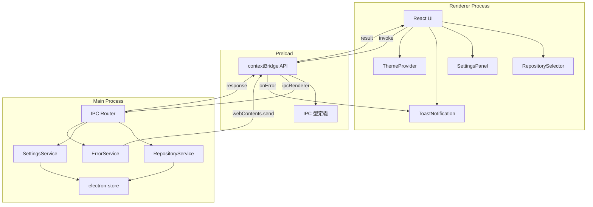

# アプリケーション基盤

**関連 Spec:** [application-foundation_spec.md](./application-foundation_spec.md)
**関連 PRD:** [application-foundation.md](../requirement/application-foundation.md)

---

# 1. 実装ステータス

**ステータス:** 🔴 未実装

## 1.1. 実装進捗

| モジュール/機能 | ステータス | 備考 |
|--------------|----------|------|
| IPC 通信基盤 | 🔴 | 型定義・ハンドラーパターン |
| リポジトリ管理 | 🔴 | フォルダ選択・検証・履歴管理 |
| アプリケーション設定 | 🔴 | テーマ・Git パス・永続化 |
| エラーハンドリング | 🔴 | トースト通知・リトライ |

---

# 2. 設計目標

1. **型安全な IPC 通信基盤** — すべての IPC チャネルに TypeScript 型定義を提供し、コンパイル時にエラーを検出する
2. **Electron セキュリティ準拠** — preload + contextBridge パターンを徹底し、レンダラーから Node.js API に直接アクセスしない（原則 A-001, T-003）
3. **永続化の統一** — 設定・履歴データを electron-store で一元管理し、アプリ再起動後も状態を保持する
4. **エラーの統一ハンドリング** — IPC 通信エラーを `IPCResult<T>` 型で統一し、レンダラー側で一貫したエラー表示を行う

---

# 3. 技術スタック

> 以下はプロジェクト共通の技術スタックです。機能固有の追加技術のみ記載してください。

| 領域 | 採用技術 | 選定理由 |
|------|----------|----------|
| データ永続化 | electron-store | Electron 向け JSON ベースの KV ストア。型安全な API、暗号化オプション、スキーマバリデーション付き |
| トースト通知 | Sonner | Shadcn/ui 推奨のトーストライブラリ。Tailwind CSS との親和性が高い |

<details>
<summary>プロジェクト共通スタック（参考）</summary>

| 領域 | 採用技術 |
|------|----------|
| フレームワーク | Electron 41 + Electron Forge 7 |
| バンドラー | Vite 5 |
| UI | React 19 + TypeScript |
| スタイリング | Tailwind CSS v4 (`@tailwindcss/postcss`) |
| UIコンポーネント | Shadcn/ui |
| Git操作 | simple-git（予定） |
| エディタ | Monaco Editor（予定） |

</details>

---

# 4. アーキテクチャ

## 4.1. システム構成図



## 4.2. モジュール分割

| モジュール名 | プロセス | 責務 | 配置場所 |
|------------|---------|------|---------|
| IPCRouter | main | IPC チャネルの登録・ルーティング | `src/main/ipc/router.ts` |
| IPC 型定義 | shared | IPC チャネルの型定義（引数・戻り値） | `src/types/ipc.ts` |
| RepositoryService | main | リポジトリの検証・オープン・履歴管理 | `src/main/services/repository.ts` |
| SettingsService | main | アプリケーション設定の読み書き | `src/main/services/settings.ts` |
| ErrorService | main | エラーの分類・通知送信 | `src/main/services/error.ts` |
| preload API | preload | contextBridge による API 公開 | `src/preload.ts` |
| RepositorySelector | renderer | リポジトリ選択 UI | `src/components/RepositorySelector.tsx` |
| RecentRepositoryList | renderer | 最近のリポジトリ一覧 UI | `src/components/RecentRepositoryList.tsx` |
| SettingsPanel | renderer | 設定画面 UI | `src/components/SettingsPanel.tsx` |
| ToastNotification | renderer | トースト通知 UI | `src/components/ToastNotification.tsx` |
| ThemeProvider | renderer | テーマ管理プロバイダー | `src/components/ThemeProvider.tsx` |

---

# 5. データモデル

```typescript
// electron-store スキーマ
interface StoreSchema {
  recentRepositories: RecentRepository[];
  settings: AppSettings;
}

// デフォルト値
const storeDefaults: StoreSchema = {
  recentRepositories: [],
  settings: {
    theme: 'system',
    gitPath: null,
    defaultWorkDir: null,
  },
};
```

---

# 6. インターフェース定義

## 6.1. IPC ハンドラー（メインプロセス側）

```typescript
// src/main/ipc/router.ts
import { ipcMain } from 'electron';
import type { IPCResult } from '../../types/ipc';

export function registerIPCHandlers(
  repoService: RepositoryService,
  settingsService: SettingsService,
  errorService: ErrorService,
): void {
  ipcMain.handle('repository:open', async (): Promise<IPCResult<RepositoryInfo>> => {
    return repoService.openWithDialog();
  });

  ipcMain.handle('repository:open-path', async (_event, path: string): Promise<IPCResult<RepositoryInfo>> => {
    return repoService.openByPath(path);
  });

  ipcMain.handle('repository:validate', async (_event, path: string): Promise<IPCResult<boolean>> => {
    return repoService.validate(path);
  });

  ipcMain.handle('repository:get-recent', async (): Promise<IPCResult<RecentRepository[]>> => {
    return repoService.getRecent();
  });

  ipcMain.handle('settings:get', async (): Promise<IPCResult<AppSettings>> => {
    return settingsService.getAll();
  });

  ipcMain.handle('settings:set', async (_event, settings: Partial<AppSettings>): Promise<IPCResult<void>> => {
    return settingsService.update(settings);
  });
}
```

## 6.2. Preload API（contextBridge 経由）

```typescript
// src/preload.ts
import { contextBridge, ipcRenderer } from 'electron';
import type {
  RepositoryInfo,
  RecentRepository,
  AppSettings,
  Theme,
  ErrorNotification,
  IPCResult,
} from './types/ipc';

contextBridge.exposeInMainWorld('electronAPI', {
  repository: {
    open: (): Promise<IPCResult<RepositoryInfo>> =>
      ipcRenderer.invoke('repository:open'),
    openPath: (path: string): Promise<IPCResult<RepositoryInfo>> =>
      ipcRenderer.invoke('repository:open-path', path),
    validate: (path: string): Promise<IPCResult<boolean>> =>
      ipcRenderer.invoke('repository:validate', path),
    getRecent: (): Promise<IPCResult<RecentRepository[]>> =>
      ipcRenderer.invoke('repository:get-recent'),
    removeRecent: (path: string): Promise<IPCResult<void>> =>
      ipcRenderer.invoke('repository:remove-recent', path),
    pin: (path: string, pinned: boolean): Promise<IPCResult<void>> =>
      ipcRenderer.invoke('repository:pin', { path, pinned }),
  },
  settings: {
    get: (): Promise<IPCResult<AppSettings>> =>
      ipcRenderer.invoke('settings:get'),
    set: (settings: Partial<AppSettings>): Promise<IPCResult<void>> =>
      ipcRenderer.invoke('settings:set', settings),
    getTheme: (): Promise<IPCResult<Theme>> =>
      ipcRenderer.invoke('settings:get-theme'),
    setTheme: (theme: Theme): Promise<IPCResult<void>> =>
      ipcRenderer.invoke('settings:set-theme', theme),
  },
  onError: (callback: (notification: ErrorNotification) => void): void => {
    ipcRenderer.on('error:notify', (_event, notification) => {
      callback(notification);
    });
  },
});
```

## 6.3. レンダラー側の型定義

```typescript
// src/types/electron.d.ts
import type {
  RepositoryInfo,
  RecentRepository,
  AppSettings,
  Theme,
  ErrorNotification,
  IPCResult,
} from './ipc';

interface ElectronAPI {
  repository: {
    open(): Promise<IPCResult<RepositoryInfo>>;
    openPath(path: string): Promise<IPCResult<RepositoryInfo>>;
    validate(path: string): Promise<IPCResult<boolean>>;
    getRecent(): Promise<IPCResult<RecentRepository[]>>;
    removeRecent(path: string): Promise<IPCResult<void>>;
    pin(path: string, pinned: boolean): Promise<IPCResult<void>>;
  };
  settings: {
    get(): Promise<IPCResult<AppSettings>>;
    set(settings: Partial<AppSettings>): Promise<IPCResult<void>>;
    getTheme(): Promise<IPCResult<Theme>>;
    setTheme(theme: Theme): Promise<IPCResult<void>>;
  };
  onError(callback: (notification: ErrorNotification) => void): void;
}

declare global {
  interface Window {
    electronAPI: ElectronAPI;
  }
}
```

---

# 7. 非機能要件実現方針

| 要件 | 実現方針 |
|------|----------|
| 起動3秒以内 (NFR_001) | 遅延ロード: 設定読み込みは非同期、UI は設定到着前にスケルトン表示 |
| IPC 50ms以内 (NFR_002) | 軽量な JSON シリアライズ、バッチ処理は行わず単一リクエスト/レスポンス |
| Electron セキュリティ (DC_001) | nodeIntegration: false, contextIsolation: true, FusesPlugin 設定 |
| データ永続化 (DC_002) | electron-store でローカルファイルに JSON 保存 |

---

# 8. テスト戦略

| テストレベル | 対象 | カバレッジ目標 |
|------------|------|------------|
| ユニットテスト | RepositoryService, SettingsService, ErrorService | ≥ 80% |
| ユニットテスト | IPC 型定義の整合性 | 型チェックで保証 |
| 結合テスト | IPC ハンドラー（main ↔ preload 連携） | 主要フロー |
| E2Eテスト | リポジトリオープン、設定変更、エラー表示 | 主要ユースケース |

---

# 9. 設計判断

## 9.1. 決定事項

| 決定事項 | 選択肢 | 決定内容 | 理由 |
|----------|--------|----------|------|
| データ永続化ライブラリ | electron-store / lowdb / SQLite | electron-store | Electron 向けに最適化。型安全な API、暗号化オプション付き。KV ストアで十分な要件 |
| IPC レスポンス型 | 生の値返却 / Result 型 | `IPCResult<T>` 型（Result パターン） | エラーハンドリングの統一。レンダラー側で一貫したエラー処理が可能（原則 T-002: No Runtime Errors） |
| トースト通知ライブラリ | react-hot-toast / react-toastify / Sonner | Sonner | Shadcn/ui 推奨。Tailwind CSS との親和性が高い（原則 A-002: Library-First） |
| テーマ管理 | CSS 変数 / Tailwind dark mode / next-themes | Tailwind CSS dark mode + CSS 変数 | Shadcn/ui のテーマ機構と統合。system テーマは `prefers-color-scheme` メディアクエリ |
| IPC チャネル命名 | フラット (`open-repository`) / 名前空間 (`repository:open`) | 名前空間方式 (`domain:action`) | チャネル数増加時の管理性。ドメインごとのグルーピング |

## 9.2. 未解決の課題

| 課題 | 影響度 | 対応方針 |
|------|--------|----------|
| electron-store の Vite 5 との ESM 互換性 | 中 | 実装時に検証。問題がある場合は conf ライブラリを代替案とする |
| 大量の IPC チャネル定義の管理方法 | 低 | 初期は手動定義。チャネル数が増えた段階でコード生成を検討 |

---

# 10. 変更履歴

## v1.0

**変更内容:**

- 初版作成
- IPC 通信基盤、リポジトリ管理、設定管理、エラーハンドリングの設計を定義
