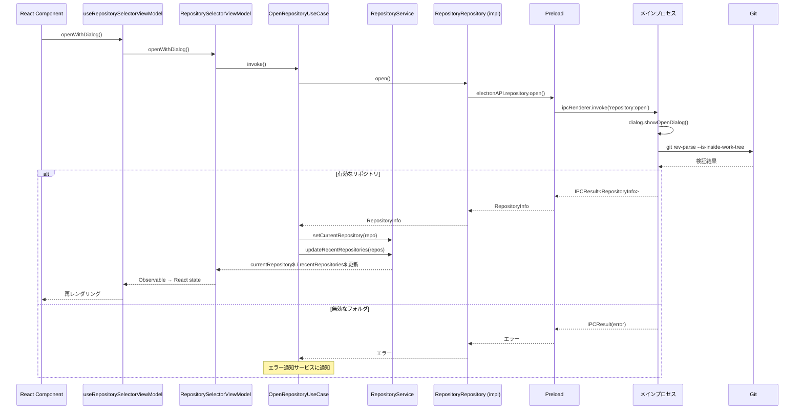
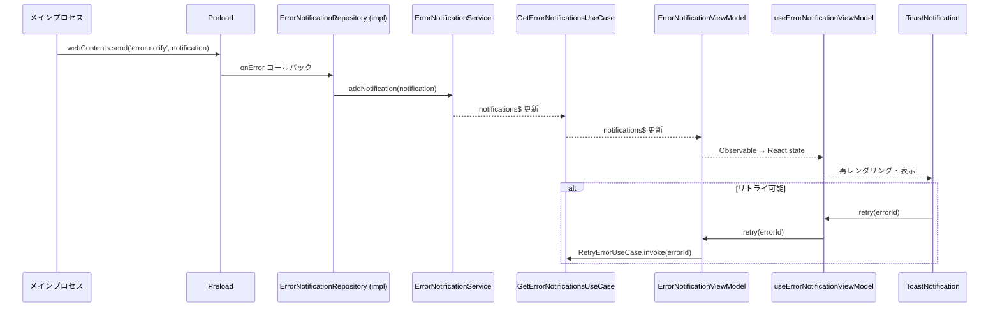
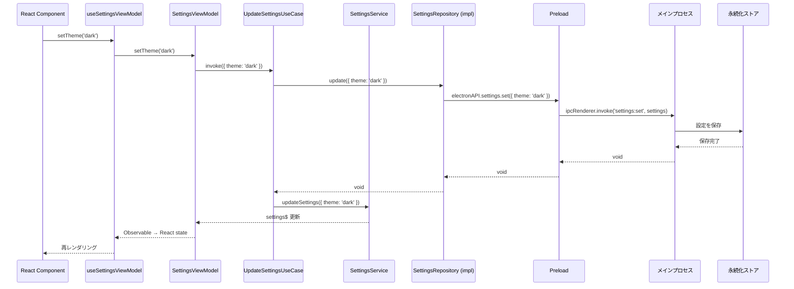

# アプリケーション基盤

**関連 Design Doc:** [application-foundation_design.md](./application-foundation_design.md)
**関連 PRD:** [application-foundation.md](../requirement/application-foundation.md)

---

# 1. 背景

Buruma は複数のワークツリーを並行管理する Git GUI アプリケーションである。すべての機能（ワークツリー管理、リポジトリ閲覧、Git 操作、Claude Code 連携）が共通して依存する基盤レイヤーとして、リポジトリ管理、アプリケーション設定、IPC 通信基盤、エラーハンドリングが必要である。

本仕様は PRD [application-foundation.md](../requirement/application-foundation.md) の要求（UR_001〜UR_005, FR_601〜FR_605, NFR_001〜NFR_002, DC_001〜DC_002）を実現するための論理設計を定義する。

# 2. 概要

アプリケーション基盤は以下の4つのサブシステムで構成される：

1. **リポジトリ管理** — ローカル Git リポジトリの選択・オープン・履歴管理（FR_601, FR_602）
2. **アプリケーション設定** — テーマ、Git パス等のユーザー設定管理（FR_603）
3. **IPC 通信基盤** — preload + contextBridge による型安全な通信レイヤー（FR_604）
4. **エラーハンドリング** — 統一的なエラー通知・リカバリ機能（FR_605）

すべてのサブシステムは Electron のマルチプロセスアーキテクチャ（main / preload / renderer）に準拠し、DC_001（Electron セキュリティ制約）を遵守する。

## アーキテクチャ概要

本 feature は Clean Architecture 4層構成（A-004）に従い、レンダラー側は `src/processes/renderer/features/application-foundation/`、メインプロセス側は `src/processes/main/features/application-foundation/` に実装する。domain 型は `src/domain/` に配置しプロセス間で共有する。

```
domain ← application ← infrastructure
                     ← presentation
```

**レンダラー側**:

| 層 | 責務 |
|:---|:---|
| **domain** | エンティティ（`shared/domain/` からプロセス間共有） |
| **application** | UseCase（ステートレス）、Service（ステートフル）、リポジトリ IF |
| **infrastructure** | リポジトリ実装（IPC クライアント経由でメインプロセスと通信） |
| **presentation** | ViewModel（純粋 TypeScript クラス）、Hook ラッパー、React コンポーネント |

**メインプロセス側**:

| 層 | 責務 |
|:---|:---|
| **domain** | エンティティ（`shared/domain/` からプロセス間共有） |
| **application** | UseCase（Git 検証、履歴管理等のビジネスルール） |
| **infrastructure** | electron-store、execFile、dialog 等のネイティブ API |
| **presentation** | IPC Handler（リクエスト受付・ルーティング、Controller に相当） |

ビジネスロジック（domain / application 層）は純粋な TypeScript で実装し（A-005）、非同期データフローには RxJS を使用する（A-006）。サービス間の依存関係は VContainer で注入する（A-003）。両プロセスとも VContainer を使用する。

# 3. 要求定義

## 3.1. 機能要件 (Functional Requirements)

| ID | 要件 | 優先度 | 根拠 (PRD) |
|--------|------|------|------|
| FR-001 | ネイティブフォルダ選択ダイアログでローカルリポジトリを開く | 必須 | FR_601 |
| FR-002 | 選択フォルダが有効な Git リポジトリかを検証する | 必須 | FR_601 |
| FR-003 | リポジトリオープン後にワークツリー一覧画面へ遷移する | 必須 | FR_601 |
| FR-004 | 最近開いたリポジトリの履歴を永続的に保持する（最大20件） | 推奨 | FR_602 |
| FR-005 | 履歴からのクイックオープンを提供する | 推奨 | FR_602 |
| FR-006 | リポジトリのピン留め機能を提供する | 推奨 | FR_602 |
| FR-007 | テーマ切り替え（ライト/ダーク/システム連動）を提供する | 推奨 | FR_603 |
| FR-008 | Git 実行パスのカスタム設定を提供する | 推奨 | FR_603 |
| FR-009 | デフォルト作業ディレクトリ設定を提供する | 推奨 | FR_603 |
| FR-010 | 設定の永続化とアプリ起動時のリストアを行う | 推奨 | FR_603 |
| FR-011 | contextBridge 経由の型安全な API 公開パターンを提供する | 必須 | FR_604 |
| FR-012 | リクエスト/レスポンス型の IPC 通信パターンを提供する | 必須 | FR_604 |
| FR-013 | メインプロセスからレンダラーへのイベント通知パターンを提供する | 必須 | FR_604 |
| FR-014 | エラー通知をトースト形式で表示する | 必須 | FR_605 |
| FR-015 | エラーの重大度分類（info/warning/error）を提供する | 必須 | FR_605 |
| FR-016 | リトライ可能な操作のリトライ機能を提供する | 推奨 | FR_605 |
| FR-017 | エラー詳細の展開表示を提供する | 推奨 | FR_605 |
| FR-018 | IPC 通信エラーのレンダラー側での統一ハンドリングを提供する | 必須 | FR_605 |

## 3.2. 非機能要件 (Non-Functional Requirements)

| ID | カテゴリ | 要件 | 目標値 | 根拠 (PRD) |
|---------|------|------|------|------|
| NFR-001 | 性能 | アプリケーション起動からUI表示完了まで | 3秒以内 | NFR_001 |
| NFR-002 | 性能 | IPC 通信のラウンドトリップレイテンシ | 50ms以内 | NFR_002 |
| NFR-003 | セキュリティ | Electron セキュリティベストプラクティス準拠 | nodeIntegration: false, contextIsolation: true | DC_001 |
| NFR-004 | データ永続化 | 設定・履歴のローカル永続化 | アプリ再起動後もデータ保持 | DC_002 |

# 4. API

## 4.1. IPC API（メインプロセス ↔ レンダラー）

> IPC 通信は infrastructure 層に閉じ、application 層のリポジトリインターフェース経由でのみアクセスされる。

### リポジトリ管理

| チャネル名 | 方向 | 概要 | 引数 | 戻り値 |
|-----------|------|------|------|--------|
| `repository:open` | renderer → main | フォルダ選択ダイアログを表示し、選択されたリポジトリを開く | なし | `RepositoryInfo \| null` |
| `repository:open-path` | renderer → main | 指定パスのリポジトリを開く | `string` (パス) | `RepositoryInfo \| null` |
| `repository:validate` | renderer → main | 指定パスが有効な Git リポジトリか検証する | `string` (パス) | `boolean` |
| `repository:get-recent` | renderer → main | 最近開いたリポジトリ一覧を取得する | なし | `RecentRepository[]` |
| `repository:remove-recent` | renderer → main | 履歴から特定のリポジトリを削除する | `string` (パス) | `void` |
| `repository:pin` | renderer → main | リポジトリをピン留め/解除する | `{ path: string; pinned: boolean }` | `void` |

### アプリケーション設定

| チャネル名 | 方向 | 概要 | 引数 | 戻り値 |
|-----------|------|------|------|--------|
| `settings:get` | renderer → main | 全設定を取得する | なし | `AppSettings` |
| `settings:set` | renderer → main | 設定を更新する | `Partial<AppSettings>` | `void` |
| `settings:get-theme` | renderer → main | 現在のテーマを取得する | なし | `Theme` |
| `settings:set-theme` | renderer → main | テーマを変更する | `Theme` | `void` |

### エラー通知（メインプロセス → レンダラー）

| チャネル名 | 方向 | 概要 | 引数 | 戻り値 |
|-----------|------|------|------|--------|
| `error:notify` | main → renderer | エラー通知をレンダラーに送信する | `ErrorNotification` | - |

## 4.2. UseCase / Repository インターフェース（application 層）

### リポジトリ管理

```typescript
// リポジトリリポジトリ IF（application 層に定義、infrastructure 層で実装）
interface RepositoryRepository {
  open(): Promise<RepositoryInfo | null>;
  openByPath(path: string): Promise<RepositoryInfo | null>;
  validate(path: string): Promise<boolean>;
  getRecent(): Promise<RecentRepository[]>;
  removeRecent(path: string): Promise<void>;
  pin(path: string, pinned: boolean): Promise<void>;
}

// UseCase（ステートレス）
interface OpenRepositoryUseCase extends RunnableUseCase {
  invoke(): void; // ダイアログを開いてリポジトリを選択
}

interface OpenRepositoryByPathUseCase extends ConsumerUseCase<string> {
  invoke(path: string): void;
}

interface GetRecentRepositoriesUseCase extends ObservableStoreUseCase<RecentRepository[]> {
  readonly store: Observable<RecentRepository[]>;
}

interface RemoveRecentRepositoryUseCase extends ConsumerUseCase<string> {
  invoke(path: string): void;
}

interface PinRepositoryUseCase extends ConsumerUseCase<{ path: string; pinned: boolean }> {
  invoke(arg: { path: string; pinned: boolean }): void;
}

// Service（ステートフル、UseCase から利用される）
interface RepositoryService {
  readonly currentRepository$: Observable<RepositoryInfo | null>;
  readonly recentRepositories$: Observable<RecentRepository[]>;
  setCurrentRepository(repo: RepositoryInfo | null): void;
  updateRecentRepositories(repos: RecentRepository[]): void;
}
```

### アプリケーション設定

```typescript
// 設定リポジトリ IF
interface SettingsRepository {
  get(): Promise<AppSettings>;
  update(settings: Partial<AppSettings>): Promise<void>;
  getTheme(): Promise<Theme>;
  setTheme(theme: Theme): Promise<void>;
}

// UseCase
interface GetSettingsUseCase extends ReactivePropertyUseCase<AppSettings> {
  readonly property: ReadOnlyReactiveProperty<AppSettings>;
}

interface UpdateSettingsUseCase extends ConsumerUseCase<Partial<AppSettings>> {
  invoke(settings: Partial<AppSettings>): void;
}
```

### エラーハンドリング

```typescript
// エラー通知 UseCase
interface GetErrorNotificationsUseCase extends ObservableStoreUseCase<ErrorNotification[]> {
  readonly store: Observable<ErrorNotification[]>;
}

interface DismissErrorUseCase extends ConsumerUseCase<string> {
  invoke(errorId: string): void;
}

interface RetryErrorUseCase extends ConsumerUseCase<string> {
  invoke(errorId: string): void;
}
```

## 4.3. ViewModel インターフェース（presentation 層）

```typescript
// リポジトリ選択 ViewModel（純粋 TypeScript クラス、React 非依存）
interface RepositorySelectorViewModel {
  readonly recentRepositories$: Observable<RecentRepository[]>;
  readonly currentRepository$: Observable<RepositoryInfo | null>;
  openWithDialog(): void;
  openByPath(path: string): void;
  removeRecent(path: string): void;
  pin(path: string, pinned: boolean): void;
}

// 設定 ViewModel
interface SettingsViewModel {
  readonly settings$: Observable<AppSettings>;
  updateSettings(settings: Partial<AppSettings>): void;
  setTheme(theme: Theme): void;
}

// エラー通知 ViewModel
interface ErrorNotificationViewModel {
  readonly notifications$: Observable<ErrorNotification[]>;
  dismiss(errorId: string): void;
  retry(errorId: string): void;
}
```

## 4.4. 型定義

```typescript
// リポジトリ情報
interface RepositoryInfo {
  path: string;
  name: string;
  isValid: boolean;
}

// 最近のリポジトリ
interface RecentRepository {
  path: string;
  name: string;
  lastAccessed: string; // ISO 8601
  pinned: boolean;
}

// アプリケーション設定
interface AppSettings {
  theme: Theme;
  gitPath: string | null; // null = システムデフォルト
  defaultWorkDir: string | null;
}

type Theme = 'light' | 'dark' | 'system';

// エラー通知
interface ErrorNotification {
  id: string;
  severity: ErrorSeverity;
  title: string;
  message: string;
  detail?: string;
  retryable: boolean;
  retryAction?: string; // IPC チャネル名
  timestamp: string; // ISO 8601
}

type ErrorSeverity = 'info' | 'warning' | 'error';

// IPC 通信の統一レスポンス型
type IPCResult<T> =
  | { success: true; data: T }
  | { success: false; error: IPCError };

interface IPCError {
  code: string;
  message: string;
  detail?: string;
}
```

# 5. 用語集

| 用語 | 説明 |
|------|------|
| IPC | Inter-Process Communication。メインプロセスとレンダラー間の通信 |
| contextBridge | Electron が提供する API。preload スクリプトからレンダラーに安全に API を公開する仕組み |
| UseCase | application 層のステートレスな操作単位。`src/lib/usecase/` の型を継承する |
| Service | application 層のステートフルな状態管理。UseCase から利用される |
| ViewModel | presentation 層の純粋 TypeScript クラス。UseCase の Observable を UI 状態に変換する |
| Hook ラッパー | ViewModel を React state に変換する Custom Hook（`useXxxViewModel()`） |
| トースト | 画面の端に一時的に表示される通知メッセージ |
| ピン留め | リポジトリを履歴一覧の上位に固定表示する機能 |

# 6. 使用例

```typescript
// presentation 層: Hook ラッパーを使用したリポジトリ選択
function RepositoryPage() {
  const {
    recentRepositories,
    currentRepository,
    openWithDialog,
    openByPath,
    removeRecent,
    pin,
  } = useRepositorySelectorViewModel()

  return (
    <div>
      <button onClick={openWithDialog}>リポジトリを開く</button>
      <ul>
        {recentRepositories.map((repo) => (
          <li key={repo.path}>
            <button onClick={() => openByPath(repo.path)}>{repo.name}</button>
            <button onClick={() => pin(repo.path, !repo.pinned)}>
              {repo.pinned ? 'ピン解除' : 'ピン留め'}
            </button>
            <button onClick={() => removeRecent(repo.path)}>削除</button>
          </li>
        ))}
      </ul>
    </div>
  )
}

// presentation 層: Hook ラッパーを使用した設定変更
function SettingsPage() {
  const { settings, updateSettings, setTheme } = useSettingsViewModel()

  return (
    <div>
      <select
        value={settings.theme}
        onChange={(e) => setTheme(e.target.value as Theme)}
      >
        <option value="light">ライト</option>
        <option value="dark">ダーク</option>
        <option value="system">システム連動</option>
      </select>
    </div>
  )
}
```

# 7. 振る舞い図

## 7.1. リポジトリオープンフロー（4層アーキテクチャ）



## 7.2. エラー通知フロー



## 7.3. 設定変更フロー



# 8. 制約事項

- レンダラーから Node.js API に直接アクセスしない（DC_001）
- Git 操作は必ずメインプロセスで実行する
- IPC 通信は型安全なインターフェースを経由する（FR_604）
- IPC 通信は infrastructure 層に閉じ、application 層はリポジトリ IF のみ参照する（A-004）
- domain / application 層はフレームワーク非依存の純粋な TypeScript で実装する（A-005）
- ViewModel は UseCase のみ参照し、Service を直接参照しない（A-004）
- feature 間の直接参照は禁止。共有型は `src/domain/` または `src/lib/` に配置する（A-004）
- 設定・履歴データはローカルファイルシステムに永続化する（DC_002）
- 設定・履歴データの永続化には既存ライブラリ（electron-store 等）を活用する（A-002）
- アプリ起動から UI 表示まで 3秒以内（NFR_001）

---

# PRD 整合性確認

| PRD 要求 ID | 本仕様での対応 | ステータス |
|-------------|--------------|----------|
| UR_001 | 仕様全体 | 対応済み |
| UR_002 | FR-001〜FR-006 | 対応済み |
| UR_003 | FR-007〜FR-010 | 対応済み |
| UR_004 | FR-011〜FR-013 | 対応済み |
| UR_005 | FR-014〜FR-018 | 対応済み |
| FR_601 | FR-001, FR-002, FR-003 + repository:open API | 対応済み |
| FR_602 | FR-004, FR-005, FR-006 + repository:get-recent API | 対応済み |
| FR_603 | FR-007〜FR-010 + settings:* API | 対応済み |
| FR_604 | FR-011〜FR-013 + IPCResult 型 | 対応済み |
| FR_605 | FR-014〜FR-018 + error:notify API | 対応済み |
| NFR_001 | NFR-001 | 対応済み |
| NFR_002 | NFR-002 | 対応済み |
| DC_001 | NFR-003 + 制約事項 | 対応済み |
| DC_002 | NFR-004 + 制約事項 | 対応済み |
