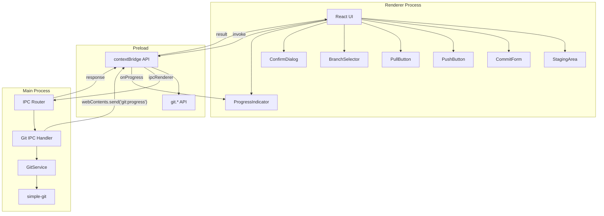

# 基本 Git 操作

**関連 Spec:** [basic-git-operations_spec.md](./basic-git-operations_spec.md)
**関連 PRD:** [basic-git-operations.md](../requirement/basic-git-operations.md)

---

# 1. 実装ステータス

**ステータス:** 🔴 未実装

## 1.1. 実装進捗

| モジュール/機能 | ステータス | 備考 |
|--------------|----------|------|
| GitService | 🔴 | simple-git ラッパーサービス |
| IPC ハンドラー（git:*） | 🔴 | Git 操作の IPC ルーティング |
| StagingArea コンポーネント | 🔴 | ステージング UI |
| CommitForm コンポーネント | 🔴 | コミットフォーム UI |
| PushButton コンポーネント | 🔴 | プッシュボタン UI |
| PullButton コンポーネント | 🔴 | プル/フェッチボタン UI |
| BranchSelector コンポーネント | 🔴 | ブランチ操作 UI |
| ConfirmDialog コンポーネント | 🔴 | 確認ダイアログ UI |
| Preload API 拡張 | 🔴 | git.* API の公開 |

---

# 2. 設計目標

1. **simple-git による安全な Git 操作** — simple-git ライブラリをメインプロセスで使用し、型安全な Git 操作 API を提供する（原則 A-002: Library-First）
2. **Electron プロセス分離の徹底** — すべての Git 操作はメインプロセスの GitService で実行し、レンダラーは IPC 経由でのみアクセスする（原則 A-001）
3. **不可逆操作の安全性確保** — amend、ブランチ削除、force push 等の不可逆操作には必ず確認ダイアログを挟む（原則 B-002）
4. **IPCResult パターンの統一** — application-foundation で定義された `IPCResult<T>` 型パターンを Git 操作にも統一的に適用する
5. **リモート操作の進捗フィードバック** — プッシュ・プル・フェッチの長時間操作に進捗インジケーターを提供する

---

# 3. 技術スタック

> 以下はプロジェクト共通の技術スタックです。機能固有の追加技術のみ記載してください。

| 領域 | 採用技術 | 選定理由 |
|------|----------|----------|
| Git 操作 | simple-git | Node.js 向け Git クライアントライブラリ。型安全な API、Promise ベース、進捗コールバック対応。CONSTITUTION A-002 で指定（原則 A-002: Library-First） |

<details>
<summary>プロジェクト共通スタック（参考）</summary>

| 領域 | 採用技術 |
|------|----------|
| フレームワーク | Electron 41 + Electron Forge 7 |
| バンドラー | Vite 5 |
| UI | React 19 + TypeScript |
| スタイリング | Tailwind CSS v4 (`@tailwindcss/postcss`) |
| UIコンポーネント | Shadcn/ui |
| Git操作 | simple-git（予定） |
| エディタ | Monaco Editor（予定） |

</details>

---

# 4. アーキテクチャ

## 4.1. システム構成図



## 4.2. モジュール分割

| モジュール名 | プロセス | 責務 | 配置場所 |
|------------|---------|------|---------|
| GitService | main | simple-git ラッパー。Git 操作のビジネスロジック | `src/main/services/git.ts` |
| Git IPC Handler | main | Git 関連 IPC チャネルの登録・バリデーション | `src/main/ipc/git-handler.ts` |
| Git 型定義 | shared | Git 操作の型定義（引数・戻り値・データモデル） | `src/types/git.ts` |
| preload API 拡張 | preload | git.* API の contextBridge 公開 | `src/preload.ts` |
| StagingArea | renderer | ステージング UI（変更ファイル一覧） | `src/components/git/StagingArea.tsx` |
| CommitForm | renderer | コミットメッセージ入力フォーム | `src/components/git/CommitForm.tsx` |
| PushButton | renderer | プッシュボタン UI | `src/components/git/PushButton.tsx` |
| PullButton | renderer | プル/フェッチボタン UI | `src/components/git/PullButton.tsx` |
| BranchSelector | renderer | ブランチセレクター UI | `src/components/git/BranchSelector.tsx` |
| ConfirmDialog | renderer | 確認ダイアログ（汎用） | `src/components/ConfirmDialog.tsx` |
| ProgressIndicator | renderer | 進捗インジケーター | `src/components/ProgressIndicator.tsx` |

---

# 5. データモデル

```typescript
// src/types/git.ts

// --- ステージング ---

interface StageArgs {
  repoPath: string;
  files: string[];
}

interface StageAllArgs {
  repoPath: string;
}

interface StageHunkArgs {
  repoPath: string;
  file: string;
  hunkIndex: number;
}

// --- コミット ---

interface CommitArgs {
  repoPath: string;
  message: string;
  amend?: boolean;
}

interface CommitResult {
  hash: string;
  message: string;
  author: string;
  date: string; // ISO 8601
}

// --- プッシュ ---

interface PushArgs {
  repoPath: string;
  remote?: string;
  branch?: string;
  setUpstream?: boolean;
}

interface PushResult {
  remote: string;
  branch: string;
  success: boolean;
  upToDate: boolean;
}

// --- プル ---

interface PullArgs {
  repoPath: string;
  remote?: string;
  branch?: string;
}

interface PullResult {
  remote: string;
  branch: string;
  created: string[];
  deleted: string[];
  summary: {
    changes: number;
    insertions: number;
    deletions: number;
  };
  conflicts: string[];
}

// --- フェッチ ---

interface FetchArgs {
  repoPath: string;
  remote?: string;
}

interface FetchResult {
  remote: string;
  branches: string[];
  tags: string[];
}

// --- ブランチ ---

interface BranchCreateArgs {
  repoPath: string;
  name: string;
  startPoint?: string;
}

interface BranchCheckoutArgs {
  repoPath: string;
  branch: string;
}

interface BranchDeleteArgs {
  repoPath: string;
  branch: string;
  remote?: boolean;
  force?: boolean;
}

interface BranchListArgs {
  repoPath: string;
}

interface BranchInfo {
  name: string;
  current: boolean;
  remote: boolean;
  tracking?: string;
  ahead: number;
  behind: number;
  lastCommitHash?: string;
  lastCommitMessage?: string;
}

// --- 共通 ---

interface FileStatus {
  path: string;
  status: FileChangeType;
  staged: boolean;
}

type FileChangeType =
  | 'added'
  | 'modified'
  | 'deleted'
  | 'renamed'
  | 'copied'
  | 'untracked';

interface GitProgressEvent {
  operation: string;
  phase: string;
  progress?: number; // 0-100, undefined = indeterminate
}
```

---

# 6. インターフェース定義

## 6.1. GitService（メインプロセス側）

```typescript
// src/main/services/git.ts
import simpleGit, { SimpleGit } from 'simple-git';
import type { IPCResult } from '../../types/ipc';
import type {
  StageArgs,
  CommitArgs,
  CommitResult,
  PushArgs,
  PushResult,
  PullArgs,
  PullResult,
  FetchArgs,
  FetchResult,
  BranchCreateArgs,
  BranchCheckoutArgs,
  BranchDeleteArgs,
  BranchInfo,
  FileStatus,
} from '../../types/git';

export class GitService {
  private getGit(repoPath: string): SimpleGit {
    return simpleGit(repoPath);
  }

  async stage(args: StageArgs): Promise<IPCResult<void>> {
    try {
      const git = this.getGit(args.repoPath);
      await git.add(args.files);
      return { success: true, data: undefined };
    } catch (error) {
      return this.handleError(error, 'STAGE_FAILED');
    }
  }

  async stageAll(repoPath: string): Promise<IPCResult<void>> {
    try {
      const git = this.getGit(repoPath);
      await git.add('.');
      return { success: true, data: undefined };
    } catch (error) {
      return this.handleError(error, 'STAGE_ALL_FAILED');
    }
  }

  async unstage(args: StageArgs): Promise<IPCResult<void>> {
    try {
      const git = this.getGit(args.repoPath);
      await git.reset(['HEAD', '--', ...args.files]);
      return { success: true, data: undefined };
    } catch (error) {
      return this.handleError(error, 'UNSTAGE_FAILED');
    }
  }

  async unstageAll(repoPath: string): Promise<IPCResult<void>> {
    try {
      const git = this.getGit(repoPath);
      await git.reset(['HEAD']);
      return { success: true, data: undefined };
    } catch (error) {
      return this.handleError(error, 'UNSTAGE_ALL_FAILED');
    }
  }

  async commit(args: CommitArgs): Promise<IPCResult<CommitResult>> {
    try {
      const git = this.getGit(args.repoPath);
      const options = args.amend ? ['--amend'] : [];
      const result = await git.commit(args.message, undefined, Object.fromEntries(options.map(o => [o, null])));
      return {
        success: true,
        data: {
          hash: result.commit,
          message: args.message,
          author: result.author?.name ?? '',
          date: new Date().toISOString(),
        },
      };
    } catch (error) {
      return this.handleError(error, 'COMMIT_FAILED');
    }
  }

  async push(args: PushArgs): Promise<IPCResult<PushResult>> {
    try {
      const git = this.getGit(args.repoPath);
      const pushOptions: string[] = [];
      if (args.setUpstream) {
        pushOptions.push('-u');
      }
      const remote = args.remote ?? 'origin';
      const branch = args.branch;

      await git.push(remote, branch, pushOptions);
      return {
        success: true,
        data: {
          remote,
          branch: branch ?? '',
          success: true,
          upToDate: false,
        },
      };
    } catch (error) {
      // upstream 未設定エラーの判別
      const errorMessage = error instanceof Error ? error.message : String(error);
      if (errorMessage.includes('no upstream') || errorMessage.includes('--set-upstream')) {
        return {
          success: false,
          error: {
            code: 'NO_UPSTREAM',
            message: 'upstream が設定されていません。--set-upstream でプッシュしてください。',
            detail: errorMessage,
          },
        };
      }
      if (errorMessage.includes('rejected')) {
        return {
          success: false,
          error: {
            code: 'PUSH_REJECTED',
            message: 'プッシュがリジェクトされました。先にプルしてください。',
            detail: errorMessage,
          },
        };
      }
      return this.handleError(error, 'PUSH_FAILED');
    }
  }

  async pull(args: PullArgs): Promise<IPCResult<PullResult>> {
    try {
      const git = this.getGit(args.repoPath);
      const remote = args.remote ?? 'origin';
      const branch = args.branch;
      const result = await git.pull(remote, branch);
      return {
        success: true,
        data: {
          remote,
          branch: branch ?? '',
          created: result.created,
          deleted: result.deleted,
          summary: {
            changes: result.summary.changes,
            insertions: result.summary.insertions,
            deletions: result.summary.deletions,
          },
          conflicts: [],
        },
      };
    } catch (error) {
      const errorMessage = error instanceof Error ? error.message : String(error);
      if (errorMessage.includes('CONFLICT') || errorMessage.includes('conflict')) {
        return {
          success: false,
          error: {
            code: 'PULL_CONFLICT',
            message: 'プル中にコンフリクトが発生しました。',
            detail: errorMessage,
          },
        };
      }
      return this.handleError(error, 'PULL_FAILED');
    }
  }

  async fetch(args: FetchArgs): Promise<IPCResult<FetchResult>> {
    try {
      const git = this.getGit(args.repoPath);
      const remote = args.remote;
      if (remote) {
        await git.fetch(remote);
      } else {
        await git.fetch(['--all']);
      }
      return {
        success: true,
        data: {
          remote: remote ?? 'all',
          branches: [],
          tags: [],
        },
      };
    } catch (error) {
      return this.handleError(error, 'FETCH_FAILED');
    }
  }

  async branchCreate(args: BranchCreateArgs): Promise<IPCResult<void>> {
    try {
      const git = this.getGit(args.repoPath);
      if (args.startPoint) {
        await git.checkoutBranch(args.name, args.startPoint);
      } else {
        await git.checkoutLocalBranch(args.name);
      }
      return { success: true, data: undefined };
    } catch (error) {
      return this.handleError(error, 'BRANCH_CREATE_FAILED');
    }
  }

  async branchCheckout(args: BranchCheckoutArgs): Promise<IPCResult<void>> {
    try {
      const git = this.getGit(args.repoPath);
      await git.checkout(args.branch);
      return { success: true, data: undefined };
    } catch (error) {
      return this.handleError(error, 'BRANCH_CHECKOUT_FAILED');
    }
  }

  async branchDelete(args: BranchDeleteArgs): Promise<IPCResult<void>> {
    try {
      const git = this.getGit(args.repoPath);
      if (args.remote) {
        // リモートブランチ削除: git push origin --delete <branch>
        await git.push('origin', undefined, ['--delete', args.branch]);
      } else if (args.force) {
        await git.branch(['-D', args.branch]);
      } else {
        await git.deleteLocalBranch(args.branch);
      }
      return { success: true, data: undefined };
    } catch (error) {
      return this.handleError(error, 'BRANCH_DELETE_FAILED');
    }
  }

  async branchList(repoPath: string): Promise<IPCResult<BranchInfo[]>> {
    try {
      const git = this.getGit(repoPath);
      const result = await git.branch(['-a', '-v']);
      const branches: BranchInfo[] = Object.entries(result.branches).map(
        ([name, info]) => ({
          name,
          current: info.current,
          remote: name.startsWith('remotes/'),
          tracking: undefined,
          ahead: 0,
          behind: 0,
          lastCommitHash: info.commit,
          lastCommitMessage: info.label,
        }),
      );
      return { success: true, data: branches };
    } catch (error) {
      return this.handleError(error, 'BRANCH_LIST_FAILED');
    }
  }

  private handleError(error: unknown, code: string): IPCResult<never> {
    const message = error instanceof Error ? error.message : String(error);
    return {
      success: false,
      error: {
        code,
        message,
        detail: error instanceof Error ? error.stack : undefined,
      },
    };
  }
}
```

## 6.2. Git IPC Handler（メインプロセス側）

```typescript
// src/main/ipc/git-handler.ts
import { ipcMain, BrowserWindow } from 'electron';
import type { IPCResult } from '../../types/ipc';
import type { GitService } from '../services/git';

export function registerGitIPCHandlers(gitService: GitService): void {
  // ステージング
  ipcMain.handle('git:stage', async (_event, args) => {
    return gitService.stage(args);
  });

  ipcMain.handle('git:stage-all', async (_event, args) => {
    return gitService.stageAll(args.repoPath);
  });

  ipcMain.handle('git:unstage', async (_event, args) => {
    return gitService.unstage(args);
  });

  ipcMain.handle('git:unstage-all', async (_event, args) => {
    return gitService.unstageAll(args.repoPath);
  });

  ipcMain.handle('git:stage-hunk', async (_event, args) => {
    // ハンク単位ステージングは simple-git の raw コマンドで実装
    // 実装時に詳細を決定
    return gitService.stage(args);
  });

  ipcMain.handle('git:unstage-hunk', async (_event, args) => {
    return gitService.unstage(args);
  });

  // コミット
  ipcMain.handle('git:commit', async (_event, args) => {
    return gitService.commit(args);
  });

  // プッシュ
  ipcMain.handle('git:push', async (_event, args) => {
    return gitService.push(args);
  });

  // プル/フェッチ
  ipcMain.handle('git:pull', async (_event, args) => {
    return gitService.pull(args);
  });

  ipcMain.handle('git:fetch', async (_event, args) => {
    return gitService.fetch(args);
  });

  // ブランチ操作
  ipcMain.handle('git:branch-create', async (_event, args) => {
    return gitService.branchCreate(args);
  });

  ipcMain.handle('git:branch-checkout', async (_event, args) => {
    return gitService.branchCheckout(args);
  });

  ipcMain.handle('git:branch-delete', async (_event, args) => {
    return gitService.branchDelete(args);
  });

  ipcMain.handle('git:branch-list', async (_event, args) => {
    return gitService.branchList(args.repoPath);
  });
}
```

## 6.3. Preload API 拡張（contextBridge 経由）

```typescript
// src/preload.ts に追加する git.* API
// 既存の electronAPI に git プロパティを追加

git: {
  stage: (args: StageArgs): Promise<IPCResult<void>> =>
    ipcRenderer.invoke('git:stage', args),
  stageAll: (args: StageAllArgs): Promise<IPCResult<void>> =>
    ipcRenderer.invoke('git:stage-all', args),
  unstage: (args: StageArgs): Promise<IPCResult<void>> =>
    ipcRenderer.invoke('git:unstage', args),
  unstageAll: (args: StageAllArgs): Promise<IPCResult<void>> =>
    ipcRenderer.invoke('git:unstage-all', args),
  stageHunk: (args: StageHunkArgs): Promise<IPCResult<void>> =>
    ipcRenderer.invoke('git:stage-hunk', args),
  unstageHunk: (args: StageHunkArgs): Promise<IPCResult<void>> =>
    ipcRenderer.invoke('git:unstage-hunk', args),
  commit: (args: CommitArgs): Promise<IPCResult<CommitResult>> =>
    ipcRenderer.invoke('git:commit', args),
  push: (args: PushArgs): Promise<IPCResult<PushResult>> =>
    ipcRenderer.invoke('git:push', args),
  pull: (args: PullArgs): Promise<IPCResult<PullResult>> =>
    ipcRenderer.invoke('git:pull', args),
  fetch: (args: FetchArgs): Promise<IPCResult<FetchResult>> =>
    ipcRenderer.invoke('git:fetch', args),
  branchCreate: (args: BranchCreateArgs): Promise<IPCResult<void>> =>
    ipcRenderer.invoke('git:branch-create', args),
  branchCheckout: (args: BranchCheckoutArgs): Promise<IPCResult<void>> =>
    ipcRenderer.invoke('git:branch-checkout', args),
  branchDelete: (args: BranchDeleteArgs): Promise<IPCResult<void>> =>
    ipcRenderer.invoke('git:branch-delete', args),
  branchList: (args: BranchListArgs): Promise<IPCResult<BranchInfo[]>> =>
    ipcRenderer.invoke('git:branch-list', args),
  onProgress: (callback: (event: GitProgressEvent) => void): void => {
    ipcRenderer.on('git:progress', (_event, data) => {
      callback(data);
    });
  },
},
```

## 6.4. レンダラー側の型定義拡張

```typescript
// src/types/electron.d.ts に追加
// 既存の ElectronAPI interface に git プロパティを追加

interface ElectronAPI {
  // ... 既存の repository, settings, onError ...

  git: {
    stage(args: StageArgs): Promise<IPCResult<void>>;
    stageAll(args: StageAllArgs): Promise<IPCResult<void>>;
    unstage(args: StageArgs): Promise<IPCResult<void>>;
    unstageAll(args: StageAllArgs): Promise<IPCResult<void>>;
    stageHunk(args: StageHunkArgs): Promise<IPCResult<void>>;
    unstageHunk(args: StageHunkArgs): Promise<IPCResult<void>>;
    commit(args: CommitArgs): Promise<IPCResult<CommitResult>>;
    push(args: PushArgs): Promise<IPCResult<PushResult>>;
    pull(args: PullArgs): Promise<IPCResult<PullResult>>;
    fetch(args: FetchArgs): Promise<IPCResult<FetchResult>>;
    branchCreate(args: BranchCreateArgs): Promise<IPCResult<void>>;
    branchCheckout(args: BranchCheckoutArgs): Promise<IPCResult<void>>;
    branchDelete(args: BranchDeleteArgs): Promise<IPCResult<void>>;
    branchList(args: BranchListArgs): Promise<IPCResult<BranchInfo[]>>;
    onProgress(callback: (event: GitProgressEvent) => void): void;
  };
}
```

---

# 7. 非機能要件実現方針

| 要件 | 実現方針 |
|------|----------|
| Git 操作応答3秒以内 (NFR_301) | simple-git の非同期 API を使用。重い操作は進捗インジケーターで体感速度を向上 |
| リモート操作の進捗フィードバック (NFR_302) | simple-git の progress イベントを `git:progress` IPC チャネルでレンダラーに転送。ProgressIndicator コンポーネントで表示 |
| 不可逆操作の安全性 (DC_301, B-002) | ConfirmDialog コンポーネントで確認。destructive バリアントで視覚的に危険性を示す。amend/ブランチ削除で使用 |
| メインプロセス実行 (DC_302, A-001) | GitService をメインプロセスにのみ配置。レンダラーからは IPC 経由でのみアクセス |

---

# 8. テスト戦略

| テストレベル | 対象 | カバレッジ目標 |
|------------|------|------------|
| ユニットテスト | GitService（simple-git をモック） | ≥ 80% |
| ユニットテスト | Git IPC Handler（バリデーション、ルーティング） | ≥ 80% |
| ユニットテスト | React コンポーネント（StagingArea, CommitForm, BranchSelector 等） | ≥ 60% |
| 結合テスト | IPC 通信フロー（main ↔ preload ↔ renderer） | 主要フロー |
| 結合テスト | GitService と実際の Git リポジトリ（テスト用リポジトリ） | 主要操作 |
| E2Eテスト | ステージ → コミット → プッシュの一連のフロー | 主要ユースケース |
| E2Eテスト | ブランチ作成 → 切り替え → 削除の一連のフロー | 主要ユースケース |

### テスト時のモック方針

- **GitService のユニットテスト**: simple-git をモックし、各メソッドの正常系・異常系をテスト
- **IPC Handler のユニットテスト**: GitService をモックし、IPC のルーティング・バリデーションをテスト
- **React コンポーネントのテスト**: `window.electronAPI.git.*` をモックし、UI の振る舞いをテスト
- **結合テスト**: テスト用の一時 Git リポジトリを作成し、実際の Git 操作をテスト

---

# 9. 設計判断

## 9.1. 決定事項

| 決定事項 | 選択肢 | 決定内容 | 理由 |
|----------|--------|----------|------|
| Git ライブラリ | simple-git / nodegit / isomorphic-git / child_process 直接 | simple-git | CONSTITUTION で指定。Promise ベース、型定義付き、メンテナンス活発。nodegit はネイティブバインディングで Electron との互換性問題あり（原則 A-002） |
| GitService のインスタンス管理 | シングルトン / リポジトリごとにインスタンス / メソッドごとにインスタンス | メソッドごとに simple-git インスタンスを生成 | リポジトリパスが操作ごとに異なる可能性があるため。simple-git のインスタンス生成は軽量 |
| ハンク単位ステージングの実装 | simple-git の raw コマンド / git apply --cached | simple-git の raw コマンド（`git add -p` 相当の非対話的実行） | simple-git に直接的なハンク操作 API がないため、raw コマンドでパッチを適用。実装時に詳細を決定 |
| 確認ダイアログの実装 | Electron のネイティブダイアログ / React のカスタムダイアログ | React のカスタムダイアログ（ConfirmDialog） | UI の一貫性。Shadcn/ui の AlertDialog をベースにカスタマイズ。操作内容に応じた詳細な情報表示が可能 |
| エラーコードの体系 | フラットなコード / ドメインプレフィックス付き | ドメインプレフィックス付き（STAGE_FAILED, COMMIT_FAILED 等） | IPC チャネルの名前空間方式（`git:*`）に合わせた管理性 |
| Git コンポーネントの配置 | components/ 直下 / components/git/ サブディレクトリ | components/git/ サブディレクトリ | Git 操作コンポーネントをグルーピング。他の機能領域との分離が明確 |

## 9.2. 未解決の課題

| 課題 | 影響度 | 対応方針 |
|------|--------|----------|
| ハンク単位ステージングの具体的な実装方法 | 中 | simple-git の raw コマンドで diff を解析し、パッチを適用する方式を実装時に検証。必要に応じて diff2html 等のライブラリを追加 |
| simple-git の progress イベントの粒度 | 低 | リモート操作（push/pull/fetch）での進捗表示。simple-git の progress コールバックの実際の呼び出し頻度を実装時に確認 |
| コンフリクト発生時の UI フロー | 中 | 本機能では通知のみ。コンフリクト解決 UI は FG-4（高度な Git 操作）のスコープ |
| 大規模リポジトリでのパフォーマンス | 中 | ファイル数が多い場合のステージング UI のレンダリング性能。仮想スクロール等の対策を実装時に検討 |

---

# 10. 変更履歴

## v1.0

**変更内容:**

- 初版作成
- GitService、IPC ハンドラー、Preload API 拡張、React コンポーネントの設計を定義
- simple-git の統合方針を決定
- B-002 準拠の確認ダイアログ設計を含む
