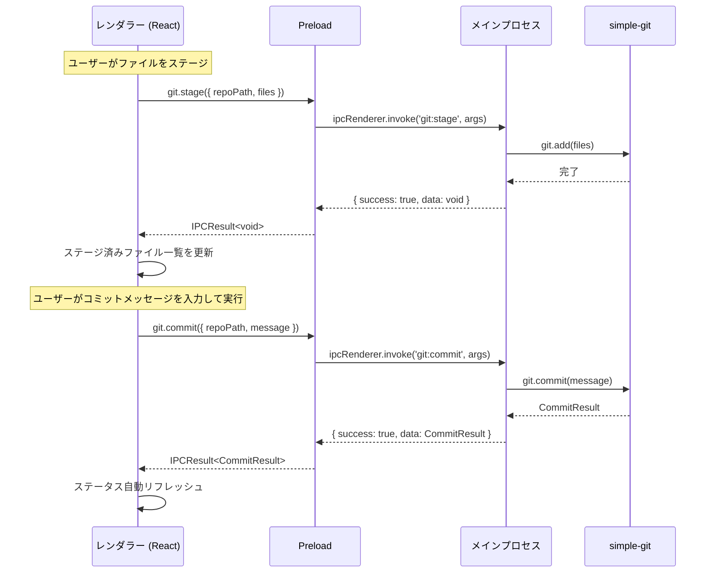
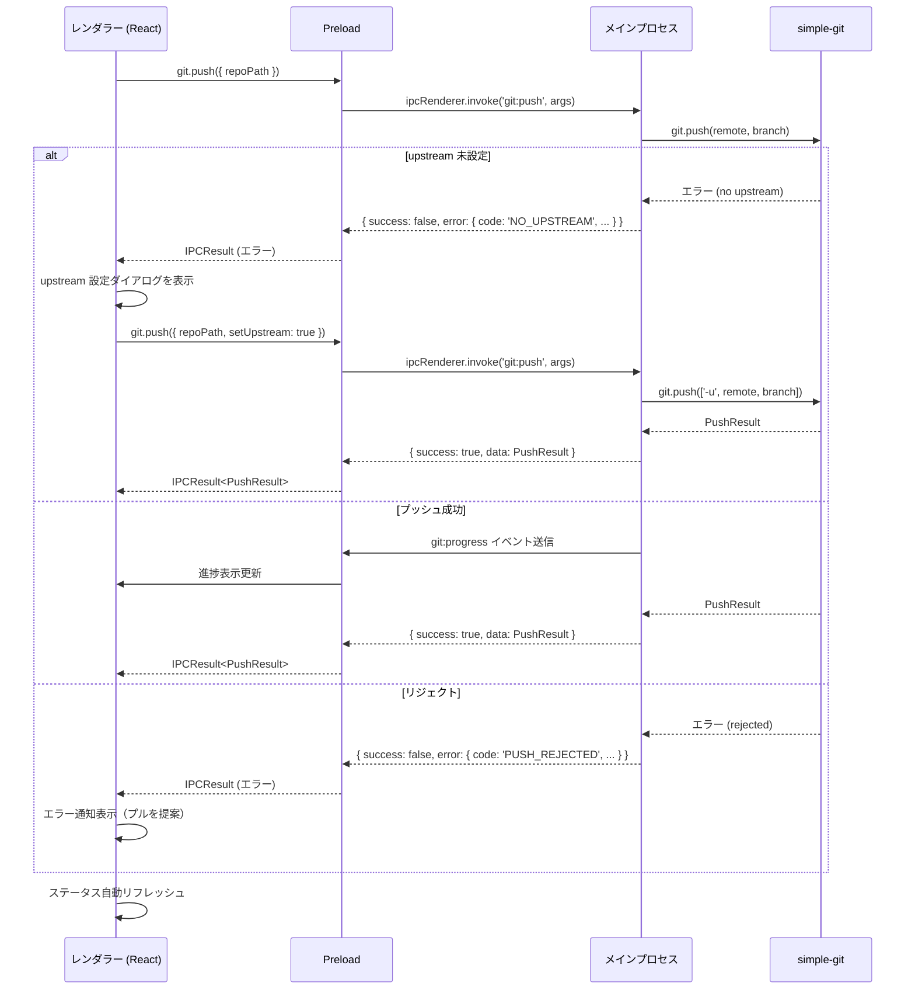
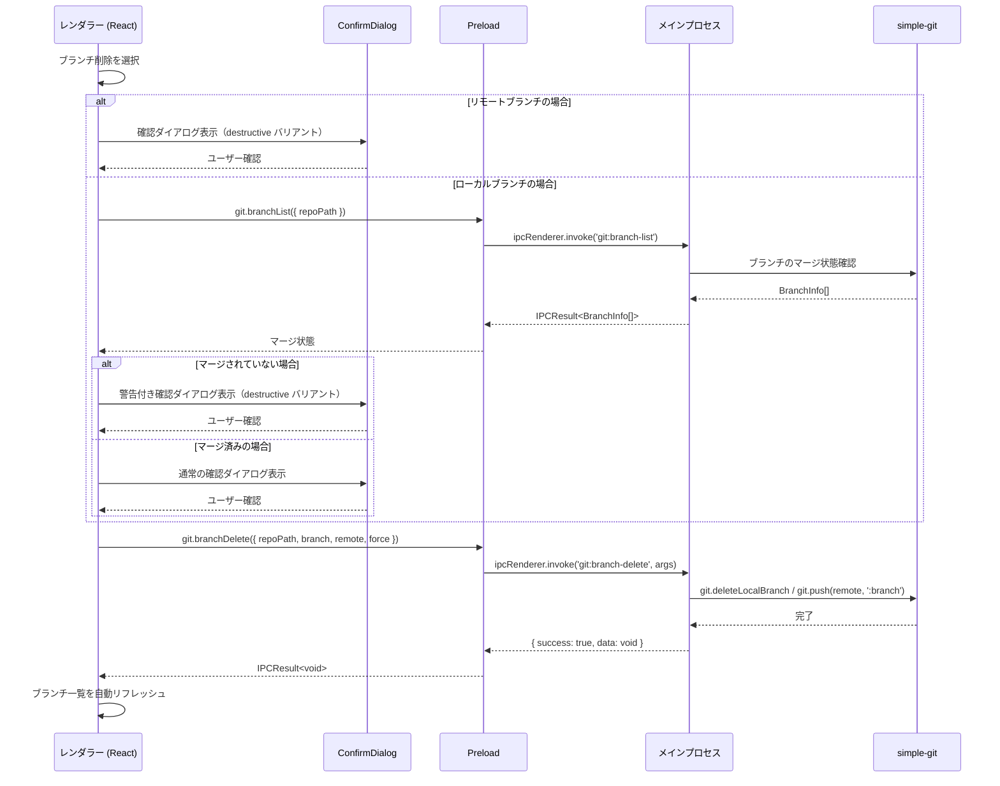

# 基本 Git 操作

**関連 Design Doc:** [basic-git-operations_design.md](./basic-git-operations_design.md)
**関連 PRD:** [basic-git-operations.md](../requirement/basic-git-operations.md)

---

# 1. 背景

Buruma は Git GUI アプリケーションとして、日常的な Git 操作を視覚的かつ安全に行える環境を提供する必要がある。CLI による Git 操作は柔軟だが、ステージング状態の把握やブランチの俯瞰、不可逆操作の誤実行リスクがある。本機能群はステージング、コミット、プッシュ、プル/フェッチ、ブランチ操作を GUI から直感的に実行し、不可逆操作には確認ステップを設けることで安全性を確保する。

本仕様は PRD [basic-git-operations.md](../requirement/basic-git-operations.md) の要求（UR_301〜UR_304, FR_301〜FR_306, NFR_301〜NFR_302, DC_301〜DC_302）を実現するための論理設計を定義する。

# 2. 概要

基本 Git 操作は以下の5つのサブシステムで構成される：

1. **ステージング** — ファイル単位/ハンク単位でのステージング・アンステージング（FR_301）
2. **コミット** — コミットメッセージ入力とコミット実行（amend 対応含む）（FR_302）
3. **プッシュ** — リモートへのプッシュ（upstream 設定含む）（FR_303）
4. **プル/フェッチ** — リモートからのプル・フェッチ（FR_304）
5. **ブランチ操作** — ブランチの作成・切り替え・削除（FR_305, FR_306）

すべてのサブシステムは Electron のマルチプロセスアーキテクチャ（main / preload / renderer）に準拠し、Git 操作はメインプロセスで実行する（DC_302）。不可逆操作には確認ダイアログを必ず表示する（DC_301, 原則 B-002）。

# 3. 要求定義

## 3.1. 機能要件 (Functional Requirements)

### ステージング

| ID | 要件 | 優先度 | 根拠 (PRD) |
|--------|------|------|------|
| FR-001 | ファイル単位のステージングを提供する（個別選択） | 必須 | FR_301_01 |
| FR-002 | ファイル単位のアンステージングを提供する | 必須 | FR_301_02 |
| FR-003 | ハンク単位のステージングを提供する（差分表示上での選択） | 推奨 | FR_301_03 |
| FR-004 | ハンク単位のアンステージングを提供する | 推奨 | FR_301_04 |
| FR-005 | 全ファイル一括ステージング/アンステージングを提供する | 必須 | FR_301_05 |

### コミット

| ID | 要件 | 優先度 | 根拠 (PRD) |
|--------|------|------|------|
| FR-006 | 複数行対応のコミットメッセージ入力エリアを提供する | 必須 | FR_302_01 |
| FR-007 | コミット実行ボタンを提供する | 必須 | FR_302_02 |
| FR-008 | 直前のコミットの修正（amend）を確認ダイアログ付きで提供する | 必須 | FR_302_03, DC_301 |
| FR-009 | ステージ済みファイルがない場合に空コミットを防止する | 必須 | FR_302_04 |
| FR-010 | コミット後にステータスを自動リフレッシュする | 必須 | FR_302_05 |

### プッシュ

| ID | 要件 | 優先度 | 根拠 (PRD) |
|--------|------|------|------|
| FR-011 | デフォルトリモートへのプッシュを提供する | 必須 | FR_303_01 |
| FR-012 | upstream 未設定時に設定案内を表示する（`--set-upstream` 相当） | 必須 | FR_303_02 |
| FR-013 | プッシュ先リモート・ブランチの選択を提供する | 推奨 | FR_303_03 |
| FR-014 | プッシュ結果の通知（成功/失敗/リジェクト）を表示する | 必須 | FR_303_04 |

### プル/フェッチ

| ID | 要件 | 優先度 | 根拠 (PRD) |
|--------|------|------|------|
| FR-015 | デフォルトリモートからのプルを提供する | 推奨 | FR_304_01 |
| FR-016 | 全リモートからのフェッチを提供する | 推奨 | FR_304_02 |
| FR-017 | プル時のコンフリクト発生を通知する | 推奨 | FR_304_03 |
| FR-018 | プル/フェッチ後にステータス・ログを自動リフレッシュする | 推奨 | FR_304_04 |

### ブランチ操作

| ID | 要件 | 優先度 | 根拠 (PRD) |
|--------|------|------|------|
| FR-019 | 新規ブランチ作成ダイアログ（ブランチ名入力、起点指定）を提供する | 推奨 | FR_305_01 |
| FR-020 | 既存ブランチへのチェックアウトを提供する | 推奨 | FR_305_02 |
| FR-021 | 未コミット変更がある場合にチェックアウト時の警告を表示する | 推奨 | FR_305_03, DC_301 |
| FR-022 | チェックアウト後にステータス・ログを自動リフレッシュする | 推奨 | FR_305_04 |
| FR-023 | ローカルブランチの削除を確認ダイアログ付きで提供する | 任意 | FR_306_01, DC_301 |
| FR-024 | リモートブランチの削除を確認ダイアログ付きで提供する | 任意 | FR_306_02, DC_301 |
| FR-025 | マージされていないブランチの削除警告を表示する | 任意 | FR_306_03, DC_301 |
| FR-026 | 現在チェックアウト中のブランチの削除を防止する | 任意 | FR_306_04 |

## 3.2. 非機能要件 (Non-Functional Requirements)

| ID | カテゴリ | 要件 | 目標値 | 根拠 (PRD) |
|---------|------|------|------|------|
| NFR-001 | 性能 | Git 操作（ステージング・コミット等）の UI への応答 | 3秒以内 | NFR_301 |
| NFR-002 | UX | リモート操作（プッシュ・プル・フェッチ）の進捗フィードバック | 進捗インジケーター表示 | NFR_302 |
| NFR-003 | 安全性 | 不可逆操作に対する確認ステップ | 確認ダイアログ必須 | DC_301, B-002 |
| NFR-004 | セキュリティ | Git 操作のメインプロセス実行 | レンダラーから直接実行しない | DC_302, A-001 |

# 4. API

## 4.1. IPC API（メインプロセス ↔ レンダラー）

### ステージング

| チャネル名 | 方向 | 概要 | 引数 | 戻り値 |
|-----------|------|------|------|--------|
| `git:stage` | renderer → main | ファイルをステージする | `{ repoPath: string; files: string[] }` | `IPCResult<void>` |
| `git:stage-all` | renderer → main | 全ファイルをステージする | `{ repoPath: string }` | `IPCResult<void>` |
| `git:unstage` | renderer → main | ファイルをアンステージする | `{ repoPath: string; files: string[] }` | `IPCResult<void>` |
| `git:unstage-all` | renderer → main | 全ファイルをアンステージする | `{ repoPath: string }` | `IPCResult<void>` |
| `git:stage-hunk` | renderer → main | ハンク単位でステージする | `{ repoPath: string; file: string; hunkIndex: number }` | `IPCResult<void>` |
| `git:unstage-hunk` | renderer → main | ハンク単位でアンステージする | `{ repoPath: string; file: string; hunkIndex: number }` | `IPCResult<void>` |

### コミット

| チャネル名 | 方向 | 概要 | 引数 | 戻り値 |
|-----------|------|------|------|--------|
| `git:commit` | renderer → main | コミットを実行する | `{ repoPath: string; message: string; amend?: boolean }` | `IPCResult<CommitResult>` |

### プッシュ

| チャネル名 | 方向 | 概要 | 引数 | 戻り値 |
|-----------|------|------|------|--------|
| `git:push` | renderer → main | リモートにプッシュする | `{ repoPath: string; remote?: string; branch?: string; setUpstream?: boolean }` | `IPCResult<PushResult>` |

### プル/フェッチ

| チャネル名 | 方向 | 概要 | 引数 | 戻り値 |
|-----------|------|------|------|--------|
| `git:pull` | renderer → main | リモートからプルする | `{ repoPath: string; remote?: string; branch?: string }` | `IPCResult<PullResult>` |
| `git:fetch` | renderer → main | リモートからフェッチする | `{ repoPath: string; remote?: string }` | `IPCResult<FetchResult>` |

### ブランチ操作

| チャネル名 | 方向 | 概要 | 引数 | 戻り値 |
|-----------|------|------|------|--------|
| `git:branch-create` | renderer → main | 新規ブランチを作成する | `{ repoPath: string; name: string; startPoint?: string }` | `IPCResult<void>` |
| `git:branch-checkout` | renderer → main | ブランチをチェックアウトする | `{ repoPath: string; branch: string }` | `IPCResult<void>` |
| `git:branch-delete` | renderer → main | ブランチを削除する | `{ repoPath: string; branch: string; remote?: boolean; force?: boolean }` | `IPCResult<void>` |
| `git:branch-list` | renderer → main | ブランチ一覧を取得する | `{ repoPath: string }` | `IPCResult<BranchInfo[]>` |

### 進捗通知（メインプロセス → レンダラー）

| チャネル名 | 方向 | 概要 | 引数 | 戻り値 |
|-----------|------|------|------|--------|
| `git:progress` | main → renderer | Git 操作の進捗を通知する | `GitProgressEvent` | - |

## 4.2. React コンポーネント API

| コンポーネント | Props | 概要 |
|--------------|-------|------|
| `StagingArea` | `{ repoPath: string; stagedFiles: FileStatus[]; unstagedFiles: FileStatus[]; onStage: (files: string[]) => void; onUnstage: (files: string[]) => void; onStageAll: () => void; onUnstageAll: () => void }` | ステージング領域（変更ファイル一覧 + ステージ済みファイル一覧） |
| `CommitForm` | `{ repoPath: string; stagedCount: number; onCommit: (message: string, amend: boolean) => void; disabled?: boolean }` | コミットメッセージ入力フォーム + コミットボタン |
| `PushButton` | `{ repoPath: string; ahead: number; onPush: (options?: PushOptions) => void; loading?: boolean }` | プッシュボタン（ahead 数表示付き） |
| `PullButton` | `{ repoPath: string; behind: number; onPull: () => void; onFetch: () => void; loading?: boolean }` | プル/フェッチボタン（behind 数表示付き） |
| `BranchSelector` | `{ repoPath: string; currentBranch: string; branches: BranchInfo[]; onCheckout: (branch: string) => void; onCreate: (name: string, startPoint?: string) => void; onDelete: (branch: string, remote?: boolean) => void }` | ブランチセレクター（作成・切り替え・削除） |
| `ConfirmDialog` | `{ open: boolean; title: string; description: string; confirmLabel?: string; cancelLabel?: string; variant?: 'default' \| 'destructive'; onConfirm: () => void; onCancel: () => void }` | 確認ダイアログ（B-002 準拠の安全性確認） |
| `ProgressIndicator` | `{ operation: string; progress?: number; indeterminate?: boolean }` | 操作進捗インジケーター |

## 4.3. 型定義

```typescript
// ファイルのステータス情報
interface FileStatus {
  path: string;
  status: FileChangeType;
  staged: boolean;
}

type FileChangeType =
  | 'added'
  | 'modified'
  | 'deleted'
  | 'renamed'
  | 'copied'
  | 'untracked';

// コミット結果
interface CommitResult {
  hash: string;
  message: string;
  author: string;
  date: string; // ISO 8601
}

// プッシュ結果
interface PushResult {
  remote: string;
  branch: string;
  success: boolean;
  upToDate: boolean;
}

// プル結果
interface PullResult {
  remote: string;
  branch: string;
  created: string[];
  deleted: string[];
  summary: {
    changes: number;
    insertions: number;
    deletions: number;
  };
  conflicts: string[];
}

// フェッチ結果
interface FetchResult {
  remote: string;
  branches: string[];
  tags: string[];
}

// ブランチ情報
interface BranchInfo {
  name: string;
  current: boolean;
  remote: boolean;
  tracking?: string; // リモート追跡ブランチ
  ahead: number;
  behind: number;
  lastCommitHash?: string;
  lastCommitMessage?: string;
}

// プッシュオプション
interface PushOptions {
  remote?: string;
  branch?: string;
  setUpstream?: boolean;
  force?: boolean; // 強制プッシュ（B-002: 実行前に必ず確認ダイアログを表示すること）
}

// Git 進捗イベント
interface GitProgressEvent {
  operation: string;
  phase: string;
  progress?: number; // 0-100, undefined = indeterminate
}

// IPC 通信の統一レスポンス型（application-foundation から再エクスポート）
type IPCResult<T> =
  | { success: true; data: T }
  | { success: false; error: IPCError };

interface IPCError {
  code: string;
  message: string;
  detail?: string;
}
```

# 5. 用語集

| 用語 | 説明 |
|------|------|
| ステージング (staging) | 変更をインデックスに追加し、次のコミットに含める準備をすること |
| アンステージング (unstaging) | インデックスから変更を取り除き、ステージ前の状態に戻すこと |
| ハンク (hunk) | 差分の中の連続した変更ブロック。ハンク単位でのステージングが可能 |
| upstream | ローカルブランチが追跡するリモートブランチ |
| amend | 直前のコミットのメッセージや内容を修正すること |
| force push | リモートの履歴を強制的に上書きするプッシュ。不可逆な操作 |
| simple-git | Node.js 向けの Git クライアントライブラリ。メインプロセスで使用する |

# 6. 使用例

```typescript
// レンダラー側：ファイルをステージする
const result = await window.electronAPI.git.stage({
  repoPath: '/path/to/repo',
  files: ['src/main.ts', 'src/App.tsx'],
});
if (!result.success) {
  showError(result.error);
}

// レンダラー側：コミットを実行する
const commitResult = await window.electronAPI.git.commit({
  repoPath: '/path/to/repo',
  message: 'feat: add staging area component',
});

// レンダラー側：プッシュする
const pushResult = await window.electronAPI.git.push({
  repoPath: '/path/to/repo',
  setUpstream: true,
});

// レンダラー側：ブランチを作成して切り替える
await window.electronAPI.git.branchCreate({
  repoPath: '/path/to/repo',
  name: 'feature/new-feature',
  startPoint: 'main',
});
await window.electronAPI.git.branchCheckout({
  repoPath: '/path/to/repo',
  branch: 'feature/new-feature',
});

// レンダラー側：進捗通知の購読
window.electronAPI.git.onProgress((event: GitProgressEvent) => {
  updateProgressBar(event.operation, event.progress);
});

// React コンポーネントの使用例
<StagingArea
  repoPath={currentRepo.path}
  stagedFiles={stagedFiles}
  unstagedFiles={unstagedFiles}
  onStage={handleStage}
  onUnstage={handleUnstage}
  onStageAll={handleStageAll}
  onUnstageAll={handleUnstageAll}
/>

<CommitForm
  repoPath={currentRepo.path}
  stagedCount={stagedFiles.length}
  onCommit={handleCommit}
  disabled={stagedFiles.length === 0}
/>

<BranchSelector
  repoPath={currentRepo.path}
  currentBranch={currentBranch}
  branches={branches}
  onCheckout={handleCheckout}
  onCreate={handleCreateBranch}
  onDelete={handleDeleteBranch}
/>
```

# 7. 振る舞い図

## 7.1. コミットフロー



## 7.2. プッシュフロー



## 7.3. ブランチ削除フロー（B-002 準拠）



# 8. 制約事項

- レンダラーから Node.js API に直接アクセスしない（原則 A-001）
- Git 操作は必ずメインプロセスで実行する（DC_302）
- IPC 通信は型安全なインターフェースを経由する（原則 A-001, FR_604）
- 不可逆操作（amend, ブランチ削除, force push）には確認ダイアログを必ず表示する（DC_301, 原則 B-002）
- リモート操作には SSH キーまたは HTTPS 認証が設定済みであることが前提
- application-foundation の IPC 通信基盤（FR_604）を利用する
- `IPCResult<T>` 型パターンを統一的に使用する
- simple-git ライブラリ経由で Git 操作を実行する（原則 A-002）

---

# PRD 整合性確認

| PRD 要求 ID | 本仕様での対応 | ステータス |
|-------------|--------------|----------|
| UR_301 | 仕様全体 | 対応済み |
| UR_302 | FR-001〜FR-010 | 対応済み |
| UR_303 | FR-011〜FR-018 | 対応済み |
| UR_304 | FR-019〜FR-026 | 対応済み |
| FR_301 | FR-001〜FR-005 + git:stage / git:unstage API | 対応済み |
| FR_301_01 | FR-001 + git:stage | 対応済み |
| FR_301_02 | FR-002 + git:unstage | 対応済み |
| FR_301_03 | FR-003 + git:stage-hunk | 対応済み |
| FR_301_04 | FR-004 + git:unstage-hunk | 対応済み |
| FR_301_05 | FR-005 + git:stage-all / git:unstage-all | 対応済み |
| FR_302 | FR-006〜FR-010 + git:commit API | 対応済み |
| FR_302_01 | FR-006 + CommitForm コンポーネント | 対応済み |
| FR_302_02 | FR-007 + CommitForm コンポーネント | 対応済み |
| FR_302_03 | FR-008 + git:commit (amend オプション) + ConfirmDialog | 対応済み |
| FR_302_04 | FR-009 + CommitForm (disabled 制御) | 対応済み |
| FR_302_05 | FR-010 | 対応済み |
| FR_303 | FR-011〜FR-014 + git:push API | 対応済み |
| FR_303_01 | FR-011 + git:push | 対応済み |
| FR_303_02 | FR-012 + git:push (setUpstream オプション) | 対応済み |
| FR_303_03 | FR-013 + git:push (remote/branch オプション) | 対応済み |
| FR_303_04 | FR-014 + PushResult 型 | 対応済み |
| FR_304 | FR-015〜FR-018 + git:pull / git:fetch API | 対応済み |
| FR_304_01 | FR-015 + git:pull | 対応済み |
| FR_304_02 | FR-016 + git:fetch | 対応済み |
| FR_304_03 | FR-017 + PullResult.conflicts | 対応済み |
| FR_304_04 | FR-018 | 対応済み |
| FR_305 | FR-019〜FR-022 + git:branch-create / git:branch-checkout API | 対応済み |
| FR_305_01 | FR-019 + git:branch-create | 対応済み |
| FR_305_02 | FR-020 + git:branch-checkout | 対応済み |
| FR_305_03 | FR-021 + ConfirmDialog | 対応済み |
| FR_305_04 | FR-022 | 対応済み |
| FR_306 | FR-023〜FR-026 + git:branch-delete API | 対応済み |
| FR_306_01 | FR-023 + git:branch-delete + ConfirmDialog | 対応済み |
| FR_306_02 | FR-024 + git:branch-delete (remote オプション) + ConfirmDialog | 対応済み |
| FR_306_03 | FR-025 + ConfirmDialog (警告バリアント) | 対応済み |
| FR_306_04 | FR-026 + バリデーション | 対応済み |
| NFR_301 | NFR-001 | 対応済み |
| NFR_302 | NFR-002 + git:progress API + ProgressIndicator | 対応済み |
| DC_301 | NFR-003 + ConfirmDialog + 制約事項 | 対応済み |
| DC_302 | NFR-004 + 制約事項 | 対応済み |
