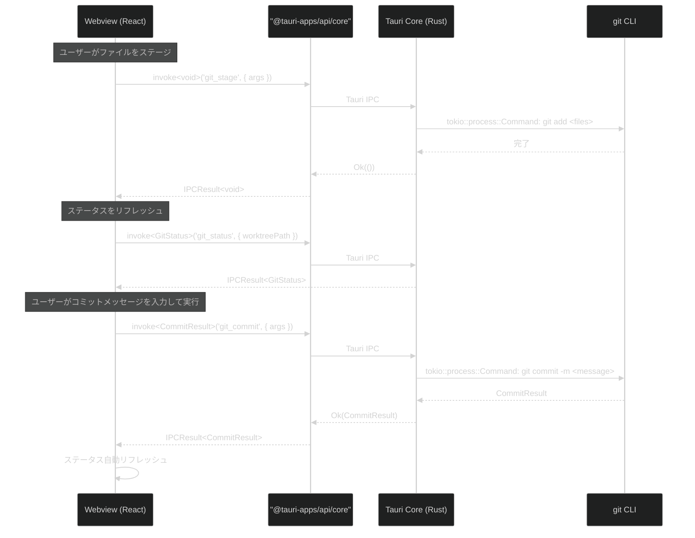
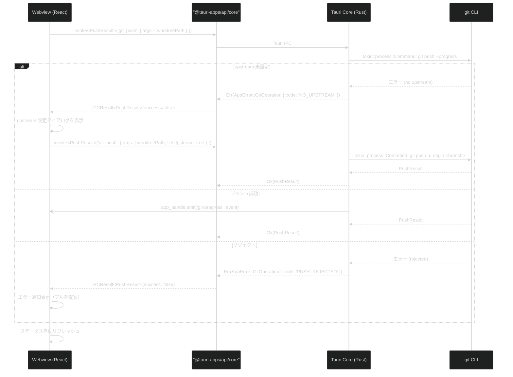
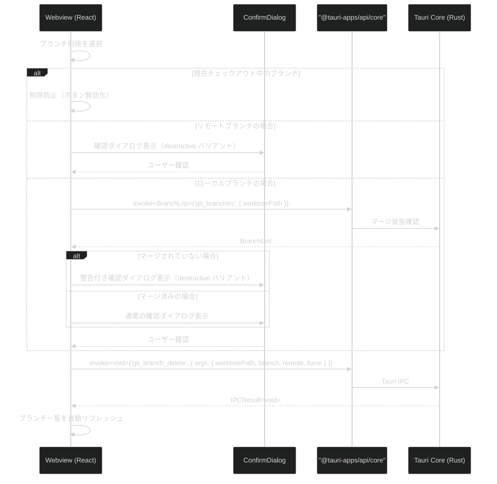

# 基本 Git 操作

**関連 Design Doc:** [basic-git-operations_design.md](./basic-git-operations_design.md)
**関連 PRD:** [basic-git-operations.md](../requirement/basic-git-operations.md)

---

# 1. 背景

Buruma は Git GUI アプリケーションとして、日常的な Git 操作を視覚的かつ安全に行える環境を提供する。CLI による Git 操作は柔軟だが、ステージング状態の把握やブランチの俯瞰、不可逆操作の誤実行リスクがある。本機能群はステージング、コミット、プッシュ、プル/フェッチ、ブランチ操作を GUI から直感的に実行し、不可逆操作には確認ステップを設けることで安全性を確保する。

本仕様は PRD [basic-git-operations.md](../requirement/basic-git-operations.md) の要求（UR_301〜UR_304, FR_301〜FR_306, NFR_301〜NFR_302, DC_301〜DC_302）を実現するための論理設計を定義する。

# 2. 概要

基本 Git 操作は以下の5つのサブシステムで構成される：

1. **ステージング** — ファイル単位でのステージング・アンステージング（FR_301）
2. **コミット** — コミットメッセージ入力とコミット実行（amend 対応含む）（FR_302）
3. **プッシュ** — リモートへのプッシュ（upstream 設定含む）（FR_303）
4. **プル/フェッチ** — リモートからのプル・フェッチ（FR_304）
5. **ブランチ操作** — ブランチの作成・切り替え・削除（FR_305, FR_306）

すべてのサブシステムは Tauri のアーキテクチャ（Webview / Tauri Core）に準拠し、Git 操作は Tauri Core (Rust) で実行する（DC_302）。不可逆操作には確認ダイアログを必ず表示する（DC_301, 原則 B-002）。

**重要な設計前提:**

- **worktreePath**（ワークツリーの絶対パス）を操作対象の識別子として使用する（B-001: Worktree-First UX）。ワークツリー選択時にパスが切り替わり、すべての Git 操作はそのワークツリーに対して実行される
- **Phase 1 ではハンク単位ステージング（FR_301_03, FR_301_04）は実装しない**。ファイル単位のステージングのみ提供し、ハンク単位は Phase 2 で対応する
- **自動リフレッシュは操作完了時に明示的に実行**する。各 Git 操作の invoke レスポンス受信後、Webview 側で既存の `git_status` / `git_branches` command を呼び出す
- **チェックアウト時の未コミット変更がある場合はキャンセルのみ提供**する。stash や強制チェックアウトは提供しない（stash は Advanced Git Operations のスコープ）

# 3. 要求定義

## 3.1. 機能要件 (Functional Requirements)

### ステージング

| ID | 要件 | 優先度 | 根拠 (PRD) |
|--------|------|------|------|
| FR-001 | ファイル単位のステージングを提供する（個別選択） | 必須 | FR_301_01 |
| FR-002 | ファイル単位のアンステージングを提供する | 必須 | FR_301_02 |
| FR-003 | ハンク単位のステージングを提供する（差分表示上での選択） | 推奨（**Phase 2**） | FR_301_03 |
| FR-004 | ハンク単位のアンステージングを提供する | 推奨（**Phase 2**） | FR_301_04 |
| FR-005 | 全ファイル一括ステージング/アンステージングを提供する | 必須 | FR_301_05 |

### コミット

| ID | 要件 | 優先度 | 根拠 (PRD) |
|--------|------|------|------|
| FR-006 | 複数行対応のコミットメッセージ入力エリアを提供する | 必須 | FR_302_01 |
| FR-007 | コミット実行ボタンを提供する | 必須 | FR_302_02 |
| FR-008 | 直前のコミットの修正（amend）を確認ダイアログ付きで提供する | 必須 | FR_302_03, DC_301 |
| FR-009 | ステージ済みファイルがない場合に空コミットを防止する | 必須 | FR_302_04 |
| FR-010 | コミット後にステータスを自動リフレッシュする | 必須 | FR_302_05 |

### プッシュ

| ID | 要件 | 優先度 | 根拠 (PRD) |
|--------|------|------|------|
| FR-011 | デフォルトリモートへのプッシュを提供する | 必須 | FR_303_01 |
| FR-012 | upstream 未設定時に設定案内を表示する（`--set-upstream` 相当） | 必須 | FR_303_02 |
| FR-013 | プッシュ先リモート・ブランチの選択を提供する | 推奨 | FR_303_03 |
| FR-014 | プッシュ結果の通知（成功/失敗/リジェクト）を表示する | 必須 | FR_303_04 |

### プル/フェッチ

| ID | 要件 | 優先度 | 根拠 (PRD) |
|--------|------|------|------|
| FR-015 | デフォルトリモートからのプルを提供する | 推奨 | FR_304_01 |
| FR-016 | 全リモートからのフェッチを提供する | 推奨 | FR_304_02 |
| FR-017 | プル時のコンフリクト発生を通知する（コンフリクト解決UIはスコープ外、通知のみ） | 推奨 | FR_304_03 |
| FR-018 | プル/フェッチ後にステータス・ログを自動リフレッシュする | 推奨 | FR_304_04 |

### ブランチ操作

| ID | 要件 | 優先度 | 根拠 (PRD) |
|--------|------|------|------|
| FR-019 | 新規ブランチ作成ダイアログ（ブランチ名入力、起点指定）を提供する | 推奨 | FR_305_01 |
| FR-020 | 既存ブランチへのチェックアウトを提供する | 推奨 | FR_305_02 |
| FR-021 | 未コミット変更がある場合にチェックアウトを警告しキャンセルのみ提供する（stash・強制チェックアウトは提供しない） | 推奨 | FR_305_03, DC_301 |
| FR-022 | チェックアウト後にステータス・ログを自動リフレッシュする | 推奨 | FR_305_04 |
| FR-023 | ローカルブランチの削除を確認ダイアログ付きで提供する | 任意 | FR_306_01, DC_301 |
| FR-024 | リモートブランチの削除を確認ダイアログ付きで提供する | 任意 | FR_306_02, DC_301 |
| FR-025 | マージされていないブランチの削除警告を表示する | 任意 | FR_306_03, DC_301 |
| FR-026 | 現在チェックアウト中のブランチの削除を防止する | 任意 | FR_306_04 |

## 3.2. 非機能要件 (Non-Functional Requirements)

| ID | カテゴリ | 要件 | 目標値 | 根拠 (PRD) |
|---------|------|------|------|------|
| NFR-001 | 性能 | Git 操作（ステージング・コミット等）の UI への応答 | 3秒以内 | NFR_301 |
| NFR-002 | UX | リモート操作（プッシュ・プル・フェッチ）の進捗フィードバック | 進捗インジケーター表示 | NFR_302 |
| NFR-003 | 安全性 | 不可逆操作に対する確認ステップ | 確認ダイアログ必須 | DC_301, B-002 |
| NFR-004 | セキュリティ | Git 操作の Tauri Core (Rust) 実行 | Webview から直接実行しない | DC_302, A-001 |

# 4. API

## 4.1. IPC API（Tauri Core ↔ Webview）

以下は本機能で新規追加する Tauri command と event。既存 command（`git_status`, `git_branches` 等）はリフレッシュ用に再利用する。

### 4.1.1. ステージング（Commands, Webview → Core `invoke`）

| Command 名 | 概要 | 引数 | 戻り値 |
|-----------|------|------|--------|
| `git_stage` | ファイルをステージする | `{ worktreePath: string; files: string[] }` | `void` |
| `git_stage_all` | 全ファイルをステージする | `{ worktreePath: string }` | `void` |
| `git_unstage` | ファイルをアンステージする | `{ worktreePath: string; files: string[] }` | `void` |
| `git_unstage_all` | 全ファイルをアンステージする | `{ worktreePath: string }` | `void` |

### 4.1.2. コミット（Commands, Webview → Core `invoke`）

| Command 名 | 概要 | 引数 | 戻り値 |
|-----------|------|------|--------|
| `git_commit` | コミットを実行する | `CommitArgs` | `CommitResult` |

### 4.1.3. プッシュ（Commands, Webview → Core `invoke`）

| Command 名 | 概要 | 引数 | 戻り値 |
|-----------|------|------|--------|
| `git_push` | リモートにプッシュする | `PushArgs` | `PushResult` |

### 4.1.4. プル/フェッチ（Commands, Webview → Core `invoke`）

| Command 名 | 概要 | 引数 | 戻り値 |
|-----------|------|------|--------|
| `git_pull` | リモートからプルする | `PullArgs` | `PullResult` |
| `git_fetch` | リモートからフェッチする | `FetchArgs` | `FetchResult` |

### 4.1.5. ブランチ操作（Commands, Webview → Core `invoke`）

| Command 名 | 概要 | 引数 | 戻り値 |
|-----------|------|------|--------|
| `git_branch_create` | 新規ブランチを作成する | `BranchCreateArgs` | `void` |
| `git_branch_checkout` | ブランチをチェックアウトする | `BranchCheckoutArgs` | `void` |
| `git_branch_delete` | ブランチを削除する | `BranchDeleteArgs` | `void` |
| `git_reset` | 指定コミットまでリセットする | `ResetArgs` | `void` |

### 4.1.6. 進捗通知（Events, Core → Webview `emit` / `listen`）

| Event 名 | 概要 | ペイロード |
|---------|------|-----------|
| `git-progress` | リモート操作（push / pull / fetch）の進捗を通知する | `GitProgressEvent` |

> **IPCResult<T> 互換**: Webview 側は `src/shared/lib/invoke/commands.ts` の `invokeCommand<T>` ラッパーを経由して呼び出す。

## 4.2. 型定義

以下は新規追加する domain 型。既存型（`GitStatus`, `FileChange`, `BranchList`, `BranchInfo` 等）は `src/domain/index.ts` から再利用する。

```typescript
// --- コミット ---

interface CommitArgs {
  worktreePath: string
  message: string
  amend?: boolean
}

interface CommitResult {
  hash: string
  message: string
  author: string
  date: string // ISO 8601
}

// --- プッシュ ---

interface PushArgs {
  worktreePath: string
  remote?: string
  branch?: string
  setUpstream?: boolean
}

interface PushResult {
  remote: string
  branch: string
  success: boolean
  upToDate: boolean
}

// --- プル ---

interface PullArgs {
  worktreePath: string
  remote?: string
  branch?: string
}

interface PullResult {
  remote: string
  branch: string
  summary: {
    changes: number
    insertions: number
    deletions: number
  }
  conflicts: string[]
}

// --- フェッチ ---

interface FetchArgs {
  worktreePath: string
  remote?: string
}

interface FetchResult {
  remote: string // フェッチ更新サマリー（更新ブランチ数等）は Phase 2 で拡張予定
}

// --- ブランチ操作 ---

interface BranchCreateArgs {
  worktreePath: string
  name: string
  startPoint?: string
}

interface BranchCheckoutArgs {
  worktreePath: string
  branch: string
}

interface BranchDeleteArgs {
  worktreePath: string
  branch: string
  remote?: boolean
  force?: boolean
}

// --- 進捗 ---

interface GitProgressEvent {
  operation: string // 'push' | 'pull' | 'fetch'
  phase: string
  progress?: number // 0-100, undefined = indeterminate
}
```

# 5. 用語集

| 用語 | 説明 |
|------|------|
| ステージング (staging) | 変更をインデックスに追加し、次のコミットに含める準備をすること |
| アンステージング (unstaging) | インデックスから変更を取り除き、ステージ前の状態に戻すこと |
| ハンク (hunk) | 差分の中の連続した変更ブロック。ハンク単位でのステージングが可能 |
| upstream | ローカルブランチが追跡するリモートブランチ |
| amend | 直前のコミットのメッセージや内容を修正すること |
| force push | リモートの履歴を強制的に上書きするプッシュ。不可逆な操作 |
| worktreePath | ワークツリーの絶対パス。Git 操作の対象を識別するパラメータ |

# 6. 使用例

```typescript
import { invokeCommand } from '@/shared/lib/invoke'
import type { CommitResult, PushResult, GitStatus } from '@/shared/domain'

// Webview 側：ファイルをステージする
const result = await invokeCommand<void>('git_stage', {
  args: { worktreePath: '/path/to/worktree', files: ['src/main.ts', 'src/App.tsx'] },
})
if (!result.success) {
  showError(result.error)
}

// Webview 側：コミットを実行する
const commitResult = await invokeCommand<CommitResult>('git_commit', {
  args: { worktreePath: '/path/to/worktree', message: 'feat: add staging area component' },
})

// Webview 側：操作完了後にステータスをリフレッシュ
if (commitResult.success) {
  const status = await invokeCommand<GitStatus>('git_status', { worktreePath })
  updateStatus(status.data)
}

// Webview 側：プッシュする
const pushResult = await invokeCommand<PushResult>('git_push', {
  args: { worktreePath: '/path/to/worktree', setUpstream: true },
})

// Webview 側：ブランチを作成して切り替える
await invokeCommand<void>('git_branch_create', {
  args: { worktreePath: '/path/to/worktree', name: 'feature/new-feature', startPoint: 'main' },
})
await invokeCommand<void>('git_branch_checkout', {
  args: { worktreePath: '/path/to/worktree', branch: 'feature/new-feature' },
})
```

# 7. 振る舞い図

> 以下の振る舞い図は Phase 1 スコープのみを対象とする。ハンク単位ステージング（FR-003/FR-004）は Phase 2 のため含まない。

## 7.1. コミットフロー



## 7.2. プッシュフロー



## 7.3. ブランチ削除フロー（B-002 準拠）



# 8. 制約事項

- Webview から OS API（fs / process / shell）に直接アクセスしない（原則 A-001）
- Git 操作は必ず Tauri Core (Rust) で実行する（DC_302）
- IPC 通信は型安全な Tauri command / event を経由する（原則 A-001）
- 不可逆操作（amend, ブランチ削除）には確認ダイアログを必ず表示する（DC_301, 原則 B-002）
- force push はスコープ外（Advanced Git Operations）
- リモート操作には SSH キーまたは HTTPS 認証が設定済みであることが前提
- application-foundation の IPC 通信基盤（`invokeCommand<T>` ラッパー）を利用する
- `IPCResult<T>` 型パターンを統一的に使用する
- 各 `#[tauri::command]` と UseCase はユニットテスト対象とし、カバレッジ 80% 以上を維持する（原則 D-002）

---

# PRD 整合性確認

| PRD 要求 ID | 本仕様での対応 | ステータス |
|-------------|--------------|----------|
| UR_301 | 仕様全体 | 対応済み |
| UR_302 | FR-001〜FR-010 | 対応済み |
| UR_303 | FR-011〜FR-018 | 対応済み |
| UR_304 | FR-019〜FR-026 | 対応済み |
| FR_301 | FR-001〜FR-005 + git:stage / git:unstage API | 対応済み |
| FR_301_01 | FR-001 + git:stage | 対応済み |
| FR_301_02 | FR-002 + git:unstage | 対応済み |
| FR_301_03 | FR-003（**Phase 2**） | 延期 |
| FR_301_04 | FR-004（**Phase 2**） | 延期 |
| FR_301_05 | FR-005 + git:stage-all / git:unstage-all | 対応済み |
| FR_302 | FR-006〜FR-010 + git:commit API | 対応済み |
| FR_303 | FR-011〜FR-014 + git:push API | 対応済み |
| FR_304 | FR-015〜FR-018 + git:pull / git:fetch API | 対応済み |
| FR_305 | FR-019〜FR-022 + git:branch-create / git:branch-checkout | 対応済み |
| FR_306 | FR-023〜FR-026 + git:branch-delete | 対応済み |
| NFR_301 | NFR-001 | 対応済み |
| NFR_302 | NFR-002 + git:progress イベント | 対応済み |
| DC_301 | NFR-003 + ConfirmDialog | 対応済み |
| DC_302 | NFR-004 | 対応済み |
