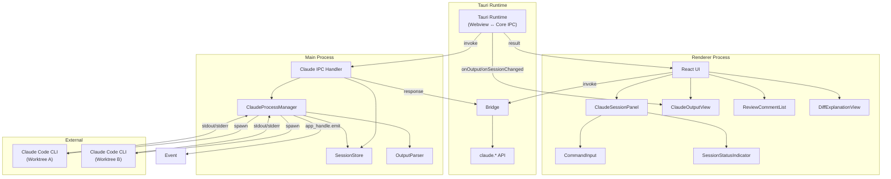

# Claude Code 連携

**関連 Spec:** [claude-code-integration_spec.md](./claude-code-integration_spec.md)
**関連 PRD:** [claude-code-integration.md](../requirement/claude-code-integration.md)

---

# 1. 実装ステータス

**ステータス:** 🟢 実装完了（v0.1.0 基盤 + FR_506 AI コンフリクト解決）

## 1.1. 実装進捗

### 1.1.1. Rust 側（src-tauri/src/features/claude_code_integration/）

| モジュール/機能 | ステータス | 備考 |
|--------------|----------|------|
| `domain.rs` | 🟢 | ClaudeSession, ClaudeCommand, ClaudeOutput, ReviewResult, ExplainResult, ConflictResolveRequest/Result, PersistedConversation 等の型定義 |
| `application/repositories.rs` | 🟢 | `ClaudeRepository` trait（13 メソッド） |
| `application/usecases.rs` | 🟢 | UseCase 関数群（start_session / stop_session / send_command / review_diff / explain_diff / generate_commit_message / resolve_conflict / check_auth / login / logout） |
| `infrastructure/session_manager.rs` | 🟢 | `ClaudeSessionManager`: SessionStore + ProcessManager を統合（design 4.2 表の元設計から実装で集約）。`tokio::process::Command` で `claude --version` 確認後セッション開始、stdin/stdout/stderr 制御、`claude-output` emit |
| `infrastructure/claude_repository.rs` | 🟢 | `DefaultClaudeRepository`: ClaudeRepository 実装。セッション操作は session_manager に委譲。ワンショット系（generateCommitMessage / reviewDiff / explainDiff / resolveConflict）はインラインで CLI 起動 + プロンプト構築 + 出力解析を実施 |
| `infrastructure/conversation_store.rs` | 🟢 | `ConversationStoreRepository`: 会話履歴を JSON 永続化（PersistedConversation） |
| Prompt Builder | 🟢 | `infrastructure/prompts/`（commit_message / review / explain / conflict_resolve）に分離（11. リファクタリング計画 R-04 で対応済み） |
| OutputParser | 🟢 | `infrastructure/output_parser.rs` に独立モジュール化（11. リファクタリング計画 R-03 で対応済み） |
| `presentation/commands.rs` | 🟢 | 15 個の `#[tauri::command]`（claude_start_session / claude_stop_session / claude_get_session / claude_get_all_sessions / claude_send_command / claude_get_output / claude_check_auth / claude_login / claude_logout / claude_generate_commit_message / claude_review_diff / claude_explain_diff / claude_resolve_conflict / claude_get_conversations / claude_save_conversations） |
| `infrastructure/git_command_proposal_detector.rs` | 🟡 | FR-008: 設計完了（§6.7）、実装は別 PR で対応 |
| `infrastructure/git_command_risk_classifier.rs` | 🟡 | FR-008: 設計完了（§6.8）、実装は別 PR で対応 |
| `infrastructure/approved_git_command_executor.rs` | 🟡 | FR-008: 設計完了（§6.9）、実装は別 PR で対応 |
| `claude_execute_approved_git_command` Tauri コマンド | 🟡 | FR-008: 設計完了（§4.1.8）、実装は別 PR で対応 |

### 1.1.2. Webview 側（src/features/claude-code-integration/）

| モジュール/機能 | ステータス | 備考 |
|--------------|----------|------|
| `application/repositories/claude-repository.ts` | 🟢 | `ClaudeRepository` IF（IPC API ラッパー契約） |
| `infrastructure/repositories/claude-default-repository.ts` | 🟢 | Tauri IPC アダプター（`invokeCommand` 経由） |
| `application/services/claude-service-interface.ts` | 🟢 | `ClaudeService` IF（21 個の Observable プロパティ + setter 群） |
| `application/services/claude-service.ts` | 🟡 | `ClaudeDefaultService`（460 行）。出力・セッション・チャット・会話・レビュー・解説の状態を集約管理。責務過剰のため 11. リファクタリング計画 R-02 で分割予定 |
| 操作系 UseCase（10 個） | 🟢 | StartSession / StopSession / SendCommand / CheckAuth / Login / Logout / ReviewDiff / ExplainDiff / GenerateCommitMessage / ResolveConflict |
| 状態取得 UseCase Token（12 個） | 🟢 | GetSessionStatus / GetCurrentSession / GetOutputs / GetChatMessages / GetIsCommandRunning / GetConversations / GetCurrentConversationId / GetReviewComments / GetReviewSummary / GetIsReviewing / GetExplanation / GetIsExplaining。`ObservableQueryUseCase<T>`（`src/lib/usecase/observable-query-usecase.ts`）に集約し、DI ファクトリーで Service の Observable を注入する方式に変更（11. リファクタリング計画 R-01 で対応済み） |
| ViewModel（4 種） | 🟢 | ClaudeSessionDefaultViewModel / ClaudeReviewDefaultViewModel / ClaudeExplainDefaultViewModel / ClaudeConflictDefaultViewModel |
| Hook ラッパー（5 種） | 🟢 | useClaudeSessionViewModel / useClaudeReviewViewModel / useClaudeExplainViewModel / useClaudeConflictViewModel / useClaudeAuth |
| React Components（9 種） | 🟢 | ClaudeSessionPanel / ClaudeOutputView / CommandInput / ChatMessageList / ConversationSidebar / ModelSelector / ReviewCommentList / DiffExplanationView / SessionStatusIndicator |
| Settings UI (commitMessageRules) | 🟢 | SettingsDialog に textarea でカスタムルール編集 |
| ConflictResolver AI ボタン統合 | 🟢 | FR_506: Props 経由で AI Resolve / AI Resolve All ボタン + 進捗バーを統合 |
| `presentation/components/git-delegation-confirm-dialog.tsx` | 🟡 | FR-008: 設計完了（§6.10、ConfirmationDialog 再利用）、実装は別 PR で対応 |
| Git 委譲モード送信フック（CommandInput） | 🟡 | FR-008: 設計完了、実装は別 PR で対応 |
| `claude-git-command-proposed` イベント購読 + ダイアログ表示 ViewModel | 🟡 | FR-008: 設計完了、実装は別 PR で対応 |

### 1.1.3. 仕様との差分（既知の未実装）

| spec | 内容 | 状況 |
|------|------|------|
| FR-008 | 実行予定の Git コマンド表示と確認ダイアログ | 🟡 設計完了（§5 型 / §6.7〜6.10 IF / §9.1 設計判断 / §10.5 セキュリティ）、実装は #32 で対応中（spec/design 確定後に実装フェーズ） |
| FR-019 | 解説のエクスポート機能 | 🟡 コピーのみ（エクスポート未実装） |
| FR-014 | レビューコメントの差分上へのインライン表示 | 🔴 未実装（一覧表示のみ） |

---

# 2. 設計目標

1. **ワークツリー単位のセッション分離** — 各ワークツリーに独立した Claude Code CLI 子プロセスを割り当て、コンテキストの混在を防ぐ（DC_502）
2. **CLI ベースの統合** — Claude API の直接呼び出しではなく、Claude Code CLI を子プロセスとして利用し、認証管理を CLI に委譲する（DC_501）
3. **リアルタイムストリーミング** — 子プロセスの stdout/stderr を IPC イベントでWebviewに逐次送信し、ユーザーに即座にフィードバックを提供する
4. **Tauri セキュリティ準拠** — 子プロセス管理はTauri Core (Rust)のみで行い、Webviewから tokio::process::Command を直接使用しない（DC_503、原則 A-001, T-003）
5. **Git 操作の安全性** — Git 操作委譲時は実行前確認を必須とし、不可逆操作を保護する（原則 B-002）

---

# 3. 技術スタック

> 以下はプロジェクト共通の技術スタックです。機能固有の追加技術のみ記載してください。

| 領域 | 採用技術 | 選定理由 |
|------|----------|----------|
| 子プロセス管理 | Node.js `tokio::process::Command`（spawn） | Electron Tauri Core (Rust)で利用可能な標準 API。ストリーミング I/O をサポート |
| ANSI パース | ansi-to-html または strip-ansi | Claude Code CLI の出力に含まれる ANSI カラーコードの処理（原則 A-002: Library-First） |
| マークダウン表示 | react-markdown | 解説・レビュー結果のマークダウンレンダリング（原則 A-002） |

<details>
<summary>プロジェクト共通スタック（参考）</summary>

| 領域              | 採用技術                                     |
|----------------|------------------------------------------|
| フレームワーク      | Tauri 2.x                                |
| バックエンド言語    | Rust (edition 2021+)                     |
| バンドラー          | Vite 6                                   |
| UI                | React 19 + TypeScript 5.x                |
| スタイリング        | Tailwind CSS v4 (`@tailwindcss/postcss`) |
| UIコンポーネント    | Shadcn/ui                                |
| Git 操作            | `tokio::process::Command` 経由の `git` CLI   |
| ファイル監視        | `notify` + `notify-debouncer-full` crate |
| 永続化              | `tauri-plugin-store`                     |
| ダイアログ          | `tauri-plugin-dialog`                    |
| エディタ            | Monaco Editor                            |
| Rust 非同期        | `tokio`                                  |
| Rust エラー        | `thiserror` + `AppError`                 |
| Rust テスト        | `cargo test` + `mockall`                 |
| DI (Webview)        | VContainer                               |
| DI (Rust)           | `tauri::State<T>` + `Arc<dyn Trait>`     |

</details>

---

# 4. アーキテクチャ

## 4.1. システム構成図



## 4.2. モジュール分割

> **方針**: Rust (Tauri Core) と TypeScript (Webview) の両側で feature 単位の Clean Architecture 4 層構成を取る。以下は実装の現状を反映する。リファクタリング予定箇所は 🟡 で示し、詳細は 11. リファクタリング計画を参照。

### 4.2.1. Rust 側（src-tauri/src/features/claude_code_integration/）

| モジュール名 | 層 | 責務 | 配置場所 |
|------------|-----|------|---------|
| `ClaudeSession` 等 domain 型 | domain | ClaudeSession / ClaudeCommand / ClaudeOutput / ReviewResult / ExplainResult / ConflictResolveRequest / ConflictResolveResult / PersistedConversation | `domain.rs` |
| `ClaudeRepository` trait | application | リポジトリ IF（13 メソッド） | `application/repositories.rs` |
| UseCase 関数群 | application | start_session / stop_session / send_command / review_diff / explain_diff / generate_commit_message / resolve_conflict / check_auth / login / logout | `application/usecases.rs` |
| `ClaudeSessionManager` | infrastructure | セッション spawn/kill、stdin 書き込み、stdout/stderr 監視、`claude-output` イベント emit。SessionStore（インメモリ Map）も統合 | `infrastructure/session_manager.rs` |
| `DefaultClaudeRepository` | infrastructure | `ClaudeRepository` 実装。セッション操作は `ClaudeSessionManager` に委譲。ワンショット系（review/explain/generate/resolve）は `claude -p` を起動し出力を解析 | `infrastructure/claude_repository.rs` |
| `ConversationStoreRepository` | infrastructure | 会話履歴（PersistedConversation）の JSON 永続化 | `infrastructure/conversation_store.rs` |
| Prompt Builder | infrastructure | 各種プロンプト構築（commit-message / review / explain / conflict-resolve）。R-04 で `infrastructure/prompts/` 配下に分離済み | `infrastructure/prompts/{commit_message,review,explain,conflict_resolve}.rs` |
| OutputParser | infrastructure | CLI 出力の JSON 解析・結果構造化・フォールバック。R-03 で独立モジュール化済み | `infrastructure/output_parser.rs` |
| `#[tauri::command]` ハンドラー | presentation | 15 コマンドの登録（claude_*） | `presentation/commands.rs` |

### 4.2.2. Webview 側（src/features/claude-code-integration/）

| モジュール名 | 層 | 責務 | 配置場所 |
|------------|-----|------|---------|
| 共有 domain 型 | domain | フロントエンド側の型定義（Rust 側と整合） | `src/domain/` |
| `ClaudeRepository` IF | application/repositories | IPC API ラッパーの契約 | `application/repositories/claude-repository.ts` |
| `ClaudeService` IF | application/services | ステートフルな状態管理 IF（21 個の Observable + setter） | `application/services/claude-service-interface.ts` |
| 🟡 `ClaudeDefaultService` | application/services | 出力・セッション・チャット・会話・レビュー・解説の状態を一括管理（460 行） → R-02 で `ChatHistoryService` と `ClaudeStateService` に分割予定 | `application/services/claude-service.ts` |
| 操作系 UseCase（10 個） | application/usecases | StartSession / StopSession / SendCommand / CheckAuth / Login / Logout / ReviewDiff / ExplainDiff / GenerateCommitMessage / ResolveConflict | `application/usecases/*.ts` |
| 状態取得 UseCase（12 Token） | application/usecases | Service の Observable を `ObservableQueryUseCase<T>` で公開（R-01 で集約済み）。各 Token は DI ファクトリーから生成 | `src/lib/usecase/observable-query-usecase.ts` + `di-config.ts` のファクトリー登録 |
| `ClaudeDefaultRepository` | infrastructure | Tauri IPC アダプター | `infrastructure/repositories/claude-default-repository.ts` |
| ViewModel（4 種） | presentation | ClaudeSessionDefaultViewModel / ClaudeReviewDefaultViewModel / ClaudeExplainDefaultViewModel / ClaudeConflictDefaultViewModel | `presentation/claude-*-viewmodel.ts` |
| Hook ラッパー（5 種） | presentation | useClaudeSessionViewModel / useClaudeReviewViewModel / useClaudeExplainViewModel / useClaudeConflictViewModel / useClaudeAuth | `presentation/use-claude-*.ts` |
| React Components（9 種） | presentation | ClaudeSessionPanel / ClaudeOutputView / CommandInput / ChatMessageList / ConversationSidebar / ModelSelector / ReviewCommentList / DiffExplanationView / SessionStatusIndicator | `presentation/components/*.tsx` |
| DI 設定 | composition root | DI Token 定義（di-tokens.ts）と DI 登録設定（di-config.ts） | `di-tokens.ts`, `di-config.ts` |

> **依存方向**: 両側とも `domain ← application ← infrastructure / presentation` の一方向のみ。Webview 側の DI 登録は `di-config.ts` に集約し、`src/di/configs.ts` から参照される（A-001 / A-004 準拠）。

---

# 5. データモデル

```typescript
// セッション管理（インメモリ、Tauri Core (Rust)側）
// SessionStore が管理する内部データ構造
interface InternalSession {
  worktreePath: string;
  status: SessionStatus;
  process: unknown | null; // Rust 側: tokio::process::Child を Arc<Mutex<Option<Child>>> で保持
  pid: number | null;
  startedAt: string | null;
  error: string | null;
  outputBuffer: ClaudeOutput[]; // 出力履歴バッファ（最大1000件）
}

// ワークツリーパスをキーとするセッションマップ
type SessionMap = Map<string, InternalSession>;

// コミットメッセージ生成リクエスト（IPC 引数）
interface GenerateCommitMessageArgs {
  worktreePath: string;
  diffText: string; // unified diff 形式のテキスト
  rules?: string | null; // AppSettings.commitMessageRules を転送（null / undefined でデフォルト）
}

// AppSettings 拡張（commitMessageRules）
// commitMessageRules: string | null — null はデフォルトルール使用
// Webview 側の CommitDefaultViewModel で AppSettings.commitMessageRules を読み出し、
// IPC 引数 `rules` に転送。Rust 側の `build_commit_message_prompt` がルールをプロンプトに反映する。

// FR_506: AI コンフリクト解決リクエスト
interface ConflictResolveRequest {
  worktreePath: string;
  filePath: string;
  threeWayContent: ThreeWayContent; // src/domain/ の共有型（advanced-git-operations と共有）
}

// FR_506: AI コンフリクト解決結果（discriminated union）
type ConflictResolveResult =
  | { worktreePath: string; filePath: string; status: 'resolved'; mergedContent: string }
  | { worktreePath: string; filePath: string; status: 'failed'; error: string };

// ThreeWayContent は src/domain/ に配置する共有型
// interface ThreeWayContent { base: string; ours: string; theirs: string; merged: string }

// FR-008: Git 委譲モードの提案・実行
type GitCommandRiskLevel = 'high' | 'medium' | 'low';

interface GitCommandProposal {
  worktreePath: string;
  rawText: string;
  argv: string[];
  riskLevel: GitCommandRiskLevel;
  description?: string;
  detectedAt: string;
}

interface GitCommandExecutionResult {
  proposal: GitCommandProposal;
  exitCode: number;
  stdout: string;
  stderr: string;
  startedAt: string;
  finishedAt: string;
}

// リスクレベル分類ルール（Rust 側 GitCommandRiskClassifier で評価）
//   high   : push --force / push --force-with-lease / reset --hard / branch -D /
//            clean -fd / checkout -f / rm -rf
//   medium : rebase / cherry-pick / revert / merge --no-ff / stash drop / stash pop / tag -d
//   low    : 上記以外の git サブコマンド全般（status, add, commit, fetch, log, diff ...）
```

---

# 6. インターフェース定義

> **実装上の対応関係**: 以下の 6.1〜6.3 は設計初期に定義した抽象 IF である。実装では以下のとおり集約されている。
>
> | 設計 IF | 実装上の対応 |
> |---------|------------|
> | 6.1 `ClaudeProcessManager` | `ClaudeSessionManager`（`session_manager.rs`） |
> | 6.2 `SessionStore` | `ClaudeSessionManager` に統合（インメモリ `HashMap<String, SessionState>` として保持） |
> | 6.3 `OutputParser` | 現在は `DefaultClaudeRepository` 内インライン → R-03 で独立モジュール化予定 |

## 6.1. ClaudeProcessManager

```typescript
// src-tauri/src/services/claude-process-manager.ts
// Rust 側: tokio::process::Command で子プロセスを spawn
import type { ClaudeSession, ClaudeCommand, ClaudeOutput } from '../../types/claude';

export class ClaudeProcessManager {
  /**
   * 指定ワークツリーで Claude Code CLI セッションを起動する。
   * 既にセッションが存在する場合はエラーを返す。
   */
  startSession(worktreePath: string): Promise<ClaudeSession>;

  /**
   * 指定ワークツリーのセッションを終了する。
   * 子プロセスに SIGTERM を送り、タイムアウト後に SIGKILL する。
   */
  stopSession(worktreePath: string): Promise<void>;

  /**
   * Claude Code CLI の stdin にコマンドを書き込む。
   */
  sendCommand(command: ClaudeCommand): Promise<void>;

  /**
   * 指定ワークツリーのセッション情報を取得する。
   */
  getSession(worktreePath: string): ClaudeSession | null;

  /**
   * 全セッション情報を取得する。
   */
  getAllSessions(): ClaudeSession[];

  /**
   * 全セッションを終了する（アプリ終了時に呼び出す）。
   */
  stopAllSessions(): Promise<void>;

  /**
   * 出力イベントのリスナーを登録する。
   */
  onOutput(listener: (output: ClaudeOutput) => void): void;

  /**
   * セッション状態変更イベントのリスナーを登録する。
   */
  onSessionChanged(listener: (session: ClaudeSession) => void): void;
}
```

## 6.2. SessionStore

```typescript
// src-tauri/src/services/claude-session-store.ts
import type { ClaudeSession, ClaudeOutput } from '../../types/claude';

export class SessionStore {
  /**
   * セッションを登録する。
   */
  set(worktreePath: string, session: InternalSession): void;

  /**
   * セッションを取得する。
   */
  get(worktreePath: string): InternalSession | null;

  /**
   * セッションを削除する。
   */
  delete(worktreePath: string): void;

  /**
   * 全セッション情報を取得する。
   */
  getAll(): ClaudeSession[];

  /**
   * 指定セッションの出力履歴を取得する。
   */
  getOutputHistory(worktreePath: string): ClaudeOutput[];

  /**
   * 出力を履歴バッファに追加する。
   */
  appendOutput(worktreePath: string, output: ClaudeOutput): void;

  /**
   * セッションが存在するか確認する。
   */
  has(worktreePath: string): boolean;
}
```

## 6.3. OutputParser

```typescript
// src-tauri/src/services/claude-output-parser.ts
import type { ReviewComment } from '../../types/claude';

export class OutputParser {
  /**
   * CLI 出力テキストからレビューコメントを抽出する。
   * Claude Code の出力フォーマットに依存するため、パース失敗時は
   * 生テキストをそのまま返すフォールバックを持つ。
   */
  parseReviewComments(output: string): ReviewComment[];

  /**
   * CLI 出力テキストから解説テキストを抽出する。
   */
  parseExplanation(output: string): string;

  /**
   * ANSI エスケープコードを除去する。
   */
  stripAnsi(text: string): string;

  /**
   * ANSI エスケープコードを HTML に変換する。
   */
  ansiToHtml(text: string): string;
}
```

## 6.4. IPC ハンドラー（Tauri Core (Rust)側）

```typescript
// src-tauri/src/ipc/claude-handler.ts
// Tauri (@tauri-apps/api): #[tauri::command], Tauri Window;
import type { IPCResult } from '../../types/ipc';
import type { ClaudeSession, ClaudeCommand, ClaudeOutput, ReviewComment } from '../../types/claude';

export function registerClaudeIPCHandlers(
  processManager: ClaudeProcessManager,
  mainWindow: Tauri Window,
): void {
  // セッション管理
  #[tauri::command]('claude:start-session', async (_event, args: { worktreePath: string }): Promise<IPCResult<ClaudeSession>> => {
    try {
      const session = await processManager.startSession(args.worktreePath);
      return { success: true, data: session };
    } catch (e: unknown) {
      const message = e instanceof Error ? e.message : String(e);
      return { success: false, error: { code: 'SESSION_START_FAILED', message } };
    }
  });

  #[tauri::command]('claude:stop-session', async (_event, args: { worktreePath: string }): Promise<IPCResult<void>> => {
    try {
      await processManager.stopSession(args.worktreePath);
      return { success: true, data: undefined };
    } catch (e: unknown) {
      const message = e instanceof Error ? e.message : String(e);
      return { success: false, error: { code: 'SESSION_STOP_FAILED', message } };
    }
  });

  #[tauri::command]('claude:get-session', async (_event, args: { worktreePath: string }): Promise<IPCResult<ClaudeSession | null>> => {
    const session = processManager.getSession(args.worktreePath);
    return { success: true, data: session };
  });

  #[tauri::command]('claude:get-all-sessions', async (): Promise<IPCResult<ClaudeSession[]>> => {
    return { success: true, data: processManager.getAllSessions() };
  });

  // コマンド実行
  #[tauri::command]('claude:send-command', async (_event, command: ClaudeCommand): Promise<IPCResult<void>> => {
    try {
      await processManager.sendCommand(command);
      return { success: true, data: undefined };
    } catch (e: unknown) {
      const message = e instanceof Error ? e.message : String(e);
      return { success: false, error: { code: 'COMMAND_SEND_FAILED', message } };
    }
  });

  // 出力取得
  #[tauri::command]('claude:get-output', async (_event, args: { worktreePath: string }): Promise<IPCResult<ClaudeOutput[]>> => {
    const session = processManager.getSession(args.worktreePath);
    if (!session) {
      return { success: false, error: { code: 'SESSION_NOT_FOUND', message: 'セッションが見つかりません' } };
    }
    // SessionStore から出力履歴を取得
    return { success: true, data: [] }; // 実装時に SessionStore から取得
  });

  // レビュー・解説（非同期、結果はイベントで通知）
  #[tauri::command]('claude:review-diff', async (_event, args): Promise<IPCResult<void>> => {
    try {
      // 差分取得 → プロンプト構築 → sendCommand
      // 結果は claude:review-result イベントで非同期通知
      return { success: true, data: undefined };
    } catch (e: unknown) {
      const message = e instanceof Error ? e.message : String(e);
      return { success: false, error: { code: 'REVIEW_FAILED', message } };
    }
  });

  #[tauri::command]('claude:explain-diff', async (_event, args): Promise<IPCResult<void>> => {
    try {
      // 差分取得 → プロンプト構築 → sendCommand
      // 結果は claude:explain-result イベントで非同期通知
      return { success: true, data: undefined };
    } catch (e: unknown) {
      const message = e instanceof Error ? e.message : String(e);
      return { success: false, error: { code: 'EXPLAIN_FAILED', message } };
    }
  });

  // コミットメッセージ生成（ワンショット）
  #[tauri::command]('claude:generate-commit-message', async (_event, args: GenerateCommitMessageArgs): Promise<IPCResult<string>> => {
    try {
      const result = await generateCommitMessageUseCase.invoke(args);
      return { success: true, data: result };
    } catch (e: unknown) {
      const message = e instanceof Error ? e.message : String(e);
      return { success: false, error: { code: 'GENERATE_COMMIT_MESSAGE_FAILED', message } };
    }
  });

  // FR_506: AI コンフリクト解決（ワンショット実行）
  #[tauri::command]('claude:resolve-conflict', async (_event, args: ConflictResolveRequest): Promise<IPCResult<void>> => {
    try {
      // ThreeWayContent → プロンプト構築 → claude -p でワンショット実行
      // 結果は claude-conflict-resolved イベントで非同期通知
      return { success: true, data: undefined };
    } catch (e: unknown) {
      const message = e instanceof Error ? e.message : String(e);
      return { success: false, error: { code: 'CONFLICT_RESOLVE_FAILED', message } };
    }
  });

  // ストリーミング出力のイベント転送
  processManager.onOutput((output: ClaudeOutput) => {
    mainWindow.app_handle.emit('claude-output', output);
  });

  processManager.onSessionChanged((session: ClaudeSession) => {
    mainWindow.app_handle.emit('claude:session-changed', session);
  });
}
```

## 6.5. Tauri invoke/listen API

```typescript
// src/(削除: Tauri では preload 不要) に追加
// claude 名前空間
claude: {
  startSession: (args: { worktreePath: string }): Promise<IPCResult<ClaudeSession>> =>
    invoke<T>('claude_start_session', args),
  stopSession: (args: { worktreePath: string }): Promise<IPCResult<void>> =>
    invoke<T>('claude_stop_session', args),
  getSession: (args: { worktreePath: string }): Promise<IPCResult<ClaudeSession | null>> =>
    invoke<T>('claude_get_session', args),
  getAllSessions: (): Promise<IPCResult<ClaudeSession[]>> =>
    invoke<T>('claude_get_all_sessions'),
  sendCommand: (command: ClaudeCommand): Promise<IPCResult<void>> =>
    invoke<T>('claude_send_command', command),
  getOutput: (args: { worktreePath: string }): Promise<IPCResult<ClaudeOutput[]>> =>
    invoke<T>('claude_get_output', args),
  generateCommitMessage: (args: GenerateCommitMessageArgs): Promise<IPCResult<string>> =>
    invoke<T>('claude_generate_commit_message', args),
  checkAuth: (): Promise<IPCResult<ClaudeAuthStatus>> =>
    invoke<T>('claude_check_auth'),
  login: (): Promise<IPCResult<void>> =>
    invoke<T>('claude_login'),
  reviewDiff: (args: { worktreePath: string; diffTarget: DiffTarget }): Promise<IPCResult<void>> =>
    invoke<T>('claude_review_diff', args),
  explainDiff: (args: { worktreePath: string; diffTarget: DiffTarget }): Promise<IPCResult<void>> =>
    invoke<T>('claude_explain_diff', args),
  // FR_506: AI コンフリクト解決
  resolveConflict: (args: ConflictResolveRequest): Promise<IPCResult<void>> =>
    invoke<T>('claude_resolve_conflict', args),
  // FR-008: 承認済み Git コマンド提案の実行（cwd は proposal.worktreePath を使用）
  executeApprovedGitCommand: (args: { proposal: GitCommandProposal; userConfirmed: true }): Promise<IPCResult<GitCommandExecutionResult>> =>
    invoke<T>('claude_execute_approved_git_command', args),

  // イベント購読（listenEventSync / listenEvent ラッパー経由）
  onOutput: (callback: (output: ClaudeOutput) => void): (() => void) => {
    return listenEventSync<ClaudeOutput>('claude-output', callback)
  },
  onSessionChanged: (callback: (session: ClaudeSession) => void): (() => void) => {
    return listenEventSync<ClaudeSession>('claude-session-changed', callback)
  },
  onCommandCompleted: (callback: (data: { worktreePath: string }) => void): (() => void) => {
    return listenEventSync<{ worktreePath: string }>('claude-command-completed', callback)
  },
  onReviewResult: (callback: (result: { worktreePath: string; comments: ReviewComment[]; summary: string }) => void): (() => void) => {
    return listenEventSync<{ worktreePath: string; comments: ReviewComment[]; summary: string }>('claude-review-result', callback)
  },
  onExplainResult: (callback: (result: { worktreePath: string; explanation: string }) => void): (() => void) => {
    return listenEventSync<{ worktreePath: string; explanation: string }>('claude-explain-result', callback)
  },
  // FR_506: AI コンフリクト解決結果
  onConflictResolved: (callback: (result: ConflictResolveResult) => void): (() => void) => {
    return listenEventSync<ConflictResolveResult>('claude-conflict-resolved', callback)
  },
  // FR-008: Claude が git-delegation モードで提案した Git コマンドの通知（配列、1 件以上）
  onGitCommandProposed: (callback: (proposals: GitCommandProposal[]) => void): (() => void) => {
    return listenEventSync<GitCommandProposal[]>('claude-git-command-proposed', callback)
  },
},
```

## 6.6. Webview 側の型定義

```typescript
// Tauri 移行後は不要。invokeCommand / listenEventSync ラッパーを使用
// 各コマンドの型は src/lib/ipc.ts の IPCCommandMap で定義
// イベントの型は src/lib/ipc.ts の IPCEventMap で定義
```

## 6.7. GitCommandProposalDetector（FR-008、Rust 側）

```rust
// src-tauri/src/features/claude_code_integration/infrastructure/git_command_proposal_detector.rs
// Claude Code が git-delegation モードで返した stdout テキストから git コマンド提案を抽出する。

pub struct GitCommandProposalDetector;

impl GitCommandProposalDetector {
    /// Claude のレスポンス本文から git コマンド候補を抽出する。
    ///   - フェンス付きコードブロック（```bash / ```sh / ```shell / 言語指定なし）内の "git ..." 行
    ///   - 単独行頭で "git " で始まる行（フェンス外）
    ///   - 抽出結果は GitCommandRiskClassifier に渡してリスクレベル分類
    /// 複数提案がある場合は出現順で配列を返す。
    pub fn extract(&self, stdout_text: &str, worktree_path: &str) -> Vec<GitCommandProposal>;
}
```

## 6.8. GitCommandRiskClassifier（FR-008、Rust 側）

```rust
// src-tauri/src/features/claude_code_integration/infrastructure/git_command_risk_classifier.rs

pub struct GitCommandRiskClassifier;

impl GitCommandRiskClassifier {
    /// argv（先頭は git サブコマンド名）からリスクレベルを判定する。
    ///   - high: push --force / push --force-with-lease / reset --hard / branch -D /
    ///           clean -fd / checkout -f / rm -rf （フラグの順不同を考慮）
    ///   - medium: rebase / cherry-pick / revert / merge --no-ff / stash drop / stash pop / tag -d
    ///   - low: 上記以外
    pub fn classify(&self, argv: &[String]) -> GitCommandRiskLevel;
}
```

## 6.9. ApprovedGitCommandExecutor（FR-008、Rust 側）

```rust
// src-tauri/src/features/claude_code_integration/infrastructure/approved_git_command_executor.rs
// claude_execute_approved_git_command の本体。承認済みプロポーザルを既存の git CLI ラッパー
// （src-tauri/src/git/command.rs）経由で実行する。
//
// 重要な制約:
//   - args.user_confirmed != true の場合はエラーで拒否（Rust 側 defense-in-depth ガード）
//   - 実行前に再度 GitCommandRiskClassifier で argv を再分類し、proposal.risk_level と一致しない
//     場合はエラー（中間者改ざん検知。例: medium 提案を high コマンドに置き換える攻撃）
//   - cwd は proposal.worktree_path に固定（パストラバーサル検証）

pub struct ApprovedGitCommandExecutor { /* deps */ }

impl ApprovedGitCommandExecutor {
    pub async fn execute(
        &self,
        proposal: &GitCommandProposal,
    ) -> Result<GitCommandExecutionResult, AppError>;
}
```

## 6.10. GitDelegationConfirmDialog（FR-008、Webview 側）

```typescript
// src/features/claude-code-integration/presentation/components/git-delegation-confirm-dialog.tsx
// 既存の src/components/confirmation-dialog.tsx を内部利用しつつ、リスクレベル別 UX を提供する。

interface GitDelegationConfirmDialogProps {
  proposals: GitCommandProposal[];           // 空配列の間は閉状態。先頭から順に 1 件ずつ確認
  onApprove: (proposal: GitCommandProposal) => Promise<void>; // 1 件承認するたびに先頭を pop
  onReject: () => void;                      // 全提案を破棄してダイアログを閉じる
}

// リスクレベル別の追加 UI:
//   high   : <input type="text" /> でコマンド原文の再入力を求め、一致するまで Approve ボタン disabled
//   medium : <Checkbox /> 「内容を理解しました」を ON にするまで Approve ボタン disabled
//   low    : Approve ボタンを即時 enabled
```

---

# 7. 非機能要件実現方針

| 要件 | 実現方針 |
|------|----------|
| セッション起動30秒以内 (NFR-001, NFR_501) | spawn は非同期。起動中は `starting` 状態を即座に UI 反映し、プロセス起動完了後に `running` に遷移。30秒のタイムアウトで `error` に遷移 |
| ストリーミング遅延100ms以内 (NFR-002) | stdout/stderr の `data` イベントを即座に IPC イベントとして送信。バッファリングは最小限（16KB チャンク） |
| 自動再接続3回 (NFR-003) | ClaudeProcessManager が `exit` イベントで異常終了を検知し、指数バックオフ（1s, 2s, 4s）で再起動を試行 |
| プロセスサンドボックス (NFR-004) | spawn の `cwd` オプションでワークツリーパスを設定。環境変数は必要最小限のみ継承 |

---

# 8. テスト戦略

| テストレベル | 対象 | カバレッジ目標 |
|------------|------|------------|
| ユニットテスト | ClaudeProcessManager（モック tokio::process::Command） | >= 80% |
| ユニットテスト | SessionStore（インメモリ状態管理） | >= 80% |
| ユニットテスト | OutputParser（レビューコメント/解説パース） | >= 80% |
| ユニットテスト | Claude IPC Handler（モック ProcessManager） | >= 80% |
| 結合テスト | Tauri Core (Rust) ↔ Preload ↔ Webview間の IPC 連携 | 主要フロー |
| E2Eテスト | セッション起動/停止、コマンド送信、出力表示 | 主要ユースケース |
| コンポーネントテスト | ClaudeSessionPanel, ClaudeOutputView, ReviewCommentList | >= 60% |

---

# 9. 設計判断

## 9.1. 決定事項

| 決定事項 | 選択肢 | 決定内容 | 理由 |
|----------|--------|----------|------|
| Claude Code との通信方式 | A) Claude API 直接呼び出し / B) Claude Code CLI 子プロセス | B) CLI 子プロセス | DC_501 の制約。認証管理を CLI に委譲でき、CLI のバージョンアップに追従しやすい。ユーザーが既にインストール・認証済みの CLI をそのまま利用 |
| セッション管理の永続化 | A) tauri-plugin-store で永続化 / B) インメモリのみ | B) インメモリのみ | セッション（子プロセス）はアプリ終了時に消滅するため永続化不要。アプリ起動時はクリーンな状態から開始 |
| 出力のバッファリング | A) 全出力を保持 / B) 最大件数で制限 | B) 最大1000件で制限 | メモリ使用量の制御。長時間のセッションで出力が蓄積しすぎることを防ぐ |
| レビュー結果の取得方式 | A) リクエスト/レスポンス（同期的） / B) リクエスト→イベント通知（非同期的） | B) イベント通知 | CLI の出力はストリーミングであり、完了タイミングが不定。IPC invoke は即座に応答を返し、結果は別イベントで通知 |
| 子プロセスの終了方式 | A) SIGKILL 即座 / B) SIGTERM → タイムアウト → SIGKILL | B) SIGTERM + タイムアウト | グレースフルシャットダウン。Claude Code CLI にクリーンアップの機会を与える。タイムアウトは5秒 |
| ストリーミング出力の転送 | A) invoke のポーリング / B) Tauri event（`app_handle.emit`） / C) MessagePort | B) Tauri event | リアルタイム性が求められる。ポーリングは遅延が大きい。MessagePort は複雑すぎる。Tauri の `app_handle.emit` + Webview 側 `listen` が最もシンプル |
| ANSI カラーコード処理 | A) Tauri Core (Rust)で変換 / B) Webviewで変換 / C) 除去のみ | B) Webviewで変換 | Tauri Core (Rust)の負荷軽減。Webview 側で HTML に変換して表示 |
| AI コンフリクト解決の実行方式 (FR_506) | A) ライブセッション経由 / B) ワンショット実行 | B) ワンショット実行（`claude -p`） | ReviewDiff/ExplainDiff と同じパターン。セッションコンテキスト不要。各ファイルを独立して処理可能 |
| コンフリクト情報の送信形式 (FR_506) | A) ThreeWayContent 構造化 / B) diff テキスト / C) コンフリクトマーカー付き生テキスト | A) ThreeWayContent 構造化 | base/ours/theirs を分離して送ることで AI が各側の変更意図を正確に理解できる。既存の `git_conflict_file_content` IPC が ThreeWayContent を返すため追加コストなし |
| プロンプトビルダーの設計 (FR_506) | A) 既存パターン踏襲 / B) 専用設計 | A) 既存の ReviewDiff/ExplainDiff パターン踏襲 | `conflict-resolve-prompt.rs` を新規作成。プロンプト構造は base/ours/theirs のセクション区切り + ファイルパス・種別情報 + merged 結果のみ返却指示 |
| ConflictResolver への AI ボタン注入 (FR_506) | A) claude-code-integration が Props 経由で注入 / B) advanced-git-operations が DI で UseCase を取得 | A) Props 経由で注入 | claude-code-integration が ConflictResolver に `onAIResolve` / `onAIResolveAll` コールバックを注入。ui-integration の統合レイヤーで接続。A-004 feature 間直接参照禁止に準拠 |
| 一括解決の並列数制御 (FR_506) | A) 無制限並列 / B) 同時実行数制限 | B) 同時実行数を3に制限 | Claude Code CLI の同時実行数が多すぎるとリソース消費が増大。3並列で進捗バーの表示も自然 |
| Git 委譲フロー (FR-008) | A) 通常モードのまま Claude が `Bash` で git 直接実行 + 事後通知 / B) `git-delegation` モード時はシステムプロンプトで「git は提案のみ・実行禁止」を指示し Buruma 側で確認後に実行 / C) Claude CLI の `--permission-prompt-tool` で全 git 実行を hook | B) モード分離 | A は実行を止められず B-002 を満たさない。C は CLI 仕様調査・hook サーバ実装の負荷が大きい。B は既存の `ClaudeCommandType='git-delegation'` 型を活かせて最小変更で実現でき、Buruma の basic-git-operations 既存実行経路に乗せられる |
| Git コマンド検出ロジックの所在 (FR-008) | A) Webview 側のみ / B) Rust 側のみ / C) 両側 | C) 検出は Rust 側（`GitCommandProposalDetector`）、実行直前に Rust 側で再分類して改ざん検知（`ApprovedGitCommandExecutor`） | Webview 側のみだと bypass 可能、Rust 側のみだと UI に raw text しか渡せず段階確認 UX が困難。Rust 側で構造化（`GitCommandProposal`）して Webview に渡し、承認後 Rust 側で再分類することで攻撃面を最小化 |
| 確認ダイアログコンポーネント (FR-008) | A) 既存 `ConfirmationDialog` 再利用 / B) 専用ダイアログ新設 | A) `ConfirmationDialog` を内部利用した薄いラッパー（`GitDelegationConfirmDialog`） | rebase / WorktreeList で既に運用中の AlertDialog ベース実装を活用。リスクレベル別の UX（タイプ確認 / チェックボックス / 即承認）はラッパー側で吸収。原則 A-002（Library-First / 既存基盤再利用） |
| 明示的承認 UX (FR-008, B-002) | A) 全リスク同じ UI / B) リスクレベル別の段階確認 | B) 段階確認 | high は誤操作防止に強い摩擦が必要（タイプ確認）、low は頻発するため軽い確認、medium はその中間。CONSTITUTION.md B-002「不可逆操作の保護」を満たしつつ通常 git 操作の UX を損なわない |

## 9.2. 未解決の課題

| 課題 | 影響度 | 対応方針 |
|------|--------|----------|
| Claude Code CLI の出力フォーマット仕様 | 高 | CLI の出力は非構造化テキスト。OutputParser のパースロジックは CLI バージョンに依存する可能性がある。初期実装では正規表現ベースのパースとし、パース失敗時は生テキストをフォールバック表示 |
| Claude Code CLI のインタラクティブモード対応 | 中 | CLI が確認プロンプト（y/n）を出す場合の stdin 制御。初期実装では `--yes` フラグ等の非対話オプションを調査し、対話が必要な場合はWebviewに確認を委譲 |
| 大量出力時のWebviewパフォーマンス | 中 | 仮想スクロール（react-window 等）の導入を検討。初期実装では出力件数制限（1000件）で対応 |
| Claude Code CLI のバージョン互換性 | 中 | 起動時に `claude --version` でバージョンチェックを行い、非互換バージョンの場合は警告を表示 |
| FR-008: 通常モード（`type='general'`）での git 実行確認 | 中 | 9.1 の決定で「git-delegation モード時のみ」事前確認の対象とした。通常モードで Claude が `Bash` 経由 git を実行する経路は引き続き直接実行となる。将来的に Claude CLI の `--permission-prompt-tool` 機能を活用して全モードで git 実行を hook する拡張を検討（C 案）。spec の FR-008 はあくまで `git-delegation` モード前提の要件であることを §3.1 で明示済み |
| FR-008: `git-delegation` モードのシステムプロンプト設計 | 中 | 「git コマンドは絶対に実行せず、提案のみ ` ```bash` フェンスで返答する」指示の堅牢性は Claude のモデルバージョン依存。CI で代表的な依頼文に対する応答を契約テストとして監視する。`--deny-tool Bash` 相当のフラグが利用可能な場合は併用する |
| FR-008: コードブロック以外で提案された git コマンドの抽出精度 | 低 | `GitCommandProposalDetector` の正規表現が誤検出・誤拾いする可能性。初期実装はフェンス内 + 行頭 `git ` の併用。誤検出が多い場合はフェンス内のみに絞る運用テストを行う |

---

# 10. セキュリティ考慮事項

## 10.1. プロセスサンドボックス

- 子プロセスの `cwd` をワークツリーパスに限定する
- 環境変数は `PATH`、`HOME`、`CLAUDE_*`（CLI 認証情報）のみ継承する
- 子プロセスに shell オプションを `false` に設定し、シェルインジェクションを防ぐ

## 10.2. 入力バリデーション

- `worktreePath` が実在するディレクトリであることを検証する
- `worktreePath` がパストラバーサル攻撃を含まないことを検証する
- `ClaudeCommand.input` の最大長を制限する（例: 10,000文字）
- IPC チャネルの引数型をランタイムでも検証する

## 10.3. 出力の安全性

- CLI からの出力をWebviewに送信する際、XSS 攻撃を防ぐために HTML エスケープを行う
- ANSI → HTML 変換は信頼できるライブラリを使用する

## 10.4. コンフリクト内容の送信（FR_506）

- コンフリクトファイルの内容（base/ours/theirs）は Claude Code CLI にプロンプトとして送信される。ソースコードが外部 AI サービスに送信されることをユーザーに認識させる
- `ConflictResolveRequest.filePath` に対してパストラバーサル攻撃の検証を行う（10.2 の入力バリデーションと同様）
- AI が生成した merged コンテンツは必ずプレビュー表示し、ユーザーの承認を経てから適用する（B-002 準拠）

## 10.5. Git 委譲モードの実行確認（FR-008、B-002）

- `claude_execute_approved_git_command` は型シグネチャで `userConfirmed: true` を強制する（Webview 経由のアプリ内コード向け）。型レベル強制は IPC を直接叩く経路には効かないため、Rust 側ハンドラは `args.user_confirmed != true` の場合エラーで拒否する **defense-in-depth ガードを必須** とする
- `ApprovedGitCommandExecutor` は実行直前に `GitCommandRiskClassifier` で `proposal.argv` を再分類し、`proposal.riskLevel` との不一致を検知したらエラーで拒否（Webview → Rust 経路における改ざん検知。例: medium 提案を `--force` 付きに置換する攻撃を阻止）
- 実行 cwd は `proposal.worktreePath` に固定し、10.2 と同様のパストラバーサル検証を適用
- 引数 argv は shell インジェクションを避けるため文字列連結せず `Command::new("git").args(argv)` で渡す
- リスクレベル `high` の操作はダイアログ内でコマンド原文の再入力（タイプ確認）を求め、不可逆操作に対する明示的承認を強制（B-002）
- `git-delegation` モードのシステムプロンプトには「Git コマンドは絶対に実行せず提案のみ」「絶対に `Bash` ツールで git を呼ばない」と明記し、Claude CLI 側で `--deny-tool Bash` 相当のフラグが利用可能な場合は併用する

---

# 11. リファクタリング計画

## 11.1. 背景と目的

実装完了後の調査（2026-05-11）で、以下の改善余地が判明した:

- Webview 側の状態取得 UseCase 12 個が同一パターンのコピペ実装（各 9〜12 行）
- `ClaudeDefaultService` が 460 行・20+ BehaviorSubject を保持し責務過剰
- Rust 側 `DefaultClaudeRepository` 内にプロンプト構築・出力解析がインライン化（design 6.3 の本来設計から後退）

公開 API（IPC コマンド / React Props / 型定義）は変更せず、内部実装の整理に閉じる **内部リファクタリング** として扱う。spec.md の変更は行わない。

## 11.2. リファクタリング項目

| ID | 内容 | 目的 | 影響範囲 |
|----|------|------|---------|
| R-01 | 状態取得 UseCase 12 個を `ObservableQueryUseCase<T>` で集約 | コピペ重複の解消。UseCase 経由の依存方向は維持 | Webview のみ |
| R-02 | `ClaudeDefaultService` を `ChatHistoryService` + `ClaudeStateService` に分割 | 単一責務化。テスト容易性向上 | Webview のみ |
| R-03 | Rust 側 `OutputParser` を独立モジュール化 | design 6.3 の本来設計に回帰。CLI 出力フォーマット変更への耐性向上 | Rust のみ |
| R-04 | Rust 側 Prompt Builder を `infrastructure/prompts/` に分離 | プロンプト変更の中央集約・テスト容易化 | Rust のみ |

## 11.3. 決定事項

### R-01: 状態取得 UseCase の汎用化

| 項目 | 内容 |
|------|------|
| 選択肢 | A) 12 個の UseCase を `ObservableQueryUseCase<T>` 汎用クラスに集約 / B) ViewModel から Service の Observable を直接参照（**規約違反**: presentation → application/services の越境） / C) 現状維持 |
| 決定 | A) `ObservableQueryUseCase<T>` |
| 理由 | UseCase 経由を必須とする依存方向（CLAUDE.md「ViewModel + Hook パターン」）を厳守しつつ、12 ファイル分のコピペを 1 ファイル汎用クラスに集約。Token と DI 登録は維持し、ViewModel 側のコードは無変更 |

**設計**:

```typescript
// src/lib/usecase/observable-query-usecase.ts
import type { Observable } from 'rxjs'
import type { ObservableStoreUseCase } from '@/lib/usecase/types'

export class ObservableQueryUseCase<T> implements ObservableStoreUseCase<T> {
  constructor(public readonly store: Observable<T>) {}
}
```

DI 登録時はファクトリーで Observable を解決:

```typescript
// di-config.ts（抜粋）
container.registerSingleton(GetChatMessagesUseCaseToken, {
  useFactory: (c) => new ObservableQueryUseCase(c.resolve(ClaudeServiceToken).chatMessages$),
})
```

ファクトリー利用は CLAUDE.md の「DI Token 以外の引数が必要な場合のみファクトリー関数」ルールに合致する（コンストラクタ引数が `Observable<T>` のため）。

**対象外**: `selectedModel$` は ViewModel から `setSelectedModel()` setter を呼ぶ必要があり、`ClaudeService` を ViewModel に直接 inject 済みのため、追加 UseCase を作らず Service から直接参照する。`ObservableQueryUseCase` 化のメリット（コピペ解消）が薄く、R-02 で `ClaudeStateService` に分離した後に再評価する。

### R-02: ClaudeService の責務分割

| 項目 | 内容 |
|------|------|
| 選択肢 | A) 全状態を 1 Service / B) チャット系と他状態系で 2 Service / C) 細粒度（4〜5 Service） |
| 決定 | B) `ChatHistoryService` + `ClaudeStateService` |
| 理由 | 責務の凝集度が高く、テスト粒度として適切。会話永続化・ストリーミングバッチ処理（pendingContentMap / requestAnimationFrame）は ChatHistory 系に閉じ込められる |

**Service 分割案**:

| 新 Service | 旧 ClaudeService から移管する Observable・メソッド |
|-----------|------------------------------------------------|
| `ChatHistoryService` | `chatMessages$` / `conversations$` / `currentConversationId$`, `addChatMessage()` / `appendToLastAssistantMessage()` / `flushPendingContent()` / `createConversation()` / `resumeConversation()` / `switchConversation()` / `deleteConversation()` / `persistConversations()` |
| `ClaudeStateService` | `currentSession$` / `status$` / `outputs$` / `isCommandRunning$` / `selectedModel$` / `isReviewing$` / `reviewComments$` / `reviewSummary$` / `isExplaining$` / `explanation$` / `conflictResults$` 等の状態管理 |

UseCase 側は依存する Service を 1 つに絞れるよう、移管時に各 UseCase の constructor 引数を見直す。

### R-03: OutputParser の独立モジュール化

| 項目 | 内容 |
|------|------|
| 選択肢 | A) `claude_repository.rs` 内インライン維持 / B) `infrastructure/output_parser.rs` に分離 |
| 決定 | B) 独立モジュール化（design 6.3 の本来設計に回帰） |
| 理由 | CLI 出力フォーマット変更への耐性向上。`#[cfg(test)]` で単体テストを書きやすくなる |

**新モジュール構成**:

```rust
// src-tauri/src/features/claude_code_integration/infrastructure/output_parser.rs
pub struct OutputParser;

impl OutputParser {
    pub fn parse_review_result(stdout: &str) -> ReviewResult;
    pub fn parse_explain_result(stdout: &str) -> ExplainResult;
    pub fn parse_commit_message(stdout: &str) -> String;
    pub fn parse_merged_content(stdout: &str) -> Option<String>;
    pub fn strip_ansi(text: &str) -> String;
}
```

### R-04: Prompt Builder の分離

| 項目 | 内容 |
|------|------|
| 選択肢 | A) Repository 内に維持 / B) `infrastructure/prompts/` 配下にユースケース別モジュール |
| 決定 | B) ユースケース別モジュール化 |
| 理由 | プロンプト改善が頻繁に発生する想定で、各プロンプトの差分が見やすくなる。プロンプトのスナップショットテスト導入も容易 |

**新モジュール構成**:

```
src-tauri/src/features/claude_code_integration/infrastructure/prompts/
├── mod.rs
├── commit_message.rs    # build_commit_message_prompt
├── review.rs            # build_review_diff_prompt
├── explain.rs           # build_explain_diff_prompt
└── conflict_resolve.rs  # build_conflict_resolve_prompt
```

各モジュールは `pub fn build_*_prompt(...) -> String` を公開する純粋関数とする。

## 11.4. 実施順序とリスク

| 順序 | 項目 | リスク | 検証方法 | 本セッションの実施状況 |
|------|------|-------|---------|----------------------|
| 1 | R-01 | 低（DI 登録方法のみ変更） | typecheck / 既存テスト pass | 🟢 実施済み |
| 2 | R-03 | 低（Rust 内部、IPC API 不変） | `cargo test` / `cargo clippy` | 🟢 実施済み |
| 3 | R-04 | 低（Rust 内部、IPC API 不変） | `cargo test` / `cargo clippy` | 🟢 実施済み |
| 4 | R-02 | 中（Service 利用箇所が広範。UseCase 22 個と ViewModel 4 種の依存変更） | typecheck / 既存テスト pass / 手動 smoke test | ⏸ 別セッション持ち越し（`.sdd/task/REFACTOR_AI_TOOLS/tasks.md` の Phase 4 を参照） |

## 11.5. ロールバック方針

各項目は独立コミット（または小 PR）に分割し、問題発生時に該当項目のみ revert できるようにする。task ログ `.sdd/task/REFACTOR_AI_TOOLS/` で進捗を管理する。

