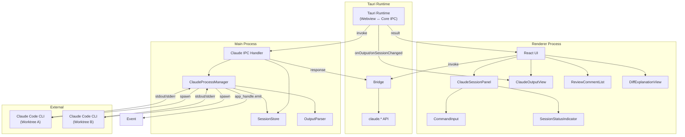

# Claude Code 連携

**関連 Spec:** [claude-code-integration_spec.md](./claude-code-integration_spec.md)
**関連 PRD:** [claude-code-integration.md](../requirement/claude-code-integration.md)

---

# 1. 実装ステータス

**ステータス:** 🟢 全 Phase 実装完了

## 1.1. 実装進捗

| モジュール/機能 | ステータス | 備考 |
|--------------|----------|------|
| ClaudeProcessManager | 🟢 | コマンドごとに claude -p を spawn する方式で実装。ワンショット generateText、認証管理（checkAuth/login）も提供 |
| SessionStore | 🟢 | インメモリセッション管理（max 1000 出力バッファ） |
| GenerateCommitMessageMainUseCase | 🟢 | ステージング差分テキスト → プロンプト構築 → Claude CLI 実行 |
| commit-message.ts (prompt) | 🟢 | コミットメッセージ生成用プロンプトビルダー。カスタムルール対応（AppSettings.commitMessageRules） |
| CheckAuthMainUseCase / LoginMainUseCase | 🟢 | `claude auth status` / `claude auth login` による認証管理 |
| OutputParser (ClaudeDefaultOutputParser) | 🟢 | CLI 出力の JSON 解析・構造化。フォールバック付き |
| IPC ハンドラー（claude:*） | 🟢 | 9 チャネル + 3 イベント登録済み |
| Tauri invoke/listen API（claude） | 🟢 | 型安全な  API 公開済み（10 メソッド + 3 イベント） |
| ClaudeSessionPanel | 🟢 | セッション操作 UI + 未認証時ログインボタン表示 |
| ClaudeOutputView | 🟢 | ストリーミング出力表示 UI（ANSI strip 付き） |
| コミットメッセージ生成ボタン | 🟢 | basic-git-operations の CommitForm に Sparkles アイコンボタンで統合 |
| Settings UI (commitMessageRules) | 🟢 | SettingsDialog に textarea でカスタムルール編集 |
| ReviewCommentList | 🟢 | レビューコメント一覧 UI。severity 別アイコン + suggestion 表示 |
| DiffExplanationView | 🟢 | 差分解説表示 UI。コピーボタン付き |
| ReviewDiffMainUseCase / ExplainDiffMainUseCase | 🟢 | レビュー/解説 UseCase + プロンプトビルダー |
| ClaudeReviewViewModel / ClaudeExplainViewModel | 🟢 | Webview 側 ViewModel + Hook ラッパー |

---

# 2. 設計目標

1. **ワークツリー単位のセッション分離** — 各ワークツリーに独立した Claude Code CLI 子プロセスを割り当て、コンテキストの混在を防ぐ（DC_502）
2. **CLI ベースの統合** — Claude API の直接呼び出しではなく、Claude Code CLI を子プロセスとして利用し、認証管理を CLI に委譲する（DC_501）
3. **リアルタイムストリーミング** — 子プロセスの stdout/stderr を IPC イベントでWebviewに逐次送信し、ユーザーに即座にフィードバックを提供する
4. **Tauri セキュリティ準拠** — 子プロセス管理はTauri Core (Rust)のみで行い、Webviewから tokio::process::Command を直接使用しない（DC_503、原則 A-001, T-003）
5. **Git 操作の安全性** — Git 操作委譲時は実行前確認を必須とし、不可逆操作を保護する（原則 B-002）

---

# 3. 技術スタック

> 以下はプロジェクト共通の技術スタックです。機能固有の追加技術のみ記載してください。

| 領域 | 採用技術 | 選定理由 |
|------|----------|----------|
| 子プロセス管理 | Node.js `tokio::process::Command`（spawn） | Electron Tauri Core (Rust)で利用可能な標準 API。ストリーミング I/O をサポート |
| ANSI パース | ansi-to-html または strip-ansi | Claude Code CLI の出力に含まれる ANSI カラーコードの処理（原則 A-002: Library-First） |
| マークダウン表示 | react-markdown | 解説・レビュー結果のマークダウンレンダリング（原則 A-002） |

<details>
<summary>プロジェクト共通スタック（参考）</summary>

| 領域              | 採用技術                                     |
|----------------|------------------------------------------|
| フレームワーク      | Tauri 2.x                                |
| バックエンド言語    | Rust (edition 2021+)                     |
| バンドラー          | Vite 6                                   |
| UI                | React 19 + TypeScript 5.x                |
| スタイリング        | Tailwind CSS v4 (`@tailwindcss/postcss`) |
| UIコンポーネント    | Shadcn/ui                                |
| Git 操作            | `tokio::process::Command` 経由の `git` CLI   |
| ファイル監視        | `notify` + `notify-debouncer-full` crate |
| 永続化              | `tauri-plugin-store`                     |
| ダイアログ          | `tauri-plugin-dialog`                    |
| エディタ            | Monaco Editor                            |
| Rust 非同期        | `tokio`                                  |
| Rust エラー        | `thiserror` + `AppError`                 |
| Rust テスト        | `cargo test` + `mockall`                 |
| DI (Webview)        | VContainer                               |
| DI (Rust)           | `tauri::State<T>` + `Arc<dyn Trait>`     |

</details>

---

# 4. アーキテクチャ

## 4.1. システム構成図



## 4.2. モジュール分割

| モジュール名 | プロセス | 責務 | 配置場所 |
|------------|---------|------|---------|
| ClaudeProcessManager | main (infrastructure) | Claude Code CLI 子プロセスの spawn/kill、stdin 書き込み、stdout/stderr 監視 | `src-tauri/src/features/claude-code-integration/infrastructure/claude-process-manager.ts` |
| SessionStore | main (application/services) | ワークツリー → セッション情報のマッピング管理（インメモリ） | `src-tauri/src/features/claude-code-integration/application/services/claude-session-store.ts` |
| OutputParser | main (infrastructure) | CLI の出力テキストを解析し、レビューコメントや解説テキストを構造化データに変換 | `src-tauri/src/features/claude-code-integration/infrastructure/claude-output-parser.ts` |

> **注記**: 実装では `ClaudeProcessManager` と `SessionStore` は `ClaudeSessionManager` (`session_manager.rs`) に統合され、`OutputParser` は `DefaultClaudeRepository` (`claude_repository.rs`) 内にインライン実装されている。
| Claude IPC Handler | main (presentation) | `claude:*` IPC チャネルの登録・ルーティング | `src-tauri/src/features/claude-code-integration/presentation/ipc-handlers.ts` |
| Claude 型定義 | domain | ClaudeSession, ClaudeCommand, ClaudeOutput 等の型定義 | `src/domain/index.ts`（既存ファイルに追加） |
| Preload Claude API | preload | 型安全な IPC で claude.* API を公開 | （preload 層は Tauri では不要）（既存ファイルに追加） |
| ClaudeSessionPanel | renderer (presentation) | セッション操作 UI（起動/停止/入力/状態） | `src/features/claude-code-integration/presentation/components/ClaudeSessionPanel.tsx` |
| ClaudeOutputView | renderer (presentation) | ストリーミング出力表示 | `src/features/claude-code-integration/presentation/components/ClaudeOutputView.tsx` |
| ReviewCommentList | renderer (presentation) | レビューコメント一覧 | `src/features/claude-code-integration/presentation/components/ReviewCommentList.tsx` |
| DiffExplanationView | renderer (presentation) | 差分解説マークダウン表示 | `src/features/claude-code-integration/presentation/components/DiffExplanationView.tsx` |
| SessionStatusIndicator | renderer (presentation) | セッション状態インジケーター | `src/features/claude-code-integration/presentation/components/SessionStatusIndicator.tsx` |
| CommandInput | renderer (presentation) | 自然言語入力フィールド | `src/features/claude-code-integration/presentation/components/CommandInput.tsx` |

---

# 5. データモデル

```typescript
// セッション管理（インメモリ、Tauri Core (Rust)側）
// SessionStore が管理する内部データ構造
interface InternalSession {
  worktreePath: string;
  status: SessionStatus;
  process: unknown | null; // Rust 側: tokio::process::Child を Arc<Mutex<Option<Child>>> で保持
  pid: number | null;
  startedAt: string | null;
  error: string | null;
  outputBuffer: ClaudeOutput[]; // 出力履歴バッファ（最大1000件）
}

// ワークツリーパスをキーとするセッションマップ
type SessionMap = Map<string, InternalSession>;

// コミットメッセージ生成リクエスト（IPC 引数）
interface GenerateCommitMessageArgs {
  worktreePath: string;
  diffText: string; // unified diff 形式のテキスト
}

// AppSettings 拡張（commitMessageRules）
// commitMessageRules: string | null — null はデフォルトルール使用
// > **注記**: `commitMessageRules` のプロンプトへの反映は未実装。Rust 側の `generate_commit_message` はハードコードされたプロンプトを使用している。
```

---

# 6. インターフェース定義

## 6.1. ClaudeProcessManager

```typescript
// src-tauri/src/services/claude-process-manager.ts
// Rust 側: tokio::process::Command で子プロセスを spawn
import type { ClaudeSession, ClaudeCommand, ClaudeOutput } from '../../types/claude';

export class ClaudeProcessManager {
  /**
   * 指定ワークツリーで Claude Code CLI セッションを起動する。
   * 既にセッションが存在する場合はエラーを返す。
   */
  startSession(worktreePath: string): Promise<ClaudeSession>;

  /**
   * 指定ワークツリーのセッションを終了する。
   * 子プロセスに SIGTERM を送り、タイムアウト後に SIGKILL する。
   */
  stopSession(worktreePath: string): Promise<void>;

  /**
   * Claude Code CLI の stdin にコマンドを書き込む。
   */
  sendCommand(command: ClaudeCommand): Promise<void>;

  /**
   * 指定ワークツリーのセッション情報を取得する。
   */
  getSession(worktreePath: string): ClaudeSession | null;

  /**
   * 全セッション情報を取得する。
   */
  getAllSessions(): ClaudeSession[];

  /**
   * 全セッションを終了する（アプリ終了時に呼び出す）。
   */
  stopAllSessions(): Promise<void>;

  /**
   * 出力イベントのリスナーを登録する。
   */
  onOutput(listener: (output: ClaudeOutput) => void): void;

  /**
   * セッション状態変更イベントのリスナーを登録する。
   */
  onSessionChanged(listener: (session: ClaudeSession) => void): void;
}
```

## 6.2. SessionStore

```typescript
// src-tauri/src/services/claude-session-store.ts
import type { ClaudeSession, ClaudeOutput } from '../../types/claude';

export class SessionStore {
  /**
   * セッションを登録する。
   */
  set(worktreePath: string, session: InternalSession): void;

  /**
   * セッションを取得する。
   */
  get(worktreePath: string): InternalSession | null;

  /**
   * セッションを削除する。
   */
  delete(worktreePath: string): void;

  /**
   * 全セッション情報を取得する。
   */
  getAll(): ClaudeSession[];

  /**
   * 指定セッションの出力履歴を取得する。
   */
  getOutputHistory(worktreePath: string): ClaudeOutput[];

  /**
   * 出力を履歴バッファに追加する。
   */
  appendOutput(worktreePath: string, output: ClaudeOutput): void;

  /**
   * セッションが存在するか確認する。
   */
  has(worktreePath: string): boolean;
}
```

## 6.3. OutputParser

```typescript
// src-tauri/src/services/claude-output-parser.ts
import type { ReviewComment } from '../../types/claude';

export class OutputParser {
  /**
   * CLI 出力テキストからレビューコメントを抽出する。
   * Claude Code の出力フォーマットに依存するため、パース失敗時は
   * 生テキストをそのまま返すフォールバックを持つ。
   */
  parseReviewComments(output: string): ReviewComment[];

  /**
   * CLI 出力テキストから解説テキストを抽出する。
   */
  parseExplanation(output: string): string;

  /**
   * ANSI エスケープコードを除去する。
   */
  stripAnsi(text: string): string;

  /**
   * ANSI エスケープコードを HTML に変換する。
   */
  ansiToHtml(text: string): string;
}
```

## 6.4. IPC ハンドラー（Tauri Core (Rust)側）

```typescript
// src-tauri/src/ipc/claude-handler.ts
// Tauri (@tauri-apps/api): #[tauri::command], Tauri Window;
import type { IPCResult } from '../../types/ipc';
import type { ClaudeSession, ClaudeCommand, ClaudeOutput, ReviewComment } from '../../types/claude';

export function registerClaudeIPCHandlers(
  processManager: ClaudeProcessManager,
  mainWindow: Tauri Window,
): void {
  // セッション管理
  #[tauri::command]('claude:start-session', async (_event, args: { worktreePath: string }): Promise<IPCResult<ClaudeSession>> => {
    try {
      const session = await processManager.startSession(args.worktreePath);
      return { success: true, data: session };
    } catch (e: unknown) {
      const message = e instanceof Error ? e.message : String(e);
      return { success: false, error: { code: 'SESSION_START_FAILED', message } };
    }
  });

  #[tauri::command]('claude:stop-session', async (_event, args: { worktreePath: string }): Promise<IPCResult<void>> => {
    try {
      await processManager.stopSession(args.worktreePath);
      return { success: true, data: undefined };
    } catch (e: unknown) {
      const message = e instanceof Error ? e.message : String(e);
      return { success: false, error: { code: 'SESSION_STOP_FAILED', message } };
    }
  });

  #[tauri::command]('claude:get-session', async (_event, args: { worktreePath: string }): Promise<IPCResult<ClaudeSession | null>> => {
    const session = processManager.getSession(args.worktreePath);
    return { success: true, data: session };
  });

  #[tauri::command]('claude:get-all-sessions', async (): Promise<IPCResult<ClaudeSession[]>> => {
    return { success: true, data: processManager.getAllSessions() };
  });

  // コマンド実行
  #[tauri::command]('claude:send-command', async (_event, command: ClaudeCommand): Promise<IPCResult<void>> => {
    try {
      await processManager.sendCommand(command);
      return { success: true, data: undefined };
    } catch (e: unknown) {
      const message = e instanceof Error ? e.message : String(e);
      return { success: false, error: { code: 'COMMAND_SEND_FAILED', message } };
    }
  });

  // 出力取得
  #[tauri::command]('claude:get-output', async (_event, args: { worktreePath: string }): Promise<IPCResult<ClaudeOutput[]>> => {
    const session = processManager.getSession(args.worktreePath);
    if (!session) {
      return { success: false, error: { code: 'SESSION_NOT_FOUND', message: 'セッションが見つかりません' } };
    }
    // SessionStore から出力履歴を取得
    return { success: true, data: [] }; // 実装時に SessionStore から取得
  });

  // レビュー・解説（非同期、結果はイベントで通知）
  #[tauri::command]('claude:review-diff', async (_event, args): Promise<IPCResult<void>> => {
    try {
      // 差分取得 → プロンプト構築 → sendCommand
      // 結果は claude:review-result イベントで非同期通知
      return { success: true, data: undefined };
    } catch (e: unknown) {
      const message = e instanceof Error ? e.message : String(e);
      return { success: false, error: { code: 'REVIEW_FAILED', message } };
    }
  });

  #[tauri::command]('claude:explain-diff', async (_event, args): Promise<IPCResult<void>> => {
    try {
      // 差分取得 → プロンプト構築 → sendCommand
      // 結果は claude:explain-result イベントで非同期通知
      return { success: true, data: undefined };
    } catch (e: unknown) {
      const message = e instanceof Error ? e.message : String(e);
      return { success: false, error: { code: 'EXPLAIN_FAILED', message } };
    }
  });

  // コミットメッセージ生成（ワンショット）
  #[tauri::command]('claude:generate-commit-message', async (_event, args: GenerateCommitMessageArgs): Promise<IPCResult<string>> => {
    try {
      const result = await generateCommitMessageUseCase.invoke(args);
      return { success: true, data: result };
    } catch (e: unknown) {
      const message = e instanceof Error ? e.message : String(e);
      return { success: false, error: { code: 'GENERATE_COMMIT_MESSAGE_FAILED', message } };
    }
  });

  // ストリーミング出力のイベント転送
  processManager.onOutput((output: ClaudeOutput) => {
    mainWindow.app_handle.emit('claude-output', output);
  });

  processManager.onSessionChanged((session: ClaudeSession) => {
    mainWindow.app_handle.emit('claude:session-changed', session);
  });
}
```

## 6.5. Tauri invoke/listen API

```typescript
// src/(削除: Tauri では preload 不要) に追加
// claude 名前空間
claude: {
  startSession: (args: { worktreePath: string }): Promise<IPCResult<ClaudeSession>> =>
    invoke<T>('claude_start_session', args),
  stopSession: (args: { worktreePath: string }): Promise<IPCResult<void>> =>
    invoke<T>('claude_stop_session', args),
  getSession: (args: { worktreePath: string }): Promise<IPCResult<ClaudeSession | null>> =>
    invoke<T>('claude_get_session', args),
  getAllSessions: (): Promise<IPCResult<ClaudeSession[]>> =>
    invoke<T>('claude_get_all_sessions'),
  sendCommand: (command: ClaudeCommand): Promise<IPCResult<void>> =>
    invoke<T>('claude_send_command', command),
  getOutput: (args: { worktreePath: string }): Promise<IPCResult<ClaudeOutput[]>> =>
    invoke<T>('claude_get_output', args),
  generateCommitMessage: (args: GenerateCommitMessageArgs): Promise<IPCResult<string>> =>
    invoke<T>('claude_generate_commit_message', args),
  checkAuth: (): Promise<IPCResult<ClaudeAuthStatus>> =>
    invoke<T>('claude_check_auth'),
  login: (): Promise<IPCResult<void>> =>
    invoke<T>('claude_login'),
  reviewDiff: (args: { worktreePath: string; diffTarget: DiffTarget }): Promise<IPCResult<void>> =>
    invoke<T>('claude_review_diff', args),
  explainDiff: (args: { worktreePath: string; diffTarget: DiffTarget }): Promise<IPCResult<void>> =>
    invoke<T>('claude_explain_diff', args),

  // イベント購読（listenEventSync / listenEvent ラッパー経由）
  onOutput: (callback: (output: ClaudeOutput) => void): (() => void) => {
    return listenEventSync<ClaudeOutput>('claude-output', callback)
  },
  onSessionChanged: (callback: (session: ClaudeSession) => void): (() => void) => {
    return listenEventSync<ClaudeSession>('claude-session-changed', callback)
  },
  onCommandCompleted: (callback: (data: { worktreePath: string }) => void): (() => void) => {
    return listenEventSync<{ worktreePath: string }>('claude-command-completed', callback)
  },
  onReviewResult: (callback: (result: { worktreePath: string; comments: ReviewComment[]; summary: string }) => void): (() => void) => {
    return listenEventSync<{ worktreePath: string; comments: ReviewComment[]; summary: string }>('claude-review-result', callback)
  },
  onExplainResult: (callback: (result: { worktreePath: string; explanation: string }) => void): (() => void) => {
    return listenEventSync<{ worktreePath: string; explanation: string }>('claude-explain-result', callback)
  },
},
```

## 6.6. Webview 側の型定義

```typescript
// Tauri 移行後は不要。invokeCommand / listenEvent ラッパーを使用
// 各コマンドの型は src/shared/lib/ipc.ts の IPCChannelMap で定義
// イベントの型は src/shared/lib/ipc.ts の IPCEventMap で定義
```

---

# 7. 非機能要件実現方針

| 要件 | 実現方針 |
|------|----------|
| セッション起動30秒以内 (NFR-001, NFR_501) | spawn は非同期。起動中は `starting` 状態を即座に UI 反映し、プロセス起動完了後に `running` に遷移。30秒のタイムアウトで `error` に遷移 |
| ストリーミング遅延100ms以内 (NFR-002) | stdout/stderr の `data` イベントを即座に IPC イベントとして送信。バッファリングは最小限（16KB チャンク） |
| 自動再接続3回 (NFR-003) | ClaudeProcessManager が `exit` イベントで異常終了を検知し、指数バックオフ（1s, 2s, 4s）で再起動を試行 |
| プロセスサンドボックス (NFR-004) | spawn の `cwd` オプションでワークツリーパスを設定。環境変数は必要最小限のみ継承 |

---

# 8. テスト戦略

| テストレベル | 対象 | カバレッジ目標 |
|------------|------|------------|
| ユニットテスト | ClaudeProcessManager（モック tokio::process::Command） | >= 80% |
| ユニットテスト | SessionStore（インメモリ状態管理） | >= 80% |
| ユニットテスト | OutputParser（レビューコメント/解説パース） | >= 80% |
| ユニットテスト | Claude IPC Handler（モック ProcessManager） | >= 80% |
| 結合テスト | Tauri Core (Rust) ↔ Preload ↔ Webview間の IPC 連携 | 主要フロー |
| E2Eテスト | セッション起動/停止、コマンド送信、出力表示 | 主要ユースケース |
| コンポーネントテスト | ClaudeSessionPanel, ClaudeOutputView, ReviewCommentList | >= 60% |

---

# 9. 設計判断

## 9.1. 決定事項

| 決定事項 | 選択肢 | 決定内容 | 理由 |
|----------|--------|----------|------|
| Claude Code との通信方式 | A) Claude API 直接呼び出し / B) Claude Code CLI 子プロセス | B) CLI 子プロセス | DC_501 の制約。認証管理を CLI に委譲でき、CLI のバージョンアップに追従しやすい。ユーザーが既にインストール・認証済みの CLI をそのまま利用 |
| セッション管理の永続化 | A) tauri-plugin-store で永続化 / B) インメモリのみ | B) インメモリのみ | セッション（子プロセス）はアプリ終了時に消滅するため永続化不要。アプリ起動時はクリーンな状態から開始 |
| 出力のバッファリング | A) 全出力を保持 / B) 最大件数で制限 | B) 最大1000件で制限 | メモリ使用量の制御。長時間のセッションで出力が蓄積しすぎることを防ぐ |
| レビュー結果の取得方式 | A) リクエスト/レスポンス（同期的） / B) リクエスト→イベント通知（非同期的） | B) イベント通知 | CLI の出力はストリーミングであり、完了タイミングが不定。IPC invoke は即座に応答を返し、結果は別イベントで通知 |
| 子プロセスの終了方式 | A) SIGKILL 即座 / B) SIGTERM → タイムアウト → SIGKILL | B) SIGTERM + タイムアウト | グレースフルシャットダウン。Claude Code CLI にクリーンアップの機会を与える。タイムアウトは5秒 |
| ストリーミング出力の転送 | A) invoke のポーリング / B) Tauri event（`app_handle.emit`） / C) MessagePort | B) Tauri event | リアルタイム性が求められる。ポーリングは遅延が大きい。MessagePort は複雑すぎる。Tauri の `app_handle.emit` + Webview 側 `listen` が最もシンプル |
| ANSI カラーコード処理 | A) Tauri Core (Rust)で変換 / B) Webviewで変換 / C) 除去のみ | B) Webviewで変換 | Tauri Core (Rust)の負荷軽減。Webview 側で HTML に変換して表示 |

## 9.2. 未解決の課題

| 課題 | 影響度 | 対応方針 |
|------|--------|----------|
| Claude Code CLI の出力フォーマット仕様 | 高 | CLI の出力は非構造化テキスト。OutputParser のパースロジックは CLI バージョンに依存する可能性がある。初期実装では正規表現ベースのパースとし、パース失敗時は生テキストをフォールバック表示 |
| Claude Code CLI のインタラクティブモード対応 | 中 | CLI が確認プロンプト（y/n）を出す場合の stdin 制御。初期実装では `--yes` フラグ等の非対話オプションを調査し、対話が必要な場合はWebviewに確認を委譲 |
| 大量出力時のWebviewパフォーマンス | 中 | 仮想スクロール（react-window 等）の導入を検討。初期実装では出力件数制限（1000件）で対応 |
| Claude Code CLI のバージョン互換性 | 中 | 起動時に `claude --version` でバージョンチェックを行い、非互換バージョンの場合は警告を表示 |

---

# 10. セキュリティ考慮事項

## 10.1. プロセスサンドボックス

- 子プロセスの `cwd` をワークツリーパスに限定する
- 環境変数は `PATH`、`HOME`、`CLAUDE_*`（CLI 認証情報）のみ継承する
- 子プロセスに shell オプションを `false` に設定し、シェルインジェクションを防ぐ

## 10.2. 入力バリデーション

- `worktreePath` が実在するディレクトリであることを検証する
- `worktreePath` がパストラバーサル攻撃を含まないことを検証する
- `ClaudeCommand.input` の最大長を制限する（例: 10,000文字）
- IPC チャネルの引数型をランタイムでも検証する

## 10.3. 出力の安全性

- CLI からの出力をWebviewに送信する際、XSS 攻撃を防ぐために HTML エスケープを行う
- ANSI → HTML 変換は信頼できるライブラリを使用する

---

# 11. 変更履歴

## v4.0 (2026-04-09)

**Tauri 2 + Rust 移行（Electron からの全面刷新、破壊的変更）**

- 実装ステータスを `implemented` → `not-implemented` にリセット（旧 Electron 実装は凍結）
- 技術スタック表を Tauri 2 + Rust + Vite 6 + tokio + git CLI shell out + notify + tauri-plugin-store + tauri-plugin-dialog + thiserror 版に全面刷新
- システム構成図を Webview (React) / Tauri Core (Rust) の 2 境界分割に更新
- モジュール分割表を `src/features/{feature-name}/` (TypeScript) + `src-tauri/src/features/{feature_name}/` (Rust) の 2 部構成に
- IPC Handler コード例を `ipcMain.handle` から Rust `#[tauri::command]` に置換
- Preload API ブロックを削除（Tauri では preload 不要）
- IPC チャネル名を snake_case (command) / kebab-case (event) に変換
- DI 記述を Webview (VContainer) と Rust (`tauri::State<T>` + `Arc<dyn Trait>`) の 2 部構成に
- `simple-git` → `tokio::process::Command` 経由の `git` CLI shell out 方式に変更
- `chokidar` → `notify` + `notify-debouncer-full` crate に置換
- `electron-store` → `tauri-plugin-store` に置換
- `child_process.spawn` → `tokio::process::Command` に置換
- DC_001 を「Tauri セキュリティ制約」（CSP + capabilities + 入力バリデーション）に書き換え

**移行ガイド:**

```typescript
// ❌ 旧コード (Electron)
const result = await window.electronAPI.repository.open()
if (result.success) { /* ... */ }

// ✅ 新コード (Tauri)
import { invokeCommand } from '@/shared/lib/invoke'
const result = await invokeCommand<RepositoryInfo | null>('repository_open')
if (result.success) { /* ... */ }
```

```rust
// ✅ Rust 側 (新規)
#[tauri::command]
pub async fn repository_open(
    state: State<'_, AppState>,
) -> AppResult<Option<RepositoryInfo>> {
    state.open_repository_dialog_usecase.invoke().await
}
```

---

## v1.1 (2026-04-05)

**変更内容:**

- PRD レビュー指摘反映: DC_503（Webviewからの tokio::process::Command 直接使用禁止）を設計目標に追加
- NFR_501（セッション起動30秒以内）を NFR 実現方針に反映
- モジュール配置パスを Clean Architecture 4層 + feature ディレクトリ構成に修正
- status を approved に変更

## v1.0 (2026-03-25)

**変更内容:**

- 初版作成
- ClaudeProcessManager、SessionStore、OutputParser の設計を定義
- IPC ハンドラー、Tauri invoke/listen API、Webview型定義を定義
- セキュリティ考慮事項を記載
