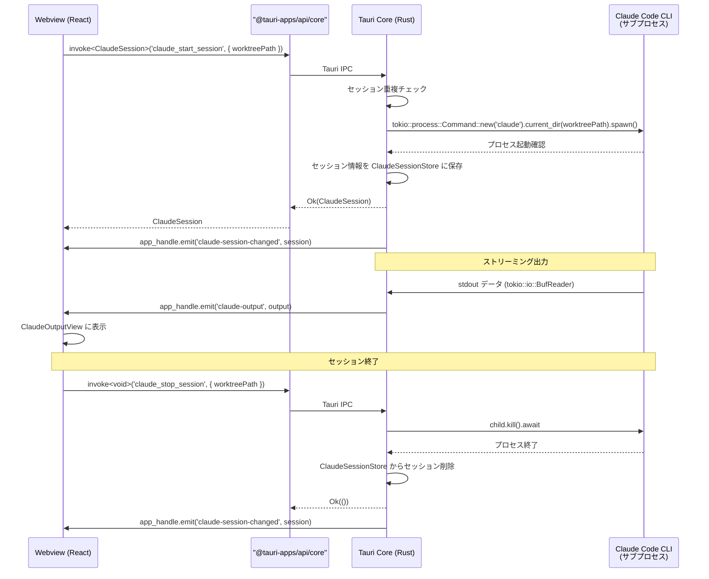
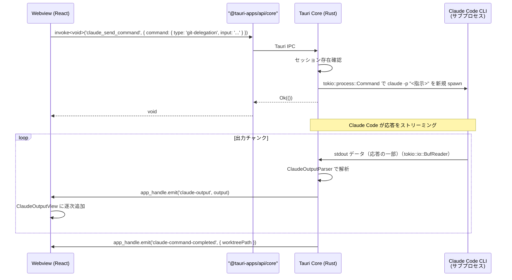
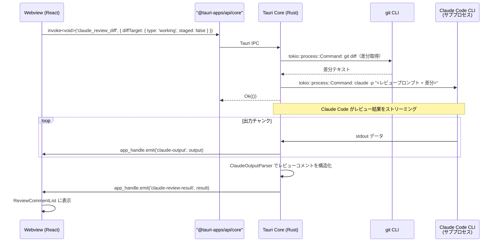
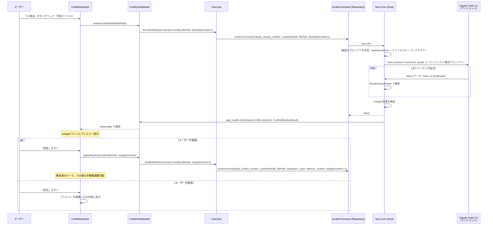
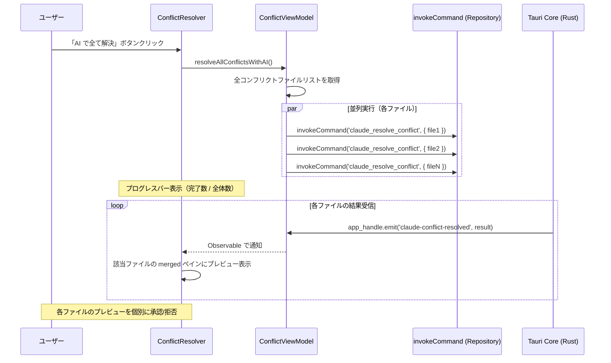

# Claude Code 連携

**関連 Design Doc:** [claude-code-integration_design.md](./claude-code-integration_design.md)
**関連 PRD:** [claude-code-integration.md](../requirement/claude-code-integration.md)

---

# 1. 背景

Buruma は Git ワークツリーの並行管理を主軸とする GUI アプリケーションである。開発者はワークツリーごとに異なるブランチで作業を行うが、Git 操作の実行やコード変更の理解には一定のコンテキスト理解が求められる。

Claude Code CLI は Anthropic が提供する AI コーディングアシスタントであり、自然言語による Git 操作委譲、コードレビュー、差分解説などの機能を CLI インターフェースで提供する。本仕様は、Claude Code CLI をサブプロセスとして Buruma に統合し、ワークツリーごとに独立した AI 支援セッションを提供するための論理設計を定義する。

本仕様は PRD [claude-code-integration.md](../requirement/claude-code-integration.md) の要求（UR_501〜UR_504, FR_501〜FR_505, DC_501〜DC_503, NFR_501）を実現する。

# 2. 概要

Claude Code 連携は以下の5つのサブシステムで構成される：

1. **セッション管理** — ワークツリーごとに独立した Claude Code CLI セッションの起動・管理・終了（FR_501）
   セッションは2つの実行モードを持つ:
   - **ライブセッション**: `claude_start_session` で起動し、セッション ID（PID）を保持する長期プロセス
   - **ワンショット実行**: `claude_send_command` / `claude_review_diff` / `claude_explain_diff` / `claude_generate_commit_message` は `claude -p` オプションで都度新規プロセスを spawn し、応答後に終了する
2. **Git 操作委譲** — 自然言語指示による Git 操作の Claude Code への委譲と実行前確認（FR_502）
3. **コードレビュー** — 差分を Claude Code に送信し、レビューコメントを取得・表示（FR_503）
4. **差分解説** — コミット/ブランチ間の差分内容を Claude Code に解説させる（FR_504）
5. **セッション出力表示** — Claude Code の出力をリアルタイムでストリーミング表示（FR_505）
6. **AI コンフリクト解決** — マージ・リベース時のコンフリクトを Claude Code に解決させ、結果をプレビュー・適用（FR_506）

すべてのサブシステムは Tauri のアーキテクチャ（Webview / Tauri Core）に準拠し、Claude Code CLI は Tauri Core (Rust) から `tokio::process::Command` 経由でサブプロセスとして実行される（DC_501）。Webview から直接 OS のプロセス実行 API を使用してはならない（DC_503）。各ワークツリーのセッションは独立しており、コンテキストを共有しない（DC_502）。

# 3. 要求定義

## 3.1. 機能要件 (Functional Requirements)

| ID | 要件 | 優先度 | 根拠 (PRD) |
|--------|------|------|------|
| FR-001 | ワークツリー選択時に Claude Code セッションを起動する | 必須 | FR_501_01 |
| FR-002 | セッションを明示的に終了できる | 必須 | FR_501_02 |
| FR-003 | ワークツリー切り替え時にセッションを自動切り替えする | 必須 | FR_501_03 |
| FR-004 | セッション状態（接続中/切断/エラー）をUIインジケーターで表示する | 必須 | FR_501_04 |
| FR-005 | エラー時にセッションを自動再接続する | 推奨 | FR_501_05 |
| FR-006 | 自然言語入力フィールドを提供する | 必須 | FR_502_01 |
| FR-007 | 自然言語指示を Claude Code に送信する | 必須 | FR_502_02 |
| FR-008 | 実行予定の Git コマンドを表示し確認ダイアログを提供する | 必須 | FR_502_03 |
| FR-009 | Git 操作の実行結果を表示する | 必須 | FR_502_04 |
| FR-010 | 操作結果をステータス・ログに自動反映する | 推奨 | FR_502_05 |
| FR-011 | 現在の差分（staged/unstaged）を Claude Code に送信してレビューを取得する | 推奨 | FR_503_01 |
| FR-012 | 特定コミット間の差分を Claude Code に送信してレビューを取得する | 推奨 | FR_503_02 |
| FR-013 | レビューコメントを取得・表示する | 推奨 | FR_503_03 |
| FR-014 | レビューコメントを差分上にインライン表示する | 任意 | FR_503_04 |
| FR-015 | レビュー結果のサマリーを表示する | 任意 | FR_503_05 |
| FR-016 | コミット選択による差分解説をリクエストする | 任意 | FR_504_01 |
| FR-017 | ブランチ間差分の解説をリクエストする | 任意 | FR_504_02 |
| FR-018 | 解説結果をマークダウン形式で表示する | 任意 | FR_504_03 |
| FR-019 | 解説のコピー・エクスポート機能を提供する | 任意 | FR_504_04 |
| FR-020 | stdout/stderr のリアルタイムストリーミング表示を行う | 必須 | FR_505_01 |
| FR-021 | ANSI カラーコードを解釈・レンダリングする | 推奨 | FR_505_02 |
| FR-022 | 出力のスクロール制御（自動スクロール ON/OFF）を提供する | 推奨 | FR_505_03 |
| FR-023 | 出力テキストの検索機能を提供する | 推奨 | FR_505_04 |
| FR-024 | コンフリクトファイルの内容（base/ours/theirs）を Claude Code にワンショット送信し、merged 結果を取得する | 推奨 | FR_506 (FR_506_01) |
| FR-025 | AI が生成した merged 結果を ThreeWayMergeView の merged ペインにプレビュー表示する | 推奨 | FR_506 (FR_506_02) |
| FR-026 | プレビュー表示された解決案を承認（適用 + 解決済みマーク）または拒否（元の状態に戻す）できる | 推奨 | FR_506 (FR_506_03) |
| FR-027 | 全コンフリクトファイルを並列で AI に送信し一括解決する「AI で全て解決」ボタンをコンフリクトファイル一覧ヘッダーに提供する。プログレスバーで進捗を表示する。一部ファイルの解決が失敗した場合、他ファイルの処理は継続し、失敗ファイルはエラー状態として個別に表示する | 推奨 | FR_506 (FR_506_04) |
| FR-028 | 各コンフリクトファイル行に「AI 解決」ボタンを提供し、個別ファイル単位で AI 解決を実行できる | 推奨 | FR_506 (FR_506_04) |
| FR-029 | AI 解決案の承認後も ThreeWayMergeView のエディタで手動微調整が可能である | 推奨 | FR_506 (FR_506_05) |

## 3.2. 非機能要件 (Non-Functional Requirements)

| ID | カテゴリ | 要件 | 目標値 |
|---------|------|------|------|
| NFR-001 | 性能 | セッション起動からUI反映までの時間 | 30秒以内 |
| NFR-002 | 性能 | ストリーミング出力のレンダリング遅延 | 100ms以内 |
| NFR-003 | 安定性 | セッション異常終了時の自動再接続 | 3回までリトライ |
| NFR-004 | セキュリティ | サブプロセスの実行範囲制限 | ワークツリーの CWD に限定、実行ファイルは `claude` のみ allowlist |

# 4. API

## 4.1. IPC API（Tauri Core ↔ Webview）

### 4.1.1. セッション管理（Commands, Webview → Core `invoke`）

| Command 名 | 概要 | 引数 | 戻り値 |
|-----------|------|------|--------|
| `claude_start_session` | 指定ワークツリーで Claude Code セッションを起動する | `{ worktreePath: string }` | `ClaudeSession` |
| `claude_stop_session` | 指定ワークツリーのセッションを終了する | `{ worktreePath: string }` | `void` |
| `claude_get_session` | 指定ワークツリーのセッション情報を取得する | `{ worktreePath: string }` | `ClaudeSession \| null` |
| `claude_get_all_sessions` | 全セッション情報を取得する | なし | `ClaudeSession[]` |

### 4.1.2. コマンド実行（Commands, Webview → Core `invoke`）

| Command 名 | 概要 | 引数 | 戻り値 |
|-----------|------|------|--------|
| `claude_send_command` | Claude Code にコマンド（自然言語指示）を送信する | `ClaudeCommand` | `void` |

### 4.1.3. 出力取得（Commands, Webview → Core `invoke`）

| Command 名 | 概要 | 引数 | 戻り値 |
|-----------|------|------|--------|
| `claude_get_output` | 指定セッションの出力履歴を取得する | `{ worktreePath: string }` | `ClaudeOutput[]` |

### 4.1.4. 認証管理（Commands, Webview → Core `invoke`）

| Command 名 | 概要 | 引数 | 戻り値 |
|-----------|------|------|--------|
| `claude_check_auth` | Claude Code CLI の認証状態を確認する | なし | `ClaudeAuthStatus` |
| `claude_login` | ブラウザ OAuth でログインする（プロセス完了まで待機） | なし | `void` |
| `claude_logout` | ログアウトする | なし | `void` |

### 4.1.5. コミットメッセージ生成（Commands, Webview → Core `invoke`）

| Command 名 | 概要 | 引数 | 戻り値 |
|-----------|------|------|--------|
| `claude_generate_commit_message` | ステージング差分テキストからコミットメッセージを生成する（ワンショット） | `GenerateCommitMessageArgs` | `string` |

### 4.1.6. レビュー・解説（Commands, Webview → Core `invoke`）

| Command 名 | 概要 | 引数 | 戻り値 |
|-----------|------|------|--------|
| `claude_review_diff` | 差分を Claude Code に送信しレビューを取得する | `{ worktreePath: string; diffTarget: DiffTarget }` | `void` |
| `claude_explain_diff` | 差分を Claude Code に送信し解説を取得する | `{ worktreePath: string; diffTarget: DiffTarget }` | `void` |

### 4.1.7. AI コンフリクト解決（Commands, Webview → Core `invoke`）

| Command 名 | 概要 | 引数 | 戻り値 |
|-----------|------|------|--------|
| `claude_resolve_conflict` | 単一コンフリクトファイルを AI で解決する（ワンショット実行） | `ConflictResolveRequest` | `void` |

### 4.1.8. イベント通知（Events, Core → Webview `emit` / `listen`）

| Event 名 | 概要 | ペイロード |
|---------|------|-----------|
| `claude-session-changed` | セッション状態が変化した | `ClaudeSession` |
| `claude-output` | Claude Code から出力が発生した | `ClaudeOutput` |
| `claude-command-completed` | コマンド実行が完了した | `{ worktreePath: string }` |
| `claude-review-result` | レビュー結果が返された | `{ worktreePath: string; comments: ReviewComment[]; summary: string }` |
| `claude-explain-result` | 解説結果が返された | `{ worktreePath: string; explanation: string }` |
| `claude-conflict-resolved` | AI コンフリクト解決結果が返された | `ConflictResolveResult` |

> **IPCResult<T> 互換**: Webview 側は `src/lib/invoke/commands.ts` の `invokeCommand<T>` ラッパーを経由して呼び出す。イベント購読は `src/lib/invoke/events.ts` の `listenEvent<T>` を使用する。

## 4.2. React コンポーネント API

| コンポーネント | Props | 概要 |
|--------------|-------|------|
| `ClaudeSessionPanel` | `{ worktreePath: string }` | Claude Code セッションの操作パネル（起動/停止/状態表示/入力フィールド） |
| `ClaudeOutputView` | `{ worktreePath: string; autoScroll?: boolean }` | Claude Code のストリーミング出力をリアルタイム表示するビュー |
| `ReviewCommentList` | `{ comments: ReviewComment[]; onCommentClick?: (comment: ReviewComment) => void }` | レビューコメントの一覧表示コンポーネント |
| `DiffExplanationView` | `{ explanation: string }` | 差分解説のマークダウンレンダリングビュー |
| `SessionStatusIndicator` | `{ status: SessionStatus }` | セッション状態インジケーター（接続中/切断/エラー） |
| `CommandInput` | `{ onSubmit: (command: string) => void; disabled?: boolean }` | 自然言語入力フィールド |

## 4.3. 型定義

```typescript
// セッション状態
type SessionStatus = 'idle' | 'starting' | 'running' | 'stopping' | 'error';

// Claude Code セッション
interface ClaudeSession {
  worktreePath: string;
  status: SessionStatus;
  pid: number | null;       // 子プロセスの PID
  startedAt: string | null; // ISO 8601
  error: string | null;     // エラーメッセージ（status が 'error' の場合）
}

// Claude Code コマンド
interface ClaudeCommand {
  worktreePath: string;
  type: ClaudeCommandType;
  input: string;            // 自然言語指示またはプロンプト
}

type ClaudeCommandType = 'general' | 'git-delegation' | 'review' | 'explain';

// Claude Code 出力
interface ClaudeOutput {
  worktreePath: string;
  stream: 'stdout' | 'stderr';
  content: string;
  timestamp: string;        // ISO 8601
}

// 認証ステータス
interface ClaudeAuthStatus {
  authenticated: boolean;
  accountEmail?: string;
}

// コミットメッセージ生成リクエスト
interface GenerateCommitMessageArgs {
  worktreePath: string;
  diffText: string;           // unified diff 形式のテキスト（Webview 側で FileDiff[] から変換済み）
}

// AppSettings 拡張（コミットメッセージルールのカスタマイズ）
// AppSettings.commitMessageRules: string | null — null はデフォルトルール使用

// 差分ターゲット
type DiffTarget =
  | { type: 'working'; staged: boolean }       // 現在の差分
  | { type: 'commits'; from: string; to: string } // コミット間差分
  | { type: 'branches'; from: string; to: string }; // ブランチ間差分

// レビューコメント
interface ReviewComment {
  id: string;
  filePath: string;
  lineStart: number;
  lineEnd: number;
  severity: ReviewSeverity;
  message: string;
  suggestion?: string;      // 修正提案コード
}

type ReviewSeverity = 'info' | 'warning' | 'error';

// AI コンフリクト解決リクエスト
interface ConflictResolveRequest {
  worktreePath: string;          // ワークツリーパス
  filePath: string;              // コンフリクトファイルのパス
  threeWayContent: ThreeWayContent; // base/ours/theirs の内容（advanced-git-operations の既存型を再利用）
}

// AI コンフリクト解決結果（discriminated union）
type ConflictResolveResult =
  | {
      worktreePath: string;
      filePath: string;
      status: 'resolved';
      mergedContent: string;     // AI が生成したマージ結果（必須）
    }
  | {
      worktreePath: string;
      filePath: string;
      status: 'failed';
      error: string;             // エラーメッセージ（必須）
    };

// ThreeWayContent は src/domain/ に配置する共有型（feature 間直接参照回避のため domain 層に配置）
// advanced-git-operations と claude-code-integration の両方から参照する
// interface ThreeWayContent {
//   base: string;    // 共通祖先
//   ours: string;    // 自分の変更
//   theirs: string;  // 相手の変更
//   merged: string;  // 現在のマージ結果
// }

// IPC 通信の統一レスポンス型（application-foundation_spec から再利用）
type IPCResult<T> =
  | { success: true; data: T }
  | { success: false; error: IPCError };

interface IPCError {
  code: string;
  message: string;
  detail?: string;
}
```

# 5. 用語集

| 用語 | 説明 |
|------|------|
| Claude Code | Anthropic が提供する CLI ベースの AI コーディングアシスタント |
| セッション | Claude Code CLI の1つの子プロセスインスタンス。ワークツリーに1対1で紐づく |
| Git 操作委譲 | ユーザーの自然言語指示を Claude Code が解釈し、適切な Git コマンドを実行すること |
| ストリーミング表示 | サブプロセスの stdout/stderr 出力を Tauri イベントでリアルタイムに Webview へ逐次送信・表示すること |
| CWD | Current Working Directory。子プロセスの作業ディレクトリ。ワークツリーのパスを設定する |
| DiffTarget | レビューまたは解説対象の差分を指定する型。作業ツリー差分、コミット間、ブランチ間を区別する |
| ThreeWayContent | コンフリクトの3者内容（base/ours/theirs/merged）。`advanced-git-operations` で定義された既存型 |
| AI コンフリクト解決 | コンフリクトファイルの base/ours/theirs を Claude Code に送信し、AI が生成した merged 結果を適用する機能 |

# 6. 使用例

```typescript
import { invokeCommand, listenEvent } from '@/shared/lib/invoke'
import type { ClaudeSession, ClaudeOutput } from '@/shared/domain'

// Webview 側：セッション起動
const session = await invokeCommand<ClaudeSession>('claude_start_session', {
  worktreePath: '/path/to/worktree',
})

// Webview 側：自然言語で Git 操作を委譲
await invokeCommand<void>('claude_send_command', {
  command: {
    worktreePath: '/path/to/worktree',
    type: 'git-delegation',
    input: 'main ブランチにマージして',
  },
})

// Webview 側：ストリーミング出力の購読
const unlistenOutput = await listenEvent<ClaudeOutput>('claude-output', (output) => {
  appendToTerminal(output.content)
})

// Webview 側：コードレビューをリクエスト
await invokeCommand<void>('claude_review_diff', {
  worktreePath: '/path/to/worktree',
  diffTarget: { type: 'working', staged: false },
})

// Webview 側：レビュー結果の購読
const unlistenReview = await listenEvent<{ worktreePath: string; comments: ReviewComment[]; summary: string }>(
  'claude-review-result',
  (result) => {
    displayReviewComments(result.comments)
    displaySummary(result.summary)
  },
)

// Webview 側：差分解説をリクエスト
await invokeCommand<void>('claude_explain_diff', {
  worktreePath: '/path/to/worktree',
  diffTarget: { type: 'commits', from: 'abc123', to: 'def456' },
})

// React コンポーネントの使用例
<ClaudeSessionPanel worktreePath={selectedWorktree.path} />
<ClaudeOutputView worktreePath={selectedWorktree.path} autoScroll={true} />
<ReviewCommentList comments={reviewComments} onCommentClick={handleCommentClick} />
```

# 7. 振る舞い図

## 7.1. セッションライフサイクル



## 7.2. コマンド実行フロー（Git 操作委譲）



## 7.3. コードレビューフロー



## 7.4. AI コンフリクト解決フロー（単一ファイル）



## 7.5. AI コンフリクト一括解決フロー



# 8. 制約事項

- Claude Code CLI は Tauri Core (Rust) のサブプロセスとしてのみ実行する（DC_501、原則 A-001）
- Webview から OS のプロセス実行 API に直接アクセスしない（DC_503、原則 A-001、T-003）
- 各ワークツリーのセッションは独立し、コンテキストを共有しない（DC_502）
- サブプロセスの CWD はワークツリーのパスに設定する（DC_502）
- Claude Code CLI がユーザー環境にインストール・認証済みであることが前提
- IPC 通信は `IPCResult<T>` 互換ラッパー（`invokeCommand<T>`）で統一する（[application-foundation_spec.md](./application-foundation_spec.md) の FR-011〜FR-013）
- ストリーミング出力は `app_handle.emit` / `listen` による Tauri イベント通知パターンで送信する（FR-013）
- Git 操作委譲時は実行前確認を必須とする（原則 B-002: Git 操作の安全性）
- AI コンフリクト解決はワンショット実行（`claude -p`）で行い、ライブセッションは使用しない
- AI コンフリクト解決の UI ボタンは `advanced-git-operations` の ConflictResolver コンポーネントに追加する（[advanced-git-operations_spec.md](./advanced-git-operations_spec.md) FR_405_08 参照）
- AI 解決案は必ずプレビュー表示し、ユーザーの承認を経てから適用する（原則 B-002: Git 操作の安全性）
- コンフリクト情報（ThreeWayContent）は `advanced-git-operations` の既存 `git_conflict_file_content` IPC で取得した結果を使用する

---

# PRD 整合性確認

| PRD 要求 ID | 本仕様での対応 | ステータス |
|-------------|--------------|----------|
| UR_501 | 仕様全体（Claude Code 連携の5サブシステム） | 対応済み |
| UR_502 | FR-001〜FR-005 + `claude_start_session` / `claude_stop_session` API | 対応済み |
| UR_503 | FR-006〜FR-010 + `claude_send_command` API | 対応済み |
| UR_504 | FR-011〜FR-019 + `claude_review_diff` / `claude_explain_diff` API | 対応済み |
| FR_501 | FR-001〜FR-005 + セッションライフサイクル図 | 対応済み |
| FR_501_01 | FR-001 | 対応済み |
| FR_501_02 | FR-002 | 対応済み |
| FR_501_03 | FR-003 | 対応済み |
| FR_501_04 | FR-004 + SessionStatusIndicator | 対応済み |
| FR_501_05 | FR-005 + NFR-003 | 対応済み |
| FR_502 | FR-006〜FR-010 + コマンド実行フロー図 | 対応済み |
| FR_502_01 | FR-006 + CommandInput コンポーネント | 対応済み |
| FR_502_02 | FR-007 + `claude_send_command` API | 対応済み |
| FR_502_03 | FR-008 | 対応済み |
| FR_502_04 | FR-009 | 対応済み |
| FR_502_05 | FR-010 | 対応済み |
| FR_503 | FR-011〜FR-015 + コードレビューフロー図 | 対応済み |
| FR_503_01 | FR-011 | 対応済み |
| FR_503_02 | FR-012 | 対応済み |
| FR_503_03 | FR-013 + ReviewCommentList | 対応済み |
| FR_503_04 | FR-014 | 対応済み |
| FR_503_05 | FR-015 | 対応済み |
| FR_504 | FR-016〜FR-019 + `claude_explain_diff` API | 対応済み |
| FR_504_01 | FR-016 | 対応済み |
| FR_504_02 | FR-017 | 対応済み |
| FR_504_03 | FR-018 + DiffExplanationView | 対応済み |
| FR_504_04 | FR-019 | 対応済み |
| FR_505 | FR-020〜FR-023 + ClaudeOutputView | 対応済み |
| FR_505_01 | FR-020 + `claude-output` イベント | 対応済み |
| FR_505_02 | FR-021 | 対応済み |
| FR_505_03 | FR-022 | 対応済み |
| FR_505_04 | FR-023 | 対応済み |
| DC_501 | 制約事項 + 振る舞い図（サブプロセス実行） | 対応済み |
| DC_502 | 制約事項 + セッション分離設計 | 対応済み |
| DC_503 | 制約事項（Webview から OS プロセス実行 API 直接使用禁止） | 対応済み |
| NFR_501 | NFR-001（セッション起動時間 30秒以内） | 対応済み |
| UR_505 | FR-024〜FR-029 + `claude_resolve_conflict` API + 振る舞い図 7.4, 7.5 | 対応済み |
| FR_506 | FR-024〜FR-029（AI コンフリクト解決の6機能要件） | 対応済み |
| FR_506_01 | FR-024 + ConflictResolveRequest 型（ThreeWayContent 送信） | 対応済み |
| FR_506_02 | FR-025（ThreeWayMergeView merged ペインにプレビュー表示） | 対応済み |
| FR_506_03 | FR-026（承認/拒否の選択） | 対応済み |
| FR_506_04 | FR-027, FR-028（一括解決 + 個別解決ボタン） | 対応済み |
| FR_506_05 | FR-029（承認後の手動微調整サポート） | 対応済み |
| claude_check_auth / claude_login / claude_logout | セクション 4.1.4（認証管理）| PRD スコープ外の追加設計（CLI 認証状態確認） |
| claude_generate_commit_message | セクション 4.1.5（コミットメッセージ生成）| PRD スコープ外の追加設計（UR_503 の延長） |
