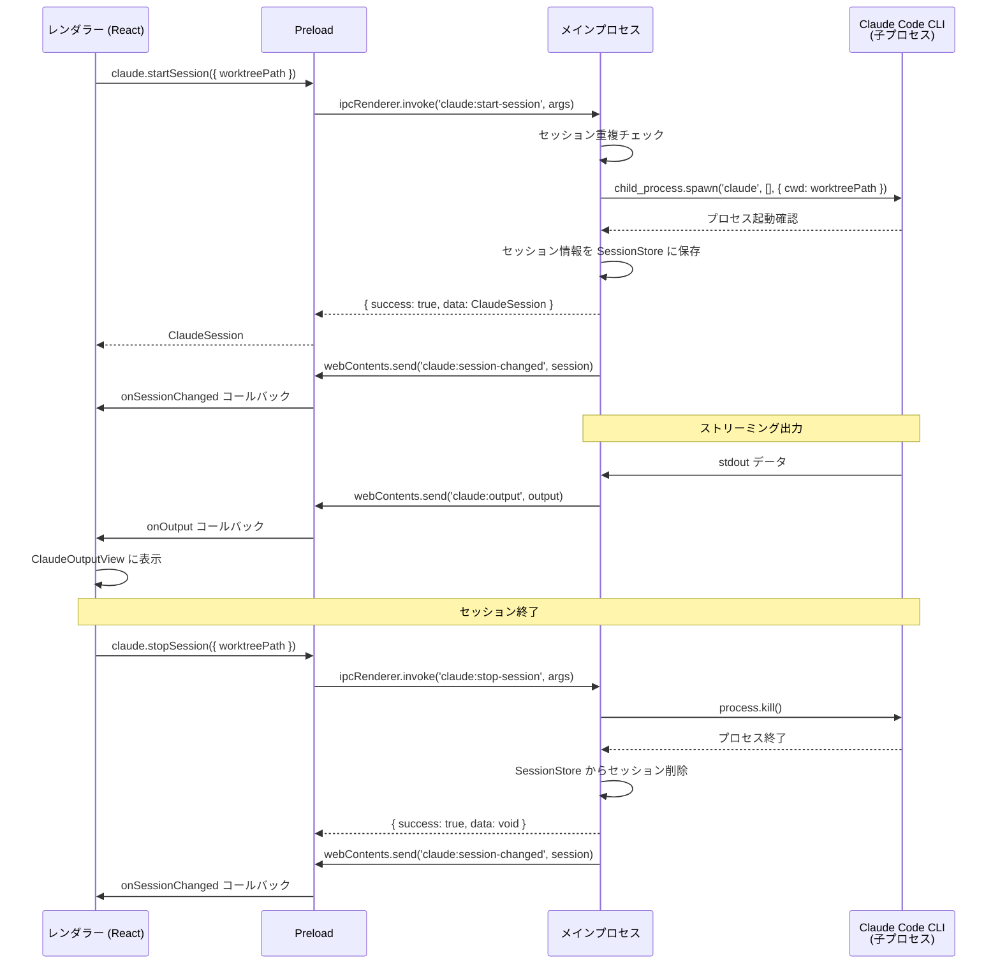
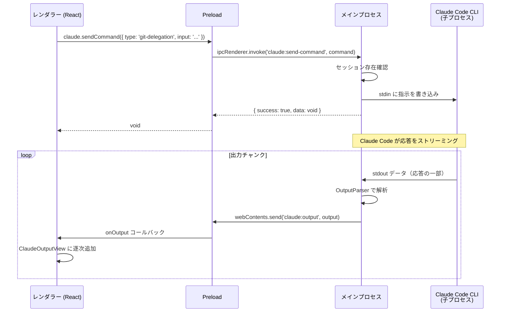
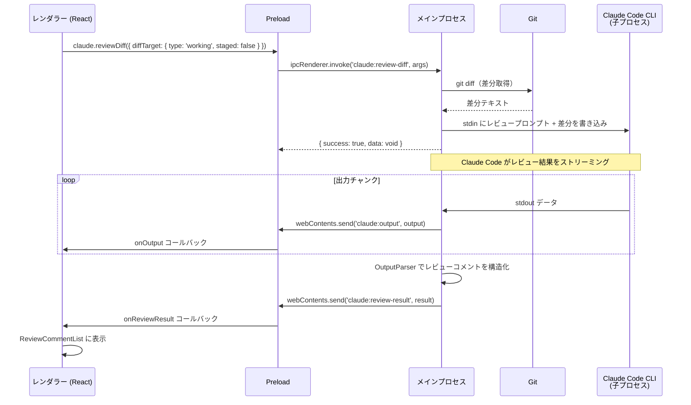

# Claude Code 連携

**関連 Design Doc:** [claude-code-integration_design.md](./claude-code-integration_design.md)
**関連 PRD:** [claude-code-integration.md](../requirement/claude-code-integration.md)

---

# 1. 背景

Buruma は Git ワークツリーの並行管理を主軸とする GUI アプリケーションである。開発者はワークツリーごとに異なるブランチで作業を行うが、Git 操作の実行やコード変更の理解には一定のコンテキスト理解が求められる。

Claude Code CLI は Anthropic が提供する AI コーディングアシスタントであり、自然言語による Git 操作委譲、コードレビュー、差分解説などの機能を CLI インターフェースで提供する。本仕様は、Claude Code CLI を子プロセスとして Buruma に統合し、ワークツリーごとに独立した AI 支援セッションを提供するための論理設計を定義する。

本仕様は PRD [claude-code-integration.md](../requirement/claude-code-integration.md) の要求（UR_501〜UR_504, FR_501〜FR_505, DC_501〜DC_502）を実現する。

# 2. 概要

Claude Code 連携は以下の5つのサブシステムで構成される：

1. **セッション管理** — ワークツリーごとに独立した Claude Code CLI セッションの起動・管理・終了（FR_501）
2. **Git 操作委譲** — 自然言語指示による Git 操作の Claude Code への委譲と実行前確認（FR_502）
3. **コードレビュー** — 差分を Claude Code に送信し、レビューコメントを取得・表示（FR_503）
4. **差分解説** — コミット/ブランチ間の差分内容を Claude Code に解説させる（FR_504）
5. **セッション出力表示** — Claude Code の出力をリアルタイムでストリーミング表示（FR_505）

すべてのサブシステムは Electron のマルチプロセスアーキテクチャ（main / preload / renderer）に準拠し、Claude Code CLI はメインプロセスから子プロセスとして実行される（DC_501）。各ワークツリーのセッションは独立しており、コンテキストを共有しない（DC_502）。

# 3. 要求定義

## 3.1. 機能要件 (Functional Requirements)

| ID | 要件 | 優先度 | 根拠 (PRD) |
|--------|------|------|------|
| FR-001 | ワークツリー選択時に Claude Code セッションを起動する | 必須 | FR_501_01 |
| FR-002 | セッションを明示的に終了できる | 必須 | FR_501_02 |
| FR-003 | ワークツリー切り替え時にセッションを自動切り替えする | 必須 | FR_501_03 |
| FR-004 | セッション状態（接続中/切断/エラー）をUIインジケーターで表示する | 必須 | FR_501_04 |
| FR-005 | エラー時にセッションを自動再接続する | 推奨 | FR_501_05 |
| FR-006 | 自然言語入力フィールドを提供する | 必須 | FR_502_01 |
| FR-007 | 自然言語指示を Claude Code に送信する | 必須 | FR_502_02 |
| FR-008 | 実行予定の Git コマンドを表示し確認ダイアログを提供する | 必須 | FR_502_03 |
| FR-009 | Git 操作の実行結果を表示する | 必須 | FR_502_04 |
| FR-010 | 操作結果をステータス・ログに自動反映する | 推奨 | FR_502_05 |
| FR-011 | 現在の差分（staged/unstaged）を Claude Code に送信してレビューを取得する | 推奨 | FR_503_01 |
| FR-012 | 特定コミット間の差分を Claude Code に送信してレビューを取得する | 推奨 | FR_503_02 |
| FR-013 | レビューコメントを取得・表示する | 推奨 | FR_503_03 |
| FR-014 | レビューコメントを差分上にインライン表示する | 任意 | FR_503_04 |
| FR-015 | レビュー結果のサマリーを表示する | 任意 | FR_503_05 |
| FR-016 | コミット選択による差分解説をリクエストする | 任意 | FR_504_01 |
| FR-017 | ブランチ間差分の解説をリクエストする | 任意 | FR_504_02 |
| FR-018 | 解説結果をマークダウン形式で表示する | 任意 | FR_504_03 |
| FR-019 | 解説のコピー・エクスポート機能を提供する | 任意 | FR_504_04 |
| FR-020 | stdout/stderr のリアルタイムストリーミング表示を行う | 必須 | FR_505_01 |
| FR-021 | ANSI カラーコードを解釈・レンダリングする | 推奨 | FR_505_02 |
| FR-022 | 出力のスクロール制御（自動スクロール ON/OFF）を提供する | 推奨 | FR_505_03 |
| FR-023 | 出力テキストの検索機能を提供する | 推奨 | FR_505_04 |

## 3.2. 非機能要件 (Non-Functional Requirements)

| ID | カテゴリ | 要件 | 目標値 |
|---------|------|------|------|
| NFR-001 | 性能 | セッション起動からUI反映までの時間 | 5秒以内 |
| NFR-002 | 性能 | ストリーミング出力のレンダリング遅延 | 100ms以内 |
| NFR-003 | 安定性 | セッション異常終了時の自動再接続 | 3回までリトライ |
| NFR-004 | セキュリティ | 子プロセスのサンドボックス化 | ワークツリーの CWD に限定 |

# 4. API

## 4.1. IPC API（メインプロセス ↔ レンダラー）

### セッション管理

| チャネル名 | 方向 | 概要 | 引数 | 戻り値 |
|-----------|------|------|------|--------|
| `claude:start-session` | renderer → main | 指定ワークツリーで Claude Code セッションを起動する | `{ worktreePath: string }` | `IPCResult<ClaudeSession>` |
| `claude:stop-session` | renderer → main | 指定ワークツリーのセッションを終了する | `{ worktreePath: string }` | `IPCResult<void>` |
| `claude:get-session` | renderer → main | 指定ワークツリーのセッション情報を取得する | `{ worktreePath: string }` | `IPCResult<ClaudeSession \| null>` |
| `claude:get-all-sessions` | renderer → main | 全セッション情報を取得する | なし | `IPCResult<ClaudeSession[]>` |

### コマンド実行

| チャネル名 | 方向 | 概要 | 引数 | 戻り値 |
|-----------|------|------|------|--------|
| `claude:send-command` | renderer → main | Claude Code にコマンド（自然言語指示）を送信する | `ClaudeCommand` | `IPCResult<void>` |

### 出力取得

| チャネル名 | 方向 | 概要 | 引数 | 戻り値 |
|-----------|------|------|------|--------|
| `claude:get-output` | renderer → main | 指定セッションの出力履歴を取得する | `{ worktreePath: string }` | `IPCResult<ClaudeOutput[]>` |

### レビュー・解説

| チャネル名 | 方向 | 概要 | 引数 | 戻り値 |
|-----------|------|------|------|--------|
| `claude:review-diff` | renderer → main | 差分をClaude Codeに送信しレビューを取得する | `{ worktreePath: string; diffTarget: DiffTarget }` | `IPCResult<void>` |
| `claude:explain-diff` | renderer → main | 差分をClaude Codeに送信し解説を取得する | `{ worktreePath: string; diffTarget: DiffTarget }` | `IPCResult<void>` |

### イベント通知（メインプロセス → レンダラー）

| チャネル名 | 方向 | 概要 | ペイロード |
|-----------|------|------|----------|
| `claude:session-changed` | main → renderer | セッション状態が変化した | `ClaudeSession` |
| `claude:output` | main → renderer | Claude Code から出力が発生した | `ClaudeOutput` |
| `claude:review-result` | main → renderer | レビュー結果が返された | `{ worktreePath: string; comments: ReviewComment[]; summary: string }` |
| `claude:explain-result` | main → renderer | 解説結果が返された | `{ worktreePath: string; explanation: string }` |

## 4.2. React コンポーネント API

| コンポーネント | Props | 概要 |
|--------------|-------|------|
| `ClaudeSessionPanel` | `{ worktreePath: string }` | Claude Code セッションの操作パネル（起動/停止/状態表示/入力フィールド） |
| `ClaudeOutputView` | `{ worktreePath: string; autoScroll?: boolean }` | Claude Code のストリーミング出力をリアルタイム表示するビュー |
| `ReviewCommentList` | `{ comments: ReviewComment[]; onCommentClick?: (comment: ReviewComment) => void }` | レビューコメントの一覧表示コンポーネント |
| `DiffExplanationView` | `{ explanation: string }` | 差分解説のマークダウンレンダリングビュー |
| `SessionStatusIndicator` | `{ status: SessionStatus }` | セッション状態インジケーター（接続中/切断/エラー） |
| `CommandInput` | `{ onSubmit: (command: string) => void; disabled?: boolean }` | 自然言語入力フィールド |

## 4.3. 型定義

```typescript
// セッション状態
type SessionStatus = 'idle' | 'starting' | 'running' | 'stopping' | 'error';

// Claude Code セッション
interface ClaudeSession {
  worktreePath: string;
  status: SessionStatus;
  pid: number | null;       // 子プロセスの PID
  startedAt: string | null; // ISO 8601
  error: string | null;     // エラーメッセージ（status が 'error' の場合）
}

// Claude Code コマンド
interface ClaudeCommand {
  worktreePath: string;
  type: ClaudeCommandType;
  input: string;            // 自然言語指示またはプロンプト
}

type ClaudeCommandType = 'general' | 'git-delegation' | 'review' | 'explain';

// Claude Code 出力
interface ClaudeOutput {
  worktreePath: string;
  stream: 'stdout' | 'stderr';
  content: string;
  timestamp: string;        // ISO 8601
}

// 差分ターゲット
type DiffTarget =
  | { type: 'working'; staged: boolean }       // 現在の差分
  | { type: 'commits'; from: string; to: string } // コミット間差分
  | { type: 'branches'; from: string; to: string }; // ブランチ間差分

// レビューコメント
interface ReviewComment {
  id: string;
  filePath: string;
  lineStart: number;
  lineEnd: number;
  severity: ReviewSeverity;
  message: string;
  suggestion?: string;      // 修正提案コード
}

type ReviewSeverity = 'info' | 'warning' | 'error';

// IPC 通信の統一レスポンス型（application-foundation_spec から再利用）
type IPCResult<T> =
  | { success: true; data: T }
  | { success: false; error: IPCError };

interface IPCError {
  code: string;
  message: string;
  detail?: string;
}
```

# 5. 用語集

| 用語 | 説明 |
|------|------|
| Claude Code | Anthropic が提供する CLI ベースの AI コーディングアシスタント |
| セッション | Claude Code CLI の1つの子プロセスインスタンス。ワークツリーに1対1で紐づく |
| Git 操作委譲 | ユーザーの自然言語指示を Claude Code が解釈し、適切な Git コマンドを実行すること |
| ストリーミング表示 | 子プロセスの stdout/stderr 出力をリアルタイムでレンダラーに逐次送信・表示すること |
| CWD | Current Working Directory。子プロセスの作業ディレクトリ。ワークツリーのパスを設定する |
| DiffTarget | レビューまたは解説対象の差分を指定する型。作業ツリー差分、コミット間、ブランチ間を区別する |

# 6. 使用例

```typescript
// レンダラー側：セッション起動
const session = await window.electronAPI.claude.startSession({
  worktreePath: '/path/to/worktree',
});

// レンダラー側：自然言語で Git 操作を委譲
await window.electronAPI.claude.sendCommand({
  worktreePath: '/path/to/worktree',
  type: 'git-delegation',
  input: 'main ブランチにマージして',
});

// レンダラー側：ストリーミング出力の購読
window.electronAPI.claude.onOutput((output: ClaudeOutput) => {
  appendToTerminal(output.content);
});

// レンダラー側：コードレビューをリクエスト
await window.electronAPI.claude.reviewDiff({
  worktreePath: '/path/to/worktree',
  diffTarget: { type: 'working', staged: false },
});

// レンダラー側：レビュー結果の購読
window.electronAPI.claude.onReviewResult((result) => {
  displayReviewComments(result.comments);
  displaySummary(result.summary);
});

// レンダラー側：差分解説をリクエスト
await window.electronAPI.claude.explainDiff({
  worktreePath: '/path/to/worktree',
  diffTarget: { type: 'commits', from: 'abc123', to: 'def456' },
});

// React コンポーネントの使用例
<ClaudeSessionPanel worktreePath={selectedWorktree.path} />
<ClaudeOutputView worktreePath={selectedWorktree.path} autoScroll={true} />
<ReviewCommentList comments={reviewComments} onCommentClick={handleCommentClick} />
```

# 7. 振る舞い図

## 7.1. セッションライフサイクル



## 7.2. コマンド実行フロー（Git 操作委譲）



## 7.3. コードレビューフロー



# 8. 制約事項

- Claude Code CLI はメインプロセスの子プロセスとしてのみ実行する（DC_501、原則 A-001）
- レンダラーから Node.js の `child_process` に直接アクセスしない（原則 A-001、T-003）
- 各ワークツリーのセッションは独立し、コンテキストを共有しない（DC_502）
- 子プロセスの CWD はワークツリーのパスに設定する（DC_502）
- Claude Code CLI がユーザー環境にインストール・認証済みであることが前提
- IPC 通信は `IPCResult<T>` 型で統一する（[application-foundation_spec.md](./application-foundation_spec.md) の FR-011〜FR-013）
- ストリーミング出力は IPC イベント通知パターンで送信する（FR-013）
- Git 操作委譲時は実行前確認を必須とする（原則 B-002: Git 操作の安全性）

---

# PRD 整合性確認

| PRD 要求 ID | 本仕様での対応 | ステータス |
|-------------|--------------|----------|
| UR_501 | 仕様全体（Claude Code 連携の5サブシステム） | 対応済み |
| UR_502 | FR-001〜FR-005 + claude:start-session / claude:stop-session API | 対応済み |
| UR_503 | FR-006〜FR-010 + claude:send-command API | 対応済み |
| UR_504 | FR-011〜FR-019 + claude:review-diff / claude:explain-diff API | 対応済み |
| FR_501 | FR-001〜FR-005 + セッションライフサイクル図 | 対応済み |
| FR_501_01 | FR-001 | 対応済み |
| FR_501_02 | FR-002 | 対応済み |
| FR_501_03 | FR-003 | 対応済み |
| FR_501_04 | FR-004 + SessionStatusIndicator | 対応済み |
| FR_501_05 | FR-005 + NFR-003 | 対応済み |
| FR_502 | FR-006〜FR-010 + コマンド実行フロー図 | 対応済み |
| FR_502_01 | FR-006 + CommandInput コンポーネント | 対応済み |
| FR_502_02 | FR-007 + claude:send-command API | 対応済み |
| FR_502_03 | FR-008 | 対応済み |
| FR_502_04 | FR-009 | 対応済み |
| FR_502_05 | FR-010 | 対応済み |
| FR_503 | FR-011〜FR-015 + コードレビューフロー図 | 対応済み |
| FR_503_01 | FR-011 | 対応済み |
| FR_503_02 | FR-012 | 対応済み |
| FR_503_03 | FR-013 + ReviewCommentList | 対応済み |
| FR_503_04 | FR-014 | 対応済み |
| FR_503_05 | FR-015 | 対応済み |
| FR_504 | FR-016〜FR-019 + claude:explain-diff API | 対応済み |
| FR_504_01 | FR-016 | 対応済み |
| FR_504_02 | FR-017 | 対応済み |
| FR_504_03 | FR-018 + DiffExplanationView | 対応済み |
| FR_504_04 | FR-019 | 対応済み |
| FR_505 | FR-020〜FR-023 + ClaudeOutputView | 対応済み |
| FR_505_01 | FR-020 + claude:output イベント | 対応済み |
| FR_505_02 | FR-021 | 対応済み |
| FR_505_03 | FR-022 | 対応済み |
| FR_505_04 | FR-023 | 対応済み |
| DC_501 | 制約事項 + 振る舞い図（子プロセス実行） | 対応済み |
| DC_502 | 制約事項 + セッション分離設計 | 対応済み |
