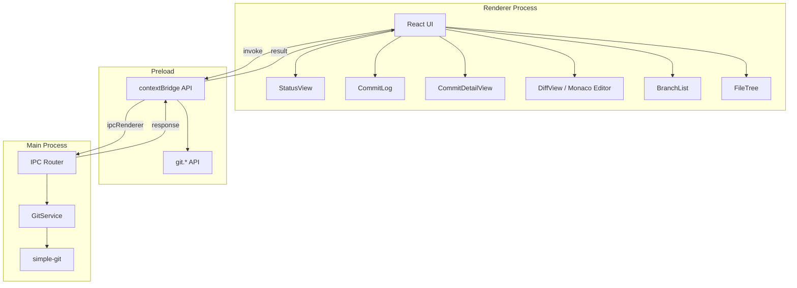

# リポジトリ閲覧

**関連 Spec:** [repository-viewer_spec.md](./repository-viewer_spec.md)
**関連 PRD:** [repository-viewer.md](../requirement/repository-viewer.md)

---

# 1. 実装ステータス

**ステータス:** 🟢 実装済み

## 1.1. 実装進捗

| モジュール/機能 | ステータス | 備考 |
|--------------|----------|------|
| GitReadRepository（ステータス） | 🟢 | simple-git による status 取得 |
| GitReadRepository（ログ） | 🟢 | simple-git による log 取得・ページネーション |
| GitReadRepository（差分） | 🟢 | simple-git による diff 取得・パース |
| GitReadRepository（ブランチ） | 🟢 | simple-git による branch 一覧取得 |
| GitReadRepository（ファイルツリー） | 🟢 | simple-git による ls-tree 取得 |
| IPC ハンドラー（git:*） | 🟢 | git: 名前空間の IPC チャネル登録 |
| Preload API（git.*） | 🟢 | contextBridge による git API 公開 |
| StatusView コンポーネント | 🟢 | ステータス分類表示 UI |
| CommitLog コンポーネント | 🟢 | コミットログ一覧 UI（スクロールページネーション） |
| CommitDetailView コンポーネント | 🟢 | コミット詳細表示 UI |
| DiffView コンポーネント | 🟢 | コードベース差分表示（Monaco 統合予定） |
| BranchList コンポーネント | 🟢 | ブランチ一覧 UI |
| FileTree コンポーネント | 🟢 | ファイルツリー UI |

---

# 2. 設計目標

1. **パフォーマンス** — 大規模リポジトリ（10万コミット以上）でもスムーズに動作する。ページネーションと仮想スクロールで実現する
2. **型安全な IPC 通信** — すべての git: チャネルに TypeScript 型定義を提供し、`IPCResult<T>` パターンでエラーハンドリングを統一する（原則 T-001, T-002）
3. **Electron セキュリティ準拠** — Git 操作はメインプロセスの GitService で実行し、preload + contextBridge 経由でレンダラーに結果を返す（原則 A-001, T-003）
4. **Library-First** — Git 操作に simple-git、差分表示に Monaco Editor を活用し、自前実装を最小化する（原則 A-002）
5. **Worktree-First UX** — すべての操作が選択ワークツリーを起点とし、worktreePath を必須引数として渡す（原則 B-001）

---

# 3. 技術スタック

> 以下はプロジェクト共通の技術スタックです。機能固有の追加技術のみ記載してください。

| 領域 | 採用技術 | 選定理由 |
|------|----------|----------|
| Git 操作 | simple-git | Node.js 向け Git CLI ラッパー。豊富な API、活発なメンテナンス、TypeScript 型定義付き（原則 A-002） |
| 差分表示 | Monaco Editor | VS Code と同一のエディタエンジン。インライン/サイドバイサイドの diff 表示を標準サポート。シンタックスハイライトも組み込み（CONSTITUTION 技術スタック制約） |
| 仮想スクロール | @tanstack/react-virtual | 大規模コミットログの描画パフォーマンス確保。React 19 対応、軽量（原則 A-002） |
| diff パース | diff-parse（simple-git 内蔵） | simple-git の DiffResult 型で構造化された差分データを取得。追加の diff パーサー不要 |

<details>
<summary>プロジェクト共通スタック（参考）</summary>

| 領域 | 採用技術 |
|------|----------|
| フレームワーク | Electron 41 + Electron Forge 7 |
| バンドラー | Vite 5 |
| UI | React 19 + TypeScript |
| スタイリング | Tailwind CSS v4 (`@tailwindcss/postcss`) |
| UIコンポーネント | Shadcn/ui |
| Git操作 | simple-git（予定） |
| エディタ | Monaco Editor（予定） |

</details>

---

# 4. アーキテクチャ

## 4.1. システム構成図



## 4.2. モジュール分割

| モジュール名 | プロセス | 責務 | 配置場所 |
|------------|---------|------|---------|
| GitService | main | Git 操作の実行（status, log, diff, branch, file-tree） | `src/main/services/git.ts` |
| git IPC ハンドラー | main | git: 名前空間の IPC チャネル登録 | `src/main/ipc/git-handlers.ts` |
| Preload git API | preload | contextBridge による git.* API 公開 | `src/preload.ts`（既存に追記） |
| Git 型定義 | shared | Git 関連の TypeScript 型定義 | `src/types/git.ts` |
| ElectronAPI 型定義拡張 | shared | window.electronAPI.git の型定義 | `src/types/electron.d.ts`（既存に追記） |
| StatusView | renderer | ステータス分類表示（staged/unstaged/untracked） | `src/components/repository/StatusView.tsx` |
| CommitLog | renderer | コミットログ一覧（仮想スクロール・検索・ページネーション） | `src/components/repository/CommitLog.tsx` |
| CommitDetailView | renderer | コミット詳細（変更ファイル一覧・差分リンク） | `src/components/repository/CommitDetailView.tsx` |
| DiffView | renderer | Monaco Editor による差分表示（inline/side-by-side） | `src/components/repository/DiffView.tsx` |
| BranchList | renderer | ブランチ一覧（ローカル/リモート・検索） | `src/components/repository/BranchList.tsx` |
| FileTree | renderer | ファイルツリー（変更マーキング付き） | `src/components/repository/FileTree.tsx` |
| useGitStatus | renderer | ステータス取得の React Hook | `src/hooks/useGitStatus.ts` |
| useCommitLog | renderer | コミットログ取得の React Hook（ページネーション対応） | `src/hooks/useCommitLog.ts` |
| useBranches | renderer | ブランチ一覧取得の React Hook | `src/hooks/useBranches.ts` |
| useFileTree | renderer | ファイルツリー取得の React Hook | `src/hooks/useFileTree.ts` |

---

# 5. データモデル

```typescript
// simple-git の StatusResult から変換するマッピング
// simple-git の status() は FileStatusResult[] を返す
// これを GitStatus（spec 定義）に変換する

// simple-git StatusResult → GitStatus 変換ロジック
function mapStatusResult(result: StatusResult): GitStatus {
  return {
    staged: [
      ...result.created.map(f => ({ path: f, type: 'added' as const })),
      ...result.staged.map(f => ({ path: f, type: 'modified' as const })),
      ...result.deleted.map(f => ({ path: f, type: 'deleted' as const })),
      ...result.renamed.map(f => ({ path: f.to, type: 'renamed' as const, oldPath: f.from })),
    ],
    unstaged: [
      ...result.modified.map(f => ({ path: f, type: 'modified' as const })),
      ...result.deleted.map(f => ({ path: f, type: 'deleted' as const })),
    ],
    untracked: result.not_added,
  };
}
```

---

# 6. インターフェース定義

## 6.1. IPC ハンドラー（メインプロセス側）

```typescript
// src/main/ipc/git-handlers.ts
import { ipcMain } from 'electron';
import type { IPCResult } from '../../types/ipc';
import type {
  GitStatus,
  GitLogQuery,
  GitLogResult,
  CommitDetail,
  GitDiffQuery,
  FileDiff,
  BranchList,
  FileTreeNode,
} from '../../types/git';
import type { GitService } from '../services/git';

export function registerGitHandlers(gitService: GitService): void {
  ipcMain.handle(
    'git:status',
    async (_event, args: { worktreePath: string }): Promise<IPCResult<GitStatus>> => {
      return gitService.getStatus(args.worktreePath);
    },
  );

  ipcMain.handle(
    'git:log',
    async (_event, query: GitLogQuery): Promise<IPCResult<GitLogResult>> => {
      return gitService.getLog(query);
    },
  );

  ipcMain.handle(
    'git:commit-detail',
    async (_event, args: { worktreePath: string; hash: string }): Promise<IPCResult<CommitDetail>> => {
      return gitService.getCommitDetail(args.worktreePath, args.hash);
    },
  );

  ipcMain.handle(
    'git:diff',
    async (_event, query: GitDiffQuery): Promise<IPCResult<FileDiff[]>> => {
      return gitService.getDiff(query);
    },
  );

  ipcMain.handle(
    'git:diff-staged',
    async (_event, query: GitDiffQuery): Promise<IPCResult<FileDiff[]>> => {
      return gitService.getDiffStaged(query);
    },
  );

  ipcMain.handle(
    'git:diff-commit',
    async (
      _event,
      args: { worktreePath: string; hash: string; filePath?: string },
    ): Promise<IPCResult<FileDiff[]>> => {
      return gitService.getDiffCommit(args.worktreePath, args.hash, args.filePath);
    },
  );

  ipcMain.handle(
    'git:branches',
    async (_event, args: { worktreePath: string }): Promise<IPCResult<BranchList>> => {
      return gitService.getBranches(args.worktreePath);
    },
  );

  ipcMain.handle(
    'git:file-tree',
    async (_event, args: { worktreePath: string }): Promise<IPCResult<FileTreeNode>> => {
      return gitService.getFileTree(args.worktreePath);
    },
  );
}
```

## 6.2. GitService（メインプロセス側）

```typescript
// src/main/services/git.ts
import simpleGit, { type SimpleGit } from 'simple-git';
import type { IPCResult, IPCError } from '../../types/ipc';
import type {
  GitStatus,
  GitLogQuery,
  GitLogResult,
  CommitDetail,
  GitDiffQuery,
  FileDiff,
  BranchList,
  FileTreeNode,
} from '../../types/git';

export class GitService {
  private getGit(worktreePath: string): SimpleGit {
    return simpleGit(worktreePath);
  }

  private success<T>(data: T): IPCResult<T> {
    return { success: true, data };
  }

  private failure(code: string, message: string, detail?: string): IPCResult<never> {
    return { success: false, error: { code, message, detail } };
  }

  async getStatus(worktreePath: string): Promise<IPCResult<GitStatus>> {
    try {
      const git = this.getGit(worktreePath);
      const result = await git.status();
      return this.success(mapStatusResult(result));
    } catch (error) {
      return this.failure('GIT_STATUS_ERROR', 'ステータスの取得に失敗しました', String(error));
    }
  }

  async getLog(query: GitLogQuery): Promise<IPCResult<GitLogResult>> {
    try {
      const git = this.getGit(query.worktreePath);
      const options: Record<string, string | number> = {
        maxCount: query.limit,
        '--skip': query.offset,
      };
      if (query.search) {
        options['--grep'] = query.search;
        options['--all-match'] = '';
      }
      const result = await git.log(options);
      return this.success({
        commits: result.all.map(mapCommitSummary),
        total: result.total,
        hasMore: result.all.length === query.limit,
      });
    } catch (error) {
      return this.failure('GIT_LOG_ERROR', 'コミットログの取得に失敗しました', String(error));
    }
  }

  async getCommitDetail(worktreePath: string, hash: string): Promise<IPCResult<CommitDetail>> {
    try {
      const git = this.getGit(worktreePath);
      const log = await git.log({ maxCount: 1, from: hash, to: hash });
      const diff = await git.diffSummary([`${hash}~1`, hash]);
      const entry = log.latest;
      if (!entry) {
        return this.failure('GIT_COMMIT_NOT_FOUND', '指定コミットが見つかりません', hash);
      }
      return this.success(mapCommitDetail(entry, diff));
    } catch (error) {
      return this.failure('GIT_COMMIT_DETAIL_ERROR', 'コミット詳細の取得に失敗しました', String(error));
    }
  }

  async getDiff(query: GitDiffQuery): Promise<IPCResult<FileDiff[]>> {
    try {
      const git = this.getGit(query.worktreePath);
      const args = query.filePath ? [query.filePath] : [];
      const result = await git.diff(args);
      return this.success(parseDiffOutput(result));
    } catch (error) {
      return this.failure('GIT_DIFF_ERROR', '差分の取得に失敗しました', String(error));
    }
  }

  async getDiffStaged(query: GitDiffQuery): Promise<IPCResult<FileDiff[]>> {
    try {
      const git = this.getGit(query.worktreePath);
      const args = ['--cached', ...(query.filePath ? [query.filePath] : [])];
      const result = await git.diff(args);
      return this.success(parseDiffOutput(result));
    } catch (error) {
      return this.failure('GIT_DIFF_STAGED_ERROR', 'ステージ済み差分の取得に失敗しました', String(error));
    }
  }

  async getDiffCommit(
    worktreePath: string,
    hash: string,
    filePath?: string,
  ): Promise<IPCResult<FileDiff[]>> {
    try {
      const git = this.getGit(worktreePath);
      const args = [`${hash}~1`, hash, ...(filePath ? ['--', filePath] : [])];
      const result = await git.diff(args);
      return this.success(parseDiffOutput(result));
    } catch (error) {
      return this.failure('GIT_DIFF_COMMIT_ERROR', 'コミット差分の取得に失敗しました', String(error));
    }
  }

  async getBranches(worktreePath: string): Promise<IPCResult<BranchList>> {
    try {
      const git = this.getGit(worktreePath);
      const result = await git.branch(['-a', '-v', '--abbrev']);
      return this.success(mapBranchResult(result));
    } catch (error) {
      return this.failure('GIT_BRANCHES_ERROR', 'ブランチ一覧の取得に失敗しました', String(error));
    }
  }

  async getFileTree(worktreePath: string): Promise<IPCResult<FileTreeNode>> {
    try {
      const git = this.getGit(worktreePath);
      const result = await git.raw(['ls-tree', '-r', '--name-only', 'HEAD']);
      const status = await git.status();
      return this.success(buildFileTree(result, status, worktreePath));
    } catch (error) {
      return this.failure('GIT_FILE_TREE_ERROR', 'ファイルツリーの取得に失敗しました', String(error));
    }
  }
}
```

## 6.3. Preload API（contextBridge 経由）

```typescript
// src/preload.ts に追記
// 既存の electronAPI オブジェクトに git プロパティを追加

git: {
  status: (args: { worktreePath: string }): Promise<IPCResult<GitStatus>> =>
    ipcRenderer.invoke('git:status', args),
  log: (query: GitLogQuery): Promise<IPCResult<GitLogResult>> =>
    ipcRenderer.invoke('git:log', query),
  commitDetail: (args: { worktreePath: string; hash: string }): Promise<IPCResult<CommitDetail>> =>
    ipcRenderer.invoke('git:commit-detail', args),
  diff: (query: GitDiffQuery): Promise<IPCResult<FileDiff[]>> =>
    ipcRenderer.invoke('git:diff', query),
  diffStaged: (query: GitDiffQuery): Promise<IPCResult<FileDiff[]>> =>
    ipcRenderer.invoke('git:diff-staged', query),
  diffCommit: (args: { worktreePath: string; hash: string; filePath?: string }): Promise<IPCResult<FileDiff[]>> =>
    ipcRenderer.invoke('git:diff-commit', args),
  branches: (args: { worktreePath: string }): Promise<IPCResult<BranchList>> =>
    ipcRenderer.invoke('git:branches', args),
  fileTree: (args: { worktreePath: string }): Promise<IPCResult<FileTreeNode>> =>
    ipcRenderer.invoke('git:file-tree', args),
},
```

## 6.4. レンダラー側の型定義拡張

```typescript
// src/types/electron.d.ts に追記
// 既存の ElectronAPI インターフェースに git プロパティを追加

interface ElectronAPI {
  // ... 既存のプロパティ（repository, settings, onError）

  git: {
    status(args: { worktreePath: string }): Promise<IPCResult<GitStatus>>;
    log(query: GitLogQuery): Promise<IPCResult<GitLogResult>>;
    commitDetail(args: { worktreePath: string; hash: string }): Promise<IPCResult<CommitDetail>>;
    diff(query: GitDiffQuery): Promise<IPCResult<FileDiff[]>>;
    diffStaged(query: GitDiffQuery): Promise<IPCResult<FileDiff[]>>;
    diffCommit(args: { worktreePath: string; hash: string; filePath?: string }): Promise<IPCResult<FileDiff[]>>;
    branches(args: { worktreePath: string }): Promise<IPCResult<BranchList>>;
    fileTree(args: { worktreePath: string }): Promise<IPCResult<FileTreeNode>>;
  };
}
```

## 6.5. DiffView コンポーネント（Monaco Editor 統合）

```typescript
// src/components/repository/DiffView.tsx
import * as monaco from 'monaco-editor';
import { useEffect, useRef } from 'react';
import type { FileDiff, DiffDisplayMode } from '@/types/git';

export function DiffView({ diffs, mode, onModeChange }: DiffViewProps) {
  const editorRef = useRef<HTMLDivElement>(null);
  const diffEditorRef = useRef<monaco.editor.IDiffEditor | null>(null);

  useEffect(() => {
    if (!editorRef.current || diffs.length === 0) return;

    const diff = diffs[0]; // 現在選択中のファイル

    // Monaco DiffEditor を使用
    const diffEditor = monaco.editor.createDiffEditor(editorRef.current, {
      renderSideBySide: mode === 'side-by-side',
      readOnly: true,
      automaticLayout: true,
      minimap: { enabled: false },
    });

    const originalModel = monaco.editor.createModel(
      reconstructOriginal(diff),
      detectLanguage(diff.filePath),
    );
    const modifiedModel = monaco.editor.createModel(
      reconstructModified(diff),
      detectLanguage(diff.filePath),
    );

    diffEditor.setModel({ original: originalModel, modified: modifiedModel });
    diffEditorRef.current = diffEditor;

    return () => {
      diffEditor.dispose();
      originalModel.dispose();
      modifiedModel.dispose();
    };
  }, [diffs, mode]);

  return (
    <div className="flex flex-col h-full">
      {/* モード切替ボタン */}
      <div className="flex gap-2 p-2 border-b">
        <button
          className={mode === 'inline' ? 'font-bold' : ''}
          onClick={() => onModeChange('inline')}
        >
          インライン
        </button>
        <button
          className={mode === 'side-by-side' ? 'font-bold' : ''}
          onClick={() => onModeChange('side-by-side')}
        >
          サイドバイサイド
        </button>
      </div>
      {/* Monaco Editor */}
      <div ref={editorRef} className="flex-1" />
    </div>
  );
}
```

---

# 7. 非機能要件実現方針

| 要件 | 実現方針 |
|------|----------|
| ステータス表示2秒以内 (NFR_201) | simple-git の status() は内部で `git status --porcelain` を使用し高速。変換処理も O(n) で軽量 |
| コミットログ初期表示1秒以内 (NFR_202) | `--max-count=50` で取得件数を制限。仮想スクロール（@tanstack/react-virtual）で DOM 描画を最小化。スクロール時にオンデマンドで次ページを取得 |
| 差分表示1秒以内 (NFR_203) | simple-git の diff() で生の diff 文字列を取得し、メインプロセスでパース。Monaco Editor の DiffEditor はネイティブ実装で高速描画 |
| Electron セキュリティ (A-001, T-003) | Git 操作は GitService（メインプロセス）に閉じ込め、preload + contextBridge 経由でのみアクセス |

---

# 8. テスト戦略

| テストレベル | 対象 | カバレッジ目標 |
|------------|------|------------|
| ユニットテスト | GitService（status, log, diff, branch, file-tree） | ≥ 80% |
| ユニットテスト | diff パース関数（parseDiffOutput） | ≥ 90%（エッジケース含む） |
| ユニットテスト | データ変換関数（mapStatusResult, mapCommitSummary, mapBranchResult） | ≥ 90% |
| コンポーネントテスト | StatusView, CommitLog, BranchList, FileTree | ≥ 60% |
| 結合テスト | IPC ハンドラー（git:* チャネル） | 主要フロー |
| E2Eテスト | ステータス表示、コミットログ閲覧、差分表示切替 | 主要ユースケース |
| パフォーマンステスト | NFR_201〜NFR_203 の各目標値 | 自動計測 |

**テストツール:** Vitest + Testing Library（CONSTITUTION 技術スタック制約準拠）

**モック戦略:**
- GitService のテストでは simple-git をモック化（実際の Git リポジトリに依存しない）
- コンポーネントテストでは IPC 呼び出しをモック化
- E2E テストでは実際の Git リポジトリ（テスト用の fixture リポジトリ）を使用

---

# 9. 設計判断

## 9.1. 決定事項

| 決定事項 | 選択肢 | 決定内容 | 理由 |
|----------|--------|----------|------|
| Git 操作ライブラリ | simple-git / nodegit / isomorphic-git / child_process 直接 | simple-git | CONSTITUTION 技術スタック制約で指定。Node.js 向けに最適化、TypeScript 型付き、活発なメンテナンス（原則 A-002） |
| 差分表示エンジン | Monaco Editor / CodeMirror / react-diff-viewer / 自前実装 | Monaco Editor | CONSTITUTION 技術スタック制約で指定。DiffEditor を標準搭載、シンタックスハイライト組み込み、VS Code との親和性（原則 A-002） |
| コミットログの仮想スクロール | @tanstack/react-virtual / react-window / react-virtualized | @tanstack/react-virtual | React 19 対応、軽量（6KB gzip）、hooks ベース API。react-window は unmaintained（原則 A-002） |
| IPC チャネル命名 | `git:status` / `repository-viewer:status` | `git:action` 形式 | ドメイン（git）ベースの命名で直感的。application-foundation の `repository:action` と一貫性がある |
| diff パース方式 | simple-git の diffSummary / raw diff をパース / unified-diff ライブラリ | simple-git の diff() + 自前パース | simple-git の diffSummary はファイル統計のみ。行レベルの差分表示にはraw diff 出力のパースが必要。Monaco Editor に渡す場合はファイル全体を再構成する方が効率的 |
| ファイルツリー取得方式 | `git ls-tree` / fs.readdir 再帰 / simple-git raw | `git ls-tree -r HEAD` + status マージ | Git 管理下のファイルのみ表示。status をマージすることで変更ファイルのマーキングも実現 |

## 9.2. 未解決の課題

| 課題 | 影響度 | 対応方針 |
|------|--------|----------|
| Monaco Editor の Vite 5 + Electron での統合方法 | 高 | monaco-editor の ESM ビルドを使用。vite.renderer.config.ts で worker の設定が必要。実装時に検証 |
| 大規模ファイル（10000行超）の差分表示パフォーマンス | 中 | Monaco Editor の minimap 無効化、折りたたみで対応。超大規模ファイルは警告表示して部分ロードを検討 |
| ブランチグラフの描画ライブラリ | 低 | 初期実装ではテキストベースの簡易表示。将来的に Canvas/SVG ベースのグラフ描画を検討 |
| simple-git の同時実行制御 | 中 | 同一リポジトリに対する並行 Git 操作でロック競合が発生する可能性。GitService 内でキュー管理を検討 |

---

# 10. 変更履歴

## v1.0

**変更内容:**

- 初版作成
- GitService、IPC ハンドラー、Preload API、レンダラーコンポーネントの設計を定義
- Monaco Editor による差分表示の設計を定義
- 仮想スクロールによるコミットログのパフォーマンス設計を定義
