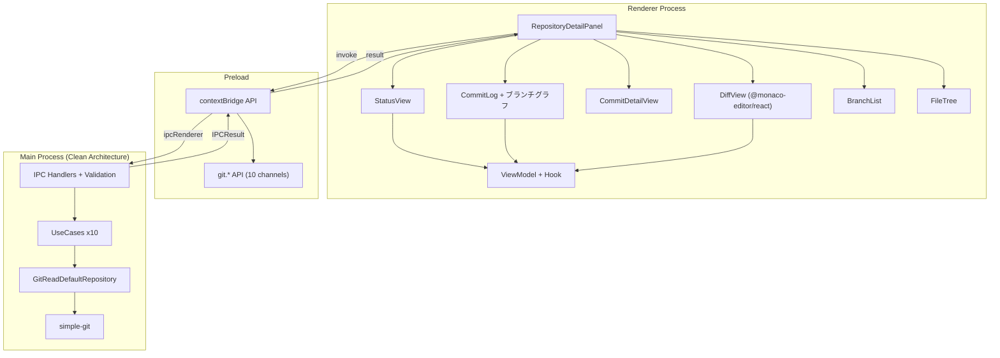

# リポジトリ閲覧

**関連 Spec:** [repository-viewer_spec.md](./repository-viewer_spec.md)
**関連 PRD:** [repository-viewer.md](../requirement/repository-viewer.md)

---

# 1. 実装ステータス

**ステータス:** 🟢 実装済み

## 1.1. 実装進捗

| モジュール/機能                   | ステータス | 備考                             |
|----------------------------|-------|--------------------------------|
| GitReadRepository（ステータス）   | 🟢    | simple-git による status 取得       |
| GitReadRepository（ログ）      | 🟢    | simple-git による log 取得・ページネーション |
| GitReadRepository（差分）      | 🟢    | simple-git による diff 取得・パース     |
| GitReadRepository（ブランチ）    | 🟢    | simple-git による branch 一覧取得     |
| GitReadRepository（ファイルツリー） | 🟢    | simple-git による ls-tree 取得      |
| IPC ハンドラー（git:*）           | 🟢    | git: 名前空間の IPC チャネル登録          |
| Preload API（git.*）         | 🟢    | contextBridge による git API 公開   |
| StatusView コンポーネント         | 🟢    | ステータス分類表示 UI                   |
| CommitLog コンポーネント          | 🟢    | コミットログ一覧 UI（スクロールページネーション）     |
| CommitDetailView コンポーネント   | 🟢    | コミット詳細表示 UI                    |
| DiffView コンポーネント           | 🟢    | @monaco-editor/react DiffEditor によるインライン/サイドバイサイド差分表示 |
| RepositoryDetailPanel       | 🟢    | タブ統合コンポーネント（ステータス/コミット/ブランチ/ファイル/リファレンス） |
| ブランチグラフ                    | 🟢    | git log --graph --all による ASCII グラフ表示 |
| IPC 入力バリデーション              | 🟢    | worktreePath パストラバーサル防止          |
| ファイルコンテンツ取得 IPC            | 🟢    | git:file-contents / git:file-contents-commit チャネル |
| BranchList コンポーネント         | 🟢    | ブランチ一覧 UI                      |
| FileTree コンポーネント           | 🟢    | ファイルツリー UI                     |

---

# 2. 設計目標

1. **パフォーマンス** — 大規模リポジトリ（10万コミット以上）でもスムーズに動作する。ページネーションと仮想スクロールで実現する
2. **型安全な IPC 通信** — すべての git: チャネルに TypeScript 型定義を提供し、`IPCResult<T>` パターンでエラーハンドリングを統一する（原則
   T-001, T-002）
3. **Electron セキュリティ準拠** — Git 操作はメインプロセスの GitReadDefaultRepository で実行し、preload + contextBridge
   経由でレンダラーに結果を返す（原則 A-001, T-003）
4. **Library-First** — Git 操作に simple-git、差分表示に Monaco Editor を活用し、自前実装を最小化する（原則 A-002）
5. **Worktree-First UX** — すべての操作が選択ワークツリーを起点とし、worktreePath を必須引数として渡す（原則 B-001）

---

# 3. 技術スタック

> 以下はプロジェクト共通の技術スタックです。機能固有の追加技術のみ記載してください。

| 領域       | 採用技術                      | 選定理由                                                                                        |
|----------|---------------------------|---------------------------------------------------------------------------------------------|
| Git 操作   | simple-git                | Node.js 向け Git CLI ラッパー。豊富な API、活発なメンテナンス、TypeScript 型定義付き（原則 A-002）                        |
| 差分表示 | @monaco-editor/react + monaco-editor | React ラッパー経由で Monaco DiffEditor を統合。CDN から worker を自動ロードし、Electron + Vite 環境での worker 設定問題を回避。インライン/サイドバイサイド切替、シンタックスハイライトを標準サポート |
| 仮想スクロール | @tanstack/react-virtual | 大規模コミットログの描画パフォーマンス確保。React 19 対応、軽量（原則 A-002） |
| diff パース | 自前パーサー（diff-parser.ts） | `git diff` の raw 出力を `FileDiff[]` にパース。Monaco DiffEditor にはファイル全体テキストを IPC 経由で取得して渡す |

<details>
<summary>プロジェクト共通スタック（参考）</summary>

| 領域        | 採用技術                                     |
|-----------|------------------------------------------|
| フレームワーク   | Electron 41 + Electron Forge 7           |
| バンドラー     | Vite 5                                   |
| UI        | React 19 + TypeScript                    |
| スタイリング    | Tailwind CSS v4 (`@tailwindcss/postcss`) |
| UIコンポーネント | Shadcn/ui                                |
| Git操作     | simple-git                               |
| エディタ      | @monaco-editor/react + monaco-editor     |

</details>

---

# 4. アーキテクチャ

## 4.1. システム構成図



## 4.2. モジュール分割

> **注記**: 初版設計書ではフラット構造（`src/processes/main/services/git.ts` 等）で記述していたが、実装ではプロジェクトの Clean Architecture 4層 + feature ディレクトリ構成に合わせて再配置した。

### メインプロセス側

| モジュール名 | 層 | 責務 | 配置場所 |
|---|---|---|---|
| GitReadRepository IF | application | Git 読み取り操作の抽象インターフェース | `src/processes/main/features/repository-viewer/application/repositories/git-read-repository.ts` |
| GitReadDefaultRepository | infrastructure | simple-git による Git 操作の実装 | `src/processes/main/features/repository-viewer/infrastructure/repositories/git-read-default-repository.ts` |
| diff-parser | infrastructure | `git diff` raw 出力の `FileDiff[]` パーサー | `src/processes/main/features/repository-viewer/infrastructure/repositories/diff-parser.ts` |
| file-tree-builder | infrastructure | `git ls-tree` + status からのファイルツリー構築 | `src/processes/main/features/repository-viewer/infrastructure/repositories/file-tree-builder.ts` |
| UseCase x10 | application | 各 Git 操作の UseCase（1クラス1操作） | `src/processes/main/features/repository-viewer/application/usecases/` |
| IPC ハンドラー | presentation | git:* IPC チャネル登録 + 入力バリデーション | `src/processes/main/features/repository-viewer/presentation/ipc-handlers.ts` |

### レンダラー側

| モジュール名 | 層 | 責務 | 配置場所 |
|---|---|---|---|
| GitViewerRepository IF | application | IPC 経由の Git 読み取りインターフェース（status, log, diff 等 8 メソッド。file-contents は DiffViewModel が直接取得するため含まない） | `src/processes/renderer/features/repository-viewer/application/repositories/git-viewer-repository.ts` |
| GitViewerDefaultRepository | infrastructure | `window.electronAPI.git.*` への委譲実装 | `src/processes/renderer/features/repository-viewer/infrastructure/repositories/git-viewer-default-repository.ts` |
| RepositoryViewerService | application | 選択コミット・差分モード等の状態管理（BehaviorSubject） | `src/processes/renderer/features/repository-viewer/application/services/` |
| UseCase x8 | application | GetStatus, GetLog, GetCommitDetail, GetDiff, GetDiffStaged, GetDiffCommit, GetBranches, GetFileTree | `src/processes/renderer/features/repository-viewer/application/usecases/` |
| ViewModel x5 + Hook x5 | presentation | StatusVM, CommitLogVM, DiffViewVM, BranchListVM, FileTreeVM | `src/processes/renderer/features/repository-viewer/presentation/` |
| RepositoryDetailPanel | presentation | タブ統合コンポーネント（ステータス/コミット/ブランチ/ファイル/リファレンス）。ResizablePanelGroup による分割パネルリサイズ対応 | `src/processes/renderer/features/repository-viewer/presentation/components/RepositoryDetailPanel.tsx` |
| BranchGraphCanvas | presentation | Canvas API によるブランチグラフ描画（GraphLayout を受け取り可視範囲のみ描画） | `src/processes/renderer/features/repository-viewer/presentation/components/BranchGraphCanvas.tsx` |
| StatusView 他 6 コンポーネント | presentation | 各ビューの React UI コンポーネント | `src/processes/renderer/features/repository-viewer/presentation/components/` |

### 共有

| モジュール名 | 責務 | 配置場所 |
|---|---|---|
| domain 型定義 | GitStatus, CommitSummary, FileDiff, BranchList, FileTreeNode, FileContents 等 | `src/domain/index.ts` |
| IPC チャネル型定義 | `git:*` 10 チャネルの型定義 | `src/lib/ipc.ts` |
| GraphLayout 型定義 | ブランチグラフのノード・レーン情報（GraphNode, GraphLayout） | `src/lib/graph/types.ts` |
| computeGraphLayout | CommitSummary.parents からレーン割り当てを計算するアルゴリズム | `src/lib/graph/compute-graph-layout.ts` |
| Preload git API | contextBridge による git.* API 公開 | `src/processes/preload/preload.ts` |

---

# 5. データモデル

```typescript
// git status --porcelain=v1 出力から GitStatus への変換
// 各行の先頭2文字（index, workTree）でステータスを判定
function parseStatusOutput(raw: string): GitStatus {
  const staged: FileChange[] = []
  const unstaged: FileChange[] = []
  const untracked: string[] = []
  for (const line of raw.split('\n')) {
    if (line.length < 3) continue
    const index = line[0], workTree = line[1], filePath = line.slice(3)
    if (index === '?' && workTree === '?') { untracked.push(filePath); continue }
    if (index !== ' ' && index !== '?') staged.push({ path: filePath, status: toFileChangeStatus(index) })
    if (workTree !== ' ' && workTree !== '?') unstaged.push({ path: filePath, status: toFileChangeStatus(workTree) })
  }
  return { staged, unstaged, untracked }
}

// 差分表示用のファイルコンテンツ取得
interface FileContents {
  original: string   // 変更前テキスト（git show HEAD:path）
  modified: string   // 変更後テキスト（ファイル読み込み or git show :path）
  language: string   // Monaco 言語 ID
}
```

---

# 6. インターフェース定義

## 6.1. IPC チャネル一覧

| チャネル名 | 引数 | 戻り値 | 備考 |
|---|---|---|---|
| `git:status` | `{ worktreePath }` | `IPCResult<GitStatus>` | |
| `git:log` | `GitLogQuery` | `IPCResult<GitLogResult>` | `--graph --all` でブランチグラフ付き |
| `git:commit-detail` | `{ worktreePath, hash }` | `IPCResult<CommitDetail>` | |
| `git:diff` | `GitDiffQuery` | `IPCResult<FileDiff[]>` | ワーキングツリーの差分 |
| `git:diff-staged` | `GitDiffQuery` | `IPCResult<FileDiff[]>` | ステージ済みの差分 |
| `git:diff-commit` | `{ worktreePath, hash, filePath? }` | `IPCResult<FileDiff[]>` | コミット差分 |
| `git:branches` | `{ worktreePath }` | `IPCResult<BranchList>` | |
| `git:file-tree` | `{ worktreePath }` | `IPCResult<FileTreeNode>` | |
| `git:file-contents` | `{ worktreePath, filePath, staged? }` | `IPCResult<FileContents>` | Monaco DiffEditor 用ファイル全体取得 |
| `git:file-contents-commit` | `{ worktreePath, hash, filePath }` | `IPCResult<FileContents>` | コミット差分の Monaco 用 |

全チャネルで `worktreePath` のパストラバーサル防止バリデーションを実施。

## 6.2. DiffView コンポーネント（@monaco-editor/react 統合）

```tsx
// src/processes/renderer/features/repository-viewer/presentation/components/DiffView.tsx
// @monaco-editor/react の DiffEditor を使用
// ファイル全体テキストを git:file-contents IPC で取得して渡す

import { DiffEditor } from '@monaco-editor/react'

// onMount でエディタ参照を取得し、updateOptions でインライン/サイドバイサイドを切替
// useInlineViewWhenSpaceIsLimited: false で狭い画面でも強制的にサイドバイサイド表示
```

## 6.3. ブランチグラフ

```typescript
// CommitSummary.parents（親コミットハッシュ配列）から
// computeGraphLayout() でレーン割り当てを計算し、GraphLayout を生成
// BranchGraphCanvas コンポーネントで Canvas API により描画

// src/lib/graph/types.ts
interface GraphNode {
  hash: string
  parents: string[]
  lane: number        // 割り当てられたレーン番号
  parentLanes: number[]
}

interface GraphLayout {
  nodes: GraphNode[]
  maxLane: number
  hashToIndex: Map<string, number>
}

// BranchGraphCanvas: Canvas でノード（円）とエッジ（線）を描画
// レーンごとに色分け、可視範囲のみ描画して大量コミットでも高速
```

---

# 7. 非機能要件実現方針

| 要件                             | 実現方針                                                                                         |
|--------------------------------|----------------------------------------------------------------------------------------------|
| ステータス表示2秒以内 (NFR_201)          | simple-git の status() は内部で `git status --porcelain` を使用し高速。変換処理も O(n) で軽量                    |
| コミットログ初期表示1秒以内 (NFR_202)       | `--max-count=50` で取得件数を制限。仮想スクロール（@tanstack/react-virtual）で DOM 描画を最小化。スクロール時にオンデマンドで次ページを取得 |
| 差分表示1秒以内 (NFR_203)             | simple-git の diff() で生の diff 文字列を取得し、メインプロセスでパース。Monaco Editor の DiffEditor はネイティブ実装で高速描画    |
| Electron セキュリティ (A-001, T-003) | Git 操作は GitReadDefaultRepository（メインプロセス）に閉じ込め、preload + contextBridge 経由でのみアクセス                           |

---

# 8. テスト戦略

| テストレベル     | 対象                                                          | カバレッジ目標         |
|------------|-------------------------------------------------------------|-----------------|
| ユニットテスト    | GitReadDefaultRepository（status, log, diff, branch, file-tree） | ≥ 80%           |
| ユニットテスト    | diff パース関数（parseDiffOutput）                                 | ≥ 90%（エッジケース含む） |
| ユニットテスト    | データ変換関数（mapStatusResult, mapCommitSummary, mapBranchResult） | ≥ 90%           |
| コンポーネントテスト | StatusView, CommitLog, BranchList, FileTree                 | ≥ 60%           |
| 結合テスト      | IPC ハンドラー（git:* チャネル）                                       | 主要フロー           |
| E2Eテスト     | ステータス表示、コミットログ閲覧、差分表示切替                                     | 主要ユースケース        |
| パフォーマンステスト | NFR_201〜NFR_203 の各目標値                                       | 自動計測            |

**テストツール:** Vitest + Testing Library（CONSTITUTION 技術スタック制約準拠）

**モック戦略:**

- GitReadDefaultRepository のテストでは simple-git をモック化（実際の Git リポジトリに依存しない）
- コンポーネントテストでは IPC 呼び出しをモック化
- E2E テストでは実際の Git リポジトリ（テスト用の fixture リポジトリ）を使用

---

# 9. 設計判断

## 9.1. 決定事項

| 決定事項           | 選択肢                                                           | 決定内容                               | 理由                                                                                                     |
|----------------|---------------------------------------------------------------|------------------------------------|--------------------------------------------------------------------------------------------------------|
| Git 操作ライブラリ    | simple-git / nodegit / isomorphic-git / child_process 直接      | simple-git                         | CONSTITUTION 技術スタック制約で指定。Node.js 向けに最適化、TypeScript 型付き、活発なメンテナンス（原則 A-002）                             |
| 差分表示エンジン       | Monaco Editor / CodeMirror / react-diff-viewer / 自前実装         | Monaco Editor                      | CONSTITUTION 技術スタック制約で指定。DiffEditor を標準搭載、シンタックスハイライト組み込み、VS Code との親和性（原則 A-002）                      |
| コミットログの仮想スクロール | @tanstack/react-virtual / react-window / react-virtualized    | @tanstack/react-virtual            | React 19 対応、軽量（6KB gzip）、hooks ベース API。react-window は unmaintained（原則 A-002）                           |
| IPC チャネル命名     | `git:status` / `repository-viewer:status`                     | `git:action` 形式                    | ドメイン（git）ベースの命名で直感的。application-foundation の `repository:action` と一貫性がある                               |
| diff パース方式 | simple-git の diffSummary / raw diff をパース / unified-diff ライブラリ | 自前パーサー + ファイル全体取得 IPC | diffSummary はファイル統計のみ。Monaco DiffEditor にはファイル全体テキスト（`git show HEAD:path` + ファイル読み込み）を渡す方が正確な差分表示が可能 |
| ファイルツリー取得方式 | `git ls-tree` / fs.readdir 再帰 / simple-git raw | `git ls-tree -r HEAD` + status マージ | Git 管理下のファイルのみ表示。status をマージすることで変更ファイルのマーキングも実現 |
| Monaco Editor 統合方式 | monaco-editor 直接 / @monaco-editor/react / CodeMirror | @monaco-editor/react | Electron + Vite 環境での worker 設定問題を回避。CDN 経由で worker を自動ロード。`updateOptions` による表示モード切替、`useInlineViewWhenSpaceIsLimited: false` で狭い画面でもサイドバイサイド表示を強制 |
| ブランチグラフ方式 | git log --graph + ASCII パース / クライアント側レーン計算 + Canvas 描画 / 外部ライブラリ | クライアント側レーン計算 + Canvas 描画 | `CommitSummary.parents` から `computeGraphLayout()` でレーン割り当てを計算し、`BranchGraphCanvas` で Canvas API 描画。ASCII パース方式より柔軟なレイアウト制御が可能で、大量コミットでも可視範囲のみ描画して高速 |

## 9.2. 未解決の課題

| 課題 | 影響度 | 対応状況 |
|---|---|---|
| Monaco Editor の Vite 5 + Electron での統合方法 | 高 | **解決済み**: `@monaco-editor/react` を使用し CDN 経由で worker を自動ロード |
| 大規模ファイル（10000行超）の差分表示パフォーマンス | 中 | Monaco Editor の minimap 無効化、scrollBeyondLastLine 無効化で対応。超大規模ファイルは今後の課題 |
| ブランチグラフの描画ライブラリ | 低 | **解決済み**: `CommitSummary.parents` からレーン計算 + Canvas API 描画（`BranchGraphCanvas`） |
| simple-git の同時実行制御 | 中 | 未対応。現時点で問題は報告されていないが、同一リポジトリへの並行操作でロック競合の可能性あり |

---

# 10. 変更履歴

## v2.0 (2026-04-01)

**変更内容:**

- アーキテクチャをフラット構造から Clean Architecture 4層 + feature ディレクトリ構成に変更
- `GitService` を `GitReadRepository` IF + `GitReadDefaultRepository` 実装に分離（DI 対応）
- 差分表示を `@monaco-editor/react` DiffEditor に変更（ファイル全体テキストを IPC で取得）
- `git:file-contents` / `git:file-contents-commit` IPC チャネルを追加
- ブランチグラフ表示を追加（`CommitSummary.parents` → `computeGraphLayout()` → `BranchGraphCanvas` Canvas 描画）
- IPC ハンドラーに `worktreePath` パストラバーサル防止バリデーションを追加
- `RepositoryDetailPanel` タブ統合コンポーネントを追加（ステータス/コミット/ブランチ/ファイル/リファレンス）
- レンダラー側に ViewModel + Hook パターン、RepositoryViewerService（状態管理）を追加
- 仕様書のフィールド名を `FileChange.type` → `FileChange.status` に統一（既存 worktree-management との整合性）
- `impl-status` を `implemented` に更新
- 未解決課題（Monaco 統合、ブランチグラフ）を解決済みに更新

## v1.0 (2026-03-25)

**変更内容:**

- 初版作成
- GitService、IPC ハンドラー、Preload API、レンダラーコンポーネントの設計を定義
- Monaco Editor による差分表示の設計を定義
- 仮想スクロールによるコミットログのパフォーマンス設計を定義
