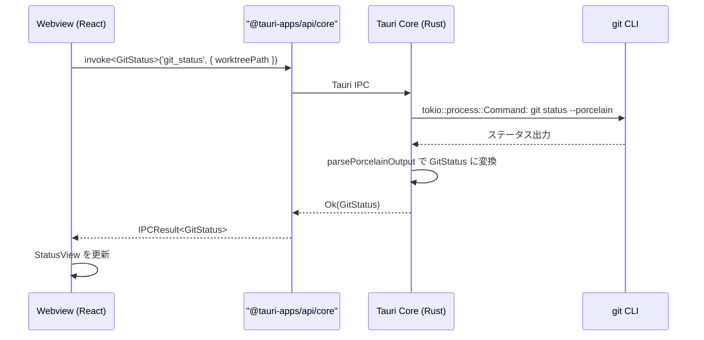
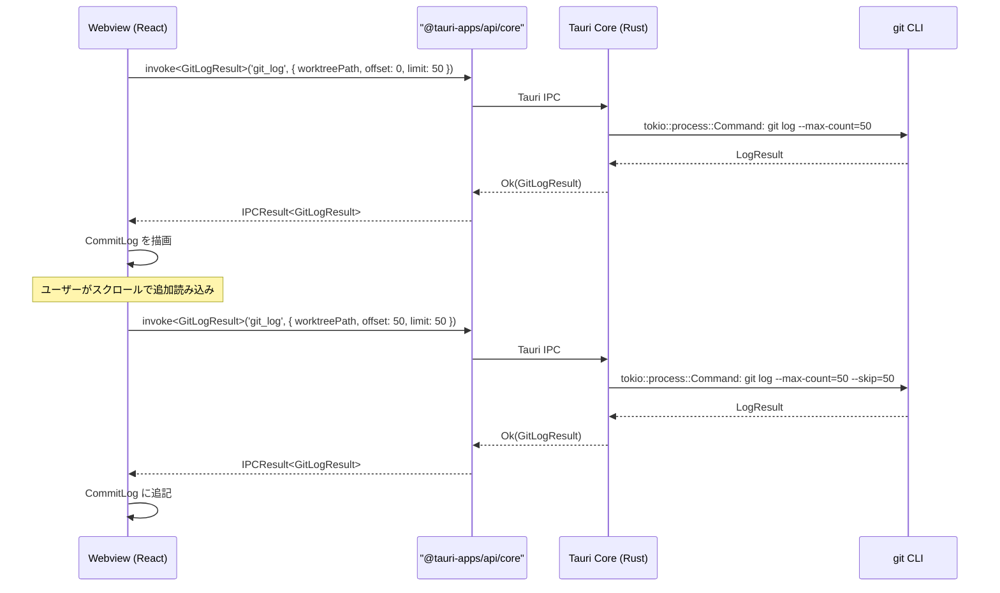
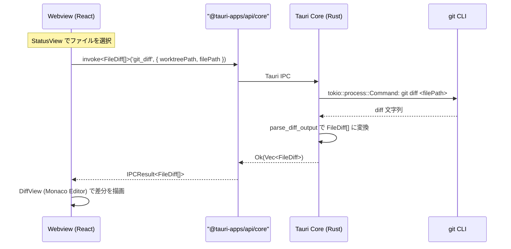
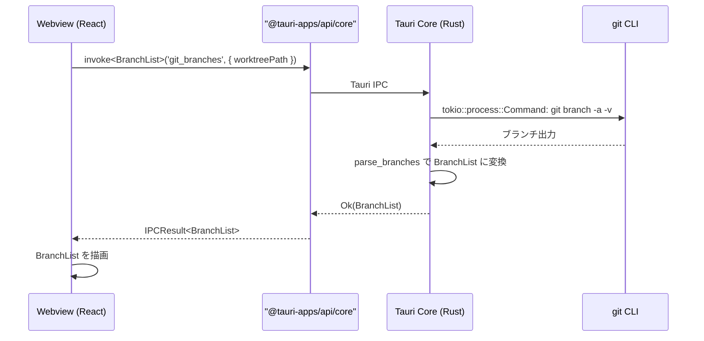

# リポジトリ閲覧

**関連 Design Doc:** [repository-viewer_design.md](./repository-viewer_design.md)
**関連 PRD:** [repository-viewer.md](../requirement/repository-viewer.md)

---

# 1. 背景

Buruma はワークツリーを主軸とした Git GUI アプリケーションである。ユーザーが左パネルでワークツリーを選択した後、右パネル（詳細パネル）にそのワークツリーの
Git 情報を表示する必要がある。

本仕様は PRD [repository-viewer.md](../requirement/repository-viewer.md) の要求（UR_201〜UR_204, FR_201〜FR_205,
NFR_201〜NFR_203）を実現するための論理設計を定義する。表示対象は、ステータス（変更ファイル一覧）、コミットログ、差分、ブランチ一覧、ファイルツリーの5つである。

# 2. 概要

リポジトリ閲覧機能は以下の5つのサブシステムで構成される：

1. **ステータス表示** — `git status` 相当の情報をステージ済み/未ステージ/未追跡に分類して表示する（FR_201）
2. **コミットログ表示** — コミット履歴のリスト表示、詳細表示、検索、ページネーションを提供する（FR_202）
3. **差分表示** — ファイル単位の差分をインラインまたはサイドバイサイドで表示する（FR_203）
4. **ブランチ一覧表示** — ローカル/リモートブランチの一覧と現在のブランチのハイライトを提供する（FR_204）
5. **ファイルツリー表示** — ワークツリー内のファイル構造をツリー形式で表示する（FR_205）

すべてのサブシステムは Tauri のアーキテクチャ（Webview / Tauri Core）に準拠し、原則 A-001（Tauri プロセス分離 /
Rust-TypeScript 境界）を遵守する。Git 操作は Tauri Core (Rust) で `tokio::process::Command` 経由の `git` CLI を介して実行し、結果を `IPCResult<T>` 互換ラッパー経由で返却する。

# 3. 要求定義

## 3.1. 機能要件 (Functional Requirements)

| ID     | 要件                                 | 優先度 | 根拠 (PRD)  |
|--------|------------------------------------|-----|-----------|
| FR-001 | ステージ済みファイルの一覧を表示する                 | 必須  | FR_201_01 |
| FR-002 | 未ステージファイルの一覧を表示する                  | 必須  | FR_201_02 |
| FR-003 | 未追跡ファイルの一覧を表示する                    | 必須  | FR_201_03 |
| FR-004 | 各ファイルの変更種別アイコン（追加/変更/削除/リネーム）を表示する | 必須  | FR_201_04 |
| FR-005 | ファイル選択による差分表示への連携を提供する             | 必須  | FR_201_05 |
| FR-006 | コミット一覧を表示する（ハッシュ短縮形、メッセージ、著者、日時）   | 推奨  | FR_202_01 |
| FR-007 | コミット選択による詳細表示（変更ファイル一覧、差分）を提供する    | 推奨  | FR_202_02 |
| FR-008 | コミットメッセージやファイル名での検索・フィルタリングを提供する   | 推奨  | FR_202_03 |
| FR-009 | ページネーションによる段階的読み込み（50件ずつ）を提供する     | 推奨  | FR_202_04 |
| FR-010 | ブランチグラフの簡易表示を提供する                  | 推奨  | FR_202_05 |
| FR-011 | インライン差分表示モード（追加行/削除行をハイライト）を提供する   | 必須  | FR_203_01 |
| FR-012 | サイドバイサイド差分表示モード（左右並列表示）を提供する       | 必須  | FR_203_02 |
| FR-013 | シンタックスハイライト付き差分表示を提供する             | 必須  | FR_203_03 |
| FR-014 | 差分表示モードの切り替えを提供する                  | 必須  | FR_203_04 |
| FR-015 | ハンク単位での折りたたみ/展開を提供する               | 必須  | FR_203_05 |
| FR-016 | ローカルブランチの一覧を表示する                   | 推奨  | FR_204_01 |
| FR-017 | リモートブランチの一覧を表示する                   | 推奨  | FR_204_02 |
| FR-018 | 現在のブランチをハイライト表示する                  | 推奨  | FR_204_03 |
| FR-019 | ブランチ名での検索・フィルタリングを提供する             | 推奨  | FR_204_04 |
| FR-020 | ディレクトリ/ファイルのツリー構造を表示する             | 任意  | FR_205_01 |
| FR-021 | ファイル選択による差分/内容表示への連携を提供する          | 任意  | FR_205_02 |
| FR-022 | 変更ファイルの視覚的マーキングを提供する               | 任意  | FR_205_03 |

## 3.2. 非機能要件 (Non-Functional Requirements)

| ID      | カテゴリ | 要件                         | 目標値  | 根拠 (PRD) |
|---------|------|----------------------------|------|----------|
| NFR-001 | 性能   | ステータス表示完了時間（変更ファイル数1000以下） | 2秒以内 | NFR_201  |
| NFR-002 | 性能   | コミットログ初期表示完了時間（最新50件）      | 1秒以内 | NFR_202  |
| NFR-003 | 性能   | 差分表示完了時間（単一ファイル、10000行以下）  | 1秒以内 | NFR_203  |

# 4. API

## 4.1. IPC API（Tauri Core ↔ Webview）

すべて Commands（Webview → Core, `invoke`）。Webview 側は `src/lib/invoke/commands.ts` の `invokeCommand<T>` ラッパー経由で呼び出す。

### 4.1.1. ステータス取得

| Command 名   | 概要                | 引数                         | 戻り値        |
|--------------|-------------------|----------------------------|--------------|
| `git_status` | ワークツリーのステータスを取得する | `{ worktreePath: string }` | `GitStatus`  |

### 4.1.2. コミットログ取得

| Command 名            | 概要                      | 引数                                       | 戻り値            |
|-----------------------|-------------------------|------------------------------------------|------------------|
| `git_log`             | コミットログを取得する（ページネーション対応） | `GitLogQuery`                            | `GitLogResult`   |
| `git_commit_detail`   | 特定コミットの詳細情報を取得する        | `{ worktreePath: string; hash: string }` | `CommitDetail`   |

### 4.1.3. 差分取得

| Command 名          | 概要               | 引数                                                          | 戻り値          |
|---------------------|------------------|-------------------------------------------------------------|----------------|
| `git_diff`          | ワーキングツリーの差分を取得する | `GitDiffQuery`                                              | `FileDiff[]`   |
| `git_diff_staged`   | ステージ済みの差分を取得する   | `GitDiffQuery`                                              | `FileDiff[]`   |
| `git_diff_commit`   | 特定コミットの差分を取得する   | `{ worktreePath: string; hash: string; filePath?: string }` | `FileDiff[]`   |

### 4.1.4. ブランチ一覧取得

| Command 名     | 概要          | 引数                         | 戻り値        |
|----------------|-------------|----------------------------|--------------|
| `git_branches` | ブランチ一覧を取得する | `{ worktreePath: string }` | `BranchList` |

### 4.1.5. ファイルツリー取得

| Command 名      | 概要                  | 引数                         | 戻り値          |
|-----------------|---------------------|----------------------------|----------------|
| `git_file_tree` | ワークツリーのファイルツリーを取得する | `{ worktreePath: string }` | `FileTreeNode` |

### 4.1.6. ファイルコンテンツ取得

| Command 名                   | 概要                                                   | 引数                                                             | 戻り値          |
|------------------------------|------------------------------------------------------|----------------------------------------------------------------|----------------|
| `git_file_contents`          | Monaco DiffEditor 用のファイル全体テキストを取得する（ワーキングツリーまたはステージ） | `{ worktreePath: string; filePath: string; staged?: boolean }` | `FileContents` |
| `git_file_contents_commit`   | 特定コミット時点のファイル全体テキストを取得する                             | `{ worktreePath: string; hash: string; filePath: string }`     | `FileContents` |

## 4.2. React コンポーネント API

| コンポーネント            | Props                   | 概要                                        |
|--------------------|-------------------------|-------------------------------------------|
| `StatusView`       | `StatusViewProps`       | ステータス表示（ステージ済み/未ステージ/未追跡の分類表示）            |
| `CommitLog`        | `CommitLogProps`        | コミットログ一覧（検索・ページネーション付き）                   |
| `CommitDetailView` | `CommitDetailViewProps` | コミット詳細表示（変更ファイル一覧・差分）                     |
| `DiffView`         | `DiffViewProps`         | 差分表示（インライン/サイドバイサイド切り替え、Monaco Editor 使用） |
| `BranchList`       | `BranchListProps`       | ブランチ一覧（ローカル/リモート、現在ブランチハイライト）             |
| `FileTree`         | `FileTreeProps`         | ファイルツリー表示（変更ファイルのマーキング付き）                 |

## 4.3. 型定義

```typescript
// ステータス情報
interface GitStatus {
    staged: FileChange[];
    unstaged: FileChange[];
    untracked: string[];
}

interface FileChange {
    path: string;
    status: FileChangeStatus;
    oldPath?: string; // リネーム時の元パス
}

type FileChangeStatus = 'added' | 'modified' | 'deleted' | 'renamed' | 'copied';

// コミットログ
interface GitLogQuery {
    worktreePath: string;
    offset: number;     // 開始位置（ページネーション）
    limit: number;      // 取得件数（デフォルト: 50）
    search?: string;    // 検索文字列（メッセージ、ファイル名）
}

interface GitLogResult {
    commits: CommitSummary[];
    total: number;       // 総コミット数
    hasMore: boolean;    // さらに取得可能か
}

interface CommitSummary {
    hash: string;
    hashShort: string;
    message: string;
    author: string;
    authorEmail: string;
    date: string;         // ISO 8601
    parents: string[];    // 親コミットハッシュ（ブランチグラフ用）
}

interface CommitDetail {
    hash: string;
    hashShort: string;
    message: string;
    author: string;
    authorEmail: string;
    date: string;
    parents: string[];
    files: CommitFileChange[];
}

interface CommitFileChange {
    path: string;
    status: FileChangeStatus;
    additions: number;
    deletions: number;
}

// 差分
interface GitDiffQuery {
    worktreePath: string;
    filePath?: string;    // 特定ファイルのみ取得する場合
}

interface FileDiff {
    filePath: string;
    oldFilePath?: string; // リネーム時
    status: FileChangeStatus;
    hunks: DiffHunk[];
    isBinary: boolean;
}

interface DiffHunk {
    oldStart: number;
    oldLines: number;
    newStart: number;
    newLines: number;
    header: string;       // @@ -x,y +a,b @@ ヘッダー
    lines: DiffLine[];
}

interface DiffLine {
    type: 'add' | 'delete' | 'context';
    content: string;
    oldLineNumber?: number;
    newLineNumber?: number;
}

// ブランチ
interface BranchList {
    current: string;                // 現在のブランチ名
    local: BranchInfo[];
    remote: BranchInfo[];
}

interface BranchInfo {
    name: string;
    hash: string;
    isHead: boolean;
    upstream?: string;              // リモートトラッキングブランチ
    ahead?: number;
    behind?: number;
}

// ファイルツリー
interface FileTreeNode {
    name: string;
    path: string;
    type: 'file' | 'directory';
    children?: FileTreeNode[];
    changeStatus?: FileChangeStatus;    // 変更ファイルのマーキング用
}

// ファイルコンテンツ（Monaco DiffEditor 用）
interface FileContents {
    original: string;   // 変更前テキスト
    modified: string;   // 変更後テキスト
    language: string;   // Monaco 言語 ID
}

// コンポーネント Props
interface StatusViewProps {
    worktreePath: string;
    onFileSelect: (filePath: string, staged: boolean) => void;
}

interface CommitLogProps {
    worktreePath: string;
    onCommitSelect: (hash: string) => void;
}

interface CommitDetailViewProps {
    worktreePath: string;
    commitHash: string;
    onFileSelect: (filePath: string) => void;
}

interface DiffViewProps {
    diffs: FileDiff[];
    mode: DiffDisplayMode;
    onModeChange: (mode: DiffDisplayMode) => void;
}

type DiffDisplayMode = 'inline' | 'side-by-side';

interface BranchListProps {
    worktreePath: string;
}

interface FileTreeProps {
    worktreePath: string;
    onFileSelect: (filePath: string) => void;
}

// IPCResult（application-foundation で定義済み）
type IPCResult<T> =
    | { success: true; data: T }
    | { success: false; error: IPCError };

interface IPCError {
    code: string;
    message: string;
    detail?: string;
}
```

# 5. 用語集

| 用語               | 説明                              |
|------------------|---------------------------------|
| ステージ済み (staged)  | `git add` でインデックスに追加された変更       |
| 未ステージ (unstaged) | 作業ツリーで変更されているがインデックスに追加されていない変更 |
| 未追跡 (untracked)  | Git の管理下にないファイル                 |
| ハンク (hunk)       | 差分の中の連続した変更ブロック                 |
| インライン差分          | 変更前後を同一カラムに表示する差分表示モード          |
| サイドバイサイド差分       | 変更前と変更後を左右に並べて表示する差分表示モード       |
| ページネーション         | データを一定件数ずつ分割して読み込む方式            |

# 6. 使用例

```tsx
import { invokeCommand } from '@/shared/lib/invoke'
import type { GitStatus, GitLogResult, FileDiff, BranchList } from '@/shared/domain'

// 以下は infrastructure 層（Repository 実装）での使用例
// React コンポーネントは ViewModel / UseCase 経由でのみデータを取得する（A-004 準拠）

// Webview 側：ステータスを取得
const status = await invokeCommand<GitStatus>('git_status', { worktreePath: '/path/to/worktree' })
if (status.success) {
    console.log('staged:', status.data.staged)
    console.log('unstaged:', status.data.unstaged)
    console.log('untracked:', status.data.untracked)
}

// Webview 側：コミットログを取得（最新50件）
const log = await invokeCommand<GitLogResult>('git_log', {
    worktreePath: '/path/to/worktree', offset: 0, limit: 50,
})

// Webview 側：ページネーションで次の50件を取得
const nextPage = await invokeCommand<GitLogResult>('git_log', {
    worktreePath: '/path/to/worktree', offset: 50, limit: 50,
})

// Webview 側：差分を取得
const diff = await invokeCommand<FileDiff[]>('git_diff', {
    worktreePath: '/path/to/worktree', filePath: 'src/main.ts',
})

// Webview 側：ブランチ一覧を取得
const branches = await invokeCommand<BranchList>('git_branches', {
    worktreePath: '/path/to/worktree',
})

// React コンポーネントの使用例
<StatusView
    worktreePath={selectedWorktree.path}
    onFileSelect={(filePath, staged) => showDiff(filePath, staged)}
/>

<CommitLog
    worktreePath={selectedWorktree.path}
    onCommitSelect={(hash) => showCommitDetail(hash)}
/>

<DiffView
    diffs={currentDiffs}
    mode={diffMode}
    onModeChange={setDiffMode}
/>
```

# 7. 振る舞い図

## 7.1. ステータス取得フロー



## 7.2. コミットログ取得フロー（ページネーション付き）



## 7.3. 差分表示フロー



## 7.4. ブランチ一覧取得フロー



# 8. 制約事項

- Webview から OS API（fs / process / shell）に直接アクセスしない（原則 A-001）
- Git 操作は必ず Tauri Core (Rust) で実行する（原則 A-001, A-002）
- IPC 通信は `IPCResult<T>` 互換ラッパー（`invokeCommand<T>`）で統一する（application-foundation FR_604 準拠）
- 差分表示には Monaco Editor を使用する（原則 A-002、CONSTITUTION 技術スタック制約）
- 大規模リポジトリ対応のためページネーション・仮想スクロールを適用する
- ワークツリー管理機能（prd-worktree-management）および IPC 通信基盤（application-foundation FR_604）が前提

---

# PRD 整合性確認

| PRD 要求 ID | 本仕様での対応                                                          | ステータス |
|-----------|------------------------------------------------------------------|-------|
| UR_201    | 仕様全体                                                             | 対応済み  |
| UR_202    | FR-001〜FR-005 + `git_status` API                                   | 対応済み  |
| UR_203    | FR-006〜FR-010 + `git_log` / `git_commit_detail` API                  | 対応済み  |
| UR_204    | FR-011〜FR-015 + `git_diff` / `git_diff_staged` / `git_diff_commit` API | 対応済み  |
| FR_201    | FR-001〜FR-005 + StatusView コンポーネント                               | 対応済み  |
| FR_202    | FR-006〜FR-010 + CommitLog / CommitDetailView コンポーネント             | 対応済み  |
| FR_203    | FR-011〜FR-015 + DiffView コンポーネント                                 | 対応済み  |
| FR_204    | FR-016〜FR-019 + BranchList コンポーネント                               | 対応済み  |
| FR_205    | FR-020〜FR-022 + FileTree コンポーネント                                 | 対応済み  |
| NFR_201   | NFR-001（ステータス表示2秒以内）                                             | 対応済み  |
| NFR_202   | NFR-002（コミットログ初期表示1秒以内）                                          | 対応済み  |
| NFR_203   | NFR-003（差分表示1秒以内）                                                | 対応済み  |
