# Tauri v2 + Rust への全面移行

**関連 Spec:** [tauri-migration_spec.md](./tauri-migration_spec.md)
**関連 PRD:** [tauri-migration.md](../requirement/tauri-migration.md)

---

# 1. 実装ステータス

**ステータス:** 🟡 進行中（Phase P 完了、Phase IA〜IG 完了、Phase IH 部分完了）

## 1.1. 実装進捗

| Phase | 内容 | ステータス |
|:---|:---|:---|
| Phase P0 | `migration-rfc.md` 配置 | 🟢 完了 |
| Phase P1 | `CONSTITUTION.md` v1.0.0 → v2.0.0 | 🟢 完了 |
| Phase P2 | TEMPLATE 3 種の Tauri 版刷新 | 🟢 完了 |
| Phase P3 | PRD 7 ファイル技術中立化 + `tauri-migration.md` 作成 | 🟢 完了 |
| Phase P4 | Spec 7 ファイル刷新 + `tauri-migration_spec.md` 作成 | 🟢 完了 |
| Phase P5 | Design 7 ファイル刷新 + 本ファイル作成 | 🟢 完了 |
| Phase P6 | Phase P 全体検証 | 🟢 完了 |
| Phase IA | Tauri 初期化 + ディレクトリ再配置 + 疎通確認 | 🟢 完了 |
| Phase IB | application-foundation feature 移行 | 🟢 完了 |
| Phase IC | worktree-management feature 移行 | 🟢 完了 |
| Phase ID | repository-viewer feature 移行 | 🟢 完了 |
| Phase IE | basic-git-operations feature 移行 | 🟢 完了 |
| Phase IF | advanced-git-operations feature 移行 | 🟢 完了 |
| Phase IG | claude-code-integration feature 移行 | 🟢 完了 |
| Phase IH | Electron 依存削除・shim 削除・CLAUDE.md 更新 | 🟡 部分完了（Electron 依存パッケージ削除完了、残: CLAUDE.md パスエイリアス更新、IPCChannelMap 型安全化） |

---

# 2. 設計目標

1. **既存機能の完全維持** — 移行中・完了後も既存の全機能（リポジトリ管理、worktree 操作、Git 基本/高度操作、リポジトリ閲覧、Claude Code 連携）を維持する（DC_M02）
2. **requirement ID の不変性** — 既存の UR/FR/NFR/DC ID を変更せず、本文のみ技術中立な表現に書き換える（DC_M01）
3. **段階的移行** — Phase IA で互換 shim を導入し、feature 単位で `invoke` 呼び出しに段階置換する
4. **git CLI shell out 方式の採用** — 既存 `simple-git.raw()` の実装実態に合わせ、`tokio::process::Command` 経由の `git` CLI で実装する（DC_M03）
5. **IPCResult<T> 互換維持** — Webview 側の既存 `IPCResult<T>` パターンを維持し、Rust 側 `Result<T, AppError>` をラッパーで変換する（FR_M02）
6. **Pure Rust ドメイン/アプリケーション層** — Rust 側の domain / application 層は `tauri::*` 非依存とし、`mockall` + `tokio::test` で単体テスト可能とする（A-007）
7. **型安全性の維持** — Rust struct は `#[serde(rename_all = "camelCase")]` で TypeScript 型と整合させ、新規 command 追加時は同一 PR で両側を更新する（FR_M04）

---

# 3. 技術スタック

| 領域 | 採用技術 | 選定理由 |
|:---|:---|:---|
| Tauri | Tauri 2.x | Rust バックエンド、小バイナリサイズ、セキュリティモデル |
| Rust 非同期 | `tokio` (full features) | Tauri 標準、`tokio::process::Command` 等を使用 |
| Rust エラー | `thiserror` + `AppError` enum | 統一エラー型、`From<_>` 実装で自動変換 |
| Rust テスト | `cargo test` + `mockall` | trait モック化、純粋な UseCase テスト |
| Git 操作 | `tokio::process::Command` 経由の `git` CLI | 既存 `simple-git.raw()` 実装の 1:1 移植、`git worktree add` / SSH 認証 / diff 出力の互換性維持 |
| ファイル監視 | `notify` + `notify-debouncer-full` | クロスプラットフォーム、300ms debounce 対応 |
| 永続化 | `tauri-plugin-store` | Tauri 標準プラグイン、JSON 形式、`electron-store` と同等機能 |
| ダイアログ | `tauri-plugin-dialog` | Tauri 標準プラグイン |
| IPC | Tauri `invoke<T>()` / `listen<T>()` | 型安全な RPC、kebab-case event 命名 |
| ビルド | Tauri CLI + Vite 6 | Vite ネイティブ対応、HMR 維持 |

<details>
<summary>プロジェクト共通スタック（参考）</summary>

| 領域              | 採用技術                                     |
|----------------|------------------------------------------|
| フレームワーク      | Tauri 2.x                                |
| バックエンド言語    | Rust (edition 2021+)                     |
| バンドラー          | Vite 6                                   |
| UI                | React 19 + TypeScript 5.x                |
| スタイリング        | Tailwind CSS v4 (`@tailwindcss/postcss`) |
| UIコンポーネント    | Shadcn/ui                                |
| Git 操作            | `tokio::process::Command` 経由の `git` CLI   |
| ファイル監視        | `notify` + `notify-debouncer-full` crate |
| 永続化              | `tauri-plugin-store`                     |
| ダイアログ          | `tauri-plugin-dialog`                    |
| エディタ            | Monaco Editor                            |
| Rust 非同期        | `tokio`                                  |
| Rust エラー        | `thiserror` + `AppError`                 |
| Rust テスト        | `cargo test` + `mockall`                 |
| DI (Webview)        | VContainer                               |
| DI (Rust)           | `tauri::State<T>` + `Arc<dyn Trait>`     |

</details>

---

# 4. アーキテクチャ

## 4.1. 全体構成図

```mermaid
graph TD
    subgraph "Webview (React 19 + Vite 6)"
        direction TB
        UI[React Components]
        VM[ViewModels]
        Hook[Hook Wrappers]
        Repo[Infrastructure Repository]
        InvokeWrap["invokeCommand<T> / listenEvent<T><br/>src/shared/lib/invoke/"]
        API["@tauri-apps/api/core + /event"]
        UI --> Hook --> VM --> Repo
        Repo --> InvokeWrap
        InvokeWrap --> API
    end

    subgraph "Tauri Runtime"
        Bridge[IPC Bridge<br/>invoke / emit]
    end

    subgraph "Tauri Core (Rust)"
        direction TB
        Cmd["#[tauri::command] 関数<br/>presentation/commands.rs"]
        UC[UseCases<br/>application/usecases/]
        Trait[Repository trait<br/>application/repositories.rs]
        Impl[Repository impl<br/>infrastructure/]
        State["AppState<br/>Arc<dyn Trait>"]
        Cmd --> UC --> Trait
        Trait -.->|DI via State| Impl
        Impl --> Git["tokio::process::Command<br/>git CLI"]
        Impl --> Store["tauri-plugin-store"]
        Impl --> Dialog["tauri-plugin-dialog"]
        Impl --> Watch["notify + notify-debouncer-full"]
        Impl --> Proc["tokio::process::Command<br/>claude CLI"]
    end

    API -->|"invoke<T>('cmd_name')"| Bridge
    Bridge --> Cmd
    Impl -.->|"app_handle.emit('event-name')"| Bridge
    Bridge -.-> API
```



## 4.2. ディレクトリ構造（Option B: Tauri 標準）

```
/                                    # プロジェクトルート
├── src/                             # TypeScript (Webview)
│   ├── main.tsx                     # React エントリ（旧 processes/renderer/index.tsx）
│   ├── App.tsx
│   ├── features/                    # 旧 processes/renderer/features/*
│   │   ├── application-foundation/
│   │   ├── worktree-management/
│   │   ├── repository-viewer/
│   │   ├── basic-git-operations/
│   │   ├── advanced-git-operations/
│   │   └── claude-code-integration/
│   ├── di/                          # 旧 processes/renderer/di/
│   ├── components/                  # 旧 processes/renderer/components/
│   │   └── ui/                      # Shadcn/ui
│   └── shared/
│       ├── domain/                  # 旧 src/domain/
│       └── lib/                     # 旧 src/lib/
│           ├── di/                  # VContainer
│           ├── hooks/
│           ├── usecase/
│           ├── service/
│           ├── invoke/              # ★新規: Tauri ラッパー
│           │   ├── index.ts
│           │   ├── commands.ts      # invokeCommand<T>
│           │   ├── events.ts        # listenEvent<T>
│           │   ├── tauri-api.ts     # TauriAPI 型
│           │   └── electron-shim.ts # ★Phase IA で追加、IH で削除
│           └── ipc.ts               # IPCResult<T>, IPCError 型
├── src-tauri/                       # Rust (Tauri Core)
│   ├── Cargo.toml
│   ├── tauri.conf.json
│   ├── build.rs
│   ├── capabilities/
│   │   └── default.json             # Tauri capabilities allowlist
│   ├── icons/
│   └── src/
│       ├── main.rs
│       ├── lib.rs                   # tauri::Builder + invoke_handler
│       ├── error.rs                 # AppError (thiserror + Serialize)
│       ├── state.rs                 # AppState
│       ├── events.rs                # emit ヘルパー（※注記参照）
│       ├── git/                     # 共通 git CLI ラッパー
│       │   ├── mod.rs
│       │   ├── command.rs           # tokio::process::Command ヘルパー
│       │   ├── porcelain.rs         # parsePorcelainOutput 移植
│       │   ├── diff_parser.rs       # parseDiffOutput 移植
│       │   └── log_parser.rs        # parseLogOutput 移植
│       └── features/
│           ├── application_foundation/
│           │   ├── mod.rs
│           │   ├── domain.rs
│           │   ├── application/
│           │   │   ├── repositories.rs
│           │   │   └── usecases/
│           │   ├── infrastructure/
│           │   │   ├── store.rs
│           │   │   ├── dialog.rs
│           │   │   └── git_validation.rs
│           │   └── presentation/
│           │       └── commands.rs
│           ├── worktree_management/   # 同じ 4 層構成
│           ├── repository_viewer/
│           ├── basic_git_operations/
│           ├── advanced_git_operations/
│           └── claude_code_integration/
├── vite.config.ts                   # 統合 Vite 設定
├── index.html
├── tsconfig.json                    # @/*, @domain, @lib エイリアス
└── package.json
```

> **注記**: 実装では `events.rs` は作成せず、各 infrastructure 実装内で直接 `app_handle.emit(...)` を呼び出している。

## 4.3. 主要コンポーネントの役割

### 4.3.1. `invokeCommand<T>` ラッパー（`src/shared/lib/invoke/commands.ts`）

Webview 側の全 Repository 実装はこのラッパー経由で Tauri command を呼び出す。Rust 側の `Result<T, AppError>` を JavaScript の reject として受け取り、`IPCResult<T>` 形式に変換する。

```typescript
import { invoke } from '@tauri-apps/api/core'
import type { IPCResult, IPCError } from '@/shared/lib/ipc'

export async function invokeCommand<T>(
  cmd: string,
  args?: Record<string, unknown>,
): Promise<IPCResult<T>> {
  try {
    const data = await invoke<T>(cmd, args)
    return { success: true, data }
  } catch (e) {
    const error: IPCError =
      typeof e === 'object' && e !== null && 'code' in e
        ? (e as IPCError)
        : { code: 'INTERNAL_ERROR', message: e instanceof Error ? e.message : String(e) }
    return { success: false, error }
  }
}
```

### 4.3.2. `listenEvent<T>` ラッパー（`src/shared/lib/invoke/events.ts`）

```typescript
import { listen, type UnlistenFn } from '@tauri-apps/api/event'

export async function listenEvent<T>(
  eventName: string,
  callback: (payload: T) => void,
): Promise<UnlistenFn> {
  return await listen<T>(eventName, (event) => callback(event.payload))
}
```

### 4.3.3. 互換 shim（`src/shared/lib/invoke/electron-shim.ts`、Phase IA で追加）

既存 renderer 側の `window.electronAPI.*` 呼び出しをそのまま動作させるための後方互換レイヤー。Phase IA で導入し、Phase IH で削除する。

```typescript
import { invokeCommand } from './commands'
import { listenEvent } from './events'
import type { ElectronAPI } from '@/shared/lib/ipc'

function listenBridge<T>(eventName: string, cb: (payload: T) => void): () => void {
  let unlisten: (() => void) | null = null
  listenEvent<T>(eventName, cb).then((fn) => {
    unlisten = fn
  })
  return () => {
    unlisten?.()
  }
}

export function installElectronShim(): void {
  const api: ElectronAPI = {
    repository: {
      open: () => invokeCommand('repository_open'),
      openByPath: (path) => invokeCommand('repository_open_path', { path }),
      // ...
    },
    worktree: {
      list: (repoPath) => invokeCommand('worktree_list', { repoPath }),
      onChanged: (cb) => listenBridge('worktree-changed', cb),
      // ...
    },
    // ... 全 83 メソッドを提供
  }
  ;(window as unknown as { electronAPI: ElectronAPI }).electronAPI = api
}
```

### 4.3.4. Rust 側 `AppState`（`src-tauri/src/state.rs`）

```rust
use std::sync::Arc;
use tauri::AppHandle;
use crate::features::application_foundation::application::repositories::*;
use crate::features::worktree_management::application::repositories::*;
// ... 他 feature の Repository trait

pub struct AppState {
    pub app_handle: AppHandle,
    pub store_repo: Arc<dyn StoreRepository>,
    pub git_validation_repo: Arc<dyn GitValidationRepository>,
    pub dialog_repo: Arc<dyn DialogRepository>,
    pub git_advanced_repo: Arc<dyn GitAdvancedRepository>,
    pub claude_repo: Arc<dyn ClaudeRepository>,
    pub git_write_repo: Arc<dyn GitWriteRepository>,
    pub git_read_repo: Arc<dyn GitReadRepository>,
    pub worktree_repo: Arc<dyn WorktreeGitRepository>,
}

impl AppState {
    pub fn new(app_handle: AppHandle) -> anyhow::Result<Self> {
        // 各 Repository を構築
        let store_repo: Arc<dyn StoreRepository> = Arc::new(DefaultStoreRepository::new(&app_handle)?);
        let dialog_repo: Arc<dyn DialogRepository> = Arc::new(DefaultDialogRepository::new(&app_handle));
        let git_validation_repo: Arc<dyn GitValidationRepository> = Arc::new(DefaultGitValidationRepository);
        // ... 以下同様

        Ok(Self {
            app_handle,
            store_repo,
            git_validation_repo,
            dialog_repo,
            // ...
        })
    }
}
```

### 4.3.5. Rust 側 `AppError`（`src-tauri/src/error.rs`）

```rust
use serde::{Serialize, Serializer};
use thiserror::Error;

#[derive(Debug, Error)]
pub enum AppError {
    #[error("IO error: {0}")]
    Io(#[from] std::io::Error),
    #[error("Git error: {0}")]
    Git(String),
    #[error("Git operation error [{code}]: {message}")]
    GitOperation { code: String, message: String },
    #[error("Validation error: {0}")]
    Validation(String),
    #[error("Not found: {0}")]
    NotFound(String),
    #[error("Store error: {0}")]
    Store(String),
    #[error("Dialog cancelled")]
    DialogCancelled,
    #[error("Claude CLI error: {0}")]
    ClaudeCli(String),
    #[error("Internal error: {0}")]
    Internal(String),
}

impl Serialize for AppError {
    fn serialize<S: Serializer>(&self, serializer: S) -> Result<S::Ok, S::Error> {
        #[derive(Serialize)]
        struct Err<'a> {
            code: &'a str,
            message: String,
            detail: Option<&'a str>,
        }
        let (code, message, detail) = match self {
            AppError::Io(e) => ("IO_ERROR", e.to_string(), None),
            AppError::Git(msg) => ("GIT_ERROR", msg.clone(), None),
            AppError::GitOperation { code, message } => (code.as_str(), message.clone(), None),
            AppError::Validation(msg) => ("VALIDATION_ERROR", msg.clone(), None),
            AppError::NotFound(msg) => ("NOT_FOUND", msg.clone(), None),
            AppError::Store(msg) => ("STORE_ERROR", msg.clone(), None),
            AppError::DialogCancelled => ("DIALOG_CANCELLED", "dialog cancelled".into(), None),
            AppError::ClaudeCli(msg) => ("CLAUDE_CLI_ERROR", msg.clone(), None),
            AppError::Internal(msg) => ("INTERNAL_ERROR", msg.clone(), None),
        };
        Err { code, message, detail }.serialize(serializer)
    }
}

pub type AppResult<T> = Result<T, AppError>;
```

---

# 5. 移行ステップ詳細（Phase I）

## Phase IA: メイン基盤セットアップ

**目標**: Tauri プロジェクト初期化 + ディレクトリ再配置 + 疎通確認

**手順**:
1. Tauri CLI 導入: `npm i -D @tauri-apps/cli`、`npm i @tauri-apps/api @tauri-apps/plugin-dialog @tauri-apps/plugin-store`
2. `npx tauri init` → `src-tauri/` スキャフォールド
3. `src-tauri/Cargo.toml` に必要 crate 追加: `tauri`, `tauri-plugin-dialog`, `tauri-plugin-store`, `serde`, `thiserror`, `tokio (full)`, `notify 6`, `notify-debouncer-full`, `anyhow`, `uuid`, `chrono`, `async-trait`, `tracing`, `mockall` (dev)
4. `src-tauri/src/main.rs` + `src/lib.rs` の雛形、`error.rs`, `state.rs`（空）、`git/` サブモジュール配置
5. `src-tauri/tauri.conf.json` 作成（window 1280x800, CSP `default-src 'self'; script-src 'self' 'unsafe-eval'; worker-src blob:`、identifier `com.toshikiimagawa.buruma`）
6. `src-tauri/capabilities/default.json` 作成（最小限: `core:default`, `dialog:default`, `dialog:allow-open`, `store:default`）
7. **ディレクトリ再配置（Option B）**:
   - `src/processes/renderer/index.tsx` → `src/main.tsx`
   - `src/processes/renderer/App.tsx` → `src/App.tsx`
   - `src/processes/renderer/features/*` → `src/features/*`
   - `src/processes/renderer/components/*` → `src/components/*`
   - `src/processes/renderer/di/*` → `src/di/*`
   - `src/domain/*` → `src/shared/domain/*`
   - `src/lib/*` → `src/shared/lib/*`
8. `tsconfig.json` 更新: `@main/*` `@preload/*` `@renderer/*` 削除、`@/*` → `./src/*` 追加、`@domain/*` → `./src/shared/domain/*`、`@lib/*` → `./src/shared/lib/*`
9. `vite.config.ts` 統合: `vite.main.config.ts` / `vite.preload.config.ts` / `vite.renderer.config.ts` を削除して `vite.config.ts` 1 本に
10. `package.json` scripts 変更: `dev`, `build`, `tauri dev`, `tauri build`, `lint` (eslint + cargo clippy), `typecheck` (tsc + cargo check), `test` (vitest + cargo test)
11. `src/shared/lib/invoke/` 配下を新規作成: `commands.ts`, `events.ts`, `tauri-api.ts`, `electron-shim.ts`
12. Phase IA 専用: `#[tauri::command] fn ping(msg: String) -> String` を `src-tauri/src/lib.rs` に追加
13. `src/main.tsx` で `installElectronShim()` + 疎通 `invoke<string>('ping', { msg: 'hello' })`
14. `npm run tauri dev` で起動確認、既存 UI の描画確認（IPC 呼び出しはこの時点ではエラーで OK）
15. **Electron 依存削除**: `src/processes/main/` / `src/processes/preload/` / `forge.config.ts` / `vite.main.config.ts` / `vite.preload.config.ts` / `.vite/` / `out/` を削除

**完了条件**:
- [ ] `npm run tauri dev` でウィンドウ起動、React アプリ描画、`ping` 応答確認
- [ ] `npm run tauri build --no-bundle` 成功
- [ ] 既存 Vitest テストが（IPC モックを修正して）pass

## Phase IB〜IG: feature 別移行

各 feature について以下のテンプレートに従う:

1. **Rust 側**: `src-tauri/src/features/{feature_name}/` に 4 層ディレクトリを作成
2. **domain.rs**: `src/shared/domain/` から該当型を serde 付き struct として移植
3. **application/repositories.rs**: Repository trait を `async_trait` で定義
4. **application/usecases/*.rs**: UseCase を `Arc<dyn Trait>` で配線
5. **infrastructure/*.rs**: Repository impl（`tokio::process::Command` で git CLI 呼び出し、`parse_*` 関数を TypeScript から 1:1 移植）
6. **presentation/commands.rs**: `#[tauri::command]` 関数群
7. **`src-tauri/src/lib.rs` の `invoke_handler![...]`** に追加、`AppState::new` に UseCase 追加
8. **Webview 側**: `src/features/{feature}/infrastructure/repositories/*.ts` を `invokeCommand<T>` 直呼びに書き換え
9. **Rust + TypeScript テスト** を実行、動作確認

### Phase IB: application-foundation
- 対象: `repository_*` (6), `settings_*` (4), event `error-notify`
- 移植: `DefaultStoreRepository` (`tauri-plugin-store`), `DefaultDialogRepository` (`tauri-plugin-dialog::blocking_pick_folder`), `DefaultGitValidationRepository` (`git rev-parse --is-inside-work-tree`)
- 10 UseCase: `OpenRepositoryWithDialogUseCase`, `OpenRepositoryByPathUseCase`, `GetRecentRepositoriesUseCase`, `RemoveRecentRepositoryUseCase`, `PinRepositoryUseCase`, `GetSettingsUseCase`, `UpdateSettingsUseCase`, `GetThemeUseCase`, `UpdateThemeUseCase`, `ValidateRepositoryUseCase`

### Phase IC: worktree-management
- 対象: `worktree_*` (7), event `worktree-changed`
- 移植: 既存 `worktree-git-default-repository.ts` の全機能（100% `git.raw()` ベース）、`parsePorcelainOutput` / `parseStatusLine` を Rust に 1:1 移植
- `notify-debouncer-full` で `.git/worktrees` 監視、300ms debounce → `app_handle.emit('worktree-changed', event)`

### Phase ID: repository-viewer
- 対象: `git_status`, `git_log`, `git_commit_detail`, `git_diff`, `git_diff_staged`, `git_diff_commit`, `git_branches`, `git_file_tree`, `git_file_contents`, `git_file_contents_commit` (10)
- 最大の移植: `diff_parser.rs`（TypeScript `parseDiffOutput` を 1:1）、`log_parser.rs`（`parseLogOutput` を 1:1）、`file-tree-builder.ts` を Rust に
- log ページング: `--skip=offset --max-count=limit` + `rev-list --count`
- 言語検出は TypeScript 側（`src/shared/lib/detect-language.ts`）で継続

### Phase IE: basic-git-operations
- 対象: stage/stageAll/unstage/unstageAll/commit/push/pull/fetch/branchCreate/branchCheckout/branchDelete/reset (12), event `git-progress`
- `src/git/command.rs` に `raw_with_progress()` 実装: `git --progress` の stderr を `tokio::io::BufReader` で逐次読み取り、正規表現で `GitProgressEvent` 生成 → `app_handle.emit('git-progress', event)`
- Push/Pull の認証: `env_clear() + std::env::vars()` 継承で親の `SSH_AUTH_SOCK` / `GIT_CREDENTIAL_HELPER` 引き継ぎ
- macOS `.app` 起動時の PATH 問題対策: 起動時に `/bin/zsh -lc 'echo $PATH'` で完全 PATH を取得
- `GitOperationError` (`NO_UPSTREAM`, `PUSH_REJECTED`, `BRANCH_NOT_MERGED`) を `AppError::GitOperation { code, message }` で表現

### Phase IF: advanced-git-operations
- 対象: merge/rebase (+interactive/abort/continue/get-commits)/stash/cherry-pick/conflict 解決/tag (24)
- 既存 `git-advanced-default-repository.ts` (360 行) を Rust に 1:1 翻訳
- conflict file content: `git show :1:path` / `:2:path` / `:3:path` による base/ours/theirs 取得
- interactive rebase: 既存の TODO スクリプト生成 + `GIT_SEQUENCE_EDITOR=echo` 方式を Rust で再現

### Phase IG: claude-code-integration
- 対象: start/stop/get/getAll session, sendCommand, getOutput, checkAuth, login, logout, reviewDiff, explainDiff, generateCommitMessage (12), 5 events
- `ClaudeSessionStore`: `Arc<Mutex<HashMap<String, InternalSession>>>` でワークツリー別セッション管理
- `ClaudeProcessManager`: `tokio::process::Command::new("claude").arg("-p").arg(input).current_dir(worktree_path).spawn()`
  - stdout/stderr を `tokio::spawn` で async BufReader 読み取り → 逐次 `app_handle.emit('claude-output', output)`
  - `child.wait().await` → `claude-command-completed` emit
- ANSI エスケープは Webview 側 (`ansi-to-html`) で処理継続
- 既存 `ClaudeDefaultOutputParser` の正規表現パーサーを Rust に移植 → `review-result` / `explain-result` emit
- PATH 問題対策: 起動時に `which claude` で絶対パスを記録

## Phase IH: クリーンアップ

1. **依存削除**: `electron`, `@electron-forge/*`, `@electron/fuses`, `@types/electron-squirrel-startup`, `electron-squirrel-startup`, `electron-store`, `simple-git`, `chokidar` を `npm uninstall`
2. **shim 削除**: `src/shared/lib/invoke/electron-shim.ts` を削除、`src/main.tsx` の `installElectronShim()` 呼び出しを削除
3. **`src/shared/lib/ipc.ts` の整理**: `ElectronAPI` 型と `declare global { interface Window { electronAPI: ElectronAPI } }` を削除、`IPCResult<T>` / `IPCError` / `ipcSuccess` / `ipcFailure` は維持
4. **presentation 層の直接呼び出し書き換え**（shim 廃止に伴い必須）:
   - `src/features/basic-git-operations/presentation/commit-viewmodel.ts`
   - `src/features/basic-git-operations/presentation/components/push-pull-buttons.tsx`
   - `src/features/claude-code-integration/presentation/components/ClaudeSessionPanel.tsx`
   - `src/features/repository-viewer/presentation/components/DiffView.tsx`
   - `src/features/repository-viewer/presentation/components/RepositoryDetailPanel.tsx`
   - `src/features/worktree-management/presentation/components/WorktreeCreateDialog.tsx`
   - `src/features/repository-viewer/presentation/components/__tests__/DiffView.test.tsx`
5. **`vitest.setup.ts`** に `@tauri-apps/api/core` と `@tauri-apps/api/event` のグローバルモックを追加
6. **`CLAUDE.md`** 更新（プロジェクト構造・技術スタック・開発コマンドを Tauri 版に刷新）
7. **CI 設定** (`.github/workflows/`) に Rust toolchain 追加: `dtolnay/rust-toolchain@stable` + `Swatinem/rust-cache@v2` + `cargo test` + `cargo clippy`
8. **動作確認**: `npm run tauri dev` / `npm run tauri build` / `npm run test` / `cd src-tauri && cargo test` が全て成功

---

# 6. インターフェース定義

## 6.1. Rust 側 `#[tauri::command]` 定義例

```rust
// src-tauri/src/features/application_foundation/presentation/commands.rs
use tauri::State;
use crate::state::AppState;
use crate::error::AppResult;
use crate::features::application_foundation::domain::{RepositoryInfo, RecentRepository};

#[tauri::command]
pub async fn repository_open(state: State<'_, AppState>) -> AppResult<Option<RepositoryInfo>> {
    state.open_repository_dialog_usecase.invoke().await
}

#[tauri::command]
pub async fn repository_open_path(
    path: String,
    state: State<'_, AppState>,
) -> AppResult<Option<RepositoryInfo>> {
    state.open_repository_by_path_usecase.invoke(&path).await
}

#[tauri::command]
pub async fn repository_get_recent(state: State<'_, AppState>) -> AppResult<Vec<RecentRepository>> {
    state.get_recent_repositories_usecase.invoke().await
}
```

## 6.2. Webview 側 Repository 実装例

```typescript
// src/features/application-foundation/infrastructure/repositories/repository-default-repository.ts
import { invokeCommand } from '@/shared/lib/invoke'
import type { RepositoryInfo, RecentRepository } from '@/shared/domain'
import type { RepositoryRepository } from '../../application/repositories/repository-repository'

export class RepositoryDefaultRepository implements RepositoryRepository {
  async open(): Promise<RepositoryInfo | null> {
    const result = await invokeCommand<RepositoryInfo | null>('repository_open')
    if (!result.success) throw new Error(result.error.message)
    return result.data
  }

  async openByPath(path: string): Promise<RepositoryInfo | null> {
    const result = await invokeCommand<RepositoryInfo | null>('repository_open_path', { path })
    if (!result.success) throw new Error(result.error.message)
    return result.data
  }

  async getRecent(): Promise<RecentRepository[]> {
    const result = await invokeCommand<RecentRepository[]>('repository_get_recent')
    if (!result.success) throw new Error(result.error.message)
    return result.data
  }
  // ...
}
```

## 6.3. イベント購読例

```rust
// Rust 側: emit
use tauri::{AppHandle, Emitter};

pub fn emit_worktree_changed(handle: &AppHandle, event: WorktreeChangeEvent) -> AppResult<()> {
    handle
        .emit("worktree-changed", event)
        .map_err(|e| AppError::Internal(e.to_string()))
}
```

```typescript
// Webview 側: listen
import { listenEvent } from '@/shared/lib/invoke'
import type { WorktreeChangeEvent } from '@/shared/domain'

const unlisten = await listenEvent<WorktreeChangeEvent>('worktree-changed', (event) => {
  // handle event
})

// cleanup
unlisten()
```

---

# 7. 非機能要件実現方針

| 要件 | 実現方針 |
|------|----------|
| NFR_M01: テストカバレッジ維持 | 既存 Vitest は `@tauri-apps/api` モックに切り替え。Rust 側は `cargo test` + `mockall` で UseCase / Repository / パーサーをテスト |
| NFR_M02: 起動時間 3 秒以内 | Tauri のネイティブバイナリ起動 + Vite HMR。初期データ読み込みを `AppState::new` で最小化 |
| NFR_M03: IPC レイテンシ 50ms 以内 | Tauri の IPC bridge は WebKit/Edge の postMessage ベースで十分高速。`tokio::process::Command` の spawn オーバーヘッドは数 ms |
| DC_M01: requirement ID 不変 | 全 PRD の UR/FR/NFR/DC ID を維持、本文のみ技術中立化 |
| DC_M02: UI/UX 維持 | React コンポーネントは変更せず、infrastructure 層のみ書き換え |
| DC_M03: git CLI shell out | `tokio::process::Command` で `git` コマンド実行、既存パーサーを Rust に 1:1 移植 |
| DC_M04: ディレクトリ再配置 | Phase IA で一括再配置、`tsconfig.json` と `vite.config.ts` のエイリアスを更新 |

---

# 8. テスト戦略

## 8.1. Rust 側（新規）

- **ユニットテスト**: `cargo test`、各 UseCase を `mockall` で trait モック化
- **結合テスト**: `src-tauri/tests/integration/` で純粋な Rust 層テスト（Tauri 無しで AppState を合成）
- **パーサーテスト**: `diff_parser`, `porcelain_parser`, `log_parser` を既存 TypeScript と同じ fixture で並行検証

```rust
#[cfg(test)]
mod tests {
    use super::*;
    use mockall::predicate::*;

    #[tokio::test]
    async fn open_repository_with_dialog_happy_path() {
        let mut dialog_mock = MockDialogRepository::new();
        dialog_mock.expect_show_open_directory_dialog()
            .returning(|| Ok(Some("/tmp/repo".to_string())));
        // ...
    }
}
```

## 8.2. Webview 側（既存 Vitest を維持）

`vitest.setup.ts` で `@tauri-apps/api` をグローバルモック:

```typescript
import { vi } from 'vitest'

vi.mock('@tauri-apps/api/core', () => ({
  invoke: vi.fn(),
}))

vi.mock('@tauri-apps/api/event', () => ({
  listen: vi.fn(() => Promise.resolve(() => {})),
}))
```

既存 Repository テストは `invoke` のモック返却値を調整することで既存構造を維持できる。

## 8.3. 統合テスト（Phase IH 以降、オプション）

- `tauri-driver` + WebDriverIO による E2E テストの導入を Phase H 以降で検討

---

# 9. 設計判断

## 9.1. 決定事項

| 決定事項 | 選択肢 | 決定内容 | 理由 |
|----------|--------|----------|------|
| Git 実装方式 | A) `git2` crate (libgit2) / B) `tokio::process::Command` 経由の `git` CLI / C) ハイブリッド | B) | 既存 `simple-git` 実装がほぼ全て `git.raw([...])` による CLI shell out であり、パーサー移植が 1:1 で可能。`git2` は `worktree add` 未対応で SSH 認証の再実装負荷が大きい |
| ディレクトリ構造 | A) 既存 `processes/` 維持 / B) Tauri 標準 `src/` 直下 | B) | ユーザー指定。`src/features/`, `src/shared/`, `src-tauri/` で Tauri テンプレートとの親和性が高い |
| 移行戦略 | A) 互換 shim + 段階置換 / B) 直接書き換え / C) feature flag | A + feature 単位置換 | Phase IA で shim を導入し全 IPC 呼び出しを動作させた上で、feature 単位で Repository を直接 `invoke` 呼び出しに置換。Phase IH で shim を削除 |
| ブランチ戦略 | A) 同一ブランチ段階置換 / B) 独立 `feat/migrate-to-tauri` | B) | main ブランチは Electron 実装で常に動作を保持。完成後に一括 merge |
| 型同期 | A) 手動 / B) specta + tauri-specta / C) ts-rs | A) 手動 (Phase 1) | 依存追加を避け、Phase 1 は `serde(rename_all = "camelCase")` で整合。Phase 2 以降で自動化検討 |
| IPCResult<T> | A) 互換ラッパー維持 / B) Rust Result 直接 / C) Rust 側で IPCResult struct | A) | Webview 既存コード変更量を最小化、`invokeCommand<T>` ラッパーで吸収 |
| Command 命名 | A) snake_case / B) kebab-case 維持 / C) camelCase | A) snake_case | Rust 関数命名規約に整合 |
| Event 命名 | A) kebab-case / B) colon 維持 | A) kebab-case | Tauri の慣例 |
| impl-status 扱い | A) リセット / B) 二元管理 / C) 新ステータス値 | A) `not-implemented` にリセット + 本文で二元管理表 | front-matter-reviewer との互換性維持 |
| 新規原則 | A) なし / B) A-007 / C) A-007 + T-004 + T-005 | C) 全て追加 | CONSTITUTION v2.0.0 Major bump と整合 |
| capabilities 設計 | A) 単一 default / B) feature 別分離 | A) 単一 default | 単一ウィンドウアプリのためシンプル |

## 9.2. 未解決の課題

| 課題 | 影響度 | 対応方針 |
|------|--------|----------|
| electron-store データの移行 | 中 | 初回起動時に旧ディレクトリ（`~/Library/Application Support/Buruma/config.json`）から新 store (`com.toshikiimagawa.buruma/buruma-config.json`) へコピーするマイグレーション実装を Phase IB で追加検討 |
| macOS `.app` 起動時の PATH 問題 | 中 | 起動時に `/bin/zsh -lc 'echo $PATH'` で完全 PATH を取得し、`Command::env("PATH", ...)` で明示設定（Phase IG で対応） |
| Monaco Editor の WebWorker | 低 | `tauri.conf.json` の CSP で `default-src 'self'; script-src 'self' 'unsafe-eval'; worker-src blob:` を設定済み。Phase IA の疎通確認時に動作検証 |
| VContainer の Tauri 環境動作 | 低 | 純粋 TypeScript なので基本的に動作するはず。Phase IA で検証 |
| `specta` + `tauri-specta` の導入時期 | 低 | Phase 1 は手動同期で進め、Phase 2 以降で必要に応じて導入 |
| `tauri-plugin-updater` の導入 | 低 | Phase IH 以降の別マイルストーン |

---

# 10. 変更履歴

## v0.1 (2026-04-09)

**初版作成**

- Phase P5（Design 7 ファイル刷新）の一環として、Tauri 移行の設計仕様を集約
- 4 層アーキテクチャ、移行ステップ、インターフェース定義、テスト戦略、設計判断を記載
- Phase IA〜IH の詳細手順を定義

---

**本 Design Doc は移行メタ設計として、Phase I 実装時に各 feature の詳細設計に枝分かれする。実装が進むにつれて本ファイルの「設計判断」「未解決の課題」セクションを更新し、完了事項を対応する feature design に統合する。**
