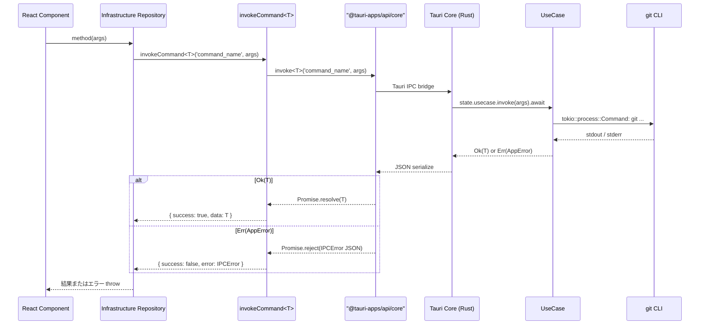
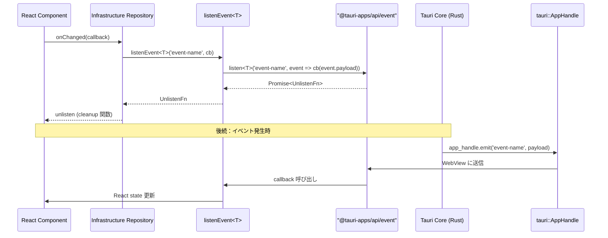

# Tauri v2 + Rust への全面移行

**関連 Design Doc:** [tauri-migration_design.md](./tauri-migration_design.md)
**関連 PRD:** [tauri-migration.md](../requirement/tauri-migration.md)

---

# 1. 背景

Buruma のバックエンドを Electron 41 + Node.js から Tauri 2 + Rust へ全面移行する。本仕様は PRD [tauri-migration.md](../requirement/tauri-migration.md) の FR_M01（IPC 1:1 マッピング）、FR_M02（IPCResult<T> 互換維持）、FR_M04（型同期）を実現するための論理設計を定義する。移行対象の feature 固有の実装詳細は各 feature の spec / design に記載し、本仕様は移行全体のマッピングルールと 83 個の IPC チャネルの完全な変換表を集約する。

# 2. 概要

既存の IPC チャネル（75 command + 8 event）を以下のルールで Tauri command / event に 1:1 マッピングする。

## 2.1. 命名変換ルール

| 旧 (Electron) | 新 (Tauri) | 種別 | 変換方式 |
|:---|:---|:---|:---|
| `xxx:yyy` (単語1) | `xxx_yyy` | command | `:` → `_` |
| `xxx:yyy-zzz` (ハイフン) | `xxx_yyy_zzz` | command | `:` と `-` を `_` に置換 (snake_case) |
| `xxx:yyy` | `xxx-yyy` | event | `:` → `-` (kebab-case) |

**理由**:
- **Command snake_case**: Rust 関数命名規約に従い、`#[tauri::command] pub async fn xxx_yyy(...)` という形で定義できる
- **Event kebab-case**: Tauri の慣例。`app_handle.emit("xxx-yyy", payload)` / `listen<T>("xxx-yyy", ...)` として使用

## 2.2. 型マッピング方針

- **TypeScript 側**: 既存の `src/shared/domain/` (移行後のパス) を真実の源とする
- **Rust 側**: `src-tauri/src/domain/` または `src-tauri/src/features/*/domain.rs` に対応する `#[derive(Serialize, Deserialize)]` struct を定義し、`#[serde(rename_all = "camelCase")]` で TypeScript の camelCase に整合させる
- **バリアント型 (union)**: TypeScript の `{ type: 'working' } | { type: 'commits' }` 等は、Rust 側で `#[serde(tag = "type", rename_all = "lowercase")]` enum として表現
- Phase 1 は手動同期。Phase 2 以降で `specta` + `tauri-specta` による自動生成を検討

## 2.3. IPCResult<T> 互換維持

Rust 側は `Result<T, AppError>` を返し、TypeScript 側は `invokeCommand<T>` ラッパー経由で `IPCResult<T>` 形式に変換する。具体的な実装は [tauri-migration_design.md](./tauri-migration_design.md) を参照。

Rust 側は `AppError` enum の `Serialize` 実装により、`{ code, message, detail? }` 形式の JSON としてシリアライズされ、TypeScript の `IPCError` と整合する。

# 3. 要求定義

## 3.1. 機能要件 (Functional Requirements)

| ID | 要件 | 優先度 | 根拠 (PRD) |
|--------|------|------|------|
| FR-001 | 75 個の既存 invoke/handle チャネルを Tauri command に 1:1 マッピングする | 必須 | FR_M01 |
| FR-002 | 8 個の既存 event（main → renderer）を Tauri event（Core → Webview）に 1:1 マッピングする | 必須 | FR_M01 |
| FR-003 | Command 名は snake_case、Event 名は kebab-case で命名する | 必須 | FR_M01 |
| FR-004 | 既存の `IPCResult<T>` 型は維持し、`invokeCommand<T>` ラッパーで互換変換する | 必須 | FR_M02 |
| FR-005 | `AppError` の JSON シリアライズは `{ code, message, detail? }` 形式とし既存 `IPCError` と整合する | 必須 | FR_M02 |
| FR-006 | Rust 側 struct は `#[serde(rename_all = "camelCase")]` で TypeScript 型と整合する | 必須 | FR_M04 |
| FR-007 | Rust 側の union 型は `#[serde(tag = "type", rename_all = "lowercase")]` enum で表現する | 必須 | FR_M04 |
| FR-008 | 新規 command 追加時は Rust と TypeScript を同一 PR で更新する（手動同期ルール） | 必須 | FR_M04 |

## 3.2. 非機能要件 (Non-Functional Requirements)

| ID | カテゴリ | 要件 | 目標値 | 根拠 (PRD) |
|---------|------|------|------|------|
| NFR-001 | 互換性 | 既存 Vitest テストの pass 率 | 80% 以上 | NFR_M01 |
| NFR-002 | 性能 | アプリ起動からUI表示完了まで | 3秒以内（Electron 版と同等） | NFR_M02 |
| NFR-003 | 性能 | Tauri invoke ラウンドトリップレイテンシ | 50ms 以内 | NFR_M03 |
| NFR-004 | 保守性 | 新規 command 追加時の Rust/TS 同期手順が明文化されている | 設計書記載 | FR_M04 |

# 4. API

## 4.1. Commands マッピング表（75 個、Webview → Core `invoke`）

### 4.1.1. Repository / Settings（10 個、application-foundation）

| 旧 Channel (Electron) | 新 Command (Tauri) | 引数 | 戻り値 |
|:---|:---|:---|:---|
| `repository:open` | `repository_open` | なし | `RepositoryInfo \| null` |
| `repository:open-path` | `repository_open_path` | `{ path: string }` | `RepositoryInfo \| null` |
| `repository:validate` | `repository_validate` | `{ path: string }` | `boolean` |
| `repository:get-recent` | `repository_get_recent` | なし | `RecentRepository[]` |
| `repository:remove-recent` | `repository_remove_recent` | `{ path: string }` | `void` |
| `repository:pin` | `repository_pin` | `{ path: string; pinned: boolean }` | `void` |
| `settings:get` | `settings_get` | なし | `AppSettings` |
| `settings:set` | `settings_set` | `{ settings: Partial<AppSettings> }` | `void` |
| `settings:get-theme` | `settings_get_theme` | なし | `Theme` |
| `settings:set-theme` | `settings_set_theme` | `{ theme: Theme }` | `void` |

### 4.1.2. Worktree Management（7 個）

| 旧 Channel (Electron) | 新 Command (Tauri) | 引数 | 戻り値 |
|:---|:---|:---|:---|
| `worktree:list` | `worktree_list` | `{ repoPath: string }` | `WorktreeInfo[]` |
| `worktree:status` | `worktree_status` | `{ repoPath: string; worktreePath: string }` | `WorktreeStatus` |
| `worktree:create` | `worktree_create` | `{ params: WorktreeCreateParams }` | `WorktreeInfo` |
| `worktree:delete` | `worktree_delete` | `{ params: WorktreeDeleteParams }` | `void` |
| `worktree:suggest-path` | `worktree_suggest_path` | `{ repoPath: string; branch: string }` | `string` |
| `worktree:check-dirty` | `worktree_check_dirty` | `{ worktreePath: string }` | `boolean` |
| `worktree:default-branch` | `worktree_default_branch` | `{ repoPath: string }` | `string` |

### 4.1.3. Repository Viewer（10 個）

| 旧 Channel (Electron) | 新 Command (Tauri) | 引数 | 戻り値 |
|:---|:---|:---|:---|
| `git:status` | `git_status` | `{ worktreePath: string }` | `GitStatus` |
| `git:log` | `git_log` | `{ query: GitLogQuery }` | `GitLogResult` |
| `git:commit-detail` | `git_commit_detail` | `{ worktreePath: string; hash: string }` | `CommitDetail` |
| `git:diff` | `git_diff` | `{ query: GitDiffQuery }` | `FileDiff[]` |
| `git:diff-staged` | `git_diff_staged` | `{ query: GitDiffQuery }` | `FileDiff[]` |
| `git:diff-commit` | `git_diff_commit` | `{ worktreePath: string; hash: string; filePath?: string }` | `FileDiff[]` |
| `git:branches` | `git_branches` | `{ worktreePath: string }` | `BranchList` |
| `git:file-tree` | `git_file_tree` | `{ worktreePath: string }` | `FileTreeNode` |
| `git:file-contents` | `git_file_contents` | `{ worktreePath: string; filePath: string; staged?: boolean }` | `FileContents` |
| `git:file-contents-commit` | `git_file_contents_commit` | `{ worktreePath: string; hash: string; filePath: string }` | `FileContents` |

### 4.1.4. Basic Git Operations（12 個）

| 旧 Channel (Electron) | 新 Command (Tauri) | 引数 | 戻り値 |
|:---|:---|:---|:---|
| `git:stage` | `git_stage` | `{ worktreePath: string; files: string[] }` | `void` |
| `git:stage-all` | `git_stage_all` | `{ worktreePath: string }` | `void` |
| `git:unstage` | `git_unstage` | `{ worktreePath: string; files: string[] }` | `void` |
| `git:unstage-all` | `git_unstage_all` | `{ worktreePath: string }` | `void` |
| `git:commit` | `git_commit` | `{ args: CommitArgs }` | `CommitResult` |
| `git:push` | `git_push` | `{ args: PushArgs }` | `PushResult` |
| `git:pull` | `git_pull` | `{ args: PullArgs }` | `PullResult` |
| `git:fetch` | `git_fetch` | `{ args: FetchArgs }` | `FetchResult` |
| `git:branch-create` | `git_branch_create` | `{ args: BranchCreateArgs }` | `void` |
| `git:branch-checkout` | `git_branch_checkout` | `{ args: BranchCheckoutArgs }` | `void` |
| `git:branch-delete` | `git_branch_delete` | `{ args: BranchDeleteArgs }` | `void` |
| `git:reset` | `git_reset` | `{ args: ResetArgs }` | `void` |

### 4.1.5. Advanced Git Operations（24 個）

| 旧 Channel (Electron) | 新 Command (Tauri) | 引数 | 戻り値 |
|:---|:---|:---|:---|
| `git:merge` | `git_merge` | `{ options: MergeOptions }` | `MergeResult` |
| `git:merge-abort` | `git_merge_abort` | `{ worktreePath: string }` | `void` |
| `git:merge-status` | `git_merge_status` | `{ worktreePath: string }` | `MergeStatus` |
| `git:rebase` | `git_rebase` | `{ options: RebaseOptions }` | `RebaseResult` |
| `git:rebase-interactive` | `git_rebase_interactive` | `{ options: InteractiveRebaseOptions }` | `RebaseResult` |
| `git:rebase-abort` | `git_rebase_abort` | `{ worktreePath: string }` | `void` |
| `git:rebase-continue` | `git_rebase_continue` | `{ worktreePath: string }` | `RebaseResult` |
| `git:rebase-get-commits` | `git_rebase_get_commits` | `{ worktreePath: string; onto: string }` | `RebaseStep[]` |
| `git:stash-save` | `git_stash_save` | `{ options: StashSaveOptions }` | `void` |
| `git:stash-list` | `git_stash_list` | `{ worktreePath: string }` | `StashEntry[]` |
| `git:stash-pop` | `git_stash_pop` | `{ worktreePath: string; index: number }` | `void` |
| `git:stash-apply` | `git_stash_apply` | `{ worktreePath: string; index: number }` | `void` |
| `git:stash-drop` | `git_stash_drop` | `{ worktreePath: string; index: number }` | `void` |
| `git:stash-clear` | `git_stash_clear` | `{ worktreePath: string }` | `void` |
| `git:cherry-pick` | `git_cherry_pick` | `{ options: CherryPickOptions }` | `CherryPickResult` |
| `git:cherry-pick-abort` | `git_cherry_pick_abort` | `{ worktreePath: string }` | `void` |
| `git:conflict-list` | `git_conflict_list` | `{ worktreePath: string }` | `ConflictFile[]` |
| `git:conflict-file-content` | `git_conflict_file_content` | `{ worktreePath: string; filePath: string }` | `ThreeWayContent` |
| `git:conflict-resolve` | `git_conflict_resolve` | `{ options: ConflictResolveOptions }` | `void` |
| `git:conflict-resolve-all` | `git_conflict_resolve_all` | `{ options: ConflictResolveAllOptions }` | `void` |
| `git:conflict-mark-resolved` | `git_conflict_mark_resolved` | `{ worktreePath: string; filePath: string }` | `void` |
| `git:tag-list` | `git_tag_list` | `{ worktreePath: string }` | `TagInfo[]` |
| `git:tag-create` | `git_tag_create` | `{ options: TagCreateOptions }` | `void` |
| `git:tag-delete` | `git_tag_delete` | `{ worktreePath: string; tagName: string }` | `void` |

### 4.1.6. Claude Code Integration（12 個）

| 旧 Channel (Electron) | 新 Command (Tauri) | 引数 | 戻り値 |
|:---|:---|:---|:---|
| `claude:start-session` | `claude_start_session` | `{ worktreePath: string }` | `ClaudeSession` |
| `claude:stop-session` | `claude_stop_session` | `{ worktreePath: string }` | `void` |
| `claude:get-session` | `claude_get_session` | `{ worktreePath: string }` | `ClaudeSession \| null` |
| `claude:get-all-sessions` | `claude_get_all_sessions` | なし | `ClaudeSession[]` |
| `claude:send-command` | `claude_send_command` | `{ command: ClaudeCommand }` | `void` |
| `claude:get-output` | `claude_get_output` | `{ worktreePath: string }` | `ClaudeOutput[]` |
| `claude:check-auth` | `claude_check_auth` | なし | `ClaudeAuthStatus` |
| `claude:login` | `claude_login` | なし | `void` |
| `claude:logout` | `claude_logout` | なし | `void` |
| `claude:generate-commit-message` | `claude_generate_commit_message` | `{ args: GenerateCommitMessageArgs }` | `string` |
| `claude:review-diff` | `claude_review_diff` | `{ worktreePath: string; diffTarget: DiffTarget; diffText: string }` | `void` |
| `claude:explain-diff` | `claude_explain_diff` | `{ worktreePath: string; diffTarget: DiffTarget; diffText: string }` | `void` |

## 4.2. Events マッピング表（8 個、Core → Webview `emit` / `listen`）

| 旧 Event (Electron) | 新 Event (Tauri) | ペイロード |
|:---|:---|:---|
| `error:notify` | `error-notify` | `ErrorNotification` |
| `worktree:changed` | `worktree-changed` | `WorktreeChangeEvent` |
| `git:progress` | `git-progress` | `GitProgressEvent` |
| `claude:output` | `claude-output` | `ClaudeOutput` |
| `claude:session-changed` | `claude-session-changed` | `ClaudeSession` |
| `claude:command-completed` | `claude-command-completed` | `{ worktreePath: string }` |
| `claude:review-result` | `claude-review-result` | `ReviewResult` |
| `claude:explain-result` | `claude-explain-result` | `ExplainResult` |

## 4.3. 共通型定義（維持）

以下の型は Tauri 移行後も TypeScript 側で維持され、Rust 側で対応する struct が定義される:

```typescript
// src/shared/lib/ipc.ts（既存を維持）
export type IPCResult<T> =
  | { success: true; data: T }
  | { success: false; error: IPCError }

export interface IPCError {
  code: string
  message: string
  detail?: string
}
```

```rust
// src-tauri/src/error.rs
use serde::{Serialize, Serializer};
use thiserror::Error;

#[derive(Debug, Error)]
pub enum AppError {
    #[error("IO error: {0}")]
    Io(#[from] std::io::Error),
    #[error("Git error: {0}")]
    Git(String),
    #[error("Git operation error [{code}]: {message}")]
    GitOperation { code: String, message: String },
    #[error("Validation error: {0}")]
    Validation(String),
    #[error("Not found: {0}")]
    NotFound(String),
    #[error("Store error: {0}")]
    Store(String),
    #[error("Dialog cancelled")]
    DialogCancelled,
    #[error("Claude CLI error: {0}")]
    ClaudeCli(String),
    #[error("Internal error: {0}")]
    Internal(String),
}

// TypeScript の IPCError と整合する JSON 形式でシリアライズ
impl Serialize for AppError { /* { code, message, detail? } */ }

pub type AppResult<T> = Result<T, AppError>;
```

# 5. 用語集

| 用語 | 説明 |
|------|------|
| Tauri command | Rust 側の `#[tauri::command]` 属性付き関数。Webview の `invoke<T>()` で呼び出せる RPC エンドポイント |
| Tauri event | `app_handle.emit(name, payload)` で Core → Webview に非同期送信されるイベント。Webview 側は `listen<T>(name, cb)` で購読 |
| invokeCommand<T> | `src/shared/lib/invoke/commands.ts` に定義される TypeScript ラッパー関数。`invoke<T>()` を `try/catch` し `IPCResult<T>` 形式に変換する |
| listenEvent<T> | `src/shared/lib/invoke/events.ts` に定義される TypeScript ラッパー関数。`listen<T>()` を呼び出し、UnlistenFn を返す |
| AppError | Rust 側の統一エラー型（`thiserror` + `Serialize` 実装）。JSON で `IPCError` 互換形式にシリアライズされる |
| IPCResult<T> | TypeScript の統一レスポンス型。`{success: true, data}` または `{success: false, error}` |

# 6. 使用例

以下は移行後の IPC 呼び出しパターンの概要を示す。具体的な実装（`invokeCommand<T>` ラッパー、infrastructure リポジトリクラス、Rust コマンドハンドラー）は [tauri-migration_design.md](./tauri-migration_design.md) を参照。

**Command 呼び出し（Webview → Core）**:

```typescript
// invokeCommand<T> ラッパー経由で Tauri command を呼び出し、IPCResult<T> を受け取る
const result = await invokeCommand<WorktreeInfo[]>('worktree_list', { repoPath })
if (!result.success) throw new Error(result.error.message)
return result.data
```

**Event 購読（Core → Webview）**:

```typescript
// listenEvent<T> ラッパー経由で Tauri event を購読し、UnlistenFn を受け取る
const unlisten = await listenEvent<WorktreeChangeEvent>('worktree-changed', (event) => {
  handleWorktreeChange(event)
})
```

**Rust コマンド定義パターン**:

```rust
#[tauri::command]
pub async fn worktree_list(
    state: State<'_, AppState>,
    repo_path: String,
) -> AppResult<Vec<WorktreeInfo>> {
    state.list_worktrees_usecase.invoke(&repo_path).await
}
```

# 7. 振る舞い図

## 7.1. 移行後の IPC 呼び出しフロー（Command）



## 7.2. 移行後のイベント購読フロー（Event）



# 8. 制約事項

- 既存の requirement ID（UR/FR/NFR/DC）を変更しない（DC_M01）
- 既存の UI/UX を維持（DC_M02）
- Phase 1 では `git2` crate ではなく `tokio::process::Command` 経由の `git` CLI shell out 方式を採用する（DC_M03）
- ディレクトリ構造を Tauri 標準（`src/features/`, `src/shared/`, `src-tauri/`）に再配置する（DC_M04）
- Rust 側 struct は `#[serde(rename_all = "camelCase")]` で TypeScript 型と整合させる
- 新規 command 追加時は Rust と TypeScript を同一 PR で更新する（手動型同期ルール）
- 移行中は `feat/migrate-to-tauri` ブランチで作業し、`main` ブランチの Electron 実装は凍結する

---

# PRD 整合性確認

| PRD 要求 ID | 本仕様での対応 | ステータス |
|-------------|--------------|----------|
| UR_M01 | 仕様全体 + 4.1 / 4.2 マッピング表 | 対応済み |
| UR_M02 | 4.1 / 4.2（軽量 Rust バンドル前提） | 設計フェーズで詳細化 |
| UR_M03 | 4.3 + 制約事項（CSP / capabilities） | 設計フェーズで詳細化 |
| UR_M04 | 4.1 / 4.2（83 チャネル 1:1 マッピング） | 対応済み |
| FR_M01 | 4.1 / 4.2 + FR-001〜FR-003 | 対応済み |
| FR_M02 | 4.3 + FR-004, FR-005 + 7.1 振る舞い図 | 対応済み |
| FR_M03 | 別タスク（CONSTITUTION + 各 feature 刷新）| Phase P1〜P5 で対応 |

> FR_M03（CONSTITUTION.md 更新・全 feature ドキュメント刷新）は本仕様書のスコープ外とする。各 feature の仕様書・設計書更新は feature 別の spec / design ファイルにて管理する。
| FR_M04 | 2.2 + FR-006〜FR-008 | 対応済み |
| NFR_M01 | NFR-001 | 対応済み |
| NFR_M02 | NFR-002 | 対応済み |
| NFR_M03 | NFR-003 | 対応済み |
| DC_M01 | 制約事項 | 対応済み |
| DC_M02 | 制約事項 | 対応済み |
| DC_M03 | 制約事項 + 7.1 振る舞い図 | 対応済み |
| DC_M04 | 制約事項 | 対応済み |
