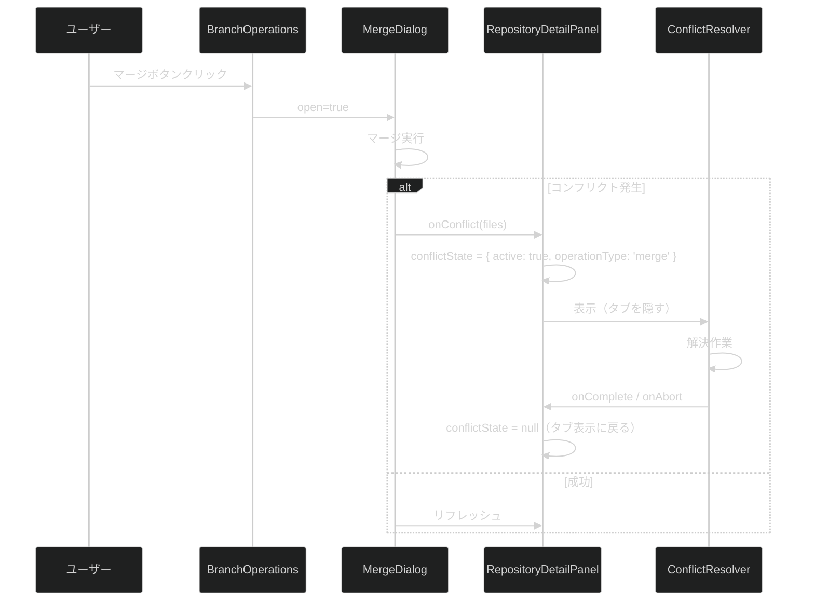

# 高度な Git 操作 UI 統合

**関連 Spec:** [ui-integration-advanced-git-operations_spec.md](./ui-integration-advanced-git-operations_spec.md)
**関連 PRD:** [ui-integration-advanced-git-operations.md](../requirement/ui-integration-advanced-git-operations.md)

---

# 1. 実装ステータス

**ステータス:** 🟢 実装完了

## 1.1. 実装進捗

| モジュール/機能                                | ステータス | 備考                                                   |
|-----------------------------------------|-------|------------------------------------------------------|
| RepositoryDetailPanel タブ追加（Stash, Tags） | 🟢    | 新規タブ 2 つ追加済み                                         |
| BranchOperations ボタン追加（マージ, リベース）       | 🟢    | マージ/リベースボタン + MergeDialog/RebaseEditor 統合済み          |
| Commits タブ チェリーピックボタン                   | 🟢    | CherryPickDialog 統合済み                                |
| コンフリクト解決オーバーレイ                          | 🟢    | conflictOperation state で管理、ConflictResolver フルパネル表示 |
| 操作完了後リフレッシュ                             | 🟢    | handleRefresh 経由で git:status / git:branches を呼び出し    |
| ブランチパネル折りたたみ                            | 🟢    | FR-008: ResizablePanel collapsible + 縦アイコンバー         |
| ブランチコンテキストメニュー                          | 🟢    | FR-009: shadcn/ui context-menu、ブランチ名付きメニュー項目         |
| アイコンのみツールバー                             | 🟢    | FR-010: Tooltip 付きアイコンボタン + 縦アイコンバー                  |
| コミットリセット                                 | 🟢    | FR-011: git:reset IPC + コンテキストメニュー（soft/mixed/hard サブメニュー） |

---

# 2. 設計目標

1. **最小限の変更** — 既存ファイルの変更を最小にし、新コンポーネント作成は避ける
2. **既存パターン踏襲** — RepositoryDetailPanel の Tabs パターンに従う
3. **既存 Hook 再利用** — advanced-git-operations の use*ViewModel Hook をそのまま使用

---

# 3. 技術スタック

| 領域 | 採用技術 | 選定理由 |
|---|---|---|
| コンテキストメニュー | shadcn/ui context-menu (`@radix-ui/react-context-menu`) | Radix primitive ベース。既存 shadcn/ui パターンと一貫性がある |
| ツールチップ | shadcn/ui tooltip（導入済み） | アイコンのみボタンの操作名表示に使用 |
| パネル折りたたみ | react-resizable-panels `collapsible` prop（導入済み） | 既存の ResizablePanelGroup 内で動作。追加ライブラリ不要 |

---

# 4. アーキテクチャ

## 4.1. 変更対象ファイル

| ファイル                                                                                                  | 変更内容                                                                          |
|-------------------------------------------------------------------------------------------------------|-------------------------------------------------------------------------------|
| `src/features/repository-viewer/presentation/components/RepositoryDetailPanel.tsx` | Stash/Tags を「リファレンス」タブに統合、コンフリクトオーバーレイ状態管理、ResizablePanelGroup による分割パネルリサイズ対応 |
| `src/features/basic-git-operations/presentation/components/branch-operations.tsx`  | マージ・リベースボタン追加、MergeDialog/RebaseEditor の open 状態管理                            |

## 4.2. タブ構成（変更後）

```
RepositoryDetailPanel
├── [コンフリクト解決オーバーレイ]  ← conflictState.active 時のみ表示
│   └── ConflictResolver
│       └── ThreeWayMergeView
└── Tabs（通常表示、defaultValue="status"）
    ├── Status（ResizablePanelGroup: StagingArea+CommitForm | DiffView）
    ├── Commits（3パネル: BranchOperations(collapsible) | CommitLog+Graph | CommitDetail+DiffView）
    ├── Files（ResizablePanelGroup: FileTree | DiffView）
    └── Refs（リファレンス）← 内部トグルで StashManager / TagManager 切り替え
```

## 4.3. コンフリクト解決フロー



## 4.4. ブランチパネル折りたたみ（FR-008）

Commits タブ左端の BranchOperations パネルを折りたたみ可能にする。`react-resizable-panels` v4 の `Panel` が持つ `collapsible` / `collapsedSize` prop と `panelRef` による命令的 API を使用する。

```tsx
const branchPanelRef = useRef<ImperativePanelHandle>(null)

return (
    <ResizablePanel
        defaultSize={20}
        minSize={10}
        collapsible={true}
        collapsedSize={0}
        ref={branchPanelRef}
        onCollapse={() => setBranchPanelCollapsed(true)}
        onExpand={() => setBranchPanelCollapsed(false)}
    >
        <BranchOperations />
    </ResizablePanel>
)
```

コミット履歴ヘッダーにトグルボタン（`PanelLeftOpen` / `PanelLeftClose` アイコン）を配置し、`branchPanelRef.current?.collapse()` / `expand()` で切り替える。

## 4.5. ブランチコンテキストメニュー（FR-009）

各ブランチ行を `ContextMenu` / `ContextMenuTrigger` でラップし、右クリックで操作メニューを表示する。メニュー項目はブランチ種別に応じて分岐:

| ブランチ種別 | メニュー項目 |
|---|---|
| ローカル（非 HEAD） | チェックアウト / 現在のブランチにマージ / このブランチへリベース / 削除 |
| ローカル（HEAD） | マージ... / リベース... / 新規ブランチ... |
| リモート | リモートブランチを削除 |

コンテキストメニューからマージ/リベースを選んだ場合、対象ブランチを `mergeTargetBranch` state にセットしてから `MergeDialog` を開くことで、ターゲットブランチを事前選択する。

ブランチ削除（ローカル / リモート）は CONSTITUTION.md B-002 準拠の確認ダイアログを表示する。

## 4.6. アイコンのみツールバー（FR-010）

ヘッダーの3ボタン（マージ/リベース/新規）を `Button variant="ghost" size="icon"` に変更し、`Tooltip` でホバー時に操作名を表示する。

| ボタン | アイコン | ツールチップ |
|---|---|---|
| マージ | `GitMerge` | "マージ" |
| リベース | `GitPullRequest` | "リベース" |
| 新規 | `Plus` | "新規ブランチ" |

`TooltipProvider delayDuration={300}` で BranchOperations のルートをラップする。

## 4.7. コミットリセット（FR-011）

コミット右クリックのコンテキストメニューに「xxxまでリセット」サブメニューを追加する。Clean Architecture 4層構成でフル実装:

| レイヤー | 実装内容 |
|---|---|
| Domain | `ResetArgs { worktreePath, mode: 'soft'\|'mixed'\|'hard', target: string }` |
| IPC | `git_reset` コマンド（`invokeCommand<void>('git_reset', args)` 経由） |
| Tauri Core | `ResetUseCase` → `GitWriteRepository.reset()` → `git reset --{mode} {target}` |
| Webview | `ResetUseCase` → `GitOperationsRepository.reset()` → IPC 呼び出し |
| ViewModel | `BranchOpsViewModel.resetToCommit(worktreePath, target, mode)` |
| UI | `CommitItem` の `ContextMenuSub` でサブメニュー表示（Soft/Mixed/Hard） |

Hard リセットは不可逆操作のため、メニュー項目に `text-destructive` スタイルを適用して視覚的に警告する。

Hard リセット選択時は CONSTITUTION.md B-002 準拠の確認ダイアログを表示する:
- メッセージ: 「{target} までハードリセットします。未コミット変更はすべて破棄されます。」
- ボタン: 「リセットする」（destructive）/ 「キャンセル」

---

# 5. インターフェース定義

## 5.1. RepositoryDetailPanel の変更

```typescript
// 追加 import
import {StashManager} from '@/features/advanced-git-operations/presentation/components/stash-manager'
import {TagManager} from '@/features/advanced-git-operations/presentation/components/tag-manager'
import {ConflictResolver} from '@/features/advanced-git-operations/presentation/components/conflict-resolver'

// 追加 state
const [conflictState, setConflictState] = useState<{
    active: boolean
    operationType: 'merge' | 'rebase' | 'cherry-pick'
} | null>(null)

// コンフリクト発生ハンドラ（BranchOperations / CommitLog に Props で渡す）
const handleConflict = useCallback((operationType: 'merge' | 'rebase' | 'cherry-pick') => {
    setConflictState({active: true, operationType})
}, [])

const handleConflictComplete = useCallback(() => {
    setConflictState(null)
    // リフレッシュ
}, [])
```

## 5.2. BranchOperations の変更

```tsx
// 追加 Props
interface BranchOperationsProps {
    // ...既存 Props
    onConflict?: (operationType: 'merge' | 'rebase' | 'cherry-pick') => void
}

// 追加 state
const [mergeOpen, setMergeOpen] = useState(false)
const [rebaseOpen, setRebaseOpen] = useState(false)

// JSX に追加（概念例）
const BranchOperations = ({ onConflict }) => (<>
    <Button onClick={() => setMergeOpen(true)}>マージ</Button>
    <Button onClick={() => setRebaseOpen(true)}>リベース</Button>
    <MergeDialog open={mergeOpen} onOpenChange={setMergeOpen} onConflict={() => onConflict?.('merge')}/>
    <RebaseEditor worktreePath={worktreePath} onConflict={() => onConflict?.('rebase')}/>
</>)
```

---

# 6. 非機能要件実現方針

| 要件                 | 実現方針                                                                                                                                               |
|--------------------|----------------------------------------------------------------------------------------------------------------------------------------------------|
| 操作後リフレッシュ (FR_707) | MergeDialog/RebaseEditor/CherryPickDialog/StashManager の操作完了コールバック内で repository-viewer の ViewModel（useRepositoryViewerViewModel 等）のリフレッシュメソッドを呼び出す |

---

# 7. テスト戦略

| テストレベル | 対象                     | カバレッジ目標 |
|--------|------------------------|---------|
| 手動テスト  | 各タブの表示・ボタン動作・コンフリクトフロー | 主要フロー   |

> **注記**: UI 統合コンポーネントであるため自動テストは最小限とし、主要フローは手動テストで検証する。CONSTITUTION.md D-002 のカバレッジ目標の例外として扱う。

---

# 8. 設計判断

## 8.1. 決定事項

| 決定事項          | 選択肢                    | 決定内容                               | 理由                                                               |
|---------------|------------------------|------------------------------------|------------------------------------------------------------------|
| マージ/リベースの配置   | 専用タブ / Branches タブ内ボタン | Branches タブ内ボタン                    | ブランチ操作の文脈で自然。新規タブ追加を最小化                                          |
| チェリーピックの配置    | 専用タブ / Commits タブ内ボタン  | Commits タブ内ボタン                     | コミット選択の文脈で自然                                                     |
| コンフリクト解決の表示方式 | 新規タブ / ダイアログ / オーバーレイ  | オーバーレイ（タブを隠す）                      | 3 ウェイマージには広い表示領域が必要。タブ切り替えで解決作業が中断されない                           |
| タブ追加数         | 全機能個別タブ / 最小限          | 1 タブ（Refs: Stash + Tags を内部トグルで統合） | マージ/リベース/チェリーピックはダイアログで十分。Stash と Tags は低頻度操作のため単一タブに統合しトグルで切り替え |
| ブランチパネル折りたたみ方式 | CSS w-0 トグル / ResizablePanel collapsible | ResizablePanel collapsible | 既に ResizablePanelGroup 内にあるためネイティブサポートを利用。CSS 方式との競合を避ける |
| コンテキストメニュー項目 | 統一メニュー / ブランチ種別ごと | ブランチ種別ごと（ローカル/リモート/HEAD） | ブランチ種別によって利用可能な操作が異なるため。不要な項目の disabled 表示を避ける |
| ツールバーレイアウト | 垂直ストリップ / 水平アイコンバー | 縦アイコンバー（垂直ストリップ） | ブランチパネル折りたたみ時にアイコンのみの縦ストリップとして表示。FR-008/FR-010 と統合 |

---

# 9. 変更履歴

## v4.0 (2026-04-09)

**Tauri 2 + Rust 移行（Electron からの全面刷新、破壊的変更）**

- 実装ステータスを `implemented` → `not-implemented` にリセット（旧 Electron 実装は凍結）
- 技術スタック表を Tauri 2 + Rust + Vite 6 + tokio + git CLI shell out + notify + tauri-plugin-store + tauri-plugin-dialog + thiserror 版に全面刷新
- システム構成図を Webview (React) / Tauri Core (Rust) の 2 境界分割に更新
- モジュール分割表を `src/features/{feature-name}/` (TypeScript) + `src-tauri/src/features/{feature_name}/` (Rust) の 2 部構成に
- IPC Handler コード例を `ipcMain.handle` から Rust `#[tauri::command]` に置換
- Preload API ブロックを削除（Tauri では preload 不要）
- IPC チャネル名を snake_case (command) / kebab-case (event) に変換
- DI 記述を Webview (VContainer) と Rust (`tauri::State<T>` + `Arc<dyn Trait>`) の 2 部構成に
- `simple-git` → `tokio::process::Command` 経由の `git` CLI shell out 方式に変更
- `chokidar` → `notify` + `notify-debouncer-full` crate に置換
- `electron-store` → `tauri-plugin-store` に置換
- `child_process.spawn` → `tokio::process::Command` に置換
- DC_001 を「Tauri セキュリティ制約」（CSP + capabilities + 入力バリデーション）に書き換え

**移行ガイド:**

```typescript
// ❌ 旧コード (Electron)
const result = await window.electronAPI.repository.open()
if (result.success) { /* ... */ }

// ✅ 新コード (Tauri)
import { invokeCommand } from '@/shared/lib/invoke'
const result = await invokeCommand<RepositoryInfo | null>('repository_open')
if (result.success) { /* ... */ }
```

```rust
// ✅ Rust 側 (新規)
#[tauri::command]
pub async fn repository_open(
    state: State<'_, AppState>,
) -> AppResult<Option<RepositoryInfo>> {
    state.open_repository_dialog_usecase.invoke().await
}
```

---

## v1.1 (2026-04-05)

**変更内容:**

- FR-008: ブランチパネル折りたたみ設計を追加（ResizablePanel collapsible + 縦アイコンバー）
- FR-009: ブランチコンテキストメニュー設計を追加（shadcn/ui context-menu、ブランチ名付き項目）
- FR-010: アイコンのみツールバー設計を追加（縦アイコンバーに移動）
- FR-011: コミットリセット設計を追加（git:reset IPC フル実装、soft/mixed/hard サブメニュー）
- 技術スタックに context-menu を追加
- 設計判断に折りたたみ方式・コンテキストメニュー項目・ツールバーレイアウトの3決定を追加

## v1.0 (2026-04-04)

**変更内容:**

- 初版作成
