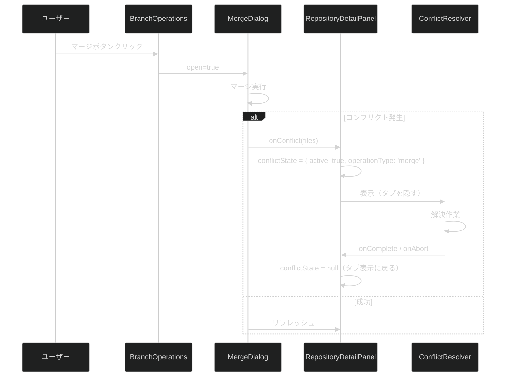

# 高度な Git 操作 UI 統合

**関連 Spec:** [ui-integration-advanced-git-operations_spec.md](./ui-integration-advanced-git-operations_spec.md)
**関連 PRD:** [ui-integration-advanced-git-operations.md](../requirement/ui-integration-advanced-git-operations.md)

---

# 1. 実装ステータス

**ステータス:** 🟢 実装完了

## 1.1. 実装進捗

| モジュール/機能                                | ステータス | 備考                                                   |
|-----------------------------------------|-------|------------------------------------------------------|
| RepositoryDetailPanel タブ追加（Stash, Tags） | 🟢    | 新規タブ 2 つ追加済み                                         |
| BranchOperations ボタン追加（マージ, リベース）       | 🟢    | マージ/リベースボタン + MergeDialog/RebaseEditor 統合済み          |
| Commits タブ チェリーピックボタン                   | 🟢    | CherryPickDialog 統合済み                                |
| コンフリクト解決オーバーレイ                          | 🟢    | conflictOperation state で管理、ConflictResolver フルパネル表示 |
| 操作完了後リフレッシュ                             | 🟢    | handleRefresh 経由で git:status / git:branches を呼び出し    |

---

# 2. 設計目標

1. **最小限の変更** — 既存ファイルの変更を最小にし、新コンポーネント作成は避ける
2. **既存パターン踏襲** — RepositoryDetailPanel の Tabs パターンに従う
3. **既存 Hook 再利用** — advanced-git-operations の use*ViewModel Hook をそのまま使用

---

# 3. 技術スタック

機能固有の追加技術なし。既存の Shadcn/ui Tabs, Dialog, Button を使用。

---

# 4. アーキテクチャ

## 4.1. 変更対象ファイル

| ファイル                                                                                                  | 変更内容                                                                          |
|-------------------------------------------------------------------------------------------------------|-------------------------------------------------------------------------------|
| `src/processes/renderer/features/repository-viewer/presentation/components/RepositoryDetailPanel.tsx` | Stash/Tags を「リファレンス」タブに統合、コンフリクトオーバーレイ状態管理、ResizablePanelGroup による分割パネルリサイズ対応 |
| `src/processes/renderer/features/basic-git-operations/presentation/components/branch-operations.tsx`  | マージ・リベースボタン追加、MergeDialog/RebaseEditor の open 状態管理                            |

## 4.2. タブ構成（変更後）

```
RepositoryDetailPanel
├── [コンフリクト解決オーバーレイ]  ← conflictState.active 時のみ表示
│   └── ConflictResolver
│       └── ThreeWayMergeView
└── Tabs（通常表示、defaultValue="status"）
    ├── Status（ResizablePanelGroup: StagingArea+CommitForm | DiffView）
    ├── Commits（3パネル: BranchOperations | CommitLog+Graph | CommitDetail+DiffView）
    ├── Files（ResizablePanelGroup: FileTree | DiffView）
    └── Refs（リファレンス）← 内部トグルで StashManager / TagManager 切り替え
```

## 4.3. コンフリクト解決フロー



---

# 5. インターフェース定義

## 5.1. RepositoryDetailPanel の変更

```typescript
// 追加 import
import {StashManager} from '@renderer/features/advanced-git-operations/presentation/components/stash-manager'
import {TagManager} from '@renderer/features/advanced-git-operations/presentation/components/tag-manager'
import {ConflictResolver} from '@renderer/features/advanced-git-operations/presentation/components/conflict-resolver'

// 追加 state
const [conflictState, setConflictState] = useState<{
    active: boolean
    operationType: 'merge' | 'rebase' | 'cherry-pick'
} | null>(null)

// コンフリクト発生ハンドラ（BranchOperations / CommitLog に Props で渡す）
const handleConflict = useCallback((operationType: 'merge' | 'rebase' | 'cherry-pick') => {
    setConflictState({active: true, operationType})
}, [])

const handleConflictComplete = useCallback(() => {
    setConflictState(null)
    // リフレッシュ
}, [])
```

## 5.2. BranchOperations の変更

```tsx
// 追加 Props
interface BranchOperationsProps {
    // ...既存 Props
    onConflict?: (operationType: 'merge' | 'rebase' | 'cherry-pick') => void
}

// 追加 state
const [mergeOpen, setMergeOpen] = useState(false)
const [rebaseOpen, setRebaseOpen] = useState(false)

// JSX に追加（概念例）
const BranchOperations = ({ onConflict }) => (<>
    <Button onClick={() => setMergeOpen(true)}>マージ</Button>
    <Button onClick={() => setRebaseOpen(true)}>リベース</Button>
    <MergeDialog open={mergeOpen} onOpenChange={setMergeOpen} onConflict={() => onConflict?.('merge')}/>
    <RebaseEditor worktreePath={worktreePath} onConflict={() => onConflict?.('rebase')}/>
</>)
```

---

# 6. 非機能要件実現方針

| 要件                 | 実現方針                                                                                                                                               |
|--------------------|----------------------------------------------------------------------------------------------------------------------------------------------------|
| 操作後リフレッシュ (FR_507) | MergeDialog/RebaseEditor/CherryPickDialog/StashManager の操作完了コールバック内で repository-viewer の ViewModel（useRepositoryViewerViewModel 等）のリフレッシュメソッドを呼び出す |

---

# 7. テスト戦略

| テストレベル | 対象                     | カバレッジ目標 |
|--------|------------------------|---------|
| 手動テスト  | 各タブの表示・ボタン動作・コンフリクトフロー | 主要フロー   |

---

# 8. 設計判断

## 8.1. 決定事項

| 決定事項          | 選択肢                    | 決定内容                               | 理由                                                               |
|---------------|------------------------|------------------------------------|------------------------------------------------------------------|
| マージ/リベースの配置   | 専用タブ / Branches タブ内ボタン | Branches タブ内ボタン                    | ブランチ操作の文脈で自然。新規タブ追加を最小化                                          |
| チェリーピックの配置    | 専用タブ / Commits タブ内ボタン  | Commits タブ内ボタン                     | コミット選択の文脈で自然                                                     |
| コンフリクト解決の表示方式 | 新規タブ / ダイアログ / オーバーレイ  | オーバーレイ（タブを隠す）                      | 3 ウェイマージには広い表示領域が必要。タブ切り替えで解決作業が中断されない                           |
| タブ追加数         | 全機能個別タブ / 最小限          | 1 タブ（Refs: Stash + Tags を内部トグルで統合） | マージ/リベース/チェリーピックはダイアログで十分。Stash と Tags は低頻度操作のため単一タブに統合しトグルで切り替え |

---

# 9. 変更履歴

## v1.0 (2026-04-04)

**変更内容:**

- 初版作成
