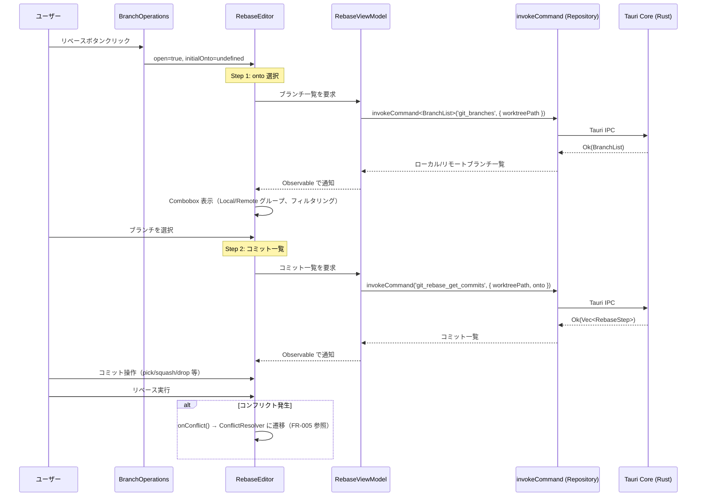
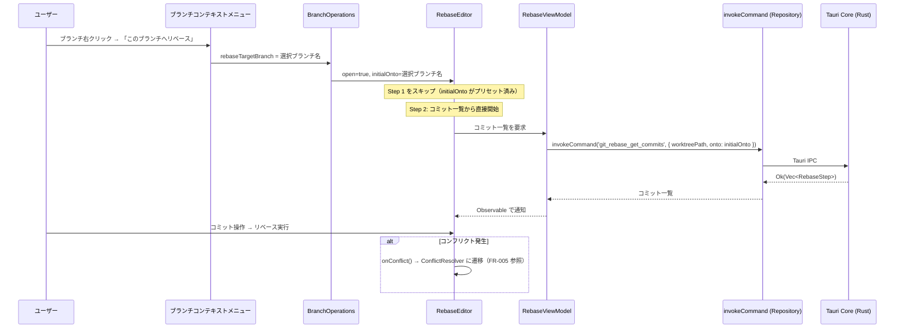

# 高度な Git 操作 UI 統合

**関連 Design Doc:** [ui-integration-advanced-git-operations_design.md](./ui-integration-advanced-git-operations_design.md)
**関連 PRD:** [ui-integration-advanced-git-operations.md](../requirement/ui-integration-advanced-git-operations.md)

---

# 1. 背景

Advanced Git Operations で実装済みの 7 UI コンポーネントは、バックエンド（IPC Handler, UseCase, Repository）と ViewModel +
Hook が完成しているが、既存の RepositoryDetailPanel に組み込まれていないため、ユーザーがアプリ画面から操作できない。本仕様はこれらのコンポーネントを既存
UI に統合する方法を定義する。

# 2. 概要

RepositoryDetailPanel の既存タブ構成（Info, Status, Commits, Branches, Files）に対して、以下の変更を加える:

1. **Branches タブ**: マージ・リベースボタンを追加
2. **Commits タブ**: チェリーピックボタンを追加
3. **新規 Refs タブ**: StashManager と TagManager を内部トグルで統合配置
4. **コンフリクト解決オーバーレイ**: コンフリクト発生時に全画面表示

# 3. 要求定義

## 3.1. 機能要件

| ID     | 要件                                                     | 優先度 | 根拠 (PRD)       |
|--------|--------------------------------------------------------|-----|----------------|
| FR-001 | Branches タブにマージボタンを追加し、MergeDialog を起動できる              | 必須  | FR_701         |
| FR-002 | Branches タブにリベースボタンを追加し、RebaseEditor を起動できる            | 推奨  | FR_702         |
| FR-003 | 新規 Refs タブを追加し、StashManager と TagManager を内部トグルで統合表示する | 必須  | FR_703, FR_706 |
| FR-004 | Commits タブにチェリーピックボタンを追加し、CherryPickDialog を起動できる      | 推奨  | FR_704         |
| FR-005 | コンフリクト発生時に ConflictResolver をオーバーレイ表示する。解決完了または中止（abort）で通常タブ表示に戻る（B-002 準拠） | 必須  | FR_705         |
| FR-007 | 操作完了後にステータス・ブランチ・コミットログをリフレッシュする                       | 必須  | FR_707         |
| FR-008 | Commits タブのブランチパネルを ResizablePanel の collapsible prop で折りたたみ可能にする | 推奨  | FR_708         |
| FR-009 | ブランチ右クリックでコンテキストメニュー表示（ローカル/リモート/HEAD で項目を分ける）。削除操作は不可逆のため確認ダイアログを表示する（B-002 準拠） | 推奨  | FR_709         |
| FR-010 | ブランチ操作ヘッダーのボタンをアイコンのみ + Tooltip に変更                     | 任意  | FR_710         |
| FR-011 | コミット右クリックから指定コミットまでリセット（soft/mixed/hard サブメニュー）を実行できる。hard リセットは不可逆操作のため視覚的警告を表示する（B-002 準拠） | 推奨  | FR_711         |
| FR-012 | リベース実行時に onto 対象をブランチ/コミット一覧から選択形式で指定できる（検索・フィルタリング付き） | 推奨  | FR_712         |

# 4. API

## 4.1. 変更対象コンポーネント

| コンポーネント               | ファイル                                                                                                  | 変更内容                             |
|-----------------------|-------------------------------------------------------------------------------------------------------|----------------------------------|
| RepositoryDetailPanel | `src/features/repository-viewer/presentation/components/RepositoryDetailPanel.tsx` | Refs タブ（Stash/Tags 統合）追加、コンフリクトオーバーレイ状態管理 |
| BranchOperations      | `src/features/basic-git-operations/presentation/components/branch-operations.tsx`  | マージ・リベースボタン追加                    |

## 4.2. RebaseEditor の変更（FR-012）

RebaseEditor ダイアログを 2 ステップ形式に変更する。

### Props 変更

```typescript
interface RebaseEditorProps {
  worktreePath: string;
  // 追加: onto がプリセットされている場合（コンテキストメニュー経由）
  initialOnto?: string;
  // Dialog 化: 親コンポーネントが開閉状態を管理
  open: boolean;
  onOpenChange: (open: boolean) => void;
  onConflict?: (files: string[]) => void;
  onComplete?: () => void;
}
```

### 2 ステップフロー

| ステップ | 表示内容 | 遷移条件 |
|:--------|:---------|:---------|
| Step 1: onto 選択 | Combobox でローカル/リモートブランチをグループラベル（Local / Remote）分離表示。テキスト入力でリアルタイムフィルタリング | ブランチ選択後に Step 2 へ遷移 |
| Step 2: コミット一覧 | 既存の RebaseEditor の動作（コミット一覧、pick/squash/drop 等の操作） | リベース実行またはキャンセル |

### コンテキストメニュー連携

ブランチコンテキストメニュー（FR-009）から「このブランチへリベース」を選択した場合、`initialOnto` に対象ブランチ名がセットされる。この場合 Step 1 をスキップし、Step 2（コミット一覧）から直接開始する。

### ブランチ一覧取得

`src/lib/ipc.ts` の `IPCChannelMap` に登録済みの `git_branches` コマンド（`basic-git-operations` で定義）を再利用する。新規 IPC コマンドは追加しない。同様に `git_rebase_get_commits`（`advanced-git-operations` で定義）も既存のものをそのまま使用する。

## 4.3. 状態管理

コンフリクト解決のオーバーレイ表示の状態は RepositoryDetailPanel が保持する。状態は「アクティブか否か」と「操作種別（merge / rebase / cherry-pick）」の 2 要素で構成される。具体的な実装は [ui-integration-advanced-git-operations_design.md](./ui-integration-advanced-git-operations_design.md) を参照。

# 5. 用語集

| 用語                    | 説明                           |
|-----------------------|------------------------------|
| RepositoryDetailPanel | メインコンテンツ領域。タブでリポジトリの各情報を表示する |
| オーバーレイ                | 通常のタブ表示を隠して全面表示するパネル         |
| Combobox              | テキスト入力とドロップダウン一覧を組み合わせた選択UI。shadcn/ui の Combobox コンポーネントを使用 |
| 2ステップフロー             | RebaseEditor ダイアログの Step 1（onto 選択）→ Step 2（コミット一覧）の遷移パターン |

# 6. 振る舞い図

## 6.1. RebaseEditor 2 ステップフロー（FR-012）



## 6.2. コンテキストメニューからのリベース起動（FR-009 + FR-012 連携）



# 7. 制約事項

- 既存の 5 タブ（Info, Status, Commits, Branches, Files）の動作を変更しない
- 新コンポーネントの作成は最小限（統合ロジックのみ）
- advanced-git-operations のバックエンドロジックは変更しない

---

# PRD 整合性確認

| PRD 要求 ID | 本仕様での対応                       | ステータス |
|-----------|-------------------------------|-------|
| FR_701    | FR-001（Branches タブにマージボタン）    | 対応済み  |
| FR_702    | FR-002（Branches タブにリベースボタン）   | 対応済み  |
| FR_703    | FR-003（Refs タブに Stash 統合）     | 対応済み  |
| FR_704    | FR-004（Commits タブにチェリーピックボタン） | 対応済み  |
| FR_705    | FR-005（コンフリクト解決オーバーレイ）        | 対応済み  |
| FR_706    | FR-003（Refs タブに Tags 統合）      | 対応済み  |
| FR_707    | FR-007（操作後リフレッシュ）             | 対応済み  |
| FR_708    | FR-008（ブランチパネル折りたたみ）          | 対応済み  |
| FR_709    | FR-009（ブランチコンテキストメニュー）        | 対応済み  |
| FR_710    | FR-010（アイコンのみツールバー）           | 対応済み  |
| FR_711    | FR-011（コミットリセット）               | 対応済み  |
| FR_712    | FR-012 + RebaseEditor 2ステップフロー（4.2節）+ 振る舞い図 6.1, 6.2 | 対応済み  |
