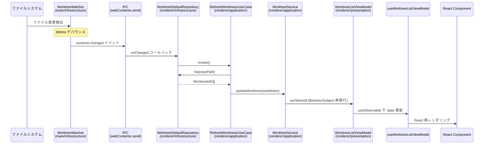

# ワークツリー管理

**関連 Spec:** [worktree-management_spec.md](./worktree-management_spec.md)
**関連 PRD:** [worktree-management.md](../requirement/worktree-management.md)

---

# 1. 実装ステータス

**ステータス:** 🟢 実装済み

## 1.1. 実装進捗

| モジュール | プロセス | 層 | ステータス | 備考 |
|-----------|---------|-----|----------|------|
| ListWorktreesMainUseCase | main | application | 🟢 | ワークツリー一覧取得 + dirty 並列チェック |
| GetWorktreeStatusMainUseCase | main | application | 🟢 | ワークツリーステータス取得 |
| CreateWorktreeMainUseCase | main | application | 🟢 | ワークツリー作成 |
| DeleteWorktreeMainUseCase | main | application | 🟢 | ワークツリー削除（メイン WT 保護付き） |
| SuggestPathMainUseCase | main | application | 🟢 | パス提案（メイン WT パス解決） |
| CheckDirtyMainUseCase | main | application | 🟢 | dirty チェック |
| GetDefaultBranchMainUseCase | main | application | 🟢 | デフォルトブランチ検出 |
| WorktreeGitDefaultRepository | main | infrastructure | 🟢 | simple-git ラッパー |
| WorktreeWatcher | main | infrastructure | 🟢 | chokidar ファイルシステム監視 |
| IPC Handlers (worktree:*) | main | presentation | 🟢 | IPC チャネル登録・ルーティング |
| DI 設定 (main) | main | — | 🟢 | di-tokens.ts / di-config.ts |
| WorktreeService | renderer | application | 🟢 | BehaviorSubject 状態管理 |
| UseCases | renderer | application | 🟢 | List, Create, Delete, Select 等（9実装） |
| WorktreeDefaultRepository | renderer | infrastructure | 🟢 | IPC クライアント |
| ViewModels | renderer | presentation | 🟢 | WorktreeList / Detail ViewModel |
| React Components | renderer | presentation | 🟢 | WorktreeList, Detail, Dialogs（5コンポーネント） |
| DI 設定 (renderer) | renderer | — | 🟢 | di-tokens.ts / di-config.ts |
| Worktree domain types | shared | domain | 🟢 | WorktreeInfo, WorktreeStatus 等 |
| IPC 型拡張 | shared | types | 🟢 | IPCChannelMap, ElectronAPI 拡張 |

---

# 2. 設計目標

1. **Worktree-First UX** — ワークツリーを UI の主軸に据え、左パネル一覧 + 右パネル詳細の2カラムレイアウトを実現する（原則 B-001）
2. **安全な Git 操作** — 不可逆操作（削除）には確認ステップを設け、メインワークツリーの削除を防止する（原則 B-002）
3. **Electron プロセス分離** — すべての Git 操作をメインプロセスで実行し、preload + contextBridge 経由でレンダラーに API を公開する（原則 A-001, T-003）
4. **型安全な IPC 通信** — `IPCResult<T>` パターンですべてのレスポンスを統一し、コンパイル時にエラーを検出する（原則 T-001, T-002）
5. **リアルタイム状態反映** — ファイルシステム監視によりワークツリーの状態変化を自動検出・UI 反映する

---

# 3. 技術スタック

> 以下はプロジェクト共通の技術スタックです。機能固有の追加技術のみ記載してください。

| 領域 | 採用技術 | 選定理由 |
|------|----------|----------|
| Git 操作 | simple-git | Git CLI のラッパー。`worktree list --porcelain` のパース、`worktree add/remove` の実行に使用。メンテナンスが活発で API が直感的（原則 A-002: Library-First） |
| ファイルシステム監視 | chokidar | Node.js のクロスプラットフォームファイル監視。macOS FSEvents / Linux inotify / Windows ReadDirectoryChangesW を抽象化。デバウンス機能内蔵（原則 A-002） |
| ダイアログ UI | Shadcn/ui Dialog | Shadcn/ui が提供するアクセシブルなダイアログコンポーネント。Tailwind CSS との統合が良好 |

<details>
<summary>プロジェクト共通スタック（参考）</summary>

| 領域 | 採用技術 |
|------|----------|
| フレームワーク | Electron 41 + Electron Forge 7 |
| バンドラー | Vite 5 |
| UI | React 19 + TypeScript |
| スタイリング | Tailwind CSS v4 (`@tailwindcss/postcss`) |
| UIコンポーネント | Shadcn/ui |
| Git操作 | simple-git（予定） |
| エディタ | Monaco Editor（予定） |

</details>

---

# 4. アーキテクチャ

## 4.1. システム構成図

```mermaid
graph TD
    subgraph "Renderer Process"
        subgraph "Presentation 層"
            Components["React Components<br/>(WorktreeList, Detail, Dialogs)"]
            VMs["ViewModels<br/>(WorktreeListVM, DetailVM)"]
            Hooks["Hook ラッパー<br/>(useWorktreeListVM, useWorktreeDetailVM)"]
            Components --> Hooks
            Hooks --> VMs
        end
        subgraph "Application 層 (Renderer)"
            RUCs["UseCases<br/>(List, Create, Delete, Select, Refresh)"]
            RService["WorktreeService<br/>(BehaviorSubject 状態管理)"]
            RRepoIF["WorktreeRepository IF"]
            VMs --> RUCs
            RUCs --> RService
            RUCs --> RRepoIF
        end
        subgraph "Infrastructure 層 (Renderer)"
            RRepoDefault["WorktreeDefaultRepository<br/>(IPC クライアント)"]
            RRepoIF -.->|"実装"| RRepoDefault
        end
    end

    subgraph "Preload"
        Bridge["contextBridge API<br/>(electronAPI.worktree)"]
    end

    subgraph "Main Process"
        subgraph "Presentation 層 (Main)"
            IPCHandlers["IPC Handlers<br/>(wrapHandler + ipcMain.handle)"]
        end
        subgraph "Application 層 (Main)"
            MUC["UseCases<br/>(List, Status, Create, Delete,<br/>SuggestPath, CheckDirty, DefaultBranch)"]
            MGitIF["WorktreeGitRepository IF"]
            MWatcherIF["WorktreeWatcher IF"]
            IPCHandlers --> MUC
            MUC --> MGitIF
        end
        subgraph "Infrastructure 層 (Main)"
            MGitDefault["WorktreeGitDefaultRepository<br/>(simple-git)"]
            MWatcher["WorktreeWatcher<br/>(chokidar)"]
            MGitIF -.->|"実装"| MGitDefault
            MWatcherIF -.->|"実装"| MWatcher
        end
    end

    subgraph "External"
        Git[Git CLI]
        FS[ファイルシステム]
    end

    RRepoDefault -->|"invoke"| Bridge
    Bridge -->|"ipcRenderer.invoke"| IPCHandlers
    IPCHandlers -->|"IPCResult"| Bridge
    Bridge -->|"result"| RRepoDefault
    MWatcher -->|"webContents.send"| Bridge
    Bridge -->|"onChanged"| RRepoDefault
    MGitDefault -->|"git worktree"| Git
    MWatcher -->|"chokidar watch"| FS
```



## 4.2. モジュール分割

### メインプロセス側

| モジュール名 | 層 | 責務 | 配置場所 |
|------------|-----|------|---------|
| ListWorktreesMainUseCase | application | FunctionUseCase を継承、ワークツリー一覧取得 + dirty 並列チェック | `src/processes/main/features/worktree-management/application/usecases/list-worktrees-main-usecase.ts` |
| GetWorktreeStatusMainUseCase | application | FunctionUseCase を継承、ワークツリーステータス取得 | `src/processes/main/features/worktree-management/application/usecases/get-worktree-status-main-usecase.ts` |
| CreateWorktreeMainUseCase | application | FunctionUseCase を継承、ワークツリー作成 | `src/processes/main/features/worktree-management/application/usecases/create-worktree-main-usecase.ts` |
| DeleteWorktreeMainUseCase | application | FunctionUseCase を継承、ワークツリー削除（メイン WT 保護付き） | `src/processes/main/features/worktree-management/application/usecases/delete-worktree-main-usecase.ts` |
| SuggestPathMainUseCase | application | FunctionUseCase を継承、パス提案（メイン WT パス解決） | `src/processes/main/features/worktree-management/application/usecases/suggest-path-main-usecase.ts` |
| CheckDirtyMainUseCase | application | FunctionUseCase を継承、dirty チェック | `src/processes/main/features/worktree-management/application/usecases/check-dirty-main-usecase.ts` |
| GetDefaultBranchMainUseCase | application | FunctionUseCase を継承、デフォルトブランチ検出 | `src/processes/main/features/worktree-management/application/usecases/get-default-branch-main-usecase.ts` |
| WorktreeGitRepository IF | application | Git 操作の抽象インターフェース | `src/processes/main/features/worktree-management/application/worktree-interfaces.ts` |
| WorktreeWatcher IF | application | ファイル監視の抽象インターフェース | `src/processes/main/features/worktree-management/application/worktree-interfaces.ts` |
| WorktreeGitDefaultRepository | infrastructure | simple-git ラッパー（list, add, remove, status） | `src/processes/main/features/worktree-management/infrastructure/worktree-git-service.ts` |
| WorktreeWatcher | infrastructure | chokidar による `.git/worktrees` 監視 | `src/processes/main/features/worktree-management/infrastructure/worktree-watcher.ts` |
| IPC Handlers | presentation | worktree:* チャネル登録、wrapHandler パターン | `src/processes/main/features/worktree-management/presentation/ipc-handlers.ts` |
| DI Tokens (main) | — | createToken 定義 | `src/processes/main/features/worktree-management/di-tokens.ts` |
| DI Config (main) | — | VContainerConfig { register, setUp } | `src/processes/main/features/worktree-management/di-config.ts` |

### レンダラー側

| モジュール名 | 層 | 責務 | 配置場所 |
|------------|-----|------|---------|
| WorktreeService | application | BehaviorSubject による状態管理（worktrees$, selectedPath$） | `src/processes/renderer/features/worktree-management/application/worktree-service.ts` |
| WorktreeRepository IF | application | IPC クライアントの抽象インターフェース | `src/processes/renderer/features/worktree-management/di-tokens.ts` |
| UseCases | application | List, Create, Delete, Select, Refresh, SuggestPath, CheckDirty | `src/processes/renderer/features/worktree-management/application/usecases/*.ts` |
| WorktreeDefaultRepository | infrastructure | window.electronAPI.worktree 経由の IPC クライアント | `src/processes/renderer/features/worktree-management/infrastructure/worktree-default-repository.ts` |
| WorktreeListViewModel | presentation | 一覧画面の ViewModel（UseCase 経由で Observable 公開） | `src/processes/renderer/features/worktree-management/presentation/worktree-list-viewmodel.ts` |
| WorktreeDetailViewModel | presentation | 詳細パネルの ViewModel | `src/processes/renderer/features/worktree-management/presentation/worktree-detail-viewmodel.ts` |
| useWorktreeListViewModel | presentation | Hook ラッパー（useResolve + useObservable） | `src/processes/renderer/features/worktree-management/presentation/use-worktree-list-viewmodel.ts` |
| useWorktreeDetailViewModel | presentation | Hook ラッパー | `src/processes/renderer/features/worktree-management/presentation/use-worktree-detail-viewmodel.ts` |
| React Components | presentation | WorktreeList, WorktreeListItem, WorktreeDetail, Dialogs | `src/processes/renderer/features/worktree-management/presentation/components/*.tsx` |
| DI Tokens (renderer) | — | createToken 定義、Repository/Service/UseCase/ViewModel IF | `src/processes/renderer/features/worktree-management/di-tokens.ts` |
| DI Config (renderer) | — | VContainerConfig { register, setUp } | `src/processes/renderer/features/worktree-management/di-config.ts` |

### 共有

| モジュール名 | 責務 | 配置場所 |
|------------|------|---------|
| Worktree domain types | WorktreeInfo, WorktreeStatus 等の純粋な型定義 | `src/domain/index.ts` に追加 |
| IPC 型拡張 | IPCChannelMap, IPCEventMap, ElectronAPI への worktree 名前空間追加 | `src/lib/ipc.ts` に追加 |
| Preload API (worktree) | contextBridge 経由の worktree API | `src/processes/preload/preload.ts` に追加 |

## 4.3. DI 設計

### メインプロセス側 DI Tokens

```typescript
// src/processes/main/features/worktree-management/di-tokens.ts
import type { WorktreeCreateParams, WorktreeDeleteParams, WorktreeInfo, WorktreeStatus } from '@domain'
import type { FunctionUseCase } from '@lib/usecase/types'
import type { WorktreeGitRepository, WorktreeWatcher } from './application/worktree-interfaces'
import { createToken } from '@lib/di'

// Infrastructure IF
export const WorktreeGitDefaultRepositoryToken = createToken<WorktreeGitRepository>('WorktreeGitDefaultRepository')
export const WorktreeWatcherToken = createToken<WorktreeWatcher>('WorktreeWatcher')

// Application UseCase 型
export type ListWorktreesMainUseCase = FunctionUseCase<string, Promise<WorktreeInfo[]>>
export type GetWorktreeStatusMainUseCase = FunctionUseCase<
  { repoPath: string; worktreePath: string },
  Promise<WorktreeStatus>
>
export type CreateWorktreeMainUseCase = FunctionUseCase<WorktreeCreateParams, Promise<WorktreeInfo>>
export type DeleteWorktreeMainUseCase = FunctionUseCase<WorktreeDeleteParams, Promise<void>>
export type SuggestPathMainUseCase = FunctionUseCase<{ repoPath: string; branch: string }, Promise<string>>
export type CheckDirtyMainUseCase = FunctionUseCase<string, Promise<boolean>>
export type GetDefaultBranchMainUseCase = FunctionUseCase<string, Promise<string>>

// Application UseCase Tokens
export const ListWorktreesMainUseCaseToken = createToken<ListWorktreesMainUseCase>('ListWorktreesMainUseCase')
export const GetWorktreeStatusMainUseCaseToken =
  createToken<GetWorktreeStatusMainUseCase>('GetWorktreeStatusMainUseCase')
export const CreateWorktreeMainUseCaseToken = createToken<CreateWorktreeMainUseCase>('CreateWorktreeMainUseCase')
export const DeleteWorktreeMainUseCaseToken = createToken<DeleteWorktreeMainUseCase>('DeleteWorktreeMainUseCase')
export const SuggestPathMainUseCaseToken = createToken<SuggestPathMainUseCase>('SuggestPathMainUseCase')
export const CheckDirtyMainUseCaseToken = createToken<CheckDirtyMainUseCase>('CheckDirtyMainUseCase')
export const GetDefaultBranchMainUseCaseToken = createToken<GetDefaultBranchMainUseCase>('GetDefaultBranchMainUseCase')
```

### メインプロセス側 DI Config

```typescript
// src/processes/main/features/worktree-management/di-config.ts
import type { VContainerConfig } from '@lib/di'
import { CheckDirtyMainUseCase } from './application/usecases/check-dirty-main-usecase'
import { CreateWorktreeMainUseCase } from './application/usecases/create-worktree-main-usecase'
import { DeleteWorktreeMainUseCase } from './application/usecases/delete-worktree-main-usecase'
import { GetDefaultBranchMainUseCase } from './application/usecases/get-default-branch-main-usecase'
import { GetWorktreeStatusMainUseCase } from './application/usecases/get-worktree-status-main-usecase'
import { ListWorktreesMainUseCase } from './application/usecases/list-worktrees-main-usecase'
import { SuggestPathMainUseCase } from './application/usecases/suggest-path-main-usecase'
import {
  CheckDirtyMainUseCaseToken,
  CreateWorktreeMainUseCaseToken,
  DeleteWorktreeMainUseCaseToken,
  GetDefaultBranchMainUseCaseToken,
  GetWorktreeStatusMainUseCaseToken,
  ListWorktreesMainUseCaseToken,
  SuggestPathMainUseCaseToken,
  WorktreeGitDefaultRepositoryToken,
  WorktreeWatcherToken,
} from './di-tokens'
import { WorktreeGitDefaultRepository } from './infrastructure/worktree-git-service'
import { WorktreeWatcher } from './infrastructure/worktree-watcher'
import { registerIPCHandlers } from './presentation/ipc-handlers'

export const worktreeManagementMainConfig: VContainerConfig = {
  register(container) {
    // Infrastructure (singleton)
    container
      .registerSingleton(WorktreeGitDefaultRepositoryToken, WorktreeGitDefaultRepository)
      .registerSingleton(WorktreeWatcherToken, WorktreeWatcher)

    // Application UseCases (singleton, deps で依存関係を宣言)
    container
      .registerSingleton(ListWorktreesMainUseCaseToken, ListWorktreesMainUseCase, [WorktreeGitDefaultRepositoryToken])
      .registerSingleton(GetWorktreeStatusMainUseCaseToken, GetWorktreeStatusMainUseCase, [WorktreeGitDefaultRepositoryToken])
      .registerSingleton(CreateWorktreeMainUseCaseToken, CreateWorktreeMainUseCase, [WorktreeGitDefaultRepositoryToken])
      .registerSingleton(DeleteWorktreeMainUseCaseToken, DeleteWorktreeMainUseCase, [WorktreeGitDefaultRepositoryToken])
      .registerSingleton(SuggestPathMainUseCaseToken, SuggestPathMainUseCase, [WorktreeGitDefaultRepositoryToken])
      .registerSingleton(CheckDirtyMainUseCaseToken, CheckDirtyMainUseCase, [WorktreeGitDefaultRepositoryToken])
      .registerSingleton(GetDefaultBranchMainUseCaseToken, GetDefaultBranchMainUseCase, [WorktreeGitDefaultRepositoryToken])
  },

  setUp: async (container) => {
    const watcher = container.resolve(WorktreeWatcherToken)

    registerIPCHandlers(
      container.resolve(ListWorktreesMainUseCaseToken),
      container.resolve(GetWorktreeStatusMainUseCaseToken),
      container.resolve(CreateWorktreeMainUseCaseToken),
      container.resolve(DeleteWorktreeMainUseCaseToken),
      container.resolve(SuggestPathMainUseCaseToken),
      container.resolve(CheckDirtyMainUseCaseToken),
      container.resolve(GetDefaultBranchMainUseCaseToken),
    )

    return () => {
      watcher.stop()
    }
  },
}
```

### レンダラー側 DI Tokens

```typescript
// src/processes/renderer/features/worktree-management/di-tokens.ts
import { createToken } from '@lib/di'
import type { Observable } from 'rxjs'
import type {
  WorktreeInfo,
  WorktreeStatus,
  WorktreeCreateParams,
  WorktreeDeleteParams,
  WorktreeChangeEvent,
} from '@domain'
import type { IPCResult } from '@lib/ipc'
import type {
  ConsumerUseCase,
  RunnableUseCase,
  FunctionUseCase,
  ObservableStoreUseCase,
} from '@lib/usecase/types'
import type { ParameterizedService } from '@lib/service'

// --- Repository IF ---
export interface WorktreeRepository {
  list(repoPath: string): Promise<WorktreeInfo[]>
  getStatus(repoPath: string, worktreePath: string): Promise<WorktreeStatus>
  create(params: WorktreeCreateParams): Promise<WorktreeInfo>
  delete(params: WorktreeDeleteParams): Promise<void>
  suggestPath(repoPath: string, branch: string): Promise<string>
  checkDirty(worktreePath: string): Promise<boolean>
  onChanged(callback: (event: WorktreeChangeEvent) => void): () => void
}

// --- Service IF ---
export interface WorktreeService extends ParameterizedService<WorktreeInfo[]> {
  readonly worktrees$: Observable<WorktreeInfo[]>
  readonly selectedWorktreePath$: Observable<string | null>
  readonly sortOrder$: Observable<WorktreeSortOrder>
  updateWorktrees(worktrees: WorktreeInfo[]): void
  setSelectedWorktree(path: string | null): void
  setSortOrder(order: WorktreeSortOrder): void
}

// --- ViewModel IF ---
export interface WorktreeListViewModel {
  readonly worktrees$: Observable<WorktreeInfo[]>
  readonly selectedPath$: Observable<string | null>
  selectWorktree(path: string | null): void
  createWorktree(params: WorktreeCreateParams): void
  deleteWorktree(params: WorktreeDeleteParams): void
  refreshWorktrees(): void
  setSortOrder(order: WorktreeSortOrder): void
}

export interface WorktreeDetailViewModel {
  readonly selectedWorktree$: Observable<WorktreeInfo | null>
}

// --- Detail 用 UseCase 型 ---
export type GetSelectedWorktreeUseCase = ObservableStoreUseCase<WorktreeInfo | null>
export type GetWorktreeStatusUseCase = FunctionUseCase<{ repoPath: string; worktreePath: string }, Promise<WorktreeStatus>>

// --- UseCase 型 ---
export type ListWorktreesUseCase = ObservableStoreUseCase<WorktreeInfo[]>
export type SelectWorktreeUseCase = ConsumerUseCase<string | null>
export type CreateWorktreeUseCase = ConsumerUseCase<WorktreeCreateParams>
export type DeleteWorktreeUseCase = ConsumerUseCase<WorktreeDeleteParams>
export type RefreshWorktreesUseCase = RunnableUseCase
export type SuggestPathUseCase = FunctionUseCase<{ repoPath: string; branch: string }, Promise<string>>
export type CheckDirtyUseCase = FunctionUseCase<string, Promise<boolean>>
export type GetSelectedPathUseCase = ObservableStoreUseCase<string | null>
export type SetSortOrderUseCase = ConsumerUseCase<WorktreeSortOrder>

// --- Token 定義 ---
// Repository
export const WorktreeRepositoryToken = createToken<WorktreeRepository>('WorktreeRepository')
// Service
export const WorktreeServiceToken = createToken<WorktreeService>('WorktreeService')
// UseCases
export const ListWorktreesUseCaseToken = createToken<ListWorktreesUseCase>('ListWorktreesUseCase')
export const SelectWorktreeUseCaseToken = createToken<SelectWorktreeUseCase>('SelectWorktreeUseCase')
export const CreateWorktreeUseCaseToken = createToken<CreateWorktreeUseCase>('CreateWorktreeUseCase')
export const DeleteWorktreeUseCaseToken = createToken<DeleteWorktreeUseCase>('DeleteWorktreeUseCase')
export const RefreshWorktreesUseCaseToken = createToken<RefreshWorktreesUseCase>('RefreshWorktreesUseCase')
export const SuggestPathUseCaseToken = createToken<SuggestPathUseCase>('SuggestPathUseCase')
export const CheckDirtyUseCaseToken = createToken<CheckDirtyUseCase>('CheckDirtyUseCase')
export const GetSelectedWorktreeUseCaseToken = createToken<GetSelectedWorktreeUseCase>('GetSelectedWorktreeUseCase')
export const GetWorktreeStatusUseCaseToken = createToken<GetWorktreeStatusUseCase>('GetWorktreeStatusUseCase')
export const GetSelectedPathUseCaseToken = createToken<GetSelectedPathUseCase>('GetSelectedPathUseCase')
export const SetSortOrderUseCaseToken = createToken<SetSortOrderUseCase>('SetSortOrderUseCase')
// ViewModels
export const WorktreeListViewModelToken = createToken<WorktreeListViewModel>('WorktreeListViewModel')
export const WorktreeDetailViewModelToken = createToken<WorktreeDetailViewModel>('WorktreeDetailViewModel')
```

### レンダラー側 DI Config

```typescript
// src/processes/renderer/features/worktree-management/di-config.ts
import type { VContainerConfig } from '@lib/di'
import { RepositoryServiceToken } from '@renderer/features/application-foundation/di-tokens'
import { CheckDirtyDefaultUseCase } from './application/usecases/check-dirty-usecase'
import { CreateWorktreeDefaultUseCase } from './application/usecases/create-worktree-usecase'
import { DeleteWorktreeDefaultUseCase } from './application/usecases/delete-worktree-usecase'
import { GetSelectedPathDefaultUseCase } from './application/usecases/get-selected-path-usecase'
import { GetSelectedWorktreeDefaultUseCase } from './application/usecases/get-selected-worktree-usecase'
import { GetWorktreeStatusDefaultUseCase } from './application/usecases/get-worktree-status-usecase'
import { ListWorktreesDefaultUseCase } from './application/usecases/list-worktrees-usecase'
import { RefreshWorktreesDefaultUseCase } from './application/usecases/refresh-worktrees-usecase'
import { SelectWorktreeDefaultUseCase } from './application/usecases/select-worktree-usecase'
import { SetSortOrderDefaultUseCase } from './application/usecases/set-sort-order-usecase'
import { SuggestPathDefaultUseCase } from './application/usecases/suggest-path-usecase'
import { WorktreeService } from './application/services/worktree-service'
import {
  CheckDirtyUseCaseToken,
  CreateWorktreeUseCaseToken,
  DeleteWorktreeUseCaseToken,
  GetSelectedPathUseCaseToken,
  GetSelectedWorktreeUseCaseToken,
  GetWorktreeStatusUseCaseToken,
  ListWorktreesUseCaseToken,
  RefreshWorktreesUseCaseToken,
  SelectWorktreeUseCaseToken,
  SetSortOrderUseCaseToken,
  SuggestPathUseCaseToken,
  WorktreeDetailViewModelToken,
  WorktreeListViewModelToken,
  WorktreeRepositoryToken,
  WorktreeServiceToken,
} from './di-tokens'
import { WorktreeDefaultRepository } from './infrastructure/worktree-default-repository'
import { WorktreeDetailViewModel } from './presentation/worktree-detail-viewmodel'
import { WorktreeListViewModel } from './presentation/worktree-list-viewmodel'

export const worktreeManagementConfig: VContainerConfig = {
  register(container) {
    // 1. Infrastructure (singleton)
    container.registerSingleton(WorktreeRepositoryToken, WorktreeDefaultRepository)

    // 2. Services (singleton)
    container.registerSingleton(WorktreeServiceToken, WorktreeService)

    // 3. UseCases (singleton, useClass + deps)
    container
      .registerSingleton(ListWorktreesUseCaseToken, ListWorktreesDefaultUseCase, [WorktreeServiceToken])
      .registerSingleton(SelectWorktreeUseCaseToken, SelectWorktreeDefaultUseCase, [WorktreeServiceToken])
      .registerSingleton(CreateWorktreeUseCaseToken, CreateWorktreeDefaultUseCase, [
        WorktreeRepositoryToken,
        WorktreeServiceToken,
      ])
      .registerSingleton(DeleteWorktreeUseCaseToken, DeleteWorktreeDefaultUseCase, [
        WorktreeRepositoryToken,
        WorktreeServiceToken,
      ])
      // RefreshWorktreesUseCase はコールバック引数があるためファクトリー関数
      .registerSingleton(RefreshWorktreesUseCaseToken, () => {
        const repoService = container.resolve(RepositoryServiceToken)
        let currentRepoPath: string | null = null
        repoService.currentRepository$.subscribe((repo) => {
          currentRepoPath = repo?.path ?? null
        })
        return new RefreshWorktreesDefaultUseCase(
          container.resolve(WorktreeRepositoryToken),
          container.resolve(WorktreeServiceToken),
          () => currentRepoPath,
        )
      })
      .registerSingleton(SuggestPathUseCaseToken, SuggestPathDefaultUseCase, [WorktreeRepositoryToken])
      .registerSingleton(CheckDirtyUseCaseToken, CheckDirtyDefaultUseCase, [WorktreeRepositoryToken])
      .registerSingleton(GetSelectedWorktreeUseCaseToken, GetSelectedWorktreeDefaultUseCase, [WorktreeServiceToken])
      .registerSingleton(GetSelectedPathUseCaseToken, GetSelectedPathDefaultUseCase, [WorktreeServiceToken])
      .registerSingleton(SetSortOrderUseCaseToken, SetSortOrderDefaultUseCase, [WorktreeServiceToken])
      .registerSingleton(GetWorktreeStatusUseCaseToken, GetWorktreeStatusDefaultUseCase, [WorktreeRepositoryToken])

    // 4. ViewModels (transient, useClass + deps)
    container
      .registerTransient(WorktreeListViewModelToken, WorktreeListViewModel, [
        ListWorktreesUseCaseToken,
        SelectWorktreeUseCaseToken,
        CreateWorktreeUseCaseToken,
        DeleteWorktreeUseCaseToken,
        RefreshWorktreesUseCaseToken,
        GetSelectedPathUseCaseToken,
        SetSortOrderUseCaseToken,
      ])
      .registerTransient(WorktreeDetailViewModelToken, WorktreeDetailViewModel, [GetSelectedWorktreeUseCaseToken])
  },

  setUp: async (container) => {
    const repo = container.resolve(WorktreeRepositoryToken)
    const service = container.resolve(WorktreeServiceToken)
    const repoService = container.resolve(RepositoryServiceToken)

    service.setUp([])

    // リポジトリ変更時にワークツリー一覧を読み込む
    const repoSubscription = repoService.currentRepository$.subscribe((currentRepo) => {
      if (currentRepo) {
        repo
          .list(currentRepo.path)
          .then((worktrees) => service.updateWorktrees(worktrees))
          .catch(() => service.updateWorktrees([]))
      } else {
        service.updateWorktrees([])
      }
    })

    // worktree:changed イベントの購読（リアルタイム更新）
    const unsubscribeChanged = repo.onChanged(() => {
      const refreshUseCase = container.resolve(RefreshWorktreesUseCaseToken)
      refreshUseCase.invoke()
    })

    return () => {
      repoSubscription.unsubscribe()
      unsubscribeChanged()
      service.tearDown()
    }
  },
}
```

**ライフタイムルール:**
- Infrastructure / Service / UseCase: `singleton`（インスタンス再利用）
- ViewModel: `transient`（useResolve 呼び出しごとに新規作成）

**DI 統合エントリーポイント:**
- `src/processes/main/di/configs.ts` に `worktreeManagementMainConfig` を追加
- `src/processes/renderer/di/configs.ts` に `worktreeManagementConfig` を追加

## 4.4. レンダラー側 Clean Architecture 設計

### Application 層: WorktreeService

BehaviorSubject でワークツリーの状態を管理するステートフルサービス。`ParameterizedService<WorktreeInfo[]>` を extends する。

```typescript
// src/processes/renderer/features/worktree-management/application/services/worktree-service.ts
import { BehaviorSubject, combineLatest, type Observable } from 'rxjs'
import { map } from 'rxjs/operators'
import type { WorktreeInfo, WorktreeSortOrder } from '@domain'
import type { WorktreeService } from '../../di-tokens'

export class WorktreeDefaultService implements WorktreeService {
  private readonly _worktrees$ = new BehaviorSubject<WorktreeInfo[]>([])
  private readonly _selectedWorktreePath$ = new BehaviorSubject<string | null>(null)
  private readonly _sortOrder$ = new BehaviorSubject<WorktreeSortOrder>('name')

  readonly worktrees$: Observable<WorktreeInfo[]>
  readonly selectedWorktreePath$: Observable<string | null>
  readonly sortOrder$: Observable<WorktreeSortOrder>

  constructor() {
    this.worktrees$ = combineLatest([this._worktrees$, this._sortOrder$]).pipe(
      map(([worktrees, order]) => this.sortWorktrees(worktrees, order)),
    )
    this.selectedWorktreePath$ = this._selectedWorktreePath$.asObservable()
    this.sortOrder$ = this._sortOrder$.asObservable()
  }

  setUp(initialWorktrees: WorktreeInfo[]): void {
    this._worktrees$.next(initialWorktrees)
  }

  tearDown(): void {
    this._worktrees$.complete()
    this._selectedWorktreePath$.complete()
    this._sortOrder$.complete()
  }

  updateWorktrees(worktrees: WorktreeInfo[]): void {
    this._worktrees$.next(worktrees)
  }

  setSelectedWorktree(path: string | null): void {
    this._selectedWorktreePath$.next(path)
  }

  setSortOrder(order: WorktreeSortOrder): void {
    this._sortOrder$.next(order)
  }

  private sortWorktrees(worktrees: WorktreeInfo[], order: WorktreeSortOrder): WorktreeInfo[] {
    // 'name': パスのベース名でアルファベット順
    // 'last-updated': latest commit author date の降順
  }
}
```

### Application 層: UseCase 実装パターン

各 UseCase は `di-tokens.ts` の型エイリアスを implements し、コンストラクタで Repository / Service を受け取る。

```typescript
// ObservableStore パターン（読み取り専用ストリーム）
export class ListWorktreesDefaultUseCase implements ObservableStoreUseCase<WorktreeInfo[]> {
  constructor(private readonly service: WorktreeService) {}
  get store(): Observable<WorktreeInfo[]> {
    return this.service.worktrees$
  }
}

// Consumer パターン（副作用のみ）
export class CreateWorktreeDefaultUseCase implements ConsumerUseCase<WorktreeCreateParams> {
  constructor(
    private readonly repo: WorktreeRepository,
    private readonly service: WorktreeService,
  ) {}
  invoke(params: WorktreeCreateParams): void {
    this.repo.create(params).then(() => {
      this.repo.list(params.repoPath).then((worktrees) => {
        this.service.updateWorktrees(worktrees)
      })
    })
  }
}

// Runnable パターン（引数なし実行）
export class RefreshWorktreesDefaultUseCase implements RunnableUseCase {
  constructor(
    private readonly repo: WorktreeRepository,
    private readonly service: WorktreeService,
  ) {}
  invoke(): void {
    // repoPath は RepositoryService から取得（application-foundation 連携）
  }
}

// Function パターン（値を返す）
export class SuggestPathDefaultUseCase implements FunctionUseCase<{ repoPath: string; branch: string }, Promise<string>> {
  constructor(private readonly repo: WorktreeRepository) {}
  invoke(arg: { repoPath: string; branch: string }): Promise<string> {
    return this.repo.suggestPath(arg.repoPath, arg.branch)
  }
}
```

### Infrastructure 層: WorktreeDefaultRepository

IPC クライアントとして `window.electronAPI.worktree` を呼び出し、`IPCResult<T>` を例外に変換する。

```typescript
// src/processes/renderer/features/worktree-management/infrastructure/worktree-default-repository.ts
import type { WorktreeRepository } from '../di-tokens'

export class WorktreeDefaultRepository implements WorktreeRepository {
  async list(repoPath: string): Promise<WorktreeInfo[]> {
    const result = await window.electronAPI.worktree.list(repoPath)
    if (result.success === false) throw new Error(result.error.message)
    return result.data
  }

  async create(params: WorktreeCreateParams): Promise<WorktreeInfo> {
    const result = await window.electronAPI.worktree.create(params)
    if (result.success === false) throw new Error(result.error.message)
    return result.data
  }

  async delete(params: WorktreeDeleteParams): Promise<void> {
    const result = await window.electronAPI.worktree.delete(params)
    if (result.success === false) throw new Error(result.error.message)
  }

  // ... getStatus, suggestPath, checkDirty も同パターン

  onChanged(callback: (event: WorktreeChangeEvent) => void): () => void {
    return window.electronAPI.worktree.onChanged(callback)
  }
}
```

### Presentation 層: ViewModel

ViewModel は UseCase を集約し、Observable でデータを公開する。

```typescript
// src/processes/renderer/features/worktree-management/presentation/worktree-list-viewmodel.ts
export class WorktreeListDefaultViewModel implements WorktreeListViewModel {
  constructor(
    private readonly listUseCase: ListWorktreesUseCase,
    private readonly selectUseCase: SelectWorktreeUseCase,
    private readonly createUseCase: CreateWorktreeUseCase,
    private readonly deleteUseCase: DeleteWorktreeUseCase,
    private readonly refreshUseCase: RefreshWorktreesUseCase,
    private readonly getSelectedPathUseCase: GetSelectedPathUseCase,
    private readonly setSortOrderUseCase: SetSortOrderUseCase,
  ) {}

  get worktrees$(): Observable<WorktreeInfo[]> {
    return this.listUseCase.store
  }

  get selectedPath$(): Observable<string | null> {
    return this.getSelectedPathUseCase.store
  }

  selectWorktree(path: string | null): void {
    this.selectUseCase.invoke(path)
  }

  createWorktree(params: WorktreeCreateParams): void {
    this.createUseCase.invoke(params)
  }

  deleteWorktree(params: WorktreeDeleteParams): void {
    this.deleteUseCase.invoke(params)
  }

  refreshWorktrees(): void {
    this.refreshUseCase.invoke()
  }

  setSortOrder(order: WorktreeSortOrder): void {
    this.setSortOrderUseCase.invoke(order)
  }
}
```

### Presentation 層: Hook ラッパー

```typescript
// src/processes/renderer/features/worktree-management/presentation/use-worktree-list-viewmodel.ts
import { useCallback } from 'react'
import { useResolve } from '@lib/di/v-container-provider'
import { useObservable } from '@lib/hooks/use-observable'
import { WorktreeListViewModelToken } from '../di-tokens'

export function useWorktreeListViewModel() {
  const vm = useResolve(WorktreeListViewModelToken)
  const worktrees = useObservable(vm.worktrees$, [])
  const selectedPath = useObservable(vm.selectedPath$, null)

  return {
    worktrees,
    selectedPath,
    selectWorktree: useCallback((path: string | null) => vm.selectWorktree(path), [vm]),
    createWorktree: useCallback((params: WorktreeCreateParams) => vm.createWorktree(params), [vm]),
    deleteWorktree: useCallback((params: WorktreeDeleteParams) => vm.deleteWorktree(params), [vm]),
    refreshWorktrees: useCallback(() => vm.refreshWorktrees(), [vm]),
    setSortOrder: useCallback((order: WorktreeSortOrder) => vm.setSortOrder(order), [vm]),
  }
}
```

### RxJS リアクティブデータフロー

ワークツリー状態変化のリアルタイム更新パイプライン:

1. **Main Process**: `WorktreeWatcher`（chokidar）が `.git/worktrees` の変更を検出
2. **Main → Renderer**: `window.webContents.send('worktree:changed', event)` で IPC イベント送信
3. **Renderer Infrastructure**: `WorktreeDefaultRepository.onChanged` コールバック発火
4. **Renderer Application**: `RefreshWorktreesUseCase.invoke()` → `WorktreeRepository.list()` → `WorktreeService.updateWorktrees()` で BehaviorSubject 更新
5. **Renderer Presentation**: `WorktreeListViewModel.worktrees$` が再発行 → `useObservable` で React state 更新 → UI 再レンダリング



---

# 5. データモデル

```typescript
// src/domain/index.ts に追加

// ワークツリー情報（git worktree list --porcelain のパース結果）
export interface WorktreeInfo {
  path: string;           // ワークツリーのファイルシステムパス
  branch: string | null;  // チェックアウト中のブランチ名（detached HEAD の場合 null）
  head: string;           // HEAD コミットの SHA（短縮形）
  headMessage: string;    // HEAD コミットメッセージ（1行目）
  isMain: boolean;        // メインワークツリーかどうか
  isDirty: boolean;       // 未コミット変更があるか
}

// ワークツリー詳細ステータス
interface WorktreeStatus {
  worktree: WorktreeInfo;
  staged: FileChange[];
  unstaged: FileChange[];
  untracked: string[];
}

// ファイル変更情報
interface FileChange {
  path: string;
  status: FileChangeStatus;
}

type FileChangeStatus =
  | 'added'
  | 'modified'
  | 'deleted'
  | 'renamed'
  | 'copied';

// ワークツリー作成パラメータ
interface WorktreeCreateParams {
  repoPath: string;
  worktreePath: string;
  branch: string;
  createNewBranch: boolean;
  startPoint?: string;
}

// ワークツリー削除パラメータ
interface WorktreeDeleteParams {
  repoPath: string;
  worktreePath: string;
  force: boolean;
}

// ワークツリー状態変化イベント
interface WorktreeChangeEvent {
  repoPath: string;
  type: 'added' | 'removed' | 'modified';
  worktreePath: string;
}

// ワークツリー一覧の並び替えオプション
// 'name': パスのベース名でアルファベット昇順
// 'last-updated': latest commit author date（git log -1 --format=%aI）の降順
export type WorktreeSortOrder = 'name' | 'last-updated';
```

---

# 6. インターフェース定義

## 6.1. IPC ハンドラー（メインプロセス presentation 層）

`wrapHandler<T>()` ユーティリティを使い、UseCase の戻り値を `IPCResult<T>` に統一する。ハンドラーは7つの個別 UseCase を受け取り、各 UseCase の `invoke()` メソッドを呼び出す。

```typescript
// src/processes/main/features/worktree-management/presentation/ipc-handlers.ts
import type { WorktreeCreateParams, WorktreeDeleteParams } from '@domain'
import type { IPCResult } from '@lib/ipc'
import type {
  CheckDirtyMainUseCase,
  CreateWorktreeMainUseCase,
  DeleteWorktreeMainUseCase,
  GetDefaultBranchMainUseCase,
  GetWorktreeStatusMainUseCase,
  ListWorktreesMainUseCase,
  SuggestPathMainUseCase,
} from '../di-tokens'
import { ipcFailure, ipcSuccess } from '@lib/ipc'
import { ipcMain } from 'electron'

// wrapHandler は UseCase が返す素の値を IPCResult<T> に変換し、例外を ipcFailure に���換する
function wrapHandler<T>(handler: () => T | Promise<T>): Promise<IPCResult<Awaited<T>>> {
  return Promise.resolve()
    .then(() => handler())
    .then((data) => ipcSuccess(data as Awaited<T>))
    .catch((error: unknown) => {
      const message = error instanceof Error ? error.message : String(error)
      return ipcFailure<Awaited<T>>('INTERNAL_ERROR', message)
    })
}

export function registerIPCHandlers(
  listUseCase: ListWorktreesMainUseCase,
  getStatusUseCase: GetWorktreeStatusMainUseCase,
  createUseCase: CreateWorktreeMainUseCase,
  deleteUseCase: DeleteWorktreeMainUseCase,
  suggestPathUseCase: SuggestPathMainUseCase,
  checkDirtyUseCase: CheckDirtyMainUseCase,
  getDefaultBranchUseCase: GetDefaultBranchMainUseCase,
): void {
  ipcMain.handle('worktree:list', (_event, repoPath: string) =>
    wrapHandler(() => listUseCase.invoke(repoPath)),
  )

  ipcMain.handle('worktree:status', (_event, params: { repoPath: string; worktreePath: string }) =>
    wrapHandler(() => getStatusUseCase.invoke(params)),
  )

  ipcMain.handle('worktree:create', (_event, params: WorktreeCreateParams) =>
    wrapHandler(() => createUseCase.invoke(params)),
  )

  ipcMain.handle('worktree:delete', (_event, params: WorktreeDeleteParams) =>
    wrapHandler(() => deleteUseCase.invoke(params)),
  )

  ipcMain.handle('worktree:suggest-path', (_event, params: { repoPath: string; branch: string }) =>
    wrapHandler(() => suggestPathUseCase.invoke(params)),
  )

  ipcMain.handle('worktree:check-dirty', (_event, worktreePath: string) =>
    wrapHandler(() => checkDirtyUseCase.invoke(worktreePath)),
  )

  ipcMain.handle('worktree:default-branch', (_event, repoPath: string) =>
    wrapHandler(() => getDefaultBranchUseCase.invoke(repoPath)),
  )
}
```

## 6.2. メインプロセス Application 層

### 個別 UseCase クラス（7つ）

各 UseCase は `FunctionUseCase<T, R>` を implements し、コンストラクタで `WorktreeGitRepository` を受け取る。**IPCResult を返さない**（presentation 層の wrapHandler が処理）。配置先は `src/processes/main/features/worktree-management/application/usecases/` ディレクトリ。

| UseCase クラス | 型パラメータ | 責務 |
|---------------|------------|------|
| ListWorktreesMainUseCase | `FunctionUseCase<string, Promise<WorktreeInfo[]>>` | ワークツリー一覧取得 + dirty 並列チェック |
| GetWorktreeStatusMainUseCase | `FunctionUseCase<{repoPath, worktreePath}, Promise<WorktreeStatus>>` | ワークツリーステータス取得 |
| CreateWorktreeMainUseCase | `FunctionUseCase<WorktreeCreateParams, Promise<WorktreeInfo>>` | ワークツリー作成 |
| DeleteWorktreeMainUseCase | `FunctionUseCase<WorktreeDeleteParams, Promise<void>>` | ワークツリー削除（メイン WT 保護付き） |
| SuggestPathMainUseCase | `FunctionUseCase<{repoPath, branch}, Promise<string>>` | パス提案（メイン WT パス解決） |
| CheckDirtyMainUseCase | `FunctionUseCase<string, Promise<boolean>>` | dirty チェック |
| GetDefaultBranchMainUseCase | `FunctionUseCase<string, Promise<string>>` | デフォルトブランチ検出 |

代表的な実装例:

```typescript
// src/processes/main/features/worktree-management/application/usecases/list-worktrees-main-usecase.ts
import type { WorktreeInfo } from '@domain'
import type { FunctionUseCase } from '@lib/usecase/types'
import type { WorktreeGitRepository } from '../worktree-interfaces'

export class ListWorktreesMainUseCase implements FunctionUseCase<string, Promise<WorktreeInfo[]>> {
  constructor(private readonly gitService: WorktreeGitRepository) {}

  async invoke(repoPath: string): Promise<WorktreeInfo[]> {
    const worktrees = await this.gitService.listWorktrees(repoPath)
    // 各ワークツリーの dirty チェックを並列実行
    const results = await Promise.all(
      worktrees.map(async (wt) => ({
        ...wt,
        isDirty: await this.gitService.isDirty(wt.path),
      })),
    )
    return results
  }
}

// src/processes/main/features/worktree-management/application/usecases/delete-worktree-main-usecase.ts
import type { WorktreeDeleteParams } from '@domain'
import type { FunctionUseCase } from '@lib/usecase/types'
import type { WorktreeGitRepository } from '../worktree-interfaces'

export class DeleteWorktreeMainUseCase
  implements FunctionUseCase<WorktreeDeleteParams, Promise<void>>
{
  constructor(private readonly gitService: WorktreeGitRepository) {}

  async invoke(params: WorktreeDeleteParams): Promise<void> {
    // メインワークツリー削除防止（サービス層チェック）
    const isMain = await this.gitService.isMainWorktree(params.worktreePath)
    if (isMain) {
      throw new Error('メインワークツリーは削除できません')
    }
    await this.gitService.removeWorktree(params.worktreePath, params.force)
  }
}

// src/processes/main/features/worktree-management/application/usecases/suggest-path-main-usecase.ts
import type { FunctionUseCase } from '@lib/usecase/types'
import type { WorktreeGitRepository } from '../worktree-interfaces'
import path from 'node:path'

export class SuggestPathMainUseCase
  implements FunctionUseCase<{ repoPath: string; branch: string }, Promise<string>>
{
  constructor(private readonly gitService: WorktreeGitRepository) {}

  async invoke(params: { repoPath: string; branch: string }): Promise<string> {
    // メインワークツリーのパスを基準にする
    const worktrees = await this.gitService.listWorktrees(params.repoPath)
    const mainWorktree = worktrees.find((wt) => wt.isMain)
    const basePath = mainWorktree?.path ?? params.repoPath

    const parentDir = path.dirname(basePath)
    const repoName = path.basename(basePath)
    const sanitizedBranch = params.branch.replace(/[/\\:*?"<>|]/g, '-')
    return path.join(parentDir, `${repoName}+${sanitizedBranch}`)
  }
}
```

### WorktreeGitRepository インターフェース

```typescript
// src/processes/main/features/worktree-management/application/worktree-interfaces.ts
import type { WorktreeInfo, WorktreeStatus, WorktreeCreateParams } from '@domain'
import type { BrowserWindow } from 'electron'

export interface WorktreeGitRepository {
  listWorktrees(repoPath: string): Promise<WorktreeInfo[]>
  getStatus(worktreePath: string): Promise<WorktreeStatus>
  addWorktree(params: WorktreeCreateParams): Promise<WorktreeInfo>
  removeWorktree(worktreePath: string, force: boolean): Promise<void>
  isMainWorktree(worktreePath: string): Promise<boolean>
  isDirty(worktreePath: string): Promise<boolean>
  getDefaultBranch(repoPath: string): Promise<string>
}

export interface WorktreeWatcher {
  start(repoPath: string, window: BrowserWindow): void
  stop(): void
}
```

## 6.3. メインプロセス Infrastructure 層

### WorktreeGitDefaultRepository

```typescript
// src/processes/main/features/worktree-management/infrastructure/worktree-git-service.ts
import simpleGit from 'simple-git'
import type { WorktreeGitRepository } from '../application/worktree-interfaces'

export class WorktreeGitDefaultRepository implements WorktreeGitRepository {
  async listWorktrees(repoPath: string): Promise<WorktreeInfo[]> {
    const git = simpleGit(repoPath)
    // git.raw(['worktree', 'list', '--porcelain']) で取得しパース
  }

  async getStatus(worktreePath: string): Promise<WorktreeStatus> {
    const git = simpleGit(worktreePath)
    // git status --porcelain のパース
  }

  async addWorktree(params: WorktreeCreateParams): Promise<WorktreeInfo> {
    const git = simpleGit(params.repoPath)
    // createNewBranch ? git worktree add -b <branch> <path> <start-point>
    //                  : git worktree add <path> <branch>
  }

  async removeWorktree(worktreePath: string, force: boolean): Promise<void> {
    // git worktree remove [--force] <path>
  }

  async isMainWorktree(worktreePath: string): Promise<boolean> {
    // .git がファイルではなくディレクトリならメインワークツリー
  }

  async isDirty(worktreePath: string): Promise<boolean> {
    const git = simpleGit(worktreePath)
    // git status --porcelain の出力が空でなければ dirty
  }
}
```

> **設計判断:** `isDirty(worktreePath)` は `repoPath` を受け取らない。simple-git は `simpleGit(worktreePath)` でワークツリーパスを直接指定して初期化でき、`.git` ファイル経由で親リポジトリを自動的に解決する。

### WorktreeWatcher

```typescript
// src/processes/main/features/worktree-management/infrastructure/worktree-watcher.ts
import chokidar, { type FSWatcher } from 'chokidar'
import type { BrowserWindow } from 'electron'
import type { WorktreeWatcher } from '../application/worktree-interfaces'

export class WorktreeDefaultWatcher implements WorktreeWatcher {
  private watcher: FSWatcher | null = null
  private debounceTimer: NodeJS.Timeout | null = null

  start(repoPath: string, window: BrowserWindow): void {
    // .git/worktrees ディレクトリを chokidar で監視
    // デバウンス: 300ms（短時間の連続イベントを集約）
    // 変更検出時: window.webContents.send('worktree:changed', event)
  }

  stop(): void {
    if (this.debounceTimer) clearTimeout(this.debounceTimer)
    this.watcher?.close()
    this.watcher = null
  }
}
```

**ライフサイクル:**
- `start()`: DI Config の `setUp()` 内で、リポジトリが開かれた後に呼び出す
- `stop()`: DI Config の tearDown 関数内で呼び出す
- リポジトリ切り替え時: `stop()` → 新しい `repoPath` で `start()` を再呼び出し

## 6.4. Preload API（contextBridge 経由）

> **重要:** `contextBridge.exposeInMainWorld('electronAPI', ...)` はアプリケーション全体で **1回だけ** 呼び出される（`src/processes/preload/preload.ts`）。worktree 名前空間は既存の `electronAPI` オブジェクトのプロパティとして追加する。

```typescript
// src/processes/preload/preload.ts に追加する worktree プロパティ
worktree: {
  list: (repoPath: string) =>
    ipcRenderer.invoke('worktree:list', repoPath),
  status: (repoPath: string, worktreePath: string) =>
    ipcRenderer.invoke('worktree:status', { repoPath, worktreePath }),
  create: (params: WorktreeCreateParams) =>
    ipcRenderer.invoke('worktree:create', params),
  delete: (params: WorktreeDeleteParams) =>
    ipcRenderer.invoke('worktree:delete', params),
  suggestPath: (repoPath: string, branch: string) =>
    ipcRenderer.invoke('worktree:suggest-path', { repoPath, branch }),
  checkDirty: (worktreePath: string) =>
    ipcRenderer.invoke('worktree:check-dirty', worktreePath),
  defaultBranch: (repoPath: string) =>
    ipcRenderer.invoke('worktree:default-branch', repoPath),
  onChanged: (callback: (event: WorktreeChangeEvent) => void): (() => void) => {
    const handler = (_event: Electron.IpcRendererEvent, data: WorktreeChangeEvent) => {
      callback(data)
    }
    ipcRenderer.on('worktree:changed', handler)
    return () => {
      ipcRenderer.removeListener('worktree:changed', handler)
    }
  },
},
```

### IPC 型定義の拡張

`src/lib/ipc.ts` に以下を追加:

```typescript
// IPCChannelMap に追加
'worktree:list': { args: [string]; result: IPCResult<WorktreeInfo[]> }
'worktree:status': { args: [{ repoPath: string; worktreePath: string }]; result: IPCResult<WorktreeStatus> }
'worktree:create': { args: [WorktreeCreateParams]; result: IPCResult<WorktreeInfo> }
'worktree:delete': { args: [WorktreeDeleteParams]; result: IPCResult<void> }
'worktree:suggest-path': { args: [{ repoPath: string; branch: string }]; result: IPCResult<string> }
'worktree:check-dirty': { args: [string]; result: IPCResult<boolean> }
'worktree:default-branch': { args: [string]; result: IPCResult<string> }

// IPCEventMap に追加
'worktree:changed': WorktreeChangeEvent

// ElectronAPI に追加
worktree: {
  list(repoPath: string): Promise<IPCResult<WorktreeInfo[]>>
  status(repoPath: string, worktreePath: string): Promise<IPCResult<WorktreeStatus>>
  create(params: WorktreeCreateParams): Promise<IPCResult<WorktreeInfo>>
  delete(params: WorktreeDeleteParams): Promise<IPCResult<void>>
  suggestPath(repoPath: string, branch: string): Promise<IPCResult<string>>
  checkDirty(worktreePath: string): Promise<IPCResult<boolean>>
  defaultBranch(repoPath: string): Promise<IPCResult<string>>
  onChanged(callback: (event: WorktreeChangeEvent) => void): () => void
}
```

---

# 7. 非機能要件実現方針

| 要件 | 実現方針 |
|------|----------|
| 一覧表示1秒以内 (NFR_101) | `git worktree list --porcelain` は高速。dirty チェックは並列実行（Promise.all）。50ワークツリーまでは問題なし |
| 切り替え500ms以内 (NFR_102) | `worktree:status` は単一ワークツリーの `git status --porcelain` のみ。軽量操作 |
| リアルタイム更新 (FR_105) | chokidar の `.git/worktrees` 監視 + 300ms デバウンス。不要な再取得を防止 |
| Electron セキュリティ (A-001, T-003) | すべての Git 操作はメインプロセスで実行。preload 経由の API 公開のみ |
| 安全性 (B-002) | 削除前に dirty チェック + 確認ダイアログ。メインワークツリー削除はサービス層で防止 |

---

# 8. テスト戦略

**テストフレームワーク:** Vitest + Testing Library（React Testing Library でコンポーネントテスト）

| テストレベル | 対象 | プロセス | 層 | カバレッジ目標 |
|------------|------|---------|-----|------------|
| ユニットテスト | 個別 UseCase（List, Status, Create, Delete, SuggestPath, CheckDirty, DefaultBranch） | main | application | ≥ 80% |
| ユニットテスト | WorktreeGitDefaultRepository — `git worktree list --porcelain` 出力パース | main | infrastructure | ≥ 90% |
| ユニットテスト | WorktreeCreateParams / WorktreeDeleteParams バリデーション | main | application | ≥ 80% |
| ユニットテスト | WorktreeService（BehaviorSubject 状態管理、ソート処理） | renderer | application | ≥ 80% |
| ユニットテスト | UseCases（List, Create, Delete, Select, Refresh） | renderer | application | ≥ 80% |
| ユニットテスト | ViewModels（Observable 公開、メソッド委譲） | renderer | presentation | ≥ 80% |
| コンポーネントテスト | WorktreeList, WorktreeListItem の描画・選択・イベント | renderer | presentation | ≥ 60% |
| コンポーネントテスト | WorktreeCreateDialog, WorktreeDeleteDialog のフォーム操作 | renderer | presentation | ≥ 60% |
| 結合テスト | IPC Handlers → 個別 UseCase → WorktreeGitDefaultRepository 連携 | main | 全層 | 主要フロー |
| E2Eテスト | ワークツリーの作成→一覧表示→選択→削除のフルフロー | 全体 | — | 主要ユースケース |

**テスト環境の注意事項:**

- ユニットテスト: WorktreeGitRepository / WorktreeRepository をモック化（DI で注入）
- 結合テスト: simple-git をモック化し、実際の Git リポジトリを使用しない
- E2E テスト: 一時ディレクトリに Git リポジトリを作成してテスト
- WorktreeWatcher テスト: chokidar のイベントをモック化

---

# 9. 設計判断

## 9.1. 決定事項

| 決定事項 | 選択肢 | 決定内容 | 理由 |
|----------|--------|----------|------|
| Git 操作ライブラリ | simple-git / nodegit / isomorphic-git / 生の child_process | simple-git | メンテナンスが活発、API が直感的、`worktree` サブコマンドをサポート。CONSTITUTION.md の技術スタック制約で指定済み（原則 A-002） |
| ファイルシステム監視ライブラリ | chokidar / Node.js fs.watch / nsfw | chokidar | クロスプラットフォーム対応、デバウンス内蔵、安定した API。fs.watch は OS 間の挙動差が大きい（原則 A-002） |
| worktree list のパース方法 | `--porcelain` 出力パース / `git worktree list` テキストパース | `--porcelain` 出力 | 機械可読フォーマット。テキスト出力は locale 依存のリスクあり |
| dirty チェックの実行タイミング | 一覧取得時に一括 / 個別に遅延取得 | 一覧取得時に並列一括実行 | 50ワークツリーまでは Promise.all で十分高速（NFR_101: 1秒以内）。UX として一覧表示時に dirty 状態を即座に把握できる方が有用 |
| デフォルトパスの提案ロジック | リポジトリ隣接 / リポジトリ内 / 設定パス | リポジトリの親ディレクトリ + ブランチ名のサニタイズ | Git worktree の一般的な配置パターン。リポジトリ名_ブランチ名 の形式（例: `myrepo_feature-foo`） |
| メインワークツリー削除防止の実装箇所 | UI のみ / サービス層のみ / 両方 | UI + サービス層の両方 | 防御的プログラミング。UI でボタンを無効化しつつ、サービス層でもチェック（原則 B-002） |
| IPC チャネル命名 | `worktree-list` / `worktree:list` | `worktree:list`（名前空間方式） | application-foundation と一貫した命名規則。ドメインごとのグルーピング |
| checkDirty の引数設計 | `(repoPath, worktreePath)` / `(worktreePath)` のみ | `(worktreePath)` のみ | simple-git は `simpleGit(worktreePath)` でワークツリーパスを直接指定して初期化でき、`.git` ファイル経由で親リポジトリを自動解決する。repoPath は冗長 |
| WorktreeDetail のスコープ | 基本情報のみ / 詳細（ログ、差分、ファイルツリー）含む | 基本情報のみ（ブランチ、HEAD、dirty 状態、staged/unstaged 件数） | 詳細なコミットログ・差分表示は repository-viewer feature の責務（PRD スコープ外 → FG-2）。本フェーズはワークツリーライフサイクル管理に集中する |
| SortOrder 'last-updated' の定義 | コミット日時 / ファイル更新日時 / 選択日時 | latest commit author date（`git log -1 --format=%aI`） | author date はユーザーが作業を行った時点を反映する。ファイル更新日時はビルド成果物等で不安定 |
| Service の Observable 公開方法 | getter で都度生成 / constructor でフィールド化 | constructor でフィールドとして1回だけ生成 | getter（`get worktrees$() { return combineLatest(...) }`）はアクセスのたびに新しい Observable 参照を返す。`useObservable` Hook が `useEffect` の依存配列で参照比較するため、毎回再購読 → state 更新 → 再レンダリング → 無限ループが発生する。フィールドとして保持することで参照が安定する |

## 9.2. 未解決の課題

| 課題 | 影響度 | 対応方針 |
|------|--------|----------|
| simple-git の `worktree list --porcelain` サポート状況 | 中 | simple-git が直接サポートしない場合は `git.raw()` で生コマンドを実行し、出力をパースする |
| chokidar の Electron 41 + Vite 5 との互換性 | 中 | 実装時に検証。問題がある場合は Node.js 標準の `fs.watch` + 自前デバウンスを代替案とする |
| ワークツリー数が多い場合（50超）のパフォーマンス | 低 | 初期は50以下を想定。超過時は仮想スクロール + dirty チェックの遅延実行を検討 |
| detached HEAD 状態のワークツリーの表示方法 | 低 | ブランチ名の代わりに HEAD の短縮 SHA を表示。UI 上で視覚的に区別可能にする |
| RefreshWorktreesUseCase の repoPath 取得方法 | 中 | application-foundation の RepositoryService（currentRepository$）から repoPath を取得する。feature 間依存は shared インターフェース経由で解決し、直接参照は避ける。実装時に DI 設計を確定する |
| ConsumerUseCase の非同期エラーハンドリング方針 | 低 | `invoke()` が `void` を返す UseCase では、Promise の reject を ViewModel 側または ErrorNotificationService 経由でハンドリングする。application-foundation の OpenRepositoryUseCase パターンを参考にする |

---

# 10. 変更履歴

## v1.3 (2026-03-29)

**変更内容:**

- [FIX-023] メインプロセス側 di-tokens で UseCase IF 型を `FunctionUseCase` の型エイリアスとして定義（具象クラスからの import を排除）
- [FIX-024] メインプ��セス側 DI Config を `useClass + deps` パターンに統一（ファクトリー関数を排除）
- [FIX-025] レンダラー側 DI Config を `useClass + deps` パターンに統一（RefreshWorktreesUseCase はコールバック引数があるためファクトリー関数を維持）
- [FIX-026] ViewModel から Service 直参照を排除（GetSelectedPathUseCase, SetSortOrderUseCase を追加し UseCase 経由に統一）
- [FIX-027] WorktreeDetailViewModel 簡素化（worktreeStatus$/refreshStatus() を削除、selectedWorktree$ のみ）
- [FIX-028] WorktreeService の Observable 公開方法を getter から constructor フィールド化に変更（参照安定性のため）
- [FIX-029] IPC Handlers の import を具象 UseCase ファイルから `di-tokens` の型エイリアスに変更
- [FIX-030] WorktreeService の配置パスを `application/worktree-service.ts` から `application/services/worktree-service.ts` に修正

## v1.2 (2026-03-27)

**変更内容:**

- [FIX-011] メインプロセス側 WorktreeMainUseCase を7つの個別 UseCase クラスに分割（FunctionUseCase パターン統一）
- [FIX-012] メインプロセス側 DI Tokens を7つの個別 UseCase Token に更新
- [FIX-013] メインプロセス側 DI Config を7つの個別 UseCase 登録に更新
- [FIX-014] IPC Handlers を7つの個別 UseCase パラメータ受け取りに更新、各ハンドラーで `useCase.invoke()` 呼び出しに統一
- [FIX-015] `worktree:default-branch` IPC チャネルを追加（GetDefaultBranchMainUseCase）
- [FIX-016] WorktreeGitRepository に `getDefaultBranch()` メソッドを追加
- [FIX-017] Preload API / IPCChannelMap / ElectronAPI に `defaultBranch` を追加
- [FIX-018] レンダラー側 DI Config に RepositoryService.currentRepository$ 購読パターンを追加（リポジトリ変更時の自動読み込み）
- [FIX-019] RefreshWorktreesUseCase に `getRepoPath` コールバック（RepositoryService 連携）を追加
- [FIX-020] WorktreeListViewModel のコンストラクタに WorktreeService パラメータを追加（setSortOrder, selectedPath$ 用）
- [FIX-021] システム構成図のメインプロセス Application 層を個別 UseCase 表記に更新
- [FIX-022] 実装進捗テーブルを7つの個別 UseCase に更新

## v1.1 (2026-03-27)

**変更内容:**

- [FIX-001] モジュール分割・ディレクトリ構造を Clean Architecture 4層構成（A-004）に準拠
- [FIX-002] DI 設計セクション追加（Main/Renderer 両側の tokens, di-config）
- [FIX-003] レンダラー側 Clean Architecture 設計を追加（Service, UseCases, Repository, ViewModel, Hooks）
- [FIX-004] WorktreeWatcher のライフサイクルを明確化（setUp/tearDown 連動）
- [FIX-005] Preload 統合方法を明確化（単一 electronAPI オブジェクトへの追加）
- [FIX-006] checkDirty の worktreePath のみ引数設計の根拠を追記
- [FIX-007] WorktreeDetail のスコープを明確化（基本情報のみ、詳細は repository-viewer）
- [FIX-008] SortOrder 'last-updated' の定義を追記（= latest commit author date）
- [FIX-009] テスト戦略に Vitest + Testing Library を明記
- [FIX-010] RxJS リアクティブデータフローの設計を追加（FIX-003 に含む）

## v1.0 (2026-03-25)

**変更内容:**

- 初版作成
- WorktreeService、WorktreeWatcher、IPC ハンドラー、React コンポーネントの設計を定義
- simple-git + chokidar の技術選定
- テスト戦略の策定
