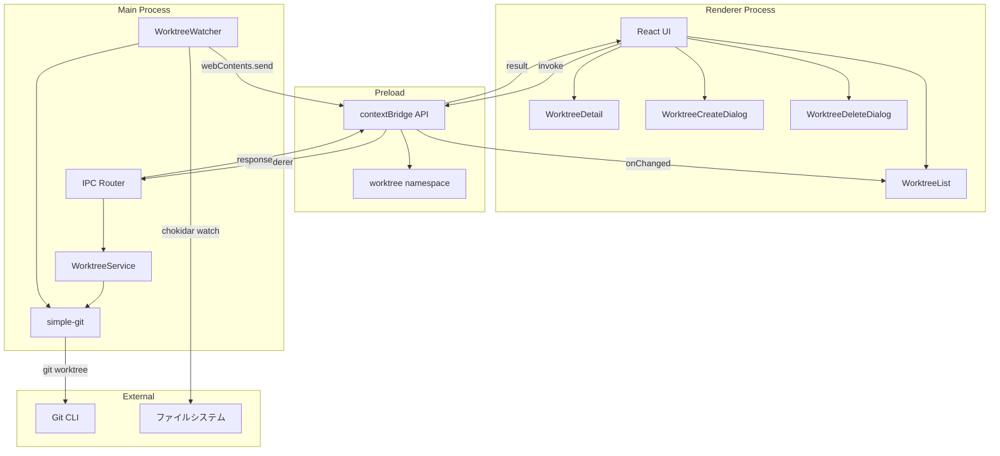

# ワークツリー管理

**関連 Spec:** [worktree-management_spec.md](./worktree-management_spec.md)
**関連 PRD:** [worktree-management.md](../requirement/worktree-management.md)

---

# 1. 実装ステータス

**ステータス:** 🔴 未実装

## 1.1. 実装進捗

| モジュール/機能 | ステータス | 備考 |
|--------------|----------|------|
| WorktreeService | 🔴 | Git worktree 操作のサービス層 |
| WorktreeWatcher | 🔴 | ファイルシステム監視 |
| IPC ハンドラー (worktree:*) | 🔴 | ワークツリー関連の IPC チャネル |
| WorktreeList コンポーネント | 🔴 | 左パネルの一覧表示 |
| WorktreeDetail コンポーネント | 🔴 | 右パネルの詳細表示 |
| WorktreeCreateDialog コンポーネント | 🔴 | 作成ダイアログ |
| WorktreeDeleteDialog コンポーネント | 🔴 | 削除確認ダイアログ |

---

# 2. 設計目標

1. **Worktree-First UX** — ワークツリーを UI の主軸に据え、左パネル一覧 + 右パネル詳細の2カラムレイアウトを実現する（原則 B-001）
2. **安全な Git 操作** — 不可逆操作（削除）には確認ステップを設け、メインワークツリーの削除を防止する（原則 B-002）
3. **Electron プロセス分離** — すべての Git 操作をメインプロセスで実行し、preload + contextBridge 経由でレンダラーに API を公開する（原則 A-001, T-003）
4. **型安全な IPC 通信** — `IPCResult<T>` パターンですべてのレスポンスを統一し、コンパイル時にエラーを検出する（原則 T-001, T-002）
5. **リアルタイム状態反映** — ファイルシステム監視によりワークツリーの状態変化を自動検出・UI 反映する

---

# 3. 技術スタック

> 以下はプロジェクト共通の技術スタックです。機能固有の追加技術のみ記載してください。

| 領域 | 採用技術 | 選定理由 |
|------|----------|----------|
| Git 操作 | simple-git | Git CLI のラッパー。`worktree list --porcelain` のパース、`worktree add/remove` の実行に使用。メンテナンスが活発で API が直感的（原則 A-002: Library-First） |
| ファイルシステム監視 | chokidar | Node.js のクロスプラットフォームファイル監視。macOS FSEvents / Linux inotify / Windows ReadDirectoryChangesW を抽象化。デバウンス機能内蔵（原則 A-002） |
| ダイアログ UI | Shadcn/ui Dialog | Shadcn/ui が提供するアクセシブルなダイアログコンポーネント。Tailwind CSS との統合が良好 |

<details>
<summary>プロジェクト共通スタック（参考）</summary>

| 領域 | 採用技術 |
|------|----------|
| フレームワーク | Electron 41 + Electron Forge 7 |
| バンドラー | Vite 5 |
| UI | React 19 + TypeScript |
| スタイリング | Tailwind CSS v4 (`@tailwindcss/postcss`) |
| UIコンポーネント | Shadcn/ui |
| Git操作 | simple-git（予定） |
| エディタ | Monaco Editor（予定） |

</details>

---

# 4. アーキテクチャ

## 4.1. システム構成図



## 4.2. モジュール分割

| モジュール名 | プロセス | 責務 | 配置場所 |
|------------|---------|------|---------|
| WorktreeService | main | ワークツリーの CRUD 操作、状態取得 | `src/main/services/worktree.ts` |
| WorktreeWatcher | main | ファイルシステム監視、変更イベント発火 | `src/main/services/worktree-watcher.ts` |
| IPC ハンドラー (worktree) | main | worktree:* チャネルの登録・ルーティング | `src/main/ipc/worktree-handlers.ts` |
| ワークツリー型定義 | shared | WorktreeInfo, WorktreeStatus 等の型定義 | `src/types/worktree.ts` |
| preload API (worktree) | preload | contextBridge による worktree API 公開 | `src/preload.ts` |
| WorktreeList | renderer | 左パネルのワークツリー一覧 UI | `src/components/worktree/WorktreeList.tsx` |
| WorktreeListItem | renderer | ワークツリー一覧の各行 UI | `src/components/worktree/WorktreeListItem.tsx` |
| WorktreeDetail | renderer | 右パネルの詳細表示 UI | `src/components/worktree/WorktreeDetail.tsx` |
| WorktreeCreateDialog | renderer | 作成ダイアログ UI | `src/components/worktree/WorktreeCreateDialog.tsx` |
| WorktreeDeleteDialog | renderer | 削除確認ダイアログ UI | `src/components/worktree/WorktreeDeleteDialog.tsx` |
| useWorktrees フック | renderer | ワークツリー一覧の状態管理・自動更新 | `src/hooks/useWorktrees.ts` |
| useWorktreeStatus フック | renderer | 選択ワークツリーの詳細状態管理 | `src/hooks/useWorktreeStatus.ts` |

---

# 5. データモデル

```typescript
// src/types/worktree.ts

// ワークツリー情報（git worktree list --porcelain のパース結果）
interface WorktreeInfo {
  path: string;           // ワークツリーのファイルシステムパス
  branch: string | null;  // チェックアウト中のブランチ名（detached HEAD の場合 null）
  head: string;           // HEAD コミットの SHA（短縮形）
  headMessage: string;    // HEAD コミットメッセージ（1行目）
  isMain: boolean;        // メインワークツリーかどうか
  isDirty: boolean;       // 未コミット変更があるか
}

// ワークツリー詳細ステータス
interface WorktreeStatus {
  worktree: WorktreeInfo;
  staged: FileChange[];
  unstaged: FileChange[];
  untracked: string[];
}

// ファイル変更情報
interface FileChange {
  path: string;
  status: FileChangeStatus;
}

type FileChangeStatus =
  | 'added'
  | 'modified'
  | 'deleted'
  | 'renamed'
  | 'copied';

// ワークツリー作成パラメータ
interface WorktreeCreateParams {
  repoPath: string;
  worktreePath: string;
  branch: string;
  createNewBranch: boolean;
  startPoint?: string;
}

// ワークツリー削除パラメータ
interface WorktreeDeleteParams {
  repoPath: string;
  worktreePath: string;
  force: boolean;
}

// ワークツリー状態変化イベント
interface WorktreeChangeEvent {
  repoPath: string;
  type: 'added' | 'removed' | 'modified';
  worktreePath: string;
}

// ワークツリー一覧の並び替えオプション
type WorktreeSortOrder = 'name' | 'last-updated';
```

---

# 6. インターフェース定義

## 6.1. IPC ハンドラー（メインプロセス側）

```typescript
// src/main/ipc/worktree-handlers.ts
import { ipcMain } from 'electron';
import type { IPCResult } from '../../types/ipc';
import type {
  WorktreeInfo,
  WorktreeStatus,
  WorktreeCreateParams,
  WorktreeDeleteParams,
} from '../../types/worktree';

export function registerWorktreeHandlers(
  worktreeService: WorktreeService,
): void {
  ipcMain.handle(
    'worktree:list',
    async (_event, repoPath: string): Promise<IPCResult<WorktreeInfo[]>> => {
      return worktreeService.list(repoPath);
    },
  );

  ipcMain.handle(
    'worktree:status',
    async (
      _event,
      params: { repoPath: string; worktreePath: string },
    ): Promise<IPCResult<WorktreeStatus>> => {
      return worktreeService.getStatus(params.repoPath, params.worktreePath);
    },
  );

  ipcMain.handle(
    'worktree:create',
    async (
      _event,
      params: WorktreeCreateParams,
    ): Promise<IPCResult<WorktreeInfo>> => {
      return worktreeService.create(params);
    },
  );

  ipcMain.handle(
    'worktree:delete',
    async (
      _event,
      params: WorktreeDeleteParams,
    ): Promise<IPCResult<void>> => {
      return worktreeService.delete(params);
    },
  );

  ipcMain.handle(
    'worktree:suggest-path',
    async (
      _event,
      params: { repoPath: string; branch: string },
    ): Promise<IPCResult<string>> => {
      return worktreeService.suggestPath(params.repoPath, params.branch);
    },
  );

  ipcMain.handle(
    'worktree:check-dirty',
    async (_event, worktreePath: string): Promise<IPCResult<boolean>> => {
      return worktreeService.checkDirty(worktreePath);
    },
  );
}
```

## 6.2. WorktreeService（メインプロセス側）

```typescript
// src/main/services/worktree.ts
import simpleGit, { type SimpleGit } from 'simple-git';
import type { IPCResult } from '../../types/ipc';
import type {
  WorktreeInfo,
  WorktreeStatus,
  WorktreeCreateParams,
  WorktreeDeleteParams,
} from '../../types/worktree';

export class WorktreeService {
  /**
   * リポジトリの全ワークツリーを取得する
   * git worktree list --porcelain + 各ワークツリーの dirty チェック
   */
  async list(repoPath: string): Promise<IPCResult<WorktreeInfo[]>> {
    // ...
  }

  /**
   * ワークツリーの詳細ステータスを取得する
   * git status --porcelain のパース
   */
  async getStatus(
    repoPath: string,
    worktreePath: string,
  ): Promise<IPCResult<WorktreeStatus>> {
    // ...
  }

  /**
   * 新規ワークツリーを作成する
   * createNewBranch=true: git worktree add -b <branch> <path> <start-point>
   * createNewBranch=false: git worktree add <path> <branch>
   */
  async create(params: WorktreeCreateParams): Promise<IPCResult<WorktreeInfo>> {
    // ...
  }

  /**
   * ワークツリーを削除する
   * メインワークツリーの削除はエラーを返す
   * force=true: git worktree remove --force <path>
   * force=false: git worktree remove <path>
   */
  async delete(params: WorktreeDeleteParams): Promise<IPCResult<void>> {
    // ...
  }

  /**
   * デフォルト作成先パスを提案する
   * 親ディレクトリ + ブランチ名のサニタイズ
   */
  async suggestPath(
    repoPath: string,
    branch: string,
  ): Promise<IPCResult<string>> {
    // ...
  }

  /**
   * ワークツリーに未コミット変更があるか確認する
   */
  async checkDirty(worktreePath: string): Promise<IPCResult<boolean>> {
    // ...
  }
}
```

## 6.3. WorktreeWatcher（メインプロセス側）

```typescript
// src/main/services/worktree-watcher.ts
import chokidar, { type FSWatcher } from 'chokidar';
import type { BrowserWindow } from 'electron';
import type { WorktreeChangeEvent } from '../../types/worktree';

export class WorktreeWatcher {
  private watcher: FSWatcher | null = null;
  private debounceTimer: NodeJS.Timeout | null = null;

  /**
   * 指定リポジトリの .git/worktrees ディレクトリを監視開始する
   * 変更検出時に worktree:changed イベントをレンダラーに送信する
   */
  start(repoPath: string, window: BrowserWindow): void {
    // .git/worktrees ディレクトリを chokidar で監視
    // デバウンス: 300ms（短時間の連続イベントを集約）
    // 変更検出時: window.webContents.send('worktree:changed', event)
  }

  /**
   * 監視を停止する
   */
  stop(): void {
    // ...
  }
}
```

## 6.4. Preload API（contextBridge 経由）

```typescript
// src/preload.ts（worktree 名前空間の追加分）
import { contextBridge, ipcRenderer } from 'electron';
import type {
  WorktreeInfo,
  WorktreeStatus,
  WorktreeCreateParams,
  WorktreeDeleteParams,
  WorktreeChangeEvent,
} from './types/worktree';
import type { IPCResult } from './types/ipc';

// 既存の electronAPI に worktree 名前空間を追加
contextBridge.exposeInMainWorld('electronAPI', {
  // ...既存の repository, settings, onError...

  worktree: {
    list: (repoPath: string): Promise<IPCResult<WorktreeInfo[]>> =>
      ipcRenderer.invoke('worktree:list', repoPath),
    status: (
      repoPath: string,
      worktreePath: string,
    ): Promise<IPCResult<WorktreeStatus>> =>
      ipcRenderer.invoke('worktree:status', { repoPath, worktreePath }),
    create: (params: WorktreeCreateParams): Promise<IPCResult<WorktreeInfo>> =>
      ipcRenderer.invoke('worktree:create', params),
    delete: (params: WorktreeDeleteParams): Promise<IPCResult<void>> =>
      ipcRenderer.invoke('worktree:delete', params),
    suggestPath: (
      repoPath: string,
      branch: string,
    ): Promise<IPCResult<string>> =>
      ipcRenderer.invoke('worktree:suggest-path', { repoPath, branch }),
    checkDirty: (worktreePath: string): Promise<IPCResult<boolean>> =>
      ipcRenderer.invoke('worktree:check-dirty', worktreePath),
    onChanged: (callback: (event: WorktreeChangeEvent) => void): (() => void) => {
      const handler = (_event: Electron.IpcRendererEvent, data: WorktreeChangeEvent) => {
        callback(data);
      };
      ipcRenderer.on('worktree:changed', handler);
      return () => {
        ipcRenderer.removeListener('worktree:changed', handler);
      };
    },
  },
});
```

## 6.5. レンダラー側の型定義

```typescript
// src/types/electron.d.ts（worktree 名前空間の追加分）
import type {
  WorktreeInfo,
  WorktreeStatus,
  WorktreeCreateParams,
  WorktreeDeleteParams,
  WorktreeChangeEvent,
} from './worktree';
import type { IPCResult } from './ipc';

interface ElectronAPI {
  // ...既存の repository, settings, onError...

  worktree: {
    list(repoPath: string): Promise<IPCResult<WorktreeInfo[]>>;
    status(
      repoPath: string,
      worktreePath: string,
    ): Promise<IPCResult<WorktreeStatus>>;
    create(params: WorktreeCreateParams): Promise<IPCResult<WorktreeInfo>>;
    delete(params: WorktreeDeleteParams): Promise<IPCResult<void>>;
    suggestPath(repoPath: string, branch: string): Promise<IPCResult<string>>;
    checkDirty(worktreePath: string): Promise<IPCResult<boolean>>;
    onChanged(callback: (event: WorktreeChangeEvent) => void): () => void;
  };
}

declare global {
  interface Window {
    electronAPI: ElectronAPI;
  }
}
```

---

# 7. 非機能要件実現方針

| 要件 | 実現方針 |
|------|----------|
| 一覧表示1秒以内 (NFR_101) | `git worktree list --porcelain` は高速。dirty チェックは並列実行（Promise.all）。50ワークツリーまでは問題なし |
| 切り替え500ms以内 (NFR_102) | `worktree:status` は単一ワークツリーの `git status --porcelain` のみ。軽量操作 |
| リアルタイム更新 (FR_105) | chokidar の `.git/worktrees` 監視 + 300ms デバウンス。不要な再取得を防止 |
| Electron セキュリティ (A-001, T-003) | すべての Git 操作はメインプロセスで実行。preload 経由の API 公開のみ |
| 安全性 (B-002) | 削除前に dirty チェック + 確認ダイアログ。メインワークツリー削除はサービス層で防止 |

---

# 8. テスト戦略

| テストレベル | 対象 | カバレッジ目標 |
|------------|------|------------|
| ユニットテスト | WorktreeService（list, create, delete, suggestPath, checkDirty） | ≥ 80% |
| ユニットテスト | `git worktree list --porcelain` 出力のパース処理 | ≥ 90% |
| ユニットテスト | WorktreeCreateParams / WorktreeDeleteParams のバリデーション | ≥ 80% |
| 結合テスト | IPC ハンドラー → WorktreeService → simple-git 連携 | 主要フロー |
| コンポーネントテスト | WorktreeList, WorktreeListItem の描画・選択・イベント | ≥ 60% |
| コンポーネントテスト | WorktreeCreateDialog, WorktreeDeleteDialog のフォーム操作 | ≥ 60% |
| E2Eテスト | ワークツリーの作成→一覧表示→選択→削除のフルフロー | 主要ユースケース |

**テスト環境の注意事項:**

- ユニットテスト / 結合テストでは simple-git をモック化し、実際の Git リポジトリを使用しない
- E2E テストでは一時ディレクトリに Git リポジトリを作成してテスト
- WorktreeWatcher のテストでは chokidar のイベントをモック化

---

# 9. 設計判断

## 9.1. 決定事項

| 決定事項 | 選択肢 | 決定内容 | 理由 |
|----------|--------|----------|------|
| Git 操作ライブラリ | simple-git / nodegit / isomorphic-git / 生の child_process | simple-git | メンテナンスが活発、API が直感的、`worktree` サブコマンドをサポート。CONSTITUTION.md の技術スタック制約で指定済み（原則 A-002） |
| ファイルシステム監視ライブラリ | chokidar / Node.js fs.watch / nsfw | chokidar | クロスプラットフォーム対応、デバウンス内蔵、安定した API。fs.watch は OS 間の挙動差が大きい（原則 A-002） |
| worktree list のパース方法 | `--porcelain` 出力パース / `git worktree list` テキストパース | `--porcelain` 出力 | 機械可読フォーマット。テキスト出力は locale 依存のリスクあり |
| dirty チェックの実行タイミング | 一覧取得時に一括 / 個別に遅延取得 | 一覧取得時に並列一括実行 | 50ワークツリーまでは Promise.all で十分高速（NFR_101: 1秒以内）。UX として一覧表示時に dirty 状態を即座に把握できる方が有用 |
| デフォルトパスの提案ロジック | リポジトリ隣接 / リポジトリ内 / 設定パス | リポジトリの親ディレクトリ + ブランチ名のサニタイズ | Git worktree の一般的な配置パターン。リポジトリ名_ブランチ名 の形式（例: `myrepo_feature-foo`） |
| メインワークツリー削除防止の実装箇所 | UI のみ / サービス層のみ / 両方 | UI + サービス層の両方 | 防御的プログラミング。UI でボタンを無効化しつつ、サービス層でもチェック（原則 B-002） |
| IPC チャネル命名 | `worktree-list` / `worktree:list` | `worktree:list`（名前空間方式） | application-foundation と一貫した命名規則。ドメインごとのグルーピング |

## 9.2. 未解決の課題

| 課題 | 影響度 | 対応方針 |
|------|--------|----------|
| simple-git の `worktree list --porcelain` サポート状況 | 中 | simple-git が直接サポートしない場合は `git.raw()` で生コマンドを実行し、出力をパースする |
| chokidar の Electron 41 + Vite 5 との互換性 | 中 | 実装時に検証。問題がある場合は Node.js 標準の `fs.watch` + 自前デバウンスを代替案とする |
| ワークツリー数が多い場合（50超）のパフォーマンス | 低 | 初期は50以下を想定。超過時は仮想スクロール + dirty チェックの遅延実行を検討 |
| detached HEAD 状態のワークツリーの表示方法 | 低 | ブランチ名の代わりに HEAD の短縮 SHA を表示。UI 上で視覚的に区別可能にする |

---

# 10. 変更履歴

## v1.0

**変更内容:**

- 初版作成
- WorktreeService、WorktreeWatcher、IPC ハンドラー、React コンポーネントの設計を定義
- simple-git + chokidar の技術選定
- テスト戦略の策定
