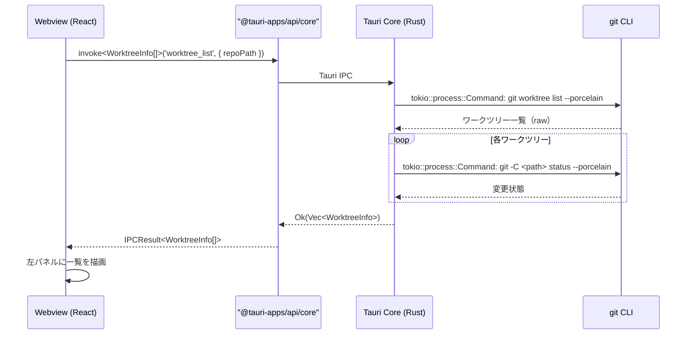
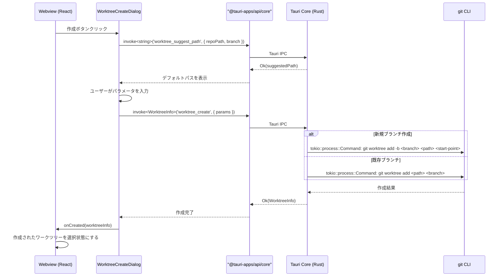
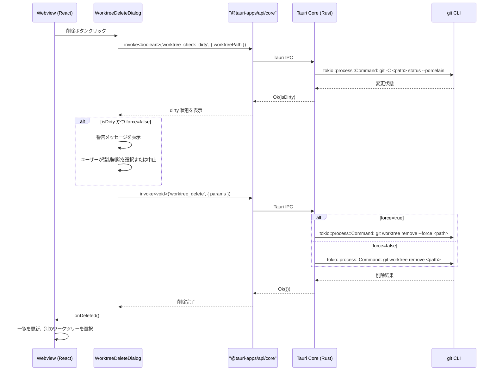
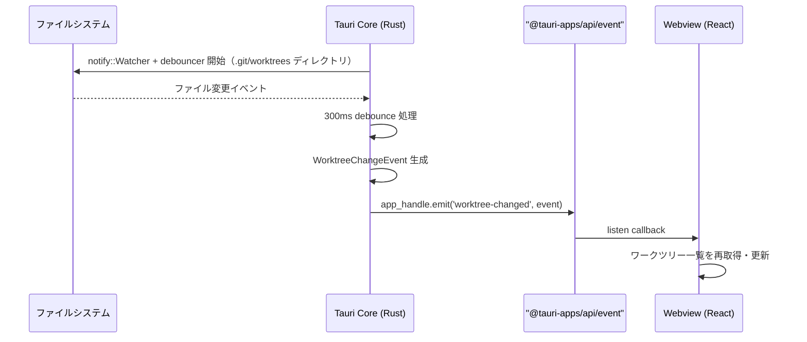

# ワークツリー管理

**関連 Design Doc:** [worktree-management_design.md](./worktree-management_design.md)
**関連 PRD:** [worktree-management.md](../requirement/worktree-management.md)

---

# 1. 背景

Buruma は Git ワークツリーを主軸とした GUI アプリケーションであり、ワークツリー管理はその中核機能である（原則 B-001: Worktree-First UX）。開発者は複数のブランチで並行作業を行う際に `git worktree` を活用するが、CLI での管理は煩雑であり、視覚的な状態把握が困難である。

本仕様は PRD [worktree-management.md](../requirement/worktree-management.md) の要求（UR_101〜UR_104, FR_101〜FR_105, NFR_101〜NFR_102, DC_101）を実現するための論理設計を定義する。アプリケーション基盤（[application-foundation_spec.md](./application-foundation_spec.md)）が提供する IPC 通信基盤・エラーハンドリング・リポジトリ管理の上に構築される。

# 2. 概要

ワークツリー管理は以下の5つの機能で構成される：

1. **ワークツリー一覧表示** — 左パネルにリポジトリの全ワークツリーを一覧し、パス・ブランチ名・変更状態を表示する（FR_101）
2. **ワークツリー作成** — ダイアログ経由で新規ワークツリーを作成する（既存/新規ブランチ指定、パス指定）（FR_102）
3. **ワークツリー削除** — 安全確認ダイアログ付きでワークツリーを削除する（FR_103）
4. **ワークツリー切り替え** — 一覧からの選択で右パネルの詳細表示を切り替える（FR_104）
5. **ワークツリー状態監視** — ファイルシステム監視による状態変化のリアルタイム反映（FR_105）

すべての操作は Tauri の境界分離（原則 A-001）を遵守し、Git 操作は Tauri Core (Rust) で `tokio::process::Command` 経由の `git worktree` コマンドで実行する（DC_101）。不可逆な操作（削除）には確認ステップを設ける（原則 B-002）。

# 3. 要求定義

## 3.1. 機能要件 (Functional Requirements)

| ID | 要件 | 優先度 | 根拠 (PRD) |
|--------|------|------|------|
| FR-001 | リポジトリの全ワークツリーを左パネルに一覧表示する | 必須 | FR_101 (FR_101_01) |
| FR-002 | 各ワークツリーのパス、ブランチ名、HEAD コミットを表示する | 必須 | FR_101 (FR_101_02) |
| FR-003 | 各ワークツリーの変更状態（dirty/clean）をインジケーターで表示する | 必須 | FR_101 (FR_101_03) |
| FR-004 | ワークツリーの並び替え（名前順、最終更新順）を提供する | 推奨 | FR_101 (FR_101_04) |
| FR-005 | メインワークツリーと追加ワークツリーを視覚的に区別する | 必須 | FR_101 (FR_101_05) |
| FR-006 | 既存ブランチを指定してワークツリーを作成する | 必須 | FR_102 (FR_102_01) |
| FR-007 | 新規ブランチを指定してワークツリーを作成する（`-b` オプション相当） | 必須 | FR_102 (FR_102_02) |
| FR-008 | 作成先パスを指定する（デフォルトパスの自動提案付き） | 必須 | FR_102 (FR_102_03) |
| FR-009 | ワークツリー作成完了後に自動で選択状態にする | 推奨 | FR_102 (FR_102_04) |
| FR-010 | ワークツリー削除前に確認ダイアログを表示する | 必須 | FR_103 (FR_103_01) |
| FR-011 | 未コミット変更がある場合に削除前に警告メッセージを表示する | 必須 | FR_103 (FR_103_02) |
| FR-012 | 強制削除オプション（`--force` 相当）を提供する | 推奨 | FR_103 (FR_103_03) |
| FR-013 | メインワークツリーの削除を防止する | 必須 | FR_103 (FR_103_04) |
| FR-014 | 一覧項目のクリック/キーボード選択による詳細パネル切り替えを提供する | 必須 | FR_104 (FR_104_01) |
| FR-015 | 詳細パネルにブランチ情報・ステータス・ログ・差分・変更ファイルを表示する | 必須 | FR_104 (FR_104_02) |
| FR-016 | 選択中のワークツリーを視覚的にハイライトする | 必須 | FR_104 (FR_104_03) |
| FR-017 | ファイルシステムウォッチャーによるワークツリーの変更検出を行う | 推奨 | FR_105 (FR_105_01) |
| FR-018 | 変更検出時にワークツリー一覧を自動リフレッシュする | 推奨 | FR_105 (FR_105_02) |
| FR-019 | 外部で作成/削除されたワークツリーを検出する | 推奨 | FR_105 (FR_105_03) |

## 3.2. 非機能要件 (Non-Functional Requirements)

| ID | カテゴリ | 要件 | 目標値 | 根拠 (PRD) |
|---------|------|------|------|------|
| NFR-001 | 性能 | ワークツリー一覧の初期表示完了 | 1秒以内（ワークツリー数50以下） | NFR_101 |
| NFR-002 | 性能 | ワークツリー切り替え時の詳細パネル更新 | 500ms以内 | NFR_102 |
| NFR-003 | 安全性 | 不可逆操作（削除）には確認ステップを設ける | 確認ダイアログ必須 | B-002 |

# 4. API

## 4.1. IPC API（Tauri Core ↔ Webview）

### 4.1.1. ワークツリー一覧・状態取得（Commands, Webview → Core `invoke`）

| Command 名 | 概要 | 引数 | 戻り値 |
|-----------|------|------|--------|
| `worktree_list` | リポジトリの全ワークツリー一覧を取得する | `{ repoPath: string }` | `WorktreeInfo[]` |
| `worktree_status` | 指定ワークツリーの詳細ステータスを取得する | `{ repoPath: string; worktreePath: string }` | `WorktreeStatus` |

### 4.1.2. ワークツリー作成・削除（Commands, Webview → Core `invoke`）

| Command 名 | 概要 | 引数 | 戻り値 |
|-----------|------|------|--------|
| `worktree_create` | 新規ワークツリーを作成する | `WorktreeCreateParams` | `WorktreeInfo` |
| `worktree_delete` | ワークツリーを削除する | `WorktreeDeleteParams` | `void` |

### 4.1.3. ワークツリー状態監視（Events, Core → Webview `emit` / `listen`）

| Event 名 | 概要 | ペイロード |
|---------|------|-----------|
| `worktree-changed` | ワークツリーの状態変化を通知する（`.git/worktrees` の変更を `notify` crate で監視） | `WorktreeChangeEvent` |

### 4.1.4. ワークツリーユーティリティ（Commands, Webview → Core `invoke`）

| Command 名 | 概要 | 引数 | 戻り値 |
|-----------|------|------|--------|
| `worktree_suggest_path` | デフォルト作成先パスを提案する | `{ repoPath: string; branch: string }` | `string` |
| `worktree_check_dirty` | ワークツリーに未コミット変更があるか確認する | `{ worktreePath: string }` | `boolean` |
| `worktree_default_branch` | リポジトリのデフォルトブランチ名を取得する | `{ repoPath: string }` | `string` |

> **IPCResult<T> 互換**: Webview 側は `src/shared/lib/invoke/commands.ts` の `invokeCommand<T>` ラッパーを経由して呼び出し、Rust 側の `Result<T, AppError>` を `IPCResult<T>` 形式に変換する。

## 4.2. React コンポーネント API

| コンポーネント | Props | 概要 |
|--------------|-------|------|
| `WorktreeList` | `{ repoPath: string; selectedPath: string \| null; onSelect: (worktree: WorktreeInfo) => void; onCreateClick: () => void }` | 左パネルのワークツリー一覧 |
| `WorktreeListItem` | `{ worktree: WorktreeInfo; isSelected: boolean; isMain: boolean; onClick: () => void; onDeleteClick: () => void }` | ワークツリー一覧の各行 |
| `WorktreeDetail` | `{ repoPath: string; worktreePath: string }` | 右パネルのワークツリー詳細（ブランチ、ステータス、ログ、差分、変更ファイル） |
| `WorktreeCreateDialog` | `{ repoPath: string; open: boolean; onOpenChange: (open: boolean) => void; onCreated: (worktree: WorktreeInfo) => void }` | ワークツリー作成ダイアログ |
| `WorktreeDeleteDialog` | `{ worktree: WorktreeInfo; open: boolean; onOpenChange: (open: boolean) => void; onDeleted: () => void }` | ワークツリー削除確認ダイアログ |

## 4.3. 型定義

```typescript
// ワークツリー情報
interface WorktreeInfo {
  path: string;           // ワークツリーのファイルシステムパス
  branch: string | null;  // チェックアウト中のブランチ名（detached HEAD の場合 null）
  head: string;           // HEAD コミットの SHA（短縮形）
  headMessage: string;    // HEAD コミットメッセージ（1行目）
  isMain: boolean;        // メインワークツリーかどうか
  isDirty: boolean;       // 未コミット変更があるか
}

// ワークツリー詳細ステータス
interface WorktreeStatus {
  worktree: WorktreeInfo;
  staged: FileChange[];      // ステージ済み変更
  unstaged: FileChange[];    // 未ステージ変更
  untracked: string[];       // 未追跡ファイル
}

// ファイル変更情報
interface FileChange {
  path: string;
  status: FileChangeStatus;
}

type FileChangeStatus =
  | 'added'
  | 'modified'
  | 'deleted'
  | 'renamed'
  | 'copied';

// ワークツリー作成パラメータ
interface WorktreeCreateParams {
  repoPath: string;              // リポジトリパス
  worktreePath: string;          // 作成先パス
  branch: string;                // ブランチ名
  createNewBranch: boolean;      // 新規ブランチとして作成するか
  startPoint?: string;           // 新規ブランチの起点（createNewBranch=true の場合）
}

// ワークツリー削除パラメータ
interface WorktreeDeleteParams {
  repoPath: string;              // リポジトリパス
  worktreePath: string;          // 削除対象パス
  force: boolean;                // 強制削除フラグ
}

// ワークツリー状態変化イベント
interface WorktreeChangeEvent {
  repoPath: string;
  type: 'added' | 'removed' | 'modified';
  worktreePath: string;
}

// ワークツリー一覧の並び替えオプション
type WorktreeSortOrder = 'name' | 'last-updated';
```

# 5. 用語集

| 用語 | 説明 |
|------|------|
| ワークツリー | Git worktree。同一リポジトリの複数チェックアウトを管理する仕組み |
| メインワークツリー | リポジトリのクローン時に作成される最初のワークツリー。削除不可 |
| 追加ワークツリー | `git worktree add` で作成されたワークツリー。削除可能 |
| dirty | 未コミットの変更がある状態 |
| clean | 未コミットの変更がない状態 |
| detached HEAD | 特定のブランチにチェックアウトしていない状態 |
| 左パネル | Buruma の UI で常時表示されるワークツリー一覧エリア |
| 右パネル（詳細パネル） | 選択したワークツリーの詳細情報を表示するエリア |

# 6. 使用例

```tsx
import { invokeCommand, listenEvent } from '@/shared/lib/invoke'
import type { WorktreeInfo, WorktreeChangeEvent } from '@/shared/domain'

// Webview 側：ワークツリー一覧を取得
const result = await invokeCommand<WorktreeInfo[]>('worktree_list', { repoPath })
if (result.success) {
  setWorktrees(result.data)
}

// Webview 側：ワークツリーを作成
const created = await invokeCommand<WorktreeInfo>('worktree_create', {
  params: {
    repoPath,
    worktreePath: '/path/to/new-worktree',
    branch: 'feature/new-feature',
    createNewBranch: true,
    startPoint: 'main',
  },
})
if (created.success) {
  setSelectedWorktree(created.data)
}

// Webview 側：ワークツリーを削除（確認後）
const deleted = await invokeCommand<void>('worktree_delete', {
  params: { repoPath, worktreePath: worktree.path, force: false },
})

// Webview 側：ワークツリー状態変化の購読
const unlisten = await listenEvent<WorktreeChangeEvent>('worktree-changed', (event) => {
  refreshWorktreeList()
})
// クリーンアップ時: unlisten()

// React コンポーネントの使用例
<WorktreeList
  repoPath={repoPath}
  selectedPath={selectedWorktree?.path ?? null}
  onSelect={(wt) => setSelectedWorktree(wt)}
  onCreateClick={() => setCreateDialogOpen(true)}
/>
<WorktreeDetail
  repoPath={repoPath}
  worktreePath={selectedWorktree.path}
/>
```

# 7. 振る舞い図

## 7.1. ワークツリー一覧取得フロー



## 7.2. ワークツリー作成フロー



## 7.3. ワークツリー削除フロー



## 7.4. ワークツリー状態監視フロー



# 8. 制約事項

- Webview から OS API（fs / process / shell）に直接アクセスしない（原則 A-001）
- Git 操作は必ず Tauri Core (Rust) で実行する（原則 A-001）
- ワークツリー操作は `git worktree` コマンド経由で実行し、`.git` ディレクトリへの直接ファイル操作は行わない（DC_101）
- IPC 通信は `IPCResult<T>` 互換ラッパー（`invokeCommand<T>`）で統一し、エラーハンドリングを一貫させる（原則 T-002）
- 不可逆操作（ワークツリー削除）には確認ダイアログを必ず表示する（原則 B-002）
- メインワークツリーの削除は常に防止する（FR_103_04）
- Git 2.5 以上が前提（`git worktree` コマンドの互換性）
- ファイル監視には `notify` + `notify-debouncer-full` crate を使用する（原則 A-002）

---

# PRD 整合性確認

| PRD 要求 ID | 本仕様での対応 | ステータス |
|-------------|--------------|----------|
| UR_101 | 仕様全体（左パネル一覧 + 右パネル詳細の2カラムレイアウト） | 対応済み |
| UR_102 | FR-001〜FR-005 + worktree:list API | 対応済み |
| UR_103 | FR-006〜FR-013 + worktree:create / worktree:delete API | 対応済み |
| UR_104 | FR-014〜FR-016 + WorktreeDetail コンポーネント | 対応済み |
| FR_101 | FR-001〜FR-005（一覧表示、パス・ブランチ・状態、並び替え、メイン区別） | 対応済み |
| FR_101_01 | FR-001 + worktree:list IPC | 対応済み |
| FR_101_02 | FR-002 + WorktreeInfo 型 | 対応済み |
| FR_101_03 | FR-003 + WorktreeInfo.isDirty | 対応済み |
| FR_101_04 | FR-004 + WorktreeSortOrder 型 | 対応済み |
| FR_101_05 | FR-005 + WorktreeInfo.isMain | 対応済み |
| FR_102 | FR-006〜FR-009（作成ダイアログ、ブランチ指定、パス指定） | 対応済み |
| FR_102_01 | FR-006 + WorktreeCreateParams | 対応済み |
| FR_102_02 | FR-007 + WorktreeCreateParams.createNewBranch | 対応済み |
| FR_102_03 | FR-008 + worktree:suggest-path IPC | 対応済み |
| FR_102_04 | FR-009 + WorktreeCreateDialog.onCreated | 対応済み |
| FR_103 | FR-010〜FR-013（削除確認、未コミット警告、強制削除、メイン保護） | 対応済み |
| FR_103_01 | FR-010 + WorktreeDeleteDialog | 対応済み |
| FR_103_02 | FR-011 + worktree:check-dirty IPC | 対応済み |
| FR_103_03 | FR-012 + WorktreeDeleteParams.force | 対応済み |
| FR_103_04 | FR-013 + WorktreeInfo.isMain チェック | 対応済み |
| FR_104 | FR-014〜FR-016（切り替え、詳細表示、ハイライト） | 対応済み |
| FR_104_01 | FR-014 + WorktreeList.onSelect | 対応済み |
| FR_104_02 | FR-015 + WorktreeDetail コンポーネント | 対応済み |
| FR_104_03 | FR-016 + WorktreeListItem.isSelected | 対応済み |
| FR_105 | FR-017〜FR-019（ファイルシステム監視、自動リフレッシュ） | 対応済み |
| FR_105_01 | FR-017 + FSWatcher（振る舞い図 7.4） | 対応済み |
| FR_105_02 | FR-018 + worktree:changed イベント | 対応済み |
| FR_105_03 | FR-019 + WorktreeChangeEvent.type | 対応済み |
| NFR_101 | NFR-001（1秒以内の初期表示） | 対応済み |
| NFR_102 | NFR-002（500ms以内の切り替え） | 対応済み |
| DC_101 | 制約事項 + git worktree コマンド経由の操作 | 対応済み |
