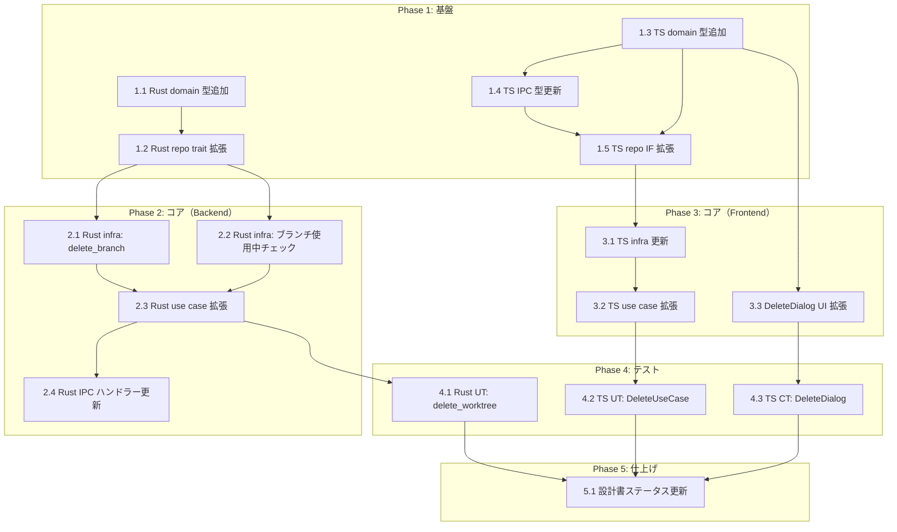

# FR_103_05: ワークツリー削除時のローカルブランチ同時削除 タスク分解

## メタ情報

| 項目 | 内容 |
|:---|:---|
| 機能名 | ワークツリー削除時のローカルブランチ同時削除 |
| チケット番号 | FR_103_05 |
| 設計書 | `.sdd/specification/worktree-management_design.md` |
| 作成日 | 2026-04-14 |

## タスク一覧

### Phase 1: 基盤（型定義・インターフェース拡張）

| # | タスク | 説明 | 完了条件 | 依存 |
|:---|:---|:---|:---|:---|
| 1.1 | Rust domain 型追加 | `domain.rs` に `BranchDeleteResult` 型（3バリアント: deleted / skipped / requireForce）を追加。`WorktreeDeleteParams` に `delete_branch: bool` フィールドを追加 | `cargo build` が成功し、`BranchDeleteResult` と拡張された `WorktreeDeleteParams` がコンパイルされる | - |
| 1.2 | Rust repository trait 拡張 | `repositories.rs` の `WorktreeGitRepository` trait に `delete_branch(&self, repo_path: &str, branch: &str, force: bool) -> AppResult<BranchDeleteResult>` メソッドを追加 | `cargo build` が成功し、trait の新メソッドが定義される | 1.1 |
| 1.3 | TS domain 型追加 | `src/domain/index.ts` の `WorktreeDeleteParams` に `deleteBranch: boolean` を追加。`BranchDeleteResult` 型（3バリアントの判別共用体）を追加 | `npm run typecheck` が成功する | - |
| 1.4 | TS IPC 型更新 | `src/lib/ipc.ts` の `worktree_delete` の `result` を `void` から `BranchDeleteResult \| null` に変更 | `npm run typecheck` が成功する | 1.3 |
| 1.5 | TS repository IF 拡張 | `worktree-repository.ts` の `delete()` の戻り値型を `Promise<BranchDeleteResult \| null>` に変更。`WORKTREE_ERROR_CODES` にブランチ関連エラーコード（`BRANCH_NOT_MERGED`）を追加 | `npm run typecheck` が成功する | 1.3, 1.4 |

### Phase 2: コア実装（バックエンド）

| # | タスク | 説明 | 完了条件 | 依存 |
|:---|:---|:---|:---|:---|
| 2.1 | Rust infrastructure 実装: `delete_branch` | `git_repository.rs` の `DefaultWorktreeGitRepository` に `delete_branch` を実装。`git branch -d <branch>` を実行し、未マージエラー時は `BranchDeleteResult` の `requireForce=true` を返却。`force=true` 時は `git branch -D` を実行 | `cargo test` で `delete_branch` のユニットテスト（成功/未マージ/強制削除）が通る | 1.2 |
| 2.2 | Rust infrastructure 実装: ブランチ使用中チェック | `git_repository.rs` に `list_worktrees` の結果を使い、指定ブランチが他のワークツリーで使用されているかを判定するロジックを追加（`delete_worktree` use case 内で使用） | `cargo test` で他WT使用中の判定テストが通る | 1.2 |
| 2.3 | Rust use case 拡張: `delete_worktree` | `usecases.rs` の `delete_worktree` 関数のシグネチャを `(repo, params: &WorktreeDeleteParams) -> AppResult<Option<BranchDeleteResult>>` に変更。worktree 削除後に `params.delete_branch=true` なら: (1) 他WT使用中チェック → skipped 返却、(2) `repo.delete_branch` 呼び出し → 結果返却 | `cargo test` で3パス（ブランチ削除成功 / 他WT使用中スキップ / 未マージ requireForce）が通る | 2.1, 2.2 |
| 2.4 | Rust presentation 更新: IPC ハンドラー | `commands.rs` の `worktree_delete` ハンドラーの引数を `WorktreeDeleteParams` 全体に変更し、戻り値を `Result<Option<BranchDeleteResult>, AppError>` に変更 | `cargo build` が成功し、IPC ハンドラーが新シグネチャで動作する | 2.3 |

### Phase 3: コア実装（フロントエンド）

| # | タスク | 説明 | 完了条件 | 依存 |
|:---|:---|:---|:---|:---|
| 3.1 | TS infrastructure 更新 | `worktree-default-repository.ts` の `delete()` メソッドの戻り値を `Promise<BranchDeleteResult \| null>` に変更し、IPC レスポンスの `BranchDeleteResult` を返却 | `npm run typecheck` が成功する | 1.5 |
| 3.2 | TS use case 拡張 | `delete-worktree-usecase.ts` を拡張: (1) `repo.delete()` の戻り値 `BranchDeleteResult` を処理、(2) `requireForce=true` 時に `requestRecovery` で `-D` 強制削除を提案（`deleteBranch` 再送時 force 指定）、(3) 成功/スキップ時は通常フロー継続 | `npm run test` で既存テスト + 新規テストケース（ブランチ削除成功/未マージ/スキップ）が通る | 3.1 |
| 3.3 | WorktreeDeleteDialog UI 拡張 | ダイアログに「ローカルブランチも削除する」チェックボックスを追加（デフォルト ON）。ブランチ名を表示。他WT使用中の場合は disabled + メッセージ表示。`onConfirm` に `deleteBranch` パラメータを渡す | ダイアログが正しくレンダリングされ、チェックボックスの状態が `WorktreeDeleteParams.deleteBranch` に反映される | 1.3 |

### Phase 4: テスト

| # | タスク | 説明 | 完了条件 | 依存 |
|:---|:---|:---|:---|:---|
| 4.1 | Rust ユニットテスト: delete_worktree use case | `delete_worktree` use case の4パスをテスト: (1) `delete_branch=false` でブランチ削除なし、(2) `delete_branch=true` + 正常削除、(3) `delete_branch=true` + 他WT使用中、(4) `delete_branch=true` + 未マージ | `cargo test` で全テストケースが通る（カバレッジ >= 80%） | 2.3 |
| 4.2 | TS ユニットテスト: DeleteWorktreeUseCase 拡張 | 既存テスト（`delete-worktree-usecase.test.ts`）に追加: (1) ブランチ削除成功パス、(2) `requireForce=true` でリカバリーダイアログ、(3) スキップ時の正常完了、(4) `deleteBranch=false` の既存動作維持 | `npm run test` で全テストケースが通る | 3.2 |
| 4.3 | TS コンポーネントテスト: WorktreeDeleteDialog | WorktreeDeleteDialog のテストを追加: (1) チェックボックスのデフォルト ON、(2) チェックボックスの ON/OFF 切り替え、(3) 他WT使用中でチェックボックス disabled、(4) メインWTでのブランチ表示なし | `npm run test` で全テストケースが通る | 3.3 |

### Phase 5: 仕上げ

| # | タスク | 説明 | 完了条件 | 依存 |
|:---|:---|:---|:---|:---|
| 5.1 | 設計書ステータス更新 | `worktree-management_design.md` の実装進捗テーブルで FR_103_05 関連モジュール（2件）のステータスを 🔴 → 🟢 に更新 | 設計書の実装進捗テーブルが正しく更新される | 4.1, 4.2, 4.3 |

## 依存関係図



## 実装の注意事項

- **設計判断 (Design Doc v5.0)**: ブランチ削除は `worktree_delete` IPC 内で一括実行（Rust 側で worktree remove → branch -d を順次実行）。フロントエンドからの2段階呼び出しは行わない
- **未マージブランチ**: `-d` 試行後、失敗時に `BranchDeleteResult.requireForce=true` で通知し、ユーザーの明示的承認後に `-D` を実行（B-002 安全性要件準拠）
- **他WT使用中判定**: `list_worktrees` でブランチ名を取得し、削除対象ブランチが他WTで使用されているかを判定。使用中の場合はフロントエンドで disabled 表示
- **detached HEAD**: ワークツリーが detached HEAD の場合（`branch: None`）、ブランチ削除オプション自体を非表示にする
- **既存テストの維持**: `WorktreeDeleteParams` に `deleteBranch` を追加する際、既存テストの `baseParams` に `deleteBranch: false` を追加して後方互換性を維持

## 参照ドキュメント

- 要求仕様書: [worktree-management.md](../../requirement/worktree-management.md)
- 抽象仕様書: [worktree-management_spec.md](../../specification/worktree-management_spec.md)
- 技術設計書: [worktree-management_design.md](../../specification/worktree-management_design.md)

## 要求カバレッジ

| 要求 ID | 要求内容 | 対応タスク |
|:---|:---|:---|
| FR-021 | ワークツリー削除時にローカルブランチも同時に削除するオプション（チェックボックス、デフォルト ON）。`git branch -d` で実行し、未マージの場合は警告 `-D` 提案 | 1.1, 1.3, 2.1, 2.3, 2.4, 3.2, 3.3, 4.1, 4.2, 4.3 |
| FR-022 | 削除対象のブランチが他のワークツリーで使用中の場合、ブランチ削除オプションを無効化し「他のワークツリーで使用中」と表示 | 2.2, 2.3, 3.3, 4.1, 4.3 |

## 推奨する手動検証

- [ ] タスクの粒度が適切か（1タスク = 数時間〜1日程度）を確認
- [ ] 依存関係図が論理的に正しいか確認
- [ ] 要求カバレッジ表で漏れがないことを確認
- [ ] Phase 分類が適切か確認

## 検証コマンド

```bash
# 関連する設計書との整合性を確認
/check-spec worktree-management

# 仕様の不明点がないか確認
/clarify worktree-management

# チェックリストを生成して品質基準を明確化
/checklist worktree-management FR_103_05
```
