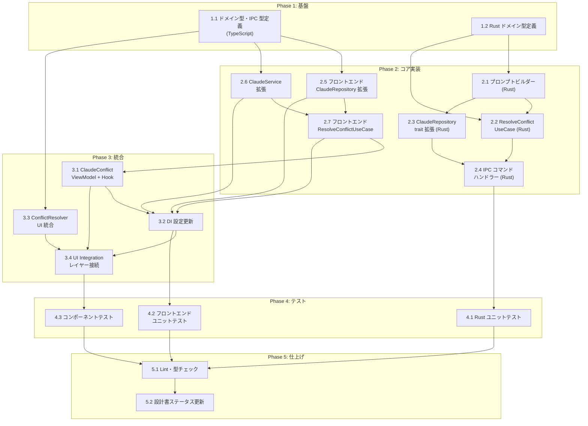

# AI コンフリクト解決（FR_506）タスク分解

## メタ情報

| 項目 | 内容 |
|:---|:---|
| 機能名 | AI コンフリクト解決（FR_506） |
| チケット番号 | FR_506 |
| 技術設計書 | [claude-code-integration_design.md](../../specification/claude-code-integration_design.md) |
| 抽象仕様書 | [claude-code-integration_spec.md](../../specification/claude-code-integration_spec.md) |
| PRD | [claude-code-integration.md](../../requirement/claude-code-integration.md) |
| 作成日 | 2026-04-14 |

## タスク一覧

### Phase 1: 基盤

| # | タスク | 説明 | 完了条件 | 依存 |
|:---|:---|:---|:---|:---|
| 1.1 | ドメイン型・IPC 型定義 | `src/domain/index.ts` に `ConflictResolveRequest`（worktreePath, filePath, threeWayContent）と `ConflictResolveResult`（discriminated union: resolved \| failed）の型を追加。`src/lib/ipc.ts` の `IPCChannelMap` に `claude_resolve_conflict` コマンド定義、`IPCEventMap` に `claude-conflict-resolved` イベント定義を追加 | TypeScript コンパイルが通り、型定義が spec の定義と一致する。`npm run typecheck` がパスする | - |
| 1.2 | Rust ドメイン型定義 | `src-tauri/src/features/claude_code_integration/domain.rs` に `ConflictResolveRequest`（Deserialize）と `ConflictResolveResult`（Serialize、discriminated union: resolved / failed）を追加 | `cargo build` がパスし、型が TypeScript 側と対応する | - |

### Phase 2: コア実装

| # | タスク | 説明 | 完了条件 | 依存 |
|:---|:---|:---|:---|:---|
| 2.1 | コンフリクト解決プロンプトビルダー（Rust） | `src-tauri/src/features/claude_code_integration/infrastructure/conflict_resolve_prompt.rs` を新規作成。`ThreeWayContent`（base/ours/theirs）とファイルパスを受け取り、merged 結果のみを返すよう指示する構造化プロンプトを構築する。既存の `commit_message.rs` / `review_prompt.rs` のパターンを踏襲 | ユニットテストで base/ours/theirs を含む正しいプロンプト文字列が生成されることを検証。`cargo test` がパスする | 1.2 |
| 2.2 | ResolveConflictMainUseCase（Rust） | `src-tauri/src/features/claude_code_integration/application/usecases.rs` に `resolve_conflict` 非同期関数を追加。リポジトリの `resolve_conflict` メソッドを呼び出し、結果を `app_handle.emit("claude-conflict-resolved", result)` でイベント送信する。既存の `review_diff` / `explain_diff` のワンショット実行パターンを踏襲 | `cargo test` でモックリポジトリを使った UseCase テストがパスする | 1.2, 2.1 |
| 2.3 | ClaudeRepository trait 拡張 + 実装（Rust） | `application/repositories.rs` の `ClaudeRepository` trait に `resolve_conflict(&self, request: &ConflictResolveRequest) -> AppResult<ConflictResolveResult>` を追加。`infrastructure/claude_repository.rs` の実装で、プロンプトビルダーでプロンプト構築 → `claude -p` ワンショット実行 → 出力から merged コンテンツを抽出して `ConflictResolveResult` を返す | `cargo build` がパスし、リポジトリ実装が正しくプロンプトビルダーと CLI 実行を連携する | 2.1 |
| 2.4 | IPC コマンドハンドラー（Rust） | `presentation/commands.rs` に `claude_resolve_conflict` コマンドを追加。`ConflictResolveRequest` を受け取り、UseCase を呼び出し、結果を `app_handle.emit("claude-conflict-resolved", result)` で非同期通知する。`src-tauri/src/lib.rs` にコマンドを登録 | `cargo build` がパスし、IPC コマンドが登録されている | 2.2, 2.3 |
| 2.5 | フロントエンド ClaudeRepository 拡張 | `src/features/claude-code-integration/application/repositories/claude-repository.ts` の `ClaudeRepository` インターフェースに `resolveConflict(request: ConflictResolveRequest): Promise<void>` と `onConflictResolved(callback): () => void` を追加。`infrastructure/claude-repository.ts` の実装で `invokeCommand('claude_resolve_conflict', ...)` と `listenEvent('claude-conflict-resolved', ...)` を使用 | TypeScript コンパイルが通り、IPC 呼び出しが正しく型付けされている | 1.1 |
| 2.6 | ClaudeService 拡張（状態管理） | `application/services/claude-service-interface.ts` に AI コンフリクト解決の状態管理を追加: `isResolvingConflict$: Observable<boolean>`、`conflictResult$: Observable<ConflictResolveResult \| null>`、`resolvingProgress$: Observable<{ total: number; completed: number; failed: number } \| null>` + setter メソッド。`claude-service.ts` の実装に BehaviorSubject を追加 | TypeScript コンパイルが通り、Observable が正しく公開される | 1.1 |
| 2.7 | フロントエンド ResolveConflictUseCase | `application/usecases/` に `resolve-conflict-usecase.ts` を新規作成。`ConsumerUseCase<ConflictResolveRequest>` を実装。`ClaudeRepository.resolveConflict()` を呼び出し、Service の `isResolvingConflict` を管理。既存の `ReviewDiffUseCase` パターンを踏襲 | UseCase テスト（モック依存）がパスする | 2.5, 2.6 |

### Phase 3: 統合

| # | タスク | 説明 | 完了条件 | 依存 |
|:---|:---|:---|:---|:---|
| 3.1 | ClaudeConflictViewModel + Hook | `presentation/claude-conflict-viewmodel.ts` を新規作成。`resolveConflict(request)` / `resolveAll(worktreePath, conflicts[])` メソッドと、`isResolving$` / `result$` / `progress$` Observable を公開。`resolveAll` は 3 並列制御（Promise.allSettled + セマフォ）で実装。`use-claude-conflict-viewmodel.ts` で Hook ラッパーを作成 | ViewModel テストがパスし、3 並列制御が正しく動作する | 2.7 |
| 3.2 | DI 設定更新 | `di-tokens.ts` に新規トークン（`ResolveConflictRendererUseCaseToken`、`ClaudeConflictViewModelToken`）と UseCase 型エイリアスを追加。`di-config.ts` に UseCase と ViewModel の DI 登録を追加。`setUp` に `onConflictResolved` イベントリスナー登録を追加 | DI コンテナからの解決が成功し、アプリ起動時にエラーが出ない | 3.1, 2.5, 2.6, 2.7 |
| 3.3 | ConflictResolver UI 統合 | `advanced-git-operations` の `conflict-resolver.tsx` に AI 解決ボタンを追加: (1) コンフリクトファイル一覧ヘッダーに「AI で全て解決」ボタン、(2) 各ファイル行に「AI 解決」ボタン。ボタンのコールバック（`onAIResolve` / `onAIResolveAll`）は Props 経由で外部から注入（A-004 準拠）。一括解決時はプログレスバー表示。`ThreeWayMergeView` の merged ペインに AI 結果をプレビュー表示し、承認/拒否ボタンを追加 | UI が表示され、Props 経由でコールバックを受け取れる。advanced-git-operations が claude-code-integration に直接依存しない | 1.1 |
| 3.4 | UI Integration レイヤー接続 | `repository-viewer` または統合レイヤーで、`ConflictResolver` に `onAIResolve` / `onAIResolveAll` Props を接続。`useClaudeConflictViewModel` から取得した `resolveConflict` / `resolveAll` を渡す。AI 解決結果を `ThreeWayMergeView` の merged ペインに反映するロジックを実装 | E2E で AI 解決ボタン押下 → プレビュー表示 → 承認/拒否のフロー全体が動作する | 3.1, 3.2, 3.3 |

### Phase 4: テスト

| # | タスク | 説明 | 完了条件 | 依存 |
|:---|:---|:---|:---|:---|
| 4.1 | Rust ユニットテスト | (1) `conflict_resolve_prompt.rs` のプロンプト生成テスト、(2) `resolve_conflict` UseCase のモックテスト、(3) `claude_resolve_conflict` コマンドハンドラーのテスト | `cargo test` で全テストがパス。カバレッジ >= 80% | 2.4 |
| 4.2 | フロントエンドユニットテスト | (1) `ResolveConflictUseCase` のモックテスト、(2) `ClaudeConflictViewModel` のテスト（resolveConflict / resolveAll / 3並列制御 / 進捗管理）、(3) Service の状態管理テスト | `npm run test` で全テストがパス | 3.2 |
| 4.3 | コンポーネントテスト | (1) ConflictResolver の AI ボタン表示・クリックテスト、(2) プログレスバー表示テスト、(3) プレビュー表示と承認/拒否ボタンのテスト | `npm run test` で全テストがパス | 3.4 |

### Phase 5: 仕上げ

| # | タスク | 説明 | 完了条件 | 依存 |
|:---|:---|:---|:---|:---|
| 5.1 | Lint・型チェック・フォーマット | `npm run lint` / `npm run typecheck` / `npm run format:check` / `cargo clippy` を実行し、全ての警告・エラーを修正する | 全チェックがパスする | 4.1, 4.2, 4.3 |
| 5.2 | 設計書ステータス更新 | `claude-code-integration_design.md` の実装進捗テーブルで FR_506 関連モジュールを 🟢 に更新。`impl-status` を `implemented` に変更 | 設計書の記載が実装の実態と一致する | 5.1 |

## 依存関係図



## 実装の注意事項

- **A-004 準拠**: `advanced-git-operations` と `claude-code-integration` の feature 間直接参照を避ける。AI ボタンのコールバックは Props 経由で注入し、UI Integration レイヤー（`repository-viewer` 側）で接続する
- **B-002 準拠**: AI が生成した merged コンテンツは必ずプレビュー表示し、ユーザーの承認を経てから適用する
- **ワンショット実行パターン**: `claude -p` でプロンプトを送信し、応答後にプロセスが終了する既存パターン（ReviewDiff / ExplainDiff と同一）を踏襲
- **3 並列制御**: 一括解決時は同時実行数を 3 に制限する。セマフォパターンまたは Promise チャンクで実装
- **ThreeWayContent 再利用**: `src/domain/index.ts` に既に定義されている `ThreeWayContent` 型を再利用する（新規型定義不要）
- **discriminated union**: `ConflictResolveResult` は `status: 'resolved' | 'failed'` で区別する tagged union として実装する

## Serena 分析結果

### 影響を受けるシンボル

| シンボル | ファイル | 参照数 | 対応タスク |
|:---|:---|:---|:---|
| `ClaudeRepository` (TS IF) | `src/features/claude-code-integration/application/repositories/claude-repository.ts` | 5+ | 2.5 |
| `ClaudeRepository` (Rust trait) | `src-tauri/src/features/claude_code_integration/application/repositories.rs` | 3+ | 2.3 |
| `ClaudeService` (TS IF) | `src/features/claude-code-integration/application/services/claude-service-interface.ts` | 4+ | 2.6 |
| `ConflictResolver` (React) | `src/features/advanced-git-operations/presentation/components/conflict-resolver.tsx` | 2 | 3.3 |
| `ThreeWayMergeView` (React) | `src/features/advanced-git-operations/presentation/components/three-way-merge-view.tsx` | 1 | 3.3 |
| `IPCChannelMap` | `src/lib/ipc.ts` | 全コマンドから参照 | 1.1 |
| `IPCEventMap` | `src/lib/ipc.ts` | 全イベントから参照 | 1.1 |
| `ThreeWayContent` | `src/domain/index.ts` | 5+ | 1.1 (再利用) |

### 追加考慮事項

- `ConflictResolver` の Props 型を拡張する際、既存の呼び出し元（`RepositoryDetailPanel.tsx`）への影響を確認する
- `ClaudeRepository` trait（Rust）にメソッドを追加すると、`DefaultClaudeRepository` 実装の更新が必須
- `di-config.ts` の `setUp` に `onConflictResolved` リスナーを追加する際、`tearDown` でのクリーンアップも忘れないこと

## 参照ドキュメント

- 抽象仕様書: [claude-code-integration_spec.md](../../specification/claude-code-integration_spec.md)
- 技術設計書: [claude-code-integration_design.md](../../specification/claude-code-integration_design.md)
- PRD: [claude-code-integration.md](../../requirement/claude-code-integration.md)

## 要求カバレッジ

| 要求 ID | 要求内容 | 対応タスク |
|:---|:---|:---|
| FR-024 | コンフリクトファイルの内容（base/ours/theirs）を Claude Code にワンショット送信し、merged 結果を取得する | 1.1, 1.2, 2.1, 2.2, 2.3, 2.4, 2.5 |
| FR-025 | AI が生成した merged 結果を ThreeWayMergeView の merged ペインにプレビュー表示する | 3.3, 3.4 |
| FR-026 | プレビュー表示された解決案を承認（適用 + 解決済みマーク）または拒否（元の状態に戻す）できる | 3.3, 3.4 |
| FR-027 | 全コンフリクトファイルを並列で AI に送信し一括解決する「AI で全て解決」ボタンを提供。プログレスバーで進捗表示。失敗時は個別にエラー表示 | 3.1, 3.3, 3.4 |
| FR-028 | 各コンフリクトファイル行に「AI 解決」ボタンを提供し、個別ファイル単位で AI 解決を実行できる | 3.3, 3.4 |
| FR-029 | AI 解決案の承認後も ThreeWayMergeView のエディタで手動微調整が可能である | 3.3 |
| NFR-004 | サブプロセスの実行範囲制限（ワークツリーの CWD に限定） | 2.3, 4.1 |

## 推奨する手動検証

- [ ] タスクの粒度が適切か（1タスク = 数時間〜1日程度）を確認
- [ ] 依存関係図が論理的に正しいか確認
- [ ] 要求カバレッジ表で漏れがないことを確認
- [ ] Phase 分類が適切か確認

## 検証コマンド

```bash
# 関連する設計書との整合性を確認
/check-spec claude-code-integration

# 仕様の不明点がないか確認
/clarify claude-code-integration

# チェックリストを生成して品質基準を明確化
/checklist claude-code-integration FR_506
```
