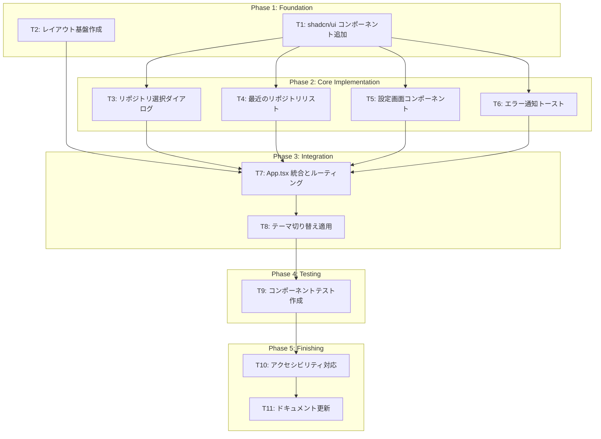

# アプリケーション基盤 React Component 実装タスク

**関連 Design Doc:** [application-foundation_design.md](../../specification/application-foundation_design.md)
**関連 Spec:** [application-foundation_spec.md](../../specification/application-foundation_spec.md)
**関連 PRD:** [application-foundation.md](../../requirement/application-foundation.md)

---

## 背景

application-foundation の presentation 層（ViewModel、Hook ラッパー）は実装済みだが、React コンポーネント（UI）が未実装。本タスク分解では、PRD の機能要求（FR_601〜FR_605）を満たす UI コンポーネントを実装する。

**実装済み:**
- ✅ domain / application / infrastructure 層
- ✅ presentation 層の ViewModel、Hook ラッパー

**未実装（本タスクの対象）:**
- ❌ presentation 層の React コンポーネント

---

## タスク依存関係図

---

## Phase 1: Foundation（基礎）

### T1: shadcn/ui コンポーネント追加

**目的:** UI 実装に必要な shadcn/ui コンポーネントを追加する

**依存:** なし

**実装内容:**

1. 必要なコンポーネントを `npx shadcn@latest add` で追加
   - `dialog` — リポジトリ選択ダイアログ
   - `card` — 最近のリポジトリリスト
   - `select` — 設定画面のドロップダウン
   - `input` — 設定画面のテキスト入力
   - `toast` / `sonner` — エラー通知（既に sonner が依存関係にあるため確認）
   - `switch` — 設定の ON/OFF 切り替え
   - `label` — フォームラベル
   - `separator` — セクション区切り

2. コンポーネントが `src/components/ui/` に追加されることを確認

**完了条件:**

- [ ] 必要な shadcn/ui コンポーネントがすべて `src/components/ui/` に存在する
- [ ] `npm run typecheck` が通る

**推定工数:** 0.5時間

---

### T2: レイアウト基盤作成

**目的:** アプリケーション全体のレイアウト構造を作成する

**依存:** なし

**実装内容:**

1. `src/components/layout/` ディレクトリ作成
2. `AppLayout.tsx` — メインレイアウトコンポーネント
   - ヘッダー（タイトル、設定アイコン）
   - メインコンテンツエリア
   - フッター（オプション）
3. `MainHeader.tsx` — ヘッダーコンポーネント
   - アプリタイトル表示
   - 設定ボタン（クリックで設定ダイアログ表示）

**完了条件:**

- [ ] `src/components/layout/AppLayout.tsx` が存在する
- [ ] `src/components/layout/MainHeader.tsx` が存在する
- [ ] レイアウトコンポーネントが TypeScript エラーなしでビルドできる
- [ ] `npm run typecheck` が通る

**推定工数:** 1時間

---

## Phase 2: Core Implementation（コア実装）

### T3: リポジトリ選択ダイアログ

**目的:** フォルダ選択ダイアログと最近のリポジトリを含むリポジトリ選択 UI を実装する

**依存:** T1 (shadcn/ui コンポーネント)

**実装内容:**

1. `src/features/application-foundation/presentation/components/` ディレクトリ作成
2. `RepositorySelectorDialog.tsx` 作成
   - `useRepositorySelectorViewModel()` を使用
   - "フォルダを選択" ボタン → `openWithDialog()` 呼び出し
   - 最近のリポジトリリスト表示（T4 のコンポーネントを使用）
   - Dialog コンポーネント（shadcn/ui）でラップ

**完了条件:**

- [ ] `RepositorySelectorDialog.tsx` が存在する
- [ ] `useRepositorySelectorViewModel()` Hook を使用している
- [ ] "フォルダを選択" ボタンが `openWithDialog()` を呼び出す
- [ ] Dialog が開閉できる
- [ ] `npm run typecheck` が通る

**推定工数:** 2時間

---

### T4: 最近のリポジトリリスト

**目的:** 最近開いたリポジトリの一覧表示とクイックアクセス機能を実装する

**依存:** T1 (shadcn/ui コンポーネント)

**実装内容:**

1. `RecentRepositoriesList.tsx` 作成
   - `useRepositorySelectorViewModel()` を使用
   - `recentRepositories` を表示
   - 各リポジトリに以下のアクション
     - クリック → `openByPath(repo.path)` 呼び出し
     - ピン留めボタン → `pin(repo.path, !repo.pinned)` 呼び出し
     - 削除ボタン → `removeRecent(repo.path)` 呼び出し
   - ピン留めされたリポジトリを上位表示
   - Card コンポーネント（shadcn/ui）で各リポジトリを表示

**完了条件:**

- [ ] `RecentRepositoriesList.tsx` が存在する
- [ ] 最近のリポジトリが一覧表示される
- [ ] ピン留め機能が動作する
- [ ] 削除機能が動作する
- [ ] クリックでリポジトリを開く機能が動作する
- [ ] `npm run typecheck` が通る

**推定工数:** 2時間

---

### T5: 設定画面コンポーネント

**目的:** アプリケーション設定画面を実装する

**依存:** T1 (shadcn/ui コンポーネント)

**実装内容:**

1. `SettingsDialog.tsx` 作成
   - `useSettingsViewModel()` を使用
   - テーマ切り替え（Select コンポーネント）
     - 選択肢: Light / Dark / System
     - 変更時に `setTheme(theme)` 呼び出し
   - Git 実行パス設定（Input コンポーネント）
     - カスタムパス入力
     - 変更時に `updateSettings({ gitPath })` 呼び出し
   - デフォルト作業ディレクトリ設定（Input + フォルダ選択ボタン）
     - 変更時に `updateSettings({ defaultWorkDir })` 呼び出し
   - Dialog コンポーネント（shadcn/ui）でラップ

**完了条件:**

- [ ] `SettingsDialog.tsx` が存在する
- [ ] `useSettingsViewModel()` Hook を使用している
- [ ] テーマ切り替えが動作する
- [ ] Git パス設定が動作する
- [ ] デフォルトディレクトリ設定が動作する
- [ ] `npm run typecheck` が通る

**推定工数:** 2.5時間

---

### T6: エラー通知トースト

**目的:** エラー通知をトースト形式で表示する機能を実装する

**依存:** T1 (shadcn/ui コンポーネント)

**実装内容:**

1. `ErrorNotificationToast.tsx` 作成
   - `useErrorNotificationViewModel()` を使用
   - `notifications` を監視し、新しいエラーが追加されたらトースト表示
   - `sonner` ライブラリ（既に依存関係に存在）の `toast` API を使用
   - エラーの重大度に応じてスタイルを変更（info / warning / error）
   - トースト内にリトライボタン表示（`retryable === true` の場合）
     - クリック時に `retry(errorId)` 呼び出し
   - 詳細表示ボタン（オプション）
   - 閉じるボタン → `dismiss(errorId)` 呼び出し

2. `src/index.tsx` または `App.tsx` に `<Toaster />` コンポーネント追加（sonner）

**完了条件:**

- [ ] `ErrorNotificationToast.tsx` が存在する
- [ ] `useErrorNotificationViewModel()` Hook を使用している
- [ ] エラー通知がトースト表示される
- [ ] リトライボタンが動作する（retryable な場合のみ表示）
- [ ] 重大度に応じたスタイリングが適用される
- [ ] `npm run typecheck` が通る

**推定工数:** 2時間

---

## Phase 3: Integration（統合）

### T7: App.tsx 統合とルーティング

**目的:** 実装したコンポーネントを `App.tsx` に統合し、初期画面として表示する

**依存:** T2 (レイアウト), T3 (リポジトリ選択), T4 (最近のリポジトリ), T5 (設定), T6 (エラー通知)

**実装内容:**

1. `App.tsx` を更新
   - `VContainerProvider` でアプリをラップ（DI コンテナ初期化）
   - `AppLayout` を使用
   - 初期画面として `RepositorySelectorDialog` を表示
   - `ErrorNotificationToast` をグローバルに配置
   - `SettingsDialog` を配置（ヘッダーの設定ボタンから表示）

2. 状態管理
   - リポジトリが選択されたら（`currentRepository !== null`）、別画面に遷移（将来の実装のためプレースホルダー表示）

**完了条件:**

- [ ] `App.tsx` が `VContainerProvider` でラップされている
- [ ] 初期画面でリポジトリ選択ダイアログが表示される
- [ ] 設定ダイアログがヘッダーから開ける
- [ ] エラー通知トーストがグローバルに表示される
- [ ] `npm start` でアプリが起動し、UI が表示される
- [ ] `npm run typecheck` が通る

**推定工数:** 2時間

---

### T8: テーマ切り替え適用

**目的:** 設定画面で変更したテーマがアプリ全体に適用されるようにする

**依存:** T7 (App.tsx 統合)

**実装内容:**

1. `useSettingsViewModel()` の `settings.theme` を監視
2. テーマに応じて `<html>` または `<body>` に `class="dark"` を追加/削除
3. システム連動テーマの場合、`window.matchMedia('(prefers-color-scheme: dark)')` で OS のテーマを検出

**完了条件:**

- [ ] テーマ切り替えがアプリ全体に反映される
- [ ] Light / Dark / System の3つのテーマが正しく動作する
- [ ] アプリ再起動後もテーマ設定が保持される
- [ ] `npm start` でテーマ切り替えが確認できる

**推定工数:** 1.5時間

---

## Phase 4: Testing（テスト）

### T9: コンポーネントテスト作成

**目的:** 実装したコンポーネントのユニットテストを作成する

**依存:** T7 (App.tsx 統合)

**実装内容:**

1. `@testing-library/react` を使用してコンポーネントテストを作成
   - `RepositorySelectorDialog.test.tsx`
   - `RecentRepositoriesList.test.tsx`
   - `SettingsDialog.test.tsx`
   - `ErrorNotificationToast.test.tsx`

2. テスト内容
   - レンダリングテスト（コンポーネントが正しく表示される）
   - インタラクションテスト（ボタンクリック等）
   - ViewModel の Mock を使用して Hook の動作を検証

**完了条件:**

- [ ] 各コンポーネントのテストファイルが存在する
- [ ] すべてのテストが成功する（`npm run test`）
- [ ] テストカバレッジが主要なユーザーインタラクションをカバーしている

**推定工数:** 3時間

---

## Phase 5: Finishing（仕上げ）

### T10: アクセシビリティ対応

**目的:** WCAG 2.1 レベル A の基本的なアクセシビリティ要件を満たす

**依存:** T9 (テスト)

**実装内容:**

1. キーボードナビゲーション対応
   - Tab キーでフォーカス移動
   - Enter / Space キーでボタン操作

2. ARIA 属性追加
   - `aria-label` でボタンの説明
   - `aria-describedby` でエラーメッセージ関連付け

3. フォーカス表示の改善
   - フォーカスリングが視認可能

**完了条件:**

- [ ] キーボードですべての操作が可能
- [ ] 適切な ARIA 属性が設定されている
- [ ] フォーカス表示が視認可能

**推定工数:** 1.5時間

---

### T11: ドキュメント更新

**目的:** 実装完了に伴い、設計ドキュメントを更新する

**依存:** T10 (アクセシビリティ)

**実装内容:**

1. `application-foundation_design.md` の更新
   - 実装ステータスを「🔴 未実装」→「🟢 実装完了」に変更
   - コンポーネント一覧を追加
   - 未解決の課題セクションの更新

2. README やその他のドキュメントに UI スクリーンショットを追加（オプション）

**完了条件:**

- [ ] `application-foundation_design.md` の実装ステータスが更新されている
- [ ] コンポーネント一覧が記載されている

**推定工数:** 0.5時間

---

## 要求カバレッジ検証

### 機能要求カバレッジ

| 要求 ID | 要求内容 | 対応タスク | ステータス |
|:--------|:---------|:-----------|:-----------|
| FR_601 | フォルダ選択ダイアログでリポジトリを開く | T3 | 🔲 |
| FR_602 | 最近開いたリポジトリの履歴管理 | T4 | 🔲 |
| FR_603 | アプリケーション設定画面 | T5 | 🔲 |
| FR_605 | エラー通知をトースト形式で表示 | T6 | 🔲 |

### 非機能要求カバレッジ

| 要求 ID | 要求内容 | 対応タスク | ステータス |
|:--------|:---------|:-----------|:-----------|
| NFR_001 | 起動から UI 表示まで3秒以内 | T7, T8 | 🔲 |

### 設計制約カバレッジ

| 制約 ID | 制約内容 | 対応タスク | ステータス |
|:--------|:---------|:-----------|:-----------|
| DC_001 | Electron セキュリティ準拠 | T3, T4, T5, T6 | 🔲 |

---

## タスク一覧サマリー

| Phase | タスク数 | 推定工数 |
|:------|:---------|:---------|
| Phase 1: Foundation | 2 | 1.5時間 |
| Phase 2: Core Implementation | 4 | 8.5時間 |
| Phase 3: Integration | 2 | 3.5時間 |
| Phase 4: Testing | 1 | 3時間 |
| Phase 5: Finishing | 2 | 2時間 |
| **合計** | **11** | **18.5時間** |

---

## 参考ドキュメント

- [application-foundation_design.md](../../specification/application-foundation_design.md) — 技術設計
- [application-foundation_spec.md](../../specification/application-foundation_spec.md) — 抽象仕様
- [application-foundation.md](../../requirement/application-foundation.md) — PRD
- [CLAUDE.md](../../../CLAUDE.md) — プロジェクト全体のアーキテクチャ
- [components.json](../../../components.json) — shadcn/ui 設定
