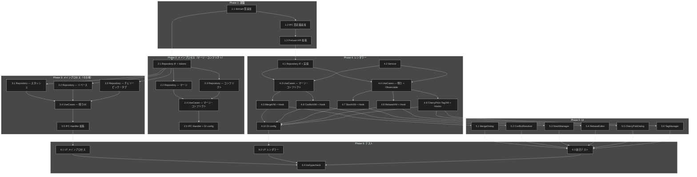

# 高度な Git 操作 タスク分解

## メタ情報

| 項目 | 内容 |
|:---|:---|
| 機能名 | 高度な Git 操作 (Advanced Git Operations) |
| 設計書 | [advanced-git-operations_design.md](../../specification/advanced-git-operations_design.md) |
| 仕様書 | [advanced-git-operations_spec.md](../../specification/advanced-git-operations_spec.md) |
| PRD | [advanced-git-operations.md](../../requirement/advanced-git-operations.md) |
| 作成日 | 2026-04-04 |
| 優先度順 | 必須（マージ・コンフリクト解決）→ 推奨（リベース・スタッシュ）→ 任意（チェリーピック・タグ） |

## タスク一覧

### Phase 1: 基盤

| # | タスク | 説明 | 完了条件 | 依存 |
|:---|:---|:---|:---|:---|
| 1.1 | 共有 domain 型追加 | `src/domain/index.ts` に `MergeOptions`, `MergeResult`, `MergeStatus`, `RebaseOptions`, `InteractiveRebaseOptions`, `RebaseStep`, `RebaseAction`, `RebaseResult`, `StashSaveOptions`, `StashEntry`, `CherryPickOptions`, `CherryPickResult`, `ConflictFile`, `ThreeWayContent`, `ConflictResolveOptions`, `ConflictResolution`, `ConflictResolveAllOptions`, `TagInfo`, `TagCreateOptions`, `OperationProgress` を追加 | `npm run typecheck` が通る。既存の型と共存 | - |
| 1.2 | IPC 型定義追加 | `src/lib/ipc.ts` の `IPCChannelMap` に 24 チャネル（`git:merge`, `git:merge-abort`, `git:merge-status`, `git:rebase`, `git:rebase-interactive`, `git:rebase-abort`, `git:rebase-continue`, `git:rebase-get-commits`, `git:stash-save`, `git:stash-list`, `git:stash-pop`, `git:stash-apply`, `git:stash-drop`, `git:stash-clear`, `git:cherry-pick`, `git:cherry-pick-abort`, `git:conflict-list`, `git:conflict-file-content`, `git:conflict-resolve`, `git:conflict-resolve-all`, `git:conflict-mark-resolved`, `git:tag-list`, `git:tag-create`, `git:tag-delete`）を追加。`ElectronAPI.git` に対応メソッドを追加 | `npm run typecheck` が通る。既存チャネル定義を壊さない | 1.1 |
| 1.3 | Preload API 拡張 | `src/processes/preload/preload.ts` の `electronAPI.git` に 24 操作メソッド（merge, mergeAbort, mergeStatus, rebase, rebaseInteractive, rebaseAbort, rebaseContinue, rebaseGetCommits, stashSave, stashList, stashPop, stashApply, stashDrop, stashClear, cherryPick, cherryPickAbort, conflictList, conflictFileContent, conflictResolve, conflictResolveAll, conflictMarkResolved, tagList, tagCreate, tagDelete）を追加 | `npm run typecheck` が通る。`ElectronAPI` 型と一致 | 1.2 |

### Phase 2: コア実装 — メインプロセス（マージ・コンフリクト解決）

| # | タスク | 説明 | 完了条件 | 依存 |
|:---|:---|:---|:---|:---|
| 2.1 | GitAdvancedRepository IF + DI tokens | `application/repositories/git-advanced-repository.ts` に IF 定義（24 メソッド）。`di-tokens.ts` に全トークン + UseCase 型エイリアス定義 | IF が全 24 メソッドを持つ。トークンが全 UseCase + Repository 分定義されている | 1.1 |
| 2.2 | GitAdvancedDefaultRepository — マージ | `infrastructure/repositories/git-advanced-default-repository.ts` に `merge`, `mergeAbort`, `mergeStatus` を simple-git で実装。マージ成功・コンフリクト発生・already-up-to-date の 3 パターン対応 | ユニットテスト（simple-git モック）が通る | 2.1 |
| 2.3 | GitAdvancedDefaultRepository — コンフリクト解決 | 同ファイルに `conflictList`, `conflictFileContent`, `conflictResolve`, `conflictResolveAll`, `conflictMarkResolved` を実装。`git show :1:`, `:2:`, `:3:` で 3 ウェイ内容を取得 | ユニットテストが通る。ours/theirs/manual 解決の 3 パターン | 2.1 |
| 2.4 | メインプロセス UseCases — マージ・コンフリクト | `application/usecases/` に 8 UseCase（merge, mergeAbort, mergeStatus, conflictList, conflictFileContent, conflictResolve, conflictResolveAll, conflictMarkResolved）を作成 | ユニットテスト（Repository モック）が通る。1 クラス = 1 操作を遵守 | 2.2, 2.3 |
| 2.5 | IPC Handler — マージ・コンフリクト + DI config | `presentation/ipc-handlers.ts` にマージ・コンフリクト解決の 8 チャネルを `registerGitAdvancedIPCHandlers` で実装。`di-config.ts` に `advancedGitOperationsMainConfig` を定義。`src/processes/main/di/configs.ts` に 1 行追加 | `npm run typecheck` が通る。IPC Handler が 8 チャネルを登録。DI config で 8 UseCase + Repository が解決される | 2.4 |

### Phase 3: コア実装 — メインプロセス（スタッシュ・リベース・チェリーピック・タグ）

| # | タスク | 説明 | 完了条件 | 依存 |
|:---|:---|:---|:---|:---|
| 3.1 | GitAdvancedDefaultRepository — スタッシュ | 同ファイルに `stashSave`, `stashList`, `stashPop`, `stashApply`, `stashDrop`, `stashClear` を simple-git で実装 | ユニットテストが通る。save/list/pop/apply/drop/clear の全パターン | 2.1 |
| 3.2 | GitAdvancedDefaultRepository — リベース | 同ファイルに `rebase`, `rebaseInteractive`, `rebaseAbort`, `rebaseContinue`, `getRebaseCommits` を実装。`GIT_SEQUENCE_EDITOR` 環境変数でインタラクティブリベースを制御 | ユニットテストが通る。通常リベース・インタラクティブリベース・コンフリクト発生の 3 パターン | 2.1 |
| 3.3 | GitAdvancedDefaultRepository — チェリーピック・タグ | 同ファイルに `cherryPick`, `cherryPickAbort`, `tagList`, `tagCreate`, `tagDelete` を実装 | ユニットテストが通る。チェリーピック（単一・複数・コンフリクト）、タグ（lightweight・annotated・削除） | 2.1 |
| 3.4 | メインプロセス UseCases — スタッシュ・リベース・チェリーピック・タグ | `application/usecases/` に残り 16 UseCase を作成 | ユニットテスト（Repository モック）が通る | 3.1, 3.2, 3.3 |
| 3.5 | IPC Handler 拡張 — 残り全チャネル | `registerGitAdvancedIPCHandlers` に残り 16 チャネルを追加。DI config に 16 UseCase を追加登録 | `npm run typecheck` が通る。全 24 チャネルが登録済み。DI config で全 24 UseCase + Repository が解決される | 3.4 |

### Phase 4: コア実装 — レンダラー

| # | タスク | 説明 | 完了条件 | 依存 |
|:---|:---|:---|:---|:---|
| 4.1 | AdvancedOperationsRepository IF + 実装 | `application/repositories/advanced-operations-repository.ts` に IF（24 メソッド）。`infrastructure/repositories/advanced-operations-default-repository.ts` に `window.electronAPI.git.*` 経由の IPC クライアント実装 | `npm run typecheck` が通る。全メソッドが `IPCResult` をアンラップして返す | 1.3 |
| 4.2 | AdvancedOperationsService | `application/services/advanced-operations-service-interface.ts` に IF（`BaseService` を extends）。`advanced-operations-service.ts` に実装（`loading$`, `lastError$`, `operationProgress$`, `currentOperation$` を BehaviorSubject で管理） | `setUp()` / `tearDown()` が正常動作。4 つの Observable が正しく公開される | - |
| 4.3 | レンダラー UseCases — マージ・コンフリクト解決 | `application/usecases/` に 8 UseCase（merge, mergeAbort, mergeStatus, conflictList, conflictFileContent, conflictResolve, conflictResolveAll, conflictMarkResolved）を作成。各 UseCase は Repository + Service を DI で受け取り、loading/error 状態を管理 | 各 UseCase がインターフェースを implements | 4.1, 4.2 |
| 4.4 | レンダラー UseCases — スタッシュ・リベース・チェリーピック・タグ | 残り 16 操作系 UseCase + 4 Observable UseCases（getOperationLoading, getLastError, getOperationProgress, getCurrentOperation）を作成 | 全 28 UseCase が implements 済み | 4.1, 4.2 |
| 4.5 | MergeViewModel + Hook | `presentation/merge-viewmodel.ts` と `use-merge-viewmodel.ts`。merge/abort/status 操作と mergeResult$/mergeStatus$ 管理 | ViewModel が UseCase のみを参照（A-004 準拠）。Hook が `useResolve` + `useObservable` を使用 | 4.3 |
| 4.6 | ConflictViewModel + Hook | `presentation/conflict-viewmodel.ts` と `use-conflict-viewmodel.ts`。conflictList/fileContent/resolve/resolveAll/markResolved 操作と conflictFiles$/threeWayContent$ 管理 | ViewModel が UseCase のみを参照。コンフリクトファイル選択時の遅延ロード対応 | 4.3 |
| 4.7 | StashViewModel + Hook | `presentation/stash-viewmodel.ts` と `use-stash-viewmodel.ts`。save/list/pop/apply/drop/clear 操作と stashes$ 管理 | ViewModel が UseCase のみを参照 | 4.4 |
| 4.8 | RebaseViewModel + Hook | `presentation/rebase-viewmodel.ts` と `use-rebase-viewmodel.ts`。rebase/interactive/abort/continue/getCommits 操作と rebaseResult$/rebaseCommits$ 管理 | ViewModel が UseCase のみを参照 | 4.4 |
| 4.9 | CherryPickViewModel + TagViewModel + Hooks | `presentation/cherry-pick-viewmodel.ts`, `use-cherry-pick-viewmodel.ts`, `tag-viewmodel.ts`, `use-tag-viewmodel.ts` を作成 | ViewModel が UseCase のみを参照 | 4.4 |
| 4.10 | レンダラー DI config | `di-tokens.ts` に全トークン。`di-config.ts` に `advancedGitOperationsConfig`。`src/processes/renderer/di/configs.ts` に 1 行追加 | `npm run typecheck` が通る。全 UseCase / ViewModel / Service / Repository が正しく解決される | 4.5, 4.6, 4.7, 4.8, 4.9 |

### Phase 5: UI コンポーネント

| # | タスク | 説明 | 完了条件 | 依存 |
|:---|:---|:---|:---|:---|
| 5.1 | MergeDialog コンポーネント | `presentation/components/merge-dialog.tsx`。マージ対象ブランチ選択、マージ方式（ff/no-ff）選択、実行ボタン、コンフリクト発生時の ConflictResolver 遷移。`useMergeViewModel` を使用 | ブランチ選択・方式選択・マージ実行が動作。コンフリクト時に ConflictResolver が表示される | 4.5 |
| 5.2 | ConflictResolver + ThreeWayMergeView | `presentation/components/conflict-resolver.tsx` と `three-way-merge-view.tsx`。コンフリクトファイル一覧、Monaco Editor による 3 ウェイマージ表示（base/ours/theirs）、ours/theirs 一括採用、手動編集、解決済みマーク、continue/abort ボタン | 3 ウェイ表示が正しく動作。ours/theirs 選択・手動編集で解決可能。全解決後に continue が有効化 | 4.6 |
| 5.3 | StashManager コンポーネント | `presentation/components/stash-manager.tsx`。スタッシュ一覧表示、save（メッセージ入力）、pop/apply/drop 操作、clear（確認ダイアログ付き）。`useStashViewModel` を使用 | 一覧表示・保存・復元・削除が動作。clear 時に ConfirmDialog 表示 | 4.7 |
| 5.4 | RebaseEditor コンポーネント | `presentation/components/rebase-editor.tsx`。リベース対象選択、コミット一覧の DnD 並べ替え（@dnd-kit/core）、squash/edit/drop アクション選択、実行/abort ボタン、進捗表示。`useRebaseViewModel` を使用 | コミット並べ替え・アクション選択が動作。DnD + キーボード（上下ボタン）の両方で操作可能 | 4.8 |
| 5.5 | CherryPickDialog コンポーネント | `presentation/components/cherry-pick-dialog.tsx`。コミットログからのコミット選択（複数選択対応）、チェリーピック実行、コンフリクト時の ConflictResolver 遷移。`useCherryPickViewModel` を使用 | 単一・複数コミットの選択と適用が動作 | 4.9 |
| 5.6 | TagManager コンポーネント | `presentation/components/tag-manager.tsx`。タグ一覧表示、lightweight/annotated 作成ダイアログ、削除（確認ダイアログ付き）。`useTagViewModel` を使用 | 一覧表示・作成・削除が動作。annotated タグのメッセージ入力対応 | 4.9 |

### Phase 6: テスト + 仕上げ

| # | タスク | 説明 | 完了条件 | 依存 |
|:---|:---|:---|:---|:---|
| 6.1 | ユニットテスト — メインプロセス | GitAdvancedDefaultRepository（simple-git モック）、24 UseCases、IPC Handler のテスト | テストカバレッジ ≥ 80%。正常系・異常系を網羅 | 3.5 |
| 6.2 | ユニットテスト — レンダラー | UseCases + 6 ViewModel + AdvancedOperationsService のテスト。Repository と Service はモック | テストカバレッジ ≥ 60%。ViewModel が UseCase のみ参照していることを確認 | 4.10 |
| 6.3 | 結合テスト — IPC 通信フロー | マージ→コンフリクト解決→続行の一連のフロー。スタッシュ save→list→pop のフロー | 主要ユースケースが E2E で動作確認 | 5.1, 5.2, 5.3, 5.4, 5.5, 5.6 |
| 6.4 | lint / typecheck / format | `npm run lint`, `npm run typecheck`, `npm run format:check` をパス | CI 相当のチェックがすべてパス | 6.1, 6.2, 6.3 |

## 依存関係図

## 実装の注意事項

- **worktreePath**: すべての Git 操作引数は `worktreePath`（ワークツリーの絶対パス）を使用する（B-001 準拠）
- **A-004 準拠**: ViewModel は UseCase のみを参照し、Service / Repository を直接参照しない
- **命名ルール**: ステートレスな Git 操作ラッパーは `GitAdvancedRepository`（Repository）と命名する。`Service` 命名はステートフルなクラスのみ
- **既存 git:progress 再利用**: 進捗通知は既存の `git:progress` IPC イベントを使用。`GitProgressEvent.operation` に操作種別を設定
- **ConfirmDialog 再利用**: 破壊的操作の確認には basic-git-operations で実装済みの ConfirmDialog を再利用
- **ConflictViewModel の独立性**: ConflictViewModel は MergeViewModel / RebaseViewModel と直接依存しない。コンポーネント層で表示切り替え
- **リフレッシュ**: 操作完了後に既存の `git:status` / `git:branches` API を明示的に呼び出してリフレッシュする
- **エラーコード**: `MERGE_FAILED`, `REBASE_CONFLICT`, `STASH_FAILED` 等のドメインプレフィックス付きコードを使用
- **並列実行可能タスク**: Phase 2 の 2.2/2.3 は並列実行可能。Phase 3 の 3.1/3.2/3.3 も並列実行可能。Phase 4 の 4.5〜4.9 も並列実行可能。Phase 5 の 5.1〜5.6 も並列実行可能
- **Monaco Editor**: 3 ウェイマージ表示は DiffEditor 2 つ + 結果エディタの 3 パネル構成。@monaco-editor/react を使用
- **@dnd-kit/core**: RebaseEditor のコミット並べ替えに使用。アクセシビリティのためキーボード操作（上下ボタン）も併用

## 要求カバレッジ

| 要求 ID | 要求内容 | 対応タスク |
|:---|:---|:---|
| FR_401 | マージ実行（ff/no-ff、中止） | 1.1, 1.2, 1.3, 2.2, 2.4, 2.5, 4.1, 4.3, 4.5, 5.1 |
| FR_402 | リベース（インタラクティブ、中止） | 1.1, 1.2, 1.3, 3.2, 3.4, 3.5, 4.1, 4.4, 4.8, 5.4 |
| FR_403 | スタッシュ（退避・復元・削除・一覧） | 1.1, 1.2, 1.3, 3.1, 3.4, 3.5, 4.1, 4.4, 4.7, 5.3 |
| FR_404 | チェリーピック（単一・複数） | 1.1, 1.2, 1.3, 3.3, 3.4, 3.5, 4.1, 4.4, 4.9, 5.5 |
| FR_405 | コンフリクト解決 UI（3 ウェイマージ） | 1.1, 1.2, 1.3, 2.3, 2.4, 2.5, 4.1, 4.3, 4.6, 5.2 |
| FR_406 | タグ管理（作成・削除・一覧） | 1.1, 1.2, 1.3, 3.3, 3.4, 3.5, 4.1, 4.4, 4.9, 5.6 |
| NFR_401 | 進捗フィードバック 500ms 以内 | 2.2, 3.2, 4.2 |
| DC_401 | abort 常時提供 + 不可逆操作確認 | 5.1, 5.2, 5.3, 5.4, 5.6 |

## 参照ドキュメント

- 抽象仕様書: [advanced-git-operations_spec.md](../../specification/advanced-git-operations_spec.md)
- 技術設計書: [advanced-git-operations_design.md](../../specification/advanced-git-operations_design.md)
- PRD: [advanced-git-operations.md](../../requirement/advanced-git-operations.md)

## 推奨する手動検証

- [ ] タスクの粒度が適切か（1タスク = 数時間〜1日程度）を確認
- [ ] 依存関係図が論理的に正しいか確認
- [ ] 要求カバレッジ表で漏れがないことを確認
- [ ] Phase 分類が適切か確認
