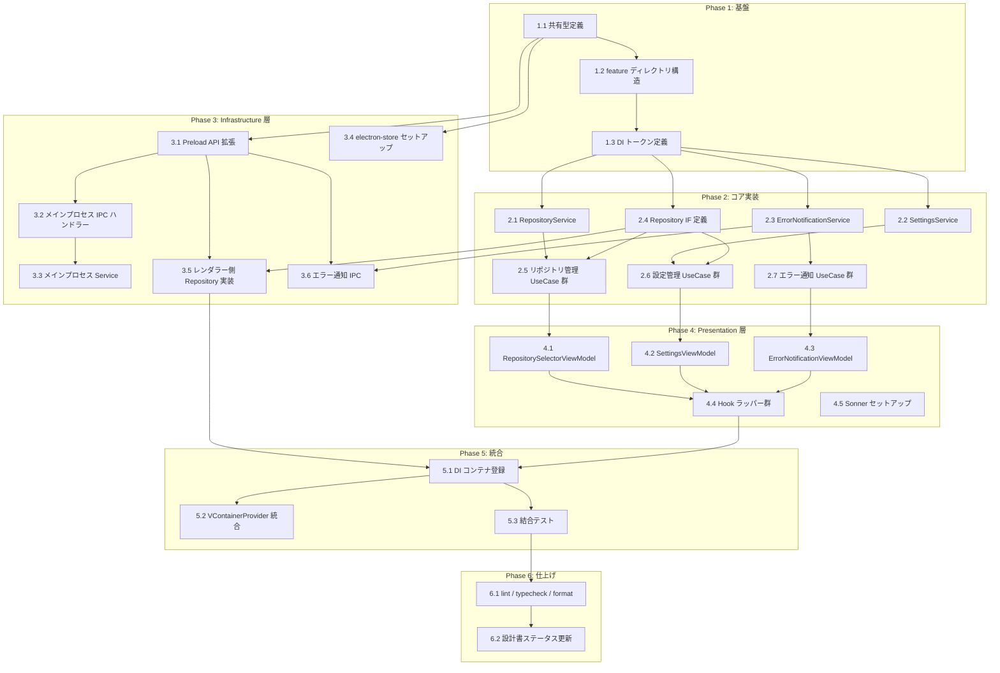

# アプリケーション基盤 タスク分解

## タスク一覧

### Phase 1: 基盤

| # | タスク | 説明 | 完了条件 | 依存 |
|:---|:---|:---|:---|:---|
| 1.1 | 共有型定義 | `src/types/ipc.ts` に `IPCResult<T>`, `IPCError`, IPC チャネル型を定義。`src/features/application-foundation/domain/` に `RepositoryInfo`, `RecentRepository`, `AppSettings`, `Theme`, `ErrorNotification`, `ErrorSeverity` を定義 | `npm run typecheck` パス。型がインポート可能 | - |
| 1.2 | feature ディレクトリ構造 | `src/features/application-foundation/` 配下に `domain/`, `application/`, `infrastructure/`, `presentation/` ディレクトリと index.ts を作成 | ディレクトリ構造が design doc のモジュール分割と一致 | 1.1 |
| 1.3 | DI トークン定義 | 全 Service / Repository / UseCase / ViewModel の InjectionToken を `src/features/application-foundation/di.ts` に定義 | トークンが型安全にインポート可能。typecheck パス | 1.2 |

### Phase 2: コア実装（application 層）

| # | タスク | 説明 | 完了条件 | 依存 |
|:---|:---|:---|:---|:---|
| 2.1 | RepositoryService | `RepositoryService` クラスを実装。`BehaviorSubject` で `currentRepository$` と `recentRepositories$` を公開 | ユニットテストで状態の get/set/Observable emit を検証。カバレッジ ≥ 80% | 1.3 |
| 2.2 | SettingsService | `SettingsService` クラスを実装。`BehaviorSubject` で `settings$` を公開 | ユニットテストで設定の get/update/Observable emit を検証。カバレッジ ≥ 80% | 1.3 |
| 2.3 | ErrorNotificationService | `ErrorNotificationService` クラスを実装。通知の追加・削除・一覧管理 | ユニットテストで通知の追加/削除/Observable emit を検証。カバレッジ ≥ 80% | 1.3 |
| 2.4 | Repository IF 定義 | `RepositoryRepository` と `SettingsRepository` インターフェースを application 層に定義 | typecheck パス。インターフェースが spec 4.2 の定義と一致 | 1.3 |
| 2.5 | リポジトリ管理 UseCase 群 | `OpenRepositoryUseCase`, `OpenRepositoryByPathUseCase`, `GetRecentRepositoriesUseCase`, `RemoveRecentRepositoryUseCase`, `PinRepositoryUseCase` を実装 | 各 UseCase のユニットテスト（モック Repository/Service 使用）。カバレッジ ≥ 80% | 2.1, 2.4 |
| 2.6 | 設定管理 UseCase 群 | `GetSettingsUseCase`, `UpdateSettingsUseCase` を実装 | ユニットテスト（モック Repository/Service 使用）。カバレッジ ≥ 80% | 2.2, 2.4 |
| 2.7 | エラー通知 UseCase 群 | `GetErrorNotificationsUseCase`, `DismissErrorUseCase`, `RetryErrorUseCase` を実装 | ユニットテスト。カバレッジ ≥ 80% | 2.3 |

### Phase 3: Infrastructure 層

| # | タスク | 説明 | 完了条件 | 依存 |
|:---|:---|:---|:---|:---|
| 3.1 | Preload API 拡張 | `src/preload.ts` に `repository.*`, `settings.*` の IPC invoke ラッパーを追加。`contextBridge.exposeInMainWorld` で公開 | typecheck パス。`window.electronAPI` の型定義に新 API が含まれる | 1.1 |
| 3.2 | メインプロセス IPC ハンドラー | `ipcMain.handle` で `repository:*` と `settings:*` チャネルを登録。`IPCResult<T>` 型でレスポンス | ユニットテスト（モック electron-store / dialog 使用）。全チャネルが登録される | 3.1 |
| 3.3 | メインプロセス Service | `RepositoryMainService`（Git 検証 + 履歴管理）と `SettingsMainService`（electron-store 操作）を実装 | ユニットテスト。Git 検証・ストア CRUD が正しく動作 | 3.2 |
| 3.4 | electron-store セットアップ | `electron-store` をインストール・設定。`StoreSchema` と `storeDefaults` を定義 | `npm install` 成功。型安全な store インスタンスが生成される | 1.1 |
| 3.5 | レンダラー側 Repository 実装 | `RepositoryRepositoryImpl`, `SettingsRepositoryImpl` を実装。`window.electronAPI` 経由で IPC 呼び出し | ユニットテスト（モック preload API 使用）。カバレッジ ≥ 80% | 2.4, 3.1 |
| 3.6 | エラー通知 IPC（main → renderer） | `error:notify` チャネルの送受信を実装。preload で `onError` コールバック登録 | メインプロセスから送信したエラーがレンダラー側の `ErrorNotificationService` に到達する | 3.1, 2.3 |

### Phase 4: Presentation 層

| # | タスク | 説明 | 完了条件 | 依存 |
|:---|:---|:---|:---|:---|
| 4.1 | RepositorySelectorViewModel | `RepositorySelectorViewModel` クラスを実装。UseCase の Observable を集約 | ユニットテスト（Observable の emit 値検証）。カバレッジ ≥ 80% | 2.5 |
| 4.2 | SettingsViewModel | `SettingsViewModel` クラスを実装 | ユニットテスト。カバレッジ ≥ 80% | 2.6 |
| 4.3 | ErrorNotificationViewModel | `ErrorNotificationViewModel` クラスを実装 | ユニットテスト。カバレッジ ≥ 80% | 2.7 |
| 4.4 | Hook ラッパー群 | `useRepositorySelectorViewModel`, `useSettingsViewModel`, `useErrorNotificationViewModel` を実装 | `renderHook` テストで Observable → React state 変換を検証 | 4.1, 4.2, 4.3 |
| 4.5 | Sonner セットアップ | `sonner` パッケージをインストールし、`Toaster` コンポーネントを App に配置 | `npm install` 成功。トースト表示が動作する | - |

### Phase 5: 統合

| # | タスク | 説明 | 完了条件 | 依存 |
|:---|:---|:---|:---|:---|
| 5.1 | DI コンテナ登録 | `applicationFoundationConfig` を実装。Service → UseCase → ViewModel の登録と setUp/tearDown を定義 | DI 経由で全サービスが解決可能。setUp で初期データロード | 3.5, 4.4 |
| 5.2 | VContainerProvider 統合 | App.tsx に `VContainerProvider` を追加し、`applicationFoundationConfig` を渡す | アプリ起動時にコンテナ初期化成功。fallback 表示 → 初期化完了 → UI 表示 | 5.1 |
| 5.3 | 結合テスト | ViewModel + UseCase + モック Repository の結合テスト。主要フロー（リポジトリオープン、設定変更、エラー通知）を検証 | 主要フローの結合テストがパス | 5.1 |

### Phase 6: 仕上げ

| # | タスク | 説明 | 完了条件 | 依存 |
|:---|:---|:---|:---|:---|
| 6.1 | lint / typecheck / format | 全ファイルに対して `npm run lint`, `npm run typecheck`, `npm run format:check` を実行し問題を修正 | 3コマンドすべてがエラーなしでパス | 5.3 |
| 6.2 | 設計書ステータス更新 | `application-foundation_design.md` の実装ステータスを更新（🔴 → 🟢） | ステータスが実装状況と一致 | 6.1 |

## 依存関係図



## 実装の注意事項

- **electron-store の ESM 互換性**: Vite 5 との ESM 互換に問題がある可能性（設計書 未解決課題）。問題発生時は `conf` ライブラリを代替案とする
- **RxJS Subscription のリーク防止**: `VContainerProvider` の `tearDown` + `DisposableStack` で BehaviorSubject の `complete()` を確実に呼ぶ
- **domain / application 層のフレームワーク非依存**: テストは純粋 TypeScript（React / Electron 環境不要）で実行可能にする
- **IPC チャネル命名**: 名前空間方式 `domain:action`（例: `repository:open`, `settings:get`）に従う
- **ViewModel は transient**: DI 登録時に `registerTransient` を使用し、コンポーネント単位でライフサイクルを管理する

## 参照ドキュメント

- 抽象仕様書: [application-foundation_spec.md](../../specification/application-foundation_spec.md)
- 技術設計書: [application-foundation_design.md](../../specification/application-foundation_design.md)
- 要求仕様書: [application-foundation.md](../../requirement/application-foundation.md)

## 要求カバレッジ

| 要求 ID | 要求内容 | 対応タスク |
|:---|:---|:---|
| FR-001 | ネイティブフォルダ選択ダイアログでリポジトリを開く | 2.5, 3.2, 3.3, 4.1 |
| FR-002 | Git リポジトリ検証 | 2.5, 3.3 |
| FR-003 | オープン後にワークツリー一覧へ遷移 | 4.1, 4.4 |
| FR-004 | 最近開いたリポジトリ履歴の永続保持（最大20件） | 2.1, 2.5, 3.3, 3.4 |
| FR-005 | 履歴からのクイックオープン | 2.5, 4.1, 4.4 |
| FR-006 | リポジトリのピン留め | 2.5, 3.2, 4.1 |
| FR-007 | テーマ切り替え（ライト/ダーク/システム） | 2.6, 3.2, 4.2 |
| FR-008 | Git 実行パスのカスタム設定 | 2.6, 3.3, 4.2 |
| FR-009 | デフォルト作業ディレクトリ設定 | 2.6, 3.3, 4.2 |
| FR-010 | 設定の永続化と起動時リストア | 2.6, 3.4, 5.1 |
| FR-011 | contextBridge 経由の型安全 API 公開 | 1.1, 3.1 |
| FR-012 | リクエスト/レスポンス型 IPC 通信 | 3.1, 3.2, 3.5 |
| FR-013 | メイン→レンダラーのイベント通知 | 3.6 |
| FR-014 | エラー通知のトースト表示 | 4.3, 4.4, 4.5 |
| FR-015 | エラー重大度分類（info/warning/error） | 1.1, 2.3, 4.3 |
| FR-016 | リトライ機能 | 2.7, 4.3 |
| FR-017 | エラー詳細の展開表示 | 4.3, 4.4 |
| FR-018 | IPC 通信エラーの統一ハンドリング | 1.1, 3.5, 2.3 |
| NFR-001 | 起動3秒以内 | 5.1, 5.2 |
| NFR-002 | IPC 50ms以内 | 3.2, 3.3 |
| NFR-003 | Electron セキュリティ準拠 | 3.1, 3.2 |
| NFR-004 | データ永続化 | 3.4, 3.3 |

## 推奨する手動検証

- [ ] タスクの粒度が適切か（1タスク = 数時間〜1日程度）を確認
- [ ] 依存関係図が論理的に正しいか確認
- [ ] 要求カバレッジ表で漏れがないことを確認
- [ ] Phase 分類が適切か確認

## 検証コマンド

```bash
# 関連する設計書との整合性を確認
/check-spec application-foundation

# 仕様の不明点がないか確認
/clarify application-foundation

# チェックリストを生成して品質基準を明確化
/checklist application-foundation
```
