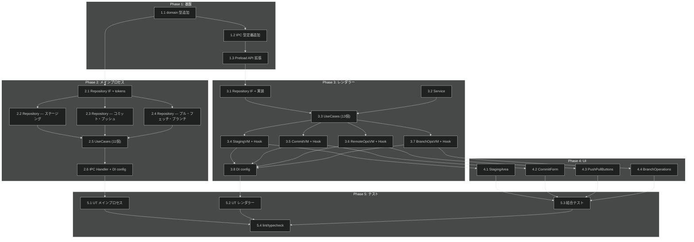

# 基本 Git 操作 タスク分解

## メタ情報

| 項目 | 内容 |
|:---|:---|
| 機能名 | 基本 Git 操作 (Basic Git Operations) |
| 設計書 | [basic-git-operations_design.md](../../specification/basic-git-operations_design.md) |
| 仕様書 | [basic-git-operations_spec.md](../../specification/basic-git-operations_spec.md) |
| PRD | [basic-git-operations.md](../../requirement/basic-git-operations.md) |
| 作成日 | 2026-04-02 |
| Phase 1 スコープ | ファイル単位ステージング、コミット、プッシュ、プル/フェッチ、ブランチ操作（ハンク単位ステージングは Phase 2） |

## タスク一覧

### Phase 1: 基盤

| # | タスク | 説明 | 完了条件 | 依存 |
|:---|:---|:---|:---|:---|
| 1.1 | 共有 domain 型追加 | `src/domain/index.ts` に `CommitArgs`, `CommitResult`, `PushArgs`, `PushResult`, `PullArgs`, `PullResult`, `FetchArgs`, `FetchResult`, `BranchCreateArgs`, `BranchCheckoutArgs`, `BranchDeleteArgs`, `GitProgressEvent` を追加 | `npm run typecheck` が通る。既存の型（`GitStatus`, `BranchList` 等）と共存 | - |
| 1.2 | IPC 型定義追加 | `src/lib/ipc.ts` の `IPCChannelMap` に `git:stage`, `git:stage-all`, `git:unstage`, `git:unstage-all`, `git:commit`, `git:push`, `git:pull`, `git:fetch`, `git:branch-create`, `git:branch-checkout`, `git:branch-delete` を追加。`IPCEventMap` に `git:progress` を追加。`ElectronAPI.git` に書き込み系メソッドを追加 | `npm run typecheck` が通る。既存チャネル定義を壊さない | 1.1 |
| 1.3 | Preload API 拡張 | `src/processes/preload/preload.ts` の `electronAPI.git` に `stage`, `stageAll`, `unstage`, `unstageAll`, `commit`, `push`, `pull`, `fetch`, `branchCreate`, `branchCheckout`, `branchDelete`, `onProgress` を追加 | `npm run typecheck` が通る。`ElectronAPI` 型と一致 | 1.2 |

### Phase 2: コア実装 — メインプロセス

| # | タスク | 説明 | 完了条件 | 依存 |
|:---|:---|:---|:---|:---|
| 2.1 | GitWriteRepository IF + DI tokens | `src/processes/main/features/basic-git-operations/application/repositories/git-write-repository.ts` に IF 定義。`di-tokens.ts` に全トークン + UseCase 型エイリアス定義 | IF が全 11 メソッドを持つ。トークンが全 UseCase + Repository 分定義されている | 1.1 |
| 2.2 | GitWriteDefaultRepository — ステージング | `src/processes/main/features/basic-git-operations/infrastructure/repositories/git-write-default-repository.ts` に `stage`, `stageAll`, `unstage`, `unstageAll` を simple-git で実装 | ユニットテスト（simple-git モック）が通る。`npm run test` でステージング関連テストが全パス | 2.1 |
| 2.3 | GitWriteDefaultRepository — コミット・プッシュ | 同ファイルに `commit`, `push` を実装。push は `NO_UPSTREAM`, `PUSH_REJECTED` エラーコードを返す | ユニットテストが通る。正常系・upstream未設定・リジェクトの3パターン | 2.1 |
| 2.4 | GitWriteDefaultRepository — プル・フェッチ・ブランチ | 同ファイルに `pull`, `fetch`, `branchCreate`, `branchCheckout`, `branchDelete` を実装 | ユニットテストが通る。プル時のコンフリクト検知（`PULL_CONFLICT`）を含む | 2.1 |
| 2.5 | メインプロセス UseCases | `application/usecases/` に 11 UseCase クラスを作成。各 UseCase は `ConsumerUseCase` または `FunctionUseCase` を implements | ユニットテスト（Repository モック）が通る。1クラス=1操作を遵守 | 2.2, 2.3, 2.4 |
| 2.6 | IPC Handler + DI config | `presentation/ipc-handlers.ts` に `registerGitWriteIPCHandlers` を実装。`di-config.ts` に `basicGitOperationsMainConfig` を定義。`src/processes/main/di/configs.ts` に1行追加 | `npm run typecheck` が通る。IPC Handler が全チャネルを登録。DI config で全 UseCase + Repository が解決される | 2.5 |

### Phase 3: コア実装 — レンダラー

| # | タスク | 説明 | 完了条件 | 依存 |
|:---|:---|:---|:---|:---|
| 3.1 | GitOperationsRepository IF + 実装 | `application/repositories/git-operations-repository.ts` に IF。`infrastructure/repositories/git-operations-default-repository.ts` に `window.electronAPI.git.*` 経由の IPC クライアント実装 | `npm run typecheck` が通る。全メソッドが `IPCResult` をアンラップして返す | 1.3 |
| 3.2 | GitOperationsService | `application/services/git-operations-service-interface.ts` に IF（`BaseService` を extends）。`git-operations-service.ts` に実装（`loading$`, `lastError$` を BehaviorSubject で管理） | `setUp()` / `tearDown()` が正常動作。`loading$`, `lastError$` が Observable として公開される | - |
| 3.3 | レンダラー UseCases | `application/usecases/` に 13 UseCase（stage, unstage, stageAll, unstageAll, commit, push, pull, fetch, branchCreate, branchCheckout, branchDelete, getOperationLoading, getLastError）を作成 | 各 UseCase がインターフェースを implements。`getOperationLoading` は `ObservableStoreUseCase<boolean>` | 3.1, 3.2 |
| 3.4 | StagingViewModel + Hook | `presentation/staging-viewmodel.ts` と `presentation/use-staging-viewmodel.ts`。stage/unstage/stageAll/unstageAll 操作と loading 状態管理 | ViewModel が UseCase のみを参照（A-004 準拠）。Hook が `useResolve` + `useObservable` を使用 | 3.3 |
| 3.5 | CommitViewModel + Hook | `presentation/commit-viewmodel.ts` と `presentation/use-commit-viewmodel.ts`。commit/amend 操作と空コミット防止ロジック | amend 時の確認フラグ管理。loading 状態の公開 | 3.3 |
| 3.6 | RemoteOpsViewModel + Hook | `presentation/remote-ops-viewmodel.ts` と `presentation/use-remote-ops-viewmodel.ts`。push/pull/fetch 操作と進捗表示 | upstream 未設定エラー時の再プッシュフロー対応。操作結果通知 | 3.3 |
| 3.7 | BranchOpsViewModel + Hook | `presentation/branch-ops-viewmodel.ts` と `presentation/use-branch-ops-viewmodel.ts`。branchCreate/checkout/delete 操作 | チェックアウト時の未コミット変更チェック（キャンセルのみ）。ブランチ削除のマージ状態確認 | 3.3 |
| 3.8 | レンダラー DI config | `di-tokens.ts` に全トークン。`di-config.ts` に `basicGitOperationsConfig`。`src/processes/renderer/di/configs.ts` に1行追加 | `npm run typecheck` が通る。全 UseCase / ViewModel / Service / Repository が正しく解決される | 3.4, 3.5, 3.6, 3.7 |

### Phase 4: UI コンポーネント

| # | タスク | 説明 | 完了条件 | 依存 |
|:---|:---|:---|:---|:---|
| 4.1 | StagingArea コンポーネント | `presentation/components/staging-area.tsx`。変更ファイル一覧（unstaged + staged）、ステージ/アンステージボタン、全選択、useStagingViewModel を使用 | ファイル一覧表示、個別ステージ/アンステージ、一括ステージが動作。loading 中は操作無効化 | 3.4 |
| 4.2 | CommitForm コンポーネント | `presentation/components/commit-form.tsx`。コミットメッセージ入力（複数行）、コミットボタン、amend チェックボックス + 確認ダイアログ | ステージ済みファイルなしでコミットボタン無効。amend 選択時に確認ダイアログ表示 | 3.5 |
| 4.3 | PushPullButtons コンポーネント | `presentation/components/push-pull-buttons.tsx`。プッシュ/プルボタン、ahead/behind 表示、フェッチボタン、進捗インジケーター | upstream 未設定時に設定ダイアログ表示。操作中は進捗インジケーター表示 | 3.6 |
| 4.4 | BranchOperations コンポーネント | `presentation/components/branch-operations.tsx`。ブランチ作成ダイアログ、チェックアウトセレクター、削除ボタン + 確認ダイアログ | 未マージブランチ削除時に警告。現在ブランチ削除ボタン無効化。未コミット変更時のチェックアウト警告 | 3.7 |

### Phase 5: テスト + 仕上げ

| # | タスク | 説明 | 完了条件 | 依存 |
|:---|:---|:---|:---|:---|
| 5.1 | ユニットテスト — メインプロセス | GitWriteDefaultRepository（simple-git モック）、11 UseCases、IPC Handler のテスト | テストカバレッジ ≥ 80%。正常系・異常系を網羅 | 2.6 |
| 5.2 | ユニットテスト — レンダラー | UseCases + 4 ViewModel のテスト。Repository と Service はモック | テストカバレッジ ≥ 60%。ViewModel が UseCase のみ参照していることを確認 | 3.8 |
| 5.3 | 結合テスト — IPC 通信フロー | ステージ→コミット→プッシュの一連のフロー。ブランチ作成→切り替え→削除のフロー | 主要ユースケースが E2E で動作確認 | 4.1, 4.2, 4.3, 4.4 |
| 5.4 | lint / typecheck / format | `npm run lint`, `npm run typecheck`, `npm run format:check` をパス | CI 相当のチェックがすべてパス | 5.1, 5.2, 5.3 |

## 依存関係図

## 実装の注意事項

- **worktreePath**: すべての Git 操作引数は `worktreePath`（ワークツリーの絶対パス）を使用する（B-001 準拠）
- **A-004 準拠**: ViewModel は UseCase のみを参照し、Service / Repository を直接参照しない
- **命名ルール**: ステートレスな Git 操作ラッパーは `GitWriteRepository`（Repository）と命名する。`GitService` は使わない
- **Phase 2 スコープ外**: ハンク単位ステージング（FR_301_03, FR_301_04）は本タスクに含まない
- **チェックアウト**: 未コミット変更がある場合はキャンセルのみ提供（stash・強制チェックアウトは提供しない）
- **リフレッシュ**: 操作完了後に既存の `git:status` / `git:branches` API を明示的に呼び出してリフレッシュする
- **エラーコード**: `STAGE_FAILED`, `COMMIT_FAILED`, `NO_UPSTREAM`, `PUSH_REJECTED`, `PULL_CONFLICT` 等のドメインプレフィックス付きコードを使用
- **並列実行可能タスク**: Phase 2 の 2.2/2.3/2.4 は並列実行可能。Phase 3 の 3.4/3.5/3.6/3.7 も並列実行可能。Phase 4 の 4.1〜4.4 も並列実行可能

## 要求カバレッジ

| 要求 ID | 要求内容 | 対応タスク |
|:---|:---|:---|
| FR-001 | ファイル単位のステージング | 1.1, 1.2, 1.3, 2.2, 2.5, 2.6, 3.1, 3.3, 3.4, 4.1 |
| FR-002 | ファイル単位のアンステージング | 1.1, 1.2, 1.3, 2.2, 2.5, 2.6, 3.1, 3.3, 3.4, 4.1 |
| FR-003 | ハンク単位のステージング | **Phase 2（本タスクスコープ外）** |
| FR-004 | ハンク単位のアンステージング | **Phase 2（本タスクスコープ外）** |
| FR-005 | 全ファイル一括ステージング | 1.1, 1.2, 1.3, 2.2, 2.5, 2.6, 3.1, 3.3, 3.4, 4.1 |
| FR-006 | コミットメッセージ入力 | 4.2 |
| FR-007 | コミット実行 | 1.1, 1.2, 1.3, 2.3, 2.5, 2.6, 3.1, 3.3, 3.5, 4.2 |
| FR-008 | amend（確認ダイアログ付き） | 2.3, 3.5, 4.2 |
| FR-009 | 空コミット防止 | 3.5, 4.2 |
| FR-010 | コミット後のリフレッシュ | 3.5 |
| FR-011 | プッシュ | 1.1, 1.2, 1.3, 2.3, 2.5, 2.6, 3.1, 3.3, 3.6, 4.3 |
| FR-012 | upstream 設定案内 | 2.3, 3.6, 4.3 |
| FR-013 | プッシュ先選択 | 3.6, 4.3 |
| FR-014 | プッシュ結果通知 | 3.6, 4.3 |
| FR-015 | プル | 1.1, 1.2, 1.3, 2.4, 2.5, 2.6, 3.1, 3.3, 3.6, 4.3 |
| FR-016 | フェッチ | 1.1, 1.2, 1.3, 2.4, 2.5, 2.6, 3.1, 3.3, 3.6, 4.3 |
| FR-017 | コンフリクト通知 | 2.4, 3.6, 4.3 |
| FR-018 | プル/フェッチ後リフレッシュ | 3.6 |
| FR-019 | ブランチ作成ダイアログ | 3.7, 4.4 |
| FR-020 | ブランチチェックアウト | 1.1, 1.2, 1.3, 2.4, 2.5, 2.6, 3.1, 3.3, 3.7, 4.4 |
| FR-021 | チェックアウト警告（キャンセルのみ） | 3.7, 4.4 |
| FR-022 | チェックアウト後リフレッシュ | 3.7 |
| FR-023 | ローカルブランチ削除 | 2.4, 2.5, 2.6, 3.1, 3.3, 3.7, 4.4 |
| FR-024 | リモートブランチ削除 | 2.4, 2.5, 2.6, 3.1, 3.3, 3.7, 4.4 |
| FR-025 | 未マージブランチ削除警告 | 3.7, 4.4 |
| FR-026 | 現在ブランチ削除防止 | 3.7, 4.4 |
| NFR-001 | 操作応答3秒以内 | 5.3 |
| NFR-002 | 進捗インジケーター | 1.2, 1.3, 3.6, 4.3 |
| NFR-003 | 確認ダイアログ | 4.2, 4.4 |
| NFR-004 | メインプロセス実行 | 2.2, 2.3, 2.4, 2.6 |

## 参照ドキュメント

- 抽象仕様書: [basic-git-operations_spec.md](../../specification/basic-git-operations_spec.md)
- 技術設計書: [basic-git-operations_design.md](../../specification/basic-git-operations_design.md)
- PRD: [basic-git-operations.md](../../requirement/basic-git-operations.md)

## 推奨する手動検証

- [ ] タスクの粒度が適切か（1タスク = 数時間〜1日程度）を確認
- [ ] 依存関係図が論理的に正しいか確認
- [ ] 要求カバレッジ表で漏れがないことを確認
- [ ] Phase 分類が適切か確認
