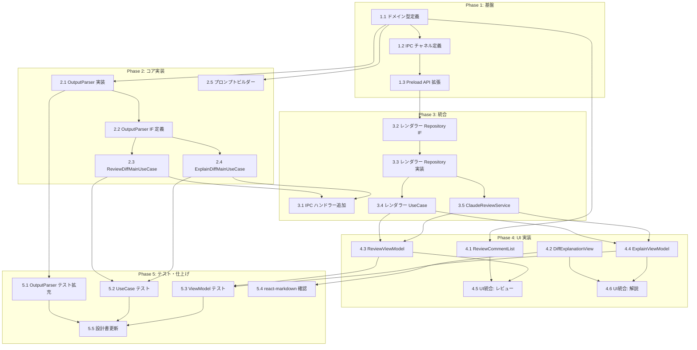

# Claude Code 連携 Phase 4 タスク分解

## メタ情報

| 項目 | 内容 |
|:---|:---|
| 機能名 | Claude Code 連携 (Phase 4: コードレビュー・差分解説) |
| 設計書 | [claude-code-integration_design.md](../../specification/claude-code-integration_design.md) |
| 仕様書 | [claude-code-integration_spec.md](../../specification/claude-code-integration_spec.md) |
| PRD | [claude-code-integration.md](../../requirement/claude-code-integration.md) |
| 作成日 | 2026-04-07 |

## 実装済み (Phase 1-3)

Phase 1-3 で以下が実装完了済み:

- ClaudeProcessManager（spawn/kill/stdin 制御、generateText、checkAuth/login/logout）
- SessionStore（インメモリセッション管理、出力バッファ）
- IPC ハンドラー（10 チャネル + 3 イベント）
- Preload API（10 メソッド + 3 イベント）
- ClaudeSessionPanel / ClaudeOutputView / CommandInput / SessionStatusIndicator
- コミットメッセージ生成（GenerateCommitMessageMainUseCase + UI ボタン）
- 認証管理（CheckAuth / Login / Logout）
- Settings UI（commitMessageRules）

## Phase 4 スコープ

コードレビュー機能（FR-011〜FR-015）と差分解説機能（FR-016〜FR-019）の実装。
OutputParser による CLI 出力の構造化、および対応する UI コンポーネントの追加。

---

## タスク一覧

### Phase 1: 基盤（型定義・IPC チャネル）

| # | タスク | 説明 | 完了条件 | 依存 |
|:---|:---|:---|:---|:---|
| 1.1 | ドメイン型定義追加 | `ReviewComment`, `ReviewSeverity`, `DiffTarget`, レビュー結果型, 解説結果型を `src/domain/index.ts` に追加 | 型定義が追加され `npm run typecheck` が通ること | - |
| 1.2 | IPC チャネル・イベント定義追加 | `claude:review-diff`, `claude:explain-diff` チャネルと `claude:review-result`, `claude:explain-result` イベントを `src/lib/ipc.ts` の `IPCChannelMap` / `IPCEventMap` に追加 | IPC 型定義が追加され typecheck が通ること | 1.1 |
| 1.3 | Preload API 拡張 | `reviewDiff`, `explainDiff`, `onReviewResult`, `onExplainResult` を `src/processes/preload/preload.ts` の contextBridge に追加 | Preload で新 API が公開され typecheck が通ること | 1.2 |

### Phase 2: コア実装（メインプロセス）

| # | タスク | 説明 | 完了条件 | 依存 |
|:---|:---|:---|:---|:---|
| 2.1 | OutputParser 実装 | `src/processes/main/features/claude-code-integration/infrastructure/claude-output-parser.ts` を作成。`parseReviewComments(output): ReviewComment[]` と `parseExplanation(output): string` を実装。正規表現ベースの解析 + パース失敗時フォールバック | ユニットテストで基本的なパースケースとフォールバックが検証されること | 1.1 |
| 2.2 | OutputParser リポジトリ IF 定義 | `application/repositories/` に OutputParser のインターフェースを定義。DI Token を `di-tokens.ts` に追加 | インターフェースが定義され typecheck が通ること | 2.1 |
| 2.3 | ReviewDiffMainUseCase 実装 | `application/usecases/review-diff-main-usecase.ts` を作成。DiffTarget に基づき差分テキスト取得 → レビュープロンプト構築 → Claude CLI 実行（`generateText`）→ OutputParser でコメント抽出 → 結果返却 | ユニットテスト（モック Claude CLI）でレビューコメント取得フローが検証されること | 2.2 |
| 2.4 | ExplainDiffMainUseCase 実装 | `application/usecases/explain-diff-main-usecase.ts` を作成。DiffTarget に基づき差分テキスト取得 → 解説プロンプト構築 → Claude CLI 実行 → OutputParser で解説抽出 → 結果返却 | ユニットテスト（モック Claude CLI）で解説取得フローが検証されること | 2.2 |
| 2.5 | プロンプトビルダー作成 | `infrastructure/prompts/review-diff.ts` と `explain-diff.ts` を作成。差分テキストを含むプロンプトを構築し、構造化された出力（JSON 等）を Claude に指示する | プロンプトが生成されユニットテストで検証されること | 1.1 |

### Phase 3: 統合（IPC ハンドラー・レンダラー側）

| # | タスク | 説明 | 完了条件 | 依存 |
|:---|:---|:---|:---|:---|
| 3.1 | IPC ハンドラー追加 | `claude:review-diff` と `claude:explain-diff` ハンドラーを `ipc-handlers.ts` に追加。UseCase を呼び出し、結果を `claude:review-result` / `claude:explain-result` イベントで送信 | IPC ハンドラーが登録され、メインプロセス DI 設定に UseCase と OutputParser が追加されること | 2.3, 2.4 |
| 3.2 | レンダラー側 Repository IF 拡張 | レンダラー側の `application/repositories/` に `reviewDiff`, `explainDiff` メソッドの IF を追加 | インターフェースが拡張され typecheck が通ること | 1.3 |
| 3.3 | レンダラー側 Repository 実装拡張 | `infrastructure/` の IPC クライアント実装に `reviewDiff`, `explainDiff` と `onReviewResult`, `onExplainResult` イベント購読を追加 | IPC 経由でレビュー・解説リクエストが送信できること | 3.2 |
| 3.4 | レンダラー側 UseCase 追加 | `ReviewDiffRendererUseCase` と `ExplainDiffRendererUseCase` を作成。Repository 経由でメインプロセスにリクエストを委譲 | UseCase が DI Token とともに定義され typecheck が通ること | 3.3 |
| 3.5 | レビュー Service 追加 | `ClaudeReviewService` を作成。`BehaviorSubject<ReviewComment[]>` と `BehaviorSubject<string>` で最新のレビュー結果・解説結果を状態管理。Repository のイベント購読で自動更新 | Service が DI 登録され、Observable でレビュー・解説結果が購読可能なこと | 3.3 |

### Phase 4: UI 実装（コンポーネント・ViewModel）

| # | タスク | 説明 | 完了条件 | 依存 |
|:---|:---|:---|:---|:---|
| 4.1 | ReviewCommentList コンポーネント | `ReviewCommentList.tsx` を作成。ReviewComment 配列を受け取り、severity 別アイコン + ファイルパス + 行番号 + メッセージ + suggestion を表示。`onCommentClick` でコメント選択を通知 | コンポーネントがレンダリングされ、Props に基づく表示が正しいこと | 1.1 |
| 4.2 | DiffExplanationView コンポーネント | `DiffExplanationView.tsx` を作成。マークダウン文字列を `react-markdown` でレンダリング。コピーボタン付き（FR-019） | マークダウンが正しくレンダリングされ、コピー機能が動作すること | - |
| 4.3 | ReviewViewModel 実装 | `review-viewmodel.ts` と `use-review-viewmodel.ts` を作成。ClaudeReviewService の Observable を購読し、`reviewComments$`, `reviewSummary$`, `isReviewing$` を公開。`requestReview(diffTarget)` メソッド提供 | ViewModel が DI 登録され、Hook ラッパー経由で React から利用可能なこと | 3.4, 3.5 |
| 4.4 | ExplainViewModel 実装 | `explain-viewmodel.ts` と `use-explain-viewmodel.ts` を作成。ClaudeReviewService の Observable を購読し、`explanation$`, `isExplaining$` を公開。`requestExplain(diffTarget)` メソッド提供 | ViewModel が DI 登録され、Hook ラッパー経由で React から利用可能なこと | 3.4, 3.5 |
| 4.5 | UI 統合: レビューパネル | ClaudeSessionPanel または RepositoryDetailPanel にレビュータブ / セクションを追加。「レビューリクエスト」ボタン + ReviewCommentList + サマリー表示を統合 | 既存 UI にレビュー機能が統合され、ボタンクリックでレビューが開始されること | 4.1, 4.3 |
| 4.6 | UI 統合: 解説パネル | コミットログまたはブランチ差分ビューに「解説リクエスト」ボタン + DiffExplanationView を統合 | 既存 UI に解説機能が統合され、ボタンクリックで解説が開始されること | 4.2, 4.4 |

### Phase 5: テスト・仕上げ

| # | タスク | 説明 | 完了条件 | 依存 |
|:---|:---|:---|:---|:---|
| 5.1 | OutputParser ユニットテスト拡充 | 各種 Claude CLI 出力パターン（正常/異常/空/巨大テキスト）に対するパーステストを追加。フォールバック動作の検証 | テストカバレッジ >= 80% | 2.1 |
| 5.2 | UseCase ユニットテスト | ReviewDiffMainUseCase / ExplainDiffMainUseCase のテスト。モック ClaudeProcessManager + OutputParser を使用 | テストカバレッジ >= 80% | 2.3, 2.4 |
| 5.3 | ViewModel ユニットテスト | ReviewViewModel / ExplainViewModel のテスト。Observable の状態遷移を検証 | テストカバレッジ >= 80% | 4.3, 4.4 |
| 5.4 | react-markdown 依存追加確認 | `react-markdown` パッケージが未インストールの場合は追加。Vite ビルド・typecheck が通ることを確認 | `npm run typecheck` と `npm run lint` がパス | 4.2 |
| 5.5 | 設計書ステータス更新 | `claude-code-integration_design.md` の実装ステータスを更新。OutputParser と ReviewCommentList を 🟢 に変更、`impl-status` を `implemented` に変更 | 設計書が最新状態に更新されていること | 5.1, 5.2, 5.3 |

---

## 依存関係図



---

## 実装の注意事項

- **OutputParser のフォールバック**: Claude Code CLI の出力フォーマットはバージョン依存。パース失敗時は生テキストをそのまま表示するフォールバックを必ず実装する（設計書 9.2 未解決の課題）
- **プロンプト設計**: レビュー/解説プロンプトでは JSON 形式の構造化出力を Claude に指示し、OutputParser でのパースを容易にする
- **既存パターンの踏襲**: コミットメッセージ生成（`generateText` + ワンショット実行）と同じパターンでレビュー/解説も実装する
- **ClaudeCommandType の活用**: ドメイン型にはすでに `'review'` | `'explain'` が定義済み
- **DI 登録**: 既存の di-config.ts / di-tokens.ts パターンに従い、新 UseCase/Service/ViewModel を登録する
- **react-markdown**: Electron + Vite 5 環境での ESM 互換性を確認すること
- **セキュリティ**: レビュー結果の HTML レンダリングでは XSS 対策として react-markdown の sanitization を有効にする

---

## 参照ドキュメント

- 抽象仕様書: [claude-code-integration_spec.md](../../specification/claude-code-integration_spec.md)
- 技術設計書: [claude-code-integration_design.md](../../specification/claude-code-integration_design.md)
- PRD: [claude-code-integration.md](../../requirement/claude-code-integration.md)

---

## 要求カバレッジ

| 要求 ID | 要求内容 | 対応タスク |
|:---|:---|:---|
| FR-011 | 現在の差分を Claude Code に送信してレビューを取得する | 1.1, 1.2, 2.3, 2.5, 3.1, 4.5 |
| FR-012 | 特定コミット間の差分を Claude Code に送信してレビューを取得する | 1.1, 2.3, 2.5, 3.1, 4.5 |
| FR-013 | レビューコメントを取得・表示する | 2.1, 2.2, 3.4, 3.5, 4.1, 4.3, 4.5 |
| FR-014 | レビューコメントを差分上にインライン表示する | 4.1, 4.5 |
| FR-015 | レビュー結果のサマリーを表示する | 2.1, 3.5, 4.3, 4.5 |
| FR-016 | コミット選択による差分解説をリクエストする | 1.1, 1.2, 2.4, 2.5, 3.1, 4.6 |
| FR-017 | ブランチ間差分の解説をリクエストする | 1.1, 2.4, 2.5, 3.1, 4.6 |
| FR-018 | 解説結果をマークダウン形式で表示する | 4.2, 4.4, 4.6 |
| FR-019 | 解説のコピー・エクスポート機能を提供する | 4.2 |
| NFR-001 | セッション起動 30 秒以内 | (Phase 1-3 実装済み) |
| NFR-002 | ストリーミング出力遅延 100ms 以内 | (Phase 1-3 実装済み) |
| NFR-004 | 子プロセスのサンドボックス化 | (Phase 1-3 実装済み、Phase 4 も同パターン) |

### カバレッジ状況

- **FR-011〜FR-019**: 全 9 件がタスクでカバーされている
- **NFR**: Phase 1-3 で対応済み。Phase 4 の新 UseCase も同じ `generateText` パターンを使用するため追加対応不要
- **FR-014（インライン表示）**: タスク 4.1 / 4.5 でカバー。ただし初期実装ではリスト表示を優先し、インライン表示は後続改善として段階的に対応可能

---

## 推奨する手動検証

- [ ] タスクの粒度が適切か（1タスク = 数時間〜1日程度）を確認
- [ ] 依存関係図が論理的に正しいか確認
- [ ] 要求カバレッジ表で漏れがないことを確認
- [ ] Phase 分類が適切か確認

## 検証コマンド

```bash
# 関連する設計書との整合性を確認
/check-spec claude-code-integration

# 仕様の不明点がないか確認
/clarify claude-code-integration

# チェックリストを生成して品質基準を明確化
/checklist claude-code-integration
```
