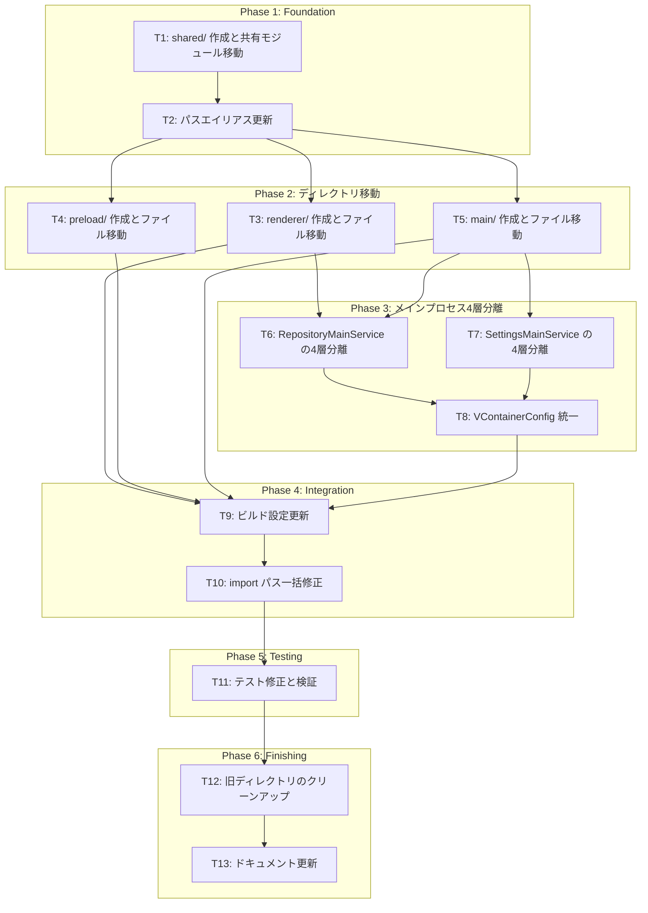

# アプリケーション基盤 プロセス別ディレクトリ分離

**関連 Design Doc:** [application-foundation_design.md](../../specification/application-foundation_design.md)
**関連 Spec:** [application-foundation_spec.md](../../specification/application-foundation_spec.md)
**関連 PRD:** [application-foundation.md](../../requirement/application-foundation.md)

---

## 背景

design.md v3.0 で以下の設計方針が決定された:

1. `src/` をプロセス別に分離（`src/main/`, `src/renderer/`, `src/shared/`, `src/preload/`）
2. メインプロセス側にも Clean Architecture 4層構成を適用
3. メインプロセスでも VContainer を使用
4. IPC Handler = presentation 層（メインプロセス側）

本タスクは暫定構造（`src/features/`, `src/lib/`, `src/types/`）から目標構造への移行を実施する。

**現在の暫定構造:**

```
src/
├── main.ts, preload.ts, renderer.tsx, App.tsx
├── features/application-foundation/
│   ├── domain/, application/, infrastructure/ (+ main/), presentation/
├── di/
├── lib/ (di, hooks, usecase, service, main-process)
├── types/
└── components/
```

**目標構造:**

```
src/
├── main/
│   ├── features/application-foundation/
│   │   ├── application/
│   │   ├── infrastructure/
│   │   └── presentation/
│   ├── di/
│   └── index.ts
├── renderer/
│   ├── features/application-foundation/
│   │   ├── application/
│   │   ├── infrastructure/
│   │   └── presentation/
│   ├── di/
│   ├── components/
│   └── App.tsx
├── shared/
│   ├── domain/
│   ├── types/
│   └── lib/ (di, hooks, usecase, service)
└── preload/
    └── index.ts
```

---

## タスク依存関係図



---

## Phase 1: Foundation（基盤準備）

### T1: shared/ ディレクトリ作成と共有モジュール移動

**目的:** プロセス間共有のモジュールを `src/shared/` に集約する

**依存:** なし

**実装内容:**

1. `src/shared/` ディレクトリ構造を作成
2. 以下を移動:
   - `src/features/application-foundation/domain/` → `src/shared/domain/`
   - `src/types/` → `src/shared/types/`
   - `src/lib/di/` → `src/shared/lib/di/`
   - `src/lib/hooks/` → `src/shared/lib/hooks/`
   - `src/lib/usecase/` → `src/shared/lib/usecase/`
   - `src/lib/service/` → `src/shared/lib/service/`
   - `src/lib/utils.ts` → `src/shared/lib/utils.ts`
   - `src/lib/logger.ts` → `src/shared/lib/logger.ts`
3. `src/shared/lib/index.ts` エクスポートファイルを作成

**完了条件:**

- [ ] `src/shared/` ディレクトリ構造が存在する
- [ ] 共有モジュールが全て `src/shared/` に移動されている
- [ ] `npm run typecheck` が通る（import パスは次タスクで修正）

**推定工数:** 1時間

---

### T2: パスエイリアス更新

**目的:** 新しいディレクトリ構造に合わせたパスエイリアスを設定する

**依存:** T1

**実装内容:**

1. `tsconfig.json` の `paths` を更新:
   - `@shared/*` → `./src/shared/*`
   - `@main/*` → `./src/main/*`
   - `@renderer/*` → `./src/renderer/*`
   - `@preload/*` → `./src/preload/*`
   - 旧 `@/*` は移行期間中は維持（段階的に削除）
2. 各 Vite 設定の `resolve.alias` を更新:
   - `vite.main.config.ts` — `@shared`, `@main`
   - `vite.renderer.config.ts` — `@shared`, `@renderer`
   - `vite.preload.config.ts` — `@shared`, `@preload`

**完了条件:**

- [ ] 新しいパスエイリアスが全ての Vite 設定と tsconfig に設定されている
- [ ] `npm run typecheck` が通る

**推定工数:** 1時間

---

## Phase 2: ディレクトリ移動

### T3: renderer/ 作成とレンダラーファイル移動

**目的:** レンダラープロセスのコードを `src/renderer/` に移動する

**依存:** T2

**実装内容:**

1. `src/renderer/` ディレクトリ構造を作成
2. 以下を移動:
   - `src/renderer.tsx` → `src/renderer/renderer.tsx`
   - `src/App.tsx` → `src/renderer/App.tsx`
   - `src/index.css` → `src/renderer/index.css`
   - `src/components/` → `src/renderer/components/`
   - `src/di/renderer-configs.ts` → `src/renderer/di/configs.ts`
   - `src/features/application-foundation/application/` → `src/renderer/features/application-foundation/application/`
   - `src/features/application-foundation/infrastructure/` (main/ 除く) → `src/renderer/features/application-foundation/infrastructure/`
   - `src/features/application-foundation/presentation/` → `src/renderer/features/application-foundation/presentation/`
   - `src/features/application-foundation/di-config.ts` → `src/renderer/features/application-foundation/di-config.ts`
   - `src/features/application-foundation/di-tokens.ts` → `src/renderer/features/application-foundation/di-tokens.ts`
3. import パスを新エイリアスに更新

**完了条件:**

- [ ] レンダラーのコードが `src/renderer/` に移動されている
- [ ] `src/features/application-foundation/infrastructure/main/` は移動していない
- [ ] `npm run typecheck` が通る

**推定工数:** 2時間

---

### T4: preload/ 作成と preload 移動

**目的:** preload コードを `src/preload/` に移動する

**依存:** T2

**実装内容:**

1. `src/preload/` ディレクトリを作成
2. `src/preload.ts` → `src/preload/index.ts`
3. import パスを新エイリアスに更新

**完了条件:**

- [ ] `src/preload/index.ts` が存在する
- [ ] `npm run typecheck` が通る

**推定工数:** 0.5時間

---

### T5: main/ 作成とメインプロセスファイル移動

**目的:** メインプロセスのコードを `src/main/` に移動する（まだ4層分離はしない）

**依存:** T2

**実装内容:**

1. `src/main/` ディレクトリ構造を作成
2. 以下を移動:
   - `src/main.ts` → `src/main/index.ts`
   - `src/di/main-configs.ts` → `src/main/di/configs.ts`
   - `src/features/application-foundation/infrastructure/main/` → `src/main/features/application-foundation/infrastructure/`（暫定配置）
   - `src/features/application-foundation/di-config-main.ts` → `src/main/features/application-foundation/di-config.ts`
   - `src/lib/main-process/` → `src/main/lib/main-process/`（暫定、T8 で VContainerConfig 統一後に削除）
3. import パスを新エイリアスに更新

**完了条件:**

- [ ] メインプロセスのコードが `src/main/` に移動されている
- [ ] `npm run typecheck` が通る

**推定工数:** 1.5時間

---

## Phase 3: メインプロセス4層分離

### T6: RepositoryMainService の4層分離

**目的:** RepositoryMainService のビジネスロジックを application 層に分離し、infrastructure をデータアクセスに限定する

**依存:** T3, T5

**実装内容:**

1. `src/main/features/application-foundation/application/` 作成
   - `repository-main-usecase.ts` — ビジネスロジック:
     - `openWithDialog()` オーケストレーション
     - `openByPath()` Git 検証 + RepositoryInfo 構築 + 履歴追加
     - `addToRecent()` 重複排除、MAX_RECENT 制限、pinned 保持
     - `getRecent()`, `removeRecent()`, `pin()`, `validate()`
   - Repository IF を定義（application 層に依存逆転）

2. `src/main/features/application-foundation/infrastructure/` をリファクタリング
   - `git-repository-validator.ts` — `execFile` による Git 検証
   - `store-repository.ts` — electron-store CRUD
   - `dialog-service.ts` — Electron dialog API
   - `store-schema.ts` — そのまま移動

3. `src/main/features/application-foundation/presentation/` 作成
   - `ipc-handlers.ts` — application 層の UseCase に委譲

**完了条件:**

- [ ] application 層に UseCase が存在する
- [ ] infrastructure 層がデータアクセスのみに限定されている
- [ ] presentation 層の IPC Handler が UseCase に委譲している
- [ ] `npm run typecheck` が通る
- [ ] ユニットテスト作成（UseCase のビジネスロジック）

**推定工数:** 3時間

---

### T7: SettingsMainService の4層分離

**目的:** SettingsMainService を application + infrastructure に分離する

**依存:** T5

**実装内容:**

1. `settings-main-usecase.ts` を application 層に作成
2. `store-repository.ts` に設定関連メソッドを追加（T6 で作成済みの場合は拡張）
3. IPC Handler の設定関連部分を UseCase に委譲

**完了条件:**

- [ ] 設定関連の UseCase が application 層に存在する
- [ ] IPC Handler が UseCase に委譲している
- [ ] `npm run typecheck` が通る

**推定工数:** 1.5時間

---

### T8: メインプロセス VContainerConfig 統一

**目的:** MainProcessConfig を廃止し、メインプロセスでも VContainerConfig + VContainer の container API を使用する

**依存:** T6, T7

**実装内容:**

1. `src/main/features/application-foundation/di-config.ts` を VContainerConfig 形式に書き換え:
   - `register()` で infrastructure → application → presentation の DI 登録
   - `setUp()` で初期化、tearDown 関数を返す
2. `src/main/index.ts` を更新:
   - VContainer インスタンスを作成
   - `di-config.ts` の register/setUp を実行
3. `src/main/lib/main-process/` を削除（不要になる）
4. `src/main/di/configs.ts` を VContainerConfig 配列に変更

**完了条件:**

- [ ] メインプロセスが VContainerConfig パターンで初期化されている
- [ ] MainProcessConfig / bootstrapMainProcess が使われていない
- [ ] `npm run typecheck` が通る
- [ ] アプリ起動時に IPC 通信が正常動作する

**推定工数:** 2時間

---

## Phase 4: Integration（統合）

### T9: ビルド設定更新

**目的:** Electron Forge + Vite のビルド設定を新ディレクトリ構造に合わせる

**依存:** T3, T4, T5, T8

**実装内容:**

1. `forge.config.ts` の VitePlugin エントリーパスを更新:
   - main: `src/main/index.ts`
   - preload: `src/preload/index.ts`
   - renderer: `src/renderer/renderer.tsx` + `index.html`
2. `vite.main.config.ts` — resolve.alias を最終確認
3. `vite.renderer.config.ts` — resolve.alias を最終確認
4. `vite.preload.config.ts` — resolve.alias を最終確認
5. `index.html` の script src パスを更新（必要な場合）

**完了条件:**

- [ ] `npm start` でアプリが正常起動する
- [ ] `npm run package` でパッケージングが成功する
- [ ] DevTools コンソールにエラーがない

**推定工数:** 2時間

---

### T10: import パス一括修正

**目的:** 全ファイルの import パスを新エイリアスに統一する

**依存:** T9

**実装内容:**

1. `@/` → `@shared/`, `@main/`, `@renderer/` に一括置換
2. 相対パスの整理
3. ESLint の import-x プラグインでエラーがないことを確認

**完了条件:**

- [ ] 旧パスエイリアス `@/` が全ファイルから除去されている
- [ ] `npm run typecheck` が通る
- [ ] `npm run lint` が通る

**推定工数:** 1.5時間

---

## Phase 5: Testing（テスト）

### T11: テスト修正と検証

**目的:** 既存テストを新構造に合わせて修正し、全てパスすることを検証する

**依存:** T10

**実装内容:**

1. テストファイルの import パスを修正
2. vitest.config.ts のパスエイリアスを更新
3. メインプロセス4層分離に伴う新規テスト作成:
   - RepositoryMainUseCase のユニットテスト
   - SettingsMainUseCase のユニットテスト
4. 全テスト実行

**完了条件:**

- [ ] 既存 186 テストが全てパスする
- [ ] メインプロセス UseCase のテストが追加されている
- [ ] `npm run test` が通る

**推定工数:** 2時間

---

## Phase 6: Finishing（仕上げ）

### T12: 旧ディレクトリのクリーンアップ

**目的:** 移行前の旧ディレクトリ・ファイルを削除する

**依存:** T11

**実装内容:**

1. 以下を削除:
   - `src/features/` ディレクトリ
   - `src/lib/` ディレクトリ
   - `src/types/` ディレクトリ
   - `src/components/` ディレクトリ
   - `src/di/` ディレクトリ
   - `src/main.ts`, `src/preload.ts`, `src/renderer.tsx`, `src/App.tsx`
   - `src/index.css`
2. tsconfig.json から旧パスエイリアス `@/*` を削除
3. `npm run typecheck && npm run lint && npm run test` が通ることを確認

**完了条件:**

- [ ] 旧ディレクトリ・ファイルが全て削除されている
- [ ] 旧パスエイリアス `@/*` が除去されている
- [ ] `npm run typecheck && npm run lint && npm run test` が通る
- [ ] `npm start` でアプリが正常起動する

**推定工数:** 1時間

---

### T13: ドキュメント更新

**目的:** 実装完了に伴い SDD ドキュメントを最終更新する

**依存:** T12

**実装内容:**

1. `application-foundation_design.md` の更新:
   - §1.1 実装進捗にプロセス分離ステータスを追加
   - §4.1 システム構成図を4層構成に更新
   - §4.2 モジュール分割の「注」（移行注記）を削除
   - §6.4 IPC ハンドラーのコードサンプルを presentation 層に更新
2. `CLAUDE.md` の更新:
   - CONSTITUTION.md の「移行状態」セクションを削除
3. `CONSTITUTION.md` の更新:
   - モジュール構成セクションの「移行状態」注記を削除

**完了条件:**

- [ ] design.md の移行注記が全て削除されている
- [ ] ドキュメントが目標構造と一致している
- [ ] SDD ドキュメント間の一貫性が保たれている

**推定工数:** 1時間

---

## 要求カバレッジ検証

本タスクはリファクタリング（構造変更）であり、新しい機能要求は追加しない。既存の機能要求（FR_601〜FR_605）が移行後も正常に動作することを T11（テスト）で検証する。

| 要求 ID | 要求内容 | 対応タスク | ステータス |
|:--------|:---------|:-----------|:-----------|
| FR_601 | フォルダ選択ダイアログでリポジトリを開く | T6 (UseCase 分離), T11 (テスト) | 待機中 |
| FR_602 | 最近開いたリポジトリの履歴管理 | T6 (UseCase 分離), T11 (テスト) | 待機中 |
| FR_603 | アプリケーション設定画面 | T7 (UseCase 分離), T11 (テスト) | 待機中 |
| FR_604 | IPC 通信基盤 | T9 (ビルド設定), T10 (import 修正) | 待機中 |
| FR_605 | エラー通知 | T3 (renderer 移動), T11 (テスト) | 待機中 |
| NFR_001 | 起動3秒以内 | T9 (ビルド設定), T11 (テスト) | 待機中 |
| NFR_002 | IPC 50ms 以内 | T9 (ビルド設定), T11 (テスト) | 待機中 |

---

## タスク一覧サマリー

| Phase | タスク数 | 推定工数 |
|:------|:---------|:---------|
| Phase 1: Foundation | 2 | 2時間 |
| Phase 2: ディレクトリ移動 | 3 | 4時間 |
| Phase 3: メインプロセス4層分離 | 3 | 6.5時間 |
| Phase 4: Integration | 2 | 3.5時間 |
| Phase 5: Testing | 1 | 2時間 |
| Phase 6: Finishing | 2 | 2時間 |
| **合計** | **13** | **20時間** |

---

## 実装の注意事項

- **段階的移行**: 旧パスエイリアス `@/` は移行期間中に維持し、T12 で最終削除する
- **ビルド確認**: Phase 2 と Phase 4 の各タスク完了時に `npm start` で起動確認する
- **Git 管理**: ファイル移動は `git mv` を使用し、履歴を保持する
- **VContainer 統一**: T8 で MainProcessConfig → VContainerConfig に統一することで、メイン/レンダラーの DI パターンが完全一致する
- **React Hook の配置**: `useObservable`, `useResolve` 等の React Hook は `src/shared/lib/` に配置するが、メインプロセスからは import しない

---

## 参照ドキュメント

- 技術設計書: [application-foundation_design.md](../../specification/application-foundation_design.md) (v3.0)
- 抽象仕様書: [application-foundation_spec.md](../../specification/application-foundation_spec.md)
- 要求仕様書: [application-foundation.md](../../requirement/application-foundation.md)
- プロジェクト原則: [CONSTITUTION.md](../../CONSTITUTION.md)
- 開発ルール: [CLAUDE.md](../../../CLAUDE.md)
