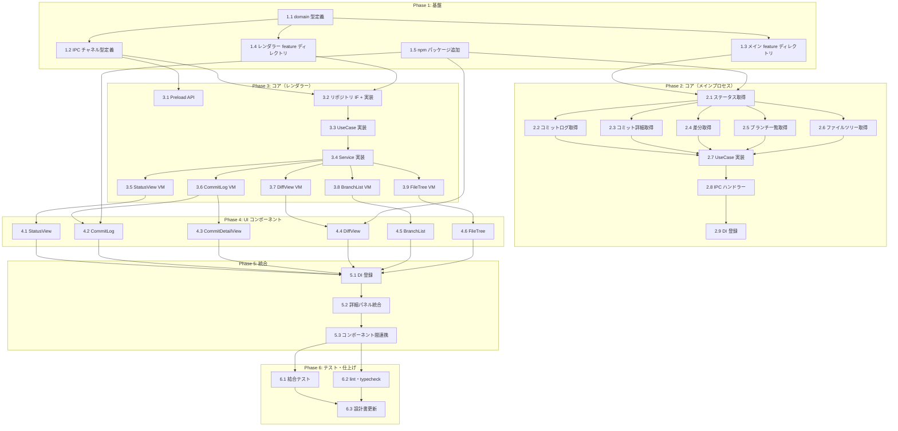

# リポジトリ閲覧 タスク分解

## メタ情報

| 項目 | 内容 |
|:---|:---|
| 機能名 | リポジトリ閲覧 |
| 設計書 | [repository-viewer_design.md](../../specification/repository-viewer_design.md) |
| 仕様書 | [repository-viewer_spec.md](../../specification/repository-viewer_spec.md) |
| PRD | [repository-viewer.md](../../requirement/repository-viewer.md) |
| 作成日 | 2026-04-01 |

## 注意: 設計書とプロジェクトアーキテクチャの差異

設計書（design doc）のモジュール配置はフラット構造（`src/main/services/git.ts` 等）で記述されているが、プロジェクトの実際のアーキテクチャは Clean Architecture 4層 + feature ディレクトリ構成を採用している。本タスク分解ではプロジェクトの実アーキテクチャに合わせた配置とする。

## タスク一覧

### Phase 1: 基盤

| # | タスク | 説明 | 完了条件 | 依存 |
|:---|:---|:---|:---|:---|
| 1.1 | domain 型定義 | `src/shared/domain/` に Git 関連の domain 型を追加する（`GitStatus`, `FileChange`, `CommitSummary`, `CommitDetail`, `FileDiff`, `DiffHunk`, `DiffLine`, `BranchList`, `BranchInfo`, `FileTreeNode`, `GitLogQuery`, `GitLogResult`, `GitDiffQuery` 等） | domain 型が定義され、`typecheck` が通る。既存 domain の命名規則に準拠 | - |
| 1.2 | IPC チャネル型定義 | `src/shared/types/ipc.ts` の `IPCChannelMap` と `ElectronAPI` に `git:*` チャネル（status, log, commit-detail, diff, diff-staged, diff-commit, branches, file-tree）を追加する | 8つの git チャネルが型定義に追加され、`typecheck` が通る | 1.1 |
| 1.3 | メインプロセス feature ディレクトリ構成 | `src/main/features/repository-viewer/` に Clean Architecture 4層ディレクトリ（application/repositories, application/usecases, infrastructure/repositories, presentation）と `di-tokens.ts`, `di-config.ts` のスケルトンを作成する | ディレクトリ構成が存在し、空の di-tokens / di-config がコンパイルできる | 1.1 |
| 1.4 | レンダラー feature ディレクトリ構成 | `src/renderer/features/repository-viewer/` に Clean Architecture 4層ディレクトリ（application/repositories, application/services, application/usecases, infrastructure/repositories, presentation/components）と `di-tokens.ts`, `di-config.ts` のスケルトンを作成する | ディレクトリ構成が存在し、空の di-tokens / di-config がコンパイルできる | 1.1 |
| 1.5 | npm パッケージ追加 | `simple-git`, `monaco-editor`, `@tanstack/react-virtual` をインストールする。必要に応じて `vite.renderer.config.ts` に Monaco Editor の worker 設定を追加する | パッケージがインストールされ、import 可能。Monaco Editor が Vite + Electron 環境で動作することを検証 | - |

### Phase 2: コア実装（メインプロセス側）

| # | タスク | 説明 | 完了条件 | 依存 |
|:---|:---|:---|:---|:---|
| 2.1 | Git リポジトリ IF + ステータス取得実装 | application 層にリポジトリ IF（`GitReadRepository`）を定義し、infrastructure 層に `simple-git` を使った `getStatus()` の実装を作成する。`StatusResult → GitStatus` の変換ロジックを含む | ユニットテストで mock した simple-git から正しく `GitStatus` に変換されることを検証 | 1.1, 1.3, 1.5 |
| 2.2 | コミットログ取得実装 | `GitReadRepository` に `getLog()` メソッドを追加し、infrastructure 層に実装する。ページネーション（offset + limit）、検索対応 | ユニットテストで `GitLogResult` が正しく返ること、ページネーションパラメータが simple-git に渡ること | 2.1 |
| 2.3 | コミット詳細取得実装 | `GitReadRepository` に `getCommitDetail()` を追加し、infrastructure 層に実装する。変更ファイル一覧と統計情報を含む | ユニットテストで `CommitDetail`（files, additions, deletions 含む）が正しく返ること | 2.1 |
| 2.4 | 差分取得実装 | `GitReadRepository` に `getDiff()`, `getDiffStaged()`, `getDiffCommit()` を追加し、infrastructure 層に実装する。raw diff 文字列から `FileDiff[]` へのパースロジックを含む | ユニットテストで diff 文字列が `FileDiff[]`（hunks, lines 含む）に正しくパースされること | 2.1 |
| 2.5 | ブランチ一覧取得実装 | `GitReadRepository` に `getBranches()` を追加し、infrastructure 層に実装する。ローカル/リモートの分類、現在ブランチの判定を含む | ユニットテストで `BranchList` が正しく返ること（current, local, remote の分類） | 2.1 |
| 2.6 | ファイルツリー取得実装 | `GitReadRepository` に `getFileTree()` を追加し、infrastructure 層に実装する。`git ls-tree` + status マージによるツリー構築ロジック | ユニットテストでフラットなファイルリストからツリー構造が正しく構築されること | 2.1 |
| 2.7 | メインプロセス UseCase 実装 | application 層に各 UseCase を作成する（`GetStatusMainUseCase`, `GetLogMainUseCase`, `GetCommitDetailMainUseCase`, `GetDiffMainUseCase`, `GetDiffStagedMainUseCase`, `GetDiffCommitMainUseCase`, `GetBranchesMainUseCase`, `GetFileTreeMainUseCase`） | 各 UseCase が `GitReadRepository` を DI で受け取り、対応メソッドを呼ぶ。ユニットテストでロジック検証 | 2.1-2.6 |
| 2.8 | IPC ハンドラー実装 | presentation 層に `ipc-handlers.ts` を作成し、`git:*` チャネルを登録する。UseCase を呼び出し `IPCResult<T>` でラップする | ユニットテストで各チャネルが正しく UseCase に委譲し、エラー時に `ipcFailure` を返すこと | 2.7 |
| 2.9 | メインプロセス DI 登録 | `di-tokens.ts` にトークン定義、`di-config.ts` に DI 登録（useClass + deps パターン）。`src/main/di/configs.ts` に config を追加 | `typecheck` が通り、`npm start` で IPC ハンドラーが登録されること | 2.7, 2.8 |

### Phase 3: コア実装（レンダラー側）

| # | タスク | 説明 | 完了条件 | 依存 |
|:---|:---|:---|:---|:---|
| 3.1 | Preload API 追加 | `src/preload/preload.ts` に `git.*` API を追加する。`contextBridge` 経由で 8 つの IPC チャネルを公開 | `typecheck` が通り、`window.electronAPI.git` で全メソッドにアクセス可能 | 1.2 |
| 3.2 | レンダラー側リポジトリ IF + 実装 | application 層にリポジトリ IF を定義し、infrastructure 層に IPC クライアント実装を作成する（`window.electronAPI.git.*` を呼ぶ） | ユニットテストでリポジトリが IPC API を正しく呼び出すこと | 1.2, 1.4 |
| 3.3 | レンダラー側 UseCase 実装 | application 層に UseCase を作成する（ステータス取得、ログ取得、コミット詳細取得、差分取得、ブランチ一覧取得、ファイルツリー取得） | 各 UseCase がリポジトリ IF に委譲する。ユニットテストで検証 | 3.2 |
| 3.4 | レンダラー側 Service 実装 | リポジトリ閲覧の状態管理 Service を作成する（選択中のコミット、差分表示モード、ブランチフィルタ等の状態を `BehaviorSubject` で管理） | `BaseService` を extends し、`setUp()` / `tearDown()` でライフサイクル管理。ユニットテスト | 3.3 |
| 3.5 | StatusView ViewModel + Hook | ステータス表示用の ViewModel（`status$` で `GitStatus` を公開）と Hook ラッパー（`useStatusViewModel`）を作成 | `useObservable` でステータスを React state に変換。ユニットテストで ViewModel のロジック検証 | 3.3, 3.4 |
| 3.6 | CommitLog ViewModel + Hook | コミットログ用の ViewModel（`commits$`, `hasMore$`, ページネーション制御）と Hook ラッパーを作成 | スクロール時のページネーション、検索フィルタリングの動作をユニットテストで検証 | 3.3, 3.4 |
| 3.7 | DiffView ViewModel + Hook | 差分表示用の ViewModel（`diffs$`, `displayMode$`）と Hook ラッパーを作成 | 表示モード切替（inline / side-by-side）の動作をユニットテストで検証 | 3.3, 3.4 |
| 3.8 | BranchList ViewModel + Hook | ブランチ一覧用の ViewModel（`branches$`, フィルタリング）と Hook ラッパーを作成 | ローカル/リモートの分類、検索フィルタの動作をユニットテストで検証 | 3.3, 3.4 |
| 3.9 | FileTree ViewModel + Hook | ファイルツリー用の ViewModel（`tree$`, 展開/折りたたみ状態管理）と Hook ラッパーを作成 | ツリーの展開/折りたたみ、変更マーキングの動作をユニットテストで検証 | 3.3, 3.4 |

### Phase 4: UI コンポーネント実装

| # | タスク | 説明 | 完了条件 | 依存 |
|:---|:---|:---|:---|:---|
| 4.1 | StatusView コンポーネント | ステージ済み/未ステージ/未追跡の3セクションでファイル一覧を表示。変更種別アイコン（追加/変更/削除/リネーム）、ファイル選択で差分表示へ連携 | コンポーネントテストで3セクションが正しく表示され、ファイル選択イベントが発火すること | 3.5 |
| 4.2 | CommitLog コンポーネント | `@tanstack/react-virtual` による仮想スクロール付きコミットログ一覧。検索バー、スクロール時の自動ページネーション | コンポーネントテストで仮想スクロールが動作し、コミット選択イベントが発火すること | 3.6, 1.5 |
| 4.3 | CommitDetailView コンポーネント | 選択コミットの詳細情報（メッセージ、著者、日時、変更ファイル一覧）を表示。ファイル選択でコミット差分へ連携 | コンポーネントテストで詳細情報とファイル一覧が表示されること | 3.6 |
| 4.4 | DiffView コンポーネント（Monaco Editor） | Monaco Editor の DiffEditor を使った差分表示。インライン/サイドバイサイドの切替、シンタックスハイライト | Monaco Editor が正しく描画され、モード切替が動作すること。コンポーネントテスト | 3.7, 1.5 |
| 4.5 | BranchList コンポーネント | ローカル/リモートブランチのセクション分け表示。現在ブランチのハイライト、検索フィルタ | コンポーネントテストでブランチが分類表示され、検索フィルタが動作すること | 3.8 |
| 4.6 | FileTree コンポーネント | ツリー構造のファイル表示。ディレクトリの展開/折りたたみ、変更ファイルのマーキング、ファイル選択で差分表示へ連携 | コンポーネントテストでツリーが正しく表示され、展開/折りたたみが動作すること | 3.9 |

### Phase 5: 統合

| # | タスク | 説明 | 完了条件 | 依存 |
|:---|:---|:---|:---|:---|
| 5.1 | レンダラー DI 登録 | `di-tokens.ts` にトークン定義、`di-config.ts` に全コンポーネントの DI 登録。`src/renderer/di/configs.ts` に config を追加 | `typecheck` が通り、DI コンテナから全サービス/UseCase/ViewModel が解決できる | 3.5-3.9, 4.1-4.6 |
| 5.2 | 詳細パネル統合 | ワークツリー選択時に右パネル（詳細パネル）にリポジトリ閲覧コンポーネントを表示する統合。タブまたはセクションでステータス/ログ/ブランチ/ファイルツリーを切り替え | ワークツリー選択 → 詳細パネル表示が動作すること。`npm start` で E2E 確認 | 5.1 |
| 5.3 | コンポーネント間連携 | StatusView のファイル選択 → DiffView 表示、CommitLog のコミット選択 → CommitDetailView 表示、FileTree のファイル選択 → DiffView 表示の連携 | 各コンポーネント間のナビゲーションが正しく動作すること | 5.2 |

### Phase 6: テスト・仕上げ

| # | タスク | 説明 | 完了条件 | 依存 |
|:---|:---|:---|:---|:---|
| 6.1 | 結合テスト | IPC ハンドラーの結合テスト（git:* チャネルの E2E フロー）。レンダラー → Preload → メインプロセス → simple-git のデータフロー検証 | 主要フロー（ステータス取得、ログ取得、差分取得）の結合テストが pass | 5.3 |
| 6.2 | lint・typecheck 修正 | `npm run lint` と `npm run typecheck` のエラーを全て解消する | `npm run lint` と `npm run typecheck` が 0 エラーで pass | 5.3 |
| 6.3 | 設計書ステータス更新 | `repository-viewer_design.md` の `status` を `approved` → 実装ステータスを更新、`impl-status` を `implemented` に変更 | 設計書のステータスが実装状況を正しく反映している | 6.1, 6.2 |

## 依存関係図



## 実装の注意事項

- **設計書の配置パスとの差異**: 設計書はフラット構造（`src/main/services/git.ts` 等）で記述されているが、実装では Clean Architecture 4層 + feature ディレクトリ構成に従う
- **Monaco Editor の Vite + Electron 統合**: 設計書で未解決課題として挙げられている。Phase 1.5 で検証し、問題があれば早期に対処する
- **simple-git の同時実行制御**: 同一リポジトリへの並行 Git 操作でロック競合の可能性がある。設計書の未解決課題として記載されており、必要に応じてキュー管理を検討する
- **diff パースロジック**: simple-git の `diff()` は raw 文字列を返すため、`FileDiff[]` への変換パーサーが必要。エッジケース（バイナリファイル、リネーム、空ファイル等）のテストを充実させる
- **既存の worktree-management との連携**: 選択中のワークツリーの `worktreePath` を受け取って全 API に渡す設計。worktree-management の `getSelectedPath` UseCase と連携する

## 参照ドキュメント

- 抽象仕様書: [repository-viewer_spec.md](../../specification/repository-viewer_spec.md)
- 技術設計書: [repository-viewer_design.md](../../specification/repository-viewer_design.md)
- PRD: [repository-viewer.md](../../requirement/repository-viewer.md)

## 要求カバレッジ

| 要求 ID | 要求内容 | 対応タスク |
|:---|:---|:---|
| FR_201 (FR-001〜FR-005) | ステータス表示（staged/unstaged/untracked 分類） | 2.1, 2.7, 3.5, 4.1 |
| FR_202 (FR-006〜FR-010) | コミットログ表示（一覧、詳細、検索、ページネーション、グラフ） | 2.2, 2.3, 2.7, 3.6, 4.2, 4.3 |
| FR_203 (FR-011〜FR-015) | 差分表示（inline/side-by-side、シンタックスハイライト、ハンク折りたたみ） | 2.4, 2.7, 3.7, 4.4 |
| FR_204 (FR-016〜FR-019) | ブランチ一覧（ローカル/リモート、ハイライト、検索） | 2.5, 2.7, 3.8, 4.5 |
| FR_205 (FR-020〜FR-022) | ファイルツリー（ツリー構造、差分連携、変更マーキング） | 2.6, 2.7, 3.9, 4.6 |
| NFR_201 | ステータス表示2秒以内 | 2.1, 6.1 |
| NFR_202 | コミットログ初期表示1秒以内 | 2.2, 4.2, 6.1 |
| NFR_203 | 差分表示1秒以内 | 2.4, 4.4, 6.1 |

## 推奨する手動検証

- [ ] タスクの粒度が適切か（1タスク = 数時間〜1日程度）を確認
- [ ] 依存関係図が論理的に正しいか確認
- [ ] 要求カバレッジ表で漏れがないことを確認
- [ ] Phase 分類が適切か確認

## 検証コマンド

```bash
# 関連する設計書との整合性を確認
/check-spec repository-viewer

# 仕様の不明点がないか確認
/clarify repository-viewer

# チェックリストを生成して品質基準を明確化
/checklist repository-viewer
```
