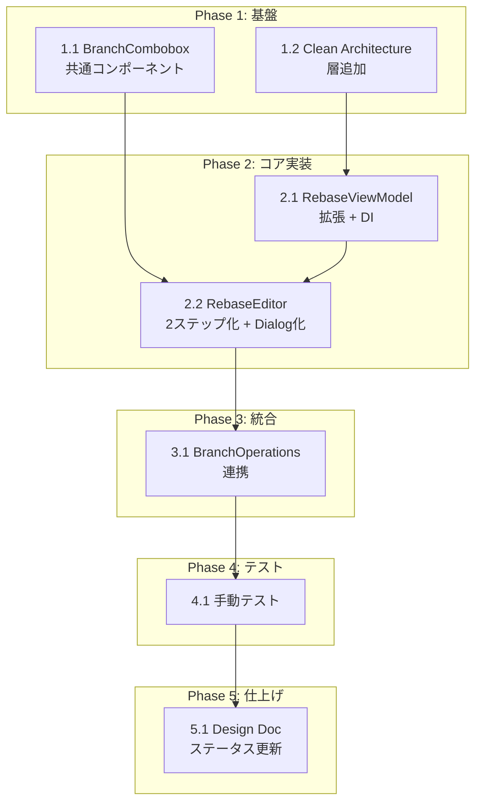

# Rebase onto ブランチ選択UI (FR-012) タスク分解

## メタ情報

| 項目 | 内容 |
|:---|:---|
| 機能名 | Rebase onto ブランチ選択UI |
| 対象要求 | FR-012 (FR_712) |
| 技術設計書 | [ui-integration-advanced-git-operations_design.md](../../specification/ui-integration-advanced-git-operations_design.md) |
| 抽象仕様書 | [ui-integration-advanced-git-operations_spec.md](../../specification/ui-integration-advanced-git-operations_spec.md) |
| 作成日 | 2026-04-11 |

## 決定事項サマリー

| 項目 | 決定内容 |
|:---|:---|
| ブランチ一覧取得 | ViewModel + Clean Architecture（Repository IF → 実装 → UseCase → ViewModel） |
| 表示形式 | Dialog 化（MergeDialog と統一、Step 1/Step 2 を Dialog 内で切替） |
| BranchCombobox の allowFreeInput | FR-012 時点で先行実装（worktree-management で再利用予定） |
| RebaseEditor Props | `{ worktreePath, initialOnto?, open, onOpenChange, onConflict?, onComplete? }`。branches と currentBranch は ViewModel 経由で取得 |

## タスク一覧

### Phase 1: 基盤

| # | タスク | 説明 | 完了条件 | 依存 |
|:---|:---|:---|:---|:---|
| 1.1 | BranchCombobox 共通コンポーネント作成 | `src/components/branch-combobox.tsx` に Popover + Command パターンで実装。Props: `{ branches: BranchInfo[], value, onValueChange, placeholder?, allowFreeInput? }`。Local/Remote グループ表示、リアルタイムフィルタリング、allowFreeInput で自由入力許可 | コンポーネントが描画でき、ブランチ選択・フィルタリング・グループ表示・自由入力が動作すること | - |
| 1.2 | ブランチ取得の Clean Architecture 層追加 | `advanced-git-operations` feature に Repository IF (`application/repositories/branch-read-repository-interface.ts`)、UseCase (`application/usecases/get-branches-usecase.ts`)、Repository 実装 (`infrastructure/branch-read-repository.ts`) を追加。`git_branches` IPC を呼び出して `BranchList` を返す | UseCase 経由で `git_branches` IPC を呼び出し、`BranchList` が取得できること | - |

### Phase 2: コア実装

| # | タスク | 説明 | 完了条件 | 依存 |
|:---|:---|:---|:---|:---|
| 2.1 | RebaseViewModel 拡張 + DI 登録 | `RebaseViewModel` IF に `branches$: Observable<BranchList \| null>` と `fetchBranches(worktreePath: string): void` を追加。`RebaseDefaultViewModel` に実装を追加。`di-tokens.ts` に `GetBranchesRendererUseCaseToken` を追加。`di-config.ts` に UseCase と Repository の DI 登録を追加 | `useRebaseViewModel()` から `branches` と `fetchBranches` が取得でき、呼び出し時にブランチ一覧が Observable で通知されること | 1.2 |
| 2.2 | RebaseEditor 2ステップ化 + Dialog 化 | `rebase-editor.tsx` を改修。(1) Dialog でラップ（`open` / `onOpenChange` Props 追加）。(2) 内部 state `step: 'select-onto' \| 'edit-commits'` で表示切替。(3) Step 1: BranchCombobox で onto 選択。(4) Step 2: 既存コミット一覧 UI。(5) `initialOnto` 指定時は Step 1 スキップ。(6) Props から `branches` と `currentBranch` を削除し ViewModel 経由に変更 | Dialog が開閉でき、Step 1 でブランチ選択→ Step 2 でコミット一覧が表示されること。initialOnto 指定時に Step 2 から直接開始すること | 1.1, 2.1 |

### Phase 3: 統合

| # | タスク | 説明 | 完了条件 | 依存 |
|:---|:---|:---|:---|:---|
| 3.1 | BranchOperations 連携 | `branch-operations.tsx` を改修。(1) `rebaseTargetBranch` state 追加。(2) RebaseEditor の呼び出しを Dialog パターンに変更（`open={rebaseOpen}` + `initialOnto={rebaseTargetBranch}`）。(3) コンテキストメニュー「このブランチへリベース」から `rebaseTargetBranch` をセットして開く。(4) RebaseEditor への `branches` / `currentBranch` Props を削除。(5) `onComplete` で `rebaseOpen` と `rebaseTargetBranch` をリセット | リベースボタンから Step 1 開始、コンテキストメニューから Step 2 直接開始の両方が動作すること | 2.2 |

### Phase 4: テスト

| # | タスク | 説明 | 完了条件 | 依存 |
|:---|:---|:---|:---|:---|
| 4.1 | 手動テスト | 以下の 2 パスを検証: (1) リベースボタン → Step 1（BranchCombobox でブランチ選択）→ Step 2（コミット一覧）→ リベース実行。(2) コンテキストメニュー「このブランチへリベース」→ Step 2 から直接開始 → リベース実行。加えて BranchCombobox のフィルタリング、Local/Remote グループ表示、Dialog のキャンセル/閉じる動作を確認 | 上記 2 パスが正常動作し、コンフリクト発生時に ConflictResolver に遷移すること | 3.1 |

### Phase 5: 仕上げ

| # | タスク | 説明 | 完了条件 | 依存 |
|:---|:---|:---|:---|:---|
| 5.1 | Design Doc ステータス更新 | `ui-integration-advanced-git-operations_design.md` の FR-012 行を `🟢` に変更。`impl-status` が全行 `🟢` なら `implemented` に更新 | Design Doc の実装ステータスが実態と一致していること | 4.1 |

## 依存関係図

## 実装の注意事項

- **A-004 準拠**: `basic-git-operations` feature の UseCase/Repository を `advanced-git-operations` から直接参照しない。`git_branches` IPC は `advanced-git-operations` の infrastructure 層に新規 Repository を作成して呼び出す
- **BranchCombobox の配置**: `src/components/branch-combobox.tsx`（feature 間共有のため `src/components/` に配置）
- **既存の shadcn/ui コンポーネント活用**: `popover.tsx` と `command.tsx` は既にインストール済み
- **Dialog 化による破壊的変更**: RebaseEditor の Props が変わるため、BranchOperations 側の呼び出しも同時に修正が必要（Phase 3）
- **RebaseEditor の Props から `branches` / `currentBranch` を削除**: ViewModel から取得するため不要になるが、削除は Phase 2.2 + Phase 3.1 で同時に行う

## 要求カバレッジ

| 要求 ID | 要求内容 | 対応タスク |
|:---|:---|:---|
| FR-012 (FR_712) | リベース実行時に onto 対象をブランチ/コミット一覧から選択形式で指定できる | 1.1, 2.2, 3.1 |
| FR-012 (Spec 4.2) | RebaseEditor 2ステップフロー（Step 1: onto 選択 / Step 2: コミット一覧） | 2.2 |
| FR-012 (Spec 4.2) | initialOnto 指定時に Step 1 スキップ | 2.2, 3.1 |
| FR-012 (Design 4.4.1) | BranchCombobox 共通コンポーネント（Local/Remote グループ、フィルタリング、allowFreeInput） | 1.1 |
| FR-012 (Design 4.4.4) | ViewModel に branches$ Observable 追加（A-004 準拠の Clean Architecture） | 1.2, 2.1 |

## 参照ドキュメント

- 抽象仕様書: [ui-integration-advanced-git-operations_spec.md](../../specification/ui-integration-advanced-git-operations_spec.md)
- 技術設計書: [ui-integration-advanced-git-operations_design.md](../../specification/ui-integration-advanced-git-operations_design.md)
- PRD: [ui-integration-advanced-git-operations.md](../../requirement/ui-integration-advanced-git-operations.md)

## 推奨する手動検証

- [ ] タスクの粒度が適切か（1タスク = 数時間〜1日程度）を確認
- [ ] 依存関係図が論理的に正しいか確認
- [ ] 要求カバレッジ表で漏れがないことを確認
- [ ] Phase 分類が適切か確認
