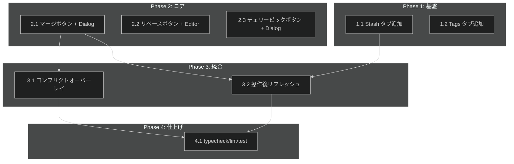

# 高度な Git 操作 UI 統合 タスク分解

## メタ情報

| 項目 | 内容 |
|:---|:---|
| 機能名 | 高度な Git 操作 UI 統合 |
| 設計書 | [ui-integration-advanced-git-operations_design.md](../../specification/ui-integration-advanced-git-operations_design.md) |
| 仕様書 | [ui-integration-advanced-git-operations_spec.md](../../specification/ui-integration-advanced-git-operations_spec.md) |
| PRD | [ui-integration-advanced-git-operations.md](../../requirement/ui-integration-advanced-git-operations.md) |
| 作成日 | 2026-04-04 |
| 変更対象ファイル | 主に 2 ファイル（RepositoryDetailPanel.tsx, branch-operations.tsx） |

## タスク一覧

### Phase 1: 基盤（タブ追加）

| # | タスク | 説明 | 完了条件 | 依存 |
|:---|:---|:---|:---|:---|
| 1.1 | RepositoryDetailPanel に Stash タブ追加 | `<TabsTrigger value="stash">Stash</TabsTrigger>` + `<TabsContent value="stash">` に `<StashManager worktreePath={worktreePath} />` を配置。import 追加 | Stash タブをクリックして StashManager が表示される。`npm run typecheck` が通る | - |
| 1.2 | RepositoryDetailPanel に Tags タブ追加 | `<TabsTrigger value="tags">Tags</TabsTrigger>` + `<TabsContent value="tags">` に `<TagManager worktreePath={worktreePath} />` を配置 | Tags タブをクリックして TagManager が表示される | - |

### Phase 2: コア実装（ダイアログ統合）

| # | タスク | 説明 | 完了条件 | 依存 |
|:---|:---|:---|:---|:---|
| 2.1 | BranchOperations にマージボタン + MergeDialog 追加 | `branch-operations.tsx` に「マージ」ボタン追加。`useState` で open 状態管理。`<MergeDialog>` を配置し、worktreePath / currentBranch / branches を Props で渡す | マージボタン→ MergeDialog 表示→ブランチ選択→マージ実行が動作 | - |
| 2.2 | BranchOperations にリベースボタン + RebaseEditor 追加 | 「リベース」ボタン追加。`<RebaseEditor>` をダイアログ的に表示。worktreePath / branches を Props で渡す | リベースボタン→ RebaseEditor 表示→コミット読み込み→操作が動作 | - |
| 2.3 | Commits タブにチェリーピックボタン + CherryPickDialog 追加 | RepositoryDetailPanel の Commits タブ内に「チェリーピック」ボタン追加。`<CherryPickDialog>` を配置 | チェリーピックボタン→ CherryPickDialog 表示→実行が動作 | - |

### Phase 3: 統合（コンフリクト解決オーバーレイ + リフレッシュ）

| # | タスク | 説明 | 完了条件 | 依存 |
|:---|:---|:---|:---|:---|
| 3.1 | コンフリクト解決オーバーレイ実装 | RepositoryDetailPanel に `conflictState` の state 追加。`conflictState.active` 時にタブを非表示にして `<ConflictResolver>` をフルパネル表示。MergeDialog / RebaseEditor / CherryPickDialog の `onConflict` から遷移。完了/中止で通常表示に戻る | マージでコンフリクト発生→ ConflictResolver 表示→解決→タブ表示に戻る | 2.1 |
| 3.2 | 操作完了後のリフレッシュ実装 | マージ・リベース・チェリーピック・スタッシュ pop/apply 完了時に既存の repository-viewer ViewModel のリフレッシュメソッドを呼び出す（git:status, git:branches, git:log） | 操作後にステータス・ブランチ一覧・コミットログが最新に更新される | 2.1, 1.1 |

### Phase 4: 仕上げ

| # | タスク | 説明 | 完了条件 | 依存 |
|:---|:---|:---|:---|:---|
| 4.1 | typecheck / lint / format / test | `npm run typecheck`, `npm run lint`, `npm run format:check`, `npm run test` が全パス | CI 相当のチェックがすべてパス | 3.1, 3.2 |

## 依存関係図

## 実装の注意事項

- **変更ファイル最小化**: 主に `RepositoryDetailPanel.tsx` と `branch-operations.tsx` の 2 ファイルのみ変更
- **既存動作を壊さない**: 既存 5 タブの動作に影響を与えない
- **Hook 再利用**: advanced-git-operations の `useMergeViewModel` 等をそのまま使用
- **worktreePath の伝播**: RepositoryDetailPanel が保持する worktreePath を各コンポーネントに Props で渡す

## 要求カバレッジ

| 要求 ID | 要求内容 | 対応タスク |
|:---|:---|:---|
| FR_501 | Branches タブからマージダイアログ起動 | 2.1 |
| FR_502 | Branches タブからリベースエディタ起動 | 2.2 |
| FR_503 | Stash タブでスタッシュ管理 | 1.1 |
| FR_504 | Commits タブからチェリーピックダイアログ起動 | 2.3 |
| FR_505 | コンフリクト発生時にコンフリクト解決パネル表示 | 3.1 |
| FR_506 | Tags タブでタグ管理 | 1.2 |
| FR_507 | 操作完了後にリフレッシュ | 3.2 |

## 参照ドキュメント

- 抽象仕様書: [ui-integration-advanced-git-operations_spec.md](../../specification/ui-integration-advanced-git-operations_spec.md)
- 技術設計書: [ui-integration-advanced-git-operations_design.md](../../specification/ui-integration-advanced-git-operations_design.md)
- PRD: [ui-integration-advanced-git-operations.md](../../requirement/ui-integration-advanced-git-operations.md)

## 推奨する手動検証

- [ ] タスクの粒度が適切か（1タスク = 数時間〜1日程度）を確認
- [ ] 依存関係図が論理的に正しいか確認
- [ ] 要求カバレッジ表で漏れがないことを確認
