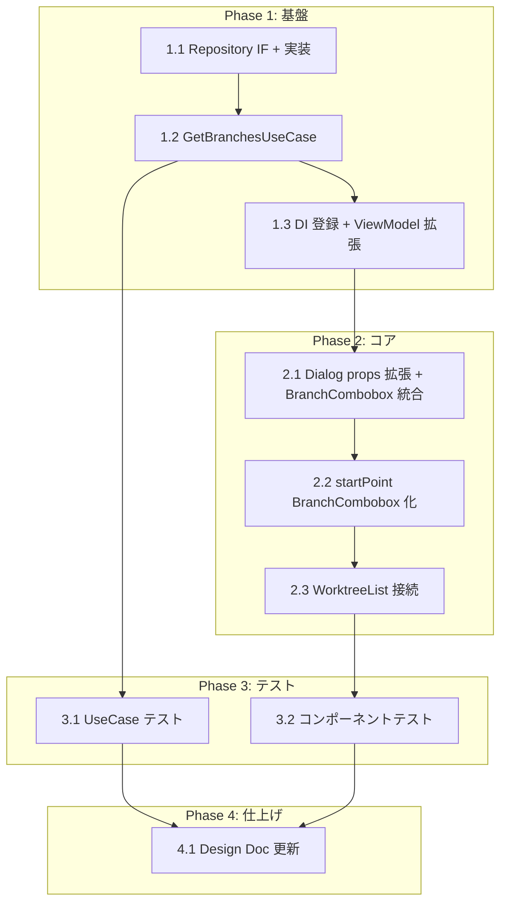

# FR_102_05: ワークツリー作成時ブランチ選択UI タスク分解

## 概要

WorktreeCreateDialog のブランチ指定フィールドを、プレーンな Input から BranchCombobox（既存共通コンポーネント）に置き換える。ローカル/リモートブランチ一覧を IPC 経由で取得し、検索・フィルタリング付きの選択UIを提供する。

また、現在 WorktreeCreateDialog 内で `invokeCommand` を直接呼び出している箇所（`worktree_default_branch`, `worktree_suggest_path`）を UseCase 経由に統一する。これはプロジェクトの全 Dialog コンポーネントが ViewModel/UseCase 経由でデータ取得する規約に合わせるためである。

## タスク一覧

### Phase 1: 基盤（Repository IF + UseCase + DI）

| # | タスク | 説明 | 完了条件 | 依存 |
|:--|:-------|:-----|:---------|:-----|
| 1.1 | WorktreeRepository に getBranches メソッド追加 | `application/repositories/worktree-repository.ts` の IF に `getBranches(worktreePath: string): Promise<BranchList>` を追加。`infrastructure/repositories/worktree-default-repository.ts` に `git_branches` IPC 呼び出しの実装を追加 | IF 定義と実装が完了し、`invokeCommand<BranchList>('git_branches', ...)` で IPC 呼び出しできる | - |
| 1.2 | GetBranchesUseCase 追加 | `di-tokens.ts` に `GetBranchesUseCase` 型エイリアス（`FunctionUseCase<string, Promise<BranchList>>`）と Token を追加。`application/usecases/get-branches-usecase.ts` に実装クラスを作成 | UseCase が WorktreeRepository.getBranches を呼び出し、BranchList を返却する | 1.1 |
| 1.3 | DI 登録と ViewModel 拡張 | 以下の4ファイルを更新する。(1) `di-config.ts`: GetBranchesUseCase の Singleton 登録（deps: `[WorktreeRepositoryToken]`）を追加し、WorktreeListViewModel の deps 配列に `GetBranchesUseCaseToken` と `SuggestPathUseCaseToken` を追加。(2) `presentation/viewmodel-interfaces.ts`: WorktreeListViewModel IF に `getBranches(worktreePath: string): Promise<BranchList>` と `suggestPath(repoPath: string, branch: string): Promise<string>` を追加。(3) `presentation/worktree-list-viewmodel.ts`: 実装クラスのコンストラクタに GetBranchesUseCase / SuggestPathUseCase を追加し、メソッドを実装。(4) `presentation/use-worktree-list-viewmodel.ts`: hook の返却値に `getBranches` と `suggestPath` を追加 | ViewModel IF・実装・hook・DI deps が全て更新され、ViewModel 経由でブランチ一覧取得とパス提案が呼び出せる | 1.2 |

### Phase 2: コア実装（BranchCombobox 統合 + invokeCommand 排除）

| # | タスク | 説明 | 完了条件 | 依存 |
|:--|:-------|:-----|:---------|:-----|
| 2.1 | WorktreeCreateDialog の props 拡張と BranchCombobox 統合 | Dialog の props に `localBranches: BranchInfo[]`, `remoteBranches: BranchInfo[]`, `defaultBranch: string`, `onSuggestPath: (repoPath: string, branch: string) => Promise<string>` を追加。ブランチ名入力欄（Input）を BranchCombobox に置換。`createNewBranch=true` 時は `allowFreeInput=true`、`false` 時は `allowFreeInput=false`。Dialog 内の `invokeCommand` import を完全に排除する | BranchCombobox でローカル/リモートブランチが表示・検索・選択でき、Dialog 内に `invokeCommand` の直接呼び出しが存在しない | 1.3 |
| 2.2 | 開始ポイント（startPoint）を BranchCombobox 化 | `createNewBranch=true` 時の開始ポイント入力欄を BranchCombobox に置換（`allowFreeInput=true`）。デフォルト値として props の `defaultBranch` をセットする | 開始ポイント欄で既存ブランチを選択、または手入力でコミットハッシュ等を指定できる | 2.1 |
| 2.3 | 親コンポーネント（WorktreeList）の接続 | WorktreeList で Dialog open 時に ViewModel 経由でブランチ一覧を取得し、Dialog に props として渡す。`suggestPath` も ViewModel 経由（既存の SuggestPathUseCase を利用）で呼び出すコールバックを渡す | WorktreeList → WorktreeCreateDialog のデータフローが ViewModel 経由に統一される | 2.2 |

### Phase 3: テスト

| # | タスク | 説明 | 完了条件 | 依存 |
|:--|:-------|:-----|:---------|:-----|
| 3.1 | GetBranchesUseCase ユニットテスト | `__tests__/get-branches-usecase.test.ts` を作成。WorktreeRepository.getBranches をモックし、UseCase が BranchList を返すことを検証 | テストが pass し、正常系・エラー系をカバー | 1.2 |
| 3.2 | WorktreeCreateDialog コンポーネントテスト | BranchCombobox 統合後のフォーム操作テスト。ブランチ選択 → パス自動提案 → 作成のフローを検証。`createNewBranch` 切り替え時の BranchCombobox の `allowFreeInput` 切り替えを検証。Dialog 内に `invokeCommand` が存在しないことを確認 | テストが pass し、主要ユーザーフローをカバー | 2.3 |

### Phase 4: 仕上げ

| # | タスク | 説明 | 完了条件 | 依存 |
|:--|:-------|:-----|:---------|:-----|
| 4.1 | Design Doc の実装ステータス更新 | `worktree-management_design.md` の実装進捗テーブルで BranchCombobox / WorktreeCreateDialog ブランチ選択UI を 🟢 に更新 | 実装ステータスが実態と一致 | 3.2 |

## 依存関係図



## 実装の注意事項

- **BranchCombobox は既存共有コンポーネント** (`src/components/branch-combobox.tsx`)。FR_712（Rebase onto UI）で作成済み。追加の修正は不要
- **A-004 準拠**: worktree-management feature は自身の Repository IF 経由で `git_branches` IPC を呼び出す（他 feature の Repository を直接参照しない）
- **IPC コマンド `git_branches` は既に登録済み** (Rust バックエンド側)。フロントエンドの `IPCChannelMap` にも定義済みなので、新規 IPC の追加は不要
- **`createNewBranch` モード切替時の UX**: `true` → BranchCombobox (`allowFreeInput=true`) で新規ブランチ名を手入力可能。`false` → BranchCombobox (`allowFreeInput=false`) で既存ブランチのみ選択
- **Dialog 内 `invokeCommand` 排除**: 現在 WorktreeCreateDialog は `worktree_default_branch` と `worktree_suggest_path` を直接 `invokeCommand` で呼んでいるが、これはプロジェクト内で唯一の不規則パターン。Phase 2 で props 経由に切り替え、Dialog 内の `invokeCommand` import を完全に排除する
- **既存の SuggestPathUseCase を活用**: `di-tokens.ts` に既に `SuggestPathUseCase` / `SuggestPathUseCaseToken` が定義・登録済み。新規 UseCase を作る必要はなく、ViewModel 経由で呼び出すだけでよい

## 要求カバレッジ

| 要求 ID | 要求内容 | 対応タスク | カバレッジ |
|:--------|:---------|:-----------|:-----------|
| FR_102_05 | ローカル/リモートブランチ一覧からの選択UI（検索・フィルタリング付き） | 1.1, 1.2, 1.3, 2.1, 2.2, 2.3 | 完全 |
| FR_102_01 | 既存ブランチを指定したワークツリー作成 | 2.1 (`allowFreeInput=false` モード) | 完全 |
| FR_102_02 | 新規ブランチを指定したワークツリー作成 | 2.1 (`allowFreeInput=true` モード) | 完全 |
| FR_102_03 | 作成先パスの指定（デフォルトパスの自動提案付き） | 既存実装済み（2.1 で UseCase 経由に修正） | 既存 |
| FR_102_04 | 作成完了後の自動切り替え | 既存実装済み（変更なし） | 既存 |

## 参照ドキュメント

- 抽象仕様書: [worktree-management_spec.md](../../specification/worktree-management_spec.md)
- 技術設計書: [worktree-management_design.md](../../specification/worktree-management_design.md)
- PRD: [worktree-management.md](../../requirement/worktree-management.md)

## 推奨する手動検証

- [ ] タスクの粒度が適切か（1タスク = 数時間〜1日程度）を確認
- [ ] 依存関係図が論理的に正しいか確認
- [ ] 要求カバレッジ表で漏れがないことを確認
- [ ] Phase 分類が適切か確認

## 検証コマンド

```bash
# 関連する設計書との整合性を確認
/check-spec worktree-management

# 仕様の不明点がないか確認
/clarify worktree-management

# チェックリストを生成して品質基準を明確化
/checklist worktree-management
```
