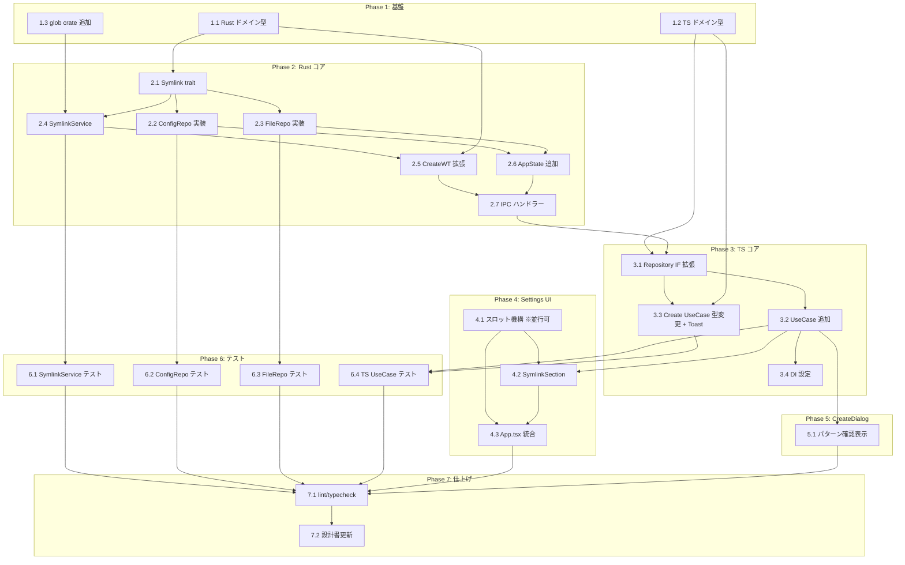

# FR_106: シンボリックリンク タスク分解

## 確定仕様

| # | 項目 | 決定 |
|---|------|------|
| Q1 | glob 探索範囲 | ルート直下のみ（再帰は `**/` で明示） |
| Q2 | ResultEntry 粒度 | パターン単位（matched/created/failed カウント付き） |
| Q3 | Settings UI 配置 | worktree-management にスロット方式（A-004 準拠） |
| Q4 | 結果通知 | Toast 通知でサマリー（sonner の `toast()` を presentation 層で呼ぶ） |
| Q5 | ローカル設定 | IPC で app/repo 両方読み書きサポート（`set` IPC は `repoPath` 引数付き） |

## レビュー対応メモ

| ID | 内容 | 対応 |
|----|------|------|
| P1 | `worktree_symlink_config_set` IPC に `repoPath` 不足 | set IPC 引数を `{ repoPath, config }` に拡張。`SymlinkConfigSetParams` 型を追加 |
| P2 | Toast 通知の層違反 | UseCase を `ConsumerUseCase` → `FunctionUseCase` に変更。ViewModel/Hook 側で `toast()` を呼ぶ |
| P3 | Rust usecase シグネチャ変更が不明確 | `create_worktree` に `SymlinkService` 構造体を渡す。メインWTパスは `list_worktrees` → `is_main` で特定 |
| P4 | `SymlinkConfigDefaultRepository` の `app_handle` 依存が未記載 | タスク 2.2/2.6 に明記 |
| D1 | タスク 2.4 の依存が過剰 | `2.1, 1.3` のみに修正 |
| D2 | タスク 4.1 は Phase 1 と並行可能 | 依存なしとしてマーク |
| C1 | SettingsDialog の既存 A-004 違反 | 注意事項に追記。既存の Claude 認証セクションのリファクタリングはスコープ外 |
| C2 | SymlinkResultEntry 型が設計書と乖離 | 確定仕様に従い、設計書の型定義も 7.2 で更新 |

## タスク一覧

### Phase 1: 基盤

| # | タスク | 説明 | 完了条件 | 依存 |
|:---|:---|:---|:---|:---|
| 1.1 | Rust ドメイン型追加 | `domain.rs` に以下を追加: (1) `SymlinkConfig { patterns: Vec<String>, source: String }` (2) `SymlinkConfigSetParams { repo_path: String, config: SymlinkConfig }` — set IPC 用パラメータ型（P1 対応） (3) `SymlinkResultEntry { pattern: String, status: String, matched: u32, created: u32, failed: u32, reason: Option<String> }` — パターン単位（Q2 確定仕様、C2 対応） (4) `SymlinkResult { entries: Vec<SymlinkResultEntry>, total_created: u32, total_skipped: u32, total_failed: u32 }` (5) `WorktreeCreateResult { worktree: WorktreeInfo, symlink: Option<SymlinkResult> }` | `cargo build` が通る。全型が `serde` の Serialize/Deserialize を derive | - |
| 1.2 | フロントエンドドメイン型追加 | `src/domain/index.ts` に Rust 側と対応する型を追加: `SymlinkConfig`, `SymlinkConfigSetParams`（`{ repoPath, config }`）, `SymlinkResultEntry`（パターン単位）, `SymlinkResult`, `WorktreeCreateResult` | `npm run typecheck` が通る | - |
| 1.3 | Cargo.toml に `glob` crate 追加 | `glob = "0.3"` を dependencies に追加 | `cargo build` が通る | - |

### Phase 2: コア実装（Rust バックエンド）

| # | タスク | 説明 | 完了条件 | 依存 |
|:---|:---|:---|:---|:---|
| 2.1 | Symlink trait 定義 | `application/symlink_interfaces.rs` を新規作成。(1) `SymlinkConfigRepository` trait: `get_config(repo_path) -> AppResult<SymlinkConfig>` — repo 優先 → app fallback で読み込み, `set_config(repo_path, config) -> AppResult<()>` — `config.source` に応じて repo または app に保存（P1 対応）。(2) `SymlinkFileRepository` trait: `create_symlink(source, target) -> AppResult<()>` — 1件の symlink 作成。`application/mod.rs` に `pub mod symlink_interfaces;` 追加 | `cargo build` が通る | 1.1 |
| 2.2 | SymlinkConfigDefaultRepository 実装 | `infrastructure/symlink_config_repository.rs` を新規作成。コンストラクタで `app_handle: AppHandle` を受け取る（P4 対応）。`source="repo"` 時は `{repo_path}/.buruma/symlink.json` を `serde_json` で読み書き。`source="app"` 時は `tauri-plugin-store` を使用（既存の `TauriStoreRepository` パターン参考）。`get_config` は repo ファイル存在 → repo 設定返却、なければ app 設定返却。`infrastructure/mod.rs` に `pub mod symlink_config_repository;` 追加 | `cargo build` が通る | 2.1 |
| 2.3 | SymlinkFileDefaultRepository 実装 | `infrastructure/symlink_file_repository.rs` を新規作成。`#[cfg(unix)]` で `std::os::unix::fs::symlink`、`#[cfg(windows)]` で `std::os::windows::fs::symlink_dir` を使い分け。ディレクトリ/ファイルの判定は `std::fs::metadata`。`infrastructure/mod.rs` に `pub mod symlink_file_repository;` 追加 | `cargo build` が通る | 2.1 |
| 2.4 | SymlinkService 実装 | `application/symlink_service.rs` を新規作成。`SymlinkService` 構造体: `symlink_file_repo: &dyn SymlinkFileRepository` を保持。`execute(main_wt_path, new_wt_path, config) -> SymlinkResult` メソッド: 各 pattern に対して `glob::glob("{main_wt_path}/{pattern}")` でルート直下マッチ → 各マッチファイルに `symlink_file_repo.create_symlink()` → パターン単位で `SymlinkResultEntry` 集計（matched/created/failed カウント）。失敗はスキップして続行。`application/mod.rs` に `pub mod symlink_service;` 追加 | `cargo test` が通る。glob マッチ → symlink 作成 → SymlinkResult 返却のフローが動作する | 2.1, 1.3 |
| 2.5 | create_worktree usecase 拡張 | `usecases.rs` の `create_worktree` 関数シグネチャを変更（P3 対応）: `create_worktree(repo: &dyn WorktreeGitRepository, symlink_config_repo: &dyn SymlinkConfigRepository, symlink_file_repo: &dyn SymlinkFileRepository, params: &WorktreeCreateParams) -> AppResult<WorktreeCreateResult>`。処理フロー: (1) `repo.add_worktree(params)` で WT 作成 (2) `symlink_config_repo.get_config(params.repo_path)` で設定取得（エラー時は symlink=None で続行） (3) `repo.list_worktrees(params.repo_path)` → `is_main` でメインWTパス特定 (4) `SymlinkService::new(symlink_file_repo).execute(main_wt_path, new_wt_path, config)` (5) `WorktreeCreateResult { worktree, symlink: Some(result) }` を返却 | `cargo build` が通る | 2.4, 1.1 |
| 2.6 | AppState に Symlink リポジトリ追加 | `state.rs` に `symlink_config_repo: Arc<dyn SymlinkConfigRepository>` と `symlink_file_repo: Arc<dyn SymlinkFileRepository>` を追加。`AppState::new()` で `Arc::new(DefaultSymlinkConfigRepository::new(app_handle.clone()))` と `Arc::new(DefaultSymlinkFileRepository)` を初期化（P4 対応: `app_handle` を渡す） | `cargo build` が通る | 2.2, 2.3 |
| 2.7 | IPC ハンドラー追加 | `commands.rs` に: (1) `worktree_symlink_config_get(repoPath: String, state)` — `state.symlink_config_repo.get_config()` を呼ぶ (2) `worktree_symlink_config_set(repoPath: String, config: SymlinkConfig, state)` — `state.symlink_config_repo.set_config()` を呼ぶ（P1 対応: `repoPath` を個別引数で受け取る） (3) `worktree_create` の戻り値型を `WorktreeCreateResult` に変更、`state.symlink_config_repo` と `state.symlink_file_repo` を `create_worktree` に渡す。`lib.rs` の `generate_handler!` に `worktree_symlink_config_get`, `worktree_symlink_config_set` を登録 | `cargo build` が通る。IPC で設定の取得・保存ができる | 2.5, 2.6 |

### Phase 3: コア実装（フロントエンド）

| # | タスク | 説明 | 完了条件 | 依存 |
|:---|:---|:---|:---|:---|
| 3.1 | WorktreeRepository IF 拡張 + DefaultRepository 実装 | `worktree-repository.ts` に: `getSymlinkConfig(repoPath: string): Promise<SymlinkConfig>`, `setSymlinkConfig(repoPath: string, config: SymlinkConfig): Promise<void>` を追加。`create()` の戻り値を `Promise<WorktreeCreateResult>` に変更。`worktree-default-repository.ts` に対応する `invokeCommand` 実装追加。`setSymlinkConfig` は `invokeCommand('worktree_symlink_config_set', { repoPath, config })` で呼び出し（P1 対応） | `npm run typecheck` が通る | 1.2, 2.7 |
| 3.2 | Symlink 設定 UseCase 追加 | `application/usecases/` に `GetSymlinkConfigUseCase`（`FunctionUseCase<string, Promise<SymlinkConfig>>`）, `SetSymlinkConfigUseCase`（`ConsumerUseCase<{repoPath: string, config: SymlinkConfig}>`）を作成。`di-tokens.ts` に Token + 型エイリアス追加 | `npm run typecheck` が通る | 3.1 |
| 3.3 | CreateWorktreeUseCase 型変更 + Toast 通知 | （P2 対応）`CreateWorktreeDefaultUseCase` を `ConsumerUseCase<WorktreeCreateParams>` → `FunctionUseCase<WorktreeCreateParams, Promise<WorktreeCreateResult>>` に変更。`invoke()` は `WorktreeCreateResult` を返す。`di-tokens.ts` の `CreateWorktreeUseCase` 型エイリアスも更新。Toast 通知は UseCase 内では行わず、ViewModel/Hook 側で `sonner` の `toast()` を呼ぶ。`WorktreeListDefaultViewModel.createWorktree()` で戻り値を `.then()` で受け取り、`symlink` 結果があれば「N件作成、N件スキップ」Toast を表示。全成功時も簡潔な Toast。リスト更新ロジック（`repo.list()` → `service.updateWorktrees()`）は維持 | `npm run typecheck` が通る。ワークツリー作成後に Toast が表示される | 3.1, 1.2 |
| 3.4 | DI 設定更新 | `di-config.ts` に `GetSymlinkConfigUseCase`, `SetSymlinkConfigUseCase` の Token 登録を追加。`CreateWorktreeUseCase` の既存登録は型変更のみで構成は変更なし | `npm run typecheck` が通る | 3.2 |

### Phase 4: 統合（Settings UI スロット方式）

| # | タスク | 説明 | 完了条件 | 依存 |
|:---|:---|:---|:---|:---|
| 4.1 | SettingsDialog スロット機構追加 | `SettingsDialog.tsx` の `SettingsDialogProps` に `children?: React.ReactNode` を追加。既存セクション群の後に `{children}` をレンダリング。既存のセクション・テストは変更なし | `npm run typecheck` が通る。既存テストが壊れない | -（Phase 1 と並行可能） |
| 4.2 | SymlinkSettingsSection コンポーネント作成 | `src/features/worktree-management/presentation/components/SymlinkSettingsSection.tsx` を作成。`useResolve` で `GetSymlinkConfigUseCase` / `SetSymlinkConfigUseCase` を取得。パターン一覧表示、追加（テキスト入力 + 追加ボタン）、削除（X ボタン）。app/repo 切り替え UI。repoPath は `WorktreeService` の `currentRepoPath` から取得 | `npm run typecheck` が通る。パターンの CRUD が UI で操作できる | 3.2, 4.1 |
| 4.3 | App.tsx で SettingsDialog に SymlinkSettingsSection を差し込み | `App.tsx` で `<SettingsDialog>` の children として `<SymlinkSettingsSection />` を渡す。A-004 準拠: application-foundation は worktree-management を直接参照しない。App.tsx（Composition Root）が両方を参照して組み立てる | `npm run typecheck` が通る。設定画面にシンボリックリンクセクションが表示される | 4.1, 4.2 |

### Phase 5: 統合（WorktreeCreateDialog パターン確認表示）

| # | タスク | 説明 | 完了条件 | 依存 |
|:---|:---|:---|:---|:---|
| 5.1 | WorktreeCreateDialog にパターン確認表示追加 | ダイアログに symlink 対象パターンの読み取り専用リストを表示。props に `symlinkPatterns?: string[]` を追加。パターンが空/未設定の場合は非表示。caller（ViewModel/Hook）が `GetSymlinkConfigUseCase` で取得してパターンを渡す | `npm run typecheck` が通る。ダイアログにパターン一覧が表示される | 3.2 |

### Phase 6: テスト

| # | タスク | 説明 | 完了条件 | 依存 |
|:---|:---|:---|:---|:---|
| 6.1 | Rust ユニットテスト: SymlinkService | glob マッチ判定（ルート直下のみ）、パターン単位結果集計（matched/created/failed）、スキップ/失敗時の継続動作、空パターンのハンドリングをテスト | `cargo test` が通る。カバレッジ ≥ 80% | 2.4 |
| 6.2 | Rust ユニットテスト: SymlinkConfigDefaultRepository | `.buruma/symlink.json` 読み込み、ファイル未存在時の app fallback、`set_config` の source 切り替え（repo/app）、不正 JSON のハンドリングをテスト | `cargo test` が通る。カバレッジ ≥ 80% | 2.2 |
| 6.3 | Rust ユニットテスト: SymlinkFileDefaultRepository | symlink 作成成功/失敗、既存 symlink 上書き、ソースファイル不在のケースをテスト | `cargo test` が通る。カバレッジ ≥ 80% | 2.3 |
| 6.4 | フロントエンド UseCase テスト | GetSymlinkConfigUseCase, SetSymlinkConfigUseCase の Repository 呼び出し確認。CreateWorktreeDefaultUseCase の型変更後の戻り値確認（`WorktreeCreateResult` を返す）。ViewModel での Toast 呼び出しテスト | `npm run test` が通る | 3.3, 3.2 |

### Phase 7: 仕上げ

| # | タスク | 説明 | 完了条件 | 依存 |
|:---|:---|:---|:---|:---|
| 7.1 | lint / typecheck / format 修正 | `npm run lint && npm run typecheck && npm run format:check` と `cargo clippy` をパス | 全 CI チェックがパス | 全タスク |
| 7.2 | 設計書更新 | `worktree-management_design.md`: (1) FR_106 関連モジュールのステータス 🔴 → 🟢 (2) `SymlinkResultEntry` 型定義を確定仕様に合わせて更新 — `{ pattern, status, targetPath?, reason? }` → `{ pattern, status, matched, created, failed, reason? }`（C2 対応） (3) `worktree:symlink-config-set` IPC 定義の引数に `repoPath` を追加（P1 対応） | 設計書が実装状態と一致 | 7.1 |

## 依存関係図



## Serena 分析結果

### 影響を受けるシンボル

| シンボル | ファイル | 参照箇所 | 対応タスク |
|:---|:---|:---|:---|
| `WorktreeRepository` (IF) | `src/features/worktree-management/application/repositories/worktree-repository.ts` | 4ファイル（DefaultRepository, di-config, di-tokens, テスト） | 3.1 |
| `WorktreeDefaultRepository.create()` | `src/features/worktree-management/infrastructure/repositories/worktree-default-repository.ts` | 直接呼び出し1箇所 | 3.1 |
| `CreateWorktreeDefaultUseCase` | `src/features/worktree-management/application/usecases/create-worktree-usecase.ts` | di-config, di-tokens, テスト | 3.3 |
| `CreateWorktreeUseCase` (型エイリアス) | `src/features/worktree-management/di-tokens.ts` | di-config, ViewModel | 3.3 |
| `WorktreeListDefaultViewModel.createWorktree()` | `src/features/worktree-management/presentation/worktree-list-viewmodel.ts` | Hook, テスト | 3.3 |
| `WorktreeCreateParams` (domain) | `src/domain/index.ts` | 8ファイル（UseCase, ViewModel, Dialog, Repository 等） | 1.2 |
| `create_worktree` (Rust usecase) | `src-tauri/src/features/worktree_management/application/usecases.rs` | commands.rs | 2.5 |
| `worktree_create` (Rust command) | `src-tauri/src/features/worktree_management/presentation/commands.rs` | lib.rs の generate_handler | 2.7 |
| `AppState` | `src-tauri/src/state.rs` | lib.rs setup | 2.6 |
| `SettingsDialog` / `SettingsDialogProps` | `src/features/application-foundation/presentation/components/SettingsDialog.tsx` | App.tsx | 4.1 |

### 追加考慮事項

- `WorktreeDefaultRepository.create()` の戻り値型が `WorktreeInfo` → `WorktreeCreateResult` に変わるため、`WorktreeRepository` IF と全呼び出し元の更新が必要
- `CreateWorktreeDefaultUseCase` が `ConsumerUseCase` → `FunctionUseCase` に変わるため、ViewModel の `createWorktree()` メソッドの戻り値も `void` → `Promise<WorktreeCreateResult>` に変更が必要
- `SymlinkConfigDefaultRepository` は `tauri-plugin-store` を使うため、`AppState::new()` で `app_handle.clone()` を渡す必要がある（既存の `TauriStoreRepository` パターンと同じ）

## 要求カバレッジ

| 要求 ID | 要件内容 | 対応タスク |
|:---|:---|:---|
| FR-023 | シンボリックリンク対象パターンをアプリデフォルト設定で管理。リポジトリローカル設定優先 | 2.2, 3.2 |
| FR-024 | ワークツリー作成時にメインWTから glob マッチしたファイルを symlink 作成 | 2.4, 2.5 |
| FR-025 | アプリ設定画面でパターンの追加・削除・一覧表示 | 4.1, 4.2, 4.3 |
| FR-026 | ワークツリー作成ダイアログでパターン確認表示 | 5.1 |
| FR-027 | symlink 作成失敗時は個別ログし続行。WT 作成は失敗させない | 2.4, 2.5, 6.1 |
| FR-028 | 対象ファイル未存在時スキップ。全パターン結果をまとめて通知 | 2.4, 3.3, 6.1 |

## 実装の注意事項

- **破壊的変更（戻り値型）**: `worktree_create` の戻り値が `WorktreeInfo` → `WorktreeCreateResult` に変わる。Rust commands.rs → TS WorktreeDefaultRepository → WorktreeRepository IF → CreateWorktreeUseCase → ViewModel の順で連鎖変更が必要
- **破壊的変更（UseCase 型）**: `CreateWorktreeUseCase` が `ConsumerUseCase` → `FunctionUseCase` に変わる。di-tokens.ts の型エイリアス、di-config.ts の登録、ViewModel の呼び出し箇所を更新
- **Toast 通知は presentation 層のみ**: `sonner` の `toast()` は ViewModel/Hook 内でのみ呼ぶ。UseCase（application 層）では呼ばない（P2 対応）
- **`app_handle` 依存**: `DefaultSymlinkConfigRepository::new(app_handle.clone())` パターン。既存の `TauriStoreRepository` と同じ
- **メインWT パス特定**: `create_worktree` usecase 内で `repo.list_worktrees()` → `is_main == true` のエントリからパスを取得。既存 `suggest_path` の `main_wt` 特定パターンと同じ
- **glob パターンはルート直下のみ**: `glob::glob("{main_wt_path}/{pattern}")` で実行。ユーザーが再帰探索したい場合は `**/node_modules` と明示する
- **Settings UI の A-004 準拠**: `SettingsDialog`（application-foundation）に `children` prop を追加。`App.tsx`（Composition Root）で `<SettingsDialog><SymlinkSettingsSection /></SettingsDialog>` と組み立てる。application-foundation が worktree-management を直接 import しない
- **既存の A-004 違反は FR_106 スコープ外**: 現在の `SettingsDialog` は `claude-code-integration` の `useClaudeAuth` を直接 import している（L11）。この既存違反のリファクタリングは FR_106 では対応しない

## 参照ドキュメント

- 抽象仕様書: [worktree-management_spec.md](../../specification/worktree-management_spec.md)
- 技術設計書: [worktree-management_design.md](../../specification/worktree-management_design.md)
- PRD: [worktree-management.md](../../requirement/worktree-management.md)

## 推奨する手動検証

- [ ] タスクの粒度が適切か（1タスク = 数時間〜1日程度）を確認
- [ ] 依存関係図が論理的に正しいか確認
- [ ] 要求カバレッジ表で漏れがないことを確認
- [ ] Phase 分類が適切か確認

## 検証コマンド

```bash
# 関連する設計書との整合性を確認
/check-spec worktree-management

# 仕様の不明点がないか確認
/clarify worktree-management

# チェックリストを生成して品質基準を明確化
/checklist worktree-management FR_106
```
