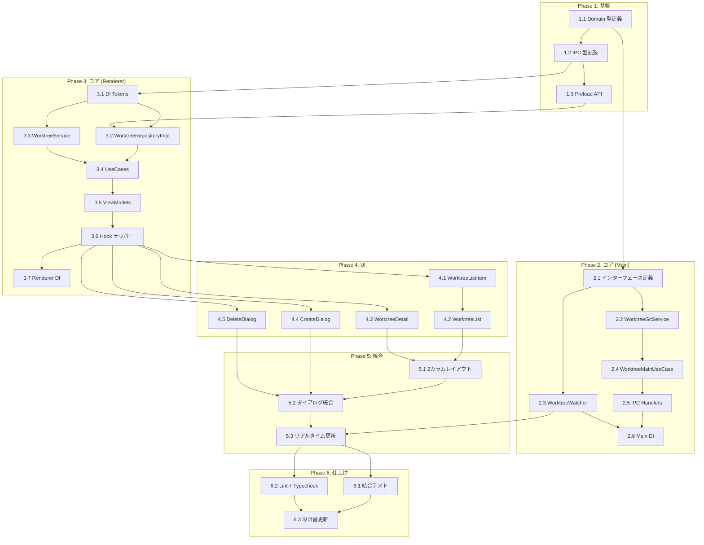

# ワークツリー管理 タスク分解

## メタ情報

| 項目 | 内容 |
|:---|:---|
| 機能名 | ワークツリー管理 |
| 設計書 | `.sdd/specification/worktree-management_design.md` |
| 仕様書 | `.sdd/specification/worktree-management_spec.md` |
| PRD | `.sdd/requirement/worktree-management.md` |
| 作成日 | 2026-03-27 |

## タスク一覧

### Phase 1: 基盤

| # | タスク | 説明 | 完了条件 | 依存 |
|:---|:---|:---|:---|:---|
| 1.1 | Shared: Domain 型定義 | `src/shared/domain/index.ts` に WorktreeInfo, WorktreeStatus, FileChange, FileChangeStatus, WorktreeCreateParams, WorktreeDeleteParams, WorktreeChangeEvent, WorktreeSortOrder を追加 | 全型が export され、`npm run typecheck` が通る | - |
| 1.2 | Shared: IPC 型拡張 | `src/shared/types/ipc.ts` に worktree チャネル（IPCChannelMap, IPCEventMap）と ElectronAPI.worktree 名前空間を追加 | 型定義が既存の IPCChannelMap/ElectronAPI と整合し、typecheck が通る | 1.1 |
| 1.3 | Preload: worktree API 追加 | `src/preload/preload.ts` の既存 electronAPI オブジェクトに worktree 名前空間（list, status, create, delete, suggestPath, checkDirty, onChanged）を追加 | preload ビルドが通り、ElectronAPI 型と一致する | 1.2 |

### Phase 2: コア実装（メインプロセス）

| # | タスク | 説明 | 完了条件 | 依存 |
|:---|:---|:---|:---|:---|
| 2.1 | Main Application: インターフェース定義 | `worktree-interfaces.ts` に IWorktreeGitService IF と IWorktreeWatcher IF を定義 | インターフェースが domain 型のみ参照し、typecheck が通る | 1.1 |
| 2.2 | Main Infrastructure: WorktreeGitService | `worktree-git-service.ts` に IWorktreeGitService の実装を作成。simple-git による listWorktrees（--porcelain パース）, getStatus, addWorktree, removeWorktree, isMainWorktree, isDirty | 各メソッドのユニットテスト（モック simple-git）が通り、カバレッジ ≥ 80%。porcelain パーサーのテストカバレッジ ≥ 90% | 2.1 |
| 2.3 | Main Infrastructure: WorktreeWatcher | `worktree-watcher.ts` に IWorktreeWatcher の実装を作成。chokidar で `.git/worktrees` を監視、300ms デバウンス、webContents.send で worktree:changed を発火 | start/stop のユニットテスト（モック chokidar）が通る | 2.1 |
| 2.4 | Main Application: WorktreeMainUseCase | `worktree-main-usecase.ts` に CRUD オーケストレーションを実装。list（dirty チェック並列）, getStatus, create, delete（メインワークツリー削除防止）, suggestPath, checkDirty | ユニットテスト（モック IWorktreeGitService）が通り、カバレッジ ≥ 80%。メインワークツリー削除時にエラーを throw する | 2.2 |
| 2.5 | Main Presentation: IPC Handlers | `ipc-handlers.ts` に wrapHandler パターンで worktree:* 全6チャネルを登録する registerIPCHandlers 関数を実装 | 各チャネルの結合テスト（UseCase モック）が通る | 2.4 |
| 2.6 | Main DI: tokens + config | `di-tokens.ts` と `di-config.ts` を作成。`src/main/di/configs.ts` に worktreeManagementMainConfig を追加 | DI コンテナが正しく解決でき、アプリ起動時にエラーが出ない | 2.5, 2.3 |

### Phase 3: コア実装（レンダラー）

| # | タスク | 説明 | 完了条件 | 依存 |
|:---|:---|:---|:---|:---|
| 3.1 | Renderer DI: tokens（IF 定義含む） | `di-tokens.ts` に WorktreeRepository IF, IWorktreeService IF, IWorktreeListViewModel IF, IWorktreeDetailViewModel IF, 全 UseCase 型エイリアス、全 Token 定義を作成 | typecheck が通る | 1.2 |
| 3.2 | Renderer Infrastructure: WorktreeRepositoryImpl | `worktree-repository-impl.ts` に WorktreeRepository の実装を作成。window.electronAPI.worktree 経由の IPC 呼び出し + IPCResult → 例外変換 | ユニットテスト（モック window.electronAPI）が通る | 3.1, 1.3 |
| 3.3 | Renderer Application: WorktreeService | `worktree-service.ts` に BehaviorSubject 状態管理を実装。worktrees$（combineLatest + sort）, selectedWorktreePath$, sortOrder$, setUp/tearDown | ユニットテスト（BehaviorSubject の状態遷移、ソート処理）が通り、カバレッジ ≥ 80% | 3.1 |
| 3.4 | Renderer Application: UseCases | `application/usecases/` に全9つの UseCase 実装クラスを作成（List, Select, Create, Delete, Refresh, SuggestPath, CheckDirty, GetSelectedWorktree, GetWorktreeStatus） | 各 UseCase のユニットテスト（モック Repository/Service）が通り、カバレッジ ≥ 80% | 3.2, 3.3 |
| 3.5 | Renderer Presentation: ViewModels | `worktree-list-viewmodel.ts` と `worktree-detail-viewmodel.ts` を作成。UseCase 経由で Observable 公開 + アクションメソッド | ユニットテスト（モック UseCase）が通り、カバレッジ ≥ 80% | 3.4 |
| 3.6 | Renderer Presentation: Hook ラッパー | `use-worktree-list-viewmodel.ts` と `use-worktree-detail-viewmodel.ts` を作成。useResolve + useObservable + useCallback | ユニットテスト（renderHook）が通る | 3.5 |
| 3.7 | Renderer DI: config | `di-config.ts` を作成（register + setUp + tearDown）。`src/renderer/di/configs.ts` に worktreeManagementConfig を追加 | DI コンテナが正しく解決でき、アプリ起動時にエラーが出ない | 3.6 |

### Phase 4: UI 実装

| # | タスク | 説明 | 完了条件 | 依存 |
|:---|:---|:---|:---|:---|
| 4.1 | WorktreeListItem コンポーネント | ワークツリー1行分の表示（ブランチ名、dirty バッジ、メインワークツリーマーク、選択状態）。Tailwind CSS + Shadcn/ui | コンポーネントテスト（描画、Props 反映）が通り、カバレッジ ≥ 60% | 3.6 |
| 4.2 | WorktreeList コンポーネント | 左パネルのワークツリー一覧。useWorktreeListViewModel を使用。選択イベント、ソート切り替え、作成ボタン | コンポーネントテスト（一覧描画、選択、ソート）が通り、カバレッジ ≥ 60% | 4.1 |
| 4.3 | WorktreeDetail コンポーネント | 右パネルの詳細表示（基本情報のみ: ブランチ、HEAD、dirty 状態、staged/unstaged 件数）。useWorktreeDetailViewModel を使用 | コンポーネントテスト（選択状態の反映、詳細表示）が通り、カバレッジ ≥ 60% | 3.6 |
| 4.4 | WorktreeCreateDialog コンポーネント | 作成ダイアログ（ブランチ名入力、パス提案、新規ブランチ/既存ブランチ切り替え、startPoint）。Shadcn/ui Dialog | コンポーネントテスト（フォーム入力、バリデーション、送信）が通り、カバレッジ ≥ 60% | 3.6 |
| 4.5 | WorktreeDeleteDialog コンポーネント | 削除確認ダイアログ（dirty チェック結果表示、force オプション、メインワークツリー削除不可表示）。Shadcn/ui Dialog | コンポーネントテスト（確認フロー、force チェック）が通り、カバレッジ ≥ 60% | 3.6 |

### Phase 5: 統合

| # | タスク | 説明 | 完了条件 | 依存 |
|:---|:---|:---|:---|:---|
| 5.1 | 2カラムレイアウト統合 | AppLayout にワークツリー一覧（左パネル）+ 詳細（右パネル）の2カラムレイアウトを組み込む | アプリ起動時に2カラムレイアウトが表示され、ワークツリー選択 → 詳細表示が動作する | 4.2, 4.3 |
| 5.2 | ダイアログ統合 | 作成・削除ダイアログを WorktreeList のボタンから呼び出し可能にする | 作成ボタン → ダイアログ表示 → 作成完了 → 一覧更新、削除ボタン → 確認 → 削除完了 → 一覧更新 の E2E フローが動作する | 5.1, 4.4, 4.5 |
| 5.3 | リアルタイム更新統合 | WorktreeWatcher → IPC event → RefreshUseCase → UI 更新のパイプラインが動作することを確認 | 外部でワークツリーを追加/削除した際に、UI が自動更新される | 5.2, 2.3 |

### Phase 6: テスト・仕上げ

| # | タスク | 説明 | 完了条件 | 依存 |
|:---|:---|:---|:---|:---|
| 6.1 | 結合テスト | IPC Handlers → WorktreeMainUseCase → WorktreeGitService の主要フロー結合テスト（list, create, delete） | 結合テストが通る | 5.3 |
| 6.2 | Lint + Typecheck | `npm run lint` と `npm run typecheck` が全ファイルで通ることを確認 | エラーゼロ | 5.3 |
| 6.3 | 設計書の実装ステータス更新 | `worktree-management_design.md` のセクション1.1の全モジュールを 🟢 に更新、impl-status を `implemented` に変更 | design doc の実装ステータスが最新 | 6.1, 6.2 |

## 依存関係図



## 実装の注意事項

- **simple-git の worktree サポート:** `git.raw(['worktree', 'list', '--porcelain'])` を使用する可能性がある。実装時に simple-git API を検証すること（設計書 9.2 未解決課題）
- **chokidar + Electron 41 互換性:** 実装時に検証。問題がある場合は `fs.watch` + 自前デバウンスにフォールバック
- **RefreshWorktreesUseCase の repoPath 取得:** application-foundation の RepositoryService（currentRepository$）から取得する。feature 間依存は shared インターフェース経由で解決する
- **ConsumerUseCase のエラーハンドリング:** `invoke()` が void を返す UseCase では、Promise reject を ErrorNotificationService 経由でハンドリングする（application-foundation パターン参照）
- **Phase 2 と Phase 3 は並行実施可能:** メインプロセス側とレンダラー側は独立して実装できる

## 要求カバレッジ

| 要求 ID | 要求内容 | 対応タスク |
|:---|:---|:---|
| UR_101 | Worktree-First UI | 4.2, 5.1 |
| UR_102 | 全ワークツリー一覧表示 | 2.2, 2.4, 3.3, 3.4, 4.2 |
| UR_103 | 安全な作成・削除 | 2.4, 4.4, 4.5, 5.2 |
| UR_104 | スムーズな切り替え | 3.4, 4.2, 5.1 |
| FR_101 | 一覧表示 | 2.2, 2.4, 3.4, 4.1, 4.2 |
| FR_102 | ワークツリー作成 | 2.2, 2.4, 3.4, 4.4, 5.2 |
| FR_103 | ワークツリー削除 | 2.2, 2.4, 3.4, 4.5, 5.2 |
| FR_104 | ワークツリー切り替え | 3.3, 3.4, 4.2, 5.1 |
| FR_105 | 状態監視 | 2.3, 3.2, 5.3 |
| NFR_101 | 一覧表示1秒以内 | 2.4（Promise.all 並列 dirty チェック） |
| NFR_102 | 切り替え500ms以内 | 2.4, 3.4 |
| DC_101 | git worktree コマンド経由 | 2.2 |

**カバレッジ:** 12/12 要求（100%）

## 参照ドキュメント

- 抽象仕様書: `.sdd/specification/worktree-management_spec.md`
- 技術設計書: `.sdd/specification/worktree-management_design.md`
- PRD: `.sdd/requirement/worktree-management.md`

## 推奨する手動検証

- [ ] タスクの粒度が適切か（1タスク = 数時間〜1日程度）を確認
- [ ] 依存関係図が論理的に正しいか確認
- [ ] 要求カバレッジ表で漏れがないことを確認
- [ ] Phase 分類が適切か確認

## 検証コマンド

```bash
# 関連する設計書との整合性を確認
/check-spec worktree-management

# 仕様の不明点がないか確認
/clarify worktree-management

# チェックリストを生成して品質基準を明確化
/checklist worktree-management
```
